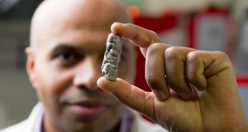
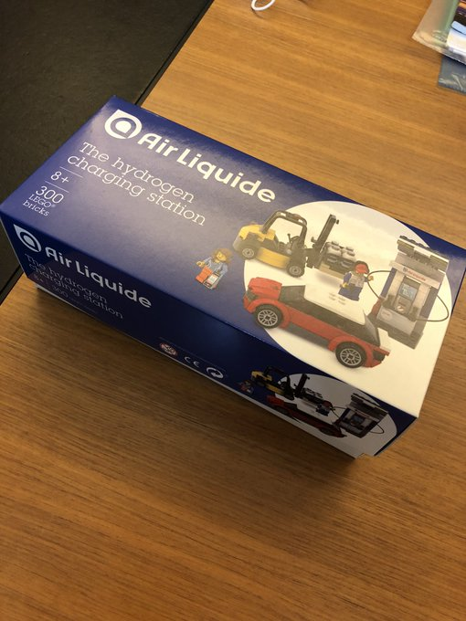

# Week 27

"@glambymykaila

Oh now all of a sudden it’s my body my choice?? Interesting"

>@DailyCaller People marching in Florida protesting against a
>mandatory mask order are chanting “My body. My choice.”

---

"UNSW researchers report mass hydrogen storage
breakthrough. [R]esearchers led by Kondo-Francois Aguey-Zinsou say
they have developed metal alloys capable of storing surplus
electricity in the form of hydrogen much more cheaply than lithium
batteries to take advantage of the renewables rush"

[Link](https://amp.theage.com.au/environment/climate-change/alchemy-of-energy-breakthrough-offers-mass-hydrogen-storage-options-20200702-p558dj.html)

---

"@gabriel_zucman

There's an archaic and regressive wealth tax in America -- called the
property tax -- and guess what, its effective rate is higher for Black
and Hispanic residents"

[Link](https://www.motherjones.com/kevin-drum/2020/07/study-suggests-black-families-pay-unfairly-high-property-taxes/)

---

Nice.. wonder what event he was referring to.. Russia-Persian war?

H. Marks: "Henry Kissinger was a member of [our] board when I worked
there, and a few times each year I was privileged to hear him hold
forth on world affairs. Someone would ask, 'Henry, can you explain
yesterday’s events in Bosnia?' and he’d say, 'Well, in 1722...' The
point is that chain reaction-type events can only be understood in the
context of that which went before."

---

Shoulda gone for clean fuel, but hey, why beat up on this guy

"@RebuildsRich

The Tesla fanboys formed like Voltron and ganged up to flag my video
for removal on youtube. The video which was flagged for 'inappropriate
content' was about me selling my Tesla and buying a gas car
instead. Ladies and gentlemen, this is what happens when you anger the
hive"

---

I hear you on the Sodium borohydride, but word is it is expensive to
make.

$NaBH_4 + 2 H_2 O → NaBO_2 + 4H_2$

is cool... no doubt. $NaBH_4$ looks inert as fuck too..

---

<blockquote class="twitter-tweet">
I feel for you.
&mdash; Paul Ryan (@otherpaulryan) <a href="https://twitter.com/otherpaulryan/status/1278728333006692354?ref_src=twsrc%5Etfw">July 2, 2020</a></blockquote> 

---

Bcz they'll be software services, installed and uninstalled?

It's so wrong..

Also soft updates 1 GB in size.. My my my ...

"Your next BMW might only have heated seats for 3 months"

[Link](https://www.cnet.com/roadshow/news/bmw-vehicle-as-a-platform/)

---

"@NicholasDanfort

I have nothing remotely new or original to say about the ongoing
denial of democratic rights in southeastern Turkey except that the
closer you look the more outrageous it is"

---

That must be the catch of the day

<blockquote class="twitter-tweet">
Just in case you haven’t seen a bird flying around with a shark that it just plucked out of the ocean... <a href="https://t.co/ILKqd9wrFG">pic.twitter.com/ILKqd9wrFG</a>
&mdash; Rex Chapman🏇🏼 (@RexChapman) <a href="https://twitter.com/RexChapman/status/1278705237570867200?ref_src=twsrc%5Etfw">July 2, 2020</a></blockquote> 

---

<blockquote class="twitter-tweet">
Ditching Diesel for Green Microgrids: <a href="https://twitter.com/Enapter_?ref_src=twsrc%5Etfw">@Enapter_</a> writes in <a href="https://twitter.com/h2_view?ref_src=twsrc%5Etfw">@h2_view</a> how green hydrogen storage &amp; fuel cells now enable cost-effective microgrid energy systems that eliminate the need for diesel generators altogether. Read more: <a href="https://t.co/vpj8TIdxWQ">https://t.co/vpj8TIdxWQ</a><a href="https://twitter.com/hashtag/FuelCells?src=hash&amp;ref_src=twsrc%5Etfw">#FuelCells</a> <a href="https://twitter.com/hashtag/SayNoTo?src=hash&amp;ref_src=twsrc%5Etfw">#SayNoTo</a> Diesel
&mdash; GenCell Energy (@gencellenergy) <a href="https://twitter.com/gencellenergy/status/1278728687941271556?ref_src=twsrc%5Etfw">July 2, 2020</a></blockquote> 

---

"@greg_doucette

Seattle, WA: police are back to using pepper spray, two weeks after
the Seattle City Council voted 9-0 to ban the use of pepper spray"

---

"@ProfMattFox

Did anyone else just realize they left a half eaten sandwich on their
desk in the office four months ago?"

---

Jazzrausch Bigband mit Beethoven's Breakdown \#music

[Link](https://youtu.be/jmOk7JyZqis?t=3216)

---

<blockquote class="twitter-tweet">
Introducing the European Large Logistic Lander, a proposed lunar lander to carry cargo for <a href="https://twitter.com/hashtag/Artemis?src=hash&amp;ref_src=twsrc%5Etfw">#Artemis</a>, science and even samples returned from the <a href="https://twitter.com/hashtag/Moon?src=hash&amp;ref_src=twsrc%5Etfw">#Moon</a> 👉 <a href="https://t.co/YdffRRAaQw">https://t.co/YdffRRAaQw</a> <a href="https://twitter.com/hashtag/ForwardToTheMoon?src=hash&amp;ref_src=twsrc%5Etfw">#ForwardToTheMoon</a> <a href="https://twitter.com/esaspaceflight?ref_src=twsrc%5Etfw">@esaspaceflight</a> <a href="https://t.co/uUDqDHpRqQ">pic.twitter.com/uUDqDHpRqQ</a>
&mdash; ESA (@esa) <a href="https://twitter.com/esa/status/1278712602860965890?ref_src=twsrc%5Etfw">July 2, 2020</a></blockquote> 

---

I shouldnt make fun.. guy will be frickin tzar soon

---

😂😂😂

[Poutine](https://en.m.wikipedia.org/wiki/Poutine)

---

Another win for Poutine 

---

"Kremlin claims 'unambiguous triumph' in referendum allowing Putin to
rule until 2036"

---

*The Atlantic*: "As Donald Trump’s America continues to shatter records
for daily infections, France, like most other developed nations and
even some undeveloped ones, seems to have beat back the virus.The
numbers are not ambiguous. From a peak of 7,581 new cases across the
country on March 31, and with a death toll now just below 30,000—at
one point the world’s fourth highest—there were just 526 new cases on
June 13, the day we masked ourselves and took the train back to
Paris. The caseload continues to be small and manageable. ..

America, however, is an utter disaster. Texas, Florida, and Arizona
are the newest hubs of contagion, having apparently learned nothing
from the other countries and states that previously experienced surges
in cases. I stared at my phone in disbelief when the musician Rosanne
Cash wrote on Twitter that her daughter had been called a “liberal
pussy!” in Nashville for wearing a mask to buy groceries.That insult
succinctly conveys the crux of the problem. American leadership has
politicized the pandemic instead of trying to fight it. I see no
preparedness, no coordinated top-down leadership of the sort we’ve
enjoyed in Europe"

[Link](https://www.theatlantic.com/ideas/archive/2020/07/america-land-pathetic/613747)

---

"A leaked draft of the EU’s forthcoming Hydrogen Strategy shows where
the next energy competition is coming from. After Germany’s
announcement last week of €9 billion investment in hydrogen
technology, eyes are turning to the UK"

[Link](https://www.thetimes.co.uk/edition/comment/britain-should-cut-loose-from-chinese-fuel-and-lead-a-hydrogen-revolution-zgrmfphlf)

---

"INOVIO Announces Positive Interim Phase 1 Data For INO-4800 Vaccine
for COVID-19 ... Analyses to date have shown that 94% [responded well
to treatment]"

[Link](http://ir.inovio.com/news-releases/news-releases-details/2020/INOVIO-Announces-Positive-Interim-Phase-1-Data-For-INO-4800-Vaccine-for-COVID-19/default.aspx)

---

<blockquote class="twitter-tweet">
An epidemiologist, an ICU doctor, and a scientist walk into a bar....  Just kidding.
&mdash; Amanda Weinstein (@ProfWeinstein) <a href="https://twitter.com/ProfWeinstein/status/1278152452508876803?ref_src=twsrc%5Etfw">July 1, 2020</a></blockquote> 

---

DIE motherfrackers

"Chesapeake Energy, fracking pioneer, files for bankruptcy owing $9b"

---

The "people governance" part of populism is a crock, obviously. The
sorta thing you'll hear from second rate demagogues of Middle
East.. There is no such thing... As long as there is a concentrated,
centralized system, there will always be representative government
where leadership matters.

---

Part of the reason for the prevalence of this word "populism" is
because it provides cover for cons "doing bunch of leftist shit". All
of a sudden some of them started talking about worker rights, worker
paychecks, but they can't quite bring themselves to say these things
are leftist having demonized the word for so long, so they need a
different word, and that is populism.

---

3D printed meat

<iframe width="340" src="https://www.youtube.com/embed/fLpeeUYtW94" frameborder="0" allow="accelerometer; autoplay; encrypted-media; gyroscope; picture-in-picture" allowfullscreen></iframe>

---

Don't beat yourself up son. After the fall of the Berlin Wall, with
all that "euphoria", there is no way US would not end up tilting to
right especially since Reagan and HW were seen who crushed the
Soviets, two Republican presidents (just like Democrats winning WWII
gave their slant of governance legitimacy). Afterwards left would go
right, right would go insane, [polarization](../../2018/05/polarization.html)
would increase.. on and on.. 

Now there is need for some correction.. 

---

@dfinity

"DFINITY believes that making the internet a free market again will
lead to a boom in innovation like the one we saw in the dot-com days,
with startups exploring new ways to make money."

---

@theemdphd

Me: every one of my 40 Chrome tabs is precious I couldn't possibly
narrow these down

Also me when my computer crashes and the tabs don't recover: I can't
remember a single tab I had open

---

<blockquote class="twitter-tweet">
UK-based <a href="https://twitter.com/hashtag/fuelcell?src=hash&amp;ref_src=twsrc%5Etfw">#fuelcell</a> engineering company <a href="https://twitter.com/intellenergy?ref_src=twsrc%5Etfw">@intellenergy</a> has this week established a formal distribution with US-based <a href="https://twitter.com/hashtag/ParryLabs?src=hash&amp;ref_src=twsrc%5Etfw">#ParryLabs</a> better serve the US market in response to increased demand.<a href="https://twitter.com/hashtag/H2View?src=hash&amp;ref_src=twsrc%5Etfw">#H2View</a> <a href="https://twitter.com/hashtag/hydrogen?src=hash&amp;ref_src=twsrc%5Etfw">#hydrogen</a><a href="https://t.co/KFHXqPOGJZ">https://t.co/KFHXqPOGJZ</a>
&mdash; H2 View (@h2_view) <a href="https://twitter.com/h2_view/status/1278345739001888770?ref_src=twsrc%5Etfw">July 1, 2020</a></blockquote> 

---

<blockquote class="twitter-tweet">
.<a href="https://twitter.com/JCBmachines?ref_src=twsrc%5Etfw">@JCBmachines</a> has developed what it claims to be the construction industry’s first ever <a href="https://twitter.com/hashtag/hydrogen?src=hash&amp;ref_src=twsrc%5Etfw">#hydrogen</a>-powered excavator. <a href="https://t.co/Wd5Y1n2EIC">https://t.co/Wd5Y1n2EIC</a>
&mdash; Joanna Sampson (@JoSamps92) <a href="https://twitter.com/JoSamps92/status/1278316611859025922?ref_src=twsrc%5Etfw">July 1, 2020</a></blockquote> 

---

<blockquote class="twitter-tweet">
In the air over Syria, the US and Russia have been bumping up against each other since September 2015. This is what war looks like now. Two adversaries pushed together without either declaring the other hostile, so we exist uncomfortably together. It’s just on the ground now <a href="https://t.co/JYX4iJTR7E">https://t.co/JYX4iJTR7E</a>
&mdash; Aaron Stein (@aaronstein1) <a href="https://twitter.com/aaronstein1/status/1278342922275094529?ref_src=twsrc%5Etfw">July 1, 2020</a></blockquote> 

---

Aaah you were doing fine so far tech person, but now swept up by
politics, and started sharing that centrist DNC junk... That's a
straight Unfollow.

---

\#H2 LEGO Kit

---

Skylar Spence - Bounce Is Back \#music

[Link](https://youtu.be/YpEMFqijpng?t=44)

---

I remember that case, the way it was talked abt in corporate press and
among ppl was an example of overlitigation of US, as in some ambulance
chaser lawyer was now using coffee burns to make money.

"@kokoinkorea

[In 1994 let's] remember that McDonalds served their coffee at 190
degrees, which is hot enough to leave 3rd degree burns in just 3
seconds of contact with skin. They knew this and decided to serve the
coffee at 190 degrees because it had ...

a longer shelf life than serving it at the standard 160 degrees. They
calculated that burn related law suits would cost less than just
wasting coffee that wasn’t good anymore. They risked people getting
deadly burns to save money. And when the big law suit happened they
slandered ...

the victim, who had 3rd degree burns on 16% of her body and nearly
died from shock. They painted her out to be dumb for not realizing
that coffee would be hot and made it seem like a frivolous lawsuit of
someone who was trying to scam them.

also literally all the victim, Stella Liebeck, wanted was that
McDonalds pay her 20,000 medical bills because she was poor and
medicaid wouldn’t cover them. Then the media made her out to be a
greedy scammer"

---

Author says he might have been suffering from "hip certainty" when he
comdemned Nix too quickly in his younger days. 

"He inherited the catastrophic Lyndon Johnson-concocted Vietnam War
inside the Cold War, and yet Nixon found ways to get out of Southeast
Asia, invent détente with Leonid Brezhnev’s Soviet Union, open
dialogue with Mao Zedong’s China and manage nuclear brinksmanship in
South Asia and in the Middle East"

[Link](https://www.thedailybeast.com/how-ive-learned-to-appreciate-nixon)

---

---

Reuters, space mining

[Link](https://mobile.twitter.com/LauraForczyk/status/1278006368054763520)

---

360 deg rotation bitch. Top mount for horiz, the cross inside ring
hooked on the left for vertical.

---

Aaaah found a short-term soln now, but I wanted to see this
working too.. maybe later.

---

A generous rich guy who wants to be taxed?

"@megangailey

What does a Porsche with a Bernie sticker mean?"

---

"@secupp

Trump's determination to give his supporters the orgy of anti-science,
anti-expert, anti-left, pro-white, red meat they crave isn't exactly
paying off. He's bleeding white voters"

---

\#texas

---

"Dfinity creates TikTok-style app that doesn’t snoop on your
data... The creators of the ‘Internet Computer’ are showcasing a
decentralized version of TikTok to prove a point"

[Link](https://decrypt.co/34057/dfinity-creates-tiktok-style-app-that-doesnt-snoop-on-your-data?utm_source=twitter&utm_medium=social&utm_campaign=auto)

---

"India bans 59 Chinese apps including TikTok, Helo, WeChat"

---

<blockquote class="twitter-tweet">
When it comes to investing in the decentralized web, Olaf Carlson-Wee (Polychain Capital) prioritizes products, apps and business models native to the new internet. <a href="https://t.co/qzl4T7Ykw6">pic.twitter.com/qzl4T7Ykw6</a>
&mdash; DFINITY Foundation (@dfinity) <a href="https://twitter.com/dfinity/status/1278020790089216000?ref_src=twsrc%5Etfw">June 30, 2020</a></blockquote> 

---

"@SleepyHead_band

Eliminate tax payer funding for all private schools"

---

I hate burgeois bullshit

"@J_Dot_J

Had to do my hair (which is in desperate need of a touch up and trim,
thanks Texas COVID) and makeup today for the first time since February
and man, we really did this bullshit every day?"

---

<blockquote class="twitter-tweet">
India finalises draft for regulation on <a href="https://twitter.com/hashtag/hydrogen?src=hash&amp;ref_src=twsrc%5Etfw">#hydrogen</a>, interested for use in the heavy duty segment. Government already reduced GST from from 28% to 12%. Some major OEMs are also eyeing India for sales of <a href="https://twitter.com/hashtag/fuecell?src=hash&amp;ref_src=twsrc%5Etfw">#fuecell</a> cars too but more support will be needed. <a href="https://t.co/9dMN2ukXdC">https://t.co/9dMN2ukXdC</a> <a href="https://t.co/vhzg8eS6or">pic.twitter.com/vhzg8eS6or</a>
&mdash; Hydrogen &amp; Fuel Cell Pilot (@FuelCellPilot) <a href="https://twitter.com/FuelCellPilot/status/1278002801340223488?ref_src=twsrc%5Etfw">June 30, 2020</a></blockquote> 

---

🙄

It's crazy if u think abt it... 

"Europe and Mexico are suffering from a carbon dioxide shortage"

[Link](https://nationalpost.com/news/world/why-theres-a-co2-shortage/wcm/237ee5fb-5827-4dc4-8593-8ce203747ab4/)

---

Is that Greek hip hop?

---

Noizy ft. Snik - New Benz \#music

[Link](https://youtu.be/WI24xsb5gOo?t=74)

---

<blockquote class="twitter-tweet">
Daimler Truck AG has today said it is consistently driving forward series production of fuel cells with Daimler Truck Fell Cell, a joint venture developed by Daimler Truck and Volvo Group. <a href="https://twitter.com/hashtag/hydrogen?src=hash&amp;ref_src=twsrc%5Etfw">#hydrogen</a> <a href="https://t.co/NQp2pQY4Dx">https://t.co/NQp2pQY4Dx</a>
&mdash; Joanna Sampson (@JoSamps92) <a href="https://twitter.com/JoSamps92/status/1277964546221543425?ref_src=twsrc%5Etfw">June 30, 2020</a></blockquote> 

---

"@whitequark

i'm not actually sure what a normal person would use a 1 Gbps uplink
for. i have a completely ordinary 600 Mbps connection and Steam
downloading a game only uses like 300 Mbps, becoming CPU-bound after
that"

---

"@Jkylebass

It appears that Communist China is beginning to stir the pot in
Taiwan. The CCP looks to be executing the Hong Kong shuffle in
Taiwan. The world's democracies won't stand for this
aggression. Crippling sanctions are coming"

---

"China’s campaign of ‘genocide’ could bring the U.S. and E.U. closer together"

[Link](https://www.washingtonpost.com/world/2020/06/30/chinas-campaign-genocide-could-bring-us-eu-closer-together/#click=https://t.co/aAIeD5kSuj)

---

"@skdh

Far-UVC light (222 nm) efficiently and safely inactivates airborne
human coronaviruses"

---

"@RyseHydrogen

As @grantshapps endorses proposals for an 'all-hydrogen bus town',
Ryse and \#JoBamford sign significant three-year contract with Suttons
Tankers to transport bulk hydrogen to different locations in the
UK"

---

Seeing search results from `github.io` addresses always makes me
glad. Cuz I know the author of the post is tech savy, most likely has
code to go along with math which is exactly what I look for.

---

Aah, came back full circle to the great Kailath!

Awesome book.

---

Internet of Cows

"Connecterra gets €7.8m boost for connected cows"

[Link](https://sifted.eu/articles/connecterra-connected-cows/)

---

<blockquote class="twitter-tweet">
Battery-powered flying taxis projects are doomed — <a href="https://twitter.com/hashtag/hydrogen?src=hash&amp;ref_src=twsrc%5Etfw">#hydrogen</a> is the only fuel that makes sense for vertical take-off aircraft designed for urban settings 👉by <a href="https://twitter.com/maijapalmer?ref_src=twsrc%5Etfw">@maijapalmer</a> <a href="https://t.co/8IF8AclVzG">https://t.co/8IF8AclVzG</a>
&mdash; 𝔻𝕠𝕞𝕚𝕟𝕚𝕢𝕦𝕖 𝕃𝕖𝕔𝕠𝕔𝕢 🌏 (@Lecocq_dom) <a href="https://twitter.com/Lecocq_dom/status/1277497016998858753?ref_src=twsrc%5Etfw">June 29, 2020</a></blockquote> 

---

"@nuclearkatie

I get it, radioactive waste is interesting cuz radioactivity, but also
most radioactive waste facilities are just.... fancy highly-engineered
dumps? People rarely think about where trash goes, but we produce tons
and tons of chemical waste that NEVER decays as well"

---

The eyes look even freakier with the mask on

---

Another culling, this time for machine learning follows

---

<blockquote class="twitter-tweet">
It has regularly been said: &quot;More people have walked on the moon than have been to the bottom of the ocean.&quot;   As a result of our six dives to Challenger Deep in the past three weeks and our activities last year:  That is no longer true. <a href="https://t.co/7ZCwqDt2LI">pic.twitter.com/7ZCwqDt2LI</a>
&mdash; Victor Vescovo (@VictorVescovo) <a href="https://twitter.com/VictorVescovo/status/1277606741274816512?ref_src=twsrc%5Etfw">June 29, 2020</a></blockquote> 

---

"@mikeduncan

I love how these people are fucking *terrified* of the French
Revolution yet all they do is cut taxes, eliminate social programs,
and give their golf buddy a no-bid contract that lets them sell the
fabric of society at a 10,000% markup"

---

"@ppolitics

On June 30, 2000, eight Senate Democrats joined 48 Republicans to kill
an amendment from Sen. Paul Wellstone that would have set strong
pricing rules for drugs developed with public funding"

---

Simulation fleshes out mistakes early on.. great.

---

<blockquote class="twitter-tweet" data-conversation="none">
Wing Tip Vortices 4x High Speed Video (source: Keith Armstrong) <a href="https://t.co/ARZys9S4mD">pic.twitter.com/ARZys9S4mD</a>
&mdash; Survols (Aeronautics and Space) (@Survols) <a href="https://twitter.com/Survols/status/1277670563838820359?ref_src=twsrc%5Etfw">June 29, 2020</a></blockquote> 

---

<blockquote class="twitter-tweet">
US taxpayers spent $70,000,000 developing this drug. This is an absolute robbery. <a href="https://t.co/6qSMOlmqWF">https://t.co/6qSMOlmqWF</a>
&mdash; Public Citizen (@Public_Citizen) <a href="https://twitter.com/Public_Citizen/status/1277670809310552064?ref_src=twsrc%5Etfw">June 29, 2020</a></blockquote> 

---

This is a form of distributed app system I talked about before.

<iframe width="340"  src="https://www.youtube.com/embed/lcC4zVpc13Q" frameborder="0" allow="accelerometer; autoplay; encrypted-media; gyroscope; picture-in-picture" allowfullscreen></iframe>

---

Quantic - The 5th Exotic \#music

[Link](https://youtu.be/agoX6JBNSRQ?t=19)

---

*The Guardian*: "Hydrogen fuel bubbles up the agenda as investments
rocket. Governments and carmakers press on with hydrogen fuel cells to
power cars, buses, trains and even aircraft.

More than 50 years ago hydrogen fuel cells helped put Neil Armstrong
on the moon, but mainstream usage of the technology has remained
elusive since. Now there are signs that may be changing, with a spate
of new investments even amid the coronavirus pandemic"

[Link](https://www.theguardian.com/environment/2020/jun/28/hydrogen-fuel-bubbles-up-the-agenda-as-investments-rocket)

---

Looks promising; `pymunk`

---

That's funny even tho is a complete crock

"@SarahLongwell25

Describe the Trump presidency in one drink.

I’ll go first: White Russian"

---

From almost 10 years ago. 

[Answer](../../2011/09/lottery.html)

"Lotteries are stupid. My math friend told me so"

---

"@thehill

Progressives zero in on another House chairman in primary"

[Link](http://hill.cm/fsvtLSt)

---

"@bigblackjacobin

Pokémon, not Children of Men, is the greatest expression of capitalist
realism in today’s culture"

---

If they chose to, fine; But if it turns out they are culturally so
different, and they are concentrated in a certain region, then local
governance..? In Germany south is Catholic, north is Protestan, and
guess what, local loc gov is strong. Conservatives of both regions
don't even compete against eachother. Con of south CSU and con of north
CDU govern together if elected, during elections stay out of
eachother's way.

Not sure what TR minorities will do .. The only state response these
people ever saw was one authoritarian regime after another.

"You said US acceptance of subcultures makes their assimilation
easier. Do you want TR Kurds to assimilate?"

---

"@oliviasolon

Wondering how many tech workers have realized, in the absence of all
the perks and corporate coddling they get on campus, that their
company’s mission is meaningless"

---

"@GavinNewsom

NEW: Due to the rising spread of \#COVID19, CA is ordering bars to
close in Fresno, Imperial, Kern, Kings, Los Angeles, San Joaquin, and
Tulare, while recommending they close in Contra Costa, Riverside,
Sacramento, San Bernardino, Santa Barbara, Santa Clara, Stanislaus, &
Ventura"

---

<blockquote class="twitter-tweet">
I want to let everyone know how sorry I am for this picture that has resurfaced. I was Young (3) and I just didn’t know what I do now. I’m going to stop using this platform but then resurface in a year and half, no changes made. To my fans: be sure to terrorize people in my name. <a href="https://t.co/wz4dWENCJR">pic.twitter.com/wz4dWENCJR</a>
&mdash; Allison Reese (@monsterreese) <a href="https://twitter.com/monsterreese/status/1277318351501524999?ref_src=twsrc%5Etfw">June 28, 2020</a></blockquote> 

---

Dude wasnt just a dumb Excel user, he was prophetic!

<blockquote class="twitter-tweet">
Well, I&#39;ll be damned, it really is a cubic. <a href="https://t.co/zBs1FbIjST">pic.twitter.com/zBs1FbIjST</a>
&mdash; Jordan Ellenberg (@JSEllenberg) <a href="https://twitter.com/JSEllenberg/status/1277318596528607233?ref_src=twsrc%5Etfw">June 28, 2020</a></blockquote> 

---

Good good.. seeing more alternatives... One
[model](https://arxiv.org/abs/1104.2822) makes QM as emergent, an
approximation, another re-drives gravity.

---

Erik V used to be a stringer, but quit it bcz it was going
nowhere. You don't need ST for emergent gravity, there are references
to a certain math used there that's it

---

Eric Verlinde: "Gravity has given many hints of being an emergent
phenomenon, yet up to this day it is still seen as a fundamental
force. The similarities with other known emergent phenomena, such as
thermodynamics and hydrodynamics, have been mostly regarded as just
suggestive analogies. It is time we not only notice the analogy, and
talk about the similarity, but finally do away with gravity as a
fundamental force.

Of course, Einstein’s geometric description of gravity is beautiful,
and in a certain way compelling. Geometry appeals to the visual part
of our minds, and is amazingly powerful in summarizing many aspects of
a physical problem. Presumably this explains why we, as a community,
have been so reluctant to give up the geometric formulation of gravity
as being fundamental. But it is inevitable we do so. If gravity is
emergent, so is space time geometry. Einstein tied these two concepts
together, and both have to be given up if we want to understand one or
the other at a more fundamental level"

[Link](https://arxiv.org/abs/1001.0785)

---

This approach isn't abt [quantizing gravity](https://youtu.be/5foUTeRdqII?t=358)

---

There are two good things abt the Verlinde model now.. One, it has no
free parameters, two, it can explain dark matter (says it doesn't
exist, but explains why it is thought to be there).

His type of theory is called 'emergent gravity', he claims gravity
emerges from entropy and information. Like temparature is an emergent
property of particle interactions.

---

<blockquote class="twitter-tweet">
These face masks were supposed to say “NYC strong” in Yiddish but the Etsy designer didn’t realize that Yiddish is spelled from right to left so they accidentally wrote “NYC crotch” and it’s amazing <a href="https://t.co/Mc8bp693cR">https://t.co/Mc8bp693cR</a>
&mdash; Hannah Lebovits (@HannahLebovits) <a href="https://twitter.com/HannahLebovits/status/1277232452080144384?ref_src=twsrc%5Etfw">June 28, 2020</a></blockquote> 

---

<blockquote class="twitter-tweet">
<a href="https://twitter.com/hashtag/Jaguar?src=hash&amp;ref_src=twsrc%5Etfw">#Jaguar</a> <a href="https://twitter.com/hashtag/LandRover?src=hash&amp;ref_src=twsrc%5Etfw">#LandRover</a> is developing a premium <a href="https://twitter.com/hashtag/hydrogen?src=hash&amp;ref_src=twsrc%5Etfw">#hydrogen</a> SUV. The so-called &quot;<a href="https://twitter.com/hashtag/Zeus?src=hash&amp;ref_src=twsrc%5Etfw">#Zeus</a> Project&quot; is part of a program funded with £ 73.5 million by the British government and the private sector (Delta Motorsport, Marelli Automotive Systems UK and UKBIC). <a href="https://twitter.com/hashtag/fuelcell?src=hash&amp;ref_src=twsrc%5Etfw">#fuelcell</a> <a href="https://twitter.com/hashtag/H2?src=hash&amp;ref_src=twsrc%5Etfw">#H2</a> <a href="https://twitter.com/hashtag/FCV?src=hash&amp;ref_src=twsrc%5Etfw">#FCV</a> <a href="https://t.co/jl4hQ8cvof">pic.twitter.com/jl4hQ8cvof</a>
&mdash; Hydrogfan (@hydrogfan) <a href="https://twitter.com/hydrogfan/status/1277201536477732870?ref_src=twsrc%5Etfw">June 28, 2020</a></blockquote> 

---

"@ryanshrout

[Range limit] is fundamentally the big problem with EV still. Range
anxiety is real, cold weather range sucks, and people that don’t think
that’s true are blinded by shiny objects.

'@paulbraren Our Long Range AWD (barely) handles winter & 100
miles-each-way drives to NYC & Boston w/ no charging'"

---

<blockquote class="twitter-tweet">
import numpy as scipy
&mdash; Hassan Najjar (@hknajjar) <a href="https://twitter.com/hknajjar/status/1276981031497654272?ref_src=twsrc%5Etfw">June 27, 2020</a></blockquote> 

---

Unbelievable

"@NBCNews

The mayor of St. Louis is facing backlash for reading aloud during a
public briefing the full names and street addresses of protesters who
are calling on the city to defund the police department"

---

"@bencbartlett

parent: if all your friends jumped off a cliff, would you do it too? 

machine learning model: yes"

---

"Why a small town in Washington is printing its own currency during the
pandemic In a bid to lessen the blow of COVID-19, the town of Tenino
has started issuing its own wooden dollars that can only be spent at
local businesses. Will it work?"

[Link](https://thehustle.co/covid19-local-currency-tenino-washington/)

---

Kasparov: "AI is a tool. This is why the phrase 'AI ethics' bothers
me, because it feels too much like an attempt to blame a tool – humans
must always remain responsible for the bad decisions."

---

\#geekJoke

---

"@JSEllenberg

Ability to tolerate prolonged mental discomfort is an underrated
mathematical virtue"

---

That's the idea

"@kateesackhoff

Ron Moore has said he just randomly chose what characters to switch to
women. He never gave it a thought. The best part was BSG NEVER talked
about Starbuck being a woman...she was just Starbuck 🤷🏼‍♀️"

---

No. I am for expertise. Go to Wash, get better at what you
do. Journalists, keep pols in check. That term limit concept, along
with a lot of "populist", "people governance" biz is now coming to an
end, it seems. See Jesse Ventura (for term limits, ousider etc).. Good
guy but nothing going on there.. tone is like Trump's (who actually
along with McCain copied his style), and DJT himself might check out
soon?

"Are you for term limits?"

---

No. This is the scale you want gov to be involved, and this is the
right discussion to have.. Higgs Boson was confirmed in 2012, 8 years
ago.. LHC did some good. WWW came out of CERN. But it is becoming
clear String Theory will not get confirmation from LHC. Continue discussion.

"If LHC (Large Hadron Collider) is wasteful spending, isn't that a
case against gov spending"

---

"One month since the death of George Floyd and 100 days since
lockdowns began, our problems remain vast, but our democratic will is
growing stronger"

[Link](https://www.huffpost.com/entry/hope-in-the-time-of-coronavirus_n_5ef61c19c5b612083c4ced78)

---

It's probably [cultural](../../2020/07/robot-frankenstein.html). Fine 4
you, but at policy level morons think culturally. You can *sell*
culturally but that's different.

"But I'm scared of human-like robots"

---

@AyoPockeylove

My dad is in jail on a conspiracy charge. Which means people said he had drugs on him but they never found drugs on him. You can kill somebody and still get out of jail before my dad. They gave him 2 life sentences. A couple years ago they made this law illegal..let my dad go!

---

We need to engineer this shit better. 

---

Locust.. OKay 

"Locust swarm blankets city in India"

<blockquote class="twitter-tweet">
This the view from my 15th floor window in Gurgaon. Swarms and swarms of locusts! <a href="https://t.co/s9deeOOfhV">pic.twitter.com/s9deeOOfhV</a>
&mdash; Joy Bhattacharjya (@joybhattacharj) <a href="https://twitter.com/joybhattacharj/status/1276763081511628801?ref_src=twsrc%5Etfw">June 27, 2020</a></blockquote> 

---

<blockquote class="twitter-tweet">
Fifty years of research suggests ”Escalating force by police leads to more violence, not less, and tends to create feedback loops, where protesters escalate against police, police escalate even further, and both sides become increasingly angry and afraid.” <a href="https://t.co/rM4RNjmvDv">https://t.co/rM4RNjmvDv</a>
&mdash; Omar Wasow (@owasow) <a href="https://twitter.com/owasow/status/1276535855306309632?ref_src=twsrc%5Etfw">June 26, 2020</a></blockquote>  
---

<blockquote class="twitter-tweet">
Well it had the word insurance in it
&mdash; Ken Klippenstein (@kenklippenstein) <a href="https://twitter.com/kenklippenstein/status/1276726333008236544?ref_src=twsrc%5Etfw">June 27, 2020</a></blockquote> 

---

DJT net popul -15.5%

\#538

---

Udacity; coulda added a little object icon for the thing moving in
physics_sim and make 3D plotting explicit. And all that RL
junk.. Barf. You bastardized the main topic of that example.

---

"@fab_hinz

Location of yesterday's explosion inside the Khojir missile
development complex. This particular site seems to belong to Shahid
Bakeri Industrial Group, which is responsible for the production of
Iran's solid-propellant missiles"

---

"@EFF

BREAKING: California's Senate just voted 30-9 to move @SenGonzalez_33
's SB 1130 to the Assembly. The legislation, sponsored by @EFF, will
create a fiber infrastructure program to end the digital divide for
Californians lacking high-speed broadband"

---

Fan of Michelle Hurd. Great on *Picard*. Spotted her on *Hawaii Five
0*, and I swear saw her on *Doctor Who* as some kind of cat alien.

---

"@IEA_Hydrogen

The global Fuel Cell market size is valued at 5.057 Billion USD in
2020 and is expected to reach 40.030 Billion USD by the end of 2026,
growing at a CAGR of 34.0% during 2021-2026"

[Link](http://ow.ly/ZABm50Afxfx)

---

"The US Department of Treasury’s imposition this June of the so-called
Caesar Civilian Protection Act, a draconian set of economic sanctions
on Syria, amounts to a medieval-style siege on all Syrians living
inside the country"

[Link](https://thegrayzone.com/2020/06/25/us-qatari-intelligence-deception-produced-the-caesar-sanctions-syria-famine/amp/)

---

"@mirandayaver

FDR had polio. I’m quite sure that he would have taken seriously a
deadly pandemic.

'Tom Brady's coronavirus message: Only thing we have to fear is fear
itself'"

---

"@Jkylebass

Now that the predatory 'no-bid' OBOR contract with the Chinese has
been declared illegal by Kenyan courts, other African nations being
preyed upon and bribed by the CCP should default in a chain-reaction.

OBOR is the chinese Communist’s method of bribing local officials to
take on crippling debt for overpriced projects that are then built by
chinese slave labor. The chinese workers are brought into 'work camps'
and fed by the CCP. There is next to zero local positive GDP impact

And the CCP expects payments on the projects to be made in USD. It’s
time for an African Jubilee on illegal chinese loans.

'Contract for Kenya’s China-funded railway ruled illegal'"

---

"California mandates zero-exhaust big rigs, large pickups"

[Link](https://calmatters.org/environment/2020/06/california-zero-emission-trucks)

---

"@jayvanbavel

I keep seeing viral hot takes on the Stanford Prison Experiment &
police brutality. While it's tempting to conclude that people in a
position of authority automatically become abusive, that's not what
the study reveals"

---

And whatever can handle big scale will win the small. There will be a
lot of incentives to use one solution for everything. Alts will become
Betamax.

"In the next 10 years [H2] will prove that it is the best choice for
at-scale decarbonisation"

[Link](https://eusew.eu/todayeusew-day-3)

---

