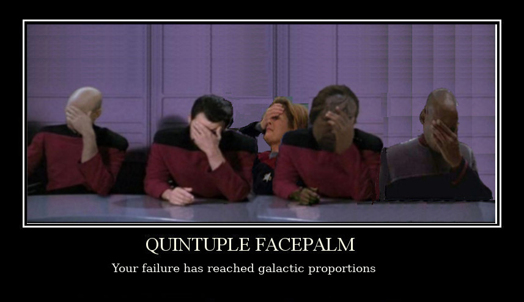
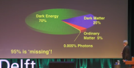
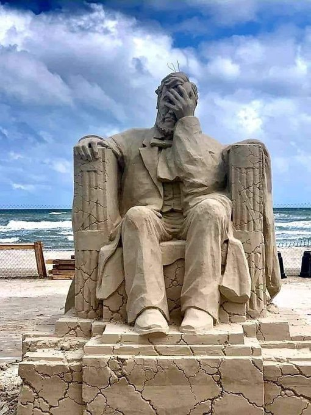
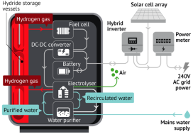

# Week 28

"@stevemorris__

I feel like I’ve generally been healthily pessimistic about the
pandemic since the beginning and still the past week has really felt
like a sinking in of the idea that nothing is going to be normal for
3+ years?"

---

<blockquote class="twitter-tweet"><p lang="en" dir="ltr">It&#39;s a service economy because it takes 1/10th as many people to make steel today as it did 100 years ago. And the other nine had to find something else to do. <a href="https://t.co/tsOv5mnJ1T">https://t.co/tsOv5mnJ1T</a></p>&mdash; Binyamin Appelbaum (@BCAppelbaum) <a href="https://twitter.com/BCAppelbaum/status/1281411860261208066?ref_src=twsrc%5Etfw">July 10, 2020</a></blockquote> <script async src="https://platform.twitter.com/widgets.js" charset="utf-8"></script>

---

"A Congressional Budget Office report commissioned by Sen. Bernie
Sanders and published Wednesday found the amount of unpaid taxes from
2011 to 2013 averaged around 381 billion dollars per year, a revenue
shortfall the Vermont senator called an 'absolute outrage'"

[Link](https://www.commondreams.org/news/2020/07/09/absolute-outrage-sanders-rips-wealthy-tax-cheats-cbo-estimates-381-billion-annual)

---

Reuters:  "Energy industry veterans to launch hydrogen investment fund"

[Link](https://mobile.reuters.com/article/amp/idUSKBN24A1X4)

---

The last of my blogspot blog hits the dust, now all in markdown. There
is no 'add post' button. There is no 'publish' button. Just files, and
`git push`.


---

Just watched *The Outpost* (based on a true story). They made it sound
like USG built the outpost in an indefensible position by mistake. Cld
be intentional. The place was a like a honey pot, pulling Tali
fighters in. At a bad night mil lost what, 7 ppl?, other side close to
hundred. 

---

<blockquote class="twitter-tweet"><p lang="en" dir="ltr"><a href="https://twitter.com/hashtag/Hyundai?src=hash&amp;ref_src=twsrc%5Etfw">#Hyundai</a> <a href="https://twitter.com/hashtag/Xcient?src=hash&amp;ref_src=twsrc%5Etfw">#Xcient</a> Fuel Cell semi truck reports for duty in Europe <a href="https://twitter.com/hashtag/Hydrogen?src=hash&amp;ref_src=twsrc%5Etfw">#Hydrogen</a> <a href="https://twitter.com/hashtag/FuelCell?src=hash&amp;ref_src=twsrc%5Etfw">#FuelCell</a> <a href="https://t.co/QeSMNwHmgI">https://t.co/QeSMNwHmgI</a></p>&mdash; BayoTech On-Site Hydrogen Generation (@H2Bayo) <a href="https://twitter.com/H2Bayo/status/1281224064212832258?ref_src=twsrc%5Etfw">July 9, 2020</a></blockquote> <script async src="https://platform.twitter.com/widgets.js" charset="utf-8"></script>

---

"@MiaFarrow

I was in Manhattan today. Did not see a single person without a mask. Not one"

---

<blockquote class="twitter-tweet"><p lang="en" dir="ltr">.<a href="https://twitter.com/MissionH24?ref_src=twsrc%5Etfw">@MissionH24</a> now has its own <a href="https://twitter.com/hashtag/hydrogen?src=hash&amp;ref_src=twsrc%5Etfw">#hydrogen</a> filling station! Officially inaugurated yesterday on the <a href="https://twitter.com/24hoursoflemans?ref_src=twsrc%5Etfw">@24hoursoflemans</a> track and ready to power the 1st ever hydrogen-powered racing car championship! <a href="https://twitter.com/SymbioFCell?ref_src=twsrc%5Etfw">@SymbioFCell</a> <a href="https://t.co/uiZaE0o4lJ">https://t.co/uiZaE0o4lJ</a></p>&mdash; Michelin (@Michelin) <a href="https://twitter.com/Michelin/status/1281141362503626757?ref_src=twsrc%5Etfw">July 9, 2020</a></blockquote> <script async src="https://platform.twitter.com/widgets.js" charset="utf-8"></script>

---

Australian CSIRO had tech for a while now to "crack ammonia" basically
converting it on site to take hydrogen out. H2 fuel stations can take
ammonia, and serve H2 right there for their HFC car customers.

Links

[CSIRO](https://www.ammoniaenergy.org/articles/csiro-demonstrates-ammonia-to-hydrogen-fueling-system/)

[H2 Fuel News](http://www.hydrogenfuelnews.com/afc-energy-successfully-integrates-alkaline-fuel-cells-with-ammonia/8537563/amp)

[Proactive Investors](https://www.proactiveinvestors.com/companies/news/211982/afc-energy-tapped-into-growth-of-hydrogen-fuel-use-211982.html)

[GenCell](http://www.youtube.com/watch?v=drdDt1ski1I)

---

Ammonia! Good choice.

"The completed facility will produce 650 tons of green hydrogen daily,
enough to run around 20,000 hydrogen-fueled buses, Air Products
said. The fuel will be shipped as ammonia to end markets globally then
converted back to hydrogen. Ammonia production is expected to start in
2025" 

[Link](https://www.greentechmedia.com/articles/read/us-firm-unveils-worlds-largest-green-hydrogen-project)

---

<blockquote class="twitter-tweet"><p lang="en" dir="ltr">Plans to construct a $5bn world-scale green <a href="https://twitter.com/hashtag/hydrogen?src=hash&amp;ref_src=twsrc%5Etfw">#hydrogen</a>-based ammonia production facility powered by renewable energy in <a href="https://twitter.com/hashtag/SaudiArabia?src=hash&amp;ref_src=twsrc%5Etfw">#SaudiArabia</a> have been unveiled today by <a href="https://twitter.com/airproducts?ref_src=twsrc%5Etfw">@airproducts</a>. <a href="https://t.co/X9EcNLVPJe">https://t.co/X9EcNLVPJe</a></p>&mdash; Joanna Sampson (@JoSamps92) <a href="https://twitter.com/JoSamps92/status/1280527697282772993?ref_src=twsrc%5Etfw">July 7, 2020</a></blockquote> <script async src="https://platform.twitter.com/widgets.js" charset="utf-8"></script>

---

<blockquote class="twitter-tweet"><p lang="en" dir="ltr">Chesterfield Special Cylinders (CSC) has signed a five-year Framework Agreement with Shell Hydrogen to supply <a href="https://twitter.com/hashtag/hydrogen?src=hash&amp;ref_src=twsrc%5Etfw">#hydrogen</a> storage cylinders for use at refuelling stations across Europe. <a href="https://t.co/2yIH3biUFz">https://t.co/2yIH3biUFz</a></p>&mdash; Joanna Sampson (@JoSamps92) <a href="https://twitter.com/JoSamps92/status/1281126001725104128?ref_src=twsrc%5Etfw">July 9, 2020</a></blockquote> <script async src="https://platform.twitter.com/widgets.js" charset="utf-8"></script>

---

<blockquote class="twitter-tweet"><p lang="en" dir="ltr">The show villain The real villain <a href="https://t.co/ys0lkHy8ei">pic.twitter.com/ys0lkHy8ei</a></p>&mdash; Alex Peter (@LolOverruled) <a href="https://twitter.com/LolOverruled/status/1281098658092630016?ref_src=twsrc%5Etfw">July 9, 2020</a></blockquote> <script async src="https://platform.twitter.com/widgets.js" charset="utf-8"></script>

---



---

"@DRxKatherine

American healthcare in a nutshell

'@DGlaucomflecken Spent 3 hours on the phone with Cigna
today. Apparently I should have been more careful about choosing
in-network doctors while I was intubated in the ICU'"

---

"@BCAppelbaum

Don't really care how [Biden] uses the word
[woke](https://mobile.twitter.com/seanhannity/status/1280998300397776900). Delighted
that he's outraged by noncompete agreements"

---

<blockquote class="twitter-tweet"><p lang="en" dir="ltr">EU <a href="https://twitter.com/hashtag/hydrogen?src=hash&amp;ref_src=twsrc%5Etfw">#hydrogen</a> plan: <br><br>I. 6GW of renewable <a href="https://twitter.com/hashtag/h2?src=hash&amp;ref_src=twsrc%5Etfw">#h2</a> from electrolysers by 2024 and 1 m tonnes of renewable h2. <br><br>II. up to 2030 40GW capacity and 10m tonnes. <br><br>III. After that renewable<br>hydrogen will be deployed at a large scale. <a href="https://t.co/xkesbUOWgX">https://t.co/xkesbUOWgX</a> <a href="https://t.co/3lfrnJVqOU">pic.twitter.com/3lfrnJVqOU</a></p>&mdash; Hydrogen Standard (@H2Standard) <a href="https://twitter.com/H2Standard/status/1280979586260635648?ref_src=twsrc%5Etfw">July 8, 2020</a></blockquote> <script async src="https://platform.twitter.com/widgets.js" charset="utf-8"></script>

---

TikTok is a Chink app isnt it? Yes FB and other apps are prob doing the
same. But I double worry bcz it's a Chink app. India banned the shit FYI

<blockquote class="twitter-tweet"><p lang="en" dir="ltr">A guy on reddit reversed engineered <a href="https://twitter.com/hashtag/TikTok?src=hash&amp;ref_src=twsrc%5Etfw">#TikTok</a><br><br>Here’s what he found on the data it collects on you<br><br>It’s far worse than just stealing what’s on your clipboard: <a href="https://t.co/oqaQyYDXT2">pic.twitter.com/oqaQyYDXT2</a></p>&mdash; Dan Okopnyi 🇺🇦 (@d1rtydan) <a href="https://twitter.com/d1rtydan/status/1277081198624337920?ref_src=twsrc%5Etfw">June 28, 2020</a></blockquote> <script async src="https://platform.twitter.com/widgets.js" charset="utf-8"></script>

---

Thinking like a closer. V good

\#ABC

Barkan: "[F]uture leftist presidential campaigns will need to reckon
with a traditional media apparatus that isn’t going anywhere. Noam
Chomsky is right—the dominant mass media organizations are
profit-driven colossi that, too often, safeguard the interests of the
rich and powerful. Capitalism is their article of faith. That doesn’t
mean, however, the left can’t have a strategy for confronting this
reality and mitigating hostile coverage"

[Link](https://rossbarkan.substack.com/p/what-went-wrong-for-bernie-sanders)

---

"@kartpath

I'm tired of watching our movement lose winnable races by tiny
margins. The next time a @Booker4KY, or @JCisnerosTX, or
@cristinafortx declares their candidacy, we should have their backs on
day one"

[Link](https://twitter.com/kartpath/status/1280874087917682688)

---

Tired of "apps", "web sites", or even "platforms"; the next big thing
coming out of SV should be all decentralization focused, for apps, for
e-cash, for anything

---

"In recent decades, corporations have taken over the internet with
proprietary networks that provide access in exchange for the loss of
privacy and ownership. The result has been an extractive data economy
that primarily serves a handful of tech giants to the detriment of
competition and innovation — and which is ripe for an intervention.

What might it mean to reboot the internet and make it open again?
Advancements in the decentralized web such as the Internet Computer ..
can put control and ownership of networks back into the hands of the
public. ...

'Platform risk is this concept that, if you’re an entrepreneur or an
investor in startups, there is a huge existential risk that looms over
all software development, essentially, is that at some point if you’re
successful, the big guy that you’re dependent on will come and extract
rents,' remarked Dixon. 'And in some cases much worse.'

'Like in the case of Zynga,' he went on, 'Facebook just changed all
the rules. It just destroyed the economics. Twitter changed their API
that just literally killed off overnight a huge swath of startups,
like Twitter clients and things that depend on the API.'"

[Link](https://medium.com/dfinity/rebooting-the-internet-andreessen-horowitzs-chris-dixon-on-the-decentralized-web-e0b4b0245645)

---

I put it in same category as;

"what do you call cheese that's not yours?

nacho cheese"

---

😁😁😁 Goofy.. but I like it

<blockquote class="twitter-tweet"><p lang="en" dir="ltr">Cancel him? But I barely Noam</p>&mdash; Richard Bibeault (@Duderichy) <a href="https://twitter.com/Duderichy/status/1280880028369276938?ref_src=twsrc%5Etfw">July 8, 2020</a></blockquote> <script async src="https://platform.twitter.com/widgets.js" charset="utf-8"></script>

---

"@TheBrianMcManus

The Irish covid tracking app is baller. It simply trades a code over
bluetooth to anyone you have had close contact with. When you get a
positive diagnosis you get a 6 digit code to put into the app to
notify everyone who's code you have collected. No location data needed"

---

BTW, I keep hearing words like "populists like Bolsonaro, Trump,
BJ". These are very different politicians. Bol is like an 80s Rayban
wearing Latin American dictator, still obsessed with chasing
Communists. Trump talked left, but essentially could not deliver all
of it, mixed up some other toxic stuff, it might likely crater his
party. BJ might deliver, but will Tories play along?

---

No, bitch. There is left, that's it. It is ideally delivered in a left
party, rightist most likely mix it with other things making the whole
thing combustible.

"There is left populism and there is right populism"

---

Tech infrastructure, homes.. these are good things. Hope he pulls it off.

---

And here is the "Tory PM" [announcing](https://youtu.be/0qZ_FpIEhGY?t=1173)
the British NEW DEAL.

---

Talked abt the "original sin"; starting with fall of the Berlin Wall,
left went right, right went insane, and now, in the final phase
"outsiders" are jumping in con parties, doing leftist work in there as
the need for such approaches never went away, that some label
"populist".

---

Generally I am for (at least) two big parties covering two sides of
the spectrum. It matters.. CDU in Germany failed to "act right" during
the refugee crisis now Nazis are on the rise. There was a vacuum and
they filled it.

---

Right acting left..

"@danbloom1

Looking at Labour's Future Jobs Fund (set up in 2009, scrapped by
David Cameron) and wow people weren't kidding when they said Rishi
Sunak's new scheme is similar..."

---

My theory is lack of empire always helped Europe, Renaissance cld
never take place with "Holy" Roman Empire around. Later possible
empires failing helped. So EU should thank the Brits?

G. Friedman, "There were many reasons for the inability of the
Europeans to unite, but in the end it came down to a simple feature of
geography: the English Channel. First the Spanish, then the French,
and finally the Germans managed to dominate the European continent,
but none of them could cross the Channel. Because noone could defeat
Britain, conqueror after conqueror failed to hold Europe as a whole".

---

<blockquote class="twitter-tweet"><p lang="en" dir="ltr">To become climate-neutral by 2050, Europe needs to transform its energy system.<br>▶️ Watch <a href="https://twitter.com/TimmermansEU?ref_src=twsrc%5Etfw">@TimmermansEU</a> and <a href="https://twitter.com/KadriSimson?ref_src=twsrc%5Etfw">@KadriSimson</a> present the EU strategies for Energy System Integration and Hydrogen.<br>They will bolster the <a href="https://twitter.com/hashtag/EUGreenDeal?src=hash&amp;ref_src=twsrc%5Etfw">#EUGreenDeal</a> and the green recovery<a href="https://t.co/ykCGKX1lgU">https://t.co/ykCGKX1lgU</a></p>&mdash; European Commission 🇪🇺 (@EU_Commission) <a href="https://twitter.com/EU_Commission/status/1280804957436948480?ref_src=twsrc%5Etfw">July 8, 2020</a></blockquote> <script async src="https://platform.twitter.com/widgets.js" charset="utf-8"></script>

---

Also anthropology, for everyone.

---

Everyone who is pushing the boundaries, especially in physics, need to
know epistemology. What can be known, what is optimal to
know... basically knowledge about knowledge.

---

<blockquote class="twitter-tweet"><p lang="en" dir="ltr">Canada and Australia sign MOU to increase collaboration in hydrogen and fuel cell technologies 🇨🇦🇦🇺⚡️ - <a href="https://t.co/rbHJZJxtKk">https://t.co/rbHJZJxtKk</a><a href="https://twitter.com/H2MobilityAus?ref_src=twsrc%5Etfw">@H2MobilityAus</a> <a href="https://twitter.com/Austrade?ref_src=twsrc%5Etfw">@Austrade</a> <a href="https://twitter.com/TCS_SDC?ref_src=twsrc%5Etfw">@TCS_SDC</a> <a href="https://twitter.com/hashtag/Canada?src=hash&amp;ref_src=twsrc%5Etfw">#Canada</a> <a href="https://twitter.com/hashtag/Australia?src=hash&amp;ref_src=twsrc%5Etfw">#Australia</a> <a href="https://t.co/xWsmp5LRcc">pic.twitter.com/xWsmp5LRcc</a></p>&mdash; CHFCA (@PoweringNow) <a href="https://twitter.com/PoweringNow/status/1280555288232226816?ref_src=twsrc%5Etfw">July 7, 2020</a></blockquote> <script async src="https://platform.twitter.com/widgets.js" charset="utf-8"></script>

---

How? Through Don Cheadle in [Golden Girls](https://youtu.be/BGDfMo-LX2Q)?
Yeah. Scary 😶

Great of course *that* also gets talked about. 

"But US kept on criticizing that flag"

---

Absolutely. Imagine, a side fights, and *loses* a war, and the other
side allows them to keep their statues, flags, and even send the
occasional President to Washington. And keep on this policy until it
literally couldn't, which is probably now. Letting shit be, this is
America. It lets "Italians", "Polish", etc to say, call whatev the
frack they want to call themselves, albeit delusional, they can say
it, just like Confederate states live with their symbols as if they
won the war.

"You said US lets subcultures be, allows to be how they are, as a form
of light assimilation. Were Confedarate symbols part of that?"

---

Pretty diverse list of people

"Our cultural institutions are facing a moment of trial. Powerful
protests for racial and social justice are leading to overdue demands
for police reform, along with wider calls for greater equality and
inclusion across our society, not least in higher education,
journalism, philanthropy, and the arts. But this needed reckoning has
also intensified a new set of moral attitudes and political
commitments that tend to weaken our norms of open debate and
toleration of differences in favor of ideological conformity. As we
applaud the first development, we also raise our voices against the
second"

Signed by Steven Pinker, Noam Chomsky, Zephyr Teachout, Fareed Zakaria, et al

[Link](https://harpers.org/a-letter-on-justice-and-open-debate/)

---

Such an asshole. Unbelievable.

"Bolsonaro tested positive for the coronavirus"

---

<blockquote class="twitter-tweet"><p lang="en" dir="ltr">...and science.</p>&mdash; Joshua Ulrich (@joshua_ulrich) <a href="https://twitter.com/joshua_ulrich/status/1280567218233884672?ref_src=twsrc%5Etfw">July 7, 2020</a></blockquote> <script async src="https://platform.twitter.com/widgets.js" charset="utf-8"></script>

---

"@AllanQuatermai9

'I think that science fiction, even the corniest of it, even the most
outlandish of it, no matter how badly it's written, has a distinct
therapeutic value because all of it has as its primary postulate that
the world does change'"

---

"@JoSamps92

Plans to construct a 5bn dollar world-scale green \#hydrogen-based
ammonia production facility powered by renewable energy in
\#SaudiArabia have been unveiled today by @airproducts"

---

"Coronavirus herd immunity may be 'unachievable' after study suggests
antibodies disappear after weeks in some people"

[Link](https://www.businessinsider.com/coronavirus-antibodies-study-herd-immunity-unachievable-spain-2020-7)

---

"@gabriel_zucman

Sir Gus O'Donnell calls for wealth tax as part of UK's Covid-19 response"

---

<blockquote class="twitter-tweet"><p lang="en" dir="ltr">The Ayn Rand Institute received a PPP loan of between $350K and $1 million<a href="https://t.co/EOhMBQh40f">https://t.co/EOhMBQh40f</a></p>&mdash; Pat Fitzgerald (@PatFitzgerald23) <a href="https://twitter.com/PatFitzgerald23/status/1280217058677084160?ref_src=twsrc%5Etfw">July 6, 2020</a></blockquote> <script async src="https://platform.twitter.com/widgets.js" charset="utf-8"></script>

---

Taibbi: "[R]ather than confronting how they contribute to systematic
racism, companies tend to force their employees into trainings with
outside academics like DiAngelo. 

This is how corporate America views the race problem, it views it as
an individual issue that where racism is is sort of inexorably stuck
in all of us and the only way that we can combat it is through
relentlessly listening to corporate consultants"

[Link](https://thehill.com/hilltv/rising/505699-matt-taibbi-slams-bestseller-white-fragility-as-corporate-vision-on-racism?amp#click=https://t.co/XEYD07xC4G)

---

I like he focuses to fix one thing, not trying to do the grand
approach; gravity and Einstein's take on it was always odd, doesn't
fit everything else, so he is trying to fix that, using information,
entropy and "emergent gravity". Maxwell combined electricity and
magnetism. He wasn't trying to do a grand theory of everything, just a
theory of .. two things.

Verlinde: "[On the theory of everything] I think it's already
surprising that we've come come this far as humans to understand our
the universe around us, but it's partly to do with the fact that we
are very good at making things abstract in equations that we can
handle, but in doing so we ignore a lot of information. I think we're
smart but I don't think we're infinitely smart, so for me the idea
that we can have a theory of everything, that really explains
everything, is sort of hubris"

---

<blockquote class="twitter-tweet"><p lang="en" dir="ltr">Kobe got out of here right on time<br><br>This place is fucking terrible lmao<br>RIP</p>&mdash; Johnny Cakes (@TheArtlessD) <a href="https://twitter.com/TheArtlessD/status/1266214895068086274?ref_src=twsrc%5Etfw">May 29, 2020</a></blockquote> <script async src="https://platform.twitter.com/widgets.js" charset="utf-8"></script>

---

"@skdh

Just because some people used bad models doesn't mean all models are
bad. Without models we'd have neither houses nor highways and wouldn't
have weather forecast either. Without models we basically wouldn't
have science"

---

Playing word games.. I dig it. Tickles me little bit... But we all
know, within a general context, it is.

"To be technically correct the Sun is not renewable energy"

---

Harbor Tea Rooms - Midnight Hour \#music

[Link](https://youtu.be/gzNU7aRvA9E?t=36)

---

@Schuldensuehner

Good Morning from Germany where [.. e]lectricity prices on EEX slid
deeply into negative territory due to too much supply from wind &
solar w/no storage facilities (for example hydrogen) available

---

Laurie Johnson "Jason King Theme" \#music

[Link](https://youtu.be/2hPj4jthKxQ)

---

I'll be damned.. The blue of the EU flag looks like advertisment for
blue hydrogen now.  Nice coincidence.

<blockquote class="twitter-tweet"><p lang="en" dir="ltr">&quot;...we welcome with open arms the opportunity <a href="https://twitter.com/hashtag/hydrogen?src=hash&amp;ref_src=twsrc%5Etfw">#hydrogen</a> presents to accelerate the sustainable energy transition...&quot; <a href="https://twitter.com/wartsilacorp?ref_src=twsrc%5Etfw">@wartsilacorp</a>&#39;s Björn Ullbro told <a href="https://twitter.com/h2_view?ref_src=twsrc%5Etfw">@h2_view</a>. <a href="https://t.co/JrRiZL9f4M">https://t.co/JrRiZL9f4M</a></p>&mdash; Joanna Sampson (@JoSamps92) <a href="https://twitter.com/JoSamps92/status/1280414473229123587?ref_src=twsrc%5Etfw">July 7, 2020</a></blockquote> <script async src="https://platform.twitter.com/widgets.js" charset="utf-8"></script>

---

"NYPD Eliminates Plainclothes Anti-Crime Units Implicated In Many
Shootings ... The unit, which included about 600 officers, was formed
in the late 1990s. Members have been involved in some of the most
notorious police killings of recent years, including the strangulation
of Eric Garner in 2014"

[Link](https://www.npr.org/sections/live-updates-protests-for-racial-justice/2020/06/16/878226021/nypd-eliminates-plainclothes-anti-crime-units-implicated-in-many-shootings)
	
---

Verlinde: "95% of stuff in the universe, we basically don't understand"



---

Hah. Adding those GPIO pins on the Raspberry Pi was an
afterthought.. the designer wanted to create a more accessible
experience for computing / programming, the way his childhood
computers were, like the ZX Spectrum, C64, etc.. But now the biggest
growth area for Pi is robotics bcz of its ext hardware conn
capabilities... It's important to create options.

---

"My Bizarre Stint As an Amazon Reviewer for Hire... In exchange for
positive Amazon reviews, the mysterious Facebook accounts who
recruited me promised me free stuff"

[Link](https://onezero.medium.com/amp/p/260bd6f7a8fa)

---

<blockquote class="twitter-tweet"><p lang="en" dir="ltr">Fuelling of the <a href="https://twitter.com/hashtag/hydrogen?src=hash&amp;ref_src=twsrc%5Etfw">#hydrogen</a> car 🚙: <br>✅3 minutes<br>✅400 grams of fuel <br>✅0 emissions! <br><br>The future is green🌿!<a href="https://twitter.com/hashtag/hydrogenstrategy?src=hash&amp;ref_src=twsrc%5Etfw">#hydrogenstrategy</a> <a href="https://twitter.com/hashtag/energysystemintegration?src=hash&amp;ref_src=twsrc%5Etfw">#energysystemintegration</a><a href="https://twitter.com/hashtag/EUGreenDeal?src=hash&amp;ref_src=twsrc%5Etfw">#EUGreenDeal</a> 🇪🇺🌿 <a href="https://t.co/HxHAyvSaPx">pic.twitter.com/HxHAyvSaPx</a></p>&mdash; Kadri Simson (@KadriSimson) <a href="https://twitter.com/KadriSimson/status/1280191029128368128?ref_src=twsrc%5Etfw">July 6, 2020</a></blockquote> <script async src="https://platform.twitter.com/widgets.js" charset="utf-8"></script>

---

Re-share -- [Ancient](../../2020/07/ancient.html)

---

Is the Chink really this dumb? Losing all these people to the West,
and elsewhere?  Just democratize. Stop being a cobsucker. Your history
is a repugnant piece of shit.  But you can exceed it. You can do
better.

---

<blockquote class="twitter-tweet"><p lang="en" dir="ltr">Japan, Australia, UK, etc. lining up to brain drain HK. <a href="https://t.co/t9OFCaOs4P">https://t.co/t9OFCaOs4P</a></p>&mdash; Jin SEO (@JTSEO9) <a href="https://twitter.com/JTSEO9/status/1278607138789654529?ref_src=twsrc%5Etfw">July 2, 2020</a></blockquote> <script async src="https://platform.twitter.com/widgets.js" charset="utf-8"></script>

---

"@JoSamps92

@airliquidegroup and @PortOfRotterdam have today revealed plans to get
1,000 #hydrogen-powered zero emission trucks on the roads connecting
the Netherlands, Belgium, and West Germany by 2025"

---

"@garrygolden

Air Products and thyssenkrupp plan for GW sized green hydrogen plants,
https://bit.ly/2ZH76OM, Industrial incumbents shifting to H2. They
know scale and integration. Electrons only take us so far. This
industrial world needs clean molecules"

---

The theme of the week: Torque

---

"@JoSamps92

The lack of harmonised regulations, codes and standards (RCS) is
considered one of the major barriers for the commercialisation of fuel
cell and \#hydrogen technologies.

@fch_ju  is playing a fundamental role in removing these barriers"

---

<blockquote class="twitter-tweet"><p lang="en" dir="ltr">The first 10 fuel cell electric trucks set to revolutionise the green <a href="https://twitter.com/hashtag/hydrogen?src=hash&amp;ref_src=twsrc%5Etfw">#hydrogen</a> mobility ecosystem in Switzerland have been shipped from South Korea. <a href="https://twitter.com/HHM_Ltd?ref_src=twsrc%5Etfw">@HHM_Ltd</a> <a href="https://twitter.com/Hyundai_Global?ref_src=twsrc%5Etfw">@Hyundai_Global</a> <a href="https://twitter.com/H2EnergyAG1?ref_src=twsrc%5Etfw">@H2EnergyAG1</a> <a href="https://t.co/aeLbLLH5Wu">https://t.co/aeLbLLH5Wu</a></p>&mdash; Joanna Sampson (@JoSamps92) <a href="https://twitter.com/JoSamps92/status/1280076762450399232?ref_src=twsrc%5Etfw">July 6, 2020</a></blockquote> <script async src="https://platform.twitter.com/widgets.js" charset="utf-8"></script>

---

"Of the 71% of water on earth, only 4% is drinkable"

---

"Energy consumption of seawater desalination has reached as low as 3 kWh/$m^3$"

[Link](https://en.wikipedia.org/wiki/Desalination#Energy_consumption)

---

With lots of energy many things can become possible. Desalination at mass scale?

---

Alan Hawkshaw - Dave Allen At Large \#music

[Link](https://youtu.be/U4vTwJCOlMg?t=7)

---

"AFC Energy raises £32m to scale hydrogen fuel cells"

[Link](https://theenergyst.com/afc-energy-raises-32m-to-scale-hydrogen-fuel-cells/)

---

"AFC's hydrogen fuel cells will have a low cost per kilowatt hour
(kWh) compared to alternative generating systems ...  Trials have
shown that AFC's proprietary fuel cell system can use "off the shelf"
ammonia cracking technology, with little difference in performance
compared to hydrogen sourced from industrial plants"

[Link](https://www.proactiveinvestors.com/companies/news/211982/afc-energy-tapped-into-growth-of-hydrogen-fuel-use-211982.html)

---

The race is heating up

<blockquote class="twitter-tweet"><p lang="en" dir="ltr">PARIS FOR PRESIDENT ✨🇺🇸👸🏼✨</p>&mdash; Paris Hilton (@ParisHilton) <a href="https://twitter.com/ParisHilton/status/1279615467674406918?ref_src=twsrc%5Etfw">July 5, 2020</a></blockquote> <script async src="https://platform.twitter.com/widgets.js" charset="utf-8"></script>

---

It's true. I couldnt believe so many "accomplished" types acted like
f--ing imbeciles. Truly shocked. 

“This started as a virus and has mutated into an IQ test.”

---

<blockquote class="twitter-tweet"><p lang="en" dir="ltr">I used to be like, I wanna be a CTO career bo$$ lady.<br><br>Now... I just want a goddamn garden that comes with a garden tortoise.</p>&mdash; Late Stage Millennial (@TheAmyCode) <a href="https://twitter.com/TheAmyCode/status/1279935655863136257?ref_src=twsrc%5Etfw">July 6, 2020</a></blockquote> <script async src="https://platform.twitter.com/widgets.js" charset="utf-8"></script>

---

"@HoustonChron

\#BREAKING: Evidence is growing that a mutated coronavirus strain, the
main one circulating in Houston, is more contagious than the original
virus, via @ChronMed"

---

Not cool 😋😋😋😋

<blockquote class="twitter-tweet"><p lang="und" dir="ltr"><a href="https://t.co/vFMaiBH4bq">pic.twitter.com/vFMaiBH4bq</a></p>&mdash; IJK (@iconjack) <a href="https://twitter.com/iconjack/status/1279848318886174721?ref_src=twsrc%5Etfw">July 5, 2020</a></blockquote> <script async src="https://platform.twitter.com/widgets.js" charset="utf-8"></script>

---

If you go with that, Stallone is Jewish.

"But isn't a quarter, or a half enough?"

---

Haha. He comes across 100% culturally American of course, I mean the
actor himself.. which is also true for most [minorities in
US](../../2019/11/faux-ambassadors.html). He acts a certain streotype
well though.. the take is somewhat comical most likely based on
impressions he gleaned while growing up among real Italians, u know,
the ones *truly* off the boat.

"@KFILE

Robert De Niro is only a quarter Italian"

---

"@roseficke

The winning sand sculpture of the Texas Sand Sculpture Festival"



---

<blockquote class="twitter-tweet"><p lang="en" dir="ltr">Thank you sir <a href="https://t.co/2ZtXe7itid">https://t.co/2ZtXe7itid</a></p>&mdash; منتظر الزيدي (@muntazer_zaidi) <a href="https://twitter.com/muntazer_zaidi/status/1279636306931433473?ref_src=twsrc%5Etfw">July 5, 2020</a></blockquote> <script async src="https://platform.twitter.com/widgets.js" charset="utf-8"></script>

---

How much money can Anatolians generate from H2? Based on [H2 numbers](../../2022/02/base-energy-numbers.html),

Panels can produce 1000 W/$m^2$. 

The green area seen on the map is 100 km x 100 km


1 kg H2 requires 50–55 kW⋅h

In Europe gasoline is 3.51 dollar/kg, let's say H2 is sold at 4
dollar/kg by mass producers. As a conservative estimate, I give 50%
efficiency to the entire process.

```python
eff = 0.50
area = 100*100 * 1e6
energy = 24 * 1000 * area * eff / 1e3 # kWh
h2mass = energy / 55.0
print (np.round(h2mass * 4 / 1e9), 'Billion USD / day')
```

```text
9.0 Billion USD / day
```

That green area can generate 9 billion dollars of revenue per day.

Area too big? Do a tenth of the area, increase efficiency a little,
you get 1 Bil USD / day, >300 Bil annually, more than a third of the
country's GDP. That's a lota dough 

---

<blockquote class="twitter-tweet"><p lang="en" dir="ltr">My dog was so freaked last night! The birds in my neighborhood were flipping as well!</p>&mdash; SJK (@groove6150) <a href="https://twitter.com/groove6150/status/1279765451048988673?ref_src=twsrc%5Etfw">July 5, 2020</a></blockquote> <script async src="https://platform.twitter.com/widgets.js" charset="utf-8"></script>

---

😂😂😂😂

Im lovin this man.. 

"@KwCongressional

Beyoncé is not even African American. She is faking this for
exposure. Her real name is Ann Marie Lastrassi. She is Italian. This
is all part of the Soros Deep State agenda for the Black Lives Matter
movement. BEYONCÉ YOU ARE ON NOTICE!

\#GreatAwakening \#QAnon \#WWG1GWA \#Trump2020"

---

Sad

"@DPAQreport

Ghana is offering discounted land to Americans who are tired of
racism. Some are packing their bags"

---

Mind Enterprises - Mont Blanc (Purple Disco Machine Remix)

[Link](https://youtu.be/YVgL5ly88v4?t=72)

---

"[Iceland] had done what it needed to do. People had listened to the
scientists, trusted its leaders, tested widely. If you needed to
quarantine, the government would put you up in a hotel and you would
continue to receive your pay. The country responded in a rational and
robust way and did everything it could to ensure that schools remained
safely open. Iceland was still managing the pandemic, but it had thus
far been successful, and life was continuing mostly as normal"

---

"[NYC] First there were near-constant ambulance sirens and an ominous
feeling that people were suffering and dying all around us. During the
Black Lives Matter protests, the sirens transformed into police
sirens—a new kind of ominous. Low-flying police helicopters and
fireworks kept the children up at night".

[Link](https://www.theatlantic.com/ideas/archive/2020/07/we-returned-normal/613780/)

---

Next step: use a few teachers' recordings, fire the rest. 

---

It will work if you flip the class. Record teacher, deliver online.

"But online ed doesnt work"

---

"@MatthewPStewart

Harvard University has told all students to move out of the dorms by
Sunday. They will likely not return for the rest of the semester and
all classes are to be taught online"

---

“But when people find lower-risk ways to enjoy their lives, that’s
actually a public-health win. 'The beach shaming is especially terrible
because, so many months in, we now know that the virus spreads most
readily indoors, especially in unventilated, crowded spaces, and even
more so in such spaces where people are talking or singing without
masks.

---

"@johnpauldickson

Thesis: the average 18 year old student in, say, York in AD 800 (the
middle of the so-called "Dark Ages") had read more, knew more
languages, was better trained in logic, could read more music, knew
more mathematics and astronomy than the average student from a
university today"

---

Omne malum facit Latine sonus

---

<blockquote class="twitter-tweet"><p lang="und" dir="ltr">Spanakopita <a href="https://t.co/DSe6Ou79n1">pic.twitter.com/DSe6Ou79n1</a></p>&mdash; Carlos Tadeu Panato (@comedordexis) <a href="https://twitter.com/comedordexis/status/1279435600811220993?ref_src=twsrc%5Etfw">July 4, 2020</a></blockquote> <script async src="https://platform.twitter.com/widgets.js" charset="utf-8"></script>

---


"@kgrindrod

This morning I submitted yet another refusal to do a peer review by
saying 'I cannot review this as I do not have childcare during the
pandemic.' I can’t do anymore unpaid labour"

---

"@FuelCellPilot

Researchers say they have developed a titanium metal alloy capable of
storing surplus electricity in the form of #hydrogen much more cheaply
than li-batteries. Aim is for fridge size household batteries that
would allow grid independence"



[Link](https://twitter.com/FuelCellPilot/status/1279485871536967684)

---

"@itsJeffTiedrich

Mexico has closed its border with the United States and my irony
detector just fucking exploded"

---

<blockquote class="twitter-tweet"><p lang="en" dir="ltr">I was today years old when I found out Eddie Murphy released a whole reggae album a few years ago <a href="https://t.co/1W2n2HZPmV">pic.twitter.com/1W2n2HZPmV</a></p>&mdash; Marcus (@STOPFLEXIN) <a href="https://twitter.com/STOPFLEXIN/status/1279149533574946818?ref_src=twsrc%5Etfw">July 3, 2020</a></blockquote> <script async src="https://platform.twitter.com/widgets.js" charset="utf-8"></script>

---

Countries in and around Europe with lots of sunshine can do well in
this econ. Spain, Greece, Italy, Anatolia... Export energy as H2 to
the rest of the world.

"Currently, the European hydrogen economy has a turnover of €2
billion. The EC’s has set an ambitious goal of €140 billion by 2030 .
Besides the obvious geopolitical and technical advantages, some
140.000 jobs could be created along the way.

Although previously similar efforts have been made, strong support
from EU institutions in Brussels and several national governments make
a convincing case concerning the hydrogen strategy. Germany recently
unveiled a €9 billion plan to set up its hydrogen economy"

[Link](https://oilprice.com/Alternative-Energy/Fuel-Cells/A-Look-At-Europes-Ambitious-140-Billion-Hydrogen-Plan.amp.html)

---

"@ScottHech

Ask any public defender & they’ll tell you. Police lie every day. Not
just sometimes. Not just some police. All police. Routinely. Not only
are there no consequences, lying is incentivized. The more arrests,
the more promotions. Lying is a winning strategy"

[Why Blue Lies
Matter](https://www.nydailynews.com/opinion/ny-oped-blue-lies-matter-20200703-sgs6rzgidfaztp25jfv3x2iuta-story.html)

---

David McKay.. cant say enough how shortsighted that son of a bitch
was... His climate book is full of hot air. Yes I said he "was". He dead.

---

"@RyseHydrogen

Great to hear Prime Minister @BorisJohnson committing to 'invest
massively in hydrogen' at PMQs this week"

---

@ScienceChiefAu

The \#science is in: reading to a child is one of the best ways to
support their learning"

---

"@EricFeurer

Me and the boys are grabbing some $23 burgers, our waiter is dressed
like an army medic, we’re sitting at a table in the street, cars are
screaming past us, life is good"

---

I actually do like the Snyder movies, even the Bat vs SM. Why go emo
on the former, w Patterson.. Patman? Affleck was good.

---

Hey this is a great idea \#starwars

[Link](https://youtu.be/DvPAhn1CTw0?t=445)

---

"@ElectronComm

PLUG is already at $5/kg #hydrogen in some US regions"

---

"@alexcutler247

PLUG Hydrogen is already cheaper than Diesel and will slowly but
surely push its ways to competing with Gasoline"

---

Ninetoes - Volar La Pluma \#music

[Link](https://youtu.be/9VFza7Y1ZgM)

---

Some interesting answers..

"@Juleshortstuff

If games are a form of escapism, where is my 1st person game where I
run off to a cozy cabin in the woods and pick berries and bake bread
to sell at a nearby market and befriend the townsfolk and wildlife and
have 30 dogs and cats and live a simple peaceful life?"

[Link](https://mobile.twitter.com/Juleshortstuff/status/1278821359121039360)

---

I bet quadchoppa became common because most work is done at control
level and that control, though excessive in terms of compute, can be
done through simple PID coding ('tuning' means finding constants for
the PID of the choppa).

---


---

And if u make it an artificial island, floating and can move, even
submergable in case of emergy, I'll pay double.

---

Do you take pregistrations? Wanna move

<blockquote class="twitter-tweet"><p lang="en" dir="ltr"><a href="https://twitter.com/hashtag/SouthKorea?src=hash&amp;ref_src=twsrc%5Etfw">#SouthKorea</a>🇰🇷 plans to build at least 2 &quot;<a href="https://twitter.com/hashtag/hydrogen?src=hash&amp;ref_src=twsrc%5Etfw">#hydrogen</a> cities&quot;. The main fuel source will be hydrogen (heating/cooling, transportation and electricity). It wants to increase the number of hydrogen vehicles to 850000 and build an effective network of hydrogen charging stations by 2030 <a href="https://t.co/2hL5u8tJHK">pic.twitter.com/2hL5u8tJHK</a></p>&mdash; Hydrogfan (@hydrogfan) <a href="https://twitter.com/hydrogfan/status/1279015899220127744?ref_src=twsrc%5Etfw">July 3, 2020</a></blockquote> <script async src="https://platform.twitter.com/widgets.js" charset="utf-8"></script>

---

<center>

</center>


