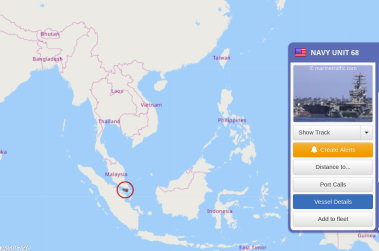

# Week 29

Hah. Some are saying it is going towards India for the situation at
Ladakh. We'll find out soon enough.

---

Nimitz is leaving the South China Sea bitch. Unless it circles back or
something the direction seems to be out. From myshiptracking.com



---

"[Carier] Nimitz, Reagan Stand with Allies and Partners in South China
Sea"

---


Is this true? There is a Lucas cut? Let's see it!

---

It's crazy to compare WWII tech to today. They had everything, albeit
less sleek form. They had INS (inertial nav systems). They had
bazookas. Even the beginnings of a computer.

---

Simply trying risky stuff might not lead to opt results. Taking
moderate risk on obscure things could be a better road. Obscurity cld
have to do with many things.. Fashion is one of them.  Certain things
fall out of fashion, therefore taken out of the realm of possibilities
altogether. What leaders need to do then is not just showing "courage"
on stuff that are around, but finding ideas that might have been
obscured for whatever reason.

---

"@thedailybeast

California governor was reportedly told he’d have to do the White
House a favor to get help with testing swabs"

---

"@SenJeffMerkley

BREAKING: When I get back to DC next week, I will be introducing an
amendment to the defense bill with @RonWyden to stop the Trump
administration from sending its paramilitary squads onto America's
streets. We won't let these authoritarian tactics stand"

---

@keithellison

I spent 12 years in Congress. It’s not divided
because people don’t know how to play nice.  It’s divided because some
think the rich don’t have enough money and everyone else has too
much. Candidates who claim that they’re going to walk in and “mediate”
are naive or dishonest.

---

23,000 kilometers. Crazy. 

"By 2040, a hydrogen network of 23,000 km is foreseen, 75% of which
will consist of converted natural gas pipelines ...  [the network] can
be used for large-scale hydrogen transport over longer distances in an
energy efficient way, also taking into consideration hydrogen imports"


---

"Gladstone to lead the way"

[Link](https://www.hydrogenfuelnews.com/wp-content/cache/all/gladstone-to-lead-the-way-in-australian-green-hydrogen-industry/8540153/index.html)

---

"No-one needs reminding that aviation faces two crises. One of course
is Covid-19; hitting finances, operations and staff- and
passenger-confidence like a wrecking ball, it is urgent. The other is
climate change.. Either way, it is way past time for the industry to
get serious about decarbonisation"

[Link](https://www.flightglobal.com/flight-international-opinion/why-aviation-should-burn-hydrogen-not-time-to-repair-reputation/139329.article)

---

"@Public_Citizen

Abolish capitalist health care"

---

<blockquote class="twitter-tweet"><p lang="en" dir="ltr">Academic writing has been descending deeper into this madness for nearly 100 years.<br><br>We need clean, brief and precise writing. Simple words used precisely. <br><br>No shame in being wrong, as long as you communicate well enough, shame in excessive hedging to pretend you aren&#39;t wrong. <a href="https://t.co/cnYff7GPwg">https://t.co/cnYff7GPwg</a></p>&mdash; Samo Burja (@SamoBurja) <a href="https://twitter.com/SamoBurja/status/1284526644418371585?ref_src=twsrc%5Etfw">July 18, 2020</a></blockquote> <script async src="https://platform.twitter.com/widgets.js" charset="utf-8"></script>

---

@NobodyInPerson

You won't get any closer to "Linux on a phone" than with @thepine64's
\#PinePhone. I always wanted to be able to compile all my \#LaTeX
documents directly on my phone!

---

<blockquote class="twitter-tweet"><p lang="en" dir="ltr">Legislation to restore the Voting Rights Act that John Lewis nearly died marching for has been sitting on your desk with no action for 225 days <a href="https://t.co/gzn6rwOFq3">https://t.co/gzn6rwOFq3</a></p>&mdash; Ari Berman (@AriBerman) <a href="https://twitter.com/AriBerman/status/1284468359527116800?ref_src=twsrc%5Etfw">July 18, 2020</a></blockquote> <script async src="https://platform.twitter.com/widgets.js" charset="utf-8"></script>

---

<blockquote class="twitter-tweet"><p lang="en" dir="ltr">Do not get lost in a sea of despair. Do not become bitter or hostile. Be hopeful, be optimistic. Never, ever be afraid to make some noise and get in good trouble, necessary trouble. We will find a way to make a way out of no way. <a href="https://twitter.com/hashtag/goodtrouble?src=hash&amp;ref_src=twsrc%5Etfw">#goodtrouble</a></p>&mdash; John Lewis (@repjohnlewis) <a href="https://twitter.com/repjohnlewis/status/1151155571757867011?ref_src=twsrc%5Etfw">July 16, 2019</a></blockquote> <script async src="https://platform.twitter.com/widgets.js" charset="utf-8"></script>

---

<blockquote class="twitter-tweet"><p lang="en" dir="ltr">11 European gas TSOs join forces to establish a European Hydrogen Backbone spanning 23 000 km! Awesome!<a href="https://t.co/TilvpFX9Cn">https://t.co/TilvpFX9Cn</a></p>&mdash; Thierry Lepercq (@ThierryLepercq_) <a href="https://twitter.com/ThierryLepercq_/status/1284144721473019907?ref_src=twsrc%5Etfw">July 17, 2020</a></blockquote> <script async src="https://platform.twitter.com/widgets.js" charset="utf-8"></script>

---

Journalist Chris Dickey RIP. He was on France 24 programs a lot. Solid
journo they say. Too bad.

---

"@secupp

NY Restauranteur Destroys Table Used by Epstein, Weinstein"

[Link](https://twitter.com/secupp/status/1284822171714453504)

---

RIP

"@repjohnlewis

Even though I was arrested, I smiled bc I was on the right side of
history. Find a way to get in the way \#goodtrouble"


---

<blockquote class="twitter-tweet"><p lang="en" dir="ltr">Hyperion Motors Teases Debut of its Fuel Cell Vehicle for August--Hyperion recently announced that it to unveil its <a href="https://twitter.com/hashtag/hydrogen?src=hash&amp;ref_src=twsrc%5Etfw">#hydrogen</a> <a href="https://twitter.com/hashtag/fuelcell?src=hash&amp;ref_src=twsrc%5Etfw">#fuelcell</a>-powered supercar via a live-stream event in August--<a href="https://twitter.com/hashtag/hydrogennow?src=hash&amp;ref_src=twsrc%5Etfw">#hydrogennow</a> <a href="https://twitter.com/hashtag/decarbonise?src=hash&amp;ref_src=twsrc%5Etfw">#decarbonise</a> <a href="https://twitter.com/hashtag/fuelcells?src=hash&amp;ref_src=twsrc%5Etfw">#fuelcells</a> <a href="https://twitter.com/hashtag/zeroemissions?src=hash&amp;ref_src=twsrc%5Etfw">#zeroemissions</a> <a href="https://twitter.com/hashtag/hydrogeneconomy?src=hash&amp;ref_src=twsrc%5Etfw">#hydrogeneconomy</a> <a href="https://twitter.com/hashtag/H2?src=hash&amp;ref_src=twsrc%5Etfw">#H2</a> <a href="https://twitter.com/fuelcellsworks?ref_src=twsrc%5Etfw">@fuelcellsworks</a> <a href="https://t.co/YyUDyANBcH">pic.twitter.com/YyUDyANBcH</a></p>&mdash; FuelCellsWorks (@fuelcellsworks) <a href="https://twitter.com/fuelcellsworks/status/1283249752293937153?ref_src=twsrc%5Etfw">July 15, 2020</a></blockquote> <script async src="https://platform.twitter.com/widgets.js" charset="utf-8"></script>

---

Hilarious line

"Doth mother know you wear-eth her drapes?"

--- 

"An entire island off the Irish coast sells for $6.3 million after
only a video tour. [The] 157-acre private island off the southwest
coast of Ireland has sold ...  despite the buyer never having actually
visited"

---

OK, will there be a radio beacon alerting ppl to the presence of this
thing? For post-apocalyptic scenario..

---

This is wild!

GitHub Arctic Code Vault

<iframe width="340" src="https://www.youtube.com/embed/fzI9FNjXQ0o" frameborder="0" allow="accelerometer; autoplay; encrypted-media; gyroscope; picture-in-picture" allowfullscreen></iframe>

---

"Putin orders huge snap military drills in Russia's
southwest. Russia's move prompts Ukraine to plan its own military
exercises"

---

Germany had a long history with synthetic fuels...  So they extracted
this thing, a gasoline-like fuel from coal, denser in energy no doubt
and easily transportable.

I remember reading fuel shortage was a major reason of DE losing the
war. But I seem to recall they could not produce enough of it. This
article says otherwise. The facilities were bombed.

"The leaders of World War II, on both sides, knew that an army's
lifeblood was petroleum. Ironically, before the War, experts had
scoffed at Adolph Hitler's idea that he could conquer the world
largely because Germany had almost no indigenous supplies of
petroleum. Hitler, however, had begun assembling a large industrial
complex to manufacture synthetic petroleum from Germany's abundant
coal supplies.

When Allied bombing of the German synfuels plants began taking its
toll in late 1944 and early 1945, the entire Nazi war machine began
grinding to a halt. More than 92 percent of Germany's aviation
gasoline and half its total petroleum during World War II had come
from synthetic fuel plants. At its peak in early 1944, the German
synfuels effort produced more than 124,000 barrels per day from 25
plants. In February 1945, one month after Allied forces turned back
the Hitler's troops at the Battle of the Bulge, German production of
synthetic aviation gasoline amounted to just a thousand tons"

[Link](https://www.energy.gov/fe/early-days-coal-research)

---

<blockquote class="twitter-tweet"><p lang="en" dir="ltr">More on the paramilitary police in Oregon. This is very dangerous. <a href="https://t.co/QaVipbp9jh">https://t.co/QaVipbp9jh</a></p>&mdash; Jeet Heer (@HeerJeet) <a href="https://twitter.com/HeerJeet/status/1284254938533466112?ref_src=twsrc%5Etfw">July 17, 2020</a></blockquote> <script async src="https://platform.twitter.com/widgets.js" charset="utf-8"></script> 

---

F#$% Monday

"Friday is our favorite F word. What is yours?"

---

<blockquote class="twitter-tweet"><p lang="en" dir="ltr">.<a href="https://twitter.com/socalgas?ref_src=twsrc%5Etfw">@SoCalGas</a> has started to power two of its largest Los Angeles-area facilities with <a href="https://twitter.com/Bloom_Energy?ref_src=twsrc%5Etfw">@Bloom_Energy</a> solid oxide <a href="https://twitter.com/hashtag/fuelcells?src=hash&amp;ref_src=twsrc%5Etfw">#fuelcells</a>.<a href="https://twitter.com/hashtag/H2View?src=hash&amp;ref_src=twsrc%5Etfw">#H2View</a> <a href="https://twitter.com/hashtag/hydrogen?src=hash&amp;ref_src=twsrc%5Etfw">#hydrogen</a><a href="https://t.co/XuKwYUv6LV">https://t.co/XuKwYUv6LV</a></p>&mdash; H2 View (@h2_view) <a href="https://twitter.com/h2_view/status/1284146120487317513?ref_src=twsrc%5Etfw">July 17, 2020</a></blockquote> <script async src="https://platform.twitter.com/widgets.js" charset="utf-8"></script>

---


This confirms my general view that libertard is a cosseted cuck. His
"free" society has to be constructed around him, so he can play house
in his little utopia. All that's required is things generally look /
sound free. Ish.

---

What is free abt a trade when it is actively encouraged, mostly abt
slave labor, and the other side of a trade isnt honored (fin is open
to CH close to US)

---

Lot of libertard goldcucks are pro-China arent they? Because, u know,
"free trade"

---

"Shell: Adamant about hydrogen mobility"

[Link](https://www.h2-view.com/story/by-rail-road-or-sea-why-shell-is-adamant-about-hydrogen-mobility/)

---


---

Bow down to the power of Q

---

😂😂

"@KFILE

Head of NYPD union gives Fox News interview with QAnon mug in background"

[Link](https://twitter.com/KFILE/status/1284320255238639621)

---

<blockquote class="twitter-tweet"><p lang="en" dir="ltr">Eleven European gas infrastructure companies from nine EU member states have today unveiled a plan for a dedicated <a href="https://twitter.com/hashtag/hydrogen?src=hash&amp;ref_src=twsrc%5Etfw">#hydrogen</a> transport infrastructure. <a href="https://t.co/ea8HYfqrQz">https://t.co/ea8HYfqrQz</a></p>&mdash; Joanna Sampson (@JoSamps92) <a href="https://twitter.com/JoSamps92/status/1284046238430703622?ref_src=twsrc%5Etfw">July 17, 2020</a></blockquote> <script async src="https://platform.twitter.com/widgets.js" charset="utf-8"></script>

---

LIke I said watchable..there is a certain pre 2016 quality to it..

\#LIS

---

The little alien is annoying

\#LIS

---

Always curious abt who steals from who

\#LIS

---

The morphing, automatically closing head cover, kinda like in
*Stargate* (1994), 4 years ago.

\#LIS

---

Aha, there is bullet time, a year before TM

\#LIS

---

Watching *Lost in Space*, 1998.

Yes, I know.. Captain Joey. Stlll, ok movie.

\#LIS

---

<blockquote class="twitter-tweet"><p lang="en" dir="ltr">remember when we were like &quot;day 15!&quot; lol</p>&mdash; Georgia (@nationalparke) <a href="https://twitter.com/nationalparke/status/1283941046003605504?ref_src=twsrc%5Etfw">July 17, 2020</a></blockquote> <script async src="https://platform.twitter.com/widgets.js" charset="utf-8"></script>

---

<iframe width="340" src="https://www.youtube.com/embed/a-KWihHnAVY" frameborder="0" allow="accelerometer; autoplay; encrypted-media; gyroscope; picture-in-picture" allowfullscreen></iframe>

---

And here is your [moment of Zen](twimg/EdGOVZfUwAItmE6.jpg)... 

---

New release method, tired of labeling files in order

---

"@CarlKoinberg

EU will accelerate the hydrogen economy at €430B"

---

Yes there was. The party coming to power after yours.

Ozal: "There is no alternative to us"

---

WRONG. There is always, at least one other alternative.

Thatcher: "There is no alternative"

---

You keep on partying like it's 1999

---

OK centrist 

---

<blockquote class="twitter-tweet"><p lang="en" dir="ltr">In the midst of this appalling catastrophe, Congress basically stumbled into a really good idea. The $600 federal payments are working -- and they&#39;re not keeping people from working.<br><br>And if we don&#39;t extend them, it&#39;s going to make everything even worse than it already is.</p>&mdash; Binyamin Appelbaum (@BCAppelbaum) <a href="https://twitter.com/BCAppelbaum/status/1283837932021915648?ref_src=twsrc%5Etfw">July 16, 2020</a></blockquote> <script async src="https://platform.twitter.com/widgets.js" charset="utf-8"></script>

--- 

"ZeroAvia has made headlines in its native California and the UK by
test flying a six-seat Piper M350 converted to run on tanked gaseous
hydrogen feeding a fuel cell which drives an electric motor.

Miftakhov describes ZeroAvia as a powertrain company and is bullish
about the programme. Hydrogen fuel, he believes, can achieve not only
zero emissions but also be cost-competitive with kerosene for small
aircraft as soon as 2023, when he hopes to have his system in service
on a 10- to 20-seater; talks are underway with operators of aircraft
like the Beechcraft King Air, Cessna Caravan or Viking Air Twin Otter"

[Link](https://www.flightglobal.com/air-transport/forget-batteries-is-hydrogen-the-holy-grail-for-carbon-free-commercial-aviation/139150.article)

---

If H2 conversion is at the source, it is okay, unless natgas is
obtained through fracking.

Green H2 is still preferable obv. 

<blockquote class="twitter-tweet"><p lang="en" dir="ltr"><a href="https://twitter.com/hashtag/Santos?src=hash&amp;ref_src=twsrc%5Etfw">#Santos</a> is exploring the potential to produce blue <a href="https://twitter.com/hashtag/hydrogen?src=hash&amp;ref_src=twsrc%5Etfw">#hydrogen</a> with CCS out of natural gas at its operations in the Cooper Basin, becoming the latest gas giant to invest in fuel that should play a crucial role in the world&#39;s future energy mix. <a href="https://t.co/w1b7kalRCN">https://t.co/w1b7kalRCN</a> <a href="https://t.co/IgoNn4KwKQ">pic.twitter.com/IgoNn4KwKQ</a></p>&mdash; Hydrogen Standard (@H2Standard) <a href="https://twitter.com/H2Standard/status/1283819238176817153?ref_src=twsrc%5Etfw">July 16, 2020</a></blockquote> <script async src="https://platform.twitter.com/widgets.js" charset="utf-8"></script>

---

<blockquote class="twitter-tweet"><p lang="en" dir="ltr">Dying in a bike crash because my helmet only protects me when charged</p>&mdash; eric (@3_r1c) <a href="https://twitter.com/3_r1c/status/1283812580553891840?ref_src=twsrc%5Etfw">July 16, 2020</a></blockquote> <script async src="https://platform.twitter.com/widgets.js" charset="utf-8"></script>

---

"@edwyattdc

All it takes is money: In the Same Towns, Private Schools Are
Reopening While Public Schools Are Not"

[Link](https://mobile.twitter.com/edwyattdc/status/1283781889111650309)

---

<blockquote class="twitter-tweet"><p lang="en" dir="ltr">Siemens Roadmap to 100% Hydrogen Turbines <a href="https://t.co/MJoVXsfn5k">https://t.co/MJoVXsfn5k</a> <br>What battery/electrons CANNOT do that H2 can:<br>1) Align industrial incumbents who scale molecules<br>2) Force natgas sector into Blue/Green H2<br>3) Preserve $ value of embedded tech (turbines) <a href="https://twitter.com/hashtag/energytwitter?src=hash&amp;ref_src=twsrc%5Etfw">#energytwitter</a> wake up</p>&mdash; Garry Golden (@garrygolden) <a href="https://twitter.com/garrygolden/status/1283769363812749316?ref_src=twsrc%5Etfw">July 16, 2020</a></blockquote> <script async src="https://platform.twitter.com/widgets.js" charset="utf-8"></script>

---


"@Joyce_Karam

BREAKING: \#Egypt threatens Military action in \#Libya 

• Sisi speaking now 

• Libyan tribes Request Egypt’s intervention if Sirt is attacked

• Egypt says Sirt-Jafra is redline 

• Sisi says any intervention begins & ends with tribes permission"

---

<blockquote class="twitter-tweet"><p lang="en" dir="ltr">Old diesel buses can now be replaced by new clean <a href="https://twitter.com/hashtag/hydrogen?src=hash&amp;ref_src=twsrc%5Etfw">#hydrogen</a> buses! <a href="https://twitter.com/hashtag/NPROXX?src=hash&amp;ref_src=twsrc%5Etfw">#NPROXX</a> is already producing infrastructure for hydrogen-powered bus fleets &amp; supplies on-board tanks for a wide range of <a href="https://twitter.com/hashtag/H2?src=hash&amp;ref_src=twsrc%5Etfw">#H2</a>-powered vehicles. Learn more: <a href="https://t.co/aSxR9m1DXs">https://t.co/aSxR9m1DXs</a></p>&mdash; NPROXX (@_NPROXX) <a href="https://twitter.com/_NPROXX/status/1283774125283192833?ref_src=twsrc%5Etfw">July 16, 2020</a></blockquote> <script async src="https://platform.twitter.com/widgets.js" charset="utf-8"></script>

---

😄😄

"Phoenix, Arizona should not exist"

[Link](https://amp.reddit.com/r/funny/comments/3h7ejr/phoenix_arizona_should_not_exist/)

---

"@sunraysunray

The more that blame for discrimination can be shifted on to individual
racist 'Karens', the less onus there is on powerful corporations, and
the politicians who defend them, to make real changes"

---

"Plug Power has today official launched its GenSure HP platform, a
line of zero emission stationary fuel cell systems designed for
large-scale, high power backup power applications. Initially available
in power output configurations ranging from 500 kilowatts (kW) to 1.5
megawatts (MW)"

[Link](https://www.h2-view.com/story/plug-power-launches-gensure-hp-fuel-cell-platform/)

---

"SouthKorea will invest $94.6 bn to help the economy recover from the pandemic"

[Link](https://twitter.com/HydrogenCouncil/status/1283348080352428042)

---

So it's not new money but money diverted from elsewhere?

<blockquote class="twitter-tweet"><p lang="en" dir="ltr">So Boris Johnson&#39;s Rooseveltian spending plans actually aren&#39;t Rooseveltian at all - they represent an increase of *precisely zero* on this year&#39;s Budget plans. <a href="https://t.co/om5PgRyIGZ">https://t.co/om5PgRyIGZ</a></p>&mdash; Pippa Crerar (@PippaCrerar) <a href="https://twitter.com/PippaCrerar/status/1283713876228476928?ref_src=twsrc%5Etfw">July 16, 2020</a></blockquote> <script async src="https://platform.twitter.com/widgets.js" charset="utf-8"></script>

---

"@EnergyHy2

Hyperion XP-1 : la supercar électrique fonctionnant à l’hydrogène"

[Link](https://www.tomsguide.fr/hyperion-xp-1-la-supercar-electrique-fonctionnant-a-lhydrogene/)

---

The Independent: "Joe Biden opens up biggest national poll lead over
Trump since securing nomination as independents abandon president"

---

Deutsche Welle: "EU, India move closer to free trade deal"

---

The Guardian: "Hopeful news about a Covid-19 vaccine developed by US
government researchers and Moderna Inc has buoyed expectations"

---

Very important, that "win". Signified a beginning of an era. 

The Atlantic: "Nevertheless, [Ingraham] still occasionally reconfirms,
on her television programs or in public speeches, the main thing I
associated her with in the 1990s: a devotion to Ronald Reagan and
Reaganism, the same devotion that would have been shared, back then,
by all of those people at Brock’s cocktail party [with other neo
muckers]. Or perhaps devotion to Reagan is a bit too specific. What
really held that group together—and what drew me to it as well—was a
kind of post–Cold War optimism, a belief that 'we had won,'"

[Link](https://www.theatlantic.com/ideas/archive/2020/07/laura-ingrahams-descent-into-despair/614245/)

---

The TWTR hackers made 100K within minutes? Damn.

[Link](https://youtu.be/qm0CVgZrs_k?t=37)

---

"@H2Standard

Introducing \#hydrogen to microgrids solves the problem of seasonal or
long-term storage that batteries cannot provide. It is the crucial
jigsaw piece for 100% green microgrids" a benefit that has value to
communities devastated by disasters @Forbes"

[Link](https://www.forbes.com/sites/kensilverstein/2020/07/12/hydrogen-may-be-the-crucial-jigsaw-piece-for-green-microgrids/#14ea096a5a74)

---

"@fabynou

Randy has released the source code of DOOM on SNES ...

What amazes me is that Randal never had access to the original
assets/source Nor did he get SuperFX documentation. He worked on it
from the metal and then negotiated a license deal with id"

---

<blockquote class="twitter-tweet"><p lang="en" dir="ltr">3D printing without plastic? Meet the intern mixing simulated Moon dust and algae at <a href="https://twitter.com/esa?ref_src=twsrc%5Etfw">@esa</a>&#39;s European Astronaut Centre. It could help form the recipe for a future lunar base 🌱🌙<a href="https://twitter.com/hashtag/blog?src=hash&amp;ref_src=twsrc%5Etfw">#blog</a> <a href="https://t.co/5OGSAhAu8v">https://t.co/5OGSAhAu8v</a> <a href="https://t.co/wkMsb2VcBT">pic.twitter.com/wkMsb2VcBT</a></p>&mdash; Human Spaceflight (@esaspaceflight) <a href="https://twitter.com/esaspaceflight/status/1283372439498620928?ref_src=twsrc%5Etfw">July 15, 2020</a></blockquote> <script async src="https://platform.twitter.com/widgets.js" charset="utf-8"></script>

---

"@vonderleyen

The EU and India must work together on fighting \#climatechange. We
agreed to soon hold the next Climate Change Dialogue, created in
2016"

---

"@SheaCoulee

I paid off a student loan, and my credit score dropped. This shit is a
fucking scam designed to keep us down"

---

"@\_brohrer\_

The deeper I dive into neural networks the less they look like
artfully tweaked optimization and the more they look like a tangle of
hacks under a veneer of backpropagation"

---

<blockquote class="twitter-tweet"><p lang="en" dir="ltr">Game on! As Dora said, “yes, we can!” <a href="https://t.co/CLpU7cLqxU">https://t.co/CLpU7cLqxU</a></p>&mdash; Paul Ottolenghi Wennberg (@wennbergcaltech) <a href="https://twitter.com/wennbergcaltech/status/1282874648711950336?ref_src=twsrc%5Etfw">July 14, 2020</a></blockquote> <script async src="https://platform.twitter.com/widgets.js" charset="utf-8"></script>

---

Frakked up

<blockquote class="twitter-tweet"><p lang="en" dir="ltr">Hey. So just a heads up...Don’t eat chocolate espresso ice cream right before bed 🥴 <a href="https://twitter.com/hashtag/FrakMe?src=hash&amp;ref_src=twsrc%5Etfw">#FrakMe</a></p>&mdash; Katee Sackhoff (@kateesackhoff) <a href="https://twitter.com/kateesackhoff/status/1283312686671908865?ref_src=twsrc%5Etfw">July 15, 2020</a></blockquote> <script async src="https://platform.twitter.com/widgets.js" charset="utf-8"></script>

---

Sometimes this is how people trying to talk to me about tech, or
lately politics sounds like ...

[Link](https://youtu.be/weSc9fNfHzk)

---


Got my right mouse "click-key" back. Yes, that is mouse click through
keyboard (I have remapped cert keys to be 'mouse clicks'. It's all
geared for speed...)


Key codes change across models...? So says `xev`.

---

[Unemployment](../../2021/01/stats.html#unempl) 

```
2020-06-01    22.37%
```

---

<blockquote class="twitter-tweet"><p lang="en" dir="ltr">Hydrogen is growing in the truck industry in Australia. Trucks have a range of approx 400km and use the same hydrogen tech that powers the fleet of Hyundai Nexo hydrogen cars that will soon be used by Government in Canberra.<br><br>Read more here: <a href="https://t.co/AqZeTJD9T4">https://t.co/AqZeTJD9T4</a> <a href="https://t.co/0gYel30nW6">pic.twitter.com/0gYel30nW6</a></p>&mdash; Hazer Group Ltd (@hazergroupltd) <a href="https://twitter.com/hazergroupltd/status/1283174722818244609?ref_src=twsrc%5Etfw">July 14, 2020</a></blockquote> <script async src="https://platform.twitter.com/widgets.js" charset="utf-8"></script>

---

"Australia’s hydrogen strategy has officially landed"

[Link](https://www.energymagazine.com.au/australias-hydrogen-strategy-has-officially-landed/)

---

Jazz Quintet, David Pastor & Smoothtime \#music

[Link](https://youtu.be/HS6L99Zf7kI?t=3200)

---

"@EmmanuelMacron

France can once again become a great industrial nation thanks to
ecology. Let's stop importing materials from the other side of the
world and start producing again in our French regions!"

---

"The Crucial ‘Jigsaw’ Piece For Green Microgrids"

[Link](https://www.forbes.com/sites/kensilverstein/2020/07/12/hydrogen-may-be-the-crucial-jigsaw-piece-for-green-microgrids/amp/)

---

OS makers; I understand r trying to be 'helpful' with regional
options. But time zone selection somehow alerted th OS I want my
months in Greek. Ιουλ? Malaka?

---

Fantastic piece of equipment for <400 dollars. This thing is a beast. 

---

Saw a nice Huewei notebook today, coulda bought it, but didn't bcz of
potential 'security hazard'. Not saying this to bash. Considered it,
but a Taiwanese hardware maker got the business instead.

---

"@Austen

After watching journalists uniformly rip on and warn about every
aspect of every app and every tech company for the last several years
years, watching them turn around and become apologists for TikTok is
really, really weird"

---


"@Newsweek

Texas teachers writing their wills as state promises to open schools
in fall"

---

"The new Hong Kong: Disappearing books, illegal words and arrests over
blank white paper"

[Link](https://www.latimes.com/world-nation/story/2020-07-10/this-is-a-cultural-purge-with-new-security-law-even-blank-paper-is-subversive-in-hong-kong)

---

<blockquote class="twitter-tweet"><p lang="en" dir="ltr">Turns out the people who predicted the world ending in 2012 were optimists.</p>&mdash; Conan O&#39;Brien (@ConanOBrien) <a href="https://twitter.com/ConanOBrien/status/1282739574024867847?ref_src=twsrc%5Etfw">July 13, 2020</a></blockquote> <script async src="https://platform.twitter.com/widgets.js" charset="utf-8"></script>

---

\#pinephone


---

<blockquote class="twitter-tweet"><p lang="en" dir="ltr">Hydraulic drilling companies across America are going bankrupt and letting methane spew into the atmosphere. Instead of spending to seal well heads they are just paying bonuses and dissolving. <a href="https://t.co/aWQ5PboKiu">https://t.co/aWQ5PboKiu</a></p>&mdash; Lee Fang (@lhfang) <a href="https://twitter.com/lhfang/status/1282554480274243584?ref_src=twsrc%5Etfw">July 13, 2020</a></blockquote> <script async src="https://platform.twitter.com/widgets.js" charset="utf-8"></script>

---

"@alert5

Japan to consider sharing air defense radar information with
Philippines in order to track Chinese aircraft"

---

<blockquote class="twitter-tweet"><p lang="en" dir="ltr">Meet the <a href="https://twitter.com/HEAVEN_FCH?ref_src=twsrc%5Etfw">@HEAVEN_FCH</a> Consortium <a href="https://twitter.com/DLRStuttgartTT?ref_src=twsrc%5Etfw">@DLRStuttgartTT</a><br>The German Aerospace Center acts as the system designer, developing a high power fuel cell system fuelled by liquid hydrogen for an electric powertrain of a 4 seater aircraft, the Hy4. More information: <a href="https://t.co/LtB7SzOKfT">https://t.co/LtB7SzOKfT</a> <a href="https://t.co/TyWKu1lv3n">pic.twitter.com/TyWKu1lv3n</a></p>&mdash; HEAVEN Project (@HEAVEN_FCH) <a href="https://twitter.com/HEAVEN_FCH/status/1282580676206825472?ref_src=twsrc%5Etfw">July 13, 2020</a></blockquote> <script async src="https://platform.twitter.com/widgets.js" charset="utf-8"></script>

---

"HyPoint, a company developing zero carbon emission hydrogen fuel cell
systems for air transportation and urban air mobility, has announced
that it has hired several new key executives to drive HyPoint’s
technology development and go-to-market strategy"

[Link](https://www.intelligent-aerospace.com/avionics/article/14179079/hydrogen-fuel-cell-air-transportation)

---

<blockquote class="twitter-tweet"><p lang="en" dir="ltr">Saudi Arabia <a href="https://twitter.com/ACWAPower?ref_src=twsrc%5Etfw">@ACWAPower</a> joining the pack in a combi of efforts with Neom and Air Products to make a truly worldscale renewable/green <a href="https://twitter.com/hashtag/hydrogen?src=hash&amp;ref_src=twsrc%5Etfw">#hydrogen</a> production plant. Estimated costs $5bn +$2 bn for infrastructure rollout. <a href="https://twitter.com/hashtag/h2?src=hash&amp;ref_src=twsrc%5Etfw">#h2</a> converted to Ammonia for transport <a href="https://t.co/GKyfLwd2Zm">https://t.co/GKyfLwd2Zm</a> <a href="https://t.co/3L4GvCs0Lx">pic.twitter.com/3L4GvCs0Lx</a></p>&mdash; Hydrogen Standard (@H2Standard) <a href="https://twitter.com/H2Standard/status/1282525156838002694?ref_src=twsrc%5Etfw">July 13, 2020</a></blockquote> <script async src="https://platform.twitter.com/widgets.js" charset="utf-8"></script>

---

"@JordanChariton

If you watch corporate Sunday morning news programs, you might have no
idea millions of people are facing evictions and homelessness in 2
weeks"

---

<blockquote class="twitter-tweet"><p lang="en" dir="ltr">&quot;WE SIMPLY CAN&#39;T AFFORD UNIVERSAL HEALTH CARE,&quot; they scream at me over the military jet display</p>&mdash; Georgia (@nationalparke) <a href="https://twitter.com/nationalparke/status/1279568261307404295?ref_src=twsrc%5Etfw">July 5, 2020</a></blockquote> <script async src="https://platform.twitter.com/widgets.js" charset="utf-8"></script>

---

@zackkanter

Facebook & TikTok privacy issues are easy for NYT reporters to mix up. One way to keep them straight is to apply 'the Uyghur test' - if you're a Uyghur using the app in its country of origin, are you in danger of: 1) being targeted w/a desk ad, or 2) having your organs harvested?

---

Little scraping.. got 10 random numbers btw 1 and 10.

Seems to work.

Good shit.

```python
import urllib.request as req, re

URL = "https://www.random.org/integers/?num=10&min=1&max=10" + \
      "&col=1&base=10&format=html&rnd=newb" 
r = req.urlopen(URL).read().decode('utf-8')
dd = re.findall(r'<pre class=\"data\">(.*?)</pre>', r, re.DOTALL)[0]
[int(x) for x in dd.split("\n") if len(x) > 0]
```

```text
Out[1]: [3, 1, 5, 2, 5, 9, 6, 7, 8, 9]
```

---

There it is

"RANDOM.ORG offers true random numbers to anyone on the Internet. The
randomness comes from atmospheric noise, which for many purposes is
better than the pseudo-random number algorithms typically used in
computer programs"

[Link](random.org)

---

Need some true number generation..

There used to be `random.org`. 

---

"Teens Flock To New App Where They Just Enter Own Personal Data Into
Form"

[Link](https://www.theonion.com/teens-flock-to-new-app-where-they-just-enter-own-person-1844339166)

---

LLAP 🖖

<blockquote class="twitter-tweet"><p lang="en" dir="ltr">The kids like eating Tide Pods too<br><br>Now you know who&#39;s running the NYT</p>&mdash; Fusilli Spock (@awstar11) <a href="https://twitter.com/awstar11/status/1282072490303348736?ref_src=twsrc%5Etfw">July 11, 2020</a></blockquote> <script async src="https://platform.twitter.com/widgets.js" charset="utf-8"></script>

---

Sister of Erik Prince of Blackwater.

"@la_louve_rouge_

Betsy DeVos says that "only" 0.02% of children will probably die as a
result of schools re-opening. That's 14,740 children"

---

Nice

"@HollywoodMev

If you could sacrifice one sport to end COVID-19, what would it be?
And why baseball?"

---

"H21 launched in 2016, to demonstrate that existing UK gas networks can
be converted to carry 100% hydrogen for use in homes and
businesses. ... “The H21 programme is demonstrating that
the UK's existing gas network can carry hydrogen, for use by homes and
businesses"

[Link](https://fuelcellworks.com/news/northern-gas-networks-ngn-uk-pioneering-hydrogen-project-takes-first-step-in-south-bank/)

---

<blockquote class="twitter-tweet"><p lang="en" dir="ltr">One of <a href="https://twitter.com/hashtag/H2View?src=hash&amp;ref_src=twsrc%5Etfw">#H2View</a>’s top stories this week saw the <a href="https://twitter.com/hashtag/EuropeanCommission?src=hash&amp;ref_src=twsrc%5Etfw">#EuropeanCommission</a> unveil its <a href="https://twitter.com/hashtag/hydrogen?src=hash&amp;ref_src=twsrc%5Etfw">#hydrogen</a> strategy and officially launched the European Clean Hydrogen Alliance to deliver on it.<a href="https://t.co/QiSyk42XBe">https://t.co/QiSyk42XBe</a></p>&mdash; H2 View (@h2_view) <a href="https://twitter.com/h2_view/status/1281945336689258498?ref_src=twsrc%5Etfw">July 11, 2020</a></blockquote> <script async src="https://platform.twitter.com/widgets.js" charset="utf-8"></script>

---


His father killed a man, you know.. In South Africa.. Most likely a
black person too. That's right. So guy is a psycho, and the father was
a psycho. The apple fell right by the tree. Nam sayin? This guy is
guiding your energy policy America, wake up.

"Elon Musk is unbalanced, weird"

---

Reuters: "The president’s demand for schools to fully reopen this fall
despite the coronavirus pandemic, his warnings on crime and civil
disorder and the touting of a vibrant stock market, are meant to make
him more appealing to suburban voters. There is little sign that the
approach is working"

---

"Local news is extremely easy to take for granted. It is, by
definition, narrow in its interests. But even beyond serving as the
core of America’s news ecosystem, local news can be the glue that
connects people in a given community. 'It’s the way a local columnist
can express a community’s frustration or triumph .. the way the local
music critic can review a concert, the deeply reported feature
stories, the assessment of a new restaurant, the obituaries, the
letters to the editor. The newspaper ties a region together, helps it
make sense of itself.”

[Link](https://www.theatlantic.com/culture/archive/2020/07/ghosting-news-margaret-sullivans-alarm-bell/614011/)

---

They had con radio.. this is a good point, such radio is mostly
centralized, "federal" in nature, they talk abt con issues but in
overarching, generalized tones, pushing broad buttons.. So they don't
really give a shit about your local problems, and in many ways, are
toxic for politics, especially the local kind.

*The Atlantic*: "McMurray’s opponent, the incumbent [congressman]
Chris Collins, had recently been indicted on charges of insider
trading. The Buffalo News ... broke the story of the indictment, and
some TV stations picked up the News’s reporting. Readers and viewers
in areas that had strong local news presences .. learned of the
indictment and, armed with that information, voted accordingly. But
many in the sprawling district were not so equipped. 'I’d be going
door to door,' McMurray [says] 'or meeting with people at a diner or a
fair, for example, and in the most isolated areas, a lot of people had
no idea that their own congressman had been indicted.' He notes that
Orleans County, a rural area of the district classified as a news
desert, was “one of the toughest places.' People there, according to
McMurray, had “gossip, conservative radio, or social media.' They had
echo chambers. They did not, however, have news. And so, by a
razor-thin margin, Chris Collins — who would go on to plead guilty to
two felonies, be sentenced to prison, and resign from Congress — won
the election"

---

<blockquote class="twitter-tweet"><p lang="und" dir="ltr"><a href="https://t.co/UDbdcfBgdk">pic.twitter.com/UDbdcfBgdk</a></p>&mdash; Aaron Stein (@aaronstein1) <a href="https://twitter.com/aaronstein1/status/1283086411034394626?ref_src=twsrc%5Etfw">July 14, 2020</a></blockquote> <script async src="https://platform.twitter.com/widgets.js" charset="utf-8"></script>

---

<blockquote class="twitter-tweet"><p lang="en" dir="ltr">Glad to write an op-ed together with <a href="https://twitter.com/flacamera?ref_src=twsrc%5Etfw">@flacamera</a> from <a href="https://twitter.com/IRENA?ref_src=twsrc%5Etfw">@IRENA</a> about the future of <a href="https://twitter.com/hashtag/hydrogen?src=hash&amp;ref_src=twsrc%5Etfw">#hydrogen</a> &amp; the opportunities it brings! <a href="https://twitter.com/hashtag/hydrogenstrategy?src=hash&amp;ref_src=twsrc%5Etfw">#hydrogenstrategy</a> <br><br>Read it here👇<a href="https://t.co/JaOj4qK5or">https://t.co/JaOj4qK5or</a> <a href="https://t.co/mIbJBWUQH3">pic.twitter.com/mIbJBWUQH3</a></p>&mdash; Kadri Simson (@KadriSimson) <a href="https://twitter.com/KadriSimson/status/1281925369612980231?ref_src=twsrc%5Etfw">July 11, 2020</a></blockquote> <script async src="https://platform.twitter.com/widgets.js" charset="utf-8"></script>

---

The asshole who took his mask off in front of crowd yelling "I CANT
BREATHE!" tops the list.

"@DavidAFrench

The mask culture war has got to be one of the dumbest and most
destructive political/cultural disputes in modern American political
history. And we're continuing to pay the price"

---

Caitlin Johnstone: "And that’s why liberals hate the true left: because
leftists are a constant reminder that liberals aren’t what they
pretend to be. That they are just conservatives wearing a fake plastic
mask of justice and sanity"

[Link](https://twitter.com/caitoz/status/1281962633155895296)


---

Thumbs up for OF original forager Indians, respekt

<blockquote class="twitter-tweet"><p lang="en" dir="ltr">Today the US Supreme Court effectively ruled a portion of Oklahoma is indeed Indian Territory. It is a great day to be indigenous. <br><br>Read more in our Medium article written by Indigenous Environmental Network&#39;s Ashley McCray. <a href="https://twitter.com/hashtag/LandBack?src=hash&amp;ref_src=twsrc%5Etfw">#LandBack</a> <br><br> <a href="https://t.co/71QVDEGSgd">https://t.co/71QVDEGSgd</a></p>&mdash; Indigenous Environmental Network (@IENearth) <a href="https://twitter.com/IENearth/status/1281525996697587713?ref_src=twsrc%5Etfw">July 10, 2020</a></blockquote> <script async src="https://platform.twitter.com/widgets.js" charset="utf-8"></script>

---

"@rebeccanagle

Yesterday, the amount of land the Federal government officially
recognized as Indian Country--as under the jurisdiction of tribes--was
just 55 million acres. Only 2% of all land in the US. Today, that
number is 74 million"

---

"An Open Source Smart Phone Supported by All Major Linux Phone
Projects .. Perhaps you’re in a line of work where security is a must,
or a hard-core Linux enthusiast, or perhaps you’ve just got enough of
Android and iOS and you’re ready for something else – the PinePhone
may be the next Phone for you"

[Link](https://www.pine64.org/pinephone/)

---

Dukakis was destroyed by that image. At least that was the conclusion
at the time. Reagan "the cowboy" along with HW had won the Cold War
and here is this guy looking like a wimp..  Clinton must have woved
never to be in that position..

---

Why did Dems become interventionist? Why did left start acting right
on war too? See [picture](https://encrypted-tbn0.gstatic.com/images?q=tbn%3AANd9GcTStPEyi-zhZRaG6wKssK0ebP8cEXnw1osTeQ&usqp=CAU)

---

Guterres: “[We have] deep concern about the terrifying military
build-up around [Sirte], and the high rate of direct foreign
intervention in the conflict, in violation of the arms embargo imposed
by the United Nations and Security Council resolutions ..."

---

"@MIG29_

Breaking: Syria and Iran sign a comprehensive agreement for military
cooperation"

---

Ammonia cracking looks to be simpler proc than I thought.. 

"Trials have shown that AFC's proprietary fuel cell system can use
'off the shelf' ammonia cracking technology"

[Link](https://www.proactiveinvestors.com/companies/news/211982/afc-energy-tapped-into-growth-of-hydrogen-fuel-use-211982.html)

"The cracking process is thermally efficient and simple"

[PDF](http://www.syngen.it/wp-content/uploads/2013/02/Ammonia-crackers_V.-Hacker-and-K.-Kordesch.pdf)

and

"Ammonia contains 1.7 times as much hydrogen as liquid hydrogen per volume. "

(Same PDF)

We have a winner

---

"@McAuleyATL

Finland ended homelessness. They provide a small apartment and
counseling with no preconditions. 4/5 make their way back into a
stable life and guess what - it was CHEAPER than allowing homelessness
to continue"

---

<blockquote class="twitter-tweet"><p lang="en" dir="ltr">deleted, but the List comes for all, <a href="https://twitter.com/ajplus?ref_src=twsrc%5Etfw">@ajplus</a>.<br><br>✍🏼✍🏼✍🏼 <a href="https://t.co/ihVpGz1Zbb">pic.twitter.com/ihVpGz1Zbb</a></p>&mdash; Siraj Hashmi (@SirajAHashmi) <a href="https://twitter.com/SirajAHashmi/status/1281716567907205120?ref_src=twsrc%5Etfw">July 10, 2020</a></blockquote> <script async src="https://platform.twitter.com/widgets.js" charset="utf-8"></script>

---

"@DanImmergluck

The newish focus on 'data science' has trivialized the value of deep
knowledge in a topic & true expertise. Now anyone who 'knows data' can
claim equal expertise to folks who have studied a topic for years. And
it’s a poisonous contributor to this anti-knowledge era"

---

<blockquote class="twitter-tweet"><p lang="en" dir="ltr">32,000 people in New York have died <a href="https://t.co/KMbmOpRo8c">https://t.co/KMbmOpRo8c</a></p>&mdash; Georgia (@nationalparke) <a href="https://twitter.com/nationalparke/status/1281677788571930626?ref_src=twsrc%5Etfw">July 10, 2020</a></blockquote> <script async src="https://platform.twitter.com/widgets.js" charset="utf-8"></script>

---

Blueberry is healthy eh? The study sounds legit.

"For the study, researchers asked a group of overweight and obese
adults between 50 and 75 years old to either consume one cup of
freeze-dried blueberry powder, one placebo that looked like a
blueberry, or a mix that was half freeze-dried blueberry powder and
half placebo once per day for six months, Sharecare.com reports. In
the end, those who ate a full cup of blueberries per day “had less
arterial stiffness, improved vascular function,” and a higher “good”
cholesterol level than those who either ate fewer or no blueberries at
all"

---

"@rodrikdani

A word about manufacturing, prompted by Biden’s 'buy American'
proposals. It is important to distinguish between production and
employment. 

Manufacturing production exerts outsized influence on a nation’s
innovative capacity and productivity. It is important to have sensible
industrial policies that promote it. And it’s possible to reinvigorate
manuf in the sense of preventing a decline in MVA/GDP.

Employment is another matter. Labor content of manufacturing has been
in decline for a very long time (flip side of rising productivity) and
I think it’s virtually impossible to reverse
employment-deindustrialization. No nation has managed to do it.

The future of jobs is in services: health, education, retail. That’s
where we need to focus, both to create productive jobs and to ensure
workers are provided with adequate say and job standards. Today’s
industrial policies have to target services if the objective is good
jobs.

We’d like to believe that promoting innovation and good jobs are one
and the same, and that a manufacturing oriented policy will kill both
birds with one stone. I’m afraid that is not the case. Good jobs will
require distinctly different policies that don’t look like
yesterday’s.

Having said all of this, on the whole I believe Biden’s proposals go
in the right direction"

---

Fighting through alliances; I guess somewhat better than straight up invasion.

"Another example can be found in the Philippines, where special
operations forces have been working steadily with Filipino forces
since 2001, enabling mutually beneficial counterterrorism and
counterinsurgency operations. The resulting partnership between the
United States and the Philippines proved so strong and valuable that
Filipino President Rodrigo Duterte recently reversed his decision to
break from a troop deployment agreement with the United States. The
continuation of this partnership seems even more important for the
United States in light of a recent bipartisan proposal calling for a
'Pacific Deterrence Initiative.'

The initiative seeks to deter China from direct conflict through the
overmatch strategy discussed in the National Security Strategy,
requiring willing partners across Southeast Asia to allow for basing
and logistics hubs for U.S. forces. To even begin preparing for the
large-scale combat operations envisioned by the conventional military,
the United States requires the partnerships enabled by its special
operations forces on a daily basis"

[Link](https://www.fpri.org/article/2020/07/still-the-one-great-power-competition-and-special-operations-forces/)

---

"@richmerino

Why is it easier to imagine the end of the world than it is to imagine
the end of capitalism?"

---

<blockquote class="twitter-tweet"><p lang="en" dir="ltr">Be adventurers and innovators? It’s possible! We are the first vessel to have reached the Arctic without any fine particle or CO₂ emissions .<a href="https://twitter.com/hashtag/futureisnow?src=hash&amp;ref_src=twsrc%5Etfw">#futureisnow</a> <br>Follow our Odyssey: <a href="https://t.co/9ibwDjMQz6">https://t.co/9ibwDjMQz6</a> <a href="https://t.co/GcIxRj1YZN">pic.twitter.com/GcIxRj1YZN</a></p>&mdash; Energy Observer (@energy_observer) <a href="https://twitter.com/energy_observer/status/1281596540205830145?ref_src=twsrc%5Etfw">July 10, 2020</a></blockquote> <script async src="https://platform.twitter.com/widgets.js" charset="utf-8"></script>

---

"@Jkylebass

The belligerence of the feckless chinese leadership and their
authorized propaganda outlets continues to amaze me. Their global
economic and military aggression is rooted in the Potemkin village of
a closed capital account and coercion of USD into china. It’s their
Achilles heel"

---

"@BCAppelbaum

Factory work doesn't inherently lift people into the middle
class. Those became good jobs because workers imposed their political
will. Service-sector jobs could be good jobs, too"

---

<center>

</center>


