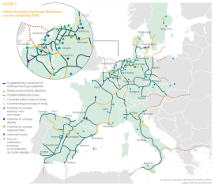

# Week 30


Bingo. Nimitz was going that direction. Open source intel bitch

"@alert5

Watch the Nimitz Carrier Strike Group conducting cooperative exercises
with the Indian Navy"

[Link](https://mobile.twitter.com/alert5/status/1286460632947019776)

---

"@LibertyBlitz

I hope the entire concept of commuting for an hour just to sit in a
cubicle all day is gone and never returns"

---

<blockquote class="twitter-tweet"><p lang="en" dir="ltr">This footage from Portland tonight is absolutely insane. Don’t look away. <a href="https://t.co/wqucd1yQmI">pic.twitter.com/wqucd1yQmI</a></p>&mdash; Joshua Potash (@JoshuaPotash) <a href="https://twitter.com/JoshuaPotash/status/1285853129884553217?ref_src=twsrc%5Etfw">July 22, 2020</a></blockquote> <script async src="https://platform.twitter.com/widgets.js" charset="utf-8"></script>

---

"@SDonziger

US govt support of the oil industry is starting to include the power
to directly prosecute critics. I've been under house arrest for 11
months without trial after winning pollution case against Chevron"

---

The plan of action for change doesn't require input from people. Hear
the grievance, that's all

---

So was MLK BTW.

---

People

"J. Lewis and 'good trouble' were very unpopular with people back in the day"

---

<blockquote class="twitter-tweet"><p lang="en" dir="ltr">As the lead of a series if I were to get hurt while riding it would shut the entire production down. That’s a lot of peoples jobs that would be put on hold because of a potential accident. Even if I’m a very good rider it’s a risk. I do agree with you however <a href="https://twitter.com/hashtag/ridingislife?src=hash&amp;ref_src=twsrc%5Etfw">#ridingislife</a> ❤️👍🏻🏍 <a href="https://t.co/bR3EtuLh5E">https://t.co/bR3EtuLh5E</a></p>&mdash; Katee Sackhoff (@kateesackhoff) <a href="https://twitter.com/kateesackhoff/status/1286346872609812483?ref_src=twsrc%5Etfw">July 23, 2020</a></blockquote> <script async src="https://platform.twitter.com/widgets.js" charset="utf-8"></script>

--


---

CROM COUNT THE DEAD

---

Kidding

---

Great. All my code went. Phew.

Release the next virus

"@xnt

The snapshot [for the Arctic Vault] will include every repo with any
commits between the announcement at GitHub Universe on November 13th
and 02/02/2020, every repo with at least 1 star and any commits from
the year before the snapshot (02/03/2019 - 02/02/2020), and every repo
with at least 250 stars"

---

Michael Brooks RIP.

---

"Indian government produces hydrogen fuel cell vehicle feasibility draft"

[Link](http://www.hydrogenfuelnews.com/indian-government-produces-hydrogen-fuel-cell-vehicle-feasibility-draft/8540181/amp/)

---

"RWE is already involved in projects such as the construction of a 100
MW electrolyzer in Lingen"

---

Now that's a true Republican. 

"@ddayen

Unsanitized today is about Mitt Romney on the verge of smuggling in a
process to cut Social Security and Medicare in the bill meant to bring
economic relief for coronavirus"

---


---

"@BCAppelbaum

They need gas masks because you gas them.

Cuccinelli: 'Here is a shield and a couple of gas masks from a rioter
arrested in Portland. Not a sign with a slogan that someone expressing
their first amendment rights might carry, but preparations for
violence. Peaceful protester? I don’t think so'"

---

Now I got the song stuck in my head

"bitch better have my money!"

---

<blockquote class="twitter-tweet"><p lang="en" dir="ltr">We welcome the EU Hydrogen Strategy and Roadmap released today. We, at Airbus, are committed to developing sustainable flight and believe hydrogen is one of the most viable solutions. <a href="https://twitter.com/hashtag/EUGreenDeal?src=hash&amp;ref_src=twsrc%5Etfw">#EUGreenDeal</a> <a href="https://t.co/M25nmSdXlN">https://t.co/M25nmSdXlN</a></p>&mdash; Guillaume Faury (@GuillaumeFaury) <a href="https://twitter.com/GuillaumeFaury/status/1280846469680050176?ref_src=twsrc%5Etfw">July 8, 2020</a></blockquote> <script async src="https://platform.twitter.com/widgets.js" charset="utf-8"></script>

---

Glenn Llewellyn, vice president of zero-emissions technology at Airbus
(speaking at a panel), says company is excited about green fuels.

---

Haha "Mitch Better Have My Money" 

I guess slogan is a riff on [this song](https://www.youtube.com/watch?v=qHkpGJcB0HU)

[Link](https://wjla.com/news/local/protesters-march-to-mitch-mcconnells-dc-home-demanding-extension-of-benefits)

---

This is wild

[Link](https://mobile.twitter.com/artbaenayy/status/1285780381065793537)

---

<blockquote class="twitter-tweet"><p lang="en" dir="ltr">Leaving the house is so exhausting. And you&#39;re telling me I used to do this every day???</p>&mdash; indy scarletti (@paper_indy) <a href="https://twitter.com/paper_indy/status/1285899019089133568?ref_src=twsrc%5Etfw">July 22, 2020</a></blockquote> <script async src="https://platform.twitter.com/widgets.js" charset="utf-8"></script>

---

Boris Johnson unveils £350m to fuel decarbonisation of industry

[Link](https://www-cityam-com.cdn.ampproject.org/c/s/www.cityam.com/boris-johnson-unveils-350m-to-fuel-decarbonisation-of-industry/amp/)

---

Joking aside, Arduino usage can get obtuse. ALso not pure X.

---

Arduiono is guinea. Go north, whenever u can, for all things...

"Why not Arduiono instrad of Pi?"

---

Foldable, light keyboard.. Looks good


RPi + foldable keyb.. hmm.. Maybe I should shift my
uber-portable-light computing setup from phone to this. Phones will
never be Unix enough for me, Pi is pure X out-of-the-box.

---

Interesting read...

"Belgium and Ireland argued for and succeeded in getting a 5 billion
Brexit fund that will support the countries worst-hit by Brexit. The
fund is a reminder that the Brexit negotiations are not on track and
there is no sign of real progress"

[Link](https://www.irishtimes.com/opinion/shape-of-eu-s-new-political-dynamic-becomes-clearer-1.4310017)

---

You look at work done, vs power expanded, the ratio is efficiency. In
order to move a 1000 kg car to overcome friction have it go at
reasonable speed you need to apply constantly 200 Newtons of
[force](http://www.cimt.org.uk/projects/mepres/alevel/mechanics_ch6.pdf).
Take a bitch [BEV](https://en.wikipedia.org/wiki/Tesla_Model_S)
with 426 km (265 mile) range and 85kWh battery gross weight 2000kg.
Work done is Newton-meters, equaling Joules, which is 1/3600
Watt-hours, Force is 400 Newtons for 2000 kg car,

```python
work = (426*1000*400) / 3600.
print (np.round(work / 85000 * 100), '%')
```

```text
56.0 %
```

"How can you calculate BEV efficiency as 60%?"

---

<blockquote class="twitter-tweet"><p lang="en" dir="ltr">New Material Can Generate Hydrogen from Salt and Polluted Water--Scientists of Tomsk Polytechnic University have developed a new 2D material to produce <a href="https://twitter.com/hashtag/hydrogen?src=hash&amp;ref_src=twsrc%5Etfw">#hydrogen</a>--<a href="https://t.co/kkC4mlwmPX">https://t.co/kkC4mlwmPX</a> <a href="https://twitter.com/hashtag/Hydrogennow?src=hash&amp;ref_src=twsrc%5Etfw">#Hydrogennow</a> <a href="https://twitter.com/hashtag/decarbonise?src=hash&amp;ref_src=twsrc%5Etfw">#decarbonise</a> <a href="https://twitter.com/hashtag/zeroemissions?src=hash&amp;ref_src=twsrc%5Etfw">#zeroemissions</a> <a href="https://twitter.com/fuelcellsworks?ref_src=twsrc%5Etfw">@fuelcellsworks</a> <a href="https://t.co/kUNHUOu1qx">pic.twitter.com/kUNHUOu1qx</a></p>&mdash; FuelCellsWorks (@fuelcellsworks) <a href="https://twitter.com/fuelcellsworks/status/1285912187760971782?ref_src=twsrc%5Etfw">July 22, 2020</a></blockquote> <script async src="https://platform.twitter.com/widgets.js" charset="utf-8"></script>

---

Cramer says he is now fuel-cell believer (Mad Money interview with
Plug Power CEO).

---

I heard of this dude in Istanbul back when he went from the European
side to Asian, and the trip was so arduous, adventerous for him that
he wrote a book about it. A trip that can be done in a few hours by
train today.

---

"@garrygolden

.. Like every global automotive OEM, GM understands that 'electric'
vehicle refers to the motor not a battery. Despite \#energytwitter
aspirations, massive EV adoption is a 2030-40s story. OEMs see
\#fuelcells benefits on supply chain risks/complexity, cost-to-mass,
cost curves"

---

<blockquote class="twitter-tweet"><p lang="en" dir="ltr">The UK Government has today announced £139m to cut emissions in heavy industry by supporting the transition from natural gas to clean <a href="https://twitter.com/hashtag/hydrogen?src=hash&amp;ref_src=twsrc%5Etfw">#hydrogen</a> power. <a href="https://t.co/nIZKrO0APJ">https://t.co/nIZKrO0APJ</a></p>&mdash; Joanna Sampson (@JoSamps92) <a href="https://twitter.com/JoSamps92/status/1285870515668815877?ref_src=twsrc%5Etfw">July 22, 2020</a></blockquote> <script async src="https://platform.twitter.com/widgets.js" charset="utf-8"></script>

---

<blockquote class="twitter-tweet"><p lang="en" dir="ltr">The UK Government has launched a Hydrogen Advisory Council as part of its decarbonisation efforts. <a href="https://twitter.com/hashtag/hydrogen?src=hash&amp;ref_src=twsrc%5Etfw">#hydrogen</a> <a href="https://t.co/7rlAeOpVzL">https://t.co/7rlAeOpVzL</a></p>&mdash; Joanna Sampson (@JoSamps92) <a href="https://twitter.com/JoSamps92/status/1285870323691401218?ref_src=twsrc%5Etfw">July 22, 2020</a></blockquote> <script async src="https://platform.twitter.com/widgets.js" charset="utf-8"></script>

---

"@NanoSUNH2

... \#newnormal!

'@GraHod A \#hydrogen first for me today - eating my breakfast
listening to BBC Radio4 & UK transport secretary @grantshapps was
chatting in a sensible manner about the Jet Zero Council and option of
\#hydrogenfuel for aviation'"

---

So weird

"Hostage siege ends after Ukrainian president endorses Joaquin Phoenix
film... Gunman surrenders after video recommending 2005’s Earthlings
posted on Facebook"

[Link](https://www.theguardian.com/world/2020/jul/21/hostage-siege-ends-after-ukrainian-president-endorses-joaquin-phoenix-film)

---

<blockquote class="twitter-tweet"><p lang="en" dir="ltr">Houston fire and police respond to reports of documents being burned at Consulate General of China - The plot thickens...video shows consulate workers intentionally burning documents and possibly even hard drives. <a href="https://twitter.com/hashtag/MakeChinaPay?src=hash&amp;ref_src=twsrc%5Etfw">#MakeChinaPay</a> <a href="https://twitter.com/hashtag/Decouple?src=hash&amp;ref_src=twsrc%5Etfw">#Decouple</a> <a href="https://twitter.com/hashtag/Texas?src=hash&amp;ref_src=twsrc%5Etfw">#Texas</a> <a href="https://t.co/OVCmhPkNRl">https://t.co/OVCmhPkNRl</a></p>&mdash; 🇺🇸Kyle Bass🇺🇸 (@Jkylebass) <a href="https://twitter.com/Jkylebass/status/1285801551924285440?ref_src=twsrc%5Etfw">July 22, 2020</a></blockquote> <script async src="https://platform.twitter.com/widgets.js" charset="utf-8"></script>

---


The classic Gnome desktop actually started giving problems on new
Ubuntu's. Well fine, Unity desktop is usable enough.

---

"World’s Largest Green Hydrogen Project Will build in NOEM Smart City,
Saudi Arabia"


[Link](https://solaredition.com/worlds-largest-green-hydrogen-project-will-build-in-noem-smart-city-saudi-arabia/?utm_source=dlvr.it&utm_medium=twitter)

---

<blockquote class="twitter-tweet"><p lang="en" dir="ltr">capital-gains tax cut <a href="https://t.co/15NmzSDdlz">https://t.co/15NmzSDdlz</a></p>&mdash; Matt Pearce 🦅 (@mattdpearce) <a href="https://twitter.com/mattdpearce/status/1285717071788224513?ref_src=twsrc%5Etfw">July 21, 2020</a></blockquote> <script async src="https://platform.twitter.com/widgets.js" charset="utf-8"></script>

---

"@fuelcellsworks

Uniper and General Electric Sign a Cooperation Agreement"

---

I posted this before, [here is](https://muratk3n.github.io/thirdwave/en/2020/07/github-pages-for-math-code.html)
in article form, how to publish code and math through Markdown / Github. 

---

The thing abt the Mustache book is I dont think it is written with
malice in mind. There are passages in there showing a public servant
kind of bummed he couldnt help a President. "Things cld have been
setup to expediate this and that.." Sad. But also what u get when u r
an outsider.

---
 
Diamond inher is a coding thing, as in "inheriting" code, but through
multiple paths, the graph looks like a diamond

---

Yesss C++.. Mmm hm... I was the C++ f-ing master in my time. I ax you
a diamond inheritance interview question, you'll go into a epileptic
shock

---

Chrono coding setup through Py actually looks like a pain. I might
just do this through C++.

---

Oh yeah... knock it down bruh!


---

3D physics simulation... Chrono looks good

---

Woolsey lines on SG Atlantis crack me up. Writers wrote him as this
last-word freak, stuck-up, busy body suit, and it's really funny.

---

Well that'll work for sure

'@nypost

Colombian cartels executing people who break coronavirus lockdown"

[Link](https://trib.al/H7Iy9Kl)

---

<blockquote class="twitter-tweet"><p lang="en" dir="ltr">The Nation&#39;s <a href="https://twitter.com/kenklippenstein?ref_src=twsrc%5Etfw">@kenklippenstein</a> discusses the leaked documents that reveal CBP as the federal agency detaining protesters in Portland.<br>W/ <a href="https://twitter.com/jaisalnoor?ref_src=twsrc%5Etfw">@jaisalnoor</a><a href="https://twitter.com/hashtag/PortlandProtests?src=hash&amp;ref_src=twsrc%5Etfw">#PortlandProtests</a> <a href="https://twitter.com/hashtag/NoSecretPolice?src=hash&amp;ref_src=twsrc%5Etfw">#NoSecretPolice</a> <a href="https://t.co/kWEHKQwfZF">https://t.co/kWEHKQwfZF</a></p>&mdash; The Real News (@TheRealNews) <a href="https://twitter.com/TheRealNews/status/1285598530426621953?ref_src=twsrc%5Etfw">July 21, 2020</a></blockquote> <script async src="https://platform.twitter.com/widgets.js" charset="utf-8"></script>

---

It does seem like US can / does fight for ideology. I know there are
other explanations too, but it fought for ideology three times so
far. The Civil War on slavery, WWII was a left leader fighting
fascists, Cold War was a rightist leader fighting communists. 

---

<blockquote class="twitter-tweet"><p lang="en" dir="ltr">Eight International Standards Adopted by Australia for a Hydrogen Future-Standards adopted by <a href="https://twitter.com/hashtag/Australia?src=hash&amp;ref_src=twsrc%5Etfw">#Australia</a> to help shape the future of <a href="https://twitter.com/hashtag/hydrogen?src=hash&amp;ref_src=twsrc%5Etfw">#hydrogen</a> across the country as it continues to focus on a cleaner, more affordable energy future-<a href="https://t.co/b52VgRT8Lo">https://t.co/b52VgRT8Lo</a> <a href="https://twitter.com/hashtag/HydrogenNow?src=hash&amp;ref_src=twsrc%5Etfw">#HydrogenNow</a> <a href="https://twitter.com/hashtag/decarbonise?src=hash&amp;ref_src=twsrc%5Etfw">#decarbonise</a> <a href="https://t.co/QZgWoytilU">pic.twitter.com/QZgWoytilU</a></p>&mdash; FuelCellsWorks (@fuelcellsworks) <a href="https://twitter.com/fuelcellsworks/status/1285588218545606658?ref_src=twsrc%5Etfw">July 21, 2020</a></blockquote> <script async src="https://platform.twitter.com/widgets.js" charset="utf-8"></script>

---

Dude.

"@Helldritch

I was curious about where the word 'dude' came from and I found out
about this guy. The King of the Dudes"

[Link](https://mobile.twitter.com/Helldritch/status/1285097211731173376)

---

"@ayyitsjameslmao

all I’ve had today is 2 iced coffees 

no water 

no food 

I have evolved past the need for sustenance or hydration 

I need only the Bean Juice 

Witness me"

---

So the electric grid is 40% efficient (reducing the overall efficiency
of BEVs, 60% x 40% gives 24%, making it closer to a fossil fuel
powered car). One might ask, how efficient is a gas pipeline? It's
over 97%. Loss in that scenario is a bug, not a feature, you plug the
leaks once found, the normal operation you send molecule from one end,
you expect to receive it on the other. The H2 pipelines, when
finished, will have the same characteristics.

[Link](https://www.scientificamerican.com/article/how-much-natural-gas-leaks/)

---

"Dutch glass producer Celsian to develop tech required for gradual
transition from natural gas"

[Link](https://mobile.twitter.com/fuelcellsworks/status/1285544855192641537)

---

"@BatteryH2

\#Kudos to @GM and @Honda for the collaboration and partnership to
advance the #hydrogeneconomy"

[Link](https://media.chevroletarabia.com/media/me/en/gm/news/news_archive.detail.html/content/Pages/news/us/en/2020/jul/0716-statement.html)

---

Haha E. Verlinde has an identical twin brother, also a physicst


---

"@BreeNewsome

They’re gonna rename a bridge after John Lewis and pat themselves on
the back while police are still beating folks in the streets and we
don’t have a voting rights act"

---

16 Bit Lolita's ‎– Trading Places \#music

[Link](https://youtu.be/2AdApttFHUg)

---

WaPo: "Vice President Biden criticizes crackdown on dissent in Turkey"

---

"@bennyjohnson

Joe Biden: 'I wish we taught more in our schools about the Islamic faith'"

[Link](https://twitter.com/bennyjohnson/status/1285356163987656705)

---

"@fuelcellsworks

Tetramer Wins DOE Grant to Develop High-Performance Water Vapor
Membranes to Improve \#FuelCells"

[Link](https://bit.ly/3fP4iG9 )

---

<blockquote class="twitter-tweet"><p lang="en" dir="ltr">.<a href="https://twitter.com/ENERGY?ref_src=twsrc%5Etfw">@ENERGY</a> will push forward 18 projects that support the H2@Scale vision for affordable <a href="https://twitter.com/hashtag/hydrogen?src=hash&amp;ref_src=twsrc%5Etfw">#hydrogen</a> production, storage, distribution and use, with $64m in Fiscal Year 2020 funding. <a href="https://t.co/NZ5Zfws7nk">https://t.co/NZ5Zfws7nk</a></p>&mdash; Joanna Sampson (@JoSamps92) <a href="https://twitter.com/JoSamps92/status/1285484640816566273?ref_src=twsrc%5Etfw">July 21, 2020</a></blockquote> <script async src="https://platform.twitter.com/widgets.js" charset="utf-8"></script>

---

But it all helped US in the end; von Braun worked in the V-2 program,
but after the war, him along with dozens of DE scientists were brought
to US through the operaton Paperclip, and with the help of VB the US
landed on the Moon. 

---

.. which pushed the development of the V rockets. Amazing tidbit of history. 

"The Versailles peace treaty limited the German army to 100,000 men; it
was forbidden to have aircraft or antiaircraft guns, or field
artillery of more than 3-inch caliber. This may explain why the German
army took an early interest in rocket development; the treaty of
Versailles didn't mention rockets at all"

[Link](https://maritime.org/doc/missile/index.htm)

---

Thunderball - Rio Mescalito \#music

[Link](https://youtu.be/jqQY5v00re4)

---

"@AdamParkhomenko

51 years ago America landed on the moon. Now we’re not even allowed in
the fucking Bahamas"

---


The moral of the story is existing parties, cover all bases, help as
much as possible bcz if all fails, then you get national socialism.

---

I am not saying Trump is Hitler

---

Here's how it works; shit goes bad. Existing structures fail to help.
New leaders rise to fill the void, run the gamut around left and
right, left bcz ppl need it, but ultimately the nationalist part which
is incompatible spills over its borders, war ensues.

Nationalists do not use the L word bcz during 40s it is associated
with internationalism, or [shudder], Jews! It's not used now, but they
blow smoke up your ass with the word "populism" bcz Reaganism has been
banging on the other word decades.

But action speaks louder than words. Trump did promise not to touch
social security, Medicare, and promised to end wars during the 2016
campaign.

---

"Fascism developed the Italian social security system, aimed at a
comprehensive restructuring of the relationships between factors of
production in a 'corporatist' fashion, and nationalized banks and
businesses. The second feature of the regime did not survive its end
(though one may argue that its legacy has long impacted the Italian
economy). But some version of social security and nationalized banks
and companies did"

[Link](https://www.econlib.org/how-socialist-was-national-socialism/)

---

From *Hitler's True Believers*, "Insofar as Hitler had fixed ideas at
the end of the Great War in 1918, high on the list was nationalism, in
spite of the aspersions cast against it by mutinous sailors and
rebellious soldiers tired of the fighting. Some aspects of what became
his doctrine or ideology stemmed from the cluster of ideas,
resentments, and passions widely shared in Germany at that time. His
views and those of his comrades also reflected the fact that Germany
was already a nation with a great deal of egalitarianism baked into
its political culture.  Almost without exception, the Nazis emphasized
all kinds of socialist attitudes, to be sure a socialism 'cleansed' of
international Marxism and communism. Indeed, when he looked back from
1941, Hitler said of the NSDAP in the 1920s that '90 ninety percent of
it was made up by left-wing people.' He also thought it was 'decisive'
that he had recognized early in his career that solving the social
question was essential, and he insisted that he hated the closed world
in which he grew up, where social origins determined a person’s
chances in life.

That Germany on the eve of Hitler’s appointment as chancellor in
January 1933 continued to have a socialist-oriented political culture
can be illustrated by pointing to the last free elections of the
Weimar Republic the previous November. No less than 71.6 percent of
the vote went to parties with 'socialist' or 'communist' in their
titles"

---

Yes yes.. I know all the twists and turns of that polemic... But the
fact remains, fascists did enact left policies sometimes. It should
not be surprising, they are trying to help people! (then organize them
to kill others, but that's later).

"But that's an old debate, later conservatives said 'look Nazis were
also socialist to bash the left"

---

Yes. By a party who called itself **Na**tionalso**zi**alistisch.
National socialists of Germany.

"Right adapts left politics too, you said, but does not refer to it
excessively. Did this happen in history before?"

---

"The biophysicist Jeremy England made waves in 2013 with a new theory
that cast the origin of life as an inevitable outcome of
thermodynamics. His equations suggested that under certain conditions,
groups of atoms will naturally restructure themselves so as to burn
more and more energy, facilitating the incessant dispersal of energy
and the rise of 'entropy' or disorder in the universe. England said
this restructuring effect, which he calls dissipation-driven
adaptation, fosters the growth of complex structures, including living
things. The existence of life is no mystery or lucky break, he told
Quanta in 2014, but rather follows from general physical principles
and “should be as unsurprising as rocks rolling downhill.'"

[Link](https://www.quantamagazine.org/first-support-for-a-physics-theory-of-life-20170726/)

---

Maybe he'll grill them to be more efficient at their job

"@damiangarde

Rep. Joseph Kennedy III, tasked with grilling five pharma companies at
a hearing tomorrow, owns ~$1.7 million of stock in three of them"

---

<blockquote class="twitter-tweet"><p lang="en" dir="ltr">The reality of producing and storing CO2-free <a href="https://twitter.com/hashtag/hydrogen?src=hash&amp;ref_src=twsrc%5Etfw">#hydrogen</a> energy using rooftop solar panels to power homes is a step closer with the signing of a contract between professional services firm <a href="https://twitter.com/GHDspeaks?ref_src=twsrc%5Etfw">@GHDspeaks</a> and its client, Providence Asset Group. <a href="https://t.co/jNZS6rSVDS">https://t.co/jNZS6rSVDS</a></p>&mdash; Joanna Sampson (@JoSamps92) <a href="https://twitter.com/JoSamps92/status/1285179229722877953?ref_src=twsrc%5Etfw">July 20, 2020</a></blockquote> <script async src="https://platform.twitter.com/widgets.js" charset="utf-8"></script>

---

<blockquote class="twitter-tweet"><p lang="en" dir="ltr">why niggas never just rushed Batman? He can’t whoop everybody ass</p>&mdash; Marcus (@STOPFLEXIN) <a href="https://twitter.com/STOPFLEXIN/status/1279859398152794113?ref_src=twsrc%5Etfw">July 5, 2020</a></blockquote> <script async src="https://platform.twitter.com/widgets.js" charset="utf-8"></script>

---

There is the planned H2 network. I see three major lines going to Africa. 



---

Holy f--ing shit. That is a track left by a moving city. 


\#MoEn

---

They speak of old tech like it's the best thing ever

\#MoEn
 
---

R. Sheehan looks kinds of like J. Trudeau

\#MoEn

---

*Mortal Engines*,  good scifi. Moving cities!

\#MoEn

---

"While a resurgence in coronavirus cases in Texas has brought many
businesses to a screeching halt, eight robots have kept All Axis
Machining's metal fabrication facility in Dallas humming.

The small, nimble robots perform multiple jobs, such as
machine-tending, sanding, deburring, part inspection and laser
marking, leaving owner Gary Kuzmin far less dependent on manual
labor. When all the workers on one shift went into self-quarantine
last month, it had no impact on the facility's productivity"

[Link](https://mobile.reuters.com/article/amp/idUSKCN24L18T?taid=5f15c0b2977e0100010f1195)

---

Chris Joss - Rififi Rococo \#music

[Link](https://youtu.be/6GjgdPF0Bf8)

---

Chris Joss - Optical \#music

[Link](https://youtu.be/_AoXgACPuUY)

---

40% efficiency..? Inefficient as fuck. Moving molecules is much better.

---

An energy corridor will run from Africa to the EU rather than Russia
to EU? It'll get Africa money, richer continent will not migrate, EU
gets its energy, dependency on RU reduced.

---

They r doing this thing. Awesome

---

"Shares of Bloom Energy surged nearly 35 percent on Wednesday"

[Link](https://www.greentechmedia.com/articles/read/bloom-energy-stock-price-soars-after-launch-into-green-hydrogen-market)

---


