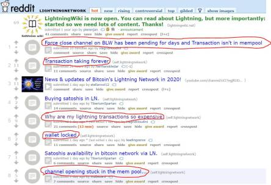

# Week 31

---

<blockquote class="twitter-tweet"><p lang="en" dir="ltr"><a href="https://twitter.com/hashtag/Hydrogen?src=hash&amp;ref_src=twsrc%5Etfw">#Hydrogen</a> will be key in the future <a href="https://twitter.com/hashtag/energysector?src=hash&amp;ref_src=twsrc%5Etfw">#energysector</a>, a truly clean alternative for natural gas + transportation fuels. <a href="https://twitter.com/hashtag/H2?src=hash&amp;ref_src=twsrc%5Etfw">#H2</a>’s unique advantages make it an especially attractive investment opportunity for <a href="https://twitter.com/hashtag/heavyduty?src=hash&amp;ref_src=twsrc%5Etfw">#heavyduty</a> vehicles, &amp; the world is beginning to notice<a href="https://t.co/UVLCUtOxW7">https://t.co/UVLCUtOxW7</a></p>&mdash; Hydrogen Europe (@H2Europe) <a href="https://twitter.com/H2Europe/status/1287755192247689224?ref_src=twsrc%5Etfw">July 27, 2020</a></blockquote> <script async src="https://platform.twitter.com/widgets.js" charset="utf-8"></script>

---

"@BCAppelbaum

The final D600 payments are for the week ending July 25. Nobody's
getting D600 for being unemployed this week. And even if Congress
passed a new deal today, it would take weeks for the money to start
reaching the unemployed"

<blockquote class="twitter-tweet"><p lang="en" dir="ltr"><a href="https://twitter.com/hashtag/Nikola?src=hash&amp;ref_src=twsrc%5Etfw">#Nikola</a>’s Trevor Milton Says Future of Trucking Is <a href="https://twitter.com/hashtag/Hydrogen?src=hash&amp;ref_src=twsrc%5Etfw">#Hydrogen</a> Based <a href="https://twitter.com/hashtag/HydrogenNow?src=hash&amp;ref_src=twsrc%5Etfw">#HydrogenNow</a> <a href="https://twitter.com/hashtag/EnergyTransition?src=hash&amp;ref_src=twsrc%5Etfw">#EnergyTransition</a> <a href="https://twitter.com/hashtag/FuelCell?src=hash&amp;ref_src=twsrc%5Etfw">#FuelCell</a> <a href="https://t.co/pr1JMS9GuV">https://t.co/pr1JMS9GuV</a></p>&mdash; BayoTech On-Site Hydrogen Generation (@H2Bayo) <a href="https://twitter.com/H2Bayo/status/1289192357594718210?ref_src=twsrc%5Etfw">July 31, 2020</a></blockquote> <script async src="https://platform.twitter.com/widgets.js" charset="utf-8"></script>

---

Diana remote mind attack. Doesnt work.

---

Data replica is dropped somewhere. In ST arent Datas hard to come
by?

---

That's the thing abt this movie; nothing connects. Shinz all good all
of a sudden turns evil. 

---

No build up for the fight between Number 1's. Except some maddogging
from Riker literally seconds before they start fighting

\#fail \#nemesis \#trek

---

"US oil company signs deal with Syrian Kurds"

---

New scifi show idea: *Young Picard*, starring Tom Hardy.

---

<blockquote class="twitter-tweet"><p lang="en" dir="ltr">Hyundai Motors Delivers Hydrogen <a href="https://twitter.com/hashtag/FuelCell?src=hash&amp;ref_src=twsrc%5Etfw">#FuelCell</a> Powered Bus to Jeonju City-<a href="https://twitter.com/Hyundai_Global?ref_src=twsrc%5Etfw">@Hyundai_Global</a> plans to supply <a href="https://twitter.com/hashtag/hydrogen?src=hash&amp;ref_src=twsrc%5Etfw">#hydrogen</a> <a href="https://twitter.com/hashtag/fuelcells?src=hash&amp;ref_src=twsrc%5Etfw">#fuelcells</a> buses to transportation companies operating in Jeonju, including Jeonju Express &amp; Honam <a href="https://t.co/EPqpxEpcGB">https://t.co/EPqpxEpcGB</a> <a href="https://twitter.com/hashtag/HydrogenNow?src=hash&amp;ref_src=twsrc%5Etfw">#HydrogenNow</a> <a href="https://twitter.com/hashtag/decarbonise?src=hash&amp;ref_src=twsrc%5Etfw">#decarbonise</a> <a href="https://twitter.com/hashtag/H2?src=hash&amp;ref_src=twsrc%5Etfw">#H2</a> <a href="https://twitter.com/fuelcellsworks?ref_src=twsrc%5Etfw">@fuelcellsworks</a></p>&mdash; FuelCellsWorks (@fuelcellsworks) <a href="https://twitter.com/fuelcellsworks/status/1288859650843119616?ref_src=twsrc%5Etfw">July 30, 2020</a></blockquote> <script async src="https://platform.twitter.com/widgets.js" charset="utf-8"></script>

---

"The Institute for Advanced Composites Manufacturing Innovation
(IACMI) is set to receive 2.7m dollar from the US Department of Energy
(DOE) to develop and validate technology that will reduce the cost of
manufacturing high-performance carbon fibre to make composite natural
gas or hydrogen fuel tanks to power cars and trucks"

[Link](https://www.h2-view.com/story/iacmi-receives-grant-for-hydrogen-tank-development/)

---

😂😂😂

<blockquote class="twitter-tweet"><p lang="en" dir="ltr">“It sends a concerning message to businesses and investors that the Australian government will intervene instead of letting the market work,” Mel Silva, managing director of Google Australia and New Zealand, said in a statement.<br><br>Hilarious.<a href="https://t.co/G7N3kyRg5D">https://t.co/G7N3kyRg5D</a></p>&mdash; Alec Thomas (@alecthomas) <a href="https://twitter.com/alecthomas/status/1289122725215125505?ref_src=twsrc%5Etfw">July 31, 2020</a></blockquote> <script async src="https://platform.twitter.com/widgets.js" charset="utf-8"></script>

---

"Europe Looks To Become The Global Leader In Hydrogen"

[Link](https://oilprice.com/Alternative-Energy/Fuel-Cells/Europe-Looks-To-Become-The-Global-Leader-In-Hydrogen.amp.html?__twitter_impression=true)

---

<blockquote class="twitter-tweet"><p lang="en" dir="ltr">.<a href="https://twitter.com/hazergroupltd?ref_src=twsrc%5Etfw">@hazergroupltd</a> today revealed that its Board has approved the final investment decision to proceed with its biogas to green <a href="https://twitter.com/hashtag/hydrogen?src=hash&amp;ref_src=twsrc%5Etfw">#hydrogen</a> production facility, to be located in Western Australia. <a href="https://t.co/NTKAd4nMzo">https://t.co/NTKAd4nMzo</a></p>&mdash; Joanna Sampson (@JoSamps92) <a href="https://twitter.com/JoSamps92/status/1289101881378250752?ref_src=twsrc%5Etfw">July 31, 2020</a></blockquote> <script async src="https://platform.twitter.com/widgets.js" charset="utf-8"></script>

---

People are fickle, mostly stupid abt politics, they only care abt
themselves -- which is fine, representative democracy works just fine
this way.

So understand..? No. UK electorate could have 'understood' WWII
situation and vote for the guy who won it, but they
didn't. Churchill's ass was grass.

The decision to keep the incumbent is in very general terms, a combo
of 'how am I doing', 'do I like this guy', and 'did he stay too long'.

"Shouldn't people 'understand' that there was a pandemic which
effected econ and not care abt the GDP fall, still vote for Trump?"

---

"@sakrejda

Why do companies post positions that are \*clearly\* a terrible match
for ML/AI and \*specifically\* ask for ML/AI?"

---

<blockquote class="twitter-tweet"><p lang="en" dir="ltr">NextEra utility Florida Power &amp; Light is proposing a 65 million, 20 MW electrolysis project to make &quot;green <a href="https://twitter.com/hashtag/hydrogen?src=hash&amp;ref_src=twsrc%5Etfw">#hydrogen</a>&quot; from <a href="https://twitter.com/hashtag/solar?src=hash&amp;ref_src=twsrc%5Etfw">#solar</a> electricity <a href="https://t.co/t5ijPGrJjx">https://t.co/t5ijPGrJjx</a></p>&mdash; JesseJenkins (@JesseJenkins) <a href="https://twitter.com/JesseJenkins/status/1288863648505569280?ref_src=twsrc%5Etfw">July 30, 2020</a></blockquote> <script async src="https://platform.twitter.com/widgets.js" charset="utf-8"></script>

---

"@drvox

Herman Cain mocked masks & mask mandates. Then he went to a Trump
event with no masks, caught the coronavirus, and died. We shouldn't be
insensitive -- there's nothing funny about it -- but we also shouldn't
ignore the fact that ..  ignorance is getting people killed"

---

Seems to work


---

Saw in post from 08, draw the symbol get the LaTeX code for it. Site still
up

[Link](https://detexify.kirelabs.org/classify.html)

---

Annunalized GDP growth Q2 %

```
2020-04-01   -32.904137
```

Ouch.

With net approval -15, and this GDP the conf interval of win prob is
(24% %38).

If right side was above 50%, candidate wld have some chance. No chance here.

---

"@OregonGovBrown

I think we’ve had enough political grandstanding from DC. The
President’s plan to "dominate" the streets of American cities has
failed. And today, federal troops are preparing to leave downtown
Portland. We will protect free speech and the right to protest
peacefully"

---

Cummins is a leader. Was absolutely thrilled to hear their entry into the market.

<blockquote class="twitter-tweet"><p lang="en" dir="ltr">Hydrogen fuel cell power marks the latest entry in our portfolio of power solutions. Check out the latest in <a href="https://twitter.com/FreightWaves?ref_src=twsrc%5Etfw">@FreightWaves</a> and learn how hydrogen has the potential to transform mobility and fueling infrastructure to make fuel cells accessible on a large scale. <a href="https://twitter.com/hashtag/Hydrogen?src=hash&amp;ref_src=twsrc%5Etfw">#Hydrogen</a> <a href="https://twitter.com/hashtag/Cummins?src=hash&amp;ref_src=twsrc%5Etfw">#Cummins</a> <a href="https://t.co/u1qKZUbYOP">https://t.co/u1qKZUbYOP</a></p>&mdash; Cummins Inc. (@Cummins) <a href="https://twitter.com/Cummins/status/1288888543188746247?ref_src=twsrc%5Etfw">July 30, 2020</a></blockquote> <script async src="https://platform.twitter.com/widgets.js" charset="utf-8"></script>

---

Looks like control logic is the part that scares flight hobbiests the
most; the hardware has a certain pull, connecting stuff, then there
comes control; which I especially like. I'll follow that math to
whereever the f it goes -- not kidding.

---

Then copy over ur public key to `.ssh` and u get passwordless
login, remote script ex.

---

First thing I do with Pi is enabling SSH and switch to "headless"
mode; no display. Remote connect from diff machine and type away... No
clickety click...

One word is worth thousands of pictures.

---

<blockquote class="twitter-tweet"><p lang="en" dir="ltr">The subtext of this hearing is that the Justice Department&#39;s antitrust division hasn&#39;t done its job for a very long time. <a href="https://t.co/9S3gI1u0UV">https://t.co/9S3gI1u0UV</a></p>&mdash; Binyamin Appelbaum (@BCAppelbaum) <a href="https://twitter.com/BCAppelbaum/status/1288582660038811649?ref_src=twsrc%5Etfw">July 29, 2020</a></blockquote> <script async src="https://platform.twitter.com/widgets.js" charset="utf-8"></script>

---

"It also needs people who know how to develop long-term datasets..."

---

Haha he also says pharma needs decision theory more than it needs
"machine learning".

---

<blockquote class="twitter-tweet"><p lang="en" dir="ltr">A+🤩⭐️🌟 for including &quot;blockchain&quot;. <a href="https://t.co/00Vml25DcQ">https://t.co/00Vml25DcQ</a></p>&mdash; Krzysztof Sakrejda (@sakrejda) <a href="https://twitter.com/sakrejda/status/1288623081603440640?ref_src=twsrc%5Etfw">July 29, 2020</a></blockquote> <script async src="https://platform.twitter.com/widgets.js" charset="utf-8"></script>

---


<blockquote class="twitter-tweet"><p lang="en" dir="ltr">i&#39;m tired of designing i don&#39;t want to solve problems anymore i want to create them</p>&mdash; joanne (@joannemagbits) <a href="https://twitter.com/joannemagbits/status/1288352101261881344?ref_src=twsrc%5Etfw">July 29, 2020</a></blockquote> <script async src="https://platform.twitter.com/widgets.js" charset="utf-8"></script>

---

That's more like it

"Right populism sounds like fascism"

---

Noone sits around and defines these nice little categories for people
to fall into; politicians (therefore the people) naturally gravitate
towards certain blocks bcz of certain optimality. A hard-ass parent,
tough, strict with their children, would this person be more "work
till you die" type of person in his economics, or otherwise? The
categories arise naturally. If the natural categories are not
followed, take that as a sign of fail, artificiality in the system. 

---

Caring less abt the market is left, see [right acting left](../../2020/07/right-acting-left.html).

"@arabbitorduck

Right-wing populism? I'll take it [he shared a graph which shows it
cares less abt the market]"

---

They were MIA. Example of [left acting right](../../2020/07/left-acting-right.html).
Corporatism is one of its main tenets. As long as you are wearing a
rainbow shirt, have a few black friends, and fighting "sexism", "racism"
*especially* at a personal level where you are constantly naval gazing
for someone else's real or imagined past sins, it's okay to let
corporations buy America.

"Where was Clinton's DOJ abt that lady spilling coffee on herself"

---

"@prosehaikus

'Reagan Foundation asks Trump and RNC to stop using Ronald Reagan's
name in campaign.'

Those of us who voted for Reagan second that emotion"

---

Al Gore probably invented that too

"@EFF

Tim Cook said before the app store, software was distributed on 'CDs
[that] had to be shipped.'

Apple didn’t invent Internet distribution"

---

<blockquote class="twitter-tweet"><p lang="en" dir="ltr">Sometimes correlation is causation. <a href="https://t.co/ydeX0PmG16">pic.twitter.com/ydeX0PmG16</a></p>&mdash; Leo Sadovy (@leosadovy) <a href="https://twitter.com/leosadovy/status/1288544838812655617?ref_src=twsrc%5Etfw">July 29, 2020</a></blockquote> <script async src="https://platform.twitter.com/widgets.js" charset="utf-8"></script>

---

<blockquote class="twitter-tweet"><p lang="en" dir="ltr">For thousands of years, humans have relied on agriculture for food. Our Earth is already stretched to breaking point, and to feed all 9 billion of us by 2050, we need a real <a href="https://twitter.com/hashtag/transformation?src=hash&amp;ref_src=twsrc%5Etfw">#transformation</a>.<br><br>It is time to tell a new story of food production. <a href="https://t.co/3SlFaVY723">https://t.co/3SlFaVY723</a></p>&mdash; Solar Foods (@Solar_Foods) <a href="https://twitter.com/Solar_Foods/status/1283287506683932672?ref_src=twsrc%5Etfw">July 15, 2020</a></blockquote> <script async src="https://platform.twitter.com/widgets.js" charset="utf-8"></script>

---

"@OregonGovBrown

After my discussions with VP Pence and others, the federal government
has agreed to withdraw federal officers from Portland. They have acted
as an occupying force & brought violence. Starting tomorrow, all
Customs and Border Protection & ICE officers will leave downtown
Portland"

---

First it's simple circuitry.

Then it's [this](https://i2.wp.com/bunker158.com/wp-content/uploads/2018/03/Terminator-Statue-1-2-T800-Endoskeleton-105-cm-prime1-7.jpg?fit=707%2C1000&ssl=1)

---

And it begins..


---

But.. but.. how about the gold-yuan or yuan-gold, with a future
contract or something...?

These are all junk speculations... The reserve currency is the dollah

---

<blockquote class="twitter-tweet"><p lang="en" dir="ltr">“A good punch to the enemy will save yourself from hundreds of punches from your enemies.” The United States holds all of the cards in relation to China’s economic survival given their dependency on the US dollar. One thing this report has correct is... <a href="https://t.co/lnn5gElyhs">https://t.co/lnn5gElyhs</a></p>&mdash; 🇺🇸Kyle Bass🇺🇸 (@Jkylebass) <a href="https://twitter.com/Jkylebass/status/1288434420702216195?ref_src=twsrc%5Etfw">July 29, 2020</a></blockquote> <script async src="https://platform.twitter.com/widgets.js" charset="utf-8"></script>

---

<blockquote class="twitter-tweet"><p lang="en" dir="ltr">I&#39;m sure it&#39;s nothing. <a href="https://t.co/iCRppPPjbz">https://t.co/iCRppPPjbz</a></p>&mdash; James Morrow (@pwafork) <a href="https://twitter.com/pwafork/status/1288231614300880896?ref_src=twsrc%5Etfw">July 28, 2020</a></blockquote> <script async src="https://platform.twitter.com/widgets.js" charset="utf-8"></script>

---

Temparature 33.31, but feels like: 31.04? No, bitch. It's 33.31 and
feels like 40!

---

<blockquote class="twitter-tweet"><p lang="en" dir="ltr">Did you know there’s a hotel in Kawasaki City, Japan that creates <a href="https://twitter.com/hashtag/hydrogen?src=hash&amp;ref_src=twsrc%5Etfw">#hydrogen</a> from waste plastics to supply about 30% of its energy needs? <a href="https://t.co/NkzaPRQkc7">https://t.co/NkzaPRQkc7</a></p>&mdash; Joanna Sampson (@JoSamps92) <a href="https://twitter.com/JoSamps92/status/1288419756874309634?ref_src=twsrc%5Etfw">July 29, 2020</a></blockquote> <script async src="https://platform.twitter.com/widgets.js" charset="utf-8"></script>

---

😂😂😂

This is good. 

"@stephanie_murr

Joe Kennedy’s camp is brushing off the Globe endorsement of Ed Markey
as 'something we fully anticipated' & an example of the establishment
protecting the status quo for the paper's 'disproportionately white,
well-off, well-educated readers.'"

[Link](https://twitter.com/stephanie_murr/status/1288441937490575360)

---

CEO of the Port of Rotterdam Authority: "\#Hydrogen is the energy
carrier of the 21st century"

[Link](https://www.h2-view.com/story/port-of-rotterdam-the-first-port-to-join-hydrogen-council/)

---

<blockquote class="twitter-tweet"><p lang="en" dir="ltr">The reason we say “all cops are bastards” is because you will *never* see a cop speak out publicly against actions like this. They will always side with another cop over you. And until that changes, they’re all just as bad as the worst of them.</p>&mdash; Illy Bocean (@IllyBocean) <a href="https://twitter.com/IllyBocean/status/1288292883389272067?ref_src=twsrc%5Etfw">July 29, 2020</a></blockquote> <script async src="https://platform.twitter.com/widgets.js" charset="utf-8"></script>

---

@EFF

Earlier this month, Mexico passed a catastrophic new \#copyright law,
virtually overnight, without adequate consultation or debate. They did
it as part of Donald Trump's \#USMCA treaty.

---

Hah! Max Tegmark says exactly this, "Popper didn't say the totality of
any theory, but it should lead to stuff that you can test".

I see Keating shaking his head, like he heard something
earth-shattering.

That CERN guy too.

R u *kidding* me man..? u needed someone to say this?

\#ToE

---

Theorists should be able to find something testable. Giving up this is
insane.

\#ToE

---

This guy has to be a Stringer. Nobody is this dumb and desparate

\#ToE

---

Guy is questioning Popper bcz whatever theory he is peddling cannot
produce anything testable I bet. 

\#ToE

---

Watching Theory of Everything live stream

\#theoryOfEverything

[Link](https://youtu.be/_izocEgArtQ)

---

<blockquote class="twitter-tweet"><p lang="en" dir="ltr">Microsoft used <a href="https://twitter.com/hashtag/fuelcells?src=hash&amp;ref_src=twsrc%5Etfw">#fuelcells</a> to power a data center for two days straight and is considering the possibility of <a href="https://twitter.com/hashtag/hydrogen?src=hash&amp;ref_src=twsrc%5Etfw">#hydrogen</a>-powered long-haul vehicles to reach its carbon-neutral goals: <a href="https://t.co/eEkQkvxGTE">https://t.co/eEkQkvxGTE</a></p>&mdash; Nuvera Fuel Cells (@NuveraH2) <a href="https://twitter.com/NuveraH2/status/1288139458563510274?ref_src=twsrc%5Etfw">July 28, 2020</a></blockquote> <script async src="https://platform.twitter.com/widgets.js" charset="utf-8"></script>

---

<blockquote class="twitter-tweet"><p lang="en" dir="ltr">Remember when a Google search used to lead you somewhere? <br><br>Now it increasingly just keeps you on Google. In fact, Google results take up 62.6% of the first screen of search results in a sample of 15,000 searches.<a href="https://t.co/6bUqEjE29o">https://t.co/6bUqEjE29o</a></p>&mdash; Julia Angwin (@JuliaAngwin) <a href="https://twitter.com/JuliaAngwin/status/1288082865432002560?ref_src=twsrc%5Etfw">July 28, 2020</a></blockquote> <script async src="https://platform.twitter.com/widgets.js" charset="utf-8"></script>

---

"Amidst the coronavirus pandemic, McPhy has reported a strong
commercial dynamic and increased cash flow as it shares its results
for the first half of the year.

The French hydrogen company today reported a revenue increase of 24%
compared to the first half of 2019, rising to €5.4m, without
jeopardising the medium-term growth outlook"

[Link](https://www.h2-view.com/story/mcphy-reports-half-year-results/)

---

"Spanish energy company Iberdrola plans to build a 100 MW solar park,
a storage facility, and a H2 production station in Puertollano,
central Spain. The €150 million project is scheduled to be operational
next year"

[Link](https://www.pv-magazine.com/2020/07/28/europes-largest-solar-storage-hydrogen-project/)

---


---

<blockquote class="twitter-tweet"><p lang="en" dir="ltr">&quot;<a href="https://twitter.com/Microsoft?ref_src=twsrc%5Etfw">@Microsoft</a> makes <a href="https://twitter.com/hashtag/hydrogen?src=hash&amp;ref_src=twsrc%5Etfw">#hydrogen</a> <a href="https://twitter.com/hashtag/fuelcell?src=hash&amp;ref_src=twsrc%5Etfw">#fuelcell</a> breakthrough in quest to <a href="https://twitter.com/hashtag/power?src=hash&amp;ref_src=twsrc%5Etfw">#power</a> data centers with <a href="https://twitter.com/hashtag/renewable?src=hash&amp;ref_src=twsrc%5Etfw">#renewable</a> <a href="https://twitter.com/hashtag/energy?src=hash&amp;ref_src=twsrc%5Etfw">#energy</a>&quot;<a href="https://twitter.com/hashtag/hydrog%C3%A8ne?src=hash&amp;ref_src=twsrc%5Etfw">#hydrogène</a> <a href="https://twitter.com/hashtag/hydrogenNow?src=hash&amp;ref_src=twsrc%5Etfw">#hydrogenNow</a><a href="https://twitter.com/hashtag/ClimateEmergency?src=hash&amp;ref_src=twsrc%5Etfw">#ClimateEmergency</a><a href="https://t.co/wS456uuRM1">https://t.co/wS456uuRM1</a></p>&mdash; Hydrogen Energy (@EnergyHy2) <a href="https://twitter.com/EnergyHy2/status/1288019638274711553?ref_src=twsrc%5Etfw">July 28, 2020</a></blockquote> <script async src="https://platform.twitter.com/widgets.js" charset="utf-8"></script>

---

Kool & The Gang - Be My Lady (House Funk Remix) \#music

[Link](https://youtu.be/OLSWvAdTuF0?t=58)

---

Hah! Got gazillions of SQLs for this baby. 

---

Chinook Sample DB is it? The new Northwind they say. 

---

Give old knowledge, gain new knowledge. Knowledge karma bitch. 

---

I did lota gobble gobble tutorials on the ER model, rel DB, SQL, but
never showed too many subquerying, mad join-fu. Adding that now, while
I wait for other stuff.

---

Blackpink -- How You Like That \#music

[Link](https://youtu.be/1R6PDeZLThE)

---

<blockquote class="twitter-tweet"><p lang="en" dir="ltr">Joe Kennedy voted for PROMESA, a law that is hollowing out the island of Puerto Rico. I voted against it.<br> <br>The bill revokes Puerto Ricans&#39; fundamental right to self-governance.<br> <br>I kept my promise to the Puerto Rican people. Joe kept his promise to the greedy bondholders. <a href="https://twitter.com/hashtag/MASen?src=hash&amp;ref_src=twsrc%5Etfw">#MASen</a></p>&mdash; Ed Markey (@EdMarkey) <a href="https://twitter.com/EdMarkey/status/1287530399841779712?ref_src=twsrc%5Etfw">July 26, 2020</a></blockquote> <script async src="https://platform.twitter.com/widgets.js" charset="utf-8"></script>

---

"@clairej_H2

Incredible to see >5GW of announced electrolyser capacity, which based
on recent @WoodMackenzie analysis represents over half of all global
commitments"

---

<blockquote class="twitter-tweet"><p lang="en" dir="ltr">Hearing stories from my friends about this magical covid-free place... called Queensland. It&#39;s meant to be beautiful one day, perfect the next... I hope one day I live to see this incredible place...</p>&mdash; dan nolan (@dannolan) <a href="https://twitter.com/dannolan/status/1287975563894730752?ref_src=twsrc%5Etfw">July 28, 2020</a></blockquote> <script async src="https://platform.twitter.com/widgets.js" charset="utf-8"></script>

---

Hah. A virologist from that Wuhan lab is nicknamed “Bat Woman”.

---

"The rivalry between Europe and China in emission-free hydrogen
technologies could become one of the defining business stories in the
global effort to stop climate change.

Scarred by its painful experience in solar PV manufacturing, which was
developed in Europe at high cost only to later move to China, Europe
is not taking any chances with hydrogen.

In a bid to outcompete China and fulfil its ambition to become
climate-neutral, Europe has launched a massive green hydrogen push to
decarbonise industry and aviation and secure promising export
opportunities"

[Link](https://reneweconomy.com.au/europe-vies-with-china-for-clean-hydrogen-superpower-status-89077/amp/)

---

I guess the previous announcement by Power Innovations was for Microsoft. Awesome

"Microsoft tests hydrogen fuel cells for backup power at
datacenters. In a worldwide first that could jumpstart a long-forecast
clean energy economy built around the most abundant element in the
universe, hydrogen fuel cells have powered a row of datacenter servers
for 48 consecutive hours, Microsoft announced Monday"

[Link](https://news.microsoft.com/innovation-stories/hydrogen-datacenters/)

---

<blockquote class="twitter-tweet"><p lang="en" dir="ltr">Infinite Blue Energy has today revealed plans for a network for 17 green <a href="https://twitter.com/hashtag/hydrogen?src=hash&amp;ref_src=twsrc%5Etfw">#hydrogen</a> fuelling stations at key locations on major road transport routes Eastern Australia. <a href="https://t.co/Y2YXXFnBJ1">https://t.co/Y2YXXFnBJ1</a></p>&mdash; Joanna Sampson (@JoSamps92) <a href="https://twitter.com/JoSamps92/status/1288012669887361024?ref_src=twsrc%5Etfw">July 28, 2020</a></blockquote> <script async src="https://platform.twitter.com/widgets.js" charset="utf-8"></script>

---

"The formulation that slavery was tolerated as a necessary evil at the
time of the Founding, and that the Founders expected
(overoptimistically) that it was on an inevitable path to extinction,
is a fairly standard one, and mostly an accurate way of putting the
more complicated story of Founding-era slavery and anti-slavery into a
nutshell.... The Founders’ optimism was misplaced. But they *did* have
a plan; it just didn’t work out the way they expected"

[Link](https://www.nationalreview.com/corner/founding-era-antislavery-and-the-overheated-freakout-over-tom-cottons-history-of-slavery/)

---

<blockquote class="twitter-tweet"><p lang="en" dir="ltr">I have a Python joke, but I don&#39;t think this is the right environment.</p>&mdash; Caitlin Hudon 👩🏼‍💻 (@beeonaposy) <a href="https://twitter.com/beeonaposy/status/1287797396471193601?ref_src=twsrc%5Etfw">July 27, 2020</a></blockquote> <script async src="https://platform.twitter.com/widgets.js" charset="utf-8"></script>

---

Lightning.. what a joke. Layers upon layers of crud.

Bitcoin is the COBOL of cryptocurrencies? 😶

"@patrickluberus

The Bitcoin LightningNetwork subreddit over the last 24 hours. Just
use Nano"



---

"@Jkylebass

TikTok IS the Communist Party of China's Trojan Horse. Please read
this piece..."

[Link](https://twitter.com/Jkylebass/status/1287802582019256321)

---

"Israeli Opposition Leader Yair Lapid"

[Link](https://youtu.be/o2Oly6TZ4Bc)

---

What a f--ing clown show.

---

This aint like talking shit on CNN with your American accent is it
Netan?

"Hamas! Hamas!" he used to say, on US TV, all the time.. Now we know
Hamas is [their creation](../../2020/06/10-myths-israel.html#hamas).

---

Mm.. word is he botched the corona response

"Netanyahu losing ground, as Bennett and Lapid rise in the polls"

[Link](https://www.jpost.com/israel-elections/netanyahu-losing-ground-as-bennett-and-lapid-rise-in-the-polls-636148)

---

<blockquote class="twitter-tweet"><p lang="en" dir="ltr">this was such a good year to move to melbourne</p>&mdash; essential oils pyramid scheme (@mcdonaldskhole) <a href="https://twitter.com/mcdonaldskhole/status/1287577256030638080?ref_src=twsrc%5Etfw">July 27, 2020</a></blockquote> <script async src="https://platform.twitter.com/widgets.js" charset="utf-8"></script>

---

<blockquote class="twitter-tweet"><p lang="en" dir="ltr">I have a networking joke about UDP, but I don&#39;t want to tell it because I&#39;m afraid some people won&#39;t get it.</p>&mdash; Joshua Ulrich (@joshua_ulrich) <a href="https://twitter.com/joshua_ulrich/status/1287735020199849984?ref_src=twsrc%5Etfw">July 27, 2020</a></blockquote> <script async src="https://platform.twitter.com/widgets.js" charset="utf-8"></script> 

---       

[See](../../2013/08/great-picture.html) (from 2013). 

---

This is awesome man :) He gets web pages mailed to him..? Class.

And boy did the recent events prove his "paranoia" right.

Richard Stallman: "I am careful in how I connect to the
internet. Specifically, I refuse to connect through portals that would
require me to identify myself, or to run any nontrivial nonfree
Javascript code. I use LibreJS to prevent nonfree Javascript code from
running..

I usually fetch web pages from other sites by sending mail to a
program (see https://git.savannah.gnu.org/git/womb/hacks.git) that
fetches them, much like wget, and then mails them back to me. Then I
look at them using a web browser, unless it is easy to see the text in
the HTML page directly. I usually try lynx first, then a graphical
browser if the page needs it"

[Link](https://stallman.org/stallman-computing.html)

---

<blockquote class="twitter-tweet"><p lang="en" dir="ltr">?In New York City, one-quarter of all renters haven?t paid their landlords since March.?<br><br>The Coronavirus Recession Is a Housing Crisis <a href="https://t.co/nlk1RjQyzM">https://t.co/nlk1RjQyzM</a></p>&mdash; Gloria Pazmino (@GloriaPazmino) <a href="https://twitter.com/GloriaPazmino/status/1287577843359272966?ref_src=twsrc%5Etfw">July 27, 2020</a></blockquote> <script async src="https://platform.twitter.com/widgets.js" charset="utf-8"></script>

---

"@doctorow

Few people have had a more profound impact on tech's data-hoovering
propensities than @maxschrems, who, as a law student, sued over
Facebook's data-handling and won, leading to the passage of the \#GDPR"

---

<blockquote class="twitter-tweet"><p lang="fr" dir="ltr"><a href="https://twitter.com/hashtag/SymbioBiz?src=hash&amp;ref_src=twsrc%5Etfw">#SymbioBiz</a> Le PDG de <a href="https://twitter.com/GroupePSA?ref_src=twsrc%5Etfw">@GroupePSA</a> Carlos Tavares a testé le prototype de voiture de course LMPH2G ! Il est équipé en système <a href="https://twitter.com/hashtag/hydrog%C3%A8ne?src=hash&amp;ref_src=twsrc%5Etfw">#hydrogène</a> par Symbio, dans le cadre du programme <a href="https://twitter.com/MissionH24?ref_src=twsrc%5Etfw">@MissionH24</a> dont nous sommes partenaires avec <a href="https://twitter.com/Michelin?ref_src=twsrc%5Etfw">@Michelin</a>. <a href="https://t.co/dQuvpxeAha">https://t.co/dQuvpxeAha</a></p>&mdash; Symbio (@SymbioFCell) <a href="https://twitter.com/SymbioFCell/status/1287663343524876288?ref_src=twsrc%5Etfw">July 27, 2020</a></blockquote> <script async src="https://platform.twitter.com/widgets.js" charset="utf-8"></script>

---

"@JoSamps92

@PowrInnovations has successfully powered a full data centre sever
load for 48 continuous hours with #hydrogen fuel cells"

[Link](https://twitter.com/JoSamps92/status/1287684174699274241)

---

<blockquote class="twitter-tweet"><p lang="en" dir="ltr">We&#39;re pleased to announce we&#39;ve been awarded a grant by the DOE to develop a novel <a href="https://twitter.com/hashtag/electrolyser?src=hash&amp;ref_src=twsrc%5Etfw">#electrolyser</a> stack, enabling lower cost <a href="https://twitter.com/hashtag/hydrogen?src=hash&amp;ref_src=twsrc%5Etfw">#hydrogen</a> generation. Learn more from our press release: <a href="https://t.co/Q7jZv0le7I">https://t.co/Q7jZv0le7I</a> <a href="https://t.co/6y3yfjXqxB">pic.twitter.com/6y3yfjXqxB</a></p>&mdash; Nel Hydrogen (@nelhydrogen) <a href="https://twitter.com/nelhydrogen/status/1287678930263121922?ref_src=twsrc%5Etfw">July 27, 2020</a></blockquote> <script async src="https://platform.twitter.com/widgets.js" charset="utf-8"></script>

---

Being in the same acknowledgements paragraph with David Blei,
Thibshirani.. 😆😆  This is a gas 

---

That's right, he is talking about being "hood rich". You can be rich,
but how rich? Hood rich, may not be enough.

[Link](https://youtu.be/P2T48VYoVjY?t=140)

---

"@H2NewsGlobal

Russia is the next country to unveil their road map to a \#hydrogen
economy as gas giant Gazprom will begin testing and producing \#H2
starting next year. Russia plans to export hydrogen to Japan"

---


[Link](https://lnkd.in/gNYdzJg)

---

Nice.. Github lists the computer languages used in your repo in percentage.
My tutorial repo has roughly,


TeX  71.0%
 
Python 12.2%
 
Java 11.1%
 
MATLAB 2.0%
 
Common Lisp 1.3%
 
JavaScript 0.3%


That's exactly right. TeX is high in the list, obviously, the whole
thing is written in LaTeX. Python is next up, the main language of all
computations. Java is from the sub-blog, the non-math, tech part. Some
my early AI posts are in Lisp, GH caught that. Very good.

---

<blockquote class="twitter-tweet"><p lang="en" dir="ltr">Germany could be taking the lead in <a href="https://twitter.com/hashtag/Hydrogen?src=hash&amp;ref_src=twsrc%5Etfw">#Hydrogen</a> technology, with a 7 billion euro plan last month for its domestic hydrogen industry. So it&#39;s no surprise <a href="https://twitter.com/BMW?ref_src=twsrc%5Etfw">@BMW</a> have announced their Hydrogen SUV is going into production <a href="https://twitter.com/hashtag/ukhydrogenstrategynow?src=hash&amp;ref_src=twsrc%5Etfw">#ukhydrogenstrategynow</a> <a href="https://twitter.com/hashtag/greenrecovery?src=hash&amp;ref_src=twsrc%5Etfw">#greenrecovery</a><a href="https://t.co/iXXYBe00gL">https://t.co/iXXYBe00gL</a></p>&mdash; RyseHydrogen #wecantwait (@RyseHydrogen) <a href="https://twitter.com/RyseHydrogen/status/1287655553666355200?ref_src=twsrc%5Etfw">July 27, 2020</a></blockquote> <script async src="https://platform.twitter.com/widgets.js" charset="utf-8"></script>

---

😂😂😂

Guy is coughing up a lung over here 

<blockquote class="twitter-tweet"><p lang="en" dir="ltr">We have never endorsed you <a href="https://twitter.com/joekennedy?ref_src=twsrc%5Etfw">@joekennedy</a>.<br><br>Also, the majority of our endorsement slate is filled with challengers, not incumbents.<br><br>Young people have spoken, and we want <a href="https://twitter.com/EdMarkey?ref_src=twsrc%5Etfw">@EdMarkey</a> in the Senate, not you. <a href="https://twitter.com/hashtag/MASen?src=hash&amp;ref_src=twsrc%5Etfw">#MASen</a><a href="https://t.co/S2o1jfjFi8">pic.twitter.com/S2o1jfjFi8</a></p>&mdash; Sunrise Movement 🌅 (@sunrisemvmt) <a href="https://twitter.com/sunrisemvmt/status/1287552375125729280?ref_src=twsrc%5Etfw">July 27, 2020</a></blockquote> <script async src="https://platform.twitter.com/widgets.js" charset="utf-8"></script>

---

HyTime. Great name. As in "it's HyTime we switch to renewable fuels  .. "

"With between 20-45% of the diesel fuel being displaced by green
hydrogen on the various vehicles, the HyTIME project concluded that
with the appropriate hydrogen infrastructure, fleet wide roll-out
could provide a huge and timely step change in overall fleet
emissions"

[Link](https://www.greencarcongress.com/2020/07/20200721-hytime.html)

---

The grid is inefficient as hell. De-electrification is needed.

---

\#disruptTheGrid

"I'm most interested in seeing how Bloom Energy can potentially solve
two problems at once with a new strategy. The company recently
announced a new solid oxide electrolyzer that it expects to have
available in 2021. In its simplest form, an electrolyzer simply uses
energy (usually electricity) to split water into hydrogen and oxygen
atoms. It's the reverse of the chemical reaction that takes place in a
fuel cell.

The reason electrolyzers are important for energy is that -- if
they're cost-effective -- they could essentially make fossil fuels
obsolete by creating clean, abundant fuel. Water is abundant, and
there's more than enough wind and solar energy to replace all fossil
fuels, so clean energy isn't a problem either. Bloom Energy plans to
use this fuel for its backup markets, but it could also be used in
large ships currently being developed by Samsung Heavy Industries and
Bloom Energy. This could disrupt shipping as well as the grid"

[Link](https://www.fool.com/investing/2020/07/24/hydrogen-stocks-are-hot-heres-what-to-buy-now.aspx)

---

"10 Stocks Riding the Soaring Demand for Hydrogen Fuel"

[Link](https://247wallst.com/infrastructure/2020/07/24/10-stocks-riding-the-soaring-demand-for-hydrogen-fuel/)

---

Maybe the whole world can adapt the Japanese bow instead of the handshake.

"Could Covid spark the end of handshakes?"

---

<blockquote class="twitter-tweet"><p lang="en" dir="ltr">this is 3% the size of the pentagon budget just passed by the senate <a href="https://t.co/PkQIxvmeGT">https://t.co/PkQIxvmeGT</a></p>&mdash; Georgia (@nationalparke) <a href="https://twitter.com/nationalparke/status/1287478905247498240?ref_src=twsrc%5Etfw">July 26, 2020</a></blockquote> <script async src="https://platform.twitter.com/widgets.js" charset="utf-8"></script>

---

"@NicAthens

South of Greek island \#Crete [with] the US aircraft carrier. Exercise
of the Navy and Air Force of #Greece is expected to take place with
the task forces of the #USΑ aircraft carrier Dwight D. Eisenhower on
August 2-3"

[Link](https://twitter.com/NicAthens/status/1286755908903735298)

---

"@JohnBerman

BREAKING: New @cnn polls.

Biden +5 in FL, +4 in AZ, +12 in MI"

---

"The [NYC] police officer whose use of a prohibited chokehold led to
the death of Eric Garner in 2014 had a record of misconduct"

[Link](https://www.propublica.org/article/nypd-civilian-complaint-review-board-editors-note/amp)

---

"@ericuman

For decades, NY has kept cops’ records secret. You couldn’t know an
officer’s history, or even they’ve been displined. Police unions have
gotten a judge to stop NYC from releasing most of the docs But we have
the records too. And now, so do you"

[Link](https://mobile.twitter.com/ericuman/status/1287408433294180355)

---

H2 energy for houses.. 👍

"The LAVO system uses innovative, patented metal hydride technology to
store hydrogen equivalent to up to 60kWh electricity, which is enough
to power an average household for approximately three days"

[Link](https://fuelcellsworks.com/news/bringing-the-power-of-hydrogen-to-homes-is-a-step-closer/)

---

<blockquote class="twitter-tweet"><p lang="en" dir="ltr">It&#39;s a Kobayashi Maru. You have to pick the guy or he just shoots you, and two people can&#39;t defeat that many rats no matter what. So even with the rats and the shotgun guy, you can&#39;t even stop all the bulls (let alone the rest). I would choose to die with the wolves and lions.</p>&mdash; Socially Distant Cousin (@OchamsRazr) <a href="https://twitter.com/OchamsRazr/status/1286809584921976833?ref_src=twsrc%5Etfw">July 24, 2020</a></blockquote> <script async src="https://platform.twitter.com/widgets.js" charset="utf-8"></script>

---

Cold War is not a bad idea. Better than a hot war, right? One thing is
for sure I dont want these c@\#ksuckers at my door, or anyone else's,
peddling influence.

---

*The Atlantic*: "Keeping Arizona red shouldn’t be a challenge; the
state has long been a Republican stronghold. But Arizona is changing
rapidly, and right now, the forecast for the GOP looks grim .. Joe
Biden has been leading in the presidential polls there for weeks"

[Link](https://www.theatlantic.com/politics/archive/2020/07/trump-turning-arizona-blue/614572/)

---

*The Atlantic*: "The U.S. and China both offer different social and
governance models—one is generally free and open and the other is
authoritarian and closed. Each threatens the other, not necessarily
because of the foreign-policy choices the leaders make, but because of
what the governments are at their core. Beijing believes that the
freedom of the press, the internet, social media, NGOs, economic
interdependence, and exchange programs all have the potential to
undermine their regime. They are not wrong. Indeed, many Americans saw
this as a positive side effect of engagement. Many Americans rightly
understand that China’s authoritarian model has negative externalities
that threaten U.S. interests and freedoms. Tools of repression
domestically find their way overseas. Beijing seeks to censor all
criticism of its regime by coercing other governments, companies, and
individuals. It sucks up data on foreign citizens. It employs
mercantilist techniques to pursue dominance of new technologies. China
is actively seeking to eviscerate liberal norms around human rights,
anti-corruption, and freedom of speech. The regime interferes in
democracies to advance its interests. Neither side can accommodate the
other without compromising the essence of its system"

[Link](https://www.theatlantic.com/ideas/archive/2020/07/pompeos-surreal-speech-on-china/614596/)

---

<blockquote class="twitter-tweet"><p lang="en" dir="ltr">Sorry but if the spectacle of a ragtag band of savvy Home Depot shoppers armed with $50 leaf blowers choking out federal stormtroopers with their own tear gas doesn’t fill you with joy, you’re a bad patriot who hates America, sorry I don’t make the rules <a href="https://t.co/mVuk6TcYKa">https://t.co/mVuk6TcYKa</a></p>&mdash; Jay Willis (@jaywillis) <a href="https://twitter.com/jaywillis/status/1286886938633334785?ref_src=twsrc%5Etfw">July 25, 2020</a></blockquote> <script async src="https://platform.twitter.com/widgets.js" charset="utf-8"></script>

---


---

"The first submersible application of fuel cells is the German Type 212
submarine. Each Type 212 contains nine PEM fuel cells, spread
throughout the ship, providing between 30 kW and 50 kW each of
electrical power. This allows the Type 212 to remain submerged
longer and makes them more difficult to detect. Fuel cell powered
submarines are also easier to design, manufacture, and maintain than
nuclear-powered submarines"

---

<blockquote class="twitter-tweet"><p lang="en" dir="ltr">Sitting on the porch. Just told a teenager to pick up a bottle he threw on the ground. He looked irked, but he did it. I’m officially old.</p>&mdash; Marc Lamont Hill (@marclamonthill) <a href="https://twitter.com/marclamonthill/status/1287107366727671820?ref_src=twsrc%5Etfw">July 25, 2020</a></blockquote> <script async src="https://platform.twitter.com/widgets.js" charset="utf-8"></script>

---

Need to learn from the founders. While designing the system they
always had the worst-case scenario in mind.

"Barbara Boxer: DHS was a mistake. I regret voting for it.  I never
imagined a president like Trump when I voted to create the Department
of Homeland Security" --  washingtonpost.com

---

Nobodys that dumb. Not even the Army

Honeypot. Guaranteed.

"But I still cant believe that post was placed there intentionally. It
has to be a mistake"

---

Jake Tapper wrote the book on which *The Outpost* movie was based?
Not bad...

Finally someone with half a brain at CNN!!

---

"Videos Show How Federal Officers Escalated Violence in Portland" --
nytimes.com

---

"Amazon Met With Startups About Investing, Then Launched Competing
Products" -- wsj.com

---

"@BenJealous

It costs an estimated 790 dollar to fully dress a police officer in
riot gear. It costs an estimated 11 dollar to dress a medical worker
in PPE"

---

Suranne Jones, wonderful as the female Tardis.

---

Coalition mgmt as orchestra conducting, fine. As long as the horns get
their turn as much as the cellos

---

So it's all in the smell.. Where is the nonlinear regression (sorry,
"AI") model to replicate this? If there are smell sensors accurate
enough as dog's nose then the rest would be doable

"@KevinWhitelaw1

Dogs with a few days of training are capable of identifying people
infected with the coronavirus, according to a study"

[Link](https://twitter.com/KevinWhitelaw1/status/1286665134593769472)

---

BMW was undecided for a while but must have sensed the winds
changing. Or a kick in the pants from the DE gov

"@tixhonjm

BMW X5 hydrogen fuel cell version coming"

---

N. Patrick Harris is in the new Matrix?

Is this thing going to be a dark parody of the first three movies?
Like a *Starship Troopers* but for computer simulation.

---

They might have tried to pander little bit, bad guy attacks "the
East", which is behind a wall, their leader looks Asian, but it's good
action movie, which means it talks to something human. You can't lay
it on too thick and expect it to be a good movie.

"*Mortal Engines* (2018) looks a bit like CH propaganda"

---

"UK Government launches Hydrogen Advisory Council"

[Link](https://www.energyvoice.com/oilandgas/253835/uk-government-launches-hydrogen-advisory-council/)

---

Macron: "Stress support for Cyprus and Greece on TR incursions into
your territory, territorial threats against a EU member state is
unacceptable, transgressing side needs to be punished"

[Link](https://youtu.be/kZu86r-QOjw?t=205)

---

<blockquote class="twitter-tweet"><p lang="en" dir="ltr">Every player and coach on the Yankees &amp; Nationals took a knee before the national anthem tonight in D.C.<br><br>(via <a href="https://twitter.com/MarkZuckerman?ref_src=twsrc%5Etfw">@MarkZuckerman</a>)<a href="https://t.co/PrPKv4Gs1Z">pic.twitter.com/PrPKv4Gs1Z</a></p>&mdash; FOX Sports: MLB (@MLBONFOX) <a href="https://twitter.com/MLBONFOX/status/1286439030888914945?ref_src=twsrc%5Etfw">July 23, 2020</a></blockquote> <script async src="https://platform.twitter.com/widgets.js" charset="utf-8"></script>

---

"@CSIRO

The race is on against COVID-19 to develop a vaccine. There are now
more than 140 potential vaccines being tested around the
globe. CSIRO’s Professor S.S. Vasan shares an update"

[Link](https://blog.csiro.au/vaccine-progress-report-the-projects-bidding-to-win-the-race-for-a-covid-19-vaccine/)

---

Oz 👍👍👍

<blockquote class="twitter-tweet"><p lang="en" dir="ltr">Seven projects with a collective value of half a billion dollars have advanced to the next stage of ARENA’s hydrogen funding round. Learn More at ARENAWIRE - <a href="https://t.co/mU7ICs8KXO">https://t.co/mU7ICs8KXO</a> <a href="https://t.co/fvxXH5Puyx">pic.twitter.com/fvxXH5Puyx</a></p>&mdash; Australian Renewable Energy Agency (@ARENA_aus) <a href="https://twitter.com/ARENA_aus/status/1285087247415431170?ref_src=twsrc%5Etfw">July 20, 2020</a></blockquote> <script async src="https://platform.twitter.com/widgets.js" charset="utf-8"></script>

---

That amt of lithium can destabilize countries (Bolivia?). This tech
needs to be buried. Not fit for use anything other than quick
buffering of energy, in small amounts.

---

Even if battery makers removed **all** cobalt, the remaining issue is
lithium. Then we have 8-15 kg vs 0.007 kg of rare earth usage. This is
not even a contest. The closer I look at this, the worse the BEV
option looks

---

"In general, lithium demand for BEVs is 8–15 kg Li for [typical]
50–100 kWh EV battery pack"

[Link](https://link.springer.com/article/10.1007/s41918-018-0022-z)

---

"A catalytic converter in a diesel passenger vehicle typically uses
three to seven grams [of platinum which the next Bosch fuel cell will replicate]"

[Link](https://www.reuters.com/article/us-platinum-week-bosch-fuelcells-exclusi/exclusive-bosch-goes-for-platinum-light-fuel-cells-idUSKCN1SJ0FG)

---

<center>

</center>

