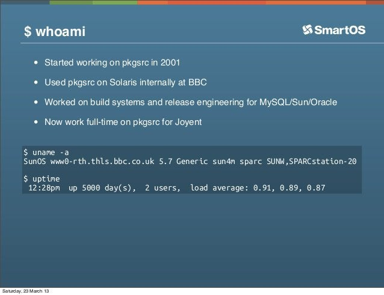

# Week 35

<blockquote class="twitter-tweet" data-conversation="none">
The improvement to the quality of cameras since 2016 has been incredible. This was also <a href="https://twitter.com/hashtag/ShotOnRaspberryPi?src=hash&amp;ref_src=twsrc%5Etfw">#ShotOnRaspberryPi</a> at 33,390 metres during <a href="https://twitter.com/hashtag/Skycademy?src=hash&amp;ref_src=twsrc%5Etfw">#Skycademy</a> flight in August 2016. With thanks to <a href="https://twitter.com/daveake?ref_src=twsrc%5Etfw">@daveake</a> <a href="https://twitter.com/LegoJames?ref_src=twsrc%5Etfw">@LegoJames</a> and others <a href="https://twitter.com/Raspberry_Pi?ref_src=twsrc%5Etfw">@Raspberry_Pi</a> <a href="https://t.co/SJIIYX54uq">pic.twitter.com/SJIIYX54uq</a>
&mdash; Allen Tsui (@TsuiAllen) <a href="https://twitter.com/TsuiAllen/status/1299414587423457285?ref_src=twsrc%5Etfw">August 28, 2020</a></blockquote> 

---

Pi in the Sky! 😊

"Pi In the Sky is a simple and reliable GPS radio tracker board for the Pi"

[Link](http://www.pi-in-the-sky.com/)

---

Balooning with Python and Raspberry Pi! Fantastic!

<blockquote class="twitter-tweet">
Want to create your own High Altitude Ballooning payload programmed with Python? Take a look at <a href="https://twitter.com/Raspberry_Pi?ref_src=twsrc%5Etfw">@Raspberry_Pi</a> &#39;s new tools for HAB <a href="https://t.co/bIBfJnFxpq">https://t.co/bIBfJnFxpq</a>, developed in collaboration with <a href="https://twitter.com/daveake?ref_src=twsrc%5Etfw">@daveake</a>. More content &amp; guides to follow in the coming months. <a href="https://twitter.com/hashtag/picademy?src=hash&amp;ref_src=twsrc%5Etfw">#picademy</a> <a href="https://twitter.com/hashtag/skycademy?src=hash&amp;ref_src=twsrc%5Etfw">#skycademy</a> <a href="https://twitter.com/hashtag/ukhas?src=hash&amp;ref_src=twsrc%5Etfw">#ukhas</a>
&mdash; James Robinson (@LegoJames) <a href="https://twitter.com/LegoJames/status/1014493373149990912?ref_src=twsrc%5Etfw">July 4, 2018</a></blockquote> 

---

"On the first day of summer, Siberia and I were the same
temperature. In Verkhoyansk, roughly 3,000 miles northeast of Moscow,
a searing week ended in an afternoon hotter than any before recorded
north of the Arctic Circle"

[Link](https://www.theatlantic.com/health/archive/2020/08/covid-19-and-climate-change-have-same-root-cause/615844/)

---

"U.S. tech stocks are now worth more than the entire European stock market"

---

"@JessicaHuseman

'Three of the four tenants in the public housing video [at the RNC]
were interviewed on Friday by The New York Times. All three said they
opposed President Trump and were misled about the purpose of the
video.'"

---

"[A] new chemistry has entered the fray, with battery startup EnerVenue
launching today with $12 million in seed funding.

The company is betting on the success of metal hydrogen batteries,
specifically nickel-hydrogen batteries. This chemistry .. was always
held back from greater commercial success due to its high
price. .. EnerVenue ..  has been able to achieve commercialization via
'a breakthrough competitive price using new low-cost materials.' The
company was able to do this by working with EEnotech, a startup that
incubates and accelerates nanotechnology-driven solutions to, among
other things, grid-scale energy storage. ...

Unlike lithium-ion, the company claims that metal-hydrogen batteries
excel operating in conditions of extreme heat and extreme
cold. Specifically, the solution operates optimally from -40° to 140°F
ambient temperatures. Because of this, the battery comes with no risk
of fire or thermal runaway and also includes no toxic materials,
making it recyclable, a huge tip in its favor, as recycling of
materials is only going to grow in importance as the renewable energy
industry grows and evolves. ...

EnerVenue claims that the company’s batteries have a more than 30-year
lifespan, can go through more than 30,000 cycles without experiencing
degradation and offer exceptional overcharge, overdischarge, and
deep-cycle capabilities.

The company also claims cost-per-kilowatt-hour as low as a penny, as
well as capital expenditure costs that beat lithium-ion. The company
stresses its use of low-cost materials."

[Link](https://pv-magazine-usa.com/2020/08/27/enervenue-looks-to-shake-up-the-battery-market-with-metal-hydrogen-technology/)

---

"'As an example of metal hydrogen batteries, nickel-hydrogen batteries
have proven to be an incredibly powerful energy storage technology –
albeit an expensive one – for the aerospace industry over the past 40
years, .. [t]he performance and longevity of nickel-hydrogen batteries
is well-established and second to none. We’re now able to deliver the
same performance and durability at a breakthrough competitive price
using new low-cost materials.' [says EverVenue founder]."

[Link](https://www.h2-view.com/story/enervenue-to-bring-metal-hydrogen-battery-technology-to-market/)

---

<blockquote class="twitter-tweet">
Clean energy storage company <a href="https://twitter.com/EnerVenueInc?ref_src=twsrc%5Etfw">@EnerVenueInc</a>, the first to bring metal-<a href="https://twitter.com/hashtag/hydrogen?src=hash&amp;ref_src=twsrc%5Etfw">#hydrogen</a> batteries to the clean energy revolution, has launched with $12m in seed funding. <a href="https://t.co/js0WFjer3z">https://t.co/js0WFjer3z</a>
&mdash; Joanna Sampson (@JoSamps92) <a href="https://twitter.com/JoSamps92/status/1299276660391411717?ref_src=twsrc%5Etfw">August 28, 2020</a></blockquote> 

---

Math is a tool, we made it up. Infinity is a tool. Imaginery numbers
are a tool. But nature at its core is probably discrete, and math does
connect with nature well. How come?  Well the root of all math is also
discrete -- sets and number theory.

---

<blockquote class="twitter-tweet">
楽しくカエル達に人工餌を食べてもらいました🍣 ただ親方🐸食べ過ぎ😂 <a href="https://t.co/DcRC4l9dY6">pic.twitter.com/DcRC4l9dY6</a>
&mdash; ケロンパス🐸🐢 (@KERONPAS_) <a href="https://twitter.com/KERONPAS_/status/1298817001838620672?ref_src=twsrc%5Etfw">August 27, 2020</a></blockquote> 

---

Always good idea to keep tabs on wronged people, resentment, anger for
social analysis and prediction. Ex; Amazon had a pricing war with
diapers.com, put them out of business. Its founder started a new thing
acquired by Walmart, he now works for Walmart and *runs all their
U.S. e-commerce operations*. This guy must be PISSED, and now in a
position to even the score. His business was destroyed by Amazon now
he works for the competitor. U watch this guy and his drama.

[Link](https://www.vox.com/2017/3/29/15112314/amazon-shutting-down-diapers-com-quidsi-soap-com)

---

"The Getting to Zero Coalition has started mapping some of the many
zero emission pilots and demonstration projects going on around the
world, with hydrogen research leading the way in one form or another
in shipping’s pursuit of a clean fuel"

[Link](https://splash247.com/hydrogen-leading-the-way-in-new-global-zero-emission-study/)

---

MSM gaslights bcz if they talked abt what is truly going on, then
someone could ask 'well how the f--k did left issues end up in the
GOP, why are they not in the Democratic Party?". That is too close for
comfort now.. Then you have to talk about how centrism fucked up for
decades, how unwanted ideological parts landed with a random outsider
who brought it to the GOP.

The gaslighting on Russiagate serves the same purpose. If DJT win
wasn't through "illegal means", then the next question is how did this
guy win legally?

---

We've been in second wave for three centuries now. Given that
structure, there can't be too many wildly, untried solutions. The
means of production dictates certain disconnection, disparate parts
needs to be reconnected, through integrators, implying government,
that needs taxes. The natural next question is *how high* taxes?

Someone says low, someone says high. Two options.

---

After 2016 the talk was abt this "brand new politics", "right
populism". So I waited to hear details... Bannon for example. U
wait.. U wait.. then boom -- word came out he wanted high taxes on the
rich.

That's left bitch!

---

Daaaamm.. BBC is gunning for this guy now

[Link](https://twitter.com/DavidLammy/status/1265411263829549057)

---

Royalty, kings.. these are old-fashioned ideas. Quash it.

---

Thailand.. I've been there once, and it has been in turmoil ever
since... ;)

I remember shooting the shit with ppl there, and in Singapore, about
Thaksin. Good times..

I'll never forget when we went to a movie theather in Bangkok and
right before the movie started, a gov program was displayed praising
the king, and **everyone** got up and put a hand on chest and said
some shit. Like 'Praise the king' or something like that.

---

Fast as funk. How to determine collisions real fast.. Boom. 

[PDF](https://matthias-research.github.io/pages/publications/tetraederCollision.pdf)

---

With `xvfb` u can run visual progs in "headless" mode, no
UI.

`xvfb-run -s "-screen 0 1x1x24" script`. Alias that bih, done.

---

Who wld be a good next PM? Kano, Motegi, Kishida -- all fine. All pro
my favorite first element in the periodic table. Kano is tough on
China. Motegi knows the bureucracy better.

---

"@GearoidReidy

Bombshell - Japan PM Abe will step down NHK reports"

---

Switzerland doesnt join anything. EU, NATO.. But they wouldn't join UN
either, for a long time? Tidbit; North Korea joined before them. The
only country who joined after did not exist before that time. Whatsup

---

Most of the tiny housers seem to live on their parents' property.

---

What kind of regulation would you need anyway for a small structure to
be plopped on some land? Isn't TH kinda like parking a camper van?

[Link](https://youtu.be/KsPJgDqLCb4?t=116)

---

Haha.. kids call YouTube ads "Skip Ads".. Bcz that's the text on the
button they click to skip. Funny.

---

<blockquote class="twitter-tweet">
The world’s first fossil-free <a href="https://twitter.com/hashtag/hydrogen?src=hash&amp;ref_src=twsrc%5Etfw">#hydrogen</a>-powered steel plant located in northern Sweden will begin operations on Monday 31st August. <a href="https://twitter.com/hybrit_project?ref_src=twsrc%5Etfw">@hybrit_project</a> <a href="https://t.co/7L6SNmTs8L">https://t.co/7L6SNmTs8L</a>
&mdash; Molly Burgess (@molly_burgess97) <a href="https://twitter.com/molly_burgess97/status/1298935420080869376?ref_src=twsrc%5Etfw">August 27, 2020</a></blockquote> 

---

<blockquote class="twitter-tweet">
i regret twitter-searching &quot;she-ra&quot; this morning
&mdash; Amanda Hess (@amandahess) <a href="https://twitter.com/amandahess/status/1298966859228893185?ref_src=twsrc%5Etfw">August 27, 2020</a></blockquote> 

---

Funny thing is Trump looks more out of it these days than Biden. 

---

Nice scenery, whole city as a backdrop \#spectral

---

Are there any recent military, action movies in which Max Martini did
*not* play a SpecOp soldier?  I am truly curious. \#spectral

---

*Spectral*, good but forgettable movie.

Did not go to the stash.

---

The Great London Traffic Warden Massacre \#music

[Link](https://youtu.be/JcvXEeZwLlo)

---

---

Funny story when balls were same color they went through eachother for
a while it looked like the bounced off, and I was like WTF!? I didn't
code that! My balls becoming self aware? 🤔 🤔 

---

Good good.. I see some action

[Link](https://twitter.com/muratk3n/status/1298946110245998592)

---

I've seen Jewish girls in Brooklyn with more color than you bitch. What
experience r u talking about?

"@AC360

'[F]ormer UN Ambassador Nikki Haley, cit[es] her experience growing up
as a woman of color"

---

<blockquote class="twitter-tweet">
The dragonflies swarming my car always exists. The love I find for the California’s natural spaces at the worst time is always there. Yesterday at <a href="https://twitter.com/hashtag/WoodwardFire?src=hash&amp;ref_src=twsrc%5Etfw">#WoodwardFire</a>, this slightly charred book page fell at my feet. I’ve found floating pages or papers at every fire since 2017 (2/3) <a href="https://t.co/9hxOYrEIwB">pic.twitter.com/9hxOYrEIwB</a>
&mdash; Jessica Christian (@jachristian) <a href="https://twitter.com/jachristian/status/1298667049468563457?ref_src=twsrc%5Etfw">August 26, 2020</a></blockquote> 

---

Hey if u missed the boat on the next consumer OS dominance, you can
always sue to get your cut.

"Every time you buy an Android smartphone or tablet, Microsoft is
likely receiving 5 to 15 dollars. They likely make at least $2 billion
per year from Android. This financial agreement is all about patent
royalties. Microsoft claims to hold software patents that Android
infringes on, and they threaten lawsuits against Android device
manufacturers until they settle"

[Link](https://www.howtogeek.com/183766/why-microsoft-makes-5-to-15-from-every-android-device-sold)

---

<blockquote class="twitter-tweet">
We&#39;re making waves by powering the largest <a href="https://twitter.com/hashtag/hydrogen?src=hash&amp;ref_src=twsrc%5Etfw">#hydrogen</a> electrolyzer in the United States. What is electroylzer technology and how can it help solve one of the largest dilemmas in the renewable energy industry? Learn more: <a href="https://t.co/N5WgkMiV0z">https://t.co/N5WgkMiV0z</a> <a href="https://twitter.com/hashtag/Cummins?src=hash&amp;ref_src=twsrc%5Etfw">#Cummins</a> <a href="https://t.co/SWuIYCAlgl">pic.twitter.com/SWuIYCAlgl</a>
&mdash; Cummins Inc. (@Cummins) <a href="https://twitter.com/Cummins/status/1299033275906879489?ref_src=twsrc%5Etfw">August 27, 2020</a></blockquote> 

---

"@woodruffbets

SCOOP: Four US troops were injured after a Russian vehicle
intentionally rammed a US vehicle in N. Syria earlier this week"

---

"@beenwrekt

Calling weather forecasting 'AI' denigrates the significant advances
made in weather forecasting over the past century.

On the other hand, I trust weather forecasting more than AI, so
perhaps it’s appropriate that the AI Institute for Trustworthy AI was
awarded to meteorologists at Oklahoma U"

---

Today I put my AI shoes on, my AI shirt, started walking outside. I
checked my AI watch it said 10:45. One minute ago it was 10:44. This
thing is super smart. Fear for your life \#singularity

---

<blockquote class="twitter-tweet">
Ah, we’ve finally reached the point where “AI” truly has no meaning. All hail the singularity. <a href="https://t.co/5LzBj5agYd">pic.twitter.com/5LzBj5agYd</a>
&mdash; Ben Recht (@beenwrekt) <a href="https://twitter.com/beenwrekt/status/1298640144962973699?ref_src=twsrc%5Etfw">August 26, 2020</a></blockquote> 

---

<blockquote class="twitter-tweet">
Construction of the Hydrogen Energy Supply Chain (HESC) Project’s Hastings site, in Victoria, Australia, where <a href="https://twitter.com/hashtag/hydrogen?src=hash&amp;ref_src=twsrc%5Etfw">#hydrogen</a> will be liquefied, stored, and loaded onto a ship for export, has been completed. <a href="https://t.co/5iTFfxRCde">https://t.co/5iTFfxRCde</a>
&mdash; Joanna Sampson (@JoSamps92) <a href="https://twitter.com/JoSamps92/status/1298614587537924097?ref_src=twsrc%5Etfw">August 26, 2020</a></blockquote> 

---

Taxing rich people, saving social security.. Man o man..

---

😆 😆 😆 

CNN, 1999: "Billionaire businessman Donald Trump has a plan to pay off
the national debt, grant a middle class a tax cut, and keep Social
Security afloat: tax rich people like himself"

[Link](https://edition.cnn.com/ALLPOLITICS/stories/1999/11/09/trump.rich/index.html)

---

<blockquote class="twitter-tweet">
I want naan, not NaN.
&mdash; Winnie Xu (@winniethexu) <a href="https://twitter.com/winniethexu/status/1298107871260020737?ref_src=twsrc%5Etfw">August 25, 2020</a></blockquote> 

---

<blockquote class="twitter-tweet">
Charles Booker ran an historic, grassroots campaign for the U.S. Senate centered on a Green New Deal, Medicare for All, and bold criminal justice reform. I&#39;m grateful to have earned <a href="https://twitter.com/Booker4KY?ref_src=twsrc%5Etfw">@Booker4KY</a>&#39;s support and know that he will lead the future of progressive politics in our country. <a href="https://t.co/TKr9m9EnfJ">pic.twitter.com/TKr9m9EnfJ</a>
&mdash; Ed Markey (@EdMarkey) <a href="https://twitter.com/EdMarkey/status/1298613994488508422?ref_src=twsrc%5Etfw">August 26, 2020</a></blockquote> 

---

---

"[Web inventor] Berners-Lee had physical copies of the Web [at a conference] to
give out. Because there was no internet porn yet, nor a fascination
with cats, the whole thing fit on a floppy disk"

[Link](https://www.kotaku.com.au/2014/03/the-internet-used-to-fit-on-a-single-floppy-disk/)

---

<blockquote class="twitter-tweet">
I’ve come to the conclusion that almost everything in life is easier than raising kids. Thought I’d put that out there just in case anyone felt alone in that lil struggle. ❤️
&mdash; Jewel Staite (@JewelStaite) <a href="https://twitter.com/JewelStaite/status/1297390402882813954?ref_src=twsrc%5Etfw">August 23, 2020</a></blockquote> 

---

"Clean gas turbine manufacturer Capstone Turbine has collaborated with
the US Department of Energy’s Argonne National Laboratory to develop a
hydrogen operable microturbine product"

[Link](https://www.h2-view.com/story/capstone-progresses-with-microturbine-hydrogen-testing/)

---

Hah. The vanished Flight 370 was carrying lithium ion batteries. 

[Link](https://youtu.be/kd2KEHvK-q8?t=730)

---

"It seems like renewable hydrogen will play a vital role in The Green
Deal that should contribute to Europe becoming the first carbon
neutral continent in the world, and Nel aims to leverage on these
opportunities going forward"

[Link](https://www.h2-view.com/story/nel-reiterates-strong-outlook-in-q2-results/)

---

Tantrum messaging..? Are they being evil?

"@danieljbaird

Google's intrusive tantrum messaging about not getting their way in
Australia vs the ACCC is pissing me off. Pushing me back to Apple and
other services"

---

<blockquote class="twitter-tweet">
Q2 key takeaways: revenues up 21% vs Q2-19, all-time-high backlog &amp; cash balance to support investments in organisation &amp; tech, &amp; the capacity of first stage <a href="https://twitter.com/hashtag/electrolyser?src=hash&amp;ref_src=twsrc%5Etfw">#electrolyser</a> expansion will be 500 MW/year. Full report &amp; link to live pres. 08:00 CET today: <a href="https://t.co/Iri8BAlZXb">https://t.co/Iri8BAlZXb</a> <a href="https://t.co/XvH4ux57GF">pic.twitter.com/XvH4ux57GF</a>
&mdash; Nel Hydrogen (@nelhydrogen) <a href="https://twitter.com/nelhydrogen/status/1298487632125726720?ref_src=twsrc%5Etfw">August 26, 2020</a></blockquote> 

---

"@RyseHydrogen

@PeelLandP has completed the front end engineering design for what
will become UK’s first waste plastic to hydrogen facility"

---

"@TheAgeofShoddy

The degree to which you can get away with shit by looking the part and
speaking convincingly reveals just how much of human society runs on
trust"

[Link](https://twitter.com/TheAgeofShoddy/status/1298501072005115906)

---

`ipyvolume`.. looks good too.... 🤔

---

That was one spaghetti of a code.. I actually saw `global` keyword in
there. Not cool. Corrected. \#pyopengl

---

"Computer graphics people often claim that even complex behaviours of
bodies can be frequently approximated by mass-spring systems"

---

Witkin, Pixar Animation Studios: "For example, a wide variety of
nonrigid structures can be built by connecting particles with simple
damped springs"

---

Sometimes it feels like there is reality, and there is a make-belief
version of reality where every role in real life is acted out by
someone else. In this bizarro show world, there is a "science guy",
"inventor genius", "politics guru" who play the make-belief versions
of the real characters.

These ppl are full of shit. The problem is when they start believing
their own shit more and more, we might get "policy by celebrity",
policy based on ideas thrown around by fakers, impostors.

---

[Not this guy](https://youtu.be/gN_wAVP043g?t=79)

That was a cameo on a major scifi show BTW.

---

That's right. And [this](https://twitter.com/plutokiller/status/1297953753174126594) is the guy who did it.

<blockquote class="twitter-tweet">
Yesterday was <a href="https://twitter.com/hashtag/PlutoDemotedDay?src=hash&amp;ref_src=twsrc%5Etfw">#PlutoDemotedDay</a> 😥   It&#39;s a day that marks Pluto&#39;s status being downgraded from a full sized planet to a dwarf planet. But whether a full planet or not, <a href="https://twitter.com/hashtag/Pluto?src=hash&amp;ref_src=twsrc%5Etfw">#Pluto</a> started out hot!   Read more in this <a href="https://twitter.com/CosmosMagazine?ref_src=twsrc%5Etfw">@CosmosMagazine</a> article: <a href="https://t.co/snhm2luKUW">https://t.co/snhm2luKUW</a>
&mdash; Australian Space Agency (@AusSpaceAgency) <a href="https://twitter.com/AusSpaceAgency/status/1298168276036603905?ref_src=twsrc%5Etfw">August 25, 2020</a></blockquote> 

---

Alan Hawkshaw - Rocky Mountain Runabout \#music

[Link](https://youtu.be/JExdP1CrfVI)

---

Jacky Giordano - Latest News \#music

[Link](https://youtu.be/4gX0TfZB2CM)

---

Dude wrote a rough flight simulator in less than 400 LOC in C++ w OpenGL. Impressive.

---

That machine has been running without reboot for nearly 14 years.

Unix is awesome.

---

"It works on my machine" is the quintessential response to "your code
doesn't work" in IT or other computer based professions, it is now a
running joke.

---

I laughed at that more than I should..

<blockquote class="twitter-tweet">
This brave new world :P <a href="https://t.co/2E53Cw6tZn">pic.twitter.com/2E53Cw6tZn</a>
&mdash; Daniel Baird (@danieljbaird) <a href="https://twitter.com/danieljbaird/status/1298126617026285569?ref_src=twsrc%5Etfw">August 25, 2020</a></blockquote> 

---

If things hadn't gotten so bad voters wouldn't opt for a complete
outsider. Experience and endorsements matter to them, they dont know
much abt pol, so ext confirmation is needed. But it is interesting to
see even then, part of the collective subconcious created the
"respected leaders of government asked Trump to run" legend which is
basically what QAnon is about. "He couldn't have been some f-ing
guy!". That is the hole this consp is trying to fill.

---

<blockquote class="twitter-tweet">
Apropos of nothing, the warmest five years in the Gulf of Mexico were the last five years in a row. <a href="https://twitter.com/hashtag/HurricaneMarco?src=hash&amp;ref_src=twsrc%5Etfw">#HurricaneMarco</a> <a href="https://twitter.com/hashtag/HurricaneLaura?src=hash&amp;ref_src=twsrc%5Etfw">#HurricaneLaura</a>  Data: HadISST for 1870- and <a href="https://twitter.com/NOAA?ref_src=twsrc%5Etfw">@NOAA</a> OIv2 for 1982- <a href="https://t.co/O4U0YdEElO">pic.twitter.com/O4U0YdEElO</a>
&mdash; Kris Karnauskas (@OceansClimateCU) <a href="https://twitter.com/OceansClimateCU/status/1297898119909130241?ref_src=twsrc%5Etfw">August 24, 2020</a></blockquote> 

---

"Texas, with its sprawling petrochemical industry, powerhouse energy
companies and numerous research institutions, could lead the way in
hydrogen adoption"

[Link](https://www.mysanantonio.com/sa-inc/article/Hydrogen-energy-may-be-on-the-cusp-And-Texas-has-15496784.php)

---

"You just can’t fill a battery .. any truck that wants over a 500-mile
range, you’re looking at least at a 1,000-kilowatt battery. That’s a
lot of weight. That’s a lot of energy. And to charge it, if you want
to do that in 15 minutes you’re going to need a 4-megawatt
charger. That’s massive and I can only imagine what that looks like
with regards to cable, or just the capacity required to get that
energy to a truck."

[Link](https://www.ccjdigital.com/hydrogen-power-trucking-forward-critics-argue/)

---

"The researchers found that they could produce hydrogen from water,
while simultaneously transforming benzylamine to benzaldehyde"

[Link](https://www.sciencedaily.com/releases/2020/08/200817104305.htm)

---

<blockquote class="twitter-tweet">
$1.5m has been awarded to Australian researchers developing a <a href="https://twitter.com/hashtag/hydrogen?src=hash&amp;ref_src=twsrc%5Etfw">#hydrogen</a> pilot project in the Latrobe Valley, which is expected to change the way energy is produced both in Australia and across the globe. <a href="https://t.co/vhTRQ06PAj">https://t.co/vhTRQ06PAj</a>
&mdash; Joanna Sampson (@JoSamps92) <a href="https://twitter.com/JoSamps92/status/1297828017687986176?ref_src=twsrc%5Etfw">August 24, 2020</a></blockquote> 

---

"@molly_burgess97

Germany’s first [H2] steel production plant that uses the green gas as
reducing agent in the blast furnace has begun operation"

---

[Picture \#1](twimg/EgPfBQdWoAEFmsW.jpg).

[Picture \#2](twimg/EgPe-HTWkAAKbbl.jpg).

His degree of seperation to Epstein is 2. This guy is fukked.

---

Rahm -- shut the fukk up.

---

Forget 5G. Let's use this.

"University College London (UCL) has recorded the world’s fastest data
transmission speed, reaching 178 terabits a second -or 178,000,000
megabits a second- by using a bandwidth of 16.8 THz.

At double the capacity of any system currently deployed in the world,
the speed was close to the theoretical limit of data transmission set
out by American mathematician Claude Shannon in 1949.

The record was achieved by a research team led by Dr Lidia Galdino
(pictured), lecturer at UCL and Royal Academy of Engineering research
fellow, in collaboration with Xtera and KDDI Research.

Not only did they achieve the speeds – outperforming the previous
record set by researchers in Japan by one fifth – the team also found
such speeds could be deployed on already existing infrastructure.

In 'real terms', 178 terabits a second is so fast it would be possible
to download the entire Netflix library in less than a second.  ..

The record was achieved by transmitting data through a much wider
range of colours of light, or wavelengths, than is typically used in
optical fibre"

[Link](https://www.capacitymedia.com/articles/3826180/ucl-sets-internet-speed-record-of-178tbps)

---

Wait.. I know the answer for that one...

"What Contains 3 Times More Energy Than Gasoline, But Produces Zero
CO2?"

[Link](https://www.forbes.com/sites/davidrvetter/2020/08/21/what-contains-3-times-more-energy-than-gasoline-but-produces-zero-co2/)

---

<blockquote class="twitter-tweet">
Warning: Anti-Lukashenko Protests Erupt across Belarus. Belarusians are protesting throughout the entire country &amp; in almost every significant urban area.   New map and analysis on the evolving situation in <a href="https://twitter.com/hashtag/Belarus?src=hash&amp;ref_src=twsrc%5Etfw">#Belarus</a> from ISW&#39;s <a href="https://twitter.com/georgewbarros?ref_src=twsrc%5Etfw">@georgewbarros</a>: <a href="https://t.co/T7yxvxv6sR">https://t.co/T7yxvxv6sR</a><a href="https://twitter.com/hashtag/%D0%91%D0%B5%D0%BB%D0%B0%D1%80%D1%83%D1%81%D1%8C?src=hash&amp;ref_src=twsrc%5Etfw">#Беларусь</a> <a href="https://t.co/uaB6D38Mwi">pic.twitter.com/uaB6D38Mwi</a>
&mdash; ISW (@TheStudyofWar) <a href="https://twitter.com/TheStudyofWar/status/1297613151979134976?ref_src=twsrc%5Etfw">August 23, 2020</a></blockquote> 

---

Russia does look overly massive in most maps... 

<blockquote class="twitter-tweet">
The Mercator projection vs the true size of each country. <a href="https://t.co/6wnmCkxN86">pic.twitter.com/6wnmCkxN86</a>
&mdash; Universal-Sci (@universal_sci) <a href="https://twitter.com/universal_sci/status/1297308108407083008?ref_src=twsrc%5Etfw">August 22, 2020</a></blockquote> 

---

<blockquote class="twitter-tweet">
Why not, It&#39;ll just be reliving my life before I left that string of hellholes at 22. Garbage layout looks like Frisco to me, one of the harsher ones, but I could pass the time by walking around lake Lewisville...
&mdash; It&#39;s Happening Bro! Also Free #HK (@subach) <a href="https://twitter.com/subach/status/1297431847656288257?ref_src=twsrc%5Etfw">August 23, 2020</a></blockquote> 

---

<blockquote class="twitter-tweet">
In one of <a href="https://twitter.com/hashtag/H2View?src=hash&amp;ref_src=twsrc%5Etfw">#H2View</a>’s top stories this week <a href="https://twitter.com/hashtag/PlugPower?src=hash&amp;ref_src=twsrc%5Etfw">#PlugPower</a> has developed a new 1kW ProGen fuel cell system for small scale robotics, automatic guided vehicles (AGVs), unmanned aerial vehicles (UAVs), and other aerospace applications.<a href="https://twitter.com/hashtag/H2View?src=hash&amp;ref_src=twsrc%5Etfw">#H2View</a> <a href="https://twitter.com/hashtag/hydrogen?src=hash&amp;ref_src=twsrc%5Etfw">#hydrogen</a> <a href="https://t.co/HUlLPSaXpe">https://t.co/HUlLPSaXpe</a>
&mdash; H2 View (@h2_view) <a href="https://twitter.com/h2_view/status/1297101211884281856?ref_src=twsrc%5Etfw">August 22, 2020</a></blockquote> 

---

In 1968 Carl Sagan was denied tenure at his university. Let that sink
in, CS, one of the best explainers of science, a visible scientific
personality, was denied tenure. They were correct in doing so, "being
an explainer" doesn't mean a research is being furthered in any
front. TAlking to bunch of uninformed people, "popularizing" is not
research. It could be inspiring people, but that's about it. You can't
do science by publicity.

---

[Whatever it takes](../../2020/07/right-acting-left.html#tmp1)

---

People wld still suffer, bcz of the shortcomings of the market, sure,
e.g. they'd have to organize a GoFundMe for a dentist appointment, but
then the cure would be clearer; the opposition party.

---

McCain and Romney were both close to libertards, but their elec loss
doesnt mean the mov is discredited. 2008 crisis wouldnt happen in a
truly market econ, libertards hate them. Fenni Mae and Freddie Mac are
*centrist* institutions. Part gov, part market, little in, little out,
doing massive securitization with gov guarantee.. how is this not a
f-ing abomination, hallmark of centrism?

---

Distinct right needs to exist just like distinct left. Going lukewarm
on each issue (centrism) doesn't work. Mixing distinct issues from
each side doesn't work (fascism). Clear-cut ideology needs to be in
different parties. We need tards in GOP being against excessive
regulation, pro-market, etc.. and a left party being opposite of that.

---

I bash libertards sometimes but they should be in charge of the
Republican Party. And moving towards distinct ideologies was taking
place actually, The Tea Party movement was all about this, no? But GOP
got sidetracked from that somehow (bcz of fear? but then ended with
something far worse, in their eyes).

---

He tried to do this *before* the pandemic BTW

---

Reining in drug prices? What are you -- a leftist?

There is a maaaarket, supply, and demaaaand.

I guess he didn't care. 

July 2019: "Trump's Efforts to Rein In Drug Prices ..".

[Link](https://www.nytimes.com/2019/07/11/health/drug-prices-rebate-donald-trump.html)

---

Scientists then were essentially looking at a 2D projection of a 3D
system, which they did not know but had to reason about
mathematically. They had to be a mathematical detective. *This* is
science. None of that process is thought, or even hinted at, at
schools, even to kids who can grasp it. What we teach today is
cargo-cult science, even if the material is the outcome of real
science.

---

Teaching science wout teaching how scientist came up with that
science, makes zero sense. Now we know about planets, orbits, our
sun-centric system, we see pictures like the one below all over the
place, in many books thanks to the scientist that led to them.

But that's not what they themselves saw in the sky. When they looked,
for example at Mars, over many days, this is what they saw,

This is 2D. Bunch of dots on a (sky) screen. How do you get to the
first picture from the second? How did Copernicus do it? This was the
biggest detective story of the ancient times. Skipping that train of
thought is a disservice too all students.

---

"A new type of plastic that can be easily broken down into its chemical
building blocks and reassembled into high-quality products
could reduce the amount of plastic waste ending up in landfill"

[Link](https://www.newscientist.com/article/2252265-a-new-type-of-plastic-may-be-the-first-that-is-infinitely-recyclable/#ixzz6VsburzcR)

---

Not bad. 

"Isaac Newton estimated, without access to reliable measurement, that
the density of Earth would be five or six times as great as the
density of water, which is surprisingly accurate (the modern value is
5.515). Newton under-estimated the Earth's volume by about 30%, so
that his estimate would be roughly equivalent to 4.2±0.5 × 10^24 kg"

[Link](https://en.wikipedia.org/wiki/Earth_mass#Early_estimates)

---

