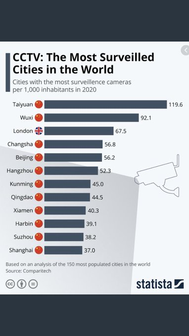
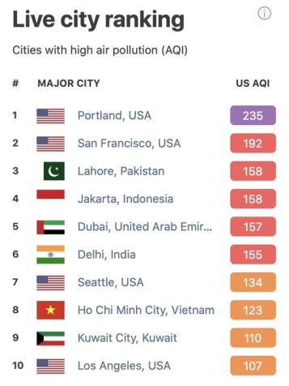
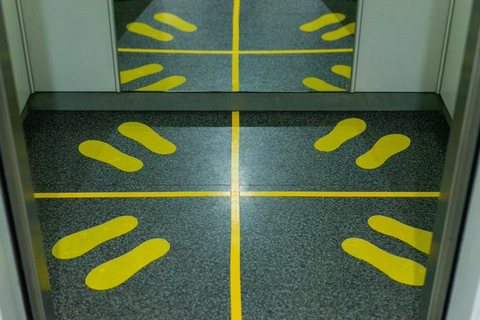

# Week 37

"Facebook sues the Irish data protection watchdog in a bid to stop the
proposed order that could stop trans-Atlantic transfers of EU users'
data"

---

"@Jkylebass

An idea for all countries that are victims of China's Belt and Road
loans... Remember that any loan entered into via bribery or coercion
is invalid. You can treat it as a donation made by the Chinese
Communists. We should push for a Belt and Road Jubilee"

---

With -32% GDP growth Trump is toast. His only chance is if people
"understand" the predicament (not in the model, never seen before
situation), and if that offsets growth as if it was zero percent, as
in none, then the situation becomes neck and neck due to
incumbency. Long shot. Net popularity at -9%. 

---

 

---

"@Taniel

JUST IN: In Rhode Island, 8 incumbent lawmakers have lost to
challengers running to their left in Tuesday's Dem primaries... In
addition, at least 2 progressives won open primaries against
party-endorsed candidates"

---

"@Canning4Oregon

Big takeaways from @OregonGovBrown  presser:

- Salem-area fires are expected to merge.

- evacs in Portland metro is possible

- decent \# of ppl fighting fires are students

- we need MIN 2x the ppl power

- have requested aid from DoD

- WH hasn’t returned call"

---

"@AP

BREAKING: Authorities say about 500,000 have been forced to evacuate
due to Oregon wildfires, roughly 10% of state's population"

---

<blockquote class="twitter-tweet"><p lang="en" dir="ltr">Current status: PM2.5 of 352 ug/m^3, or for you AQI fans out there, 402. If you prefer words from the EPA, simply &quot;hazardous.&quot; I have never ever ever even seen CLOSE to this much smoke in the air. Anywhere. Ever. (And it is worse in places up and down the west coast).</p>&mdash; Mike Brown (@plutokiller) <a href="https://twitter.com/plutokiller/status/1304425599360929793?ref_src=twsrc%5Etfw">September 11, 2020</a></blockquote> <script async src="https://platform.twitter.com/widgets.js" charset="utf-8"></script>

---

"@AthertonKD

currently my plan for retirement is either that we have a wholly
different politics by the 2050s or I'll die from climate change
related reasons before then"

---

"Statistically, half the people you meet are below average"

---

<blockquote class="twitter-tweet"><p lang="en" dir="ltr">Australia leaps towards Dr Finkel’s vision to develop a hydrogen industry, after the signing of an agreement with Germany yesterday to investigate a bilateral <a href="https://twitter.com/hashtag/hydrogen?src=hash&amp;ref_src=twsrc%5Etfw">#hydrogen</a> supply chain <a href="https://twitter.com/Birmo?ref_src=twsrc%5Etfw">@Birmo</a> <a href="https://twitter.com/keithjpitt?ref_src=twsrc%5Etfw">@keithjpitt</a> <a href="https://twitter.com/AnjaKarliczek?ref_src=twsrc%5Etfw">@AnjaKarliczek</a> More here: <a href="https://t.co/tFwjhsuJGK">https://t.co/tFwjhsuJGK</a> <a href="https://t.co/dlS6EhDvbB">pic.twitter.com/dlS6EhDvbB</a></p>&mdash; Chief Scientist (@ScienceChiefAu) <a href="https://twitter.com/ScienceChiefAu/status/1304294169213628417?ref_src=twsrc%5Etfw">September 11, 2020</a></blockquote> <script async src="https://platform.twitter.com/widgets.js" charset="utf-8"></script>

---



---

"[N]o rain for months, the land was primed for fires. At 3 am I looked
out my window and saw people in the building across the way watching
the same synaptic arms of lightning stretch across the sky, turning it
for a moment from black to light blue. We knew this would not go well.

Over 12,000 lightning strikes were reported during the week of August
19; Cal Fire reports that in 2020 alone there have been over 7,452
fires in California and since those fires started over one 2.6 million
acres have burned, and counting. These are the worst fires in
California’s history. And they are still burning"

[Link](https://www.esquire.com/news-politics/a33980804/california-fire-sky-climate-change-another-planet/)

---

Ed needs to start with what they saw, and connect the dots. At the
very least tracing their steps will encourage a spirit of research in
students.

---

"Planets orbit in circles around the sun. One may wonder how
Copernicus determined the order of the planets and the size of their
orbits – after all, he had no benefit of pictures from spacecraft or
even a telescope. He determined these things by measuring elongation"

[Link](https://astro.unl.edu/naap/ssm/modeling2.html)

---

He used elongations. 

"How can I teach the method Copernicus used to determine orbits?"

---

"California Energy Commission regulators on Friday approved $39.1m of
funding for 36 new hydrogen stations in the sunshine state, marking
the largest California investment in hydrogen infrastructure since
2015"

[Link](https://www.h2-view.com/story/california-funds-36-more-hydrogen-stations/)

---

<blockquote class="twitter-tweet"><p lang="en" dir="ltr">why does making beer need wifi now <a href="https://t.co/X8gQSRY9JG">https://t.co/X8gQSRY9JG</a></p>&mdash; Internet of Shit (@internetofshit) <a href="https://twitter.com/internetofshit/status/1304211842462560256?ref_src=twsrc%5Etfw">September 11, 2020</a></blockquote> <script async src="https://platform.twitter.com/widgets.js" charset="utf-8"></script>

---

*The Predator* 2018 👍 That almost felt like pre-2016, good movie,
pre-SJW, pre-cuck. Ster. Brown plays a pure, hilarious asshole... I am
getting a young Charles Bronson vibe form the lead... And they had Da
Strahovski. Very foxy.

---

"@susie_c

I feel like I've held it together pretty well the last six months of
pandemic pregnancy but this may be my undoing. COBRA says they sent my
payment, my insurer says they haven't received anything. They're both
shrugging while I still don't have coverage"

---

"Trump’s staffing struggle: After 3 years, unfilled jobs across the
administration. The 45th president has struggled with key political
appointments more than any recent president — despite his party’s
control of the Senate"

[Link](https://www.politico.com/amp/news/2020/01/20/trumps-staffing-struggle-unfilled-jobs-100991)

---

*The Guardian*: "The sky was the muddy yellow of an old bruise at 7am
in San Francisco on Wednesday, and by eight it was a dull orange and
the darkness that felt like night was coming on. This morning was
perhaps the most unnatural-feeling and unnerving of my life, with
darkness rather than daytime rolling in. People around California
reported that the birds that would normally be singing were silent ...

What is happening now is astonishingly worse than the western fire
season ever has been before. There are catastrophic fires in Oregon
–burning down a small town and prompting the evacuation of much of the
small city of Medford. Near Oroville in northeastern California, a
fire expanded by a quarter million acres in 24 hours, so far as the
experts can tell. That is a new kind of fire and we are in a new kind
of era. ...

I have lived in San Francisco all my adult life, which has meant
living in relationship to the Pacific and its damp cool breath in the
form of our famous fog. Often in summertime the rising heat inland
sucks the cool air off the ocean in the form of fog ...

Here the ocean is a beloved ally, bringing us cool fresh clean air—and
most of our weather comes from over the Pacific – but we are not the
ocean’s ally: the world’s oceans have soaked up most of the heat
climate change has produced, with disastrous consequences"


[Link](https://www.theguardian.com/commentisfree/2020/sep/10/us-west-fire-season-california-oregon-climate-action)

---

California handing out fracking permits, says journo..? 🤨 That's my WTF emoji

---

"@SevaUT

who said something like: if you can point to a single battle as the
cause of an empire?s downfall, you really ought to ask how the fate of
an empire came to hinge on a single battle"

---

I see your trying to be interesting w contra take and raise you a
plain observation. It looks like f..ing hell.

"@vruba

But the orange skies in San Francisco, as unsettling as they are, are
not the crisis"

---

Haha there is some BEV fan interest for gyrochoppa, bcz maybe
batteries completely wont crash this thing..?. "We can move something
for 20 minutes instead of our miserable 10! Rejoice!".

---

"@CLIMATECH2AMP

What’s clean, efficient and completely affordable?"

[Link](https://mobile.twitter.com/CLIMATECH2AMP/status/1303436974402002945)

---

The gunner is standing at a weird place, but interesting ..


---

Outsider perspective my ass...

---

Who was that tough guy on that Serbia / Kosova "deal" press conference
who kept saying "outsider perspective", "untried" was provided for
this issue..? Has the problem been solved or not? Or did US get
another photo op, few seconds soundbyte on that day's news cycle?

"Serbia will not fulfill its promise to move its embassy to Jerusalem
if Israel recognizes its enemy Kosovo, a source close to the
government in Belgrade warned Wednesday, adding that formal
recognition of Pristina’s 2008 declaration of independence by Israel
would 'destroy' the Jewish state’s relationship with Serbia"

---

Yes!

WEAPONS AT MAXIMUM

"Prepare a U.A.V. with U.C.A.V. specs"

---

If that's a problem, then don't crowd in cities 

Ineffective from a pandemic POV as well..

---

Its called the United States, not United Cities.

Giving landmass more of a weight is absolutely the right thing to
do. Electoral Collage is smart. More democratic even, bcz different
regions have different needs. What better way to balance those needs
than to spread out representation as wide, regionally, as possible,
throught the EC?

---

<blockquote class="twitter-tweet"><p lang="en" dir="ltr">The biggest change in steel production in over 1,000 years. Together with our partners LKAB and SSAB, we have created HYBRIT – an initiative to create fossil free steel using electricity and hydrogen. <a href="https://twitter.com/hashtag/HYBRIT?src=hash&amp;ref_src=twsrc%5Etfw">#HYBRIT</a> <a href="https://twitter.com/hashtag/Vattenfall?src=hash&amp;ref_src=twsrc%5Etfw">#Vattenfall</a><br><br>Watch a longer version on YouTube <a href="https://t.co/6RwykBzWsl">https://t.co/6RwykBzWsl</a> <a href="https://t.co/ji1JOjMI9d">pic.twitter.com/ji1JOjMI9d</a></p>&mdash; Vattenfall Group (@VattenfallGroup) <a href="https://twitter.com/VattenfallGroup/status/1303334719606718464?ref_src=twsrc%5Etfw">September 8, 2020</a></blockquote> <script async src="https://platform.twitter.com/widgets.js" charset="utf-8"></script>

---

Damn.. nobody wants to leave anything to chance this time
around.. Oppo comes hard and fast. Never seen holes getting plugged
this quick.

---

"@EliseSchmelzer

A new program in Denver that sends a paramedic+a mental health expert
to 911 calls instead of police launched... So far, the van has taken
more than 350 calls without once having to call in police backup"

[Link](https://mobile.twitter.com/EliseSchmelzer/status/1303354576750346241)

---

<blockquote class="twitter-tweet"><p lang="en" dir="ltr">I don’t think people are aware of how much of the west coast is burning right now: <a href="https://twitter.com/hashtag/WaWILDFIRE?src=hash&amp;ref_src=twsrc%5Etfw">#WaWILDFIRE</a> <a href="https://twitter.com/hashtag/OregonFires?src=hash&amp;ref_src=twsrc%5Etfw">#OregonFires</a> <a href="https://twitter.com/hashtag/CAfire?src=hash&amp;ref_src=twsrc%5Etfw">#CAfire</a> <a href="https://t.co/nacy1OUr7C">https://t.co/nacy1OUr7C</a> <a href="https://t.co/tuFdJ2n0np">pic.twitter.com/tuFdJ2n0np</a></p>&mdash; Matt Zieger (@mattzieger) <a href="https://twitter.com/mattzieger/status/1303564302574522370?ref_src=twsrc%5Etfw">September 9, 2020</a></blockquote> <script async src="https://platform.twitter.com/widgets.js" charset="utf-8"></script>

---

Great.. Let's hope it is permanent. 

"'I'm more anti-China than you!'. That's a new theme of this
election. Joe Biden says, "We will never again be at the mercy of
China!"  ...  just a few administrations ago, presidents were eager to
celebrate China. 'A future of greater trade and growth and human
dignity is possible!' said George W. Bush. Bill Clinton praised
China's 'positive change' and 'great progress.'"

---

"@HillelNeuer

Dear @Disney: At the United Nations I'm trying to sound the alarm on
China's destruction of its Uighur Muslims. Now your film Mulan pays
tribute to the very entities involved in herding 1 million Uighurs
into camps. Do you think the camps are Disneyland?"

[Link](https://twitter.com/HillelNeuer/status/1303113121498886147)

---

The aircraft needs a runway, the top rotor blades aren't powered,
can't do vertical descent / ascend. That's probably why helicopters
were preferred, especially for military reasons. But funky little
aircraft. Looks fun.

---

Gyrochoppa

"Unlike a helicopter, which uses an engine to power its spinning rotor
blades, a gyroplane's upper rotor blades aren't powered by an
engine. Instead, the engine powers a back propeller that pushes the
gyrocopter forward. As the aircraft moves, air passes naturally
through its rotor blades, creating lift. ... If a gyroplane's engine
failed, its blades would already be auto-rotating, so the aircraft
would gradually descend"

[Link](https://www.wtsp.com/article/news/difference-between-helicopter-gyrocopter/67-14e7da97-9fec-4b26-9d0f-2e536c0c149b)

---

Just saw dude's post on a gyrocopter

[Link](https://twitter.com/SamChuiPhotos/status/1303377510072307712)

---

"@AthertonKD

the sky is yellow-grey, the power flickers off intermittently, and I
learned today that at certain wind speeds the front door whistles"

---

Real estate fraud? Jeez.

I guess some ppl are addicted to the hustle. 

In some ways image making, certain art is propaganda, in excess, a lie. 

@mollylambert

I believe that @caitraft knows why Kardashians was cancelled because
she’s been right about every other weird Kardashian story recently
including the ones involving real estate fraud

---

<blockquote class="twitter-tweet"><p lang="en" dir="ltr">fuck k-12 <a href="https://t.co/YocoG2qz4R">https://t.co/YocoG2qz4R</a></p>&mdash; talia ‘stop filming faces’ jane (@itsa_talia) <a href="https://twitter.com/itsa_talia/status/1303507911872851969?ref_src=twsrc%5Etfw">September 9, 2020</a></blockquote> <script async src="https://platform.twitter.com/widgets.js" charset="utf-8"></script>

---

"@rtyson82

Insurance companies helping to defund police by increasing liability
premiums 46% due to excessive force and wrongful death settlements,
leading to the sheriff having to propose a $14 million cut in staffing
and programs to close its budget deficit"

---

<blockquote class="twitter-tweet"><p lang="en" dir="ltr">Queensland is investing heavily to deliver targets of 50% renewable energy by 2030 or net zero emissions by 2050. With a $145m allocation for three new Renewable Energy Zones in Queensland. <br><br>Read more: <a href="https://t.co/Ig14Umn3Bq">https://t.co/Ig14Umn3Bq</a><a href="https://twitter.com/hashtag/hazergroupltd?src=hash&amp;ref_src=twsrc%5Etfw">#hazergroupltd</a> <a href="https://twitter.com/hashtag/hydrogen?src=hash&amp;ref_src=twsrc%5Etfw">#hydrogen</a> <a href="https://twitter.com/hashtag/queensland?src=hash&amp;ref_src=twsrc%5Etfw">#queensland</a> <a href="https://twitter.com/hashtag/cleantech?src=hash&amp;ref_src=twsrc%5Etfw">#cleantech</a> <a href="https://t.co/loaIBKNjDs">pic.twitter.com/loaIBKNjDs</a></p>&mdash; Hazer Group Ltd (@hazergroupltd) <a href="https://twitter.com/hazergroupltd/status/1303543688816209925?ref_src=twsrc%5Etfw">September 9, 2020</a></blockquote> <script async src="https://platform.twitter.com/widgets.js" charset="utf-8"></script>

---

Odd I never included this code in personal tutorials.. The right time
was now apparently. Good thing I put it on one Q&A site, recovered
from there.

---

Ah yes.. I needed numerical implementation of a certain operator.. I
looked and found one, guy did good job. Wait.. that was me!

---

The future cannot arrive fast enough. 

---

<blockquote class="twitter-tweet"><p lang="en" dir="ltr">when you make your coffee at home <a href="https://t.co/opnz7mMcuy">pic.twitter.com/opnz7mMcuy</a></p>&mdash; juan vidal (@itsjuanlove) <a href="https://twitter.com/itsjuanlove/status/1303135727618789382?ref_src=twsrc%5Etfw">September 8, 2020</a></blockquote> <script async src="https://platform.twitter.com/widgets.js" charset="utf-8"></script>

---

<blockquote class="twitter-tweet"><p lang="en" dir="ltr">Together with <a href="https://twitter.com/AgQuantron?ref_src=twsrc%5Etfw">@AgQuantron</a>, a specialist in the field of commercial vehicle conversion, we will create the first fuel cell stack developed specifically for heavy-duty trucks! The first prototype system will be tested soon. <a href="https://t.co/FTYQzcnEch">https://t.co/FTYQzcnEch</a> <a href="https://t.co/3Nrt799V9Q">pic.twitter.com/3Nrt799V9Q</a></p>&mdash; Freudenberg Sealing (@Freudenberg_FST) <a href="https://twitter.com/Freudenberg_FST/status/1303318655149780992?ref_src=twsrc%5Etfw">September 8, 2020</a></blockquote> <script async src="https://platform.twitter.com/widgets.js" charset="utf-8"></script>

---



---

"@AthertonKD

... PG&E [of California] should've been socialized and turned into a
public utility any of a half-dozen times in its history"

---

Welcome to the jungle

"[Reports of firing] on the Line of Actual Control (LAC) in Eastern
Ladakh sector where troops of India and China have been engaged in a
stand-off for over three months"

---

"India successfully test scramjet technology for hypersonic missiles"

[Link](https://timesofindia.indiatimes.com/india/india-successfully-test-scramjet-technology-for-hypersonic-missiles/articleshow/77973889.cms)

---

Corp profits are down -20% YOY. Not surprising given the GDP number.

```
2020-04-01  1808.161 -20.104235
```

---

The thing can connect to everything, Wifi, 4 USB ports, outputs HDMI,
all on a smallest board... Now connects to HD, shows movie. Done.

---

Now have a Raspberry Pi based media center. 

---

<blockquote class="twitter-tweet"><p lang="en" dir="ltr">Maximum Pressure is a total failure. <a href="https://t.co/PjiQzwb1KN">https://t.co/PjiQzwb1KN</a></p>&mdash; Aaron Stein (@aaronstein1) <a href="https://twitter.com/aaronstein1/status/1303345990519394304?ref_src=twsrc%5Etfw">September 8, 2020</a></blockquote> <script async src="https://platform.twitter.com/widgets.js" charset="utf-8"></script>

---


Occasionally I get stuff without name ref, like, "oh yeah? f--k that!"
type of stuff.. but fine.

---

I finally did it; muted the word "Trump". Filters out a lot of firey
content...

---

<blockquote class="twitter-tweet"><p lang="en" dir="ltr">BOSCH to start series manufacturing of 100 kW heavy duty PEM fuel cell stack in Bamberg, Germany, by 2022/2023 [in German: <a href="https://t.co/bImW8iphcm">https://t.co/bImW8iphcm</a>] and in the long-term sees 20% of all EVs being FCEVs (cars, buses, trucks) and advocates rapid ramp-up of green H2 production NOW.</p>&mdash; Reiner (@H2FCEV) <a href="https://twitter.com/H2FCEV/status/1303062615070044160?ref_src=twsrc%5Etfw">September 7, 2020</a></blockquote> <script async src="https://platform.twitter.com/widgets.js" charset="utf-8"></script>

---

<blockquote class="twitter-tweet"><p lang="en" dir="ltr">NEW THREAD: Spain&#39;s plan is to kickstart hydrogen in transport, marine, planes &amp; rail industries is there to reduce GHG emissions by 4.6 Mtons of CO2 from 2020-2030 with a framework for Net Zero GHG to 2050. Click to download document (in Spanish): <a href="https://t.co/vfx9xY7hdx">https://t.co/vfx9xY7hdx</a></p>&mdash; Ricardo Carmona and NGVs (@Ricardo_NGV) <a href="https://twitter.com/Ricardo_NGV/status/1302844218117939200?ref_src=twsrc%5Etfw">September 7, 2020</a></blockquote> <script async src="https://platform.twitter.com/widgets.js" charset="utf-8"></script>

---

"@edoloughlin

My youngest hacked our Netflix parental code. She put light grease on
the remote and got me to input the code when she wasn’t looking. Then
she noted the numbers I’d pressed and went through the combinations
later. I’m both frightened and impressed"

---

<blockquote class="twitter-tweet"><p lang="en" dir="ltr">It definitely has a 2019 vibe to it!</p>&mdash; Pippa Crerar (@PippaCrerar) <a href="https://twitter.com/PippaCrerar/status/1302879949175558145?ref_src=twsrc%5Etfw">September 7, 2020</a></blockquote> <script async src="https://platform.twitter.com/widgets.js" charset="utf-8"></script>

---

Mass Surveillance - Complete Cycle \#music

[Link](https://youtu.be/NFRNKkDQCV0)

---

Contradiction, again... Bernie's entire candidacy was about left being
more distint from the right. 

"I supported Bernie during the 2020 primary"

"I dont want strong divisions between parties"

---

I maintain that whatever delusions they might have, on gold, the world
order, libertards (distinct right) should be in charge of the
Republican Party. I shared this previously in a tweet;

>It is illegal to inhabit a tiny home in most populated areas of
>the U.S. The housing industry and the banks sustaining it spent much
>of the 1970s and 1980s pushing for larger houses to produce more
>profit per structure

Would this happen under a libertard? They are for any kind of
commerce, large or small, right? There you go, even a goldcuck could
fix some problems in US where corporatist sluts **create** them.

---

This is a contradiction in terms. If you want strong ideology 4 your
side, you should accept it on the other side as well.  Maybe Lyin Ted
is the wrong guy for that, who knows, his father killed JFK and his
wife is ugly, but on principle someone with strong convictions should
be acceptable.

"I want strong, distinct left"

"I don't want an ideologue on the Rep side like Ted Cruz"

---

Hotel Daniels - Lalo Schifrin \#music

[Link](https://youtu.be/GOwOzB62AFs)

---

Rules of supply-demand does not apply to US dollar in the
international arena. This is the part libertards dont understand. They
think increased supply = less price. But dollar is in demand bcz of US
backing it militarily, and ppl need it to do other things with it, not
bcz of some intrinsic value and price has to reflect the balance
demand / supply on that "value".

---

<blockquote class="twitter-tweet" data-conversation="none"><p lang="en" dir="ltr">Uh oh...<a href="https://t.co/eVi5oMc0KU">https://t.co/eVi5oMc0KU</a></p>&mdash; Pippa Crerar (@PippaCrerar) <a href="https://twitter.com/PippaCrerar/status/1302717158716211204?ref_src=twsrc%5Etfw">September 6, 2020</a></blockquote> <script async src="https://platform.twitter.com/widgets.js" charset="utf-8"></script>

---

Losing to a former game-show host, a complete outsider says more about
the suck they are in which shouldn't be explained away by small
margins, foreign agents, etc.

---

Here is the double-curveball [answer](../../2020/09/why-did-hillary-lose.md) on that

"But Hillary almost won 2016"

---

Goddess of Love - Barry Adamson \#music

[Link](https://youtu.be/MBSXG3BatcQ?t=31)

---

Similar news all around the world. Travelers also buy RV to avoid
crowded hotels even when traveling locally. The trend can encourage
more self-sustaining, off-the-grid, mobile living.

"RV dealers around Australia are reporting a post-lockdown sales spike,
as more Australians look to buy a caravan and holiday locally rather
than travel overseas"

---

Are there any greenery, trees left in California? \#CreekFire

<blockquote class="twitter-tweet" data-conversation="none"><p lang="en" dir="ltr">I took this today from our Southwest flight from San Jose to Las Vegas <a href="https://t.co/QfWYTr6sh7">pic.twitter.com/QfWYTr6sh7</a></p>&mdash; Thalia Dockery (@SweetBrown_Shug) <a href="https://twitter.com/SweetBrown_Shug/status/1302454041654378496?ref_src=twsrc%5Etfw">September 6, 2020</a></blockquote> <script async src="https://platform.twitter.com/widgets.js" charset="utf-8"></script>

---

"@JoshABlock

It’s unsurprising—but still noteworthy—how smoothly 2A extremists
shifted from fantasies of self defense against a tyrannical government
to fantasies of assisting police in using force against other
civilians"

---

"Scientists who attached a strain of bacteria to the outside of the
International Space Station have been stunned to find it survived for
three years, in open space"

---

See *ST Voyager*, 1999, V. Conspiracy ep; The ep was all about false
positives. Once upon a time you could get such a prescient take on a
social issue through big tent scifi.

---

"Excessive surveillance often backfires in this way. We saw it happen
after the surveillance surge in many countries following 9/11. As
terrible as it is, Islamic terrorism is, thankfully, a rare event in
Western societies. It is perpetrated by small numbers of extremists,
who often know one another from their families or neighborhoods. That
makes them hard to identify through Big Data methods, which are good
for identifying sweeping, structural patterns, not for accurately
finding needles in haystacks—especially when those needles live near
one another, can easily avoid digital tools, or merely speak a
language that’s not commonly understood by law enforcement.

And broad surveillance can engender a chilling effect among the whole
populace, making people less willing to express their political views
online. Worse, using Big Data for rare events leads to the problem of
false positives. When no clear identifying and strong signal is
exclusive to the real but anomalous terrorists, the system will pick
up lots of non-terrorists as suspicious, wasting the time of law
enforcement in the process. You can imagine that the FBI must have had
better things to do than visit random people who had purchased
pressure cookers and backpacks at the same time, but that’s what
happened after two brothers used those items—putting homemade
pressure-cooker bombs in backpacks—to attack the Boston Marathon in
2013"

[Link](https://www.theatlantic.com/technology/archive/2020/09/pandemic-no-excuse-colleges-surveil-students/616015/)

---

Broke Woke. Movie's main minority actor is complaining WTF

"@WIRED

John Boyega's criticism of how the Star Wars franchise treated
characters of color is obvious to those who watched the trilogy. He's
just saying it out loud"

[Link](https://mobile.twitter.com/WIRED/status/1301923867674521600)

---

Excellent episode. THis is what made Trek great, it wasnt abt the
technobabble really, more abt the hard-core, anthropology-fi, and
working of tech into serious social takes.

<blockquote class="twitter-tweet"><p lang="en" dir="ltr">I’ve commented before that Star Trek’s most prescient prediction was communication via memes in ‘Darmok’. So it was only a matter of time before someone started making these: <a href="https://t.co/6wQfRj8wJX">pic.twitter.com/6wQfRj8wJX</a></p>&mdash; Neil Shyminsky (@neilshyminsky) <a href="https://twitter.com/neilshyminsky/status/1302322781091229700?ref_src=twsrc%5Etfw">September 5, 2020</a></blockquote> <script async src="https://platform.twitter.com/widgets.js" charset="utf-8"></script>

---

Scihub allows free access to academic papers. People also can't
understand why they should pay for papers they are not even sure they
will use, that are themselves usually result of publicly funded
reseearch. Hence existing system is largely being circumvented.

"@Gassensmith

99% of sci-hubs traffic is probably people at home that do not want to
deal with their organization's byzantine VPN technology and expired
security certificates to download the paper legally"

---

<blockquote class="twitter-tweet"><p lang="en" dir="ltr">TDK Ventures Invests in Ammonia-to-Energy <a href="https://twitter.com/hashtag/Hydrogen?src=hash&amp;ref_src=twsrc%5Etfw">#Hydrogen</a> Fuel Cell Company <a href="https://twitter.com/gencellenergy?ref_src=twsrc%5Etfw">@gencellenergy</a>-<a href="https://twitter.com/hashtag/Fuelcell?src=hash&amp;ref_src=twsrc%5Etfw">#Fuelcell</a> company GenCell is TDK Ventures first investment in <a href="https://twitter.com/hashtag/renewableenergy?src=hash&amp;ref_src=twsrc%5Etfw">#renewableenergy</a> space-<a href="https://t.co/GgKcepcidD">https://t.co/GgKcepcidD</a> <a href="https://twitter.com/hashtag/HydrogenNow?src=hash&amp;ref_src=twsrc%5Etfw">#HydrogenNow</a> <a href="https://twitter.com/hashtag/fuelcells?src=hash&amp;ref_src=twsrc%5Etfw">#fuelcells</a> <a href="https://twitter.com/hashtag/zeroemissions?src=hash&amp;ref_src=twsrc%5Etfw">#zeroemissions</a> <a href="https://twitter.com/hashtag/decarbonise?src=hash&amp;ref_src=twsrc%5Etfw">#decarbonise</a> <a href="https://twitter.com/hashtag/H2?src=hash&amp;ref_src=twsrc%5Etfw">#H2</a> <a href="https://twitter.com/hashtag/cleanenergy?src=hash&amp;ref_src=twsrc%5Etfw">#cleanenergy</a><a href="https://twitter.com/fuelcellsworks?ref_src=twsrc%5Etfw">@fuelcellsworks</a> <a href="https://t.co/yG3u7Aybf2">pic.twitter.com/yG3u7Aybf2</a></p>&mdash; FuelCellsWorks (@fuelcellsworks) <a href="https://twitter.com/fuelcellsworks/status/1301900596375703554?ref_src=twsrc%5Etfw">September 4, 2020</a></blockquote> <script async src="https://platform.twitter.com/widgets.js" charset="utf-8"></script>

---

"@freedlander

Active shooter drills in schools have become a 2.7 billion dollar
industry, and new research shows they have almost no value in keeping
kids safe and are responsible for an increase in mental health
problems for kids, especially younger ones"

---

"@aurelioacts

NYC paid $69 million  in police misconduct lawsuits in 2019

'@nypost Black Lives Matter protesters riot in Manhattan, cause
100,000 dollars damage'"

---

"@MorgenRochard

Do the math on your vacation home. It probably costs more than a nice
stay somewhere for D400 per night"

---

1934 Pogoms of Thrace (in so-called Turkey) after which many Jews left
due to harrassement. Interesting time period. I used to know someone
from Tekirdag (in Thrace) who had learned tailoring trade from Jews,
then during 40s became obscenely rich from it. Now Im thinking, maybe
all Jewish tailors were gone by then and he was the only game in town,
hence the demand. Tailor's lastname; TurkSoldier (u cant make this
up).

---

"@pwcdanica

It's wild to see anyone argue against banning no-knock search warrants
in the name of public safety when that's exactly what led to police
murdering Breonna Taylor. Murdering a civilian in her own home is the
opposite of public safety. You don't get to eff that up again. No
more"

---

Haha Max Martini. Again. \#pacificRim

---

*Pacific Rim*, good action movie.

---

"In a speech on Friday marking 150 years of the French Republic,
President Emmanuel Macron criticised those who seek French citizenship
without accepting France’s 'right to commit blasphemy'. To be French,
he said, is to defend the right to 'laugh, to criticise, to mock'"

---

It seems blacks would be more motivated to go out and vote, and vote
against the incumb, than whites would be for Trump.

"'Guys are tired,' the Oklahoma City guard Chris Paul said in an
interview. 'When I say tired, I don’t mean physically tired. We’re
tired of seeing the same thing over and over again. It’s emotional,
especially when you’re a Black man. We’re all hurt. Everybody expects
us to be okay because we get paid great money. We’re humans. We have
real feelings.' These players can’t just 'stick to sports.' Not when
their lives are on the line, when their communities are
disproportionately dying of COVID-19 and police violence, or bearing
the brunt of joblessness and evictions"

---

"The Milwaukee Bucks hadn’t planned on becoming activists. They
brought basketball to a halt in a messy but honest way, recognizing
the absurdity of playing sports in isolated luxury in the middle of a
pandemic, all for a chance at bringing an NBA championship trophy home
to a city 40 miles north of where Blake was shot as his children
watched"

[Link](https://www.theatlantic.com/ideas/archive/2020/09/there-no-escapism-americas-current-crises/616012/)

---
