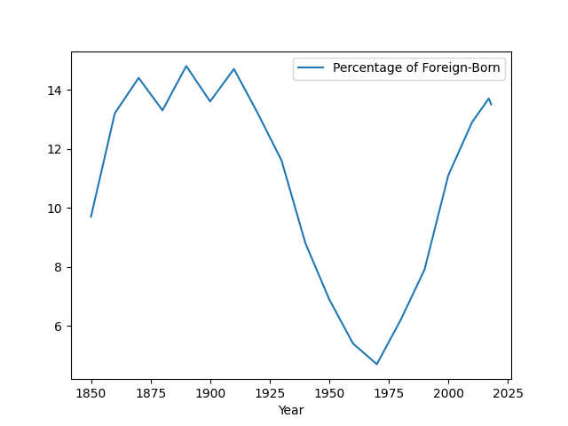
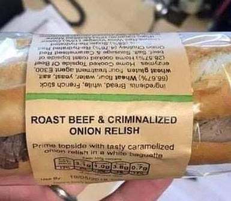

# Week 39

It doesn't. Clinton years and later events proved this creates its own
[polarization](2018/05/polarization.md). The other party will
radicalize on second-order issues, even solvable stuff will remain
unsolved. My stance remains; distinct ideologies need to be
represented in two or more distinct parties. No centrism. No fascism.

"Then being lukewarm on all issues should work?"

---

On the surface of it all "whatever it takes" approach could look
appealing -- but if the leader says "sometimes I go to right,
sometimes left" the question becomes "who decides in which instance
this happens?" The leader himself. This raises the issue of
arbitrariness, reduces predictability, noone can place this person
anywhere, that creates problems. 

"Why don't people like a mix of distinct left and right within the
party / person?"

---


<blockquote class="twitter-tweet"><p lang="en" dir="ltr">Fast mission to detect microbes on Venus -<br>Joint i4is, FIT, Harvard, Space Initiatives paper: &quot;A Precursor Balloon Mission for Venusian Astrobiology&quot; by (Image credit: Adrian Mann) <a href="https://twitter.com/hashtag/astrobiology?src=hash&amp;ref_src=twsrc%5Etfw">#astrobiology</a> <a href="https://twitter.com/hashtag/venus?src=hash&amp;ref_src=twsrc%5Etfw">#venus</a> <a href="https://twitter.com/hashtag/smallsatellite?src=hash&amp;ref_src=twsrc%5Etfw">#smallsatellite</a> <a href="https://twitter.com/RocketLab?ref_src=twsrc%5Etfw">@RocketLab</a> <a href="https://t.co/Uug3Vxaqoi">https://t.co/Uug3Vxaqoi</a> <a href="https://t.co/1MXdiKbPfI">pic.twitter.com/1MXdiKbPfI</a></p>&mdash; I4IS (@I4Interstellar) <a href="https://twitter.com/I4Interstellar/status/1309291967013163009?ref_src=twsrc%5Etfw">September 25, 2020</a></blockquote> <script async src="https://platform.twitter.com/widgets.js" charset="utf-8"></script>

---

In many other aspects of consumption we replicate quality for all; my
average priced TV monitor works at a certain expected quality, same
for me and everyone else who buys that monitor. Why do we insist on
seeing education as something different, as if it is not a product,
and student (ed consumer) A can get the highest quality, but B has to
settle with obscenely bad quality, and there is nothing (!) we can do
about it.

---

That's smart of them

"@Artemis_K_

I find it so weird that students aren't using their camera. I haven't
had one show themselves in tutorials since the semester started"

---

[Education](2018/09/public-education.md)

---

A tablet could carry / access all top-notch teaching on all subjects
in the world. We don't need teachers in the old sense of the
word. Flip all classes. Record everything. Async delivery of content
is key, preferably by select few who know and can teach the subject the best.

---

Hi-tech paint job on an old system.. bound for failure.

"@ProfOfSarcasm

Staring at my computer screen for hours on end and teaching to default
Blackboard avatars from my shitty apartment is getting really old,
really fast"

---

The downside is if there is too much change, the sensors are
overloaded, the result: future shock.

---

True. The changes are so tiny, but we can detect that shit, and hear
stuff through it.. Amazing. Another proof that our 'sensors' are
incredibly well attuned to changes (we may not see in the dark, but
detect movement, even with the corner of our eye).

"However, the crucial thing is that usually fluids don’t change their
volume very much. It’s next to impossible, even with an incredibly
powerful pump, to change the volume of water much at all. Even air
won’t change its volume much unless you stick it in a pump, or are
dealing with really extreme situations like sonic booms and blast
waves.  The study of how fluids behave in these situations is
generally called 'compressible flow'. It’s complicated and expensive
to simulate, and apart from acoustics doesn’t enter much into everday
life. And even sound waves are such tiny perturbations in the volume"

---

There was a rise in immigration into US, closest such numbers were
last seen was during 1800s.

```python
import pandas as pd
df = pd.read_csv('foreignb.csv',sep='\t')
df = df[['Year','Percentage of Foreign-Born']].set_index('Year')
df.plot()
plt.savefig('foreignb.png')
```



Steady increase since 70s that continued to this day.

Interesting; wage increases also stalled since then. Correlation?
Causation?

Automation and outsourcing would play a role here too..

[Data](https://en.wikipedia.org/wiki/Immigration_to_the_United_States)

---

<blockquote class="twitter-tweet"><p lang="en" dir="ltr">Advantages of the BoMax Photo-biocatalytic Hydrogen (BPH) system compared to existing hydrogen gas generating methods include:<br>BPH produces hydrogen on-site. No need for trucks to deliver hydrogen fuel. <br>BPH produces only 99.995% pure hydrogen. No harmful by-products. <a href="https://twitter.com/hashtag/BPH?src=hash&amp;ref_src=twsrc%5Etfw">#BPH</a></p>&mdash; BOMAX Hydrogen, LLC (@bomaxhydrogen) <a href="https://twitter.com/bomaxhydrogen/status/1273647247469817856?ref_src=twsrc%5Etfw">June 18, 2020</a></blockquote> <script async src="https://platform.twitter.com/widgets.js" charset="utf-8"></script>

---

A company would take one look at that and think *why not twice that*?

The last movie could have grossed 2 billion, which *Endgame* did, the
work of a franchise that did not even exist a decade ago.. Also DSW
merc sales are abysmal, a sign that people are not excited about the
Woke direction.

Disney knows it too; word is K. Kennedy, the Disney exec behind the
new direction is sidelined.

"Why do you say Disney Star Wars was unsuccesful? One of their movies
grossed a billion"

---

No new major war or intervention for the past four years.. When was
the last time that happened? Carter?

---

"@thwillow

Virtual school day 8: my kid now refers to her teacher as simply 'the
host.'"

---

"@NeilDrysdale

It’s hard to believe in the midst of a six-month lockdown that things
are going to get worse in January. But even Michael Gove seems to be
admitting that Brexit will bring chaos and disruption"

---

Replenished? HTF? That's crazy!!

"\#Hydrogen for the energy transition: do we have to manufacture it? ...

The native hydrogen [as in dug up from ground, not produced], almost
pure in this case, is directly burned in a suitable gas turbine, and
produces electricity for a small village. Other wells around have been
drilled to try to determine the reserves, within the meaning of oil &
gas, and change the scale.

This success shattered many a priori: many believed that no natural
accumulation of H2 in the subsoil could exist. The initial well has
been producing for 4 years without a drop in pressure, which means it
is continuously recharged.

In addition, surface measurements of the H2 content of soils do not
show any leaks. These were rather expected, because the H2 molecule is
very small and very reactive, and therefore it can easily migrate and
combine with other chemical species"

[Link](https://mobile.twitter.com/Sorbonne_Univ_/status/1279055295352881157)

---

"Canadian energy company Petroma, led by Malian industrialist Aliou
Boubacar Diallo, discovered the world’s largest natural hydrogen
deposit 60 kilometres from the Malian capital of Bamako, a find that
has increasingly attracted some of planet’s most forward-thinking
business leaders interested in clean energy alternatives.

In Bloc 25 covering 43,000 square kilometres, Petroma has affirmed
massive quantities of 95 percent pure natural hydrogen, one of the
most promising new sources needed for a global transition to clean
energy, according to the French scientist Alain Prinzhofer at the
l’Institut de Physique du Globe de Paris.

The company has undertaken the first project to produce electricity
from hydrogen without any C02 emissions"

[Link](https://africabriefing.org/2019/09/petromas-natural-hydrogen-find-in-mali-produces-co2-free-clean-electricity/)

---

That makes it 1/15th in effect compared to the Hiroshima bomb. An
early est had said 1/6th. Still huge.

"@SheffieldBlast

Our research into the \#BeirutExplosion has been published ... We
studied videos posted on social media and estimated the yield to be
0.5-1.1 kt TNT"

---

<blockquote class="twitter-tweet"><p lang="en" dir="ltr">Producing <a href="https://twitter.com/hashtag/Solein?src=hash&amp;ref_src=twsrc%5Etfw">#Solein</a> is like brewing beer. Except it doesn&#39;t need barley or any other plant material - the raw material is CO₂ from air. Check out our Process Development Specialist explaining this with 🍺 in Episode 3 of our <a href="https://twitter.com/hashtag/VideoDiaries?src=hash&amp;ref_src=twsrc%5Etfw">#VideoDiaries</a>👇<a href="https://twitter.com/hashtag/SolarFoods?src=hash&amp;ref_src=twsrc%5Etfw">#SolarFoods</a><a href="https://t.co/4OhSihd7vf">https://t.co/4OhSihd7vf</a></p>&mdash; Solar Foods (@Solar_Foods) <a href="https://twitter.com/Solar_Foods/status/1308668524974538754?ref_src=twsrc%5Etfw">September 23, 2020</a></blockquote> <script async src="https://platform.twitter.com/widgets.js" charset="utf-8"></script>

---

I can't believe we are polluting even space.. The movie *Gravity* was
an eye opener 

"@JimBridenstine

The @Space_Station has maneuvered 3 times in 2020 to avoid debris. In
the last 2 weeks, there have been 3 high concern potential
conjunctions. Debris is getting worse! Time for Congress to provide
@CommerceGov with the $15 mil requested by @POTUS for the Office of
Space Commerce"

---

Pundits can say "this and that is too ideological" to blame, bash
others -- but beware -- even ppl who blame others for having ideology,
have an ideology themselves... Because the absence of ideological
discourse will automatically emphasize, indirectly, the *default
ideology* in society, which right now is the Washingon Consensus, post
Berlin-Wall hyper-marketism.

---

It's weird Hasish and others like him are named RINOs. In some ways
they are more Republican than most.

---

That's not why he did it. He, and other pols, might encourage such
talk themselves, which is untrue. They do it to give the 24/7
commentariat something to latch onto.

Hasish's beef is ideological. Ditto for McCain. These people care
deeply about ideology. **It is their job**.

"Gov Hasish went on to speak at Dem Convention bcz he doesn't like Trump's style"

---

The future is here

<blockquote class="twitter-tweet"><p lang="en" dir="ltr">That&#39;s right, I&#39;m upgrading the firmware of a light, so that it can connect to 5G WiFi. 🙄 <a href="https://t.co/9NtuAS3dvZ">pic.twitter.com/9NtuAS3dvZ</a></p>&mdash; Brad #BlackLivesMatter (@bradwilson) <a href="https://twitter.com/bradwilson/status/1308557653690339328?ref_src=twsrc%5Etfw">September 23, 2020</a></blockquote> <script async src="https://platform.twitter.com/widgets.js" charset="utf-8"></script>

---

🤔 🤔 🤔 

---

Or... aaare they 🤨 ??

---

Knowledge organizes, so it reduces entropy, one could say, implies
more order. But new knowledge needs new forms of management, absent
it, can create more disorder.

These are all very speculative thoughts, of course.

---

Per the weird (likely superfluous) correlation I noticed between my
sci posts and chaos in the ME; I just dropped the m..f..ing bomb up in
this bitch, so we're abt to have World War 3 right abt now, u feel me?

---

Yes. They can be lied to, convinced on things against their interest,
which all suggest direct democracy, or "polling to decide on policy
direction" style of governence cannot work.

"People were misled by Brexit, does that mean they cannot judge most policies?"

---

But this could be blessing in disguise.. Less black talent in
finance..? Fine, right? We should hope for less white, Asian, Hisp.
talent too.

---

He is probably right. Sad.

"@NBCNews

Wells Fargo CEO: "While it might sound like an excuse, the unfortunate
reality is that there is a very limited pool of black talent to
recruit from."

---

"@ClaraJeffery

COVID now 4th largest mass casualty event in US history. Topped only
by the Civil War, WWII, 1918 flu pandemic"

---

Both runners probably need to have the same said software for the
'snooping' to work, but still..

---

Wonderful. We have commodatized Big Brother.  Now everyone can become one. 

"@MrAndrew

Out running this morning on a new route and a lady runs past
me. Despite only passing, when I get home @Strava automatically tags
her in my run. If I click on her face it shows her full name, picture
and a map of her running route (which effectively shows where she
lives)

This is despite the fact that I don't follow her and she doesn't share
her activity publicly. So basically if someone sees a woman running
alone there's an app they can go to see her name, picture and address"

---

GI Joe 1 and 2 are two completely different style of movies. They are
different like Speed 1 and 2. Or Zoolander 1 and 2. 

---

"Russian-Turkish talks stalled, worst air raids on Idleb since March"

---

What a bleeping effin nonsense this Brexit.. People were misled by
those who were supposed to represent them. End it and get rid of those
f-ing fools while you are at it too, your "royals". I fear they are a
cultural crutch creating a false sense of queen and country at this
age.

---

<blockquote class="twitter-tweet"><p lang="en" dir="ltr">This is extremely important. We need access to Horizon Europe. Anything less is essentially vandalism. <a href="https://t.co/tmxyXNJ0BK">https://t.co/tmxyXNJ0BK</a></p>&mdash; Brian Cox (@ProfBrianCox) <a href="https://twitter.com/ProfBrianCox/status/1308303284327731200?ref_src=twsrc%5Etfw">September 22, 2020</a></blockquote> <script async src="https://platform.twitter.com/widgets.js" charset="utf-8"></script>

---

A President can choose his entire cabinet exclusively from Goldman
Sachs, but if the cabinet members are all trans, centrists would be
happy. 

---

"Carbon emissions of richest 1 percent more than double the emissions
of the poorest half of humanity...

Annual emissions grew by 60 percent between 1990 and 2015. The richest
5 percent were responsible for over a third (37 percent) of this
growth. The total increase in emissions of the richest one percent was
three times more than that of the poorest 50 percent"

[Link](https://www.oxfam.org/en/press-releases/carbon-emissions-richest-1-percent-more-double-emissions-poorest-half-humanity)

---

"@FCHEA_News

Tune in this Thursday to learn about.. @AngloAmerican's..  290-ton
\#fuelcell truck and how it is bringing \#zeroemission tech to the
mining industry!"

[Link](https://twitter.com/FCHEA_News/status/1308102055362527233)

---

But of course Jesus' teachings were coopted by the state (Rome),
and turned into another form of pagan worship ritual.

---

"Jesus Christ was a socialist activist" -- exactly.

Hudson: "The Christianity we know today is not the Christianity of
Jesus.. Indeed the Judaism that we know today is not the Judaism of
Jesus either. Lord’s Prayer, ‘forgive us our sins even as we forgive
all who are indebted to us’, refers specifically to debt.

Most religious leaders say that Christianity is all about sin, not
debt. But actually, the word for sin and debt is the same in almost
every language.

‘Schuld’, in German, means ‘debt’ as well as ‘offense’ or, ‘sin’. It’s
‘devoir’ in French. It had the same duality in meaning in the
Babylonian language of Akkadian.”

The idea harks back to the concept of ‘wergeld’, which existed in
parts of Europe and Babylonia, and set the value of a human life based
on their rank, paid as compensation to the family of someone who has
been injured or killed. he payment – the Schuld or obligation –
expiates you of the injury caused by the offense

People tend to think of the Commandment ‘do not covet your neighbour’s
wife’ in purely sexual terms but actually, the economist says it
refers specifically to creditors who would force the wives and
daughters of debtors into sex slavery as collateral for unpaid debt.

Similarly, the Commandment ‘thou shalt not steal’ refers to usury and
exploitation by threat for debts owing.

Jesus was crucified for his views on debt. Crucifixion being a
punishment reserved especially for political dissidents.

To understand the crucifixion of Jesus is to understand it was his
punishment for his economic views. He was a threat to the creditors.

Jesus Christ was a socialist activist for the continuity of regular
debt jubilees that were considered essential to the wellbeing of
ancient economies

Governments can forgive debt. The bible says so"

[Link](https://michael-hudson.com/2017/12/he-died-for-our-debt-not-our-sins/)

---

So it's Facebook?

"@bradleytusk

The tech giants know this. Someone’s going down. Their real fight
isn’t with Congress or the Department of Justice or regulators from
any particular agency. The real fight is to make another company the
more appealing target.

'Zuck, Bezos, Cook: Who takes the fall in D.C.’s antitrust games? Last
week’s hearing was more circus than bread, but America’s tech titans
have reason to worry. Somebody is going down. The only question is
who—and when'"

[Link](https://twitter.com/bradleytusk/status/1290316670414839809)

---

"@DriveH2

Google is looking to \#Hydrogen: '...We’ll explore opportunities to
source power from emerging tools, such as advanced nuclear, enhanced
geothermal, green \#hydrogen, long-duration storage.'"

[Link](https://buff.ly/3mjYJTH)

---

<blockquote class="twitter-tweet"><p lang="en" dir="ltr">Meet <a href="https://twitter.com/hashtag/zeroe?src=hash&amp;ref_src=twsrc%5Etfw">#zeroe</a>, our new zero-emission concept aircraft! These 3 concepts are powered by <a href="https://twitter.com/hashtag/hydrogen?src=hash&amp;ref_src=twsrc%5Etfw">#hydrogen</a> to reduce aircraft emissions.<br>Read the full story ➡️ <a href="https://t.co/6ijHK1r9V4">https://t.co/6ijHK1r9V4</a><br><br>Want to know more? Connect to our Twitter live-stream at 1400 CEST <a href="https://twitter.com/hashtag/ZeDay?src=hash&amp;ref_src=twsrc%5Etfw">#ZeDay</a> <a href="https://twitter.com/hashtag/ZeroEmissionsDay?src=hash&amp;ref_src=twsrc%5Etfw">#ZeroEmissionsDay</a> <a href="https://t.co/I8E3sUIPHA">pic.twitter.com/I8E3sUIPHA</a></p>&mdash; Airbus (@Airbus) <a href="https://twitter.com/Airbus/status/1307977130182144016?ref_src=twsrc%5Etfw">September 21, 2020</a></blockquote> <script async src="https://platform.twitter.com/widgets.js" charset="utf-8"></script>

---

"Ballard Power Systems (NASDAQ: BLDP; TSX: BLDP) today announced the
launch of the fuel cell industry’s first module designed for primary
propulsion power in marine vessels. Ballard’s FCwave fuel cell
product is a 200-kilowatt (kW) modular unit that can be scaled in
series up to the multi-megawatt (MW) power level.

The FCwave product provides primary propulsion power for marine
vessels – such as passenger and car ferries, river push boats, and
fishing boats – as well as stationary electrical power to support
hotel and auxiliary loads on cruise ships and other vessels while
docked at port (also known as ‘cold ironing’)"

[Link](https://www.ballard.com/about-ballard/newsroom/news-releases/2020/09/08/ballard-introduces-fuel-cell-industry-s-first-commercial-zero-emission-module-to-power-ships)

---

<blockquote class="twitter-tweet"><p lang="en" dir="ltr">France’s 7 billion Euro plan to use clean hydrogen in industrial processes and transport will cut the country’s carbon dioxide output in 2030 by the equivalent of the annual emissions of Paris, their government has advised.<br><br>Read more here: <a href="https://t.co/zr4niaT1SK">https://t.co/zr4niaT1SK</a> <a href="https://t.co/74IihPjRA9">pic.twitter.com/74IihPjRA9</a></p>&mdash; Hazer Group Ltd (@hazergroupltd) <a href="https://twitter.com/hazergroupltd/status/1307816917894397953?ref_src=twsrc%5Etfw">September 20, 2020</a></blockquote> <script async src="https://platform.twitter.com/widgets.js" charset="utf-8"></script>

---

Want One



---

"@tomgara

Pretty grim news here on the Oxford coronavirus vaccine: 2 of the
8,000 UK participants in the trial have developed a rare illness
involving inflammation of the spine"

---

Another proof that we are not teaching science, but cargo cult
science.  There are still flat-earthers. We've known Earth is not flat
for over two millenia. Yet the so-called "educated" would be hard
pressed to prove this fact starting from simple assumptions, hence
they cannot prove it to others with conviction, disinformation
grows. We created a culture of technobabble with little true knowledge.

---

"July 2020 Shipment Report: RV Shipments top 40,000 for Second Straight
Month... RVs have been the ideal way to travel this summer, providing
the freedom and fun of RVing while also allowing people to control
their environment"

[Link](https://www.rvnews.com/july-2020-shipment-report-rv-shipments-top-40000-for-second-straight-month/)

---

Im giving Oracle a hard time.. their software is all clunky, closed, unhip.

---

When we hear of stories, we do not often hear about the tragedies in
the background

<blockquote class="twitter-tweet"><p lang="en" dir="ltr">I?d quit. <a href="https://t.co/v6x5bPmstH">https://t.co/v6x5bPmstH</a></p>&mdash; Stephan Segraves (@ssegraves) <a href="https://twitter.com/ssegraves/status/1307526522975129600?ref_src=twsrc%5Etfw">September 20, 2020</a></blockquote> <script async src="https://platform.twitter.com/widgets.js" charset="utf-8"></script>

---

Have to be more media / legal savy... Look at the monkey boy.. The
weasel fuck knows how to play the media and adapt to every
situation. That's how such an inferior tech, as in battery based cars
came so far.

---

NKLA WTF?

---

I wonder how much predictive power the neighboring quakes have for
predicting a quake in a particular location 🤔

---

Earthquake data from an API,

```python
from quakefeeds import QuakeFeed
feed = QuakeFeed("4.5", "day")
print (len(feed))
print (feed.event_title(0))
print (feed.event_title(1))
print (feed.event_title(2))
```

```text
8
M 4.5 - 14 km N of Tisco, Peru
M 5.0 - 6 km NNE of Falam, Myanmar
M 4.5 - 248 km N of Saipan, Northern Mariana Islands
```

8 quakes >=4.5 in a day, all around the world. 

---

After the Cal quake checked [this acct](https://mobile.twitter.com/EQAlerts_M4)
for >4.0 eqs. Looks like the whole world is shaking, constantly.

---

Crazy guy preaching abt 'aliens!' in a *Firefly* scene.. it works bcz, sure FF is scifi, in it humans colonized many planets, there are reavers, but still no aliens.

---

Seasonal flu MR is 0.1%. CV is 30 times more deadly than the flu.

---

Worldwide COVID mortality rate hovers around 3%.

[Link](../../2020/02/corona.html#mortality)

---

Why not R = 0? Quashing covid?

Wout vaccine, tough... A college try cld involve quick testing /
testing everywhere, all the time.

---

Did new cases jump in UK? Compared to DE,

```
Country/Region  Germany +  Germany %    UK +      UK %
9/16/20            1855.0   0.585869  4007.0  0.858203
9/17/20            2179.0   0.592121  3410.0  0.863345
9/18/20            2199.0   0.621374  4329.0  0.905661
```

Looks like higher than average, yes.

[Link](../../2020/02/corona.html#daily)

---

Americans are being treated like Mexicans.. Soon there will be a wall
btw US and Canada.

"@BillBlair

We are extending non-essential travel restrictions with the United
States until October 21st, 2020. We will continue to base our
decisions on the best public health advice available to keep Canadians
safe"

---

"[A] new non-invasive coronavirus test [unvailed in Canada] which
avoids the need for intrusive nasal swabs ... making testing easier
and more accessible for students as they return to schools"

[Link](https://www.theguardian.com/world/2020/sep/18/canada-coronavirus-saliva-test-swirl-gargle-spit-children)

---

"I thought about [climate] a lot last week, as I tried to stop my
toddler from playing in ash, tried to calm down my dogs as they paced
and panted in mid-morning dusk light, tried to figure out whether my
air purifier was actually protecting my lungs, tried to understand why
the sky was pumpkin-colored, and tried not to think about the
carcinogen risk of breathing in wildfire smoke, week after week.The
government has committed to defending us and our allies against
foreign enemies. Yet when it comes to the single biggest existential
threat we collectively face—the one that threatens to make much of the
planet uninhabitable, starve millions, and incite violent conflicts
around the world—it has chosen to do near-nothing. Worse than that,
the federal government continues to subsidize and promote fossil
fuels"

[Link](https://www.theatlantic.com/ideas/archive/2020/09/4-degrees-celsius-election/616393/)

---

"Coronavirus: Idaho pastor who called himself 'no-masker' in intensive
care with Covid-19"

---

Not bad Italy... late in the game but doing well now? \#covid

[Link](https://www.youtube.com/watch?v=brq0NLN7uG0)

---

K-shaped recovery? :) So with this one econ splits in to two, recovery
for the rich, continuing crisis for the rest (kinda like post 2008?)

---

<blockquote class="twitter-tweet" data-conversation="none"><p lang="en" dir="ltr">Absolutely striking view: Our <a href="https://twitter.com/hashtag/fuelcell?src=hash&amp;ref_src=twsrc%5Etfw">#fuelcell</a> concept <a href="https://twitter.com/MercedesBenz?ref_src=twsrc%5Etfw">@MercedesBenz</a> GenH2 Truck defines the design of a <a href="https://twitter.com/hashtag/hydrogen?src=hash&amp;ref_src=twsrc%5Etfw">#hydrogen</a> future, combining ground breaking technology with pure and clean surfaces.<br><br>👉<a href="https://t.co/Hj2jU8bhJi">https://t.co/Hj2jU8bhJi</a> <a href="https://t.co/ACOfLOEuOm">pic.twitter.com/ACOfLOEuOm</a></p>&mdash; Daimler Trucks &amp; Buses (@DaimlerTruckBus) <a href="https://twitter.com/DaimlerTruckBus/status/1306262240576892930?ref_src=twsrc%5Etfw">September 16, 2020</a></blockquote> <script async src="https://platform.twitter.com/widgets.js" charset="utf-8"></script>

---

Like

```
function varargout = f (a,b,c,...)
  sz = size (a);
```

---

You could **name** the parameters muthaf-ka. 

---

I dont think I've seen a shittier code in my life

---

😶 😶 😶 😶 

---
😶 

```
function varargout = f (varargin)

  fidx = 1;
  if (nargin == 2)
    sz = size (varargin{fidx});
```

---

<blockquote class="twitter-tweet"><p lang="en" dir="ltr">‼️ BeHydro launched world’s first <a href="https://twitter.com/hashtag/hydrogen?src=hash&amp;ref_src=twsrc%5Etfw">#hydrogen</a>-powered dual-fuel engine with a capacity of 1 MW! <br><br>By injecting and burning hydrogen, <a href="https://twitter.com/hashtag/CO2?src=hash&amp;ref_src=twsrc%5Etfw">#CO2</a> emissions are reduced by up to 85%.👏👏<br><br>👉<a href="https://t.co/apLdgRsUWX">https://t.co/apLdgRsUWX</a><a href="https://twitter.com/hashtag/hydrogenNow?src=hash&amp;ref_src=twsrc%5Etfw">#hydrogenNow</a> <a href="https://twitter.com/hashtag/Shipping?src=hash&amp;ref_src=twsrc%5Etfw">#Shipping</a> <a href="https://twitter.com/hashtag/Emissions?src=hash&amp;ref_src=twsrc%5Etfw">#Emissions</a> <a href="https://twitter.com/hashtag/Maritime?src=hash&amp;ref_src=twsrc%5Etfw">#Maritime</a> ⚓️🚢 <a href="https://t.co/SjForUmpFn">pic.twitter.com/SjForUmpFn</a></p>&mdash; Hydrogen Europe (@H2Europe) <a href="https://twitter.com/H2Europe/status/1306834957193617408?ref_src=twsrc%5Etfw">September 18, 2020</a></blockquote> <script async src="https://platform.twitter.com/widgets.js" charset="utf-8"></script>

---

Electorate not caring abt econ is possible, in Serbia in the first
election post covid the incumbent did well.

---

Aha. Markovitz (the inventor of the model I use for election
prediction) says electorate *will* understand the economic
contraction. He has a new pandemic model, drops all parameters except
one, net popularity.

His new regression shows DJT loses even at net popul 0%, currently at
-%9.

"There are good reasons to expect that two of these predictors — the
change in real GDP in the second quarter and the time for change dummy
variable — will not perform as they normally do in 2020. Although the
U.S. economy is currently experiencing a severe downturn, with real
GDP plunging by an almost unprecedented amount in the second quarter,
voters do not appear to hold the incumbent president responsible for
this. That is undoubtedly because the recession was deliberately
induced in order to try to control the spread of the deadly
coronavirus"

[Link](https://centerforpolitics.org/crystalball/articles/its-the-pandemic-stupid-a-simplified-model-for-forecasting-the-2020-presidential-election/)

---

😂 😂 😂 😂 

<blockquote class="twitter-tweet"><p lang="en" dir="ltr">Where are JJ’s movies? 😳Do they get celebrated on a different day in the Kelvin timeline?🤔🤷🏼‍♂️🤣 <a href="https://t.co/tUUVGy0Z9p">https://t.co/tUUVGy0Z9p</a></p>&mdash; William Shatner (@WilliamShatner) <a href="https://twitter.com/WilliamShatner/status/1301887959294115841?ref_src=twsrc%5Etfw">September 4, 2020</a></blockquote> <script async src="https://platform.twitter.com/widgets.js" charset="utf-8"></script>

---

