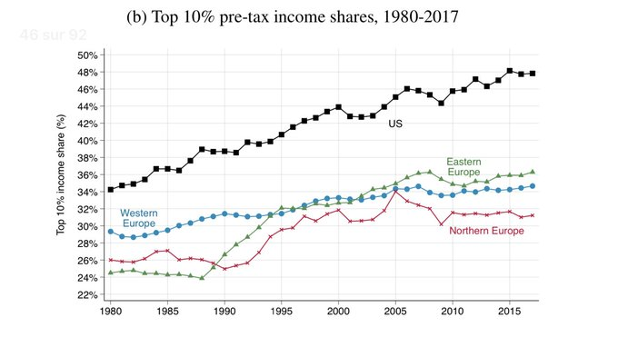

# Week 41

"@lucas_chancel

We show that European countries and Europe as a whole are more equal than the US

The question is: why? 

We take a fresh look at this [below]"



[Link](https://twitter.com/lucas_chancel/status/1314928729836195847)

---

"@EFF

The Google v Oracle ruling will be hugely consequential for software
development. Even if the Supreme Court finds fair use, that may be
small comfort for startups that can't afford to litigate to protect
their right to reimplement APIs"

---

Design of a floating platform. Foam is surrounded by concrete, further
supported by steel. Foam supplies the low density (gives volume minus
weight), concrete makes sure the water never gets in. Solid design.

<iframe width="340" src="https://www.youtube.com/embed/tVq4lm6xN2g" frameborder="0" allow="accelerometer; autoplay; clipboard-write; encrypted-media; gyroscope; picture-in-picture" allowfullscreen></iframe>

---

"War [as in culture], as rhetoric, emphasizes the clash rather than
the cause. If you can move the conversation toward the war itself, you
might give people permission to forget why the battle is being waged
in the first place. And you might be able to shift the terms of the
discussion away from the sweeping failures of the federal government
and toward the familiar reductions of the culture war. You can erode
the matter down to the basics of 'personal responsibility' versus
'governmental intrusion'"

---

Design around the shortcomings. No system component is perfect. 

---

Dont put them into a ward then.

"False positives [from quick tests] can .. put people at risk [??]: If
a virus-free nursing-home resident with a false positive is placed in
a COVID-19 ward, that person could become infected"

---

Just the flu

"We’ve seen very healthy, young, athletic, strong people get COVID-19
and die, or end up with long-term disability,' says Akiko Iwasaki, a
Yale immunologist. College athletes have died from the disease. Some
long-haulers, who have dealt with months of symptoms, were marathon
runners and martial artists who have since struggled to walk up
stairs'"

---

<blockquote class="twitter-tweet"><p lang="en" dir="ltr">Every time I speak of the haters and losers I do so with great love and affection. They cannot help the fact that they were born fucked up!</p>&mdash; Donald J. Trump (@realDonaldTrump) <a href="https://twitter.com/realDonaldTrump/status/516382177798680576?ref_src=twsrc%5Etfw">September 29, 2014</a></blockquote> <script async src="https://platform.twitter.com/widgets.js" charset="utf-8"></script>

---

"@ShashankB_

New guy at work started posting 'good morning' every day in our 4000
person general channel like it's his family whatsapp I'm so angry"

---

[TOP500](https://www.top500.org/lists/top500/2020/06/). No computer
system from Anatolia made the cut? HPC software doesn't run on donkeys
my friend.

---

Not too shabby, but to put it into perspective, Russia held 1688
trillion cubic feet of proven gas reserves as of 2017.

"Zohr gas field.. is an offshore natural gas field located in the
Egyptian sector of the Mediterranean Sea.. The total gas in place in
30 trillion cubic feet"

---

Convert it to H2, I might be fine with it.

---

Top hardware is deployed looking for fossil shit. 

"According to the TOP500 list, HPC5 is the sixth most powerful
supercomputer in the world, the highest ranked in Europe and the
overall leader among non-governmental systems... The performance level
of this computer means it can use extremely sophisticated in-house
algorithms to process subsoil data. The geophysical and seismic
information we collect from all over the world is sent to HPC5 for
processing. Using this data, the system develops extremely in-depth
subsoil models, and on the basis of these, we can determine what is
hidden many kilometres below the surface: indeed, this is how we found
Zohr, the largest gas field ever discovered in the Mediterranean"

[Link](https://www.eni.com/en-IT/operations/green-data-center-hpc5.html)

---

Not just powerful enough, RPi can *be* desktop out-of-the-box.

Take the SD card (with OS on it), stick it in. Connect RPi to HDMI
monitor. Connect USB keyboard / mouse. Boom! Right there, you have now
a desktop environment, welcoming you. User can click on icons, use
spreadsheet, edit programming languages, view videos, right away. All
through a light, tiny board.

"You say RPi can replace desktop machine. Do you mean it is powerful enough to do that?"

---

"@dfinity

“The next generation of kids isn't going to be building on AWS. Once
they find out it requires far less code to create a hyper scalable
internet service, they’re going to write code and push it to the
internet," says @dominic_w at \#SODIUM"

---

"Negative opinions about China soared to record highs for nine out of
14 countries polled, according to a survey by Pew Research Center"

---

"Mariah Carey for V Magazine: 'We’ve been socialized to believe that
poverty is a personal failure rather than our systems failing us'"

---

<blockquote class="twitter-tweet"><p lang="en" dir="ltr">Unsurprising. Banks have taken years to recover from the <a href="https://twitter.com/hashtag/GreatFinancialCrisis?src=hash&amp;ref_src=twsrc%5Etfw">#GreatFinancialCrisis</a> of 2008, at its root was cheap loans for people to buy homes they couldn&#39;t really afford.<br><br>Increased housing supply and wage growth are probably better ways to address housing aspirations <a href="https://t.co/FcclDGDeTk">https://t.co/FcclDGDeTk</a></p>&mdash; Jonathan Josephs (@jonathanjosephs) <a href="https://twitter.com/jonathanjosephs/status/1314534262629163010?ref_src=twsrc%5Etfw">October 9, 2020</a></blockquote> <script async src="https://platform.twitter.com/widgets.js" charset="utf-8"></script>

---

"The House Judiciary subcommittee on antitrust determined Facebook
wields monopoly powers in social network and has maintained its
position by acquiring, copying or killing its competitors, according
to a report the group released on Tuesday.

The report from the Democratic majority staff, which also addresses
antitrust concerns regarding Amazon, Apple, Google parent-company
Alphabet, recommends that Congress review a series of potential
remedies. This includes “structural separation,” which could require
the companies to split parts of their businesses. For instance,
Facebook could be forced to divest or operationally separate
photo-sharing service Instagram and messaging app WhatsApp, both of
which it acquired"

[Link](https://www.cnbc.com/2020/10/06/house-antitrust-committee-facebook-monopoly-buys-kills-competitors.html)

---

<blockquote class="twitter-tweet"><p lang="en" dir="ltr">Oil giant Total joins a small funding round in U.S. fuel-cell truck startup Hyzon Motors, its latest foray into cleaner energy sources <a href="https://t.co/wZtEc927mR">https://t.co/wZtEc927mR</a></p>&mdash; Bloomberg (@business) <a href="https://twitter.com/business/status/1314476458052595712?ref_src=twsrc%5Etfw">October 9, 2020</a></blockquote> <script async src="https://platform.twitter.com/widgets.js" charset="utf-8"></script>

---

"Covid-19: French saliva test proves effective in ‘real-world’
conditions"

[Link](https://www.france24.com/en/20201008-covid-19-french-saliva-test-proves-effective-in-real-world-conditions)

---

"A Canada charity gave $7,500 to homeless people, here’s what
happened... According to their recently published findings, the group
that got cash spent less days homeless than the others, moved into
stable housing in an average of three months, and nearly 70 percent of
them became food secure after a month"

[Link](https://www.independent.co.uk/news/world/americas/new-leaf-project-homeless-money-canada-charity-b889315.html)

---

"@jonathanjosephs

UK parliamentary committee finds 'clear evidence of collusion' between
\#Huawei and Chinese Communist Party"

---

"GenCell Energy, a leading Israel-based manufacturer of fuel cell
energy solutions,today announces that a Tier One telecom provider has
deployed its first GenCell G5 hydrogen fuel cell-based long-duration
backup solution at an active cell tower site in Europe"

---

"UK Seizes $13 Million in Unexplained Wealth From Businessman .. In
what is being described as a landmark case, the U.K.’s National Crime
Agency, NCA, relied on an Unexplained Wealth Order to seize millions
in property and assets from a businessman with alleged ties to
organized crime"

[Link](https://www.occrp.org/en/daily/13213-uk-seizes-13-million-in-unexplained-wealth-from-businessman)

---

ToScA ~OroZco (Dubphonic Dub) \#music

[Link](https://youtu.be/kcT1YprI-OQ)

---

Q2 US Private Debt to GDP was at 191%?

```
2019-10-01    167.132869
2020-01-01    173.931116
2020-04-01    191.103939
```

[Link](../../2021/01/stats.html#credit)

---

"@aaronstein1

The access to loitering munition and their prolific use in the NK
conflict should be a wake up call for DoD, USAF and the Army: Air
superiority definitions may need to change"

---

<blockquote class="twitter-tweet"><p lang="en" dir="ltr">Endlessly fascinating to see that in a country where the tax/GDP ratio is very low and falling, infrastructure is crumbling, and tens millions don&#39;t have health care, a top priority is somehow to not. raise. taxes.</p>&mdash; Gabriel Zucman (@gabriel_zucman) <a href="https://twitter.com/gabriel_zucman/status/1314018802791665664?ref_src=twsrc%5Etfw">October 8, 2020</a></blockquote> <script async src="https://platform.twitter.com/widgets.js" charset="utf-8"></script>

----

<iframe width="340"  src="https://www.youtube.com/embed/QRsAZ8Dia68" frameborder="0" allow="accelerometer; autoplay; clipboard-write; encrypted-media; gyroscope; picture-in-picture" allowfullscreen></iframe>

---

DJT net approval back down to -10%. If this continues throughout Oct I
call it a sure lose.

---

Sure. Just like state colleges compete with private ones today.

"If enacted the government wld be creating 'the school' digitally and
be competing with other commercial schools, universities"

---

It's plenty! I have [this course](https://ocw.mit.edu/courses/mathematics/18-06-linear-algebra-spring-2010/)
stored on my hard drive, and it takes 2.5 GB with 20+ videos, code,
lecture notes in PDF.

Disk space is cheap. In fact disk space is the first thing that went
ultra-cheap in the computing revolution.

"But is 64 GB disk space enough?"

---

I cannot stress this enough. That little RPi board has a full blown
Linux on it, it can run Python, or any language, browser, spreadsheet,
any program that can run on a notebook, desktop.

---

Let's create an ed machine. RPi can be a desktop / notebook replacement. 

[Raspberry Pi](https://www.raspberrypi.org/blog/raspberry-pi-4-on-sale-now-from-35/) $35.

Micro Sd Card 64 GB $20.

7 inch 1024*600 LCD HDMI [monitor](https://www.amazon.com/Raspberry-Inch-Monitor-HDMI-SunFounder/dp/B01J51CXU4) $70.

[Wireless keyboard + mouse](https://www.bestbuy.com/site/logitech-k400-plus-wireless-keyboard-black/7575039.p?skuId=7575039)
combo, $25.

This is a full-blown computer for ~ $140. I belive monitors can be had
for cheaper, if the buyer was buying in bulk.

---

Every kid will need a personal tablet / notebook of course.

---

Even if Internet was available everywhere, I'd still implement synch
feature. Student syncs their lecture content with central, or a closer
school server. They need to have all necessary files with them.

---

Once "classes" turn into just content and a few administrators, you
could house regional, town level servers, which can be clones of the
central DoEd server. Individual schools can get the classes they need
on smaller disks to distribute them to kids at schools /
homes. Student goes to a "data access point", gets his "class" and
either goes home, or school (if possible by this point due to
pandemic).

"Not every school can have distance learning, bcz they dont have Internet"

---

It makes total sense, for gigantic amount of data, hauling hard drives
can be faster.

Respect the offline. The physical. The classical.

---

"Yes, today's speediest internet connections make it faster to download
movies than to go to the store and buy them. But downloading or
uploading truly large amounts of data can still take days, months, or
even years—think a film studio's entire video archives or the
satellite imagery collections of government agencies. That lag is a
problem for Amazon, which wants companies to store their information
in its lucrative cloud. But it's also a natural one for Amazon—a
logistics company at heart—to solve. So this week the company
announced one of its strangest ideas yet: a tractor trailer that will
transport your data to Amazon's own data centers. (Insert information
superhighway joke here.)"

[Link](https://www.wired.com/2016/12/amazons-snowmobile-actually-truck-hauling-huge-hard-drive/)

---


They cannot do it at a scale government can. Gov already has access to
best researchers through their grant programs. They can make ed
content a requirement as part of a grant process. Plus there is the
aspect of "your country needs you". I think a lot of good teachers
would go for that, even select teachers outside the university system. 

"There are commercial, virtual universities who do this"

---

YT content is just too fragmented to create a digital school with. For
every country / language, lecturer need to be identified, for each
subject, get a content creator / programmer assigned to, and have them
generate a course.

"But Feynman videos are on YouTube now, they are also many other good
teachers on vid. Can't students just go to YouTube?"

---

No bcz he won't be responsible for teaching an entire class
anymore. Won't have any administrative work, all he'll have to do is
to show up, be around, and handle certification if a student asks for
it which will be rare. Certifier will know a particular lecture
content (he himself is certified on) inside and out of course, so in
effect he is also a student, just a more experienced one. This is very
important, this person will not deliver a lecture. Richard Freaking
Feynman is your teacher now, or whowever is at his caliber nowadays,
on a given course. There is always that freak of nature who is part
teacher part researcher, equally awesome on both. Gov finds that guy /
gal, gets the content, so a poor student won't have to settle with Bob
Buttfuck from Bumblefuck, they'll have the best on video, in lecture
materials as PDFs, offline viewable HTML with animation etc.

"So your proposal [on ed](../../2018/09/public-education.html) creates 'a
certifier' and does away with teachers. Certifier will sit in
classrooms, will be able to answer questions. But will s/he not be
overloaded?"

---

Edwin Starr - Easin' In \#music

[Link](https://youtu.be/kOBh4NZ4wZQ)

---

SS is responsible for foreign policy, its intent, execution, and one
clear adminstrative work they do is running the embassies. And spies
usually assume a diplomat cover, and/or need the embassy as a
go-through point. Ergo, SS can allow / deny certain individuals, spies
perhaps in a country, influencing intelligence ops in that country,
effecting on-the-ground events. SecState matters.

"How can a SecState influence events on the ground? As in underhanded stuff"

---

Baraka.. what a wuss. I could whoop that ass up and down the block any
day of the week.

---


---

We all look like Sub Zero from *Mortal Kombat* these days.

---

😎 😎 😎

<blockquote class="twitter-tweet"><p lang="fr" dir="ltr">Le ministre des Transports, <a href="https://twitter.com/Djebbari_JB?ref_src=twsrc%5Etfw">@Djebbari_JB</a>, a tourné en passager à bord de la LMPH2G pilotée par <a href="https://twitter.com/NatoNorman?ref_src=twsrc%5Etfw">@NatoNorman</a> à l’occasion d’une visite chez <a href="https://twitter.com/Michelin?ref_src=twsrc%5Etfw">@Michelin</a> à Clermont-Ferrand.<br><br>👉 <a href="https://t.co/MH1qzQ2jV2">https://t.co/MH1qzQ2jV2</a><a href="https://twitter.com/hashtag/MissionH24?src=hash&amp;ref_src=twsrc%5Etfw">#MissionH24</a> <a href="https://twitter.com/GreenGTOfficiel?ref_src=twsrc%5Etfw">@GreenGTOfficiel</a> <a href="https://twitter.com/hashtag/Hydrogen?src=hash&amp;ref_src=twsrc%5Etfw">#Hydrogen</a> <a href="https://t.co/utcecp2gKg">pic.twitter.com/utcecp2gKg</a></p>&mdash; Mission H24 (@MissionH24) <a href="https://twitter.com/MissionH24/status/1313750556389900290?ref_src=twsrc%5Etfw">October 7, 2020</a></blockquote> <script async src="https://platform.twitter.com/widgets.js" charset="utf-8"></script>

---

Projections - Inner City Sides \#music

[Link](https://youtu.be/xpXjaOEwGNk)

---

<blockquote class="twitter-tweet"><p lang="en" dir="ltr">Hydrogen has the potential to halve aircraft emissions, Airbus says. McKinsey believes it could be used in 40% of all aircraft by 2050.<br><br>Read more here: <a href="https://t.co/dM4d6Ke43E">https://t.co/dM4d6Ke43E</a><a href="https://twitter.com/hashtag/hazergroupltd?src=hash&amp;ref_src=twsrc%5Etfw">#hazergroupltd</a> <a href="https://twitter.com/hashtag/hydrogen?src=hash&amp;ref_src=twsrc%5Etfw">#hydrogen</a> <a href="https://twitter.com/hashtag/airbus?src=hash&amp;ref_src=twsrc%5Etfw">#airbus</a> <a href="https://twitter.com/hashtag/aviation?src=hash&amp;ref_src=twsrc%5Etfw">#aviation</a> <a href="https://twitter.com/hashtag/cleantech?src=hash&amp;ref_src=twsrc%5Etfw">#cleantech</a> <a href="https://twitter.com/hashtag/greenenergy?src=hash&amp;ref_src=twsrc%5Etfw">#greenenergy</a> <a href="https://twitter.com/hashtag/renewables?src=hash&amp;ref_src=twsrc%5Etfw">#renewables</a> <a href="https://twitter.com/hashtag/decarbonisation?src=hash&amp;ref_src=twsrc%5Etfw">#decarbonisation</a> <a href="https://t.co/v9uvgPuCnm">pic.twitter.com/v9uvgPuCnm</a></p>&mdash; Hazer Group Ltd (@hazergroupltd) <a href="https://twitter.com/hazergroupltd/status/1313615287913254912?ref_src=twsrc%5Etfw">October 6, 2020</a></blockquote> <script async src="https://platform.twitter.com/widgets.js" charset="utf-8"></script>

---

"@AADaddario

Season 7 writer’s room on a political show: 'lets have a pandemic
break out! Like, a real, world-wide one. And then, let’s give the
PRESIDENT the disease. I mean, we can go anywhere from there. Oh and
the disease’s name should have numbers in it to make it sound
futuristic.'"

---

"@H2Europe

Did you know that Germany has by far the largest \#hydrogen production
capacity in the #EU (2,5 Mt, or 21% of the total)"

---

It is concoction. Theather. Look; someone like Tucker Carlson, who
recently started to talk about some traditionally left issues (this is
how far, and low the Dems had fallen, their abandoned ideas were
picked up by others) is pretty big anti-abortion guy right? Well, but
his religion, Episcopalian, is not strictly anti-abortion. In fact
none of them are! This guy is the only one! He jokes about it.. and
the rest of the joke goes, there is only one other Presb, a woman who
is that way, and he is married to her. Now forget one side
"imploring", trying to "convince", "one up" the other side. Imagine
that hand that goes out in the world, weeds out all likely candidates
and picks the only Presbyterian *in the world* who is
anti-abortion.. You can't fight this. The stage is set. With a certain
line-up you will get a certain theather. Pre-determined. Now TS
exceeded his programming so to speak, talks about some other stuff,
and we love seeing Glenn Greenwald on Fox. But there is a certain
institutional setup in play here, which can't be fought by more
punditry from the "other side". There is serious money to be made from
it too.. So much of it in fact, even Tubers down the line have been
feasting on the left-overs for years!  Forget mainstream!

The game is agree on all primary issues, raise a ruckus on secondary
bullshit ones, on "4G" - Green, Gays, Guns, God. Richard Fucking Nixon
founded the EPA, but pfff, that's so yesterday. Up until a few years
not a single Republican would touch an environmental issue with a
ten-foot pole.

"But why do pundits jump up and down, arguing all the time?"

---

True. US has [faux polarization](../../2018/05/polarization.html). 

Caitlin Johnstone: "When you look at US politics, it appears as though
there are two mainstream political factions that very strongly
disagree with one another. 'Divided' is a word that comes up a
lot. 'Polarized' is another. It is of course true that a whole lot of
emotion flows between these two factions, and most of it is indeed
negative. The hot topics of any given news cycle in America will
typically involve more than one story pertaining to the vitriolic
enmity between them.  But beneath all the hurled insults and heated
debates, these two factions are actually furiously agreeing with one
another. They’re agreeing the entire time"

[Link](https://medium.com/@caityjohnstone/us-politics-isnt-polarized-it-s-in-almost-universal-agreement-dec5ad6d20b7)

---

"@alexanderchee

My lifelong Republican in-laws both voted early in Wisconsin for
Biden. First time voting for Dems"

---

Goood. Unix utility `mpv` can play `.pls` URLs, handy for
streaming. Pick one with low bitrate, u can replace radio.

Termux on Android has `mpv` (again command line, on a smartphone 🤷‍♂️)

---

Noone did - except Merkel. At institutional level, Europe..  In a 2011
book Rifkin talks all about it. Between 2003-06 he had major access,
and Germany made major commitments around this time. If DE/EU is
further ahead right now, that's why.

"If Rifkin made such big waves in 01-02, did govs listen and plan?"

---

<blockquote class="twitter-tweet"><p lang="en" dir="ltr">Great looking Hino Class 8 <a href="https://twitter.com/hashtag/hydrogen?src=hash&amp;ref_src=twsrc%5Etfw">#hydrogen</a> <a href="https://twitter.com/hashtag/fuelcell?src=hash&amp;ref_src=twsrc%5Etfw">#fuelcell</a> powered <a href="https://twitter.com/hashtag/electricvehicle?src=hash&amp;ref_src=twsrc%5Etfw">#electricvehicle</a>. Proud to see the results of Project Portal expand to new OEM partners. <a href="https://twitter.com/hashtag/Toyota?src=hash&amp;ref_src=twsrc%5Etfw">#Toyota</a> <a href="https://twitter.com/hashtag/HinoTrucks?src=hash&amp;ref_src=twsrc%5Etfw">#HinoTrucks</a> <a href="https://twitter.com/hashtag/HeavyDuty?src=hash&amp;ref_src=twsrc%5Etfw">#HeavyDuty</a> <a href="https://twitter.com/hashtag/Trucks?src=hash&amp;ref_src=twsrc%5Etfw">#Trucks</a> <a href="https://twitter.com/hashtag/Trucking?src=hash&amp;ref_src=twsrc%5Etfw">#Trucking</a><a href="https://t.co/YCpLrNefGi">https://t.co/YCpLrNefGi</a></p>&mdash; Chris Rovik (@chrisrovik) <a href="https://twitter.com/chrisrovik/status/1313208074027622400?ref_src=twsrc%5Etfw">October 5, 2020</a></blockquote> <script async src="https://platform.twitter.com/widgets.js" charset="utf-8"></script>

---

"@Suzi3D

The voices we most need to hear are the ones they work the hardest to
silence"

---

"@dailyposter

A reminder that the Trump administration helped Bezos block a worker
safety initiative, and then 20,000 Amazon workers were infected with
COVID as Bezos’s net worth increased by $90 billion during the
pandemic"

[Link](https://mobile.twitter.com/dailyposter/status/1313161018546110465)

---

<blockquote class="twitter-tweet"><p lang="en" dir="ltr">Excited to announce that together w/ <a href="https://twitter.com/Siemens_Energy?ref_src=twsrc%5Etfw">@Siemens_Energy</a> we will jointly develop &amp; offer <a href="https://twitter.com/hashtag/hydrogen?src=hash&amp;ref_src=twsrc%5Etfw">#hydrogen</a> systems for trains! The project aims to promote the hydrogen economy in Germany and Europe, supporting decarbonization in the <a href="https://twitter.com/hashtag/mobility?src=hash&amp;ref_src=twsrc%5Etfw">#mobility</a> sector<br>➡️ <a href="https://t.co/S2pg6bG9lP">https://t.co/S2pg6bG9lP</a> <a href="https://twitter.com/hashtag/sustainability?src=hash&amp;ref_src=twsrc%5Etfw">#sustainability</a> <a href="https://t.co/ZUWGIYVrm8">pic.twitter.com/ZUWGIYVrm8</a></p>&mdash; Siemens Mobility (@SiemensMobility) <a href="https://twitter.com/SiemensMobility/status/1313042484029726721?ref_src=twsrc%5Etfw">October 5, 2020</a></blockquote> <script async src="https://platform.twitter.com/widgets.js" charset="utf-8"></script>

---

Bloomberg: "Exxon’s Plan for Surging Carbon Emissions Revealed in
Leaked Documents.. Internal projections from one of world’s largest
oil producers show an increase in its enormous contribution to global
warming"

[Link](https://www.bloomberg.com/amp/news/articles/2020-10-05/exxon-carbon-emissions-and-climate-leaked-plans-reveal-rising-co2-output)

---

"World’s Largest Green Hydrogen Project Unveiled in Saudi Arabia ..
Air Products, the world’s leading hydrogen producer, plans to power a
huge green hydrogen plant using 4 gigawatts of Saudi renewable
electricity"

[Link](https://www.greentechmedia.com/articles/read/us-firm-unveils-worlds-largest-green-hydrogen-project)

---

[Better Believe It](https://youtu.be/n72jR6P_RDk?t=26)

"Plug Power Stock Gets an Upgrade Because Hydrogen Power Is a Thing"

[Link](https://www.barrons.com/articles/plug-power-gets-an-upgrade-because-hydrogen-power-is-a-thing-51601315050)

---

"[A Penn State] team integrated water purification technology into a
new proof-of-concept design for a sea water electrolyzer ..
[Researcher states: 'T]he holy grail of producing hydrogen would be to
combine the sea water and the wind and solar energy found in coastal
and offshore environments'.

Despite the abundance of sea water, it is not commonly used for water
splitting. Unless the water is desalinated prior to entering the
electrolyzer — an expensive extra step — the chloride ions in sea
water turn into toxic chlorine gas, which degrades the equipment and
seeps into the environment.

To prevent this, the researchers inserted a thin, semipermeable
membrane, originally developed for purifying water in the reverse
osmosis (RO) treatment process. The RO membrane replaced the
ion-exchange membrane commonly used in electrolyzers"


[Link](https://news.psu.edu/story/633345/2020/09/29/research/generating-renewable-hydrogen-fuel-sea)

---

Proposal -- ingredient capitalism. Supplies only the basic
ingredients, no end products. The end-products are increasingly harder
to customize anyway, the needs are too varied.

---

Plus u can use the best flour for [own metabolism](2012/04/btype-table-md.html).
Funky doesn't always mean healthy, e.g. rye is not good for all , neither is
"whole wheat".

---

DIY bread; flour, add yeast, wait. Throw in cooker over cooking paper,
done. One less shopping item.

---

Keith Mansfield - Staying Power \#music

[Link](https://youtu.be/8kaaisYYuQ0)

---

Muad'dib.. Mohammad.. They sound kind of the same no? *Dune* also takes
place in a desert? Got this all figured out.

---

Oh yea.. `pyradio` allows manual addition of radio stations with
`pyradio -a`. Added a lower bitrate station. Stickler for low bitrate.

---

Seriously.. They'll ask anything on the Internet.

They also don't know if u r a dog, so why not

"What is the quickest way to finding the hay in a needlestack?"

[Link](https://www.reddit.com/r/AskReddit/comments/2ob0d1/what_is_the_quickest_way_to_finding_the_hay_in_a/)

---

Democracy status of [some countries](../../2015/09/the-logic-of-political-survival-mesquita.html#status).

Ukraine has improved.

---

<blockquote class="twitter-tweet"><p lang="en" dir="ltr">France will launch tenders as soon as 2021 to create clean hydrogen hubs and electrolyzer factories, targeting 6.5 gigawatts of installed capacity by 2030, the government said Tuesday. <a href="https://t.co/zsFtU4g1yQ">https://t.co/zsFtU4g1yQ</a></p>&mdash; Claire Johnson (@clairej_H2) <a href="https://twitter.com/clairej_H2/status/1312705719385300993?ref_src=twsrc%5Etfw">October 4, 2020</a></blockquote> <script async src="https://platform.twitter.com/widgets.js" charset="utf-8"></script>

---

"@Marketplace

In the U.S., you can’t evade taxes, but there are a lot of rules that
let you avoid them. And those rules don’t benefit everyone equally"

---

<blockquote class="twitter-tweet"><p lang="en" dir="ltr">I promise you this: coffee does not get better if you add wifi</p>&mdash; Internet of Shit (@internetofshit) <a href="https://twitter.com/internetofshit/status/1312180357349822465?ref_src=twsrc%5Etfw">October 2, 2020</a></blockquote> <script async src="https://platform.twitter.com/widgets.js" charset="utf-8"></script> 

---

"[The Internet Computer solution] Dfinity’s valuation soars to $9.5Bn
after revealing its governance system and token economics....  The NNS
now means the [IC] is feature complete. It represents a seminal moment
in the history of the internet. For the first time, internet services
will be governed in a completely independent, decentralized manner. It
is the technical solution to the systemic problems Big Tech has
created with its monopoly over the internet, a public utility that
should be completely open — bringing back the concept of the
programmable web. The NNS is the catalyst for the open internet we
were promised in the 1990s, and it ensures that the future of the
internet remains open and free.'"

[Link](https://techcrunch.com/2020/09/30/dfinitys-valuation-soars-to-9-5bn-after-revealing-its-governance-system-and-token-economics)

---

