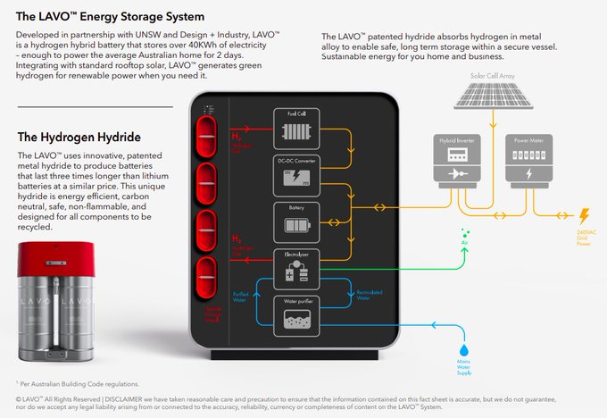
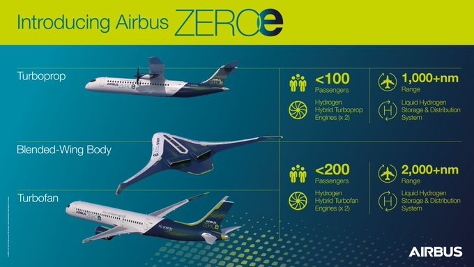

# Week 44

<table>
  <tr>
  <td></td>
  <td></td>
  </tr>
</table>

---


---

Looking more fluidy.. Nice.


---

Corollary: True change happens top-down, not bottom-up.

---

They can gauge whether they are doing good or bad and vote for the
'other' if bad (enough for democracy to work).

Spin is short term. Bad policies sink, good policies raise -- in the
long run, through their outcomes. If ur party is constantly putting up
bad policies, ppl might choose 'other' on you more than the next
guy. Also if major blocs are all failing constantly u might get the
occasional fascist who'll run roughshod over the whole thing. That,
noone wants.

---

[Exactly](2015/09/the-logic-of-political-survival-mesquita.html#elections). People don't
know shit.  That's why you dont put them on the spot for specific
policy (see Brexit).  

"Are you saying you can 'spin' people? They are not wise processors of
information?"

---

It could work.. the spin that is. Im not sure Dems want anything
passed that wld help Trump before election anyway.

"In many of the competitive races, Republicans have risked their seats
by jamming through the confirmation of Supreme Court Justice Amy Coney
Barrett [.. m]eanwhile, a desperately needed stimulus bill continues
to languish. This is precisely the message Senate Democrats used to
make the four-day Barrett hearings into a advertisement against Senate
Republicans"

[Link](https://www.washingtonpost.com/opinions/2020/10/30/senate-debacle-republicans/)

---

Fantastic design - Airfish-8

<iframe width="340" src="https://www.youtube.com/embed/C-sWokqiVHw" frameborder="0" allow="accelerometer; autoplay; clipboard-write; encrypted-media; gyroscope; picture-in-picture" allowfullscreen></iframe>

---

<blockquote class="twitter-tweet"><p lang="en" dir="ltr"><a href="https://twitter.com/hashtag/ThursdayThought?src=hash&amp;ref_src=twsrc%5Etfw">#ThursdayThought</a> – With every new <a href="https://twitter.com/hashtag/hydrogen?src=hash&amp;ref_src=twsrc%5Etfw">#hydrogen</a> refuelling station comes not only an increase in infrastructure, but a physical presence for the hydrogen movement &amp; increased public awareness – that’s why they’re some of our favourite stories to share! <a href="https://t.co/s7CNlDzilB">https://t.co/s7CNlDzilB</a></p>&mdash; H2 View (@h2_view) <a href="https://twitter.com/h2_view/status/1321898357267304448?ref_src=twsrc%5Etfw">October 29, 2020</a></blockquote> <script async src="https://platform.twitter.com/widgets.js" charset="utf-8"></script>

---

"@EmmaVigeland

The Hunter Biden attacks just aren’t landing. Rare misfire by the
traditionally well oiled right-wing propaganda machine. Enormously
convoluted and niche... It just has no punch in the middle of an
economic depression and deadly pandemic"

---

"Twitter backs down in NY Post standoff over Hunter Biden"

---

"@DrJillStein

Assange is in solitary.

Snowden's in exile.

Corbyn's suspended by his own party.

Now Glenn Greenwald's been censored by The Intercept.

There's a war on truth-tellers"

---

Pine Phone

<iframe width="340" src="https://www.youtube.com/embed/zlI14bb1zEM?start=275" frameborder="0" allow="accelerometer; autoplay; clipboard-write; encrypted-media; gyroscope; picture-in-picture" allowfullscreen></iframe>

---

"Don't expect a contested election... The cone of uncertainty has
narrowed considerably. Now, the question seems to be whether we'll see
a "skinny" Biden win or a landslide"

[Link](https://www.nationaljournal.com/s/711037?unlock=SRT6SBVCJHPBFJTS)

---


---

At another level anti-semitism is Labor's Russiagate. It unites
certain people, against certain other people.... It serves a
purpose. Obviously, just like Russiagate, is is based on half-truths,
a warped version of reality. The issue is now a code word, a
fraternity secret handshake of sorts.

---

Give it enough time even Americans would become like that... Remember
that CNN reporter [name calling](https://www.dailymail.co.uk/news/article-2696871/CNN-reporter-quickly-deletes-tweet-called-Israelis-cheering-missiles-striking-Gaza-scum.html)
leisure watchers while Palestines were being bombed? A CNN reporter! 

---

Of course. Because they know Israel better!

Brits have some history in the area, hence the knowledge about these
things are more widespread, so their left is naturally more vocal
about it.

"But isn't it true there has been more pointed criticism of Israel in
UK, especially in Labor?"

---

😆 😆 😆 

BBC: "Labour suspends Jeremy Corbyn over reaction to anti-Semitism report"

---

"@lhfang

Expect a lot of sniping from the reporters behind discredited
Russiagate hysteria, hype mindless identity politics, aggregate
partisan horse race journalism & whose beliefs are uniformly identical
to whatever is popular on Twitter. The conformist mob hates principled
dissent"

---

<blockquote class="twitter-tweet"><p lang="en" dir="ltr">Joe Rogan Experience #1556 - Glenn Greenwald<a href="https://t.co/EAvKSww9IR">https://t.co/EAvKSww9IR</a> <a href="https://t.co/S0MY6YhfeO">pic.twitter.com/S0MY6YhfeO</a></p>&mdash; Derek Shaffer (@DerekJShaffer) <a href="https://twitter.com/DerekJShaffer/status/1321518032645140480?ref_src=twsrc%5Etfw">October 28, 2020</a></blockquote> <script async src="https://platform.twitter.com/widgets.js" charset="utf-8"></script>

---

Glenn Greenwald resigns from the media platform he co-founded bcz of
censorship and moves to Substack?

---

<blockquote class="twitter-tweet"><p lang="en" dir="ltr">Hydrogen News 📰 ENGIE EPS (Paris:EPS) announces the <a href="https://twitter.com/hashtag/inauguration?src=hash&amp;ref_src=twsrc%5Etfw">#inauguration</a> of the <a href="https://twitter.com/hashtag/hydrogen?src=hash&amp;ref_src=twsrc%5Etfw">#hydrogen</a>-based <a href="https://twitter.com/hashtag/energy?src=hash&amp;ref_src=twsrc%5Etfw">#energy</a> storage system built with its proprietary <a href="https://twitter.com/hashtag/technology?src=hash&amp;ref_src=twsrc%5Etfw">#technology</a> in <a href="https://twitter.com/hashtag/Agkistro?src=hash&amp;ref_src=twsrc%5Etfw">#Agkistro</a>, 🇬🇷.<br><br>Read more 👇<a href="https://twitter.com/hashtag/HydrogenNow?src=hash&amp;ref_src=twsrc%5Etfw">#HydrogenNow</a> <a href="https://twitter.com/ENGIE_EU?ref_src=twsrc%5Etfw">@ENGIE_EU</a> <a href="https://twitter.com/EUEnergyNews?ref_src=twsrc%5Etfw">@EUEnergyNews</a> <a href="https://twitter.com/euenergyweek?ref_src=twsrc%5Etfw">@euenergyweek</a> <a href="https://twitter.com/EUScienceInnov?ref_src=twsrc%5Etfw">@EUScienceInnov</a> <a href="https://t.co/Lq3GDngWSD">https://t.co/Lq3GDngWSD</a></p>&mdash; Hydrogen Europe (@H2Europe) <a href="https://twitter.com/H2Europe/status/1321730999684722688?ref_src=twsrc%5Etfw">October 29, 2020</a></blockquote> <script async src="https://platform.twitter.com/widgets.js" charset="utf-8"></script>

---

Paolo Fedreghini and Marco Bianchi - Stay (in mood) \#music

[Link](https://youtu.be/AsJqYjiLuJ4)

---

Shawn Lee's Ping Pong Orchestra - Cairo Cairo \#music

[Link](https://youtu.be/TTBIUMYm22E)

---

CNN: "With the race for the presidency approaching its end amid a
raging pandemic, Democratic nominee Joe Biden maintains a substantial
lead over President Donald Trump nationwide" via @AlanIAbramowitz

[Link](https://twitter.com/AlanIAbramowitz/status/1321579310650695680)

---

<blockquote class="twitter-tweet"><p lang="en" dir="ltr">All satellites deployed. Thank you <a href="https://twitter.com/planetlabs?ref_src=twsrc%5Etfw">@planetlabs</a>, Canon and <a href="https://twitter.com/SpaceflightInc?ref_src=twsrc%5Etfw">@SpaceflightInc</a> for flying Electron.</p>&mdash; Peter Beck (@Peter_J_Beck) <a href="https://twitter.com/Peter_J_Beck/status/1321579637453938688?ref_src=twsrc%5Etfw">October 28, 2020</a></blockquote> <script async src="https://platform.twitter.com/widgets.js" charset="utf-8"></script>

---

"@dailyposter

NEWS: A major fossil fuel company pumped an average of $12,000 into
politics every single day for 2 years & just got a top court to bless
its move to keep the money 100% anonymous. The case could set a
precedent for all corporate spending to buy elections"

[Link](https://mobile.twitter.com/dailyposter/status/1321622652721664000)

---

"@ShantMM

What made Russiagate unique as a conspiracy theory is that you need a
college degree to believe it, because it requires a special sort of
stupidity only conferred by higher education"

---

From their brochure



[Link](https://www.h2networks.com.au/pdf/Small-Scale-LAVO-Residential-Unit-Brochure.pdf)

---

They use sodium borohydride..? 🤔

[Link](https://www.mdpi.com/1996-1073/12/23/4428/htm)

---

"The hydrogen hydride alloy used in Lavo is based on a technology that
emerged after WWII, where hydrogen molecules attach to metals such as
magnesium or aluminium. Professor Kondo-Francois Aguey-Zinsou, chief
scientist and executive director of Lavo and lead researcher in
hydrogen technologies at UNSW, has been researching hydrides for more
than 20 years. Muller says Aguey-Zinsou has 'cracked the code' with
the alloy used in the Lavo storage system"

[Link](https://www.ecogeneration.com.au/the-40kwh-34750-196kg-hydrogen-battery-for-the-home/)

---

Hydride based H2 storage was listed [here](../../2022/02/h2-storage.html).

---

They use a form of metal hydride apparently.

"@hazergroupltd

With the aim of powering a cleaner, more sustainable future through
its cutting-edge hydrogen storage technology, Australian technology
and lifestyle company Lavo officially launched on Tuesday (20th Oct)"


[Link](https://twitter.com/hazergroupltd/status/1321663202212675584)


---

Plug Power CEO: "Power Density and Range: fuel cell energy density is
four times more than batteries, and a tank of hydrogen contains more
than double the energy of a battery at the same weight. Fuel cells
allow easy scalability for users to increase range without the
elimination of cargo space. This is important in middle-mile and
long-haul green mobility markets.  In these applications, you must
double the batteries on board to double the range of a
battery-electric vehicle. With fuel cells, to double the range, you
only have to add more hydrogen.  That supports a 50-60% increase in
payload versus battery electric vehicles"

[Link](https://www.powerelectronictips.com/fuel-cells-capabilities-and-performance-virtual-roundtable-part-1-of-2/)

---

It's not surprising fascists sometimes [offering](2020/07/right-acting-left.html) left
solutions. While it's fine to get some left policies, you really don't need the
accompanying drama, or deaths, and the errant stupidity.

"[T]he Brasilian government launched the benefits ... with an average
monthly benefit of $163 per home. Now the relief is also providing an
unlikely popularity boost for Bolsonaro"

---

Not exactly fluidy dam break yet.. but we're getting there


---

They have a Hoboken too. And it's likely theirs is the original.

---

I did lot of my first H2 read-ups while in Antwerp.  👍

---

<blockquote class="twitter-tweet"><p lang="en" dir="ltr">The construction of Antwerp’s first <a href="https://twitter.com/hashtag/hydrogen?src=hash&amp;ref_src=twsrc%5Etfw">#hydrogen</a> station has begun. Compagnie Maritime 🇧🇪 said it will be the first <a href="https://twitter.com/hashtag/hydrogen?src=hash&amp;ref_src=twsrc%5Etfw">#hydrogen</a> station in the <a href="https://twitter.com/hashtag/world?src=hash&amp;ref_src=twsrc%5Etfw">#world</a> that produces and is capable of supplying <a href="https://twitter.com/hashtag/greenhydrogen?src=hash&amp;ref_src=twsrc%5Etfw">#greenhydrogen</a> to 🚘, 🚍, 🚚 and 🚢. <a href="https://twitter.com/hashtag/HydrogenNow?src=hash&amp;ref_src=twsrc%5Etfw">#HydrogenNow</a> <a href="https://twitter.com/HydrogenEnergy?ref_src=twsrc%5Etfw">@HydrogenEnergy</a> <a href="https://t.co/UXuVH6trTh">https://t.co/UXuVH6trTh</a></p>&mdash; Hydrogen Europe (@H2Europe) <a href="https://twitter.com/H2Europe/status/1320998670934786048?ref_src=twsrc%5Etfw">October 27, 2020</a></blockquote> <script async src="https://platform.twitter.com/widgets.js" charset="utf-8"></script>

---

"@aaronstein1

Ankara and Moscow have closer ties than Ankara and Paris. Russia
killed dozens of Turkish troops in March and Ankara chose to pretend
the Syrians did it"

---

Celebrations in Chile after scrapping their Consitution

<blockquote class="twitter-tweet"><p lang="es" dir="ltr">Cada día, cada mes, cada año,es un nuevo paso hacia el sueño de la PATRIA GRANDE 🌎<br><br>¡ADIÓS DICTADURA! <a href="https://twitter.com/hashtag/ChileDesperto?src=hash&amp;ref_src=twsrc%5Etfw">#ChileDesperto</a> 🇨🇱🇨🇱<br>Una nueva constitución. <a href="https://twitter.com/hashtag/Chile?src=hash&amp;ref_src=twsrc%5Etfw">#Chile</a> <a href="https://twitter.com/hashtag/TE21?src=hash&amp;ref_src=twsrc%5Etfw">#TE21</a> <a href="https://t.co/Igrl6WhVyQ">pic.twitter.com/Igrl6WhVyQ</a></p>&mdash; 𝑼𝒗𝒊𝒕𝒂 (@Uva22) <a href="https://twitter.com/Uva22/status/1320770044893212679?ref_src=twsrc%5Etfw">October 26, 2020</a></blockquote> <script async src="https://platform.twitter.com/widgets.js" charset="utf-8"></script>

---

Eat Static - Love Truncheon! \#music

[Link](https://youtu.be/tiXl5DFVBIM)

---

Mad Money + H2. 

<iframe width="340"  src="https://www.youtube.com/embed/m7VIhL2cg60" frameborder="0" allow="accelerometer; autoplay; clipboard-write; encrypted-media; gyroscope; picture-in-picture" allowfullscreen></iframe>

---

"@gabriel_zucman

In 1950, the corporate income tax raised 6.5% of national income in
tax revenue. In 2019 it raised 1.2%"

---

"Coronavirus antibodies decline after infection, study finds, raising
questions about herd immunity"

[Link](https://www.cnbc.com/2020/10/27/herd-immunity-coronavirus-antibodies-fall-after-infection-study-says.html)

---

Fila Brazillia - D'avros \#music

[Link](https://youtu.be/B7kx9vsrK8Y)

---

Langhorns - Slipstream \#music

[Link](https://youtu.be/drodN-SnmJU)

---

"12 million have lost employer-sponsored health insurance [US]"

[Link](https://www.cbsnews.com/news/health-insurance-coronavirus-pandemic-12-million-lost-employer-sponsored/)

---

C. Hedges: "48% of front line workers remain ineligible for sick pay [in US]"

---

That's lota of f-ing people, for one. Second, if the spread is too
fast, it overhelms the health system, which most government in the EU
and elsewhere are responsible for. That's why govs panick when R goes
too much over 1. Plus slowing the spread buys time; cure, vaccine, etc.

"If covid is let roam free and 1% of people die, that is one years
worth of world population growth. Why care?"

---

"Texas is on its way to becoming a Democratic state"

---

"The 'Borat 2' babysitter says she only made $3,600 for being tricked
in the film. Now, she's unemployed and feels 'betrayed.'"

[Link](https://www.insider.com/borat-2-babysitter-movie-gofundme-campaign-jeanise-jones-amazon-stream-2020-10)

---

The seemingly daring nature of his pranks hide the fact that these are
safe protests to make. After wide condemnation of W ME policies, it is
safe to "get" Cheney, in a culture where there is already tolerance
for that stuff. Is it safe to say millions have no health insurance
and Dems have done nothing abt it for decades? Say that shit, maybe
they'll pull the money for your next Borat movie.

---

SBC thinks Twitter alone is responsible for Trump's 2016 election
BTW. He doesn't really understand what's going on. His main crowd
seems to be affluent centrist types who just want to be served up some
safe resistance.

---

Well after pressure like this from many FB caved

"Baron Cohen called Zuckerberg a 'naive, misguided child who spreads
Nazi propaganda and only has imaginary friends.'"

[Link](https://www.businessinsider.com/sacha-baron-cohen-tore-into-mark-zuckerberg-again-at-the-golden-globes-2020-1)

---

"Palestinian Information Center (PIC) condemns with the strongest
possible terms Facebook’s deletion of its 5-million fan page"

---

💧 + ⚡ = [Boom!](https://images.squarespace-cdn.com/content/53ab1feee4b0bef0179a1563/1561389995070-UR2D2PXG8VL9QW133ID6/hydrogen+energy+storage+infographic.png?content-type=image%2Fpng) ⛽ ⛽ ⛽

---
Sweet. 💧 means ⛽ for us

"@NASAMoon

We just announced that - for the first time - we’ve confirmed H2O💧 in
sunlit☀️ areas of the Moon"

---

Chile scraps their 80 Consitution? Their diktat is usually compared to
TR fascism, w its human-rights vioations, on the left
especially. Pinotchet is compared to Evren, and their consitution must
be just as bad, 80 and 82 respectively, ultra capitalist, fascist docs
in essence. TR fascism is still around sadly

---

Which analyst is that? TH is already a non-democracy. A coup there wld
be just another workday, like another Thursday.

"Protests in Thailand could spiral into violence and lead to a
military coup, analyst says"

---

Let it rip

"Banks may have to brace for heavy losses as commercial property
prices plunge... Commercial real estate prices have plunged this year
as people stopped going into offices, and retail businesses were
disrupted. That could lead to a significant losses for banks,
according to a recent report"

---

"@gabriel_zucman

It is my professional duty to note again that, no matter its
popularity in some circles, 'the top 10% pays 70% of income taxes' is
a meaningless statistic. If the top 10% earned 100% of all income it
would pay 100% of all income taxes"

---

Real World Floating Architecture with Karina Czapiewska

[Link](https://www.seasteading.org/floating-architecture/)

---

Chimey.. 

Francis Coppieters - Funky Chimes \#music

[Link](https://youtu.be/SuIJuLrNHMI)

---

Francis Coppieters - Piano in Transit \#music

[Link](https://youtu.be/e1LOWcVv56M)

---

"@JimBridenstine

NEWS: We confirmed water on the sunlit surface of the Moon for the 1st
time using @SOFIAtelescope. We don’t know yet if we can use it as a
resource, but learning about water on the Moon is key for our
\#Artemis exploration plans"

---

<blockquote class="twitter-tweet"><p lang="en" dir="ltr">🌖 We detected water on the sunlit lunar surface!<br><br>Understanding the Moon’s water helps piece together the history of water in the inner solar system and also supports future human space exploration.<br><br>Details: <a href="https://t.co/sONYzaylco">https://t.co/sONYzaylco</a> <a href="https://t.co/37hs7AaubP">pic.twitter.com/37hs7AaubP</a></p>&mdash; SOFIAtelescope (@SOFIAtelescope) <a href="https://twitter.com/SOFIAtelescope/status/1320776485196713984?ref_src=twsrc%5Etfw">October 26, 2020</a></blockquote> <script async src="https://platform.twitter.com/widgets.js" charset="utf-8"></script>
   
---

"@H2Europe

Great to see Giles Dickson, CEO of @WindEurope, supporting European
Clean Hydrogen Alliance!"

---

<blockquote class="twitter-tweet"><p lang="en" dir="ltr">The EU Clean Hydrogen Alliance is moving into the next phase! A call has been published to form 6 roundtables on:<br><br>🟢production<br>⚪️transmission &amp; distribution<br>🔵industrial applications<br>🟢mobility<br>⚪️energy sector<br>🔵residential applications<a href="https://t.co/AgSU86rOo6">https://t.co/AgSU86rOo6</a> <a href="https://twitter.com/hashtag/hydrogen4climate?src=hash&amp;ref_src=twsrc%5Etfw">#hydrogen4climate</a> <a href="https://t.co/UV4VazRQlE">pic.twitter.com/UV4VazRQlE</a></p>&mdash; Internal Market, Industry, Entrepreneurship &amp; SMEs (@EU_Growth) <a href="https://twitter.com/EU_Growth/status/1320653484979589120?ref_src=twsrc%5Etfw">October 26, 2020</a></blockquote> <script async src="https://platform.twitter.com/widgets.js" charset="utf-8"></script>

---

If one has certain [socdyn ability](2015/07/mesquita-game-theory.html#inborn),
an idea is to use it to find good anchor points, calculations, measurements, lit,
and use that to build more know-how around. Can lead to more replicatable
results and might even to something resembling science. I did this bcz
lack of mathematics in socials sciences is repulsive for 1, and wanted
to be as hands-off as possible (refs for everything). It works.

---

<blockquote class="twitter-tweet"><p lang="en" dir="ltr"><a href="https://twitter.com/hashtag/MissionH24?src=hash&amp;ref_src=twsrc%5Etfw">#MissionH24</a>&#39;s water emissions are hot news - according to a reliable source. 💧💦<a href="https://twitter.com/GreenGTOfficiel?ref_src=twsrc%5Etfw">@GreenGTOfficiel</a> <a href="https://twitter.com/hashtag/Hydrogen?src=hash&amp;ref_src=twsrc%5Etfw">#Hydrogen</a> <a href="https://twitter.com/hashtag/Paris?src=hash&amp;ref_src=twsrc%5Etfw">#Paris</a> <a href="https://t.co/DuB7fdGR73">pic.twitter.com/DuB7fdGR73</a></p>&mdash; Mission H24 (@MissionH24) <a href="https://twitter.com/MissionH24/status/1320765341396590592?ref_src=twsrc%5Etfw">October 26, 2020</a></blockquote> <script async src="https://platform.twitter.com/widgets.js" charset="utf-8"></script>

---

[Standardization](2011/03/fundamentals-of-industrial-ideologies_standardization.html).. 👎

The Independent, 2015: "Schools are using 'dubious practices' and even
cheating to achieve better performance results because of the intense
pressure of the Government’s test and exam system, a major study for
the largest teaching union has found. ...

The study concluded there was 'evidence that teachers in England are
‘gaming the system’, because they are under pressure to achieve good
results. In some cases they are being told to cheat. Such practices
are increasing in response to the intense pressure on school leaders
and teachers to raise attainment as measured by tests and exams.'"

[Link](https://www.independent.co.uk/news/education/education-news/schools-are-using-dubious-practices-boost-results-teacher-s-union-says-10365452.html)

---

They discovered a method to produce a cheap catalyst that performs as
well as current methods, but based on tungsten.

"[E]lectrocatalytic water splitting has been considered as one of the
most important and sustainable processes for the hydrogen
production. Because of the low HER kinetics, it is necessary to use
high efficiency electrocatalysts to increase the overall process
efficiency. ...

Here, we report a simple and scalable plasma dynamic synthesis method
to form composite containing the single-crystalline nanosized cubic
tungsten carbide embedded in the carbon matrix (WC 1-x @C), which was
studied in HER both in the pure form and modified with some Pt by wet
impregnation method. It was found that even by adding 1 wt % platinum,
it is possible to significantly increase the catalytic activity of the
WC 1-x @C composite, while with the addition of 10% platinum allows
reaching almost the same properties as for commercial Pt/C sample"

[Link](https://www.sciencedirect.com/science/article/abs/pii/S0925838820314791)

---

These guys are developing a capsule technology to carry H2 to
whereever it's needed, especially for aviation needs. Good company to watch. 

<blockquote class="twitter-tweet"><p lang="en" dir="ltr">Looking forward to getting hydrogen-powered aviation off the ground in the near-term with some help from our partners at <a href="https://twitter.com/PlugPowerInc?ref_src=twsrc%5Etfw">@PlugPowerInc</a> ! <a href="https://t.co/S3Swe0h035">https://t.co/S3Swe0h035</a></p>&mdash; Universal Hydrogen (@Universal_H2) <a href="https://twitter.com/Universal_H2/status/1308820927682162688?ref_src=twsrc%5Etfw">September 23, 2020</a></blockquote> <script async src="https://platform.twitter.com/widgets.js" charset="utf-8"></script>

---

There is no comparison. H2 storage capacity is nearly limitless. If
there is water, we can get H2. Double the panel capacity double the
fuel. As simple as that.

"How does storage of H2 vs bats compare?"

---


How to understand a certain country with dumb ni--rs at the helm..
You start with a child. What does a child want? Wants to do grown-up
things, right. Drive like one, be like one.


But if the child type is dysfunctional, s/he wont know what those
grown-up things are, will instead do things that *appear* grown-up,
like this kid, with imaginary steering wheel, and make car sounds
"wroomm wrooom". In gov that'll be vevy vevy big bridges, vevy vevy
big wars... wout knowing whether these things are useful or not. This
is the sad truth.

---

They are very similar. With golf you sorta walk around too, like
regular daily life chill, then you go to a certain point, stop,
concenrate, strain.. strain.. Boom!

That's exactly like taking a shit.

"You say golf is similar to a number two. How so?"

---

"@jimmy_dore

I had many spirited debates about censorship in the TYT studio, I was
warning that being pro-censorship will always come back to bite the
left even harder. Reminder: No matter how much you hate someone who is
speaking, the antidote to bad speech is more speech, not censorship.

'@sunraysunray

Facebook is now blocking our videos for violating "community
standards" that trigger certain key words'"

---

"Gov. Newsom Pledges to Ban Fracking in California – Then Greenlights
More of It. The Newsom administration has established a pattern of
approving permits during busy news cycles"

[Link](https://capitalandmain.com/gov-newsom-pledges-to-ban-fracking-california-then-greenlights-more-1023)

---

<blockquote class="twitter-tweet"><p lang="en" dir="ltr">We are proud to present the <a href="https://twitter.com/fch_ju?ref_src=twsrc%5Etfw">@fch_ju</a> <a href="https://twitter.com/hashtag/HyShip?src=hash&amp;ref_src=twsrc%5Etfw">#HyShip</a> project - the world?s first cargo vessel sailing on liquid <a href="https://twitter.com/hashtag/hydrogen?src=hash&amp;ref_src=twsrc%5Etfw">#hydrogen</a> and a LH2 supply chain! <a href="https://twitter.com/EU_H2020?ref_src=twsrc%5Etfw">@EU_H2020</a> <a href="https://twitter.com/Wilhelmsengroup?ref_src=twsrc%5Etfw">@Wilhelmsengroup</a> <a href="https://twitter.com/Equinor?ref_src=twsrc%5Etfw">@Equinor</a> <a href="https://twitter.com/KOGMaritime?ref_src=twsrc%5Etfw">@KOGMaritime</a> <a href="https://t.co/q1BXqjFEpL">pic.twitter.com/q1BXqjFEpL</a></p>&mdash; Maritime CleanTech (@NCEMCT) <a href="https://twitter.com/NCEMCT/status/1319231361669042176?ref_src=twsrc%5Etfw">October 22, 2020</a></blockquote> <script async src="https://platform.twitter.com/widgets.js" charset="utf-8"></script>

---

"@Redistrict

Breathtaking: statewide, Texas just surpassed 80% of its total 2016
votes cast, leading the nation. And there's still more than a week of
voting to go"

---

Making something float is much easier than making it sink. Calcs for a
platform... 3x2x8 meter design, with two stacks of empty barrels in
it, pour concrete over it, put a **ton** of weight on top, this
conrete slab would still float. 

Barrel, 0.16 m^3, concrete density 2400 kg / m3.

```python
w = 3; h = 2; l = 8
concw = (w*h*l - w*1.2*l) * 2400
concv = w*h*l
ow = 1000.0
"%0.2f, %0.2f" % (concw+ow, concv*1000.0)
```

```text
Out[1]: '47080.00, 48000.00'
```

---

Boeing is in the gutter, Airbus on the rise. Dam.

---

Airbus 👍 👍 👍 



---


---


"Recycling lithium" is a non-starter for another reason. Reserves are
limited, as in insufficient, and since recycling does not magically
create new reserves, the main problem remains unresolved. Not enough
fucking lithium. 

---

Ikebe Shakedown- Tame The Beats \#music

[Link](https://youtu.be/wYi1lr3gWwU)

---

Yennah - Red Noise \#music

[Link](https://youtu.be/pU5aVYfE34w)

---

Trek isn't about the "Federation" necessarily either.. How do these
fools at Bad Reboot (a JJ outfit) watch these shows? With eyes closed?
They seem to have perfected the "superficial pay homage" move, e.g. in
*Into the Darkness* Khan says "my name is Khan" veery deliberately, BR
is like ok, u remember that right, I pressed that button now we are
okay? That was cool right..? Like it's a fan thing..? It's not a fan
thing. Roddenberry's creation is the whole package, not some building,
or some word you pay random homage to.

---


What was the other one with the fax, and Internet..? Also NYT right?

---

🤣 🤣 🤣 

“A rocket will never be able to leave the Earth's atmosphere". The New
York Times, January 13, 1920.

---

Earth surface area (including sea) 510.1 million km².

How much area for 1 person?

```python
area = ( 510.1  / (7.5 * 1e3) * 1e6  ) 
print ("%.2f m2" %  area )
print ("side %.2f m" %  np.sqrt(area) )
```

```text
68013.33 m2
side 260.79 m
```

Not too wide of an area.. a square with one side 260 meters..

Lota people.

---

I cannot believe post 911 was spent on such shoddy-ass solutions on
the climate. Pursued BTW by ppl who were seen as "smart" too. Simple
arithmetic could have shown what's what... So sad.

---

"@HannaLiubakova

\#Belarus Military vehicles are coming from various direction. Mobile
internet is shutdown. 12 metro stations in #Minsk are closed. The
authorities are clearly scared, as they are doing it earlier than
usual"

---

IMO there will come a time when Russia will actively be involved
spreading democracy itself. At least to the level it itself has.

---

<center>

</center>

---

