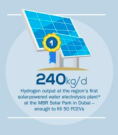
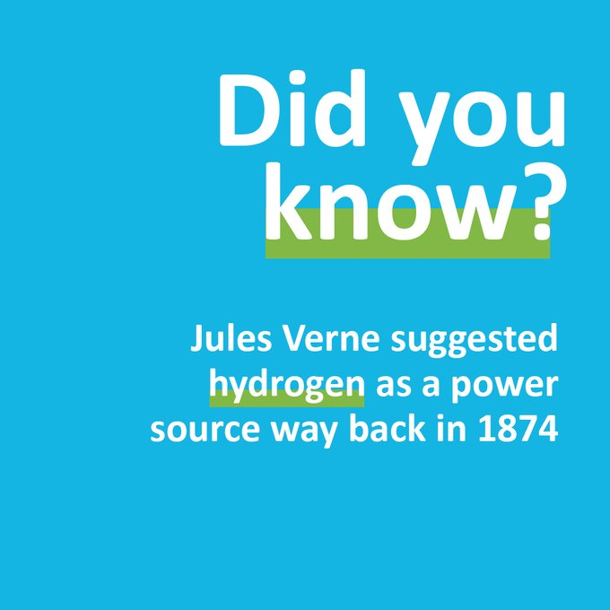

# Week 45

Fox News: "Biden wins presidency, Trump denied second term in White
House"

---

<blockquote class="twitter-tweet"><p lang="en" dir="ltr">Ann and I extend our congratulations to President-elect Joe Biden and Vice President-elect Kamala Harris. We know both of them as people of good will and admirable character. We pray that God may bless them in the days and years ahead.</p>&mdash; Mitt Romney (@MittRomney) <a href="https://twitter.com/MittRomney/status/1325142815354064896?ref_src=twsrc%5Etfw">November 7, 2020</a></blockquote> <script async src="https://platform.twitter.com/widgets.js" charset="utf-8"></script>

---

<blockquote class="twitter-tweet"><p lang="en" dir="ltr">Congratulations President-elect <a href="https://twitter.com/JoeBiden?ref_src=twsrc%5Etfw">@JoeBiden</a> &amp; <a href="https://twitter.com/KamalaHarris?ref_src=twsrc%5Etfw">@KamalaHarris</a> on your victory in the US Presidential election. With so many issues facing the international community, your message of unity is one we share. New Zealand looks forward to working with you both! <a href="https://t.co/VTGRM4mHEK">https://t.co/VTGRM4mHEK</a></p>&mdash; Jacinda Ardern (@jacindaardern) <a href="https://twitter.com/jacindaardern/status/1325154006549721088?ref_src=twsrc%5Etfw">November 7, 2020</a></blockquote> <script async src="https://platform.twitter.com/widgets.js" charset="utf-8"></script>

---

<blockquote class="twitter-tweet"><p lang="en" dir="ltr">Congratulations to Joe Biden and Kamala Harris for their historic win. In this incredibly difficult moment in American history, I wish them the best as they attempt to bring our nation together around an agenda of economic, social, racial and environmental justice.</p>&mdash; Bernie Sanders (@BernieSanders) <a href="https://twitter.com/BernieSanders/status/1325149140309913600?ref_src=twsrc%5Etfw">November 7, 2020</a></blockquote> <script async src="https://platform.twitter.com/widgets.js" charset="utf-8"></script>

---

please clap

<blockquote class="twitter-tweet"><p lang="en" dir="ltr">Congratulations to President-elect Biden. I have prayed for our President most of my adult life. I will be praying for you and your success. Now is the time to heal deep wounds. Many are counting on you to lead the way.</p>&mdash; Jeb Bush (@JebBush) <a href="https://twitter.com/JebBush/status/1325133897781243908?ref_src=twsrc%5Etfw">November 7, 2020</a></blockquote> <script async src="https://platform.twitter.com/widgets.js" charset="utf-8"></script>

---

<blockquote class="twitter-tweet"><p lang="en" dir="ltr">Chancellor <a href="https://twitter.com/hashtag/Merkel?src=hash&amp;ref_src=twsrc%5Etfw">#Merkel</a> congratulates <a href="https://twitter.com/JoeBiden?ref_src=twsrc%5Etfw">@JoeBiden</a> and <a href="https://twitter.com/KamalaHarris?ref_src=twsrc%5Etfw">@KamalaHarris</a>. <a href="https://twitter.com/hashtag/Election2020?src=hash&amp;ref_src=twsrc%5Etfw">#Election2020</a> <a href="https://t.co/A9Vwy1XYAR">pic.twitter.com/A9Vwy1XYAR</a></p>&mdash; Steffen Seibert (@RegSprecher) <a href="https://twitter.com/RegSprecher/status/1325146066820403200?ref_src=twsrc%5Etfw">November 7, 2020</a></blockquote> <script async src="https://platform.twitter.com/widgets.js" charset="utf-8"></script>

---

<blockquote class="twitter-tweet"><p lang="en" dir="ltr">The Americans have chosen their President. Congratulations <a href="https://twitter.com/JoeBiden?ref_src=twsrc%5Etfw">@JoeBiden</a> and <a href="https://twitter.com/KamalaHarris?ref_src=twsrc%5Etfw">@KamalaHarris</a>! We have a lot to do to overcome today’s challenges. Let&#39;s work together!</p>&mdash; Emmanuel Macron (@EmmanuelMacron) <a href="https://twitter.com/EmmanuelMacron/status/1325136167084363779?ref_src=twsrc%5Etfw">November 7, 2020</a></blockquote> <script async src="https://platform.twitter.com/widgets.js" charset="utf-8"></script>

---

"@cnnbrk

BREAKING: JOE BIDEN WINS

Joe Biden will be the 46th president of the United States, CNN
projects, after a victory in Pennsylvania puts the Scranton-born
Democrat over 270"

[Link](https://cnn.it/3eCQoqW)

---

Bloomberg: "Powerwall Rival Seeks to Bring Hydrogen Into Your
Home... It’s about the size of Tesla ... Powerwall, but can store up
to three times as much energy over a longer period"

[Link](https://www.bloomberg.com/news/articles/2020-10-19/tesla-powerwall-rival-seeks-to-bring-hydrogen-into-your-home)

---

Many in the world do not accept monopoly money? Not surprising.

"The Belt and Road's dollar problem...

[C]ontractors have typically preferred dollars in exchange for their
work building the roads, bridges, ports and more of the initiative"

[Link](https://ftalphaville.ft.com/2018/12/18/1545130791000/The-Belt-and-Road-s-dollar-problem/)

---

This is a really dumb idea

"@Fmrico

Another way for online teaching. Too much expensive to be an option, I think"

[Link](https://twitter.com/Fmrico/status/1323317858538037250)

---

Daam. Somehow a [soccer player](https://www.nytimes.com/2020/10/26/sports/soccer/mesut-ozil-arsenal-china.html)
from Germany had his career soured bcz of a comment on Uygurs.

---

"If you haven’t yet heard about green hydrogen, you’re about to—in a
big way. The universe’s most abundant element is among the hotter
topics in the halls of industry and government from Australia to Saudi
Arabia, along with a number of Asian, American and European
nations. By many accounts, we will soon see green hydrogen — green
because it’s produced with renewables — become a new multi-trillion
dollar commodity sector, transform the energy industry and play a
critical role in fighting climate change"

[Link](https://www.bofaml.com/en-us/content/esg-research/green-hydrogen-market-importance.html)

---

I like this part, about the project in Dubai;



---

[H2 big picture](twimg/El1OBenXEAAm9Xp.jpg)

---

We've clearly lost some ground here...nowadays an army of actual
scientist cannot see a blatant thing like lithium batteries
[not being](../../2022/02/base-energy-numbers.html#lithium)
fit for an overall climate solution. They apparently lost their
ability to add and subtract.  There is no shortage of useless
theories, multiple universes, strings, quantum this and that... but
simple arihtmetic?  No can do.

---

Good scifi foresight does exist. AC Clarke talked abt satellites way
before their time, in many ways inspired their creation.



---

"Germany refuses to turn a 'blind eye' to China, teams up with
Australia"

[Link](https://www.smh.com.au/world/asia/germany-refuses-to-turn-a-blind-eye-to-china-teams-up-with-australia-20201102-p56apf.html)

---

<blockquote class="twitter-tweet"><p lang="en" dir="ltr"><a href="https://twitter.com/hashtag/PlugBlog?src=hash&amp;ref_src=twsrc%5Etfw">#PlugBlog</a>: Plug Gigafactory on Schedule for First Operation<a href="https://t.co/fbYnYccgPK">https://t.co/fbYnYccgPK</a></p>&mdash; Plug Power Inc. (@PlugPowerInc) <a href="https://twitter.com/PlugPowerInc/status/1323251333005234176?ref_src=twsrc%5Etfw">November 2, 2020</a></blockquote> <script async src="https://platform.twitter.com/widgets.js" charset="utf-8"></script>

---

<blockquote class="twitter-tweet"><p lang="en" dir="ltr">The Raspberry Pi 400 is here! A complete personal computer built into a compact keyboard - ideal for learning to code with Raspberry Pi OS!<br><br>It shares the same performance as the Pi 4 with the CPU clocked to 1.8GHz thanks to the large internal heatsink!<a href="https://t.co/qWU0JgQ97X">https://t.co/qWU0JgQ97X</a> <a href="https://t.co/ZHPYj0N8eV">pic.twitter.com/ZHPYj0N8eV</a></p>&mdash; The Pi Hut (@ThePiHut) <a href="https://twitter.com/ThePiHut/status/1323173191393705991?ref_src=twsrc%5Etfw">November 2, 2020</a></blockquote> <script async src="https://platform.twitter.com/widgets.js" charset="utf-8"></script>

---

<blockquote class="twitter-tweet"><p lang="en" dir="ltr">Planned joint venture for large-scale production of fuel-cells: DaimlerTruckAG &amp; <a href="https://twitter.com/VolvoGroup?ref_src=twsrc%5Etfw">@VolvoGroup</a> sign binding agreement for new fuel-cell joint venture to develop, produce &amp; commercialize fuel-cell systems for use in heavy-duty trucks. 👉<a href="https://t.co/7E4ej0YJFE">https://t.co/7E4ej0YJFE</a> <a href="https://t.co/kPmhKxcWLu">pic.twitter.com/kPmhKxcWLu</a></p>&mdash; Daimler Trucks &amp; Buses (@DaimlerTruckBus) <a href="https://twitter.com/DaimlerTruckBus/status/1323158782915076097?ref_src=twsrc%5Etfw">November 2, 2020</a></blockquote> <script async src="https://platform.twitter.com/widgets.js" charset="utf-8"></script>

---

Sun energy falling on Earth in terms of (radiation) energy is 1000
W/m2. Solar panel efficiency is 20%. Take good daylight 1/4 of a
day. 

```python
area = 25 # m2
"%0.f Kwh from %d m2 area" % (0.2 * 0.25 * 24 * 25, area)
```

```text
Out[1]: '30 Kwh from 25 m2 area'
```

A house in US used 28.9 kWh per day (EIA, in 2017). 25 m2 is enough to
power the house (ignoring storage efficiency).

---

Tyco - Easy \#music

[Link](https://youtu.be/A9G3WPq2744)

---

Article says progressive leaders helped turn out the young vote for Biden.

"Unprecedented levels of youth turnout could boost a candidate many
young people scorned only a few months ago."

[Link](https://m.huffpost.com/us/entry/us_5f9d978ac5b65662bcc788b4)

---

Creative 


---

<blockquote class="twitter-tweet"><p lang="en" dir="ltr">This is not going to happen. <a href="https://t.co/bV3UJtRFbA">https://t.co/bV3UJtRFbA</a></p>&mdash; Hamish McKenzie (@hamishmckenzie) <a href="https://twitter.com/hamishmckenzie/status/1323116718810693633?ref_src=twsrc%5Etfw">November 2, 2020</a></blockquote> <script async src="https://platform.twitter.com/widgets.js" charset="utf-8"></script>

---

"@AshkenaziFugazi

If you're called antisemitic for criticizing Israel just say the
criticism is something you got from your Jewish friend, who said that
to not criticize Israel is antisemitic. It's me, I am your Jewish
friend. Every uncritical sentence you utter on Israel is
antisemitic. There. :)"

---

Fermeto Engineering, NL. 

<iframe width="340" src="https://www.youtube.com/embed/EcAZv5xcvn8" frameborder="0" allow="accelerometer; autoplay; clipboard-write; encrypted-media; gyroscope; picture-in-picture" allowfullscreen></iframe>

---

Floating house, Denmark

[Link](https://www.urbanrigger.com/)

---

I wonder if a generation of monitor-starers having irreversably lost
their contact from the physical world played a role in the bad design
choice here. "It's just code bro!". 

---

The design was not robust. They tried to fix in software what they
should have fixed in hardware.

"Boeing – what caused the 737 Max to crash?"

[Link](https://youtu.be/PdYcJldzOdw?t=591)

---

<blockquote class="twitter-tweet"><p lang="en" dir="ltr">This is both completely nuts and completely predictable. Censorship invariably ends in impossible policy contradictions and embarrassing logic knots <a href="https://t.co/rTQaPqI8Yp">https://t.co/rTQaPqI8Yp</a> via <a href="https://twitter.com/verge?ref_src=twsrc%5Etfw">@Verge</a></p>&mdash; Chris Anderson (@chr1sa) <a href="https://twitter.com/chr1sa/status/1322347515069431808?ref_src=twsrc%5Etfw">October 31, 2020</a></blockquote> <script async src="https://platform.twitter.com/widgets.js" charset="utf-8"></script>

---

"@J_Bloodworth

[Macron] 'We believe in the Enlightenment, and women have the same
rights as men... People who think otherwise, let them do it somewhere
else, not on French soil.'"

[Link](https://mobile.twitter.com/J_Bloodworth/status/1322672423347621888)

---

Alex Jones saz Trump cut off external lobbyists but then his circle
was carpetbombed with money so they became lobbyists indirectly
(\#rogan podcast). Could be true.. If so, good observation. See,
if this man is cut off due to (IMO) weird climate change denialism,
then you miss out on the occasional good observation. Censoring is bad

---

Cant go to the movies? Movie theathers were overrated anyway...

2W was about
[synchronization](../../2011/03/fundamentals-of-industrial-ideologies_synchronization.html);
in entertainment, in production, in ed. There can still be a place
called school, somewhere outside of home, kids are dropped off useful
for cases when home env is stressful, but ed itself will be be
asynch. Class would not "start" or "end" -- kid simply goes and picks
up tablet and continues where he left off from the previous day. A
librarian type person / certifier can make sure place is suitable for study

---

"The Latest: Australia has no local case 1st time in months [and] has
recorded no new locally transmitted coronavirus infection for the
first time in five months"

[Link](https://www.independent.co.uk/news/world/europe/the-latest-australia-has-no-local-case-1st-time-in-months-western-australia-capital-cases-cases-latest-b1495809.html)

---

Daam.. Boris Johnson net approval is -25% ??!! It sucks!!

[Link](https://yougov.co.uk/topics/politics/trackers/boris-johnson-approval-rating)

---

I see a lot of *I am CRMs* end up being surrounded with sycopants,
this is not a good sign. That means you are not listening
enough. 

---

<blockquote class="twitter-tweet"><p lang="en" dir="ltr">The more messed up your haircut is, the more likely I believe you?re taking COVID precautions seriously.</p>&mdash; Ben Ritter (@BenNetworks) <a href="https://twitter.com/BenNetworks/status/1322659147960168449?ref_src=twsrc%5Etfw">October 31, 2020</a></blockquote> <script async src="https://platform.twitter.com/widgets.js" charset="utf-8"></script>

---

🤣 These tech characters are so jaded.. The smartest ones will say
what they don't know, most others believe they can extend their
gibberish-ist technobabble into a complete new domain where they zero
understanding in.

"Soylent Founder's Unhinged Politics Rant Shows Tech Execs Don't
Understand the World"

[Link](https://www.vice.com/amp/en/article/epd4je/soylent-founders-unhinged-politics-rant-shows-tech-execs-dont-understand-the-world)

---

Yes... and if you ate less ziti, you cld run away from crowds faster,
isn't that right Crispie?

"Chris Christie ... issued a mea culpa last week after he was
discharged from a COVID-19 hospitalization that included a week in the
intensive-care unit. 'When you get this disease, it hits you how easy
it is to prevent,' he wrote under the headline 'I Should Have Worn a
Mask' in The Wall Street Journal. 'We are asked to wear cloth over our
mouth and nose, wash our hands and avoid crowds. Seldom has so little
been asked for so much benefit'"

---

Stabbings, killings, in Canada, France. At the same time Jihadi activity in
Idlib, Azerbaijan.. Related?

"Quebec stabbing: Two dead after attack by man in medieval clothes"

---

<blockquote class="twitter-tweet"><p lang="en" dir="ltr">New battery chemistry.</p>&mdash; Benedict Evans (@benedictevans) <a href="https://twitter.com/benedictevans/status/1168279470156865536?ref_src=twsrc%5Etfw">September 1, 2019</a></blockquote> <script async src="https://platform.twitter.com/widgets.js" charset="utf-8"></script>

---

"@benedictevans

Old: ‘TLDR’ = too long didn’t read.

New: ‘PWDR’ = paywall didn’t read"

---

<blockquote class="twitter-tweet"><p lang="en" dir="ltr">First spotted by <a href="https://twitter.com/dansinker?ref_src=twsrc%5Etfw">@dansinker</a>, this is just a remarkable correlation. <br><br>Google searches for &quot;loss of taste&quot; and &quot;loss of smell&quot; versus population-adjusted new coronavirus cases. <a href="https://t.co/I38fXZsyb8">https://t.co/I38fXZsyb8</a> <a href="https://t.co/e9tptqt8bn">pic.twitter.com/e9tptqt8bn</a></p>&mdash; Philip Bump (@pbump) <a href="https://twitter.com/pbump/status/1322013016351793152?ref_src=twsrc%5Etfw">October 30, 2020</a></blockquote> <script async src="https://platform.twitter.com/widgets.js" charset="utf-8"></script>

---

<blockquote class="twitter-tweet"><p lang="en" dir="ltr">The extraordinarily strong relationship btw China’s credit impulse and Germany’s PMI suggests China domestic demand -&gt; demand for German exports. <a href="https://twitter.com/scotiabank?ref_src=twsrc%5Etfw">@scotiabank</a> via <a href="https://twitter.com/SoberLook?ref_src=twsrc%5Etfw">@SoberLook</a> <a href="https://t.co/oIEFyDFRXE">pic.twitter.com/oIEFyDFRXE</a></p>&mdash; Adam Tooze (@adam_tooze) <a href="https://twitter.com/adam_tooze/status/1322498551805628416?ref_src=twsrc%5Etfw">October 31, 2020</a></blockquote> <script async src="https://platform.twitter.com/widgets.js" charset="utf-8"></script>

---

"Evidence of Google blacklisting of left and progressive sites continues to mount"

[Link](https://www.wsws.org/en/articles/2017/08/08/goog-a08.html)

---

"@JosephEStiglitz 

... The 2017 tax law must be repealed."

---

"Greece Strengthens Ties with India to Counter Turkey-Pakistan Alliance"

[Link](https://greece.greekreporter.com/2020/10/30/greece-strengthens-ties-with-india-to-counter-turkey-pakistan-alliance/)

---

I used to watch live CSPAN programs sometimes while I was in US.. When
Trent Lott made that infamous comment I saw that shit live. I was like
'that didnt sound right...'. 🤔 Dude was destroyed few weeks later.

---

<center>

</center>

---


