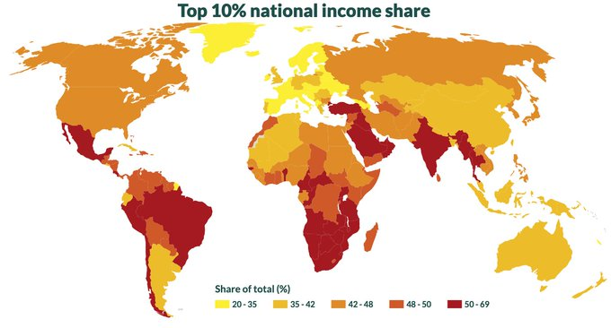

# Week 46

---

"@Atul_Gawande

New Mich. hospital data: Of people admitted with COVID, 70% were alive
and home 60 days later. Of those who'd been working, 40% either lost
their job or were still too sick to work"

---

"@petersgoodman

Hospitalizations in Sweden rising faster than anywhere else in Europe,
undermining reckless nonsense about success of laissez faire strategy"

---

Yes. New [post](../../2020/11/h2-lohc.md)

---

Perhydro-dibenzyltoluene? 

---

WTF is that compound? It doesn't seem pressurized.. Not ammonia.. Room
temparature storage.. Interest piqued.

---

"Saudi Arabia is constructing a futuristic city in the desert on the
Red Sea called Neom. The $500 billion city ... is being built from
scratch and will be home to a million people. And what energy product
will be used both to power this city and sell to the world? Not
oil. The Saudis are going big on something called green hydrogen — a
carbon-free fuel made from water by using renewably produced
electricity to split hydrogen molecules from oxygen molecules. ...

The Saudis aren’t alone in believing it’s the next big thing in the
energy future. While the fuel is barely on the radar in the United
States, around the world a green hydrogen rush is underway"

[Link](https://e360.yale.edu/features/green-hydrogen-could-it-be-key-to-a-carbon-free-economy)

---

"@jayvanbavel

Research finds that restaurants, gyms, cafes and other crowded indoor
venues accounted for 80% of infections in the #COVID19 pandemic"

[Link](https://twitter.com/jayvanbavel/status/1326549230505193473)

---

So far as I've heard, progs dont sound unhappy about Klain as COS.

---

<blockquote class="twitter-tweet"><p lang="en" dir="ltr">Ron Klain’s deep, varied experience and capacity to work with people all across the political spectrum is precisely what I need in a White House chief of staff as we confront this moment of crisis and bring our country together again. <a href="https://t.co/s4XlAgMrxf">https://t.co/s4XlAgMrxf</a></p>&mdash; Joe Biden (@JoeBiden) <a href="https://twitter.com/JoeBiden/status/1326696150364286976?ref_src=twsrc%5Etfw">November 12, 2020</a></blockquote> <script async src="https://platform.twitter.com/widgets.js" charset="utf-8"></script>

---

<blockquote class="twitter-tweet"><p lang="en" dir="ltr">Great <a href="https://twitter.com/nytimes?ref_src=twsrc%5Etfw">@nytimes</a> article with input from several California <a href="https://twitter.com/hashtag/hydrogen?src=hash&amp;ref_src=twsrc%5Etfw">#hydrogen</a> champions! &quot;California Is Trying to Jump-Start the Hydrogen Economy.&quot; <a href="https://twitter.com/SunlineTransit?ref_src=twsrc%5Etfw">@SunlineTransit</a> <a href="https://twitter.com/airliquidegroup?ref_src=twsrc%5Etfw">@airliquidegroup</a> <a href="https://twitter.com/Shell?ref_src=twsrc%5Etfw">@Shell</a> <a href="https://twitter.com/hashtag/UCIrvine?src=hash&amp;ref_src=twsrc%5Etfw">#UCIrvine</a> <a href="https://twitter.com/hashtag/FirstElement?src=hash&amp;ref_src=twsrc%5Etfw">#FirstElement</a> <a href="https://t.co/ZwTOJ10bLX">https://t.co/ZwTOJ10bLX</a> <a href="https://t.co/FIY3ePMexS">pic.twitter.com/FIY3ePMexS</a></p>&mdash; Energy Independence Now (@DriveH2) <a href="https://twitter.com/DriveH2/status/1326578742060322816?ref_src=twsrc%5Etfw">November 11, 2020</a></blockquote> <script async src="https://platform.twitter.com/widgets.js" charset="utf-8"></script>

---

Karl Rove: "This Election Result Won’t Be Overturned"

[Link](https://t.co/Es8ntEvowG?amp=1)

---

"Plastic Injection Molding vs 3D Printing ? Which is Better? ... 3D
printing has given engineers the power to create plastic designs at
their desks and bring them to life in a matter of hours. Injection
molding, on the other hand, is the go-to for quality and
value. ... The use of 3D printing in innovative and experimental
scenarios has been grabbing recent headlines, but the reality is that
the majority of today's plastic parts are manufactured using plastic
injection molding"

[Link](https://www.kaysun.com/blog/plastic-injection-molding-vs-3d-printing)

---

Emphasis - Vera Cruz \#music

[Link](https://youtu.be/LCpothQgHnI)

---



Sad picture.

TR is not surprising I guess, it is a near-apartheid state where
certain sections of the population are opressed, a permanent morass of
defunct ideologies with a phony national identity, and a leadership
history which never had much spark. The color on the map is well
deserved.

South Africa, well, an actual frickin apartheid, until recently. 

Brasil, Chile make sense. Both countries opressed the left, via coups,
hard or soft.

Mexico, drug lords. Largely US' fault.

---

Rahm [liked](https://chi.streetsblog.org/2019/12/16/cheer-up-clevelanders-the-ohare-express-is-dead-and-you-can-kill-the-hyperloop/)
Hyperloop fyi, disgraced former mayor of Chicago and a centrist.

"@AstroKatie

Japan has 1700 miles of high-speed train lines that can go up to 200
mph. The system has been in use for half a century.

'@CNN Virgin Hyperloop has completed the first test of its high-speed
transportation technology'"

---

SJS Big Band - International Monetary Funk \#music

[Link](https://youtu.be/Lhbjrdc_NiM)

---

There is no subsititute to asking the top dog on a particular
subject. Just dropped one to honcho on Zoom, got good answer. 

---

<blockquote class="twitter-tweet"><p lang="en" dir="ltr">If the data nightmare that is Ring doesn&#39;t scare you, maybe this will <a href="https://t.co/0HRLW5OwTq">https://t.co/0HRLW5OwTq</a></p>&mdash; Internet of Shit (@internetofshit) <a href="https://twitter.com/internetofshit/status/1326347194488791040?ref_src=twsrc%5Etfw">November 11, 2020</a></blockquote> <script async src="https://platform.twitter.com/widgets.js" charset="utf-8"></script>

---

"@gabriel_zucman

According to the latest available statistics, US multinationals book
53% of their non-US profit in the main tax havens.

The 2018 tax reform has had no detectable effect so far on profit
shifting.

A country-by-country minimum tax of 21% (as proposed by Biden) would
make a big difference, since it would remove the incentives to shift
profit to very low-tax places"

---

No

"Should the left make coalition with libertards?"

---

Instead of ultra-right freaks, these libertard guys are somewhat
preferable. If they can become less pro corporate sluts, more pro
small biz, then there might be hope for US right yet.

That of course also partly rests on the left acting left. As long as
Dems encroach on their shit, sit on their couch, watch their TV, eat
their cheetos, they'll never act like a sane party. Then Dems will
spend another quarter century wondering why the GOP is so intractable,
and does not allow them to be "bipartisan".

---

Nothing special abt 9-9, I picked it so it rhymes.

But then later I checked the date, and there were a lot of Tea Party
protests that day. :)

---

This guy is still tea-partying like it's 9-9-2009.

---

Their partner BioNTech [received](https://www.handelsblatt.com/technik/medizin/corona-impfung-biontech-erhaelt-vom-bund-bis-zu-375-millionen-euro-fuer-impfstoffentwicklung/26188636.html)
over 300 million Euros from the DE government.

"@dlacalle_IA

Pfizer CEO explains why they rejected subsidies. A must read for all
interventionists"

---

"@RalstonReports

NEWS: Clark ballots are in, Biden doubles lead to 22K in Nevada"

---

<blockquote class="twitter-tweet"><p lang="en" dir="ltr">🚨 New Global Inequality Data Release🚨<br><br>For the first time a global inequality dataset covers 170+ countries &amp; 7.5bn people<br><br>Congrats to our teams on the 5 continents, who stand commited to improve global public statistics!<br><br>Have a look 👉 <a href="https://t.co/ewO50FHeo9">https://t.co/ewO50FHeo9</a> <a href="https://t.co/aa6qZ2xnjm">pic.twitter.com/aa6qZ2xnjm</a></p>&mdash; Lucas Chancel (@lucas_chancel) <a href="https://twitter.com/lucas_chancel/status/1326178797591416834?ref_src=twsrc%5Etfw">November 10, 2020</a></blockquote> <script async src="https://platform.twitter.com/widgets.js" charset="utf-8"></script>

---

"@AlexGabuev

Today's deal announced by Putin, @presidentaz & @NikolPashinyan in
many ways addresses core Russian interests in the conflict, and is
perhaps the best outcome (at least in short term) Moscow could get out
of the situation. ...

Russia has put its 2000 peacekeepers in NK [Nagorno-Karabakh] -
something that Moscow wanted to do back in 1994, but was unable
to. There will be no Turkish armed peacekeepers, which is very
important for Moscow. ...  Presence of the [RU] peacekeepers (in
Moscow's view) is a guarantee that [AZB] will not be tempted to resume
the war and capture all of NK territory. The Kremlin is sure that
@presidentaz took note of what happened after shelling of [RU]
peacekeepers in 2008 in South Ossetia"

[Link](https://twitter.com/AlexGabuev/status/1326108426917834754)

---

<blockquote class="twitter-tweet"><p lang="en" dir="ltr">Thanks <a href="https://twitter.com/gastopower?ref_src=twsrc%5Etfw">@gastopower</a> for getting the word out! <a href="https://twitter.com/hashtag/FuelCells?src=hash&amp;ref_src=twsrc%5Etfw">#FuelCells</a> <a href="https://twitter.com/hashtag/Hydrogen?src=hash&amp;ref_src=twsrc%5Etfw">#Hydrogen</a> <a href="https://twitter.com/hashtag/SayNoToDiesel?src=hash&amp;ref_src=twsrc%5Etfw">#SayNoToDiesel</a> <a href="https://t.co/MFb461Xm7e">https://t.co/MFb461Xm7e</a></p>&mdash; GenCell Energy (@gencellenergy) <a href="https://twitter.com/gencellenergy/status/1326119473561145344?ref_src=twsrc%5Etfw">November 10, 2020</a></blockquote> <script async src="https://platform.twitter.com/widgets.js" charset="utf-8"></script>

---

Clear message from a coalition of Senators.

"@SenBobArchuleta

My colleagues and I have drafted a letter to @CAgovernor Newsom to
ensure that as we move towards our zero emission goals that we do not
become overly-reliant on or overly invested in one single technology"

[Link](https://sd32.senate.ca.gov/news/11102020-senator-archuleta-responds-executive-order-n-79-20)

---

*The Guardian* with the same news

[Link](https://www.theguardian.com/business/2020/nov/10/bp-plans-move-into-green-hydrogen-production)

---

BP gets it too. 

---

<blockquote class="twitter-tweet"><p lang="en" dir="ltr">We’re planning our first industrial-scale green hydrogen project! Collaborating with <a href="https://twitter.com/Orsted?ref_src=twsrc%5Etfw">@Orsted</a>, we’ll work to develop a 50 MW electrolyser at our Lingen refinery in Germany – a significant step in developing new hydrogen business for a decarbonized world.</p>&mdash; bp (@bp_plc) <a href="https://twitter.com/bp_plc/status/1326058721634623488?ref_src=twsrc%5Etfw">November 10, 2020</a></blockquote> <script async src="https://platform.twitter.com/widgets.js" charset="utf-8"></script>

---

"@AlanIAbramowitz

The Times Called Officials in Every State: No Evidence of Voter Fraud"

---

From the movie *Serenity*

"If you can't do something smart, do something right."

---

Hmm..  The cables are woven by hand, there are screws, other
connections too..  If the whole thing, metal + plastic was printed
together in one shot, then it'd be truly 3D printed.

It's a start tho.. 

"3D Printed Brushless Motor"

[Link](https://www.makesea.com/brushless-motor)

---

"Chile [wants to have] 5GW of electrolysis capacity under development by 2025"

[Link](https://www.h2-view.com/story/chile-wants-to-produce-worlds-cheapest-green-hydrogen-by-2030)

---

"Nel electrolysers to produce vital oxygen for US Navy"

[Link](https://www.h2-view.com/story/nel-electrolysers-to-produce-vital-oxygen-for-us-navy/)

---

Need to be picky with words like "Americans want". I'd change it to
".. would probably like, after they had, and might reward us for".

I understand campaigning for office can dilute language tho.

<blockquote class="twitter-tweet"><p lang="en" dir="ltr">(Biden of course did not run on M4A) <a href="https://t.co/28Kdb5Uzoc">https://t.co/28Kdb5Uzoc</a></p>&mdash; Hanna Trudo (@HCTrudo) <a href="https://twitter.com/HCTrudo/status/1325877185664720896?ref_src=twsrc%5Etfw">November 9, 2020</a></blockquote> <script async src="https://platform.twitter.com/widgets.js" charset="utf-8"></script>

---

In one *The Expanse* ep they had a "Martian colonist" come to Earth
and walk around. An Earth character makes fun of how she walks,
feeling heavier weight due to different g. In reality she'd probably
have died on Mars due to bone degradation. And if she ever came back
to Earth she'd be crushed by mere gravity.

---

ah good. buh bye.

"@heatherscope

NEWS: Cheri Bustos plans to step down from her job as DCCC chair"

---

section 8 hoe

4/4/19: "Cheri Bustos takes on the new left... The DCCC chairwoman is
standing firm against a progressive backlash."

---

"@BreeNewsome

Folks are just wildly claiming 'defund the police' had an impact on
the election when:

1) Biden campaigned on giving *more* funding to police

2) it wasn’t a measure that was supported by the candidates whose campaigns lost

3) no one is providing any data to support the claim

lol"

---

DJT should take a page out of Turktiggerstan handbook; blame the
son-in-law for everything and cleanse self of all ills.

Too late for the election of course. Loss for DJT. Sad.

---

"@altonbrown

I have voted Republican most of my life. I consider myself a
conservative. I want to believe there are still 'very fine' people on
both sides of the aisle but...if #GOP leaders don’t get their
collective noses out of that man’s ass, we’re gonna have words"

---

Just kidding. It's fine.

---


---

Oh no.

`std::stoi`

---

This is buuul-shit. Weakly typed language binness ?!

C++ has mellowed!

What's next? String to integer conversion?

---

Wut?

```
for (const auto & [ key, value ] : map) {
	cout << key << std::endl;
}
```

Wut?

CONST AUTO?

---

Just saw a song titled "International Monetary Funk"

---

Samúel Jón Samúelsson Big Band - Boba \#music

[Link](https://soundcloud.com/sjsmusicplayer/08-boba-1)

---

C++ truly is fast as shit. It's just f-ing raw speed. Close to the metal.

---

A million particles in a simulation. An early code had >4000 but with
an inefficient O(N^2) which tells me in O(n) setting, that frees up
proc, ~1 Million cld be fine.

---

Biden was a good candidate. The incumbent was deeply unpopular, and
the election rested mostly on his delivery, but the Biden campaign
provided the ultimate opposite, neutralized the other side's strengths
well.

---

"A slew of moderate lawmakers, whose wins in the 2018 midterms handed
the gavel again to Pelosi, have lost or are on track to lose their
seats. Meanwhile, several establishment Democrats are set to be
replaced by staunch progressives, shifting Democrats’ political center
of gravity further left in the lower chamber of Congress"

[Link](https://www.thedailybeast.com/the-house-didnt-flip-but-the-results-were-a-flop)

---

Can we tie (representative) democracy status (a score between 0-10) to
trade barriers -- more democracy gets more trade.

---

Haha DETO instead of NATO? Democratic Earth Treaty Organization. Only
democracies are allowed, members face dismissal if they backtrack on
democracy. Unified defense, increased trade, etc.

---

The Sound Stylistics - Say It Aint So \#music

[Link](https://youtu.be/iJxdjSXuOos)

---

They use hair to clean oil spills. 

"There's a good reason hair gets oily. It's because your hair follicles
have little fat glands that ooze oil onto your hair... Well, now
scientists in Australia have taken a cue from nature to see how well
hair and fur can absorb a different kind of oil - crude oil"

---

<blockquote class="twitter-tweet"><p lang="en" dir="ltr">The Washington Post’s editorial side has given a prominent voice on the grassroots/political Left a platform today<br><br>Here, ⁦<a href="https://twitter.com/ninaturner?ref_src=twsrc%5Etfw">@ninaturner</a>⁩ argues how working class voters helped Biden win, and what she hopes that he will do in return —&gt; <a href="https://t.co/588h7nUQ6q">https://t.co/588h7nUQ6q</a></p>&mdash; Hanna Trudo (@HCTrudo) <a href="https://twitter.com/HCTrudo/status/1325518585285009408?ref_src=twsrc%5Etfw">November 8, 2020</a></blockquote> <script async src="https://platform.twitter.com/widgets.js" charset="utf-8"></script>

---

On the face of it, looks fine.. More friends for Israel is a good
thing (I do want them to exist, also plz try to kill less
Palestenians). But if ripping up an existing peace deal caused the
hostility in the first place, then is lining up bunch of allies behind
Israel an unnecessary fix?

Wld US also strategically prefer an ME Cold War? Or have everyone be
in a concillatory / neutral state to both itself, Israel and
eachother?

We cant just do the "out-of-the-ordinary" for the eff of it, or for
tactics. There needs to be some strategic sense to it all.

"But isn't an outsider like Trump a good thing bcz he did the untried,
Israel is now being recognized by many new Arab states"

---

Third Wave tech is overwhelming Second Wave institutions. IMO to
provide some sort of sanity before the ultimate shift, we need to cut
off the extra noise, otherwise the central institutions will be
bombarded. The noise will do no good anyway -- e.g. Newt sitting in
front of a chatroom w trolls bombarding the singular Speaker.

---

We should remove even the smallest direct-dem practices, along with
referandums, making the whole process to go through
representatives. Remember the California recall election circus?

---

Dont put voters on the spot for issues. Get elected somehow, enact
policy, be reelected on their success.

---

Progs probably did not like that outcome. Be comforted with the fact
that voters dont know much

"Californians overwhelmingly voted in favour of Prop 22, exempting
app-based ride-hailing and delivery services from classifying drivers
as employees eligible for benefits and job protections"

---

"@gabrielazanfir

For us [at EFF], Prop 24 [allows consumers to prevent businesses from
sharing personal information, etc] is rather a mixed bag of partial
steps backwards and forwards"

[Link](https://mobile.twitter.com/cSchmon/status/1324057144619126791)

---

"@IEABirol

I have never seen any technology which enjoys such universal support
of all governments."

[Link](https://twitter.com/HydrogenCouncil/status/1318814969123786760)

---

"@ryanobles

Because it took longer than normal to count the votes, there is the
impression that the results were close. As @zbyronwolf points out-
@JoeBiden’s victory was much more decisive than you think"

[Link](https://twitter.com/ryanobles/status/1325235224989626368)

---

WaPo: "Biden plans immediate flurry of executive orders to reverse
Trump policies"

---

CNBC: "An $11 trillion global hydrogen energy boom is coming. Here’s
what could trigger it... Storing fuel in salt caverns isn’t new, but
hydrogen’s growing role in decarbonization has revitalized interest in
the concept.

The Advanced Clean Energy Storage project in Utah aims to build the
world’s largest storage facility for 1,000 megawatts of clean power,
partly by putting hydrogen into underground salt caverns. The concept
is quickly gaining momentum in Europe.

Some 130 miles south of Salt Lake City, engineers are working on what
will become a giant cavity in the ground. It’s a geological formation
known as a salt dome, a column of salt surrounded by sedimentary
layers, and when it’s filled with hydrogen, it could become one of the
largest renewable energy reservoirs in the world"

[Link](https://www.cnbc.com/2020/11/01/how-salt-caverns-may-trigger-11-trillion-hydrogen-energy-boom-.html)

---

Thats funny.. 

[Link](https://mobile.twitter.com/JoeFlanigan/status/1325264286093111296)

---

Simulation can be a whole new type of business domain. Any
manufacturing company, before manufacturing anything, can ask these
guys to run simulations on the parts they will produce before they
produce them in bulk.

---

There is always action in US on pretty much everything, being at the
center of research, but the Kraut, and the French, and the Aussies
always seem to have a foot in the door, in those same fields. Brits
too of course.

---

Swell.

These guys are good..

<video width="60%" controls>
<source src="https://f.hubspotusercontent30.net/hubfs/4229987/Gearbox_video.m4v" type="video/mp4">
</video>

---

From dive solutions GmbH, Berlin.

"We then attempted to replicate these observations with a quick SPH
simulation. The flow field in the simulations and the experiment are
in satisfying agreement. The matching flow patterns indicate that the
fluid dynamics at the higher speeds are reproduced with certainty as
well"

[Link](https://www.dive-solutions.de/articles/gearbox-lubrication-maximizing-efficiency-with-sph-simulations)

---

They can increase renewable use through solar, they certainly have a
lot of direct sunshine.

Min says solar generation is done for 6 hours, 1/4th of a day -same
guesstimate I'd used earlier-. For renewable storage; [GenCell](../../2019/07/gencell.md)
is local right?

"Minister of Energy Yuval Steinitz on Renewable Energy Goal" \#israel

[Link](https://youtu.be/Yg0kHwlQZbw?t=452)

---

Fragmentorchestra - Metropolis \#music

[Link](https://youtu.be/avDKbDMB-Do)

---

"@mnd1103

@JRubinBlogger with all due respect, this is a terrible piece. Ky
Democrats have run 6 moderate candidates in a row against McConnell,
each less inspiring than the previous & losing every time. @Booker4KY
is inspiring & genuine. Unless @AmyMcGrathKY can become both, it’s a
loss.

'@washingtonpost

Opinion: Democrats serious about winning chose Amy McGrath'"

[Link](https://twitter.com/mnd1103/status/1278378013051228167)

---

Bacao Rhythm & Steel Band - Laventille Road March \#music

[Link](https://youtu.be/W724jRLJSR8)

---

<blockquote class="twitter-tweet"><p lang="en" dir="ltr">We’re excited to officially launch the Nuvera E-45 <a href="https://twitter.com/hashtag/FuelCell?src=hash&amp;ref_src=twsrc%5Etfw">#FuelCell</a> Engine! Designed to meet the needs of multiple <a href="https://twitter.com/hashtag/mobility?src=hash&amp;ref_src=twsrc%5Etfw">#mobility</a> markets, we look forward to the role it will play in driving <a href="https://twitter.com/hashtag/cleantransportation?src=hash&amp;ref_src=twsrc%5Etfw">#cleantransportation</a> forward: <a href="https://t.co/fmnekOUH8G">https://t.co/fmnekOUH8G</a> <a href="https://t.co/SBgpT5oMcs">pic.twitter.com/SBgpT5oMcs</a></p>&mdash; Nuvera Fuel Cells (@NuveraH2) <a href="https://twitter.com/NuveraH2/status/1324008065780297729?ref_src=twsrc%5Etfw">November 4, 2020</a></blockquote> <script async src="https://platform.twitter.com/widgets.js" charset="utf-8"></script>

---

Shell gets it.

---

Fossil energy companies can win in a renewable fuel economy (there
wont be a 'battery economy' as the amount of lithium reserves are
limited). But many companies have the know-how to transport, process
chemical fuels, they only have to adapt to a somewhat different type
of fuel. A win-win for all.

---

Guess what, Japan is [ready](https://youtu.be/5ejL65tKsGM?t=107) for that shit. 

"Saudi Aramco, the world's biggest oil producer, last month shipped the
world's first shipment of "blue" ammonia – produced using hydrogen
derived from fossil fuels and capturing the carbon emissions – to
Japan, to be used in zero-carbon power generation"

[Link](https://www.afr.com/companies/energy/japan-net-zero-pledge-to-spur-carbon-free-hydrogen-lng-20201028-p5699t)

---

<blockquote class="twitter-tweet"><p lang="en" dir="ltr">Tesla Powerwall&#39;s <a href="https://twitter.com/hashtag/rival?src=hash&amp;ref_src=twsrc%5Etfw">#rival</a> is developing a <a href="https://twitter.com/hashtag/project?src=hash&amp;ref_src=twsrc%5Etfw">#project</a> to bring <a href="https://twitter.com/hashtag/hydrogen?src=hash&amp;ref_src=twsrc%5Etfw">#hydrogen</a> into your 🏠 and businesses. The idea is to use the <a href="https://twitter.com/hashtag/energy?src=hash&amp;ref_src=twsrc%5Etfw">#energy</a> from ☀️ panels installed on <a href="https://twitter.com/hashtag/rooftops?src=hash&amp;ref_src=twsrc%5Etfw">#rooftops</a> to produce <a href="https://twitter.com/hashtag/hydrogen?src=hash&amp;ref_src=twsrc%5Etfw">#hydrogen</a> from 💧 by <a href="https://twitter.com/hashtag/electrol?src=hash&amp;ref_src=twsrc%5Etfw">#electrol</a><a href="https://twitter.com/hashtag/HydrogenNow?src=hash&amp;ref_src=twsrc%5Etfw">#HydrogenNow</a> <a href="https://twitter.com/SolarIndustry?ref_src=twsrc%5Etfw">@SolarIndustry</a> <a href="https://twitter.com/energyintel?ref_src=twsrc%5Etfw">@energyintel</a> <a href="https://t.co/W8ZwvuHXgh">https://t.co/W8ZwvuHXgh</a></p>&mdash; Hydrogen Europe (@H2Europe) <a href="https://twitter.com/H2Europe/status/1323535387734679553?ref_src=twsrc%5Etfw">November 3, 2020</a></blockquote> <script async src="https://platform.twitter.com/widgets.js" charset="utf-8"></script>

---

<center>

</center>

---
