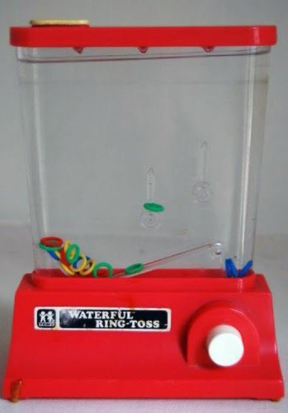
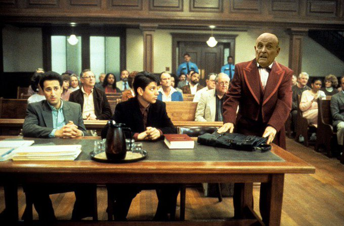
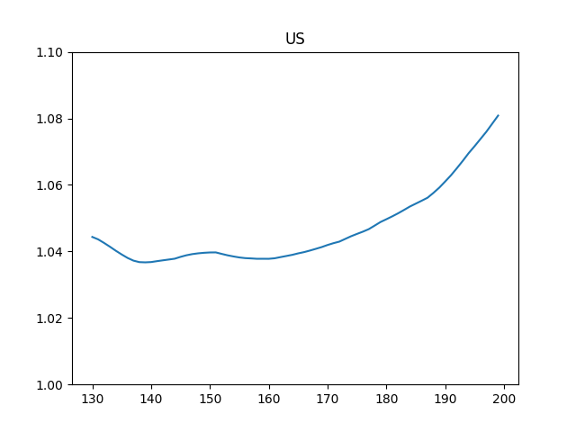
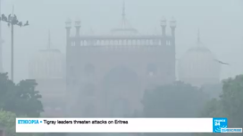

# Week 47

"'Normal Christmas out of the question,' says Trudeau as Toronto
imposes lockdown

Prime Minister Justin Trudeau said on Friday that Canada's hospital
system could be overwhelmed by a possible quadrupling of new Covid-19
cases by year end"

---

"The Labour Party’s Membership Is in Revolt Against Keir Starmer. Last
night, the grassroots campaign to reinstate Jeremy Corbyn’s whip
reached fever pitch"

---

Pino Shamlou - Connaction \#music

[Link](https://youtu.be/GjtaKU7GpPU)

---

[Old is Good](../../2020/11/bedazzled-by-tech.html#oilwater), given the
half-baked state of our transition today.

"But solutions like Medicare-for-All sound too old. Like last-century old".

---

WaPo: "Apple is lobbying against a bill aimed at stopping forced labor in
China"

---

"Brazil’s Recent Election Was a Blow to Jair Bolsonaro"

---

Jacobin: "Meatpacking Bosses in Iowa Allegedly Organized a Betting Pool
on How Many Workers Would Get COVID"

---

"A series of high-profile defaults involving state-owned enterprises in
China — normally a safe pick for investors — have jolted the credit
market and rattled investors"

---

"@juliaoftoronto

The airline industry says flying is almost zero risk in #covid19.. The
researchers studying the spread of the disease on airplanes say
something different"

[Link](https://twitter.com/juliaoftoronto/status/1327267117524193282)

---

<blockquote class="twitter-tweet">
We welcome <a href="https://twitter.com/10DowningStreet?ref_src=twsrc%5Etfw">@10DowningStreet</a> plan for a <a href="https://twitter.com/hashtag/GreenIndustrialRevolution?src=hash&amp;ref_src=twsrc%5Etfw">#GreenIndustrialRevolution</a> and note its support for <a href="https://twitter.com/hashtag/hydrogen?src=hash&amp;ref_src=twsrc%5Etfw">#hydrogen</a> and for aerospace to deliver net-zero emission aviation through <a href="https://twitter.com/hashtag/JetZero?src=hash&amp;ref_src=twsrc%5Etfw">#JetZero</a>. It&#39;s time to turn ambition into reality and make it happen together <a href="https://twitter.com/hashtag/ZEROe?src=hash&amp;ref_src=twsrc%5Etfw">#ZEROe</a> <a href="https://twitter.com/hashtag/SustainableAviation?src=hash&amp;ref_src=twsrc%5Etfw">#SustainableAviation</a> <a href="https://t.co/xMVXnQ1Qz6">https://t.co/xMVXnQ1Qz6</a>
&mdash; Guillaume Faury (@GuillaumeFaury) <a href="https://twitter.com/GuillaumeFaury/status/1329155089437761541?ref_src=twsrc%5Etfw">November 18, 2020</a></blockquote> 

---

<blockquote class="twitter-tweet">
Sure, sex is great, but have you ever watched Donald lose Georgia TWICE?
&mdash; Randi Mayem Singer (@rmayemsinger) <a href="https://twitter.com/rmayemsinger/status/1329591416176091136?ref_src=twsrc%5Etfw">November 20, 2020</a></blockquote> 

---

Obviously a country who has a say on the passage on a rule of law
measure which could hurt it, would not give ok to the said rule of
measure. But I m sure the proposers knew that already #eu #poland

---

<blockquote class="twitter-tweet">
🇫🇮 <a href="https://twitter.com/hashtag/Finland?src=hash&amp;ref_src=twsrc%5Etfw">#Finland</a> has unveiled a national <a href="https://twitter.com/hashtag/roadmap?src=hash&amp;ref_src=twsrc%5Etfw">#roadmap</a> on <a href="https://twitter.com/hashtag/hydrogen?src=hash&amp;ref_src=twsrc%5Etfw">#hydrogen</a>. 👏This one focuses on the prospects for low-carbon <a href="https://twitter.com/hashtag/hydrogen?src=hash&amp;ref_src=twsrc%5Etfw">#hydrogen</a> production, the use of <a href="https://twitter.com/hashtag/hydrogen?src=hash&amp;ref_src=twsrc%5Etfw">#hydrogen</a> for chemicals and 🟢 fuels, as well as storage 🚌.<a href="https://twitter.com/hashtag/HydrogenNow?src=hash&amp;ref_src=twsrc%5Etfw">#HydrogenNow</a> <a href="https://twitter.com/FinlandinEU?ref_src=twsrc%5Etfw">@FinlandinEU</a> <a href="https://twitter.com/HydrogenHub?ref_src=twsrc%5Etfw">@HydrogenHub</a>   <a href="https://t.co/pSlTjywRbU">https://t.co/pSlTjywRbU</a>
&mdash; Hydrogen Europe (@H2Europe) <a href="https://twitter.com/H2Europe/status/1329703564566880258?ref_src=twsrc%5Etfw">November 20, 2020</a></blockquote> 

---

Chris Joss - Highway 75

[Link](https://youtu.be/zHJMT0J_Y10)

---

Ol' Dirty Bastard - Sussudio \#music

[Link](https://youtu.be/Ig4VrZifa3g)

---

"@Super70sSports

My generation’s standards for entertainment were so much lower than our kids’:

'Daaaaad, I’m bored.'

'Well, here then, take this piece of shit and I’ll see you in nine hours.'"

---

"@KlasfeldReports

A Trump-appointed judge just dismissed what he called a 'creative'
lawsuit asking to block certification of the vote in Georgia, in what
an Assistant AG called a bid to roll back the clock to Jim Crow"

---

"@gabriel_zucman

Tax evasion, tax avoidance, tax competition are not laws of nature,
they are policy choices"

---

WSJ: "BuzzFeed to Acquire HuffPost in Stock Deal With Verizon Media"

---

"@DavidLarter

BREAKING: The Secretary of the Navy announces intention to create a
new numbered fleet in the Indian Ocean, U.S. 1st Fleet"

---

"@hazergroupltd

Engineering and electronics brand, @BoschGlobal is about to start
trials of a hydrogen-fed fuel-cell powertrain they have
developed. Production is set to begin in 2022–2023"

---

Leadership. You gotta fill in the blanks, nam sayin? Do the deed. Dot
the i's... Do the work ordinary citizens dont want to do (and cant
effin do, lets be honest).

---

Prices fell afterwards, especially in telecom.

"2011 social protests and the fall of holding group tycoons. After mass
demonstrations in 2011 that brought hundreds of thousands of Israelis
onto the streets countrywide — it was estimated at the time that the
ten biggest business groups controlled 41 percent of the market value
of public companies — the Knesset passed the Law for Promotion of
Competition and Reduction of Concentration in 2013"

[Link](https://www.timesofisrael.com/monopoly-nation-how-a-handful-of-firms-control-prices-hold-israelis-to-ransom/)

---

"2011 Israeli social justice protests ... [let to r]evelations of
funding from specific left-wing individuals and organizations like
S. Daniel Abraham and the New Israel Fund. Maariv journalist Kalman
Libeskind claimed that the spontaneous protests had actually been
three months in the planning by Stan Greenberg and orchestrated by
left-wing organizations and the National Left"

[Link](https://en.wikipedia.org/wiki/2011_Israeli_social_justice_protests)

---

I thought more capitalism would get you better service, it was a
"no-brainer".

Dayen, *Monopolized*: "In 2014, Jet Blue decided it would zig while
the industry zagged. CEO David Barger declared that his company would
be the quality airline, with roomy, comfortable seating, free checked
bags, and fast Wi-Fi. For Barger, the announcement aligned JetBlue
with its founding principles: he had been there from the beginning,
helping design the company’s 'service-oriented' culture. 'I think you
can be profitable without gouging the traveling public,' Barger told a
local paper.

But stock analysts hated the idea. They beat up Barger for being
'overly concerned' with customers rather than shareholder returns. And
they eventually ran him out of town. Two months after Barger stepped
down, JetBlue rolled back the legroom and raised fees on baggage and
Wi-Fi. Analysts parceled out the 'improvements' to the penny. Charging
a baggage check fee would add 26¢ a share; charging for Wi-Fi would
add another 9¢. Springing fees on customers 'might hurt JetBlue in the
media,' wrote Cowen and Co. analyst Helane Becker in a research note,
but 'the revenue benefit to the company would probably trump any
customer push back.'

The episode reflects how, after government deregulation, Wall Street
has taken control of the airline industry and demanded oligopolistic
conformity"

---

TP is Trump-Pence oddly enough

---

Maybe after January Trump will run around DC shocking random people
with his Cornolio act.

"TP for your bunghole!"

---

Decathlon sells "ponchos" but their prods are "chique wilderness",
they dont work well. It's fine, I have my fucking 3 Eur PVC raincoat
now, and am very happy with it.

---

Bought a raincoat for 3 Eur from a store that sells items to workers
in bulk. Literally a fucking PVC material, single piece, w some
buttons on front, that's it. I could not find a simple fucking
raincoat at the stores that are in shiny malls. 

---

First blogged abt mayavi 12 years ago apparently.. Damn it's been a long time

---

Who is doing this scene then? Mcanenenany?

---

From the movie My Cousin Gulliani

via @Acyn

---

"@GunnelsWarren

The real looting in America is the Walton family becoming $63 billion
richer during a pandemic, while paying wages so low that 14,541 of
their workers in 9 states need food stamps - all subsidized by
U.S. taxpayers. Yes. The Walton family is the real welfare queen in
America"

---

Pompeo stayed loyal to Trump, even with this election stuff, then
after the election loss he made a huge intl trip visiting places in a
way that would appeal the evangelicals. F24 is suggesting he is
planning a 2024 run. He can get the one-time Trump voters and
religious right.

---

Crafty little guy! 🦉 🦉 🦉 

<blockquote class="twitter-tweet">
They found a small owl inside of this year’s Rockefeller Christmas tree, he hitched a ride all the way to NYC and is now being treated and cared for at a wildlife rehab facility. <a href="https://t.co/f4PkBm6MGo">pic.twitter.com/f4PkBm6MGo</a>
&mdash; Allison Esposito Medina (@techladyallison) <a href="https://twitter.com/techladyallison/status/1329133725779628033?ref_src=twsrc%5Etfw">November 18, 2020</a></blockquote> 

---

<blockquote class="twitter-tweet">
<a href="https://twitter.com/gencellenergy?ref_src=twsrc%5Etfw">@gencellenergy</a> is happy to announce that the company has successfully completed an IPO and joined the Tel Aviv Stock Exchange. Read our press release for more details: <a href="https://t.co/1vYPofGNvP">https://t.co/1vYPofGNvP</a><a href="https://twitter.com/hashtag/FuelCells?src=hash&amp;ref_src=twsrc%5Etfw">#FuelCells</a> <a href="https://twitter.com/hashtag/BackupPower?src=hash&amp;ref_src=twsrc%5Etfw">#BackupPower</a> <a href="https://twitter.com/hashtag/SayNoToDiesel?src=hash&amp;ref_src=twsrc%5Etfw">#SayNoToDiesel</a>
&mdash; GenCell Energy (@gencellenergy) <a href="https://twitter.com/gencellenergy/status/1329103373883367425?ref_src=twsrc%5Etfw">November 18, 2020</a></blockquote> 

---

Duke Heitger - Swingin' on the Famous Door \#music

[Link](https://youtu.be/ahl9r1Ho6B0)

---

"@AlecMacGillis

What happens when people stop subscribing to print newspapers and
everyone buys everything online: 'Corrugated cardboard makes up as
much as a third of the paper entering recycling plants from homes in
big metro areas, up from 5% a few years ago.'"

---

"@LoriShemek

200 years ago, the average American ate only 2 lbs. of sugar a
year. Today, the average American consumes 156 lbs of sugar in one
year. This is equal to 3 pounds a week"

---

Mayavi.. say hello to daddy

---

Ok... Too many `glutSolidSphere` calls slows things down.. \#opengl

---

Russian media is busy with an idea that dipshits in Tiggerland became
Britain's playthings in a Great Game Part II (albeit with less "great"
actors such as the UK). They are being used to bother / disturb the
Russia, EU, Greece, even Cyprus for the fear that if things calmed
down there the local UK bases would be called into
question. Interesting theory.

---

"@davidalanlevine

This is an important message that bears repeating. Politicizing
\#electionsecurity makes it harder to secure our elections and more
difficult to counter foreign efforts to interfere in them"

---

He did base jumping too apparently, which is "an acronym for
[b]uilding, [a]ntenna, [s]pan and [e]arth, the four categories of
object from which people jump"

---

Fantastic wing design. 

<blockquote class="twitter-tweet">
[<a href="https://twitter.com/hashtag/Tristesse?src=hash&amp;ref_src=twsrc%5Etfw">#Tristesse</a>] 17 novembre 2020 • Disparition à 36 ans de Vince Reffet, l’« homme volant » français, dans un accident lors d’un entraînement - trois de ses vols les plus impressionnants © vidéo <a href="https://twitter.com/lobs?ref_src=twsrc%5Etfw">@lobs</a> <a href="https://twitter.com/hashtag/VincentReffet?src=hash&amp;ref_src=twsrc%5Etfw">#VincentReffet</a> <a href="https://twitter.com/hashtag/avgeek?src=hash&amp;ref_src=twsrc%5Etfw">#avgeek</a> <a href="https://t.co/EOJbVlqViC">pic.twitter.com/EOJbVlqViC</a>
&mdash; Aéro-Club de France (@AeroclubFrance) <a href="https://twitter.com/AeroclubFrance/status/1328799683817459713?ref_src=twsrc%5Etfw">November 17, 2020</a></blockquote> 

---

RIP

"'Jetman' Vincent Reffet dies in training accident"

[Link](https://www.theguardian.com/world/2020/nov/17/dubai-jetman-vincent-reffet-dies-in-training-accident)

---

<blockquote class="twitter-tweet">
Good advice. <a href="https://t.co/w849mScJhj">pic.twitter.com/w849mScJhj</a>
&mdash; Darwin Award 🔞 (@AwardsDarwin) <a href="https://twitter.com/AwardsDarwin/status/1328959539933220864?ref_src=twsrc%5Etfw">November 18, 2020</a></blockquote> 

---

<blockquote class="twitter-tweet">
She showed up <a href="https://t.co/YkgmdBHL5i">https://t.co/YkgmdBHL5i</a>
&mdash; David Dayen (@ddayen) <a href="https://twitter.com/ddayen/status/1328777896526168064?ref_src=twsrc%5Etfw">November 17, 2020</a></blockquote> 

---

A lot of politics in this song... 

"♪♬ Now I'm stocking shirts in the Wal-Mart store ♪

♪♬ Just like the ones we made before

♪ 'Cept this one came from Singapore

♬ I guess we can't make it here anymore

♪♬ Should I hate a people for the shade of their skin

♬ Or the shape of their eyes or the shape I'm in

♪♬ Should I hate 'em for having our jobs today

♪♬ No I hate the men sent the jobs away"

---

James McMurtry - We Can't Make It Here

[Link](https://youtu.be/Szclr2caFG8?t=210)

---

Jacobin: "Joe Biden Is Freezing Bernie Sanders and Elizabeth Warren Out of His Cabinet"

---

Warren endorser

"Jaime Harrison Is Likely to Be the Next DNC Chair"

---

<iframe width="340"  src="https://www.youtube.com/embed/DRR4uBb8Am4" frameborder="0" allow="accelerometer; autoplay; clipboard-write; encrypted-media; gyroscope; picture-in-picture" allowfullscreen></iframe>

---

She sounds like a closer.

AOC: "But we also learned that progressive policies do not hurt
candidates. Every single candidate that co-sponsored Medicare for All
in a swing district kept their seat.  ... If you’re not door-knocking,
if you’re not on the internet, if your main points of reliance are TV
and mail, then you’re not running a campaign on all cylinders. I just
don’t see how anyone could be making ideological claims when they
didn’t run a full-fledged campaign"

[Link](https://www.nytimes.com/2020/11/07/us/politics/aoc-biden-progressives.html)

---

EU is funding this too? 

"Space@Sea (@SpaceAtSea) [is a] @EU_H2020 funded research project
focusing on multi-use floating islands"

[Link](https://mobile.twitter.com/SpaceAtSea)

---

"@Lecocq_dom

World record drone flights. So a 6-liter tank of liquid \#hydrogen
beats 16 liters of gasoline by nearly 20 percent"

[Link](https://twitter.com/Lecocq_dom/status/1328597954089902081)

---

<blockquote class="twitter-tweet">
The hydrogen industry is being urged to work with the Australian federal government and its international partners on ambitious plans for an export boom in lower emissions technology.  Read more here: <a href="https://t.co/dn77XDRoP9">https://t.co/dn77XDRoP9</a><a href="https://twitter.com/hashtag/hazergroupltd?src=hash&amp;ref_src=twsrc%5Etfw">#hazergroupltd</a> <a href="https://twitter.com/hashtag/hydrogen?src=hash&amp;ref_src=twsrc%5Etfw">#hydrogen</a> <a href="https://twitter.com/hashtag/australia?src=hash&amp;ref_src=twsrc%5Etfw">#australia</a> <a href="https://twitter.com/hashtag/cleantech?src=hash&amp;ref_src=twsrc%5Etfw">#cleantech</a> <a href="https://t.co/oiKRD7YGVU">pic.twitter.com/oiKRD7YGVU</a>
&mdash; Hazer Group Ltd (@hazergroupltd) <a href="https://twitter.com/hazergroupltd/status/1328910946044157952?ref_src=twsrc%5Etfw">November 18, 2020</a></blockquote> 

---

"@katienotopoulos

Twitter wants to be Instagram (fleets/stories)

Instagram wants to be TikTok (Reels redesign)

TikTok wants to be, uh, not banned

Facebook wants to be Reddit (Groups/subs)

Substack wants to be Medium (Medium wants to be whatever it wasn't 18 months ago)

what else?"

---

(Updated my act)

---

Me and Heather like to eat granola

---

Kaleefornia 👍 

"California is trying to jump-start the hydrogen economy"

[Link](https://www.sanjuandailystar.com/post/california-is-trying-to-jump-start-the-hydrogen-economy)

---

"@PhilipMichaels

This Senate hearing looks like the tale of a marooned lighthouse
keeper and the robot butler he built to stave off loneliness"

---

"@erikbryn

Why has inequality grown? Hubmer, Krusell & Smith have an answer: 'We
find that the significant drop in tax progressivity starting in the
late 1970s is the most important driver of the increase in wealth
inequality since then'"

[Link](https://twitter.com/erikbryn/status/1328486808515035138)

---

$R$ is increasing for US, and it was never below 1. Code [here](../../2020/02/corona.html#Rt).

---

Undermining trust in democracy is not cool. As with many other things
this is a leadership fail.

"Poll: 70 percent of Republicans don't think the election was free and fair"

---

"Biden confirmed that Article 5 of the Japan-U.S. Security Treaty will
be applied to the defense of Okinawa Prefecture and the Senkaku
Islands. Article 5 stipulates that the U.S. is obliged to defend Japan
should its territories come under attack. ... Chinese vessels have
been sighted near the islands"

---

One of its designers call the Intel 386 instruction set as
"baroque" 😆

---

Politics is rough ...

--- 

It's cold

---

"In two new studies, researchers have used microwaves to produce
hydrogen from plastic waste and water, respectively. ... 

In the new process, the researchers pulverize plastic in a kitchen
blender, mix it with a catalyst made of iron oxide and aluminum oxide,
and then zap it with microwaves at 1000 Watts. The microwaves trigger
the catalyst particles to strip over 97 percent of the hydrogen from
plastic in seconds ...

[For water the] technique involves blasting a ceramic oxide with
microwaves, which removes oxygen from the material and increases its
electrical conductivity. The activated ceramic material then
spontaneously reacts with water that is passed over it, forming
hydrogen and oxygen, which reoxygenates the ceramic so it can be
reused.

[Link](https://www.anthropocenemagazine.org/2020/11/microwave-magic-can-give-clean-hydrogen-fuel/)

---

Marketwatch: "Cummins, Navistar to develop hydrogen fuel cell-powered heavy truck"

[Link](https://www.marketwatch.com/story/cummins-navistar-to-develop-hydrogen-fuel-cell-powered-heavy-truck-2020-11-11)

---

Tom Jones - Black Betty \#music

[Link](https://youtu.be/Oc8AN1-P3GE?t=26)

---

"The creator of the Pfizer-BioNTech vaccine says life could return to
normal by next winter"

---

<blockquote class="twitter-tweet">
2020... <a href="https://t.co/1YtH8Da5lf">pic.twitter.com/1YtH8Da5lf</a>
&mdash; Rex Chapman🏇🏼 (@RexChapman) <a href="https://twitter.com/RexChapman/status/1328477415295823872?ref_src=twsrc%5Etfw">November 16, 2020</a></blockquote> 

---

LOHC+ as a H2 carrier is no newsflash for govs who know what's going
on.. I've seen docs out of DE, they are all over this shit. EU in
general too. That's what you want... Knowledgable people toiling away
in obscurity and preparing.

---

"@HCTrudo

People need to stop using the word 'progressives' incorrectly. What
alternate universe has McAuliffe made 'inroads' with progressives"

[Link](https://mobile.twitter.com/HCTrudo/status/1328150020999290880)

---

😆

"How real-time geolocation data could help your train run on time"

---

[CNBC](https://www.cnbc.com/2020/11/01/how-salt-caverns-may-trigger-11-trillion-hydrogen-energy-boom-.html):
"An $11 trillion global hydrogen energy boom is coming"

---

There are a handful of new covid cases in South OZ and the PM is
having a press conference about it

---

"President-elect Joe Biden’s transition team has recruited a who’s-who
of Wall Street critics to help launch his administration, the latest
indication that the days of light-touch bank regulation under
President Donald Trump are coming to an end"

[Link](https://www.politico.com/amp/news/2020/11/12/biden-transition-wall-street-crackdown-436366)

---

"@nealkwatra

So tired of hearing Pfizer didn’t get money from the Fed’s when they
got a 1.95 Billion [dollar] 'advance purchase' agreement. Soooo, yes
they damn well did get federal funding and because they had $2bn of
free cash they could go nuts on R&D knowing they already pre-sold 100m
doses"

---

<blockquote class="twitter-tweet">
Toyota Teams Up with Iwatani to Create 7 New <a href="https://twitter.com/hashtag/Hydrogen?src=hash&amp;ref_src=twsrc%5Etfw">#Hydrogen</a> Fueling Stations in California - <a href="https://t.co/k6buLdHBwR">https://t.co/k6buLdHBwR</a> <a href="https://t.co/7TQdTIxFr1">pic.twitter.com/7TQdTIxFr1</a>
&mdash; Hydro Kevin (@hydrokevin) <a href="https://twitter.com/hydrokevin/status/1328007657064521728?ref_src=twsrc%5Etfw">November 15, 2020</a></blockquote> 

---

It feels like every DIY tuber uses the same goofy background music
while they make stuff.

---

Obviously cover of another famous song

[Link](https://www.youtube.com/watch?v=Et3AJIry4iI)

---

Hugo Strasser - Black Night \#music

[Link](https://youtu.be/SLpMgUGeDzY)

---

E! News: "Influencer Dies Of COVID-19 After Telling Followers It
'Doesn't Exist'"

---

Not sure whether RCEP is good or bad for the respective middle-classes
of all those RCEP countries, but the exclusion of US is strategically
significant.

Perfect timing too with US being in a funk.

US of course pulled out of the TPP with Trump in 2017.

---

US excluded!

"RCEP: Asia-Pacific nations sign world’s biggest trade pact. The
China-backed RCEP deal excludes the US and will account for 30 percent
of the world’s economy and population"

[Link](https://www.aljazeera.com/economy/2020/11/15/rcep-15-asia-pacific-nations-set-worlds-biggest-trade-pact)

---

I can see how some HKers can fall into "expat nationalism". HK folk
aren't exactly expats (from the mainland) in the usual sense but some
could see themselves that way. And a lot of expats overseas who "left
the country and always plan to come back one day" do confuse their
nostalgia with analysis, since they dont live in the "home country"
either, they do not see all that's going on inside, so develop a blind
romantic attachment. Could be the issue here.

---

People dont like Jackie Chan anymore in Hong Kong? I was wondering abt
that, JC's bio sounded like he could devolve into a Ch nationalism,
and apparently he did.

[Link](https://youtu.be/3d_KzGfo2lU?t=80)

---

"Trump [has] largely achieved their goal of choking off the flow of
unauthorized immigrants into the United States — especially families
from Central America, many of whom come with the intention of
requesting asylum. ....

But the coronavirus has given the U.S. its most robust tool yet for
repelling asylum-seekers. An order signed by the U.S. Centers for
Disease Control and Prevention in March ...  prohibited the entry of
unauthorized immigrants from Mexico in the name of public health. The
order gave border agents the authority to simply expel them. In the
months since, 200,000 migrants have been expelled, either to Mexico or
to their home countries. None have been given the opportunity to
request asylum or explain why they believed they would be persecuted
if they returned to their homelands.

The combination of international agreements, health concerns and new
tactics has effectively shut the border. So far, none of the elements
in the administration’s new 'waterproof fabric' have been overturned
in court or become the subject of public uproar, as family separation
did in 2018"

[Link](https://www.propublica.org/article/trump-got-what-he-wanted-at-the-border-would-biden-undo-it)

---

Theo James is a good lead. *How It Ends* was a perfectly watchable
movie.

---

That's wild.

I can see how such a carrier would be sub (!) optimal, every ounce of
air in a sub is bought with a certain weight penalty; but I appreciate
the attempt. Creative.

"Underwater Aircraft Carriers: Imperial Japan’s Secret Weapon"

[Link](https://youtu.be/gxyk84t4Q8w?t=486)

---

Got a solution for traffic fumes...

Dont know what to do abt the f-ing farmers.

"New Delhi’s air pollution typically worsens in October and November
due to farmers burning off stubble in surrounding states, traffic
fumes"

[Link](https://www.aljazeera.com/news/2020/11/5/indias-capital-new-delhi-suffers-most-toxic-air-in-a-year)

---

New Delhi, is covered with smoke, just saw on France 24

---

"@business

America’s rising death tolls are a lagging indicator of infections
from September and early October. The worst may be yet to come"

---

BBC: "the government is set to announce it will bring 2040's ban [on
fossil fuel cars] forward by a decade"

---

"@Bern4Bern

@BernieSanders to @chrislhayes just now

'We need an alternative media'"

---

Bill Clinton was the first black President? I thought that was
Obama...

Then I guess Obama was the second first black President

😆 😆 😆

I killed it with that one. Oh yeah.

---

"@DavidKlion

This is purely anecdotal, and I don't want to jinx it, but I don't
think I've ever in my life gone this long without getting a cold. I
haven't been sick once this year. Maybe we should have been wearing
masks all along"

---

K.. maybe the new *Kingsman* too.

---

Yes that is a cap with Volkswagen logo. Bcz he was "Van Wilder"

---

Ryan Reynolds. This guy.

---

Nearly all upcoming action movie trailers suck. Even the Ryan Reynolds
movie looks better.

---

