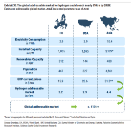
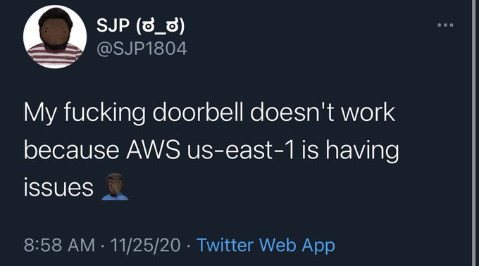

# Week 48

<blockquote class="twitter-tweet">
What if ferries only emitted water? Introducing <a href="https://twitter.com/hashtag/EuropaSeaways?src=hash&amp;ref_src=twsrc%5Etfw">#EuropaSeaways</a>: we have partnered with <a href="https://twitter.com/abb?ref_src=twsrc%5Etfw">@ABB</a> @BallardPowerSystems, @HexagonPurus, <a href="https://twitter.com/lloydsregister?ref_src=twsrc%5Etfw">@lloydsregister</a> , <a href="https://twitter.com/KNUDEHANSENAS?ref_src=twsrc%5Etfw">@KNUDEHANSENAS</a> <a href="https://twitter.com/Orsted?ref_src=twsrc%5Etfw">@Orsted</a> and @DanishShipFinance to develop a 100% hydrogen-powered ferry <a href="https://t.co/ZbjDPpzos3">https://t.co/ZbjDPpzos3</a><a href="https://twitter.com/hashtag/dfds?src=hash&amp;ref_src=twsrc%5Etfw">#dfds</a> <a href="https://twitter.com/hashtag/hydrogene?src=hash&amp;ref_src=twsrc%5Etfw">#hydrogene</a> <a href="https://t.co/Hu2wj7yJld">pic.twitter.com/Hu2wj7yJld</a>
&mdash; DFDS (@DFDSGroup) <a href="https://twitter.com/DFDSGroup/status/1331907413272825857?ref_src=twsrc%5Etfw">November 26, 2020</a></blockquote> 

---

They wouldnt do it for that, no. U dont eff with an US admin that
way. If they did it, they probably did it to help the good cop / bad
cop routine by providing the bad cop part of the act.

"Israel killed the Iranian nuclear scientist to make it harder for the
upcoming Biden admin to make piece with Iran"

---

Another seminar on my fav topic. Bring em on!

---

"@CoriBush

Taxes paid by billionaires have decreased 79% since 1980. Amazon paid
1.2% in taxes last year"

---

"@RBReich

Never forget that Big Pharma has raised the price of insulin by over
1200% since the 1990s and now one in four people with diabetes are
forced to ration insulin in order to survive"

---

Why so many Rep pols showed loyalty to Trump election claims? Bcz they
knew claims wld go nowhere, and there are still bunch of his followers
in their districts, so then the question is when the shitshow ends,
what do you want those ppl remember you by? As the jagoff who knifed
him, or sorta stood by, repeated some bogus shit along with many
others, than "celebrated democracy" after it was all over.

---

<blockquote class="twitter-tweet">
We&#39;re literally Civilized to Death. <a href="https://twitter.com/hashtag/c2d?src=hash&amp;ref_src=twsrc%5Etfw">#c2d</a> <a href="https://t.co/b01fMpkGS1">https://t.co/b01fMpkGS1</a>
&mdash; Christopher Ryan (@ThatChrisRyan) <a href="https://twitter.com/ThatChrisRyan/status/1329538673902317571?ref_src=twsrc%5Etfw">November 19, 2020</a></blockquote> 

---

Captain Cook brought pickled cabbage with him to his voyages, he'd
have tons of this stuff, and eat it. His crew would turn their nose at
his cabbage, and he'd laugh at them, bcz he knew it kept sickness at
bay.

---

"@KFILE

FLASHBACK: In 2018, President Trump attacked Carrots the turkey for
refusing to concede he had lost the vote on the White House turkey
pardon contest"

[Link](https://twitter.com/KFILE/status/1330906046223757312)

---

I did eat turkey yesterday oddly enough. 

---

Laurent Garnier - The Man With The Red Face \#music

[Link](https://youtu.be/J5bBCaUnPq4)

---

@H2Europe

\#Copenhagen Infrastructure Partners and #Hydrogen Renewables Australia
have decided to cooperate to develop the 5 GW Murchison \#Renewable
\#Hydrogen Project to be located near #Kalbarri in Western #Australia.
🇦🇺 👏

---

<blockquote class="twitter-tweet">
As we reflect on the <a href="https://twitter.com/hashtag/Thanksgiving?src=hash&amp;ref_src=twsrc%5Etfw">#Thanksgiving</a> Holiday this year, looking back on a challenging 2020 &amp; ahead to opportunities in 2021, we have a lot to be thankful for in our habitable corner of the universe. Good planets are hard to come by, take care of it &amp; each other. Happy Holidays! <a href="https://t.co/eWhTvaLokV">pic.twitter.com/eWhTvaLokV</a>
&mdash; KSAT (@KSAT_Kongsberg) <a href="https://twitter.com/KSAT_Kongsberg/status/1331957882028519424?ref_src=twsrc%5Etfw">November 26, 2020</a></blockquote> 

---

"South Korea's POSCO plans to eventually halt carbon emissions by
switching to a hydrogen-based steelmaking process from 2021, company
officials said on Friday.  POSCO, the world's fourth-largest
steelmaker, accounts for 10 percent of the country's total carbon
emissions"

[Link](https://www.reuters.com/article/posco-carbon-idUSSEO205120091127)

---

"S Korea hankers for Aussie hydrogen... Energy-hungry South Korea could
not be more confident about Australia’s future as a giant exporter of
green [H2]"

[Link](https://amp-theaustralian-com-au.cdn.ampproject.org/c/s/amp.theaustralian.com.au/business/mining-energy/s-korea-hankers-for-aussie-hydrogen/news-story/390e7ae7f23bcfe1b4cb8c767ee626c8)

---

Vampire squid or not, they would surely know where their muuneeee comes
from

"@GreenerGulf

Goldman Sachs Research forecasts $10Tn worth of addressable market for
Green Hydrogen by 2050"

---

Dam YouTube is trying really hard with these ads..  Some countries
regulate \# of ads on TV no? Time to apply same logic here?

---

Space scifi is kind of naval submarine scifi. The ships are floating,
can't just "step outside", etc. Living space size inside the ships are
different of course.

---

🤣 🤣 🤣 🤣

---

---

<blockquote class="twitter-tweet">
Some part of AWS is down and apparently it’s screwing up the Roomba.
&mdash; Matthew Green (@matthew_d_green) <a href="https://twitter.com/matthew_d_green/status/1331701425282437124?ref_src=twsrc%5Etfw">November 25, 2020</a></blockquote> 

---

"@hazergroupltd

An approval in principle has been granted for a 20,000-m3 liquefied
hydrogen carrier developed by South Korea’s HHI Group’s Korea
Shipbuilding & Offshore Engineering, Hyundai Mipo Dockyard and
shipping and logistics company Hyundai Glovis"

[Link](http://ow.ly/ULmP50Cu5u6)

---

Daily Poster: "With millions of Americans trapped at home to protect
themselves from a deadly pandemic during the holiday season, the
Internet is one of the only conduits connecting them to friends,
family and the outside world. Now, Comcast, one of the monopoly
corporations that controls the conduit, is extending its fees on
bandwidth usage to all 39 states where it operates — even as the
company has received hundreds of millions of dollars of public
subsidies and new tax breaks"

[Link](https://www.dailyposter.com/p/comcasts-new-data-fees-follow-1-billion)

---

"@bartbiebuyck ... Industry commits to put 100.000 Hydrogen fuel cell trucks on the
road and build more than 1000 HRS by 2030!"

[Link](https://mobile.twitter.com/bartbiebuyck/status/1330918994128367624)

---

I knew there was something behind this interest, other than the art
piece itself. There is nothing special about the piece really. 

"Before its theft [in 1911], the 'Mona Lisa' was not widely known
outside the art world. Leonardo da Vinci painted it in 1507, but it
wasn't until the 1860s that critics began to hail it as a masterwork
of Renaissance painting. And that judgment didn't filter outside a
thin slice of French intelligentsia. ...

After the Louvre announced the theft, newspapers all over the world
ran headlines about the missing masterpiece.

'60 Detectives Seek Stolen 'Mona Lisa,' French Public Indignant,' the
New York Times declared. The heist had become something of a national
scandal.

'In France, there was a great deal of concern that American
millionaires were buying up the legacy of France — the best
paintings,' Dorothy Hoobler says. At one point, American tycoon and
art lover J.P. Morgan was suspected of commissioning the theft. Pablo
Picasso was also considered a suspect, and was questioned.

And as tensions were escalating between France and Germany ahead of
World War I, 'there were people who thought the Kaiser was behind it,'
Hoobler says"

[Link](https://www.npr.org/2011/07/30/138800110/the-theft-that-made-the-mona-lisa-a-masterpiece)

---

<blockquote class="twitter-tweet">
Fracking is still bad, by the way.
&mdash; Cori Bush (@CoriBush) <a href="https://twitter.com/CoriBush/status/1331374982459494404?ref_src=twsrc%5Etfw">November 24, 2020</a></blockquote> 

---

Democracy worked well. 

---

"Deutsche Bahn, Siemens launch hydrogen trains trial"

[Link](https://www.dw.com/en/deutsche-bahn-siemens-launch-hydrogen-trains-trial/a-55716107?maca=en-rss-en-all-1573-rdf)

---

Wrote a `Makefile`. Been a while. 

---

<blockquote class="twitter-tweet">
Who did this... <a href="https://t.co/wn4OFUUcue">pic.twitter.com/wn4OFUUcue</a>
&mdash; Robert Mahon (@RobertCMahon) <a href="https://twitter.com/RobertCMahon/status/1331104895613759488?ref_src=twsrc%5Etfw">November 24, 2020</a></blockquote> 

---

The "public" was for the Iraq War, 2003? There's clearly a wealth of
untapped wisdom here.. Let's ask them everything 🤨

---

"@samstein

One thing that I will legitimately appreciate during the Biden years:
the diminished likelihood of news breaking when you’re having dinner
with your kids and trying to get them bathed and in bed"

---

"Jim Ratcliffe, Britain’s richest man, is joining forces with Hyundai
Motor Co. in a bid to give hydrogen fuel cell vehicles the boost they
need to become more mainstream.

Ratcliffe’s Ineos Group will explore opportunities to produce and
supply hydrogen to Hyundai, which has been making fuel cell vehicles
in low volumes since 2013. Ratcliffe may also use Hyundai’s fuel cell
system in the Grenadier, the Land Rover-like sport utility vehicle
Ineos plans to bring to market next year.

Makers of cars and chemicals are finding common ground in their
pursuit of hydrogen projects. Targets are being set globally to phase
out the combustion engine and decarbonize industrial
production. Ineos, which makes 300,000 tons of hydrogen annually,
could play an instrumental role in helping set up the infrastructure
Hyundai needs for models like the Nexo SUV to catch on in Europe"

[Link](https://www.bloomberg.com/news/articles/2020-11-23/u-k-s-richest-man-partners-with-hyundai-to-make-hydrogen-happen)

---

<blockquote class="twitter-tweet">
I never knew one person could lose one election so many times.
&mdash; Baratunde (@baratunde) <a href="https://twitter.com/baratunde/status/1331396103258796034?ref_src=twsrc%5Etfw">November 25, 2020</a></blockquote> 

---

"@H2Haul

A coalition statement signed by 62 companies was unveiled at the
\#EUHydrogenWeek! 

[Link](https://bit.ly/2Ht3Hhz)

---

It's still hilarious to me as an observation that our vacation
activities, "rest", "fun" used to be simply "regular life" for the
longest span of our lives, as hunter-gatherers.

---

<blockquote class="twitter-tweet">
Perfectly optimal system where you can get $100 billion wealthier in a few months during a pandemic <a href="https://t.co/kcImewx0MN">pic.twitter.com/kcImewx0MN</a>
&mdash; Gabriel Zucman (@gabriel_zucman) <a href="https://twitter.com/gabriel_zucman/status/1331403968296062976?ref_src=twsrc%5Etfw">November 25, 2020</a></blockquote> 

---

"As the the Biden transition picks up steam, what started as early
sighs of relief with Klain’s appointment has ballooned into a
pronounced endorsement of Biden’s initial selections to lead some of
the highest-profile positions in government, with progressives giving
the president-elect a hat tip on the delicate balancing act of
appealing to both wings early on"

[Link](https://www.thedailybeast.com/progressives-cant-find-anyone-in-bidens-cabinet-to-be-mad-aboutyet)

---

<blockquote class="twitter-tweet">
Silky smooth with the ultimate window seat. <a href="https://t.co/erhoqSzbvJ">https://t.co/erhoqSzbvJ</a>
&mdash; Peter Beck (@Peter_J_Beck) <a href="https://twitter.com/Peter_J_Beck/status/1330744041667923969?ref_src=twsrc%5Etfw">November 23, 2020</a></blockquote> 

---

How do we know there has never been a civilization as advanced as ours
before? Sure, ground shifts, soil moves can cover a lot of stuff. But
earlier civ would have left something detectable by us, like our
Arctic Storage. I am sure that thing has some kind of radio
transmission to advertise itself, similar thing would have been picked
up by now.

---

"After years of underplaying soft threats like disease and climate
change, national-security establishment faces calls for a new
approach. ... Former senior intel official: 'China, Russia, Iran, &
North Korea get the most resources & attention. If those are one, two,
three, four, this is 372 [on the priority list, the official said of
pandemics]. It’s that far away.'"

[Link](https://www.wsj.com/articles/coronavirus-pandemic-stands-to-force-changes-in-u-s-spy-services-11606041000)

---

This era will go down as one of the weirdest f-ing times in human
history.

"@delia_cai

another day of staring at the big screen while scrolling through my
little screen so as to reward myself for staring at the medium screen
all week"

---

Patriarchy didnt start with religion. It started with organized
[agriculture](2017/10/foragers-farmers-morris.html#patriarchy).  And
agriculture started around the Medi. Ground zero. Root of all ills.

---

The Rapaport MD book comes with a huge stash of C code. Fantastic.

---

Marcus is a Deep Shit critic

"Startup Founded By Cognitive Scientist Gary Marcus And Roboticist
Rodney Brooks Raises 15 Million...  The goal: To allow people to build
robots faster, cheaper and with more reliability"

[Link](https://twitter.com/hiskov/status/1321481626598010880)

---

Yeah, I have a feeling carbon storage should be in a rock; not
requiring special equipment, and wont melt away easily. Basalt sounds
good.

"Basalts Turn Carbon into Stone for Permanent Storage ... Scientists
have shown that mineral carbonation can permanently capture and store
carbon quickly enough and safely enough to rise to the challenge of
climate change. ... In carbon storage experiments tied to geothermal
power plants in Iceland, 90% of injected carbon dioxide (CO2)
transformed into minerals in just 2 years. Standard carbon storage
methods can take thousands of years to do the same"

[Link](https://eos.org/articles/basalts-turn-carbon-into-stone-for-permanent-storage)

---

Why should gov official not read posts like mine? Bcz there is no
institutional culture around what we do, just a guy typing away
somewhere. I have no need to fit into a particular news cycle, and
that can be a problem for the official who needs to roll with that
cycle. There could be a nuke crisis somewhere, but the lone writer
could be talking about weirdest things, venting on between bouts of
screaming away, jumping up and down... Gov needs steady, and they wont
be served by the unstructured chaos that is the net publishing.

That's not to say publications with net origin will not become the net
WaPo or NYT. But when they do they should / would have an
institutional structure, some culture, delibaration. It wont be bunch
of posters sitting around in a circle beating off and typing whatever
comes to their mind.

---

90/00s vs 10s scifi differences? During the 90s the enemy was "out
there", out in space, through the gate, in a different galaxy, or no
evil but just natural phenomenon, like a meteor or the Sun itself --
*Stargate*, *Trek*, *Independence Day*, *Sunshine*.

10s scifi is more desparate, evil is at home, people are being
exploited by other people, and the victim / heroes are increasingly
extremely young, just kids mostly. *The Maze*, *Hunger Games*, or the
Deviant series.. *Ender's Game* has the enemy as alien, but the wars
have gone to child level, which is sad. Surely the book predates the
aughts but they must have picked that book to base a movie off of for
a reason.

---

*Allegiant*, good scifi.

---

Michelle F looks much better in BSG. In TNG she was freaky thin. Now
got little more mature, her ass filled out, looks primo... I dig it.

---

\#budapest

---

"@AliNouriPhD

The longer we take to extinguish this virus, the more opportunities we
give it to mutate, to evade our immune system, and possibly to even
evade a vaccine"

---

Rapaport, *The Art of Molecular Dynamics Simulation*: "Modeling of
matter at the microscopic level is based on a comprehensive
description of the constituent particles. Although such a description
must in principle be based on quantum mechanics, MD generally adopts a
classical point of view, typically representing atoms or molecules as
point masses interacting through forces that depend on the separation
of these objects. More complex applications are likely to require
extended molecular structures, in which case the forces will also
depend on relative orientation. The quantum picture of interactions
arising from overlapping electron clouds has been transformed into a
system of masses coupled by exotic ‘springs’. The justification for
this antithesis of quantum mechanics is that not only does it work,
but it appears to work surprisingly well; on the other hand, the
rigorous quantum mechanical description is still hard pressed in
dealing with even the smallest systems"

---

<blockquote class="twitter-tweet">
Working with old friends in new ways to ensure our strategic interests are best served in the region. 👏🏻  As four major regional democracies we share a vision for a secure and stable Indo-Pacific. <a href="https://twitter.com/hashtag/ExerciseMALABAR?src=hash&amp;ref_src=twsrc%5Etfw">#ExerciseMALABAR</a> turns this into meaningful and tangible action. 🇦🇺 🇮🇳 🇺🇸 🇯🇵 <a href="https://t.co/0GKVhLEPEQ">pic.twitter.com/0GKVhLEPEQ</a>
&mdash; Linda Reynolds (@lindareynoldswa) <a href="https://twitter.com/lindareynoldswa/status/1330374916986851330?ref_src=twsrc%5Etfw">November 22, 2020</a></blockquote> 

---

<blockquote class="twitter-tweet">
During <a href="https://twitter.com/hashtag/ExerciseMalabar?src=hash&amp;ref_src=twsrc%5Etfw">#ExerciseMalabar</a> the <a href="https://twitter.com/Australian_Navy?ref_src=twsrc%5Etfw">@Australian_Navy</a>, <a href="https://twitter.com/USNavy?ref_src=twsrc%5Etfw">@USNavy</a>, <a href="https://twitter.com/jmsdf_pao_eng?ref_src=twsrc%5Etfw">@jmsdf_pao_eng</a> and <a href="https://twitter.com/indiannavy?ref_src=twsrc%5Etfw">@indiannavy</a> conducted a range of high-end training, including air defence and anti-submarine exercises, aviation, communications and at-sea replenishment between ships.  🎥: <a href="https://t.co/cwzS6gunqL">https://t.co/cwzS6gunqL</a> <a href="https://t.co/XptDqvoYgI">pic.twitter.com/XptDqvoYgI</a>
&mdash; VADM David Johnston (@VCDF_Australia) <a href="https://twitter.com/VCDF_Australia/status/1329605412224708608?ref_src=twsrc%5Etfw">November 20, 2020</a></blockquote> 

---

What did I ask the honcho earlier? It was abt a particular style of
molecular dynamics computation. There is always approximation
involved, but there are many places to do that. For pairwise
interactions, fast access to neighborhood is needed, but is it enough
to get most neighbors? Well for this particular method, you have to
get __all__ neighbors. So says honcho. It will be followed.

---

But by all means *sell* through the new tools. One-sided. \#ABC

---

I meant filtering on their end, obviously. Dont censor. Self-filtering
will do. It will take discipline... relying on existing media, a few
big papers. I dont think following some random dude on the net is
beneficial frankly (that includes me). Trump both used and consumed
socnet vociferously, but in the end, was it a net benefit to him and
his presidency?

"How should politicians cut off / filter extra noise coming to them
through new tech"

---

WTF? I had a question in my mind, at that moment received a follow,
the follower (a company) had a recent tweet which had the exact answer
I was looking for. 😶 Spooky.

---

<blockquote class="twitter-tweet">
14 MILLION NOT GOING TO PAY RENT <a href="https://t.co/JiQwa1a8e0">pic.twitter.com/JiQwa1a8e0</a>
&mdash; Win Smart, CFA (@WinfieldSmart) <a href="https://twitter.com/WinfieldSmart/status/1329746001066864647?ref_src=twsrc%5Etfw">November 20, 2020</a></blockquote> 

---

AMF = Adios M.. F..ka

---

Just heard "he's gone AMF". 

---

"Russia has banned entry to 25 British citizens in retaliation for
similar measures by Britain, Russia’s foreign ministry said on
Saturday, without providing their names"

---

<blockquote class="twitter-tweet">
This is the &quot;OJ in the Bronco&quot; stage of <a href="https://twitter.com/realDonaldTrump?ref_src=twsrc%5Etfw">@realDonaldTrump</a>&#39;s presidency.
&mdash; George Conway (@gtconway3d) <a href="https://twitter.com/gtconway3d/status/1330186291137404932?ref_src=twsrc%5Etfw">November 21, 2020</a></blockquote> 

---

"Twitter to hand over @POTUS account to Biden on January 20"

---

Against EU-RU alliance, same as Trump. See [here](2017/07/the-next-decade-friedman.html#eurasia)
and [here](2017/06/friedman-100-years.html#navies).

"Joe Biden opposes Russian-German Nord Stream 2 pipeline"

---

---
