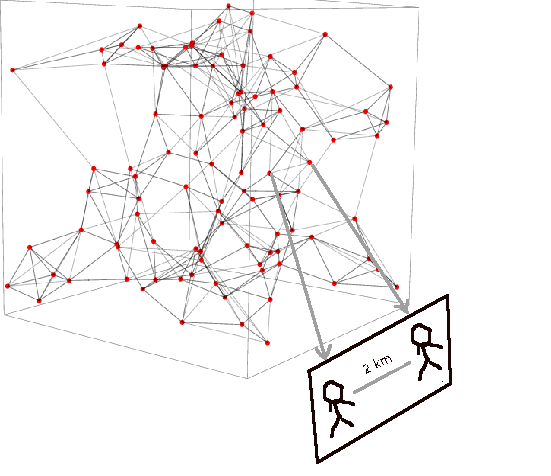

# Week 1

After Lee Smols, who is the second in command? I need a number
two... I watched some of Cortez, some Cohen, all seem to be singing a
slightly different tune... I need that hipster peppy, young scientist
bursting with energy doodling some shit.

---

"Firms halt deliveries from UK to EU over Brexit border problems"

---

"Gates and Bezos-backed clean energy funds help power startup building
hydrogen-fueled aircraft"

---

I mean it's a legitimate viewpoint to have, but why are these people in
the Democratic "Left" Party?

"Sen. Joe Manchin Wants to Block You From Getting a $2,000 Check"

---

Getting geo pos in this webapp was a pain. I have it so js code get
geo, dynamically updates href links, so server side gets geo in the
URL. Who. Da. Man

---

"Lawrence Summers, the former Treasury Secretary under Bill Clinton,
director of the National Economic Council under Barack Obama,
president of Harvard, and Chief Economist at the World Bank, wrote a
post-Christmas editorial for Bloomberg entitled, 'Trump’s $2000
Stimulus Checks are a Big Mistake.' It’s a classic"

[Link](https://taibbi.substack.com/p/neoliberal-champion-larry-summers)

---

That will of course mean less f-ing Clinton people around, like Summers

---

Latest inequality, Gini [calculations](../../2021/01/stats.html#gini) with the latest data

```
2020-04-01    0.463
2020-07-01    0.460
```

There was slight decrease in the last quarter. Let's hope the trend
continues, the Dem Prez reduces it faster, at the very least the
damage done during Clinton years are reversed.

---

<iframe width="200" src="https://www.youtube.com/embed/t-cP1prsBIo?start=1574&end=1712" frameborder="0" allow="accelerometer; autoplay; clipboard-write; encrypted-media; gyroscope; picture-in-picture" allowfullscreen></iframe>

---

`scipy` was deployed wout probs at least, so I wont abandon Heroku for
now... My spiffy new elevation interpolation now uses `Rbf`.

---

There are some ok tubers, to be fair... 

---

Every tuber ever

<table border=0>
<tr>
<td>

</td>
<td>

</td>
</tr>
</table>

---

Oh yeah? There's been some Tuber tantrums as of late?

---

During college this was my email alert sound for a while..

<iframe 
  frameborder="0" 
  height="60"
  src="https://drive.google.com/uc?export=view&id=1qIhKqAGuNDs2WlffkwenKMb63I55Aki9">    
</iframe>

---

"Climate crisis: 2020 was joint hottest year ever recorded"

---

F..kin Heroku choked on geos, cartopy. Never truly bought into these
managed enviroments... Nothing beats having own processing with its
own conn

---

All this protest stuff took attention away from new appointees. That
DHS appt doesn't look so good.

---

Electoral College is a beautiful system.

Learn it. Love it. Marry it.

---

It doesn't demonstrate shit. The inaug will still take place

"The protests demonstrate the fragility of democracy in US"

---

"Boeing to pay $2.5bn over 737 Max conspiracy. The firm is to pay[s]
to settle US criminal charges over the 737 Max aircraft conspiracy"

---

IMO there'll be plenty of H2 to go around, carrying more energy than
the old fossil based system, with some unexpected new exporters even.

---

<blockquote class="twitter-tweet"><p lang="en" dir="ltr">Nations start forming <a href="https://twitter.com/hashtag/HydrogenStrategy?src=hash&amp;ref_src=twsrc%5Etfw">#HydrogenStrategy</a>:<br>• <a href="https://twitter.com/hashtag/EU?src=hash&amp;ref_src=twsrc%5Etfw">#EU</a> to invest $550 bn to build hydrogen (H2) infra<br>• Russia to export 2 mn ton H2 by 2035; talks to Japan, Germany<br>• Saudi, China, etc building huge facilities to produce <a href="https://twitter.com/hashtag/H2?src=hash&amp;ref_src=twsrc%5Etfw">#H2</a><br>With $700 bn market on offer, experts warn of Hydrogen Wars <a href="https://t.co/eyDJlwjb5F">https://t.co/eyDJlwjb5F</a> <a href="https://t.co/7FSBYOx3RL">pic.twitter.com/7FSBYOx3RL</a></p>&mdash; Samir Dattopadhye (@samirsinh189) <a href="https://twitter.com/samirsinh189/status/1346164134962810882?ref_src=twsrc%5Etfw">January 4, 2021</a></blockquote> <script async src="https://platform.twitter.com/widgets.js" charset="utf-8"></script>

---

<blockquote class="twitter-tweet"><p lang="en" dir="ltr">With India&#39;s high production and consumption of energy, Greenstat Hydrogen India Pvt Ltd, a subsidiary of <a href="https://twitter.com/GREENSTATas?ref_src=twsrc%5Etfw">@GREENSTATas</a>, has been formed with big ambitions for renewable growth in the region.<br><br>Read more here: <a href="https://t.co/7kLOx6QrM4">https://t.co/7kLOx6QrM4</a><a href="https://twitter.com/hashtag/hazergroupltd?src=hash&amp;ref_src=twsrc%5Etfw">#hazergroupltd</a> <a href="https://twitter.com/hashtag/hydrogen?src=hash&amp;ref_src=twsrc%5Etfw">#hydrogen</a> <a href="https://twitter.com/hashtag/india?src=hash&amp;ref_src=twsrc%5Etfw">#india</a> <a href="https://twitter.com/hashtag/renewables?src=hash&amp;ref_src=twsrc%5Etfw">#renewables</a> <a href="https://t.co/B3aACRKdso">pic.twitter.com/B3aACRKdso</a></p>&mdash; Hazer Group Ltd (@hazergroupltd) <a href="https://twitter.com/hazergroupltd/status/1346954863721246724?ref_src=twsrc%5Etfw">January 6, 2021</a></blockquote> <script async src="https://platform.twitter.com/widgets.js" charset="utf-8"></script>

---

"@KeithDPatch

Great estimate of UK Flag of United Kingdom offshore seasonal hydrogen
energy storage capability by @jonafushi \#PhD: '...order of magnitude
greater than all known estimates for the [future] seasonal storage
requirement.'"

[Link](https://twitter.com/KeithDPatch/status/1346955375984185345)

---

Hawley and Cruz made a play for the Trump base, but it backfired 

---

25th Amendment? Impeachment (again)?

I'd just let it go.. Not worth the trouble.

---

Im just kidding man...  🤣 🤣 🤣 

---

Conceded? Losah! [LOooooSSAaaah](twimg/ErMiqlAXAAEjz6a.jpg)

---

"Capitol riot: Trump commits to 'orderly' transition of power. The
president's speech comes as a police officer dies from injuries
sustained during the Capitol riot"

---

<blockquote class="twitter-tweet"><p lang="en" dir="ltr">Disgraceful scenes in U.S. Congress. The United States stands for democracy around the world and it is now vital that there should be a peaceful and orderly transfer of power.</p>&mdash; Boris Johnson (@BorisJohnson) <a href="https://twitter.com/BorisJohnson/status/1346926138057220103?ref_src=twsrc%5Etfw">January 6, 2021</a></blockquote> <script async src="https://platform.twitter.com/widgets.js" charset="utf-8"></script>

---

"Merkel and Johnson Blame Trump for Riot, but Europe Also Expresses Hope"

[Link](https://www.nytimes.com/2021/01/07/world/europe/merkel-macron-trump-violence-democracy.html)

---

Leadership matters. 

"@ryanobles

To be clear.. The President of the United States asked and encouraged
his supporters to do what they are doing right now"

---

Good kerkuffle

---

🤣 🤣 🤣 

"Vice President Mike Pence and Senator Chuck Mike Grassley were
escorted to a secure location"

---

"@igorbobic

Police officers are holding them steps away from the Senate chamber,
which is locked. Senators are inside. I see a few confederate flags"

---

<blockquote class="twitter-tweet"><p lang="en" dir="ltr">Protesters have breached the Capitol. They’re outside the Senate chamber <a href="https://t.co/I021tKliUD">pic.twitter.com/I021tKliUD</a></p>&mdash; Igor Bobic (@igorbobic) <a href="https://twitter.com/igorbobic/status/1346898433689399297?ref_src=twsrc%5Etfw">January 6, 2021</a></blockquote> <script async src="https://platform.twitter.com/widgets.js" charset="utf-8"></script>

---

"@sambrodey

McConnell: 'The Constitution gives us here in Congress a limited
role. We cannot simply declare ourselves a national board of elections
on steroids'"

---

The $2000 check discussion ended up helping Dems IMO... They came
across as more for it (w Biden 4 from the start, Bernie as its main
defender), the party w WH and Senate cld not deliver. People dont know
much, but they understand the difference between 'have money' and
'have no money'.

---

Warnock is from the same church where MLK preached 👍

---

It worked :) Great

"@AlexThomp

2022 is going to have some many puppy/dog ads now"


---

"@JackPosobiec

Trump talking about firing everyone right now. Wray, Gina, etc. And
wants to declassify everything - UFOs, JFK, all of it"

---

Better off fighting off the high Ph of Venus atmo, or build a Stanford
Torus than doing all that monkey shit. Plus even if atmo was solvable,
low grav is not, long-term, ur bones will still melt. These people are insane.

---

Dude "creating a magnetic field with a satellite, strategically placed
to create magnetic field so Mars can keep an atmosphere?" MILLIONS IN
YOUR COUNTRY DO NOT HAVE HEALTHCARE.

---

When I was a kid for a while I was obsessed with knife and axe
throwing. Then learned u have to control the flip so the tip hits the
target. Good skill to have, no? 

---

<blockquote class="twitter-tweet"><p lang="en" dir="ltr">Immense UK capacity to store hydrogen in depleted sandstone gas fields (not salt caverns). Make in summer, use in winter. Thousands times more capacity than batteries. Game changer. Free access <a href="https://twitter.com/jonafushi?ref_src=twsrc%5Etfw">@jonafushi</a><br> <a href="https://t.co/yurPFGdnDC">https://t.co/yurPFGdnDC</a> <a href="https://t.co/mOyOoEl1VN">https://t.co/mOyOoEl1VN</a> <a href="https://t.co/u0exCTWxmM">pic.twitter.com/u0exCTWxmM</a></p>&mdash; Stuart Haszeldine (@Haszeldine) <a href="https://twitter.com/Haszeldine/status/1346209322276171777?ref_src=twsrc%5Etfw">January 4, 2021</a></blockquote> <script async src="https://platform.twitter.com/widgets.js" charset="utf-8"></script>

---

"The data .. suggest [tax avoidance banning] efforts have been mostly
unsuccessful. The share of US firms’ profits booked in low-tax locales
keeps growing year after year ... The evidence is less comprehensive
for non-US multinationals because the available data cover fewer
years, but the trend seems to be the same. How can we explain this
lack of success? The BEPS initiative does not attack the heart of the
tax-dodging reactor. Firms are still supposed to exchange goods,
services, and assets internally. The Big Four still manufacture
transactions that have no market price. Transfer pricing accountants
still have incentives to please their clients and certify as correct
whatever arrangement will minimize their tax bill. In need of a
Copernican revolution, we’ve been busy refining the Ptolemaic model of
the heavens"

\#TriumphOfInjustice \#Zucman

---

"[T]he New Deal [is] perhaps the most progressive in world history. As
we saw, it successfully taxed the wealthy for more than three
decades—not only on paper, but in actual fact. By design, few people
paid the 80%–90% top marginal income tax rates that prevailed from the
1930s through to the 1970s. But, all taxes included, effective tax
rates for the very affluent exceeded 50%. Tax dodging was kept in
check. ...[FDR] also spent time explaining why taxes mattered,
appealing to morality, and shunning tax dodgers. 'Mr. Justice Holmes
said, "Taxes are what we pay for civilized society" [the words
inscribed above the entrance to the headquarters of the Internal
Revenue Service in Washington, DC]. Too many individuals, however,
want the civilization at a discount.'"

\#TriumphOfInjustice \#Zucman

---

"As Roosevelt’s message to Congress expresses clearly, the
quasi-confiscatory top marginal income tax rates championed by the
United States were designed to reduce inequality, not to collect
revenue. Why would anyone try to earn more than a million dollars if
all of that extra income went to the IRS? No employment contract with
a salary above a million would ever be signed. Nobody would amass
enough wealth to receive more than a million in annual capital
income. The rich would stop saving after they reached that point. They
most likely would give their assets to heirs or charities once they
surpassed the threshold"

\#TriumphOfInjustice \#Zucman

---

<blockquote class="twitter-tweet"><p lang="en" dir="ltr">&quot;The ITM Power (LSE: ITM.L) Gigafactory delivers a blueprint for a high capacity, semi-automated PEM <a href="https://twitter.com/hashtag/electrolyser?src=hash&amp;ref_src=twsrc%5Etfw">#electrolyser</a> manufacturing facility, which can be readily replicated, enabling a local facility to be planned and rapidly deploye…<a href="https://t.co/b34iR13TwG">https://t.co/b34iR13TwG</a> <a href="https://t.co/NOJHgixCn2">https://t.co/NOJHgixCn2</a></p>&mdash; Graham Cooley (@GrahamCooley4) <a href="https://twitter.com/GrahamCooley4/status/1346011378902065153?ref_src=twsrc%5Etfw">January 4, 2021</a></blockquote> <script async src="https://platform.twitter.com/widgets.js" charset="utf-8"></script>

---

Much more in that link, from other countries

"Since our most recent update September 2019, there has been a lot of
progress in fuel cells for shipping applications. Below is an update
on where fuel cells in shipping has progressed since our last update..

In November 2020, Doosan Fuel Cell announced it will be manufacturing
SOFCs to power and propel ships built by Singaporean shipping company
Navig8. The partnership will initially power a 50,000-ton
ship. According to Doosan, Navig8 has around 140 global petrochemical
and oil carriers that could potentially be decarbonized through the
use of Doosan’s SOFCs"

[Link](http://www.fchea.org/in-transition/2020/12/21/shipping-update)

---

"Senior Government sources said that while 'the balance of scientific
advice' was still that the deadly virus was first transmitted to
humans from a live animal market in Wuhan, an accident at the
laboratory in the Chinese city was 'no longer being discounted'"

[Link](https://www.dailymail.co.uk/news/article-8211291/U-S-government-gave-3-7million-grant-Wuhan-lab-experimented-coronavirus-source-bats.html)

---

That young Congressman died just days before widespread vaccine
availability (for gov at least)... Talk about bad luck.

---

A [reminder](https://twitter.com/GuillaumeFaury/status/1280846469680050176)

I dont understand why some still ignore the memo. 

---

<blockquote class="twitter-tweet"><p lang="en" dir="ltr">European plane maker, Airbus is giving themselves 5 years to develop a commercially viable hydrogen aircraft. Read more about how using hydrogen fuel is the world’s best shot at achieving flight that doesn’t pollute the planet. <a href="https://twitter.com/hashtag/hydrogenfuel?src=hash&amp;ref_src=twsrc%5Etfw">#hydrogenfuel</a> <a href="https://t.co/vkuzSbv4V8">https://t.co/vkuzSbv4V8</a></p>&mdash; SunHydrogen (@SunHydrogen) <a href="https://twitter.com/SunHydrogen/status/1346492943578918924?ref_src=twsrc%5Etfw">January 5, 2021</a></blockquote> <script async src="https://platform.twitter.com/widgets.js" charset="utf-8"></script>

---

"Dfinity is building what it calls the internet computer, a
decentralized technology spread across a network of independent data
centers that allows software to run anywhere on the internet rather
than in server farms that are increasingly controlled by large firms,
such as Amazon Web Services or Google Cloud. This week Dfinity is
releasing its software to third-party developers, who it hopes will
start making the internet computer’s killer apps. It is planning a
public release later this year.

Rewinding the internet is not about nostalgia. The dominance of a few
companies, and the ad-tech industry that supports them, has distorted
the way we communicate ... There are few places online beyond the
reach of these tech giants, and few apps or services that thrive
outside of their ecosystems"

[Link](https://www.technologyreview.com/2020/07/01/1004725/redesign-internet-apps-no-one-controls-data-privacy-innovation-cloud)

---

Maan, Brexit drama is over, w some other suck ending.. What's fun to
do now? Looking at naval movements in the Pacific?

---

"@pressfreedom

CPJ welcomes UK decision not to extradite Julian Assange, urges DOJ to
drop charges"

---

Hey I like the MAGA in the name, Make America Green Again

---

<blockquote class="twitter-tweet"><p lang="in" dir="ltr">Persist <a href="https://t.co/1hW5fHbDJu">https://t.co/1hW5fHbDJu</a></p>&mdash; Bug Thunder MAGA Make America Green Again (@Suscuss1) <a href="https://twitter.com/Suscuss1/status/1345824574139740160?ref_src=twsrc%5Etfw">January 3, 2021</a></blockquote> <script async src="https://platform.twitter.com/widgets.js" charset="utf-8"></script>

---

More objections to [this](https://alarmingdevelopment.org/?p=1475)
article.  Map / Reduce was a relatively recent invention, it's not
merely "machine learning" it was an innovative way of parallelization
of all data processing.

On the language front, 'we dont have sexy langs etc', but for IT,
where you are just shifting bytes around and not computing much, that
might not be a big loss. I mean how many different ways can you create
a f-ing list? 🤷‍♂️ The work isnt all that challenging, outside scale,
systems and some project management areas. Booch should know otherwise
he wouldnt spend all that time with his boxes and arrows in his
so-called methodologies

---

Uncle Don acted like corporatist sadly. In near past. But we got to
see libs squirm and had some good TV.

"The US corporate tax rate was slashed from 35% to 21%. The
consequence? Federal corporate tax revenues have fallen by almost half
from 2017 to 2018.13 We’ll return at length to this development, but
it’s worth recording here its most direct implication: low corporate
taxes mean the ultra-rich, whose income mostly derives from owning
shares in corporations, now really can get off almost scot-free"

\#TriumphOfInjustice \#Zucman

---

Oh no, not Uncle Joe

It's a new age now, of course, we all hope for the best, prep 4 the
worst.

"[Reagan] had made overhauling taxation with dramatically lower tax
rates the top domestic priority of his second term. On that 22nd of
October 1986, about to sign into law the Tax Reform Act, he had reason
to be joyful. Starting on January 1, 1988, the country that had
pioneered the quasi-confiscatory taxation of high incomes would apply
the lowest top marginal income tax rate in the industrial world:
28%. After three weeks of floor debates, the tax bill had passed
ninety-seven to three in the Senate. Democrats Ted Kennedy, Al Gore,
John Kerry, and Joe Biden all had enthusiastically voted 'Yes.' ... To
this day, and although it is now widely recognized as one of the key
contributors to the explosion of inequality, the bill is still fondly
remembered by all those involved in its crafting"

\#TriumphOfInjustice \#Zucman

---

"A fear haunted the slaveholders of the South: that non-slaveholding
majorities would use taxation to undermine—and eventually abolish—the
'peculiar institution.' They particularly feared wealth taxation: at a
time when 40% of the population in Southern states was considered
property, property taxes were an existential threat for slaveholding
planters. They fought such taxes tirelessly, and for two centuries
wielded their power to keep taxes and public institutions
archaic. How? By stifling democracy"

\#TriumphOfInjustice \#Zucman

---

"It’s always possible to shrug off the risk of an entrenched
plutocracy.  To believe that whether a few super-rich own a large
fraction of the country’s wealth is irrelevant. That America’s
institutions are so strong that they cannot be captured by special
interests. That from Boston to Los Angeles, democracy will always and
forever beat plutocracy. And certainly, democracy has overcome
plutocracy in the past. It triumphed over the slaveholding plutocracy
of the South. It beat back the nascent industrialist plutocracy of the
Gilded Age"

\#TriumphOfInjustice \#Zucman

---

"The second and primary culprit for the high tax rates paid by
working-class Americans is consumption taxes. The United States may
not have a value-added tax, but it has a proliferation of sales and
excise taxes that, like a VAT, make prices higher. And there's a
twist: in contrast to regular value-added taxes, US levies exempt most
services, which the affluent consume at high rates as a percentage of
their overall spending. This twist means that the consumption of the
poor (goods) is taxed, while that of the rich (services) is largely
exempted. The United States does not have a VAT; it has a poor man's
VAT.

Do you enjoy going to the opera? No sales tax. Have a country club
membership? No sales tax. Need a lawyer? No sales tax. But if you
drive, dress, or buy appliances, sales taxes apply all the way"

\#TriumphOfInjustice \#Zucman

---

"Under business as usual, income concentration is likely to keep
rising in the medium run thanks to a snowball effect: the wealthy save
a higher fraction of their income than the rest of the population,
which allows them to accumulate more wealth, which in turn generates
additional income. For most of the twentieth century, progressive
taxation and especially high tax rates on capital (as opposed to
labor) had kept this spiral under control. But the tax changes of the
last two decades have dismantled this safeguard"

\#TriumphOfInjustice \#Zucman

---

Of course free society will let you to live in your delusion and
that's fine. But everyone who is in the know and their job is to know,
needs to be aware.

---

An ethnic subculture that always stayed together, are geographically
seperate, are culturally different and feel different is one
thing...

The converse of that, spread out in many locations, geographically
split, not in a cultural ghetto, not in a big enough group, it is not
possible to remain a subculture.

It doesnt matter whatever fuck u think you are, you wont be it. 

---

But yes, a lot of the "new" stuff is overrated, like Docker. 

---

No new cool programming languages, or tech invented since 96..?
Hmm.. Let's not forget CUDA (2006). It might not be a full-blown
language, usually just extension to existing ones, not sleak in terms
of syntax, but it was / is a new way of appoaching programming (with
kernels etc). It gave rise to PyCuda, OpenCL, now Thrust..

IT guys do not deal with this part of computing much. In numerical
computing bunch of things are happening... Speed records are being
broken all the time, thanks to the new architectures.

---

This is mostly true

"But you can’t do research at a startup (I have the scars from
trying). New technology takes a long time and is very risky. The sound
business plan is to lever up with VC money, throw it at elite
programmers who can wrangle the crappy current tech, then cash
out. There is no room for technology invention in startups"

[Link](https://alarmingdevelopment.org/?p=1475)

---

"Trucking Industry Comes Together for Mass-Market Deployment of
Hydrogen Trucks

Through H2Accelerate, the industry will work together to create the
conditions necessary to bring hydrogen fueled trucks to market"

[Link](https://www.oemoffhighway.com/electronics/power-systems/press-release/21208218/volvo-group-global-trucking-industry-comes-together-for-massmarket-deployment-of-hydrogen-trucks)

---

Top reasons many researchers prefer hydrogen fuel vehicles over EVs ...

* No substantial lifestyle changes are required ..
 
* H2 powered cars place less strain on the electric grid ..

* They have a larger range ..

* Practicality for a larger range of vehicles 

[Link](https://www.hydrogenfuelnews.com/hydrogen-fuel-vehicles-over-evs/8540857/)

---

"@carterforva

It's no secret that Virginia is divided, but it's not red vs. blue.
It's the haves and the have-nots.

One side has the lawyers and the lobbyists, but Virginia needs a
governor that'll fight for the rest of us.

I'm announcing my candidacy for Governor today"

[Link](https://twitter.com/carterforva/status/1345053262848946177)

---

I have the Zucman book.

The titles are all catchy and partly sad

<blockquote class="twitter-tweet"><p lang="en" dir="ltr">Do you want to really understand how our economy/society functions? These books are key to unpacking how the “system” works, and will fundamentally alter how you see the world. <a href="https://twitter.com/RBReich?ref_src=twsrc%5Etfw">@RBReich</a> <a href="https://twitter.com/MehrsaBaradaran?ref_src=twsrc%5Etfw">@MehrsaBaradaran</a> <a href="https://twitter.com/gabriel_zucman?ref_src=twsrc%5Etfw">@gabriel_zucman</a> <a href="https://twitter.com/adamwinkler?ref_src=twsrc%5Etfw">@adamwinkler</a> <a href="https://twitter.com/AnandWrites?ref_src=twsrc%5Etfw">@AnandWrites</a> <a href="https://t.co/YORG65ZeVe">pic.twitter.com/YORG65ZeVe</a></p>&mdash; Maxine Bédat (@maxinebedat) <a href="https://twitter.com/maxinebedat/status/1344718475684704256?ref_src=twsrc%5Etfw">December 31, 2020</a></blockquote> <script async src="https://platform.twitter.com/widgets.js" charset="utf-8"></script>

---

They might be positioning themselves against, or at least to be on par
to, a larger Anglo/US alliance.

<blockquote class="twitter-tweet"><p lang="en" dir="ltr">Suspect reax in Delhi will be complex:<br>- knew it. Europeans were never that serious abt competition w/ China<br>- work w/ them where poss<br>- but this is why 🇯🇵🇦🇺🇺🇸 more likely partners<br>- western rhetoric re human rights is just that, so as long as a country is useful, can do whatever</p>&mdash; Tanvi Madan (@tanvi_madan) <a href="https://twitter.com/tanvi_madan/status/1345003730459107328?ref_src=twsrc%5Etfw">January 1, 2021</a></blockquote> <script async src="https://platform.twitter.com/widgets.js" charset="utf-8"></script>

---

*Discovery*, Disco, STD, still sucks. How can a show keep sucking and
still remain on? I sense agenda

---

If a country has an ethnic subculture that always stayed together, are
geographically seperate, are culturally different and feel different,
they need their own country, or some sort of self-determination, not
assimilation. Uygurs in China fit this description.

---

What was my New Year meal? Irish stew baby.. could not find Guiness
but used another dark malt. Superb.

---

Pleasure - Joyous \#music

[Link](https://youtu.be/SsoyAXMr558)

---



---

LS ideas sound like more than a hidden variable viewpoint.. He posits
an ENTIRE MUCKING STRUCTURE behind everything, not a few dimensions
that are not seen

---

Locality is violated, so what? Think like a game programmer. If I am
keeping track of all objects of the uni in a graph, I could put a
direct link between two entangled objects; Alice and Bob. A property
on that link could say "physical distance = 2 km" but my background
processing doesnt care about that. The visualizer would care, that
code when it renders "the world" looks at that property, and draws
them 2 km apart. But this doesnt change the fact that in my code I can
go from Alice to Bob in one hop (just follow pointer, O(1)). The speed
of light, concepts like close, far is for the renderer... Space is
emergent for the gamer, dude who plays.

If The Programmer is good (which "He" probably is) he would seperate
the backg logic from his UI anyway. Whapush 😉

---

😶 😶 😶 

"Do you think God plays dice?"

"I think it's probably much worse than that"

[Link](https://youtu.be/WgLo4gmEraU?t=1099)

---

AFAIK time is unidirectional (no going back) and exists simply due to
entropy which always increases (Hawking's *A Brief History of
Time*). LS calls time essential, space is emergent. Events, relations,
a graph of them, is real. We sense this structure as space in our
minds (emergent). Future does not exist. There is one specific
history.

---

LS: "The lesson I draw from these theories [like Barbour's] is that to
extend quantum mechanics to a theory of the whole universe, we have to
choose between space and time.  Only one can be fundamental. If we
insist on being realists about space—as Barbour and Gomes do—then time
and causation are illusions, emergent only at the level of a coarse
approximation to the true timeless description. Or we can choose to be
realists about time and causation. Then, like Rovelli, we have to
believe that space is an illusion.

There is much more that could be said about these recent non-realist
and magical-realist perspectives. But the bottom line is that if your
interest is pragmatic, and you want to use quantum theory to
understand questions other than those arising from quantum
foundations, any of these will serve to frame your calculations and
the explanations you draw from them. But if you want to solve the
measurement problem in a way that gives a detailed description of what
goes on in an individual physical process, nothing but a realist
description will do"

---

Heard about Barbour from @skdh vid, one Barbour lec touches on
Leibniz, relations. Sounded like Lee Smolin, and indeed there is ref
to Barb in *Einstein's Unfinihed Revolution*. He took some ideas from B

---

Nice, [Mark Hamill](https://twitter.com/HamillHimself/status/1344394315041103872)

---

Actually since Luke is Jesus and the Empire is Rome, the dark side
would be the ultimate patriarchy, but the libs are too effin dumb to see
that. Go to your brunch, liberal 👋

---

Cuck Vader.

He/Him Darth Maul.

🤣🤣🤣

---

"Is the dark side globalist moderate cuck?". Good question

---

I read a fan post dude says he f--ing *cried* when he realized it was
L Skywalker in that last ep of *The Mandalorian*. 

---

"While it's one of the weirdest and coolest phenomena in physics, there
is no way to use quantum entanglement to send messages faster than the
speed of light"

[Link](https://quantumxc.com/is-quantum-communication-faster-than-the-speed-of-light)

---

Welcome to 2021 muthafukkas

---

Calibro 35 - Giulia Mon Amour

[Link](https://youtu.be/vW_TsTlyrws)

---

I realized there are some gems about "policy vs crass pollster" angle
in George Stepahanapopopolloolololooloopopous book *All Too Human*.
See the fights against the rabid pollster Dick Morris.

---

Eff what ppl say, look at what they do with their vote.

---

They r idiots.. what else is new? (but representative democracy still works).

"Even If It's 'Bonkers,' Poll Finds Many Believe QAnon And Other Conspiracy Theories"

[Link](https://www.npr.org/2020/12/30/951095644/even-if-its-bonkers-poll-finds-many-believe-qanon-and-other-conspiracy-theories)

---

😆 😆 😆 

"@AlexThomp

Glad I finally watched Tenet so I can leave it in 2020 with all the other bad stuff"

---

Critics are short-changing *Kong: Skull Island*. We can't expect to see
an exact remake of the original King Kong everytime. They got a fem
lead kinda looking like Jessica Lange but not exactly the same? WTH?

This movie is about war mongering. Better mov also IMO. The humans go
to an island accompanied by a military escort who is headed by a
colonel unhappy the Vietnam War ended (1973). He carries the war with
him to the island. Roles reversed now, the big ape is defending (kinda
like the Vietnamese were defending their home turf?), where the humans
are invading. And the enemy this time was something far worse.

---

Thievery Corporation - Satyam Shivam Sundaram (Featuring Gunjan)

[Link](https://youtu.be/yO9ULEVR-kc)

---

"@RobertDowneyJr

Dear Fellow Golden State Residents! Help CA stop the spread. Join me
and head to http://canotify.ca.gov today for exposure alerts & how you
can help get CA back on our feet. It won't track your location, and
it's completely anonymous. \#CAnotify \#addyourphone"

---

<blockquote class="twitter-tweet"><p lang="en" dir="ltr">There’s also no ‘git praise’ to go with ‘git blame’ either which probably speaks volumes about modern software development :o).</p>&mdash; Chris Oldwood (@chrisoldwood) <a href="https://twitter.com/chrisoldwood/status/1344219040152248322?ref_src=twsrc%5Etfw">December 30, 2020</a></blockquote> <script async src="https://platform.twitter.com/widgets.js" charset="utf-8"></script>

---

It is subjectively important bcz ppl subjectively do "emotional accounting" at year level.. and since many ppl do it, tho subjective it may be, it makes the turn of the year objectively important.

But I appreciate the subversion of expectations, the quicky-contra 😉

"The year is just a number its not important"

---

Then if Senate leadership is not codified in law, I guess party
discipline is playing a role in keeping everyone in line? People
follow the precedent (and the leader) bcz they dont want to incur the
party's wrath. But the leader also has to watch his coalition, he
couldn't just willy nilly do stuff, bring anything for a vote.. He
himself is also elected by his party members.

---

"Under the rules, all senators are essentially equal. That is, no
senator is more powerful than another. However, the majority leader is
clearly considered to be the most powerful senator today. This
perception is based on his ability to make motions to proceed to
legislation and nominations and to fill the so-called amendment tree
(i.e. offer the maximum allowable number of amendments to legislation
to block senators from offering their own amendments). Both are based
on his ability to be recognized first by the Senate’s Presiding
Officer. But the leader’s preferential recognition and, by extension,
his ability to make motions to proceed to bills and nominees and his
ability to fill the amendment tree, are grounded only in
precedent. And the leader’s power in these areas is perpetuated simply
by senators’ continued deference to the majority leader to wield them
however he chooses"

[Link](https://www.legbranch.org/2018-8-1-what-makes-senate-leaders-so-powerful/)

---


Trade if you must, buy if you need, but nothing beats highly localized
networks which have dense interlocking know-how. This is why advanced
countries are advanced. Pfizer/BioNTech develops drug with
cooperation, but they are at the center of that cooperation and their
chief scis are based in Germany. The cooperation part is secondary,
and moot.

---

Of course they are. Both are major exporters.

"China and Germany are pro-globalization"

---

He is powerful bcz other Senators defer to him. This power doesnt seem to be based on anything legally binding.

"McConnell is powerful. He blocks everything"

---
