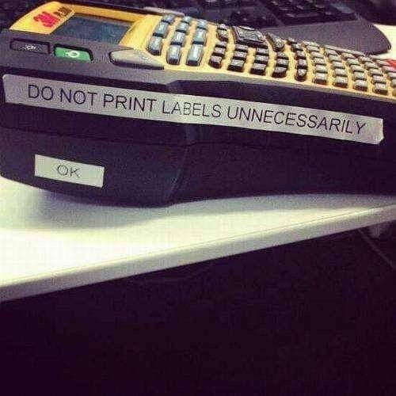

# Week 2

<blockquote class="twitter-tweet">
When friends ask “how’s DC right now?”, will refer them to this totally normal announcement from the local bagel joint <a href="https://t.co/0MNqV9Ngt6">pic.twitter.com/0MNqV9Ngt6</a>
&mdash; Dan Diamond (@ddiamond) <a href="https://twitter.com/ddiamond/status/1350238464273485827?ref_src=twsrc%5Etfw">January 16, 2021</a></blockquote> 

---

Jasper Country Man - Bobbi Humphrey \#music

[Link](https://youtu.be/O2wlN1TLql8)

---

Tofurky.

Right! 👎

---

Tofu..? Dude. 

---

Dont forget your vege.. no, red meats! 

---

Ignored veg - mangold. Its quite healthy. Perhaps even better then
spinach, in the same family

---

Showed calculation [before](../../2022/02/base-energy-numbers.html#arabia); Replacing
Saudi Arabia's oil output with solar equiv w/ panels wld need a square
area with 290 km on each side. A big area. Then, at least at first,
renewable fuel generation through fossil + CCS at the source could
help.

---

F yeah!

Occasionally they anger many, but there is always some action in UK,
some of it even good..

They also talk about CCS

"Project aims to drive UK transition to a low-carbon economy. Essar
plans to supply industry and homes in north-west England after £750m
investment in two plants"

[Link](https://www.ft.com/content/23170b57-1a08-40c8-a30f-c4eb0e9461da)

---

Middle-Aged Mutant Ninja Turtles

\#SNL

[Link](https://youtu.be/2xRJrfWXNjc)

---

"@e_alexjung

the worst part about watching contagion [the movie] now is that it’s a feel good
movie about an efficient vaccine rollout"

---

<blockquote class="twitter-tweet">
North <a href="https://twitter.com/hashtag/Germany?src=hash&amp;ref_src=twsrc%5Etfw">#Germany</a> ?? has founded a new <a href="https://twitter.com/hashtag/initiative?src=hash&amp;ref_src=twsrc%5Etfw">#initiative</a> involving several German states with the aim of making this emerging region the strongest for <a href="https://twitter.com/hashtag/greenhydrogen?src=hash&amp;ref_src=twsrc%5Etfw">#greenhydrogen</a> in <a href="https://twitter.com/hashtag/Europe?src=hash&amp;ref_src=twsrc%5Etfw">#Europe</a>. ?<a href="https://twitter.com/hashtag/HydrogenNow?src=hash&amp;ref_src=twsrc%5Etfw">#HydrogenNow</a> <a href="https://twitter.com/fcell_Germany?ref_src=twsrc%5Etfw">@fcell_Germany</a> <a href="https://twitter.com/germanyintheeu?ref_src=twsrc%5Etfw">@germanyintheeu</a> <a href="https://t.co/lYbrkfVUic">https://t.co/lYbrkfVUic</a>
&mdash; Hydrogen Europe (@H2Europe) <a href="https://twitter.com/H2Europe/status/1349997393048002566?ref_src=twsrc%5Etfw">January 15, 2021</a></blockquote> 

---

And it would be great to convert that coal into renewable fuel + CCS
before shipping, in the future.

---

"@JDWilson08

The trade war vs [Australia] goes from bad to worse for China: While
some of its cities face rolling blackouts, Aus has largely offloaded
the coal onto third markets like India, at surprisingly decent
prices. Turns out diversification isn't that hard..."

[Link](https://twitter.com/JDWilson08/status/1349969415333314562)

---

---

Literary exaggeration aside sometimes it does take 10 books to come up
with one linear, concise explanation.

---

Dude - Wandavision. You'd have to be complete geek of the comics and
all movies to get into that \#marvel.

---

Jacobin: "Big Pharma Is Fighting to Deny Canadians Access to
Treatment... The vast majority of Canadians want a national pharmacare
program, but right-wing think tanks and corporate lobbyists are
battling to obstruct it"

[Link](https://jacobinmag.com/2021/01/big-pharma-access-to-treatment-canada/)

---

"Biden unveils $1.9tn US economic relief package.. The US
president-elect says the nationwide vaccine rollout so far has been 'a
dismal failure'"

---

Aim for the king.

Witten is one of the highest profile Stringers

---

🤣 🤣 🤣

<iframe width="200"  src="https://www.youtube.com/embed/VO8sayIURUY" frameborder="0" allow="accelerometer; autoplay; clipboard-write; encrypted-media; gyroscope; picture-in-picture" allowfullscreen></iframe>

---

No expansion of the universe, light *appears* redshifted.

---

His cast of characters are solid. Einstein (at least his 1911 ideas
which he allegedly mistakenly abandoned), Dicke, the great Dirac

---

More Unzic ideas; Robert Dicke rediscovered relativity with
corrections (1957), speed of light should not be constant. 

---

From *55 megaparsecs* away from Earth, a thing theoretically pulls
everything to itself, including light, HTF can it be "seen"?

---

Yes, singularities in math "predict' black holes. But accrd to WK
field equations should not contain singularities to begin with (curr
math is faulty). Whereever we take measurements, there is always a
number, we never come across a "singularity measurement".

---

Obviously there was some good work around data collecting,
analysis. Talking abt the underlying domain here

---

There was so much SJW biz surrounding the whole thing too... Whenever
there is SJW buzz, cld it be a sign the field, the domain is dying?
Bcz most r focused about taking up existing positions inside, on set
"hierarchies" than breaking new ground? Maybe.

---

Wolfgang Kundt interview; if there are no black holes, what did they
recently take a picture of "for the first time"? Answer; not a BH 🤣
🤣

---

<blockquote class="twitter-tweet">
I have a feeling Mount Rushmore is off the table.
&mdash; Randi Mayem Singer (@rmayemsinger) <a href="https://twitter.com/rmayemsinger/status/1349579762079916033?ref_src=twsrc%5Etfw">January 14, 2021</a></blockquote> 

---

Not a good counterarg. If I am on GMail I can still send email to
someone on Yahoo Mail, through SMTP protocol. Twitter, Facebook,
Whatsapp are all self-contained platforms.

"So what if social networks were based on protocols, there is GMail,
with over a billion users"

---

"US police three times as likely to use force against leftwing
protesters, data finds"

[Link](https://www.theguardian.com/us-news/2021/jan/13/us-police-use-of-force-protests-black-lives-matter-far-right)

---

Yes I remember the K Russell movie, a high school for gifted kids
floating in the air - *Sky High*.

---

The writers going meta on their own movie

<blockquote class="twitter-tweet">
The single best line in all of live action Transformers movies <a href="https://t.co/lNgtuXKNDn">pic.twitter.com/lNgtuXKNDn</a>
&mdash; miiya ミーヤ 🍰 · (4/6) · 🔞 (@PearlteaRizzy) <a href="https://twitter.com/PearlteaRizzy/status/1349268545792659457?ref_src=twsrc%5Etfw">January 13, 2021</a></blockquote> 

---

"@QueensEagle

BREAKING: Queens man impeached — again"

[Link](https://twitter.com/QueensEagle/status/1349472330020491272)

---

SocMed can be built around a protocol, like email is built around SMTP
protocol, and distributed on / through nodes that are owned by
whomever.

"@jack

Twitter is funding a small independent team of up to five open source
architects, engineers, and designers to develop an open and
decentralized standard for social media. The goal is for Twitter to
ultimately be a client of this standard"

[Link](https://twitter.com/jack/status/1204766078468911106)

---

Johnny Favorite Swing Orchestra - Hard 8 \#music

[Link](https://youtu.be/Mrb0m0QFbbs)

---

<blockquote class="twitter-tweet">
Scotland’s first hydrogen-powered train is set to debut this year. The milestone project will see the conversion of a Class 314 car passenger train into a deployment-ready and certified platform for hydrogen-powered train development.  Read more here: <a href="https://t.co/nbvGYuzyfg">https://t.co/nbvGYuzyfg</a> <a href="https://t.co/zZh74gj7hp">pic.twitter.com/zZh74gj7hp</a>
&mdash; Hazer Group Ltd (@hazergroupltd) <a href="https://twitter.com/hazergroupltd/status/1349567035026644994?ref_src=twsrc%5Etfw">January 14, 2021</a></blockquote> 

---

Oz shark attack. In a river!

[Link](https://amp.theguardian.com/australia-news/2021/jan/14/shark-attack-in-perths-swan-river-leaves-man-seriously-injured)

---

<blockquote class="twitter-tweet">
Glad to see my proposal (with <a href="https://twitter.com/Kemal_Dervis?ref_src=twsrc%5Etfw">@Kemal_Dervis</a>) to make every baby a trust fund baby is gaining steam, courtesy of <a href="https://twitter.com/CoryBooker?ref_src=twsrc%5Etfw">@CoryBooker</a> and <a href="https://twitter.com/AyannaPressley?ref_src=twsrc%5Etfw">@AyannaPressley</a> <a href="https://t.co/A3eEK4ryqS">https://t.co/A3eEK4ryqS</a> <a href="https://t.co/OOf7jE0iDu">https://t.co/OOf7jE0iDu</a>
&mdash; Sebastian Strauss (@Seba_Strauss) <a href="https://twitter.com/Seba_Strauss/status/1349149892929859586?ref_src=twsrc%5Etfw">January 13, 2021</a></blockquote> 

---

New station, Berkeley CA

----

"@olafurw

Me: 'Here's the data, and the answers, no cheating'. Supervised
Learning: No Promises'

Me: 'Here's the data' Reinforcement Learning: 'Why you holding a
whip?' Me: 'No reason'

Me: 'This result makes no sense' Unsupervised Learning: 'I HAVE
INVENTED A DIMENSION WHERE IT DOES!'

---

<iframe width="340" src="https://www.youtube.com/embed/qOY3xihlTZ0?start=124" frameborder="0" allow="accelerometer; autoplay; clipboard-write; encrypted-media; gyroscope; picture-in-picture" allowfullscreen></iframe>

---

"@DaniellaMicaela

I spotted the National Guard sleeping in the hallways of the Capitol
as I walked in this morning"

[Link](https://twitter.com/DaniellaMicaela/status/1349352529868578816)

---

Even studying one book, I can open multiple copies of the same PDF,
each window pointing to a different page, then can Alt-TAB between
them. Fast. Different pages from diff books, same way. Could be
Alt-TAB'bing between 10 different books without much apparent physical
activity. Try that with physical books! 

---

No they were not.. I do not miss them at all.

"Oh but I miss paper books, they were better to handle"

---

Zustandsumme!

---

<blockquote class="twitter-tweet">
to fully recreate the conference experience, I&#39;m charging myself $6 for each coffee I drink and I&#39;m randomly unplugging the wifi router throughout the day.<a href="https://twitter.com/hashtag/AAS237?src=hash&amp;ref_src=twsrc%5Etfw">#AAS237</a>
&mdash; Michael Zingale (@Michael_Zingale) <a href="https://twitter.com/Michael_Zingale/status/1348653451367034880?ref_src=twsrc%5Etfw">January 11, 2021</a></blockquote> 

---

Greenwald: "Critics of Silicon Valley censorship for years heard the
same refrain: tech platforms like Facebook, Google and Twitter are
private corporations and can host or ban whoever they want. If you
don’t like what they are doing, the solution is not to complain or to
regulate them. Instead, go create your own social media platform that
operates the way you think it should.

The founders of Parler heard that suggestion and tried...

But today, if you want to download, sign up for, or use Parler, you
will be unable to do so. That is because three Silicon Valley
monopolies — Amazon, Google and Apple — abruptly united to remove
Parler from the internet, exactly at the moment when it became the
most-downloaded app in the country"

[Link](https://greenwald.substack.com/p/how-silicon-valley-in-a-show-of-monopolistic)

---

"glynholton

Concerns that Biden will go softly on Wall Street can be laid to
rest. [SEC appt] Gensler is a proven reformer"

---

Fila Brazillia - The Sheriff \#music

[Link](https://youtu.be/NESE984aSOw)

---

Most of that spying was probably helped by the West itself

"An unprecedented data leak has revealed how alleged Chinese Communist
Party members have embedded themselves inside some of the world’s
biggest companies, including defence contractors, banks and
pharmaceutical giants manufacturing coronavirus vaccines.... Among the
companies identified as having CCP members in their employ are
manufacturers like Boeing and Volkswagen, drug giants Pfizer and
AstraZeneca, and financial institutions including ANZ and HSBC,
uckaccording to the reports"

[Link](https://www.news.com.au/finance/economy/australian-economy/chinese-communist-party-database-leak-reveals-infiltration-into-western-companies/news-story/8fa8f08a2e29564413499f7769ae0bae)

---

"@fuelcellsworks

Groupe Renault & @PlugPowerIncPower Join Forces in \#Hydrogen-50-50
joint-venture (JV) based in France by end of 1st half of 2021,
targeting over 30% share of the \#fuelcell-powered light commercial
vehicle (LCV) market in \#Europe"

[Link](http://bit.ly/2T9Vb7b )

----

Hear hear...

<iframe width="200" src="https://www.youtube.com/embed/MBAGrPz1Ask?start=1648&end=1692" frameborder="0" allow="accelerometer; autoplay; clipboard-write; encrypted-media; gyroscope; picture-in-picture" allowfullscreen></iframe>

---

The 1st island chain...

[Link](https://twitter.com/SamRoggeveen/status/1349221032410763274)

---

"Declassification of secret document reveals US strategy in the
Indo-Pacific... This confirms that US strategic policy in the
Indo-Pacific was in substantial part informed and driven by allies and
partners, especially Japan, Australia and India"

[Link](https://www.aspistrategist.org.au/declassification-of-secret-document-reveals-real-us-strategy-in-the-indo-pacific/)

---

"@Istanbultelaviv

Huge. The Israeli human rights organization @btselem has released a
report, for the first time defining Israeli rule in the Occupied
Territories as a system of apartheid"

---

Sure, overturn. Whaddamuck do people know anyway... They should not
legislate which is akin to mob rule. 

"A group of Uber and Lyft drivers in California filed a lawsuit Tuesday
in state supreme court to overturn a ballot measure that allows the
companies to continue treating its workers like independent
contractors. The drivers claim that Prop 22, which was approved by
California voters last November, violates the state’s constitution by
'stripping' the state legislature’s ability to empower workers to
organize, as well as by 'illegally' excluding ride-hail drivers from
the state workers’ compensation program"

[Link](https://www.theverge.com/2021/1/12/22227042/uber-lyft-prop-22-lawsuit-overturn-drivers-california)

---

"Kenworth became the first company to reach the summit of Pikes Peak
with a Class 8 fuel cell electric vehicle. The milestone occurred
during a Kenworth T680 FCEV zero emissions performance demonstration"

<iframe width="340" src="https://www.youtube.com/embed/02eiIy_l6XA" frameborder="0" allow="accelerometer; autoplay; clipboard-write; encrypted-media; gyroscope; picture-in-picture" allowfullscreen></iframe>

---

Constants are key, and IMO physics should be taught through them,
i.e. how each is derived / measured, and each lecture builds towards
one, in succession. This connects with earlier idea of teaching
concepts as its founders discovered them.

---

And there are no black holes... (see interview with W. Kundt). Hawking
himself admitted before death 🤦‍♂️

---

Says particle physics community became "too big too fail" 🤣 

---

Right.. electronics uses QM but q tunneling needed for it was already
discovered 1928.

---

I knew things were bad, but only bad since 70s. This guy says it's
been bad since 30s.

Alex Unzicker: "I don't know how many of you believe that the Higgs
boson was the discovery of the century but what is sure that Einstein,
Dirac, or Schrodinger would have considered this discovery as
ridiculous they would never have believed that such a model with so
many unexplained parameters reflecting anything fundamental.

So I'm going to argue that particle physics as practice since 1930 is
a futile enterprise in its entirety. ...

First of all good physics is simple, and the true revolutions in
physics always simplify the laws of nature. Maxwell's electrodynamics
was a revolution because the electrodynamic constants and the speed of
light were condensed in one formula, eliminating one constant of
nature.  So did the Planck constant h simplify the laws of nature and
Newton's Theory of Gravitation condensed dozens of unexplained
parameters into one gravitational constant.

[Today's] particle physics is going the other way around. It produced
[too many free] parameters"

[Link](https://youtu.be/0NOaYu-AxsI?t=6)

---

"@rianwatt

The vaccine rollout is so typical of this country's approach to
delivering public goods. A decentralized and underfunded patchwork of
organizations tasked with moving mountains by a federal government
motivated primarily by a fanatical fear of the wrong people receiving
benefit

The result: A system ripe for bad faith grift and line-cutting by the
wealthy and powerful that fails to deliver promised benefits at twice
the necessary expense, thereby undercutting public faith in the
program and leading to further decentralization and stigmatization.

It's far from an original insight, but I keep being struck by how much
more humane and effective our public programs would be if they were
motivated by a fear of people who need them *not* receiving services
rather than people who don't getting something by mistake"

---

<blockquote class="twitter-tweet">
Green hydrogen could supply up to 25% of the world’s energy needs by 2050 and become a US$10 trillion addressable market by 2050. Learn more about green hydrogen&#39;s future in <a href="https://twitter.com/Forbes?ref_src=twsrc%5Etfw">@Forbes</a>. <a href="https://twitter.com/hashtag/greenhydrogen?src=hash&amp;ref_src=twsrc%5Etfw">#greenhydrogen</a> <a href="https://t.co/lwfoG17hg8">https://t.co/lwfoG17hg8</a>
&mdash; SunHydrogen (@SunHydrogen) <a href="https://twitter.com/SunHydrogen/status/1348634711581667336?ref_src=twsrc%5Etfw">January 11, 2021</a></blockquote> 

---

Policy needs to be celeb-indifferent, pursued by capable people.

---

*Red Planet*, 2000, must be Tesla monkey boy's formative film. It
shows Mars with atmosphere (not possible), talks of plans with ppl
living there (ur bones would fall off after long-term exposure), there
is even a killer AI (hyperbole). But if you were uninformed or
retarded you could believe it, and with media being what it is, get
all kinds of attention and money peddling this "vision".

---

<blockquote class="twitter-tweet">
Hydrogen is unlikely to remain a niche fuel for much longer – in the US and around the world. The element could play a critical role in the decarbonization of our economies. <a href="https://t.co/OX3MnRBwdG">https://t.co/OX3MnRBwdG</a>
&mdash; Bjørn Eng (@H2Bjorn) <a href="https://twitter.com/H2Bjorn/status/1348213788919652352?ref_src=twsrc%5Etfw">January 10, 2021</a></blockquote> 

---

Troubling aspects here, Big Tech individual comps are trying to outdo
eachother, once ban starts they all go for it, not to be outdone. 

---

"Fuel cell stocks had a great run in 2020. Plug Power (NASDAQ:PLUG) led
the way as its stock surged a whopping 973% during the year"

[Link](https://www.fool.com/investing/2021/01/04/should-you-buy-fuel-cell-stocks-in-2021/)

---

"SK Group invests $1.5bn in hydrogen fuel cell firm Plug Power"

[Link](https://www.power-technology.com/news/sk-group-invest-hydrogen-fuel-cell-solutions-provider-plug-power/)

---

Hitler's story begins here

"Currency War I began in 1921 in Weimar Germany when the Reichsbank,
Germany’s central bank, set about to destroy the value of the German
mark through massive money printing and hyperinflation... Capital
flight is a traditional response to currency collapse... Even the
German bourgeoisie was not immediately alarmed as losses in the value
of their currency were offset by stock market gains. The fact that
these gains were denominated in soon to be worthless marks had not yet
occurred to many. Finally, those who held unionized and government
jobs were initially hedged as well because the government simply
granted wage increases commensurate with inflation.

Of course, not everyone had a government or union job, stock
portfolio, hard assets or foreign operations to insulate them. Those
most devastated were middle-class pensioners who no longer qualified
for raises and savers who kept their funds in banks rather than
stocks. These Germans were completely financially ruined. Many were
forced to sell their furniture to raise a few marks to pay for food
and keep going. Pianos were particularly in demand and became a form
of currency on their own. Some elderly couples whose savings had been
destroyed would go into the kitchen, hold hands, place their heads in
the oven and turn on the gas in a poignant form of suicide"

[Link](../../0119/2016/03/hyperinflation.html)

---

My stash of code for books grows and grows... Matlab, fine. I'll take
it. Runs through open source `octave`.

---

Big Tech jumped the shark with that Parler ban

---

A lot of ppl are jumping the shark these days, all in their own
different ways..

---

Now interest rates are as low as ever yet there are still people
whining about the deficit. They just dont want gov to do
anything.. this is the real problem.

---

Haha.. "fucking bond traders", "being born again as the bond
market". Glib bullshit accompanied by technobabbling drama covering up
for lack of left-courage while trying to look TV-suave.. The strength
of this junk gave rise to *The West Wing*, taking place around
drama-infused boomers passing eachother papers while accomplishing
nothing.

"Clinton came face to face with the ideological power surrounding
deficit reduction at a January 7, 1993, meeting at the governor’s
mansion in Little Rock. There, Rubin, just selected to head Clinton’s
National Economic Council (NEC), and Panetta, the new chief of the
Office of Management and Budget, put forward the case for deficit
reduction, sidelining proposals for the large, innovative stimulus
that Clinton had advocated during the campaign. ... [S]tubbornly high
long-term interest rates had convinced Wall Streeters, including
Rubin, that a huge reservoir of investment money lay frozen and
untapped...

But cutting the budget meant eliminating much of the social investment
raison d’être promised during the campaign... An appalled Clinton,
confronted with reality according to Rubin, told his economic team,
“You mean to tell me that the success of the program and my
re-election hinges on the Federal Reserve and a bunch of fucking bond
traders?” Carville would later remark that were he to be born again,
he wanted to be reincarnated as the most powerful thing in the world,
the bond market.

But it was Clinton himself who had appointed deficit hawks like Rubin
and Bentsen, the new secretary of the Treasury, who in turn chose the
orthodox Summers as a top assistant, later to succeed Bentsen as
secretary"

[Link](https://prospect.org/health/fabulous-failure-clinton-s-1990s-origins-times/)

---

Obviously previous dereg didnt help either, it created a freer
environment where new tech entropy / disruption could reach faster.

---

AG is no cookie; he knew industry, banks... 'The loan officer at a
bank knows more about their credit risk than anyone FED could employ'
he'd say having worked at these places... And yet that risk assesment
somehow failed. How? It always bothered me AG kept saying he never saw
it coming. Now I have a feeling why, he knew the industry through the
prism of old tech; A calling B, writing shit down, people shouting on
the trading floor, B calling A back, etc.. and *some*
computerization. Nothing at the levels we see today.

---

This all sounds like a bizarre concoction of new tech and old; 2W
institutions, with 3W tech on top... You can't mix fast and slow this
way..

3W is not at a point it can build, right now it merely disrupts and
destroys. Like my earlier example of Newt in front of a chat app, the
app disrupts the singular Speaker, adds nothing.

---

Greenspan, on 2008: "Another important source of the failure of risk
management was the almost indecipherable complexity of the broad
spectrum of new financial products and markets that developed as
number-crunching and communication capabilities soared.

Investment managers subcontracted an inordinately large part of their
task to the “safe harbor” risk designations of the credit-rating
agencies ...

Most investment officers believed no further judgment was required of
them because they were effectively held harmless by the judgments of
these government-sanctioned rating organizations. Especially
problematic were the triple-A ratings bestowed by the credit-rating
agencies on many securities that in fact proved highly toxic. Despite
decades of experience, the analysts at the credit-rating agencies
proved no more adept at anticipating the onset of crisis than the
investment community at large, and their favorable ratings of many
securities offered a false sense of security to a great many
investors....

Even with the breakdown of our sophisticated risk management models
and the failures of the credit-rating agencies, the financial system
would likely have held together had the third bulwark against
crisis—our regulatory system—functioned effectively. But it, too,
failed for many of the same reasons that risk management and the
credit-rating agencies failed: an underappreciation of the risks faced
by the financial system and an increasing complexity that made
effective oversight especially difficult."

---

Flashbaxx - Funk You, Motherfunker \#music

[Link](https://youtu.be/0pXKyULqqI0)

---

<blockquote class="twitter-tweet">
Story you may have missed--Urban Aeronautics Announces First Four Pre-Orders of its EMS <a href="https://twitter.com/hashtag/Hydrogen?src=hash&amp;ref_src=twsrc%5Etfw">#Hydrogen</a> <a href="https://twitter.com/hashtag/FuelCell?src=hash&amp;ref_src=twsrc%5Etfw">#FuelCell</a> Powered CityHawk Aircraft from Hatzolah .<a href="https://twitter.com/hashtag/VTOL?src=hash&amp;ref_src=twsrc%5Etfw">#VTOL</a> Air Ambulances For Emergency Response-<a href="https://t.co/1JCidKgBEK">https://t.co/1JCidKgBEK</a> <a href="https://twitter.com/hashtag/HydrogenNow?src=hash&amp;ref_src=twsrc%5Etfw">#HydrogenNow</a> <a href="https://twitter.com/hashtag/FuelCellsNow?src=hash&amp;ref_src=twsrc%5Etfw">#FuelCellsNow</a> <a href="https://twitter.com/hashtag/decarbonise?src=hash&amp;ref_src=twsrc%5Etfw">#decarbonise</a> <a href="https://twitter.com/hashtag/zeroemissions?src=hash&amp;ref_src=twsrc%5Etfw">#zeroemissions</a> <a href="https://twitter.com/hashtag/H2?src=hash&amp;ref_src=twsrc%5Etfw">#H2</a> <a href="https://t.co/TWvySyFzPz">pic.twitter.com/TWvySyFzPz</a>
&mdash; FuelCellsWorks (@fuelcellsworks) <a href="https://twitter.com/fuelcellsworks/status/1347873000494923778?ref_src=twsrc%5Etfw">January 9, 2021</a></blockquote> 

---

<iframe width="200" src="https://www.youtube.com/embed/t-cP1prsBIo?start=410&end=622" frameborder="0" allow="accelerometer; autoplay; clipboard-write; encrypted-media; gyroscope; picture-in-picture" allowfullscreen></iframe>

---

