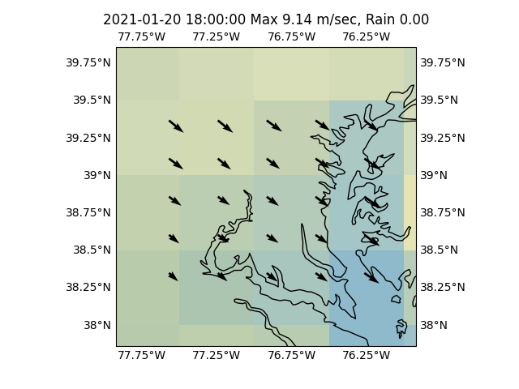
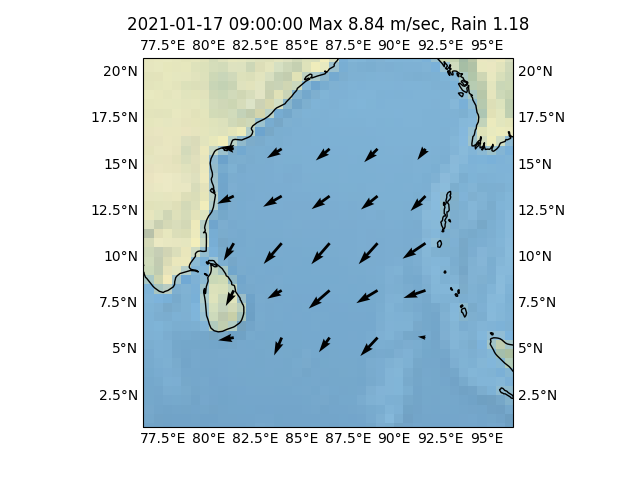

# Week 3

Combining H2 with CO2 (from the "air") to create synthetic kerosone,
so overall you are carbon neutral (took from air, goes back to air, no
difference)? Too open to cheating.. They'll take CO2 from f-ing
whereever, and slap a "neutral" label on it. Before VW cheating
scandal I might have supported these neutrality schemes, now, no.. The
best way to go green is commiting to it at end-user level, you
regulate the source (or make it completely green as well) then the
rest is safe.

---

Some Airbus plans on clean aviation

<iframe width="340" src="https://www.youtube.com/embed/5Fi65k2K3Mw" frameborder="0" allow="accelerometer; autoplay; clipboard-write; encrypted-media; gyroscope; picture-in-picture" allowfullscreen></iframe>

---

Not bad this powerbank has a builtin camp light, can be charged
through my panels, its 2A output runs Raspberry Pi and Im guessing 3A
output will even run a NVidia dev board. With $30 HDMI portable
monitor the whole package is as good as a notebook.

---

Yes I am looking at the latest edition. 

---

This is why I carpet bomb with reading material, they eff shit up so
insanely bad. 

---

$f(x,p,t)$ is the *probability* of finding particle in certain phase
mofo.. The *number* of particles is $f(x,p,t) \Delta x \Delta p$. How
can major book mess that up?

---

<blockquote  class="twitter-tweet">
Welcome back to Washington, Mr. President.  Sen. <a href="https://twitter.com/BernieSanders?ref_src=twsrc%5Etfw">@BernieSanders</a> is not wasting any time.. challenging <a href="https://twitter.com/JoeBiden?ref_src=twsrc%5Etfw">@JoeBiden</a> to abandon &quot;business as usual&quot; and aggressively attack a progressive agenda as quickly as possible. (h/t <a href="https://twitter.com/AnnieGrayerCNN?ref_src=twsrc%5Etfw">@AnnieGrayerCNN</a> for finding) <a href="https://t.co/kAg7yKQZQH">https://t.co/kAg7yKQZQH</a>
&mdash; Ryan Nobles (@ryanobles) <a href="https://twitter.com/ryanobles/status/1351950405220106246?ref_src=twsrc%5Etfw">January 20, 2021</a></blockquote> 

---

H2 has no problems on the weight front (only some on volume) equiv
energy in H2 is actually *lighter*.

---

Li-on bats are 1.8 MJ/liter, so they arent even in the running. Plus
they weigh a ton, plane will nose dive, that way 👎

---

Airbus A330 has a range of 11,750 km. If you halve that, can still
cross the Atlantic which is around 5,000 km.

Crossing the Pacific.. at ~ 7,000 km (LA-Tokyo), bit harder, refuel at
Alaska? Or increase tank size little more.. Solutions can be found.

---

How to solve the green aviation problem?

Current jet fuel used is kerosene (one of the most densest form of
energy) w energy content 34.69 MJ/litre.

Liquified H2 has 8.5 MJ/liter

Then a suggestion could be, pending new developments, double fuel tank
size, and halve the range of planes. Dunno what else to say, greening
will have consequences. But I am guessing if sufficient fire is lit
under their ass, aircraft makers will innovate in a jif. Airbus chief
is [lighting](https://twitter.com/GuillaumeFaury/status/1280846469680050176)
that fire I see (or feeling it), he laid out a goal, so subseq inno
should be possible.

---

I thought it was a Spanish soccer guy talking abt a game,
goooooaaaallll! turns out it was singer talking Spanish during a song
in Inaug... The singing was ok by muchacha

---

So good

"Biden Signs Executive Orders on Face-Mask Mandate, Keystone Pipeline,
Paris Accord"

---

Should I continue with the Middle Ages analogy? There is mainstream,
stuck in the mud, quacks, and also there is the ultra-rich, the new
Medicis? For a while there were even pirates! Crusades?! WTF man..

---

<blockquote class="twitter-tweet">
The world&#39;s 1st internal combustion engine ran on <a href="https://twitter.com/hashtag/hydrogen?src=hash&amp;ref_src=twsrc%5Etfw">#hydrogen</a> gas in 1807. Now, <a href="https://twitter.com/hashtag/hydrogencombustion?src=hash&amp;ref_src=twsrc%5Etfw">#hydrogencombustion</a> in ✈️could bring zero-emission technology to aviation. We&#39;re on it! 👉<a href="https://t.co/J8NGqKktCy">https://t.co/J8NGqKktCy</a> <a href="https://t.co/fZNonzURjE">pic.twitter.com/fZNonzURjE</a>
&mdash; Airbus (@Airbus) <a href="https://twitter.com/Airbus/status/1331981609176854528?ref_src=twsrc%5Etfw">November 26, 2020</a></blockquote> 

---

Happy Inauguration Day

---

Manchin won't be the party pooper then?

"@sahilkapur

Important policy news this weekend: @Sen_JoeManchin went [on TV] and
kept the door open to higher stimulus checks up to 2,000 (he prefers
they be targeted but didn't draw a red line) and called for spending
as much as $4 trillion (!) on infrastructure"

---

Windy day in Washington

---

McKinsey H2 roadmap ideas for US.

[PDF](https://static1.squarespace.com/static/53ab1feee4b0bef0179a1563/t/5e7ca9d6c8fb3629d399fe0c/1585228263363/Road+Map+to+a+US+Hydrogen+Economy+Full+Report.pdf)

---

<blockquote class="twitter-tweet">
I&#39;ll admit it, this headline seriously moved me. We&#39;ve got tremendous work to do, but we&#39;ve got a great, deeply committed team that&#39;s already hard at work. But step 1--new leadership w a genuine commitment to meeting the challenges we face--is hours away. <a href="https://t.co/8zkw4g1O5J">pic.twitter.com/8zkw4g1O5J</a>
&mdash; Jared Bernstein (@econjared) <a href="https://twitter.com/econjared/status/1351894226779385862?ref_src=twsrc%5Etfw">January 20, 2021</a></blockquote> 

---

That risk taking led to the discovery and settlement of US after all
😉 Pursued by different, diverse set of states also let's not forget.

---

Europe doing some gutsy stuff.. Werent they bunch of bureucrats,
eurocrats, all "arthritic", not able to move..?  Taking some risks,
big moves here

---

👏👏👏👏👏👏

<blockquote class="twitter-tweet">
Clean hydrogen will help us reconcile our economy with the health of our planet. That&#39;s the spirit of the <a href="https://twitter.com/hashtag/EUGreenDeal?src=hash&amp;ref_src=twsrc%5Etfw">#EUGreenDeal</a>.   We invest in hydrogen like never before and support out-of-the-box solutions, to make the EU climate-neutral by 2050.  My address to <a href="https://twitter.com/HydrogenCouncil?ref_src=twsrc%5Etfw">@HydrogenCouncil</a> ⤵ <a href="https://t.co/Fjmot35KW6">pic.twitter.com/Fjmot35KW6</a>
&mdash; Ursula von der Leyen (@vonderleyen) <a href="https://twitter.com/vonderleyen/status/1351487690752073729?ref_src=twsrc%5Etfw">January 19, 2021</a></blockquote> 

---

Its probably safe to ignore any mainstream physics since 30s. Same for
base math pretty much. If 19th century math was good enough for
Feynman it's good enough for me.

---

"Even Though He Is Revered Today, MLK Was Widely Disliked by the American Public"

---

Including the tr version of the blog and its q&a format as tweets, u
cld say I've been tweeting since 2008.

---

The dollar was already too high. It now moved to an average level.

"Previous money injection and future prospect of more stimulus led to
the dollar falling"

---

The entire world is rushing, competing to sell to US, as well as to
eachother. How cld that not lower prices? Wages also have competition
through globalization. 

"Why did inflation disappear in US?"

---

They've been seeking for this f-ing thing for decades now.. and still
haven't found it?

Time to give up dude? Or no.. Just fudge another constant and move
on..?

---

The CERN presentation has a great title: "Desperately Seeking SUSY" 🤣 🤣 🤣 

[PDF](https://indico.cern.ch/event/527162/contributions/2159007/attachments/1298122/1936489/deroeck_SUGRA_2016_v4.pdf)

---

[shakes head in disbelief]

Unzicker: "The reason why the standard model cannot calculate mass is
stunningly simple. Whatever formula may calculate the mass of a
particle, it has to have the physical unit of a mass, which is
kilograms, and those kilograms have to come out of the formula, you
can't pull it out of your ass. The only way to do it is to find
combinations of the fundamental constants of Nature, otherwise you are
cheating. But there is no such combination, as every high school kid
can understand... There is just one caveat - you can't do it unless
you use the gravitational constant G, that is, you consider gravity in
your model. But particle physicists don’t do it because gravity is a
difficult business that goes above their minds. It’s outright lunatic
that they declare that calculating masses, alas, is impossible in the
standard model and at the same time deliberately disregard gravity
which would offer the only possibility to try it"

---

"[Wilczek] has by now lost multiple bets that the LHC would see SUSY
particles, including ones with Garrett Lisi in 2009 and Tord Ekelöf in 2012.
At this point, even diehards like Wilczek acknowledge that
chances that the LHC will see SUSY are slim. Another problem is that
increasingly sensitive proton decay experiments have also ruled out a
large part of the proton lifetimes predicted by the SUSY models
Wilczek favors"

[Link](https://www.math.columbia.edu/~woit/wordpress/?p=12147)

---

Boeing did not only mess up on the control system of the MAX. They
messed up in the core aerodynamics first, they created a poorly
balanced plane, which they tried to fix using software. They made it
much easier for the control system to fail, basically.

People are awed and amazed at the electronics of these systems, but
let's not forget, during WW1 and and 2, planes could still fly without
any of these. Basic, solid aerodynamics made that possible. Now bunch
of office monkeys too used to their gadgetry and unrealistic computer
games think they can turn everything upside down, and "software" wld
take care of it. This is delusional / wishful thinking. This is the
mentality that gave you stagnant physics of decades, BEVs, IoT, errant
liberalism and lukewarm, ineffective politics with tech sparkle. 

---

<blockquote class="twitter-tweet">
Let&#39;s all stop adding more blow-dryers, okay? The experiment got a bit out of hand..
&mdash; Joris Gillis (@jgillis42) <a href="https://twitter.com/jgillis42/status/1303266836398702593?ref_src=twsrc%5Etfw">September 8, 2020</a></blockquote> 

---

"'[R]ight now it’s starting to look like [HFCs] are in the lead
[compared to battery electric-powered vehicles], and many experts
think that will continue,' said Matt Waller, the dean of the Sam
M. Walton College .. Waller said [they] could be better for the
environment than electric batteries because there isn’t any poisonous
material to dispose of with hydrogen, and the only byproduct is water"

[Link](https://www.freightwaves.com/news/green-hydrogen-the-future-of-fuel)

---

"Joining global shipping giants like NYK and CMA CGM, number-two ocean
carrier MSC has recently joined the Hydrogen Council"

[Link](https://www.maritime-executive.com/article/number-two-ocean-carrier-joins-partnership-on-hydrogen-fuel-r-d)

---

Lalo Schifrin - Hotel Daniels \#music

[Link](https://youtu.be/GOwOzB62AFs)

---

It's true, there is a bubble. [The Wilshire index](../../2021/01/stats.html#wilshire)
(total market cap / GDP) is very high.

Just looking at the shape of graph shows exp growth.

"The wealthy are investing like a market bubble is here, or at least near"

---

<blockquote class="twitter-tweet">
Mr. Navalny should be immediately released, and the perpetrators of the outrageous attack on his life must be held accountable. The Kremlin’s attacks on Mr. Navalny are not just a violation of human rights, but an affront to the Russian people who want their voices heard.
&mdash; Jake Sullivan (@jakejsullivan) <a href="https://twitter.com/jakejsullivan/status/1350893957375471628?ref_src=twsrc%5Etfw">January 17, 2021</a></blockquote> 

---

"@yashar

People keep asking why Navalny went back to Russia...some have called
it foolish. How do you think change happens? It doesn't happen from a
comfy apartment in Berlin or New York"

---

Hey my Nano tripled in value dam 

---

"@Zachary

Biden will nominate FTC commissioner and @SenWarren ally Rohit Chopra
to lead the CFPB, sources familiar say"

---

I'll always remember that name through the Dennis Miller joke
"... looks shakier than a rescue dog in Phil Spector's house".

"Phil Spector: Pop producer jailed for murder dies at 81"

---

"The quintessential Gen-X band"..? Hmm..

---

Parts of it goes full Bee Gees 

---

New Radicals - You Get What You Give \#music

[Link](https://youtu.be/cPAEFnVZVOs?t=33)

---

Its a feel good, upbeat ok song.

"@RollingStone

The New Radicals will reunite for the first time in 22 years to
perform 'You Get What You Give' during Biden inauguration virtual
parade"

---

The trials and tribulations of Hawley is the perfect example why
fascism-lite, the so-called "populism", is unsustainable as an
ideology. Dude supported the Trump tax, then sided with Bernie on the
$2000 check, is for anti-trust and but then went batshit on election
fraud charges... He is a mess. This cant be the basis of Rep party, or
any party.. These people can only exist as a reaction to something
else.

---

"@fuelcellsworks

Our weekend news continues as Japan & Adnoc Co-Operate in Developing
\#Ammonia Fuel & Carbon Recycling Techn-Ammonia will play an important
role in enabling \#hydrogen economy & can serve as a hydrogen carrier
& \#zeroemission fuel"

[Link](http://bit.ly/3qsRHgH)

---

"@hazergroupltd

Figures from the International Energy Agency reveal that global
low-carbon hydrogen production has increased from 0.04 million tonnes
in 2010 to 0.36 million tonnes in 2019, and is expected to reach 1.45
million tonnes in 2023"

---

"@Snowden

@Navalny's arrest seems to me a repetition of mistakes made in the
Soviet era, seen elsewhere now in the case against #Assange and the
war on whistleblowers. States are developing an allergy to
opposition—but systems that cannot accept dissent will not survive
it. Let him go"

---

Pic is from my new wind plotter tool.

---

That area is always windy as fuck

East of Sri Lanka, Bay of Bengal.

---

Geometry should take backseat to other concerns.. It is a derivative
concept, not essential. In Wolfram's approach too, space, its
dimensions [emerge](https://youtu.be/-t1_ffaFXao?t=6555) out of his
hypergraph structure.

---

ALex Unzic says Einstein made a mistake geometrizing relativity.

---

There was FF 1 then FF 2? But.. how does that connect to, like Blah
Movie 3? And that to Blah Blah 4?

---

After seeing decade long multi movie setups, old style mere "sequel"
sound so inconsequential.. tiny.

---

Wikipedia's 20th birthday. HBD

---

CSU guy, Söder. He was recently against "any expansion of the eurozone
to include countries like Bulgaria and Romania; the introduction of
Eurobonds; and the creation of a European finance minister
post". Daam.

The newly elected person is exact oppo no?

---

New CDU leader.  But it doesnt mean this person will be the chancellor
candidate for the general elections?

Dude from CSU comes across more of a leader... And word is he handled
covid well.

---

TR parties, coalitions still largely work this way.. they are
cesspools of proto fascism into which anything can be thrown in and it
floats, like certain shit does in a pool of piss.

---

Sure. 30s TR for example, during the single-party rule and staunch
nationalism one of its governors was known to have said "if communism
was necessary for this country, we would surely import it". Sounds
like a joke and it is told as such, but the guy was dead
serious. There you go, nationalist talking about utilizing
communism.. Or in China today, they are communists, but imported
capitalism, and happily using it. Italian fascists created the social
security system of the country.

Intensely opposing ideologies cannot be held together under one roof
in anything other than fascism.. A whatever-it-takes attitude usually
accompanies the approach, 4 whatever reason said country falls into a
state-of-emergency mentality from which they never emerge, so they
keep on living in an hand-to-mouth existence, "I'll take from here,
I'll take from there, whatever-it-takes, ends-justify-the-means", and
on it goes..

"Could you give more examples of fascism being a grab-bag of ideologies"

---

Of course they are

Jacobin: "Israel Is Refusing to Give Palestinians COVID Vaccines"

---
