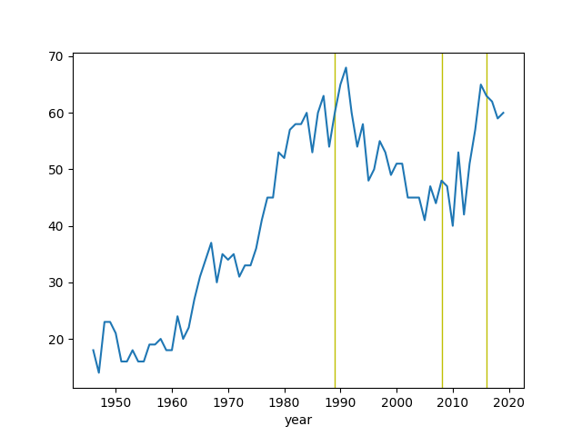
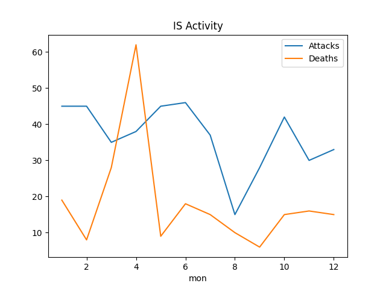

# Week 10


---

Jacobin: "Don’t Be Fooled: Little Marco Rubio Is Still an Enemy of Labor"

---

🤣 

<iframe width="200" src="https://www.youtube.com/embed/RGZzSd6dURU?start=21&end=30" frameborder="0" allow="accelerometer; autoplay; clipboard-write; encrypted-media; gyroscope; picture-in-picture" allowfullscreen></iframe>

---

Super Mario calls ECB, he is like "a-bond a-selling a-can a-raise
a-rates, a-help us". ECB is like 'sure'.

---

I bet they do it to keep the bond rates low so indebted countries can
turn over debt.

---

Why is the ECB buying up bonds.. u r mucking up  the signal

---

The "changed strategy" is the one where Mexico
[itself](https://www.theatlantic.com/ideas/archive/2019/06/trumps-deal-mexico-could-have-unintended-effects/592828/)
became a wall.

Dec 2020: "[ICE] arrested and deported fewer people last fiscal year
than in any other during President Donald Trump's term... a trend the
agency has linked to restrictions forced by the Covid-19 pandemic and
a changing strategy on the U.S.-Mexico border"

---

Khan is like boomer Trek, man.. and boomers are busy w other stuff,
checking returns of their real estate, so lets see some other
stories. Later ST material, or if you want to go "dark and edgy" a
Firefly approach, and stay away from cuck.

---

TBH never really cared for the Khan story of Trek.. Khan is based on a
Trek OS movie, which I watched many years ago, it was ok.. but sorta
old now. No significance for me, at the level of say, Borg.

---

Beckley, *Unrivaled*: "China has large reserves of oil and natural gas
encased in shale basins, but China has not been able to tap them and,
according to some analyses, may never do so. One reason is that
China’s shale deposits were left behind by prehistoric lakes and,
consequently, have rock layers that are more ductile and less amenable
to hydraulic fracturing than the brittle marine shales in North
America. Another reason is that China lacks the water necessary for
fracking"

---

Fossil based energy system was advantageous for US.. ample resources
that are easy to get to.. But.. the planet is getting screwed in the
process. Renewable fuels might give other nations little more
advantage, but fine, we take it from there, every1 competes on other
fronts.

---

Comparing energy delivery in kwh to crude oil. H2 energy density 39.7
kWh/kg. Typical tanker carries 400,000 barrels, 1 barrel oil gives 1/2
barrel gasoline, refn proc is 85% efficient, barrel is 0.158 m3,
gasoline is 748.90002 kg/m3, has 12.88 kwh/kg energy density,


```python
print ('%0.2f kwh' % (2000*1000*39.7))
print ('%0.2f kwh' % (400000*0.5*0.158*748.9*12.88*0.85))
```

```text
79400000.00 kwh
259087047.52 kwh
```

Hey the tech will improve I am sure.. this isnt bad for first. Lets
also not forget ammonia as an H2 carrier. Another good news is the
proposed C-H2 ship uses its own fuel to propel itself; carrying zero
emission fuel with zero emission! 

[PDF](https://gev.com/wp-content/uploads/2021/03/gev-march-2021-ahc-presentation.pdf)

---

That's a compressed H2 transport ship with 2000 tones of capacity.

<blockquote class="twitter-tweet"><p lang="en" dir="ltr">This week we presented to the <a href="https://twitter.com/H2MobilityAus?ref_src=twsrc%5Etfw">@H2MobilityAus</a> our C-H2 Scoping Study findings. Fore more details you can read here <a href="https://t.co/cFCPV1ZUdT">https://t.co/cFCPV1ZUdT</a> and also refer to our investor page for the full report at <a href="https://t.co/8sbUXWjJ0w">https://t.co/8sbUXWjJ0w</a> <a href="https://t.co/AtVkTXVFLz">pic.twitter.com/AtVkTXVFLz</a></p>&mdash; Global Energy Ventures (@GEVmarineCH2) <a href="https://twitter.com/GEVmarineCH2/status/1369955204431450114?ref_src=twsrc%5Etfw">March 11, 2021</a></blockquote> <script async src="https://platform.twitter.com/widgets.js" charset="utf-8"></script>

---

Except for special ed and early students, there is absolutely no need
for a teacher to be present in the old sense of the word.. It is even
downright harmful that a random average .. wonderful person is
teaching kids algebra, calculus. There can still be schools, but not
necessarily with teachers in them.

---

I hope delivery of the lectures do not require a "live teacher". But
Google is all about scale, so probably not.

---

Yes, great. Do this instead of that quantum bullshit.

"How Google's New Career Certificates Could Disrupt the College Degree"

[Link](https://www.inc.com/justin-bariso/inside-googles-plan-to-disrupt-college-degree-exclusive.html)

---

Dreams of Massachusettsification

---

Nice

<blockquote class="twitter-tweet"><p lang="en" dir="ltr">Sometimes I feel like a don’t have a paakd caa</p>&mdash; Cry Me A Rivard (@rivardless) <a href="https://twitter.com/rivardless/status/1370219618418094085?ref_src=twsrc%5Etfw">March 12, 2021</a></blockquote> <script async src="https://platform.twitter.com/widgets.js" charset="utf-8"></script>

---

A certain generation of socsci researchers are just way into f-ing
Stata. And I am into reverse-engineering their .. wonderful code
.. and porting it into 🐍

---

Yoshinori Sunahara - Summer \#music

[Link](https://youtu.be/GrPQ_fzvW7Q)

---

Thucydides's Trap? Bih who dat Thucydides? Speaka English.

---

They are at 1/10th (which they got to with Western help, lets make
this clear), does it make sense to help them so the ratio goes up to
1/3th, or 1/2? Such obscene help creates weird dynamics too, even
movies become bizarre.

---

China looks like a paper tiger. But countries -and themselves- seeing
CH otherwise can create problems. Spreading authoritarinism is not
a-ok.

---

Another ex of CINC problems [applied](../../2021/03/power-of-nations-beckley.html#ukch)
to UK/CH.

---

Beckley says his method has 8 percentage points more success in
predicting results of conflicts, wars than CINC.

Let's use his method on a few countries,

```python
import pandas as pd
df = pd.read_csv('../../2020/07/gdpw.csv')
df = df[df['country'].isin(['Turkey','Greece','United States','China']) ]
df['gdp'] = df.gdpcap * df.population
df['mbindex'] = (df.gdpcap * df.gdp)/1e14
print (df[['country','mbindex']])
```

```text
          country     mbindex
13  United States  12898.099255
51         Greece     43.463713
85          China   1363.010190
87         Turkey     68.576017
```

This is so sad... US has 10 times more pow than the next guy. My
tegros are drowning down there in the list, next to, like, Greece.

---


MB doesnt like the widely used military capability index CINC either.
The famous Correlates of War project uses it, but I can see his point;
like the GDP, it's a gross measure, does not account for costs..

His alternative method is GDP x GDP Per Capita. This punishes
population size (GDP Per Capita is GDP divided by population), bcz the
more people you have the more you are spending as well (especially for
nondemocracies they spend on internal security). On the upside GDP Per
Capita rewards innovation, it's a sign of efficiency, being able to
produce more with less means there is innovation in the economy. The
gross obviously has to enter the picture, at some level, that's why it
gets multiplied.

---

On whether to use GDP for nation-power comparison

M. Beckley: "Despite the widespread use of GDP, however, few people
know what it actually measures or recognize that it does not deduct
costs.  To begin, GDP counts production costs (inputs and
externalities) as output.  Spending money always increases GDP, even
if the funds are wasted on boondoggles; in fact, the most common
method of calculating GDP is called the 'expenditure method' and
involves simply adding up all of the spending done by the government,
consumers, and businesses in a country in a given time period. Thus,
hiring workers always increases GDP, even if they spend all day
getting drunk in the break room. Boosting production always increases
GDP, even if the goods rot on the shelf and tons of toxic waste are
released in the process. In fact, a country can increase its GDP by
dumping toxic waste into the streets and then spending billions of
dollars to clean it up...

Consequently, populous countries generate considerable economic
activity simply by existing. Even a nation caught in a Malthusian
hell, in which all output is immediately devoured, will post a large
GDP if it has a big population.  Finally, GDP counts security spending
as economic output. GDP does not distinguish between guns and
butter. It counts a 100 million dollar gulag the same as a $100 million
innovation center. Hence, GDP fails to account fully for the economic
costs of domestic instability and international conflict. In fact, GDP
usually rises when a country mobilizes for war... In general, however,
resources devoted to policing and protection drain wealth rather than
create it"

[Link](../../2021/03/power-of-nations-beckley.md)

---

Hah. By CINC China is at the top. You know that shit aint true.

---

How to compare the power of countries? Some use CINC, a combined
measure of iron and steel production, energy consumption, military
expenditure, personel, etc.

---

CNBC: "India is turning to 'green hydrogen' in a bid to decarbonize its economy"

---

Lula comes out swinging. :) 

"‘Brazil has no government’: Lula tears into Bolsonaro in comeback speech"

---

"Brazil Overtakes U.S. in Daily Covid-19 Deaths"

---

"@foxjust

2020 was the first year since 1947 in which more than 1% of the
U.S. population died"


---

<blockquote class="twitter-tweet"><p lang="en" dir="ltr">Bringing down emissions from buildings to zero might be the hardest nut to crack for the <a href="https://twitter.com/hashtag/EUGreenDeal?src=hash&amp;ref_src=twsrc%5Etfw">#EUGreenDeal</a>.<br>The PACE project promotes Fuel Cell micro-Cogeneration to reduce emissions from buildings.<a href="https://t.co/8ptgpsNUHN">https://t.co/8ptgpsNUHN</a> <a href="https://twitter.com/hashtag/FuelCells4Homes?src=hash&amp;ref_src=twsrc%5Etfw">#FuelCells4Homes</a> <a href="https://t.co/aAo9eP3j5z">pic.twitter.com/aAo9eP3j5z</a></p>&mdash; PACE (@PACEmCHP) <a href="https://twitter.com/PACEmCHP/status/1369679451903131655?ref_src=twsrc%5Etfw">March 10, 2021</a></blockquote> <script async src="https://platform.twitter.com/widgets.js" charset="utf-8"></script>

---

"With heating and cooling in buildings responsible for 40% of energy
consumption and 36% of emissions, the importance of its
decarbonisation is paramount. As the current annual renovation rate is
below 1% and more than 70% of heating in buildings is supplied by old
and inefficient boilers, buildings are unanimously recognised as a
hard-to-decarbonise sector...

Direct electrification with heat pumps is not always economically
feasible in every building and will double the peak demand for
electricity in winter in most European countries... The town of
Hassfurt in Germany demonstrates how a cogeneration unit running on
hydrogen can be at the centre of the city’s long-term decarbonisation
strategy"

[Link](https://www.euractiv.com/section/energy-environment/opinion/decarbonising-a-diverse-european-building-stock/)

---

<blockquote class="twitter-tweet"><p lang="en" dir="ltr">.<a href="https://twitter.com/PlugPowerInc?ref_src=twsrc%5Etfw">@PlugPowerInc</a> and <a href="https://twitter.com/Universal_H2?ref_src=twsrc%5Etfw">@Universal_H2</a> have strengthened their industry relationship as part of an effort to make <a href="https://twitter.com/hashtag/greenhydrogen?src=hash&amp;ref_src=twsrc%5Etfw">#greenhydrogen</a> cost-competitive with jet fuel by 2025.<a href="https://t.co/c0Niy2EKl6">https://t.co/c0Niy2EKl6</a></p>&mdash; Hydrogen Europe (@H2Europe) <a href="https://twitter.com/H2Europe/status/1369646105907060736?ref_src=twsrc%5Etfw">March 10, 2021</a></blockquote> <script async src="https://platform.twitter.com/widgets.js" charset="utf-8"></script>

---

The Pacific has its own royals now..  Canada can dump UK ones and form
its own CommonWealth (Calif, WA, Canada, whats the difference). Add
the US as outside ally, Oz, NZ as members u have an empire for the
Pacific. H&M can be Duke and Duchess of O.C.

---

Do TV anchors get a mood warning before they start reading the next
news item? Like, "sad mood", "happy mood" etc. Stuff flows fast and u
cld roll into a sad story smiling like a jackass.. Warning could help.

---

U cld say 2008-16 admin was also diverted, bcz of ISIS.

---

US was "diverted" away from Indo-Pacific [20 yrs ago](../../0119/2019/11/americas-secret-war-friedman.html#china).
They are likely more intent to engage this time around.

---

"@screenqueenz

Elizabeth Banks to direct bear-centric thriller COCAINE BEAR for
Universal. The film is based on true events from 1985; a 175-pound
bear accidentally consumed over 70 ponds of cocaine that was dropped
it from a plane by a smuggler"

---

MLK: "If a man hasn't found something he will die for, he isn't fit to
live"

---


---

AlJazeera: "Myanmar’s military on ‘killing spree’ against protesters: Amnesty"

---

Go for it!!

"Capsule gets $1.5M to build ‘super simple’ decentralized social media
[on Dfinity’s decentralized network]"

[Link](https://techcrunch.com/2021/03/09/capsule-gets-1-5m-to-build-super-simple-decentralized-social-media/)

---

"@rcbregman

... The child tax credit in the Rescue Plan is a basic income for
children. It'll cut child poverty in half. IN HALF!!! The word
'historic' is overused but this seems very very historic to me"

---

Lula is free for politics. Excellent news. The Left needs good
leadership.

---

*Private Government*, good book. Some excerpts [here](../../2021/03/private-government.md).

---

Marx missed that same point about the Second Wave; thinking
[too highly](../../0119/2011/03/integrators.html#marx) of the masses.

---

People power.. Sure..

Remember 2006 TIME [Person of the Year](you.png)?

And what happened since? Think grasshopper.

---

Forbes: "Fossil Fuel Air Pollution Kills Twice As Many As Previously
Thought"

---

"Indian-Irish partnership to produce green hydrogen... Ireland’s Fusion
Fuel Green has agreed to set up a demonstrator plant in the Indian
state of Tamil Nadu"

---

Actually Dem div indirectly caused Rep division later.  If everyone
stuck to one side, -ism, none of that wld take place. Had to happen
this way I guess..

---

Divisions Trump trig'd at the Reps remind me of Clinton triangulation
with the Dems. At the time Reps probably enjoyed that, seeing the
in-fighting on the other side (until BC started encroaching on their
shit, then they panicked). What goes around, comes around, a kind of
division hit them too in the end.

---

"@maxwellstrachan

journalism is a public service playing by the rules of private
enterprise—a contract that appears increasingly untenable"

---

Bloodbath at HuffPo. Frankly hadnt read their stuff for a while..

"@emmaladyrose

Today I got laid off at HuffPost, after a decade of work I am so
incredibly proud of. I am one of 47"

---

<blockquote class="twitter-tweet"><p lang="en" dir="ltr">1 year, 1.100k validated tickets, and 419k km later, our green <a href="https://twitter.com/hashtag/ExquiCity?src=hash&amp;ref_src=twsrc%5Etfw">#ExquiCity</a> <a href="https://twitter.com/hashtag/fuelcell?src=hash&amp;ref_src=twsrc%5Etfw">#fuelcell</a> buses for <a href="https://twitter.com/Ville_Pau?ref_src=twsrc%5Etfw">@ville_pau</a> have increased local use of public transit with 30%. Happy birthday from <a href="https://twitter.com/hashtag/teamvanhool?src=hash&amp;ref_src=twsrc%5Etfw">#teamvanhool</a>!🎂 More info on our green ExquiCity range: <a href="https://t.co/IzEByOfGN4">https://t.co/IzEByOfGN4</a> 🌱</p>&mdash; Van Hool (@vanhool) <a href="https://twitter.com/vanhool/status/1369302148228472837?ref_src=twsrc%5Etfw">March 9, 2021</a></blockquote> <script async src="https://platform.twitter.com/widgets.js" charset="utf-8"></script>

---

She just kept betting on tech, TSLA etc.  People thought this was some
kind of genius but all they did was betting on tech when it happened
to be doing well, when it was time for tech (growth stocks). When the
situation **turned** they could not see it coming. Their playbook had
one page. They were like that broken clock showing the right time once
a day.

---

🤣 🤣 🤣

"Why once hot ETK Ark Innovation ETF Katie Wood lost all her profits in 2021"

---

If we can fix the physical goods side by truly substituting knowledge
for atoms, building everything on demand, and the energy side with
renewable fuels (that relies on common ingredients), we could have a
route.. Absent these, might have to change incentives to encourage
less growth.

---

Govs may want it bcz it means more taxes in the future, easing debt
repayment. Companies want growth bcz their investors need returns. All
that cld be fine but even with services dominating the economy, more
growth still means more shit. As in **physical shit**, goods and
materials, leading to resource extraction, a plundered planet. See
[excerpts](../../2021/03/less-is-more-hickel.md).

"Why does everyone want growth?"

---

[Wired article](https://www.wired.co.uk/article/lithium-batteries-environment-impact)
on lithium production.

---

Was that RoyalExit? So many exits over there

---

ITM is a BUY

---

Lots of doubters showcased, yes. Unfort'ly have to follow such
characters because the landscape is littered with dipshits in all
walks of sci/tech blowing smoke up everyone's ass.

---

"Quan. supremacy" is achieving a computation through quantum comp that
no regular computer can match. Kalai is raising doubts on Goog
supremacy claims.

"@GilKalai

[Scientists] proposed a general method for simulating quantum circuits
and announce that they could generate samples from the Sycamore
circuit with much better fidelity. This sheds doubts on Google's
'supremacy' claims"

---

1989, 2008 as beginning/end of certain ideologies? World is looking
for a new system, in a funk.

---

More from UCDP conflict dataset...

"Yearly Datasets covering 1946 - 2019", "UCDP Dyadic Dataset version
20.1". Conflict records are (global) events where at least 25 ppl
died, for each dyad-year. "Dyads", meaning action pairs (A attacks B
is a dyad), are captured at yearly granularity (A attacks B in a year
N times, appears once in record). Simple plot here on all dyad action
occurences per year, it can give a general idea on violence level
throughout the world,


```python 
import pandas as pd, zipfile
with zipfile.ZipFile('ucdp-dyadic-201-csv.zip', 'r') as z:
      df =  pd.read_csv(z.open('ucdp-dyadic-201.csv'))
df = df[['year','side_a','type_of_conflict','intensity_level']]
df.groupby('year').size().plot()
plt.axvspan(2008,2008,color='y')
plt.axvspan(1989,1989,color='y')
plt.axvspan(2016,2016,color='y')
plt.savefig('out.png')
```



There was decrease soon after 1989, the fall of the Berlin Wall. Kept
on going down past 9/11, past the invasion of Iraq.. But, I guess bcz
by 2008-10 Iraq became FUBAR (one example), vio picked up. Started to
decrease little before 2016, but still did not go down to 2010 levels.

---

Bloomberg: "As governments and industries seek less-polluting
alternatives to hydrocarbons, the world’s biggest crude exporter
doesn’t want to cede the burgeoning hydrogen business to China, Europe
or Australia and lose a potentially massive source of income. So it’s
building a $5 billion plant powered entirely by sun and wind that will
be among the world’s biggest green hydrogen makers when it opens in
the planned megacity of Neom in 2025.

The task of turning a patch of desert the size of Belgium into a
metropolis powered by renewable energy falls to Peter Terium, the
former chief executive officer of RWE AG, Germany’s biggest utility,
and clean-energy spinoff Innogy SE...

That should mean plenty of potential customers for the plant called
Helios Green Fuels... Saudi Arabia possesses a competitive advantage
in its perpetual sunshine and wind, and vast tracts of unused
land. Helios’s costs likely will be among the lowest globally and
could reach $1.50 per kilogram by 2030, according to BNEF. That’s
cheaper than some hydrogen made from non-renewable sources today

For starters, Helios will produce 650 tons of hydrogen a day by
electrolysis – enough for conversion to 1.2 million tons per year of
green ammonia. Air Products will buy all of that ammonia, which is
easier to ship than liquid or gaseous hydrogen, and convert it back
upon delivery to customers...

Germany said it needs 'enormous' volumes of green hydrogen, and it
hopes Saudi Arabia will be a supplier"

[Link](https://www.bloomberg.com/news/articles/2021-03-07/saudi-arabia-s-plan-to-rule-700-billion-hydrogen-market)

---

<blockquote class="twitter-tweet"><p lang="en" dir="ltr">Saudi Arabia is building a $5 billion hydrogen plant powered entirely by sun and wind to beat out China and Europe <a href="https://t.co/5RyXbhjrKG">https://t.co/5RyXbhjrKG</a></p>&mdash; Bloomberg (@business) <a href="https://twitter.com/business/status/1368542709238095873?ref_src=twsrc%5Etfw">March 7, 2021</a></blockquote> <script async src="https://platform.twitter.com/widgets.js" charset="utf-8"></script>

---

This is how important the legal system is. I bet UEA set up this
English based seperate court system to pull in visitors, investment.

"[UAE] DIFC Courts began operations in 2006 and was established to
manage cases relating to companies licensed by the Dubai International
Financial Centre (DIFC) Free Zone. DIFC Courts is an English language
court based on those operating within the UK’s common law
system. Originally set up to manage cases for DIFC companies only,
today any company in the UAE can opt-in to use DIFC Courts for legal
matters; all that is required is a clause in a new contract or an
amendment to an existing one. Differing to onshore courts, DIFC Courts
hears cases in English"

[Link](https://bcbuae.com/2018/02/05/uaes-commercial-zones-legal-jurisdictions-part-two/)

---

WSJ: "Study of Aggressive Covid-19 Strain in Brazil Suggests Limits of China Vaccine"

---

<blockquote class="twitter-tweet"><p lang="en" dir="ltr">Blue Vs. Green Hydrogen: Which Will The Market Choose? via <a href="https://twitter.com/Forbes?ref_src=twsrc%5Etfw">@forbes</a> <a href="https://t.co/Jjl3xyd8Qh">https://t.co/Jjl3xyd8Qh</a></p>&mdash; Asia-Pacific Hydrogen Association (@APAC_Hydrogen) <a href="https://twitter.com/APAC_Hydrogen/status/1368416220647727104?ref_src=twsrc%5Etfw">March 7, 2021</a></blockquote> <script async src="https://platform.twitter.com/widgets.js" charset="utf-8"></script>

---

It is somehow pleasant seeing Rob dealing with a random jagoff tuber. 

---

"@nickmartin

Replying to @OliviaMesser

I experienced something similar at the beginning of a period of being
uninsured. CVS wanted to charge 750D for a month's supply of a
medication. Thankfully I didn't pay, and I quickly learned that
Walmart sold it for $25. Mom and pop pharmacies are usually good about
this too"

---

"@OliviaMesser

Sans insurance for a few days bc paperwork issue. Pharmacy charged me
$500 for a month’s worth of medicine I *have* to take. With GoodRX the
same pharmacy would fill the same amount for 13ish. I HATE this. WHICH
IS IT?? If it’s not worth $500, WHY are you asking me to pay that

This country’s healthcare system is so broken, and sometimes you’re
randomly presented with irrefutable and absurd evidence of how
arbitrary the dollar amounts assigned to meds and services are. It
makes me want to scream"

---

*Ride Along* 👍. That part where IC corners a guy and he gets scared
starts singing "mamasay mamasa mamakusa". It was funny..

---

I see.. Whether The Line picks up or not, the area oppo to Sharm El
Sheik can still generate some returns.

<iframe width="340" src="https://www.youtube.com/embed/41sgRP0G6y4?start=174&end=313" frameborder="0" allow="accelerometer; autoplay; clipboard-write; encrypted-media; gyroscope; picture-in-picture" allowfullscreen></iframe>

---

I started patching up MIT Strang lecs.. this is some next level shit

---

TechCrunch: "Hyzon Motors' hydrogen fuel ambitions include two US factories"

---

"HyPoint has unveiled the first operable prototype version of its turbo
air-cooled hydrogen fuel cell system ... Testing has shown that
HyPoint’s turbo air-cooled hydrogen fuel cell system will be able to
achieve up to 2,000 watts per kilogram of specific power. Dr. Alex
Ivanenko, founder and CEO of HyPoint, told Avionics International that
their technology has drawn interest from a wide range of aircraft
developers"

[Link](https://www.aviationtoday.com/2021/03/02/hypoint-ceo-talks-new-hydrogen-fuel-cell-operable-prototype-electric-aircraft/)

---

"@dylanmatt

Still kind of stunned and heartened at the scale of the American
Rescue Plan. The 2009 stimulus was 5.5% of 2008 GDP. The Rescue plan
is 9.1% of 2020 GDP. And it creates a child allowance that will (knock
wood) be very hard to roll back"

---

Calibro 35 - You, Filthy Bastards! \#music

[Link](https://youtu.be/AZOQ8BucVck)

---

"Venezuela to introduce 1-million-bolivar bill"

---

US side softened then; that's good.

"The U.S. and the European Union agreed Friday to suspend tariffs on
wine, luggage, produce and other goods related to a longstanding
dispute over government subsidies to Boeing Co. and Airbus"

---

Here is an O'Neill Cylinder. Look at that thing turn.. Oh yeah baby! Lookit!


---

Biden obviously knows all this.. So when he said "I spoke to the King,
not to the prince" it was to placate ppl in his own party who dont
like MBS. But in reality whether you are talking to the King or the
prince, you are always talking to the prince.

---

:) That's some funny shit.

"During the Obama presidency, I heard stories, since confirmed, of two
senior U.S. officials, on two separate occasions, meeting with King
Salman in his palace office. While talking, the king gazed at a
picture frame on his desk. Off in a corner, the crown prince sat at a
desk, diligently typing on a computer. The officials soon realized
what was going on: MBS was typing out what the king should say; the
picture frame was, in fact, a computer screen, and the king was
reading aloud the script by the crown prince"

[Link](https://slate.com/news-and-politics/2021/03/mbs-khashoggi-biden-punishment.html)

---

"The Parliamenterian" is an excuse.. The votes werent there for 15MW,
and WH didn't want to spend pol capital on it, that's why it's dead.

---

Jacobin: "Despite America’s two-party duopoly, third parties have played a
crucial role in shaping US politics for good and ill — from bringing
us pro-worker reforms and the welfare state"

[Link](https://jacobinmag.com/2021/03/third-parties-united-states-history/)

---

I find the way ppl just throw around random info as extremely
archaic. In the future more journalists will do what I just did below;
looking for legit, well curated datasets, and run analysis on them.

---

Looking at Jan 2021 (Feb data is not in yet)

```python
import pandas as pd
pd.set_option('display.max_columns', None)
df = pd.read_csv('https://ucdp.uu.se/downloads/candidateged/GEDEvent_v21_0_1.csv')
pd.set_option('display.max_rows', 100)
pd.set_option('display.max_colwidth', 20)
df1 = df[(df['side_a'] == 'IS' )]
print (df1[['side_b','deaths_b','country']])
```

```text
                  side_b  deaths_b       country
339            Civilians         0   Afghanistan
340            Civilians         0   Afghanistan
341            Civilians         0   Afghanistan
362              Taleban         5   Afghanistan
399            Civilians         0  Burkina Faso
400            Civilians         0  Burkina Faso
401            Civilians         0  Burkina Faso
411                 JNIM         0  Burkina Faso
570            Civilians         0          Iraq
714            Civilians         0    Mozambique
715            Civilians         0    Mozambique
716            Civilians         0    Mozambique
717            Civilians         0    Mozambique
718            Civilians         0    Mozambique
731            Civilians         0         Niger
737  Jama'atu Ahlis S...         3         Niger
768            Civilians         0       Nigeria
820             Yan Gora         0       Nigeria
837            Civilians         0      Pakistan
907            Civilians         0         Syria
950                  SDF         0         Syria
951                  SDF         0         Syria
952                  SDF         0         Syria
953                  SDF         0         Syria
954                  SDF         0         Syria
956                  HTS         1         Syria
```

I'd say attacks are lower than average. And just looking at Syria I
can't see how 66 number can be reached. Sounds too high.

(Also; IS killed 5 Taleban, in Afganistan??? WTF?)

---

Let's check 2020. I am going to use Uppsala Conflict [datasets](https://ucdp.uu.se/downloads/),
montly IS activity plot,


```python
import pandas as pd
pd.set_option('display.max_columns', None)
df = pd.read_csv('https://ucdp.uu.se/downloads/candidateged/GEDEvent_v20_01_20_12.csv',parse_dates=True)
df1 = df[(df['side_a'] == 'IS' )]
df1['date'] = pd.to_datetime(df1['date_start'])
df1['mon'] = df1.date.dt.month
df1.groupby('mon').size().plot()
g2 = df1.groupby('mon').sum()['deaths_b'].plot()
plt.legend(['Attacks','Deaths'])
plt.title('IS Activity')
plt.savefig('out.png')
```



Monthly occurence of attacks globally hover around 30.

---

Was it that high? 🤔 Plus what's missing here is context, what
is the trend, and how many deaths were there, etc.

"North Press Agency counted 66 military operations, which the Islamic
State (ISIS) claimed responsible for, in north and east Syria during
January and February, 2021"

[Link](https://npasyria.com/en/55504/)

---

"‘Kill them’: Duterte wants to ‘finish off’ communist rebels"

[Link](https://www.aljazeera.com/news/2021/3/6/kill-them-all-duterte-wants-communist-rebels-finished)

---

<blockquote class="twitter-tweet" data-conversation="none"><p lang="und" dir="ltr"> <a href="https://t.co/jFaduNgME8">pic.twitter.com/jFaduNgME8</a></p>&mdash; Jim Salsman (@jsalsman) <a href="https://twitter.com/jsalsman/status/1367708192193482752?ref_src=twsrc%5Etfw">March 5, 2021</a></blockquote> <script async src="https://platform.twitter.com/widgets.js" charset="utf-8"></script>

---
