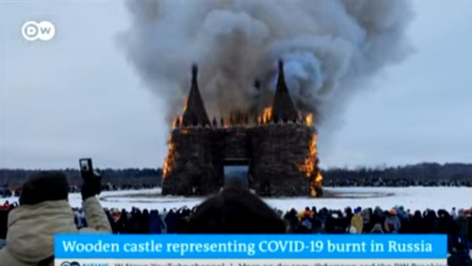

# Week 11

Jeans: "Mathematical analysis shows that if the centre of a star is
either liquid, or partially so, there is no danger of collapse; the
liquid center provides so firm a basis for the star, as to render the
collapse impossible".

---

"@internetofshit

i literally expect to wake up one day and my nest thermostat is going
to hold me hostage for a $10/month subscription, we live in the worst
timeline

'@Gizmodo Cricut Now Wants Users to Pay Extra for Unlimited Use of the
Cutting Machines They Already Own'"

---

'Scraping' means having a program visit a page and take its raw data,
leaving behind the visual elements.. like scraping paint off a wall.

---

```python
import pandas as pd
pd.set_option('display.max_columns', None)
df = pd.read_csv('gfp-2021.csv')
df = df[df.country.isin(['USA','Russia'])]
print (df[['country','Submarines']])
```

```text
   country  Submarines
0      USA        68.0
46  Russia        64.0
```

---

For military comparisons see [Global Firepower](https://www.globalfirepower.com/).
I scraped their site, [someone else](https://github.com/prasertcbs/basic-dataset/tree/master/GlobalFirePower)
did 2017, both versions are below in CSV format

[2017](gfp-2017.csv)
[2021](gfp-2021.csv)

Comparing both years cld be interesting. Did military budget increase
or decrease for country X?

---

I am pretty sure if there was a Greece-TR war, GR could manage to
tie.. In every metric I look at, innovation, GII, military hardware,
two countries are close. GDP/PerCap is in the same class basically
which is decidedly lightweight. Sameness on many fronts is another
indication of ppl / gov similarities, and that Anatolians culturally
belong to where they live, are not "migrants".

---

The fact that Taiwan is a natural fortress makes u think, people live
in these places and its probably for a good reason.. there is a
natural selection of locales?

---

Falcon, WSold not bad.. Takes place after the 1/2 humanity
disappearance was restored (another movie), and it looks like they are
using that event as parallel to a post covid world, talks of
restoration, etc. Show wasnt cuck, didnt use wormholes, time travel,
multiverse, so far. Solid sci can give enough fi, see.

---

"@isaiah_bb

Me watching The Lighthouse in 4:3: Haha fuck yeah!!! Yes!! 

Me watching Snyder's Justice League in 4:3: Well this fucking sucks. What the fuck"

---

Snyder Cut JL, better than the prev version. Storylines make more
sense. It is long tho.

---

<blockquote class="twitter-tweet"><p lang="en" dir="ltr">The future has begun! 💧<a href="https://twitter.com/hashtag/MissionH24?src=hash&amp;ref_src=twsrc%5Etfw">#MissionH24</a> <a href="https://twitter.com/hashtag/Hydrogen?src=hash&amp;ref_src=twsrc%5Etfw">#Hydrogen</a> <a href="https://t.co/EZyI4cW732">pic.twitter.com/EZyI4cW732</a></p>&mdash; Mission H24 (@MissionH24) <a href="https://twitter.com/MissionH24/status/1372579434419658758?ref_src=twsrc%5Etfw">March 18, 2021</a></blockquote> <script async src="https://platform.twitter.com/widgets.js" charset="utf-8"></script>

---

<blockquote class="twitter-tweet"><p lang="en" dir="ltr">NEW: I saved this one up for the US morning, because it’s a big &quot;good Covid news&quot; moment for our friends across the Atlantic<br><br>A &quot;vaccine effect&quot; is now clear in US data, with hospitalisations falling faster among the old (mostly vaccinated) than the young <a href="https://t.co/3qZYpUGClA">https://t.co/3qZYpUGClA</a> <a href="https://t.co/JOfIMbR85t">pic.twitter.com/JOfIMbR85t</a></p>&mdash; John Burn-Murdoch (@jburnmurdoch) <a href="https://twitter.com/jburnmurdoch/status/1372540703188860940?ref_src=twsrc%5Etfw">March 18, 2021</a></blockquote> <script async src="https://platform.twitter.com/widgets.js" charset="utf-8"></script>

---

CNBC: "Hydrogen is currently the only solution to decarbonize some
industries, RWE exec says"

[Link](https://www.cnbc.com/amp/2021/03/16/hydrogen-only-current-solution-to-decarbonize-some-industries-exec-says.html)

---

[What of it?](../../2021/03/unrivaled-beckley.html#chru)

"But what of the China-Russia alliance?"

---

There r some weird storage methods .. eg "pumped hydro". They just
lift up bunch of water, thats it. Water's "potential energy" is
stored, to take back energy, just allow it to go down.  Not bad, but
just like the Li-on batteries, it is a circus monkey. Too specialized,
doing only one thing.

---

"@FORESIGHTdk

While there are electronic, mechanical, kinetic, and other creative
methods to store power, chemical #storage has the greatest propensity
for widespread use, says @ReshefRami, CEO at Israeli fuel cell
manufacturer @gencellenergy"

---

Light Through The Veins (Tom Middleton Remix) \#music

[Link](https://youtu.be/eo99GxHgseY?t=202)

---

Anti-lessons from TR; keep national narrative / identity as simple as
possible, dont overload it with [political preferences](../../2020/04/turks-culture-national-narrative.html#add1).
Imbuing political choices on identity can turn it into a fascist
propaganda tool.

---

Some components of GII.. 

```python
df.columns
```

```text
Out[1]: 
Index(['index', 'Country', 'GII', ' Innovation Efficiency Ratio',
       ' Innovation Input Sub-index', ' Innovation Output Sub-index',
       'Institutions(ranking)', 'Human capital and research(ranking)',
       'Infrastructure(ranking)', 'Market sophistication(ranking)',
       'Business sophistication(ranking)',
       'Knowledge and technology outputs(ranking)', 'Creative outputs',
       'Institutions(value)', 'Human capital and research(value)',
       'Infrastructure(value)', 'Market sophistication(value)',
       'Business sophistication(value)',
       'Knowledge and technology outputs(value)', 'Creative outputs(value)'],
      dtype='object')
```

---

Just found out about [Global Innovation Index](https://www.wipo.int/global_innovation_index/en/2020/). 

Someone shared its data on [GH](https://github.com/avinzons/GIIDataViz/), local
version [here](GII-2021.csv).

```python
import pandas as pd

df = pd.read_csv('GII-2021.csv')
df = df.rename(columns={' Global Innovation Index':'GII', 'Unnamed: 0': 'Country'})
df = df.sort_values('GII',ascending=False)
df = df.reset_index()
df = df[df.Country.isin(['United States', 'Korea, Republic of', 'Netherlands', 'Turkey'])]
print (df[['Country']])
```

```text
               Country
2          Netherlands
3        United States
10  Korea, Republic of
42              Turkey
```

TR is just f-ing drownin.. NL, not bad. 

---

<blockquote class="twitter-tweet"><p lang="en" dir="ltr"><a href="https://twitter.com/hashtag/TECO2030?src=hash&amp;ref_src=twsrc%5Etfw">#TECO2030</a> sets plan to establish Norway&#39;s first large-scale production of <a href="https://twitter.com/hashtag/hydrogenfuelcells?src=hash&amp;ref_src=twsrc%5Etfw">#hydrogenfuelcells</a>. <a href="https://t.co/qmIGegVhue">https://t.co/qmIGegVhue</a><a href="https://twitter.com/hashtag/FuelCellsNow?src=hash&amp;ref_src=twsrc%5Etfw">#FuelCellsNow</a></p>&mdash; Nuvera Fuel Cells (@NuveraH2) <a href="https://twitter.com/NuveraH2/status/1372250431825571849?ref_src=twsrc%5Etfw">March 17, 2021</a></blockquote> <script async src="https://platform.twitter.com/widgets.js" charset="utf-8"></script>

---

Reuters: Germany and Canada agreed on Tuesday to explore the joint development of green hydrogen from Canadian hydroelectric power for export to Germany.

---

"@jonty

Out of curiosity I dug into how NFT's actually reference the media
you're 'buying' and my eyebrows are now orbiting the moon

Short version:

The NFT token you bought either points to a URL on the internet, or an
IPFS hash. In most circumstances it references an IPFS gateway on the
internet run by the startup you bought the NFT from"

[Link](https://twitter.com/jonty/status/1372163423446917122)

---

Yea.. that sounded like a potential future change in the filibuster
rules \#ABC

---

Vice: "A surveillance contractor ... is advertising a product that it
says can locate the real-time locations of specific cars in nearly any
country on Earth."

[Link](https://www.vice.com/en/article/k7adn9/car-location-data-telematics-us-military-ulysses-group)

---

"@nickgutteridge

Von der Leyen says the EU could seize production of vaccines and
suspend intellectual property rights"

---

More teachers.. better teachers..? When horse carrieges gave way to
cars, 'better' or 'more' horses talk became moot. 

---

Developing a new appreciation for French press coffee.. When I started
drinking more java at home but didnt want an whole hunking coffee
machine. FP did the job with acceptable quality and cheap equipment.

---

<blockquote class="twitter-tweet"><p lang="en" dir="ltr">How to win friends &amp; influence people, China edition. <a href="https://t.co/nk5CUeUloJ">https://t.co/nk5CUeUloJ</a></p>&mdash; Tanvi Madan (@tanvi_madan) <a href="https://twitter.com/tanvi_madan/status/1372309749790871554?ref_src=twsrc%5Etfw">March 17, 2021</a></blockquote> <script async src="https://platform.twitter.com/widgets.js" charset="utf-8"></script>

---

US support for China since the 70s might have another logic in it 🤔
besides containing Russia. Lets say u are US, and want to be included
in a region. Which country would you support in that region?  Answer:
the one that is surrounded by 19 countries who are hostile to it. Then
once that country gets stronger, everyone in the region will freak
out, and call the superpower for help (as they should). 

CH doesnt have to play this game. Work on your pluralism,
democracy. 

---

Beckley: "China may have the world’s biggest economy and military, but
it also leads the world in debt; resource consumption; pollution;
useless infrastructure and wasted industrial capacity; scientific
fraud; internal security spending; border disputes... China also uses
seven times the input to generate a given level of economic output as
the United States and is surrounded by nineteen countries, most of
which are hostile toward China, politically unstable, or both"

---

"US warns China it will enforce sanctions on Iran oil shipments"

---

"Oh but there is a formula for vaccs?" Same for Coca-Cola. Arent there
urban legends around that? "Bro it's sooo secret, it is kept at
[insert weird vault locale]"

---

Vaccine shortages in so many countries. Unbelievable..

Coca-Cola can shit out its shit product to the tune of 1 billion A
DAY, but we cant make potentially life saving drug for everyone fast
enough? And this is after *a year* has passed. Good to see capitalism
has its priorities straight.. Sugared water vs life saving
drug. Mmmm... "I'll go with sugared water".

---

<blockquote class="twitter-tweet"><p lang="en" dir="ltr"><a href="https://twitter.com/hashtag/hydrogen?src=hash&amp;ref_src=twsrc%5Etfw">#hydrogen</a> <a href="https://twitter.com/hashtag/fuelcell?src=hash&amp;ref_src=twsrc%5Etfw">#fuelcell</a> buses are excellent, here in <a href="https://twitter.com/hashtag/Aberdeen?src=hash&amp;ref_src=twsrc%5Etfw">#Aberdeen</a> we have years of experience with them and are thrilled with the news that they will be more common place across the UK<a href="https://t.co/CL1RJs6fNp">https://t.co/CL1RJs6fNp</a> <a href="https://twitter.com/Fuelcellbus?ref_src=twsrc%5Etfw">@Fuelcellbus</a> <a href="https://twitter.com/fch_ju?ref_src=twsrc%5Etfw">@fch_ju</a> <a href="https://twitter.com/hashtag/sustainabletransport?src=hash&amp;ref_src=twsrc%5Etfw">#sustainabletransport</a></p>&mdash; H2Aberdeen (@H2Aberdeen) <a href="https://twitter.com/H2Aberdeen/status/1371844536985587716?ref_src=twsrc%5Etfw">March 16, 2021</a></blockquote> <script async src="https://platform.twitter.com/widgets.js" charset="utf-8"></script>

---

<blockquote class="twitter-tweet"><p lang="en" dir="ltr">We are very grateful &amp; overwhelmed by the media coverage we have received for our efforts to include <a href="https://twitter.com/hashtag/Hydrogen?src=hash&amp;ref_src=twsrc%5Etfw">#Hydrogen</a> Fuel Cell Vehicles &amp; H₂ refuelling infrastructure within the ambit of FAME India scheme so that government benefits may be passed on to such H₂ programs. 🙏 <a href="https://t.co/zP9W0fyDhH">pic.twitter.com/zP9W0fyDhH</a></p>&mdash; Fuel Cell India 🇮🇳 (@FCIndia_) <a href="https://twitter.com/FCIndia_/status/1371714241506385920?ref_src=twsrc%5Etfw">March 16, 2021</a></blockquote> <script async src="https://platform.twitter.com/widgets.js" charset="utf-8"></script>

---

This is a vital pt that bears repeating: freedom costs less. Nothing
to admire about the CH system, as they spend half their money and
energy on internal security.

---

"@kurtopsahl

Authoritarians don’t like end-to-end encryption.

'China appears to have blocked Signal, the encrypted chat app'"

---

"@MEPFuller

Just saw a Fairfax County school bus pick up a bunch of little kids,
and two parents high-fived after the bus pulled away"

---

"Compressed green hydrogen ship for Aussie exports deemed ‘highly
competitive’’

[Link](https://www.pv-magazine-australia.com/2021/03/02/compressed-green-hydrogen-ship-for-aussie-exports-deemed-highly-competitive/)

---

♪♬ Who's the cat that won't cop out

♪♬ When there's danger all about?

♪♬ White Shaft

Right on 👉

---

Why gender swap, race swap existing characters?

I wonder how people would react if we modified female, or black
characters. Lets say, I take Andy Dick, and make him White
Shaft. Would black people like that?  Imagine the scene, bar door
swings open, and this guy walks in with the shades on, has the leather
jacket.. the music playing wha wha-wha-wha wha wha AD walking with
that strut.. How would that go down? That would be insane right?

---

"If Penthouse suddenly switched all of its glossy double-page spreads
to abs and cocks, you’d expect some backlash. A few awkward
silences. Probably a sharp drop in subscriptions.

Does this make its readers a pack of bigots, misandrists, and
man-hating homophobes burdened by fragile sexuality? No. They were
simply looking for something else. The magazine’s target audience has
an established sexual preference, confirming the old adage ‘sex
sells!’ is as true for Penthouse as it is for a fifty-year-old science
fiction show.

Doctor Who is the James Bond of the geek world – men want to be him,
and girls want to shag him. I can’t speak for the boys, but who
doesn’t want a gorgeous, older boyfriend with a time machine, infinite
bank balance, no job, endless adventure, and a demi-god status in the
universe? He is an inconvenient sexual fantasy that contradicts the
preferred social politics of the BBC, despite being its flagship show.

It is no accident that ratings soared when Scottish heart-throb David
Tennant took over the role in 2005 alongside his young, attractive
female companion Billie Piper. Their will-they, won’t-they romantic
tragedy elevated the BBC production out of the fringe geek world and
into the mainstream market of swooning teenagers.... 

2018 saw the progressive agenda inside the BBC hit peak woke –
cannibalising their golden goose. The desire to promote inclusivity
with casting choices, led new showrunner Chris Chibnall to hire Jodie
Whittaker as the first female Doctor. Token casting is normally fatal
but identifying as a taxpayer parasite makes it impossible for the BBC
to ‘go broke’ like its corporate peers. This artificial survival
allowed us to watch the gender-bender experiment play out to hilarious
disparities between glowing critical reviews and god-awful audience
scores that were so bad BBC management kept deleting them"

[Link](https://www.penthouse.com.au/articles/opinion/doctor-what-is-that)

---

"Nuvera® E-Series Fuel Cell Engines for heavy-duty applications allow
port operators to comply with tightening emissions regulations and
mandates and remain economically competitive"

[Link](https://www.nuvera.com/ports)

---

Andy Dick is it? 

---

 :) That guy has good physical comedy chops \#Trek

[Vid](https://youtu.be/7FJuFONaQBo?t=23)

---

Beckley: "The U.S. military ... can sink Chinese ships and submarines
virtually anywhere in East Asia. The main reason is that the United
States has dozens of missile-armed submarines that are almost
invulnerable to China’s notoriously weak antisubmarine
capabilities. In wartime, U.S. submarines, with the aid of America’s
vast undersea surveillance network in East Asia, could set up picket
lines near the combat theater, or near China’s ports, and sink China’s
ships and submarines with torpedoes, missiles, and mines"

---

Beckley: "Taiwan retains enduring advantages that could make the island
virtually unconquerable—provided that Taipei and Washington capitalize
on them. Armadas of the kind China would need to invade or blockade
Taiwan are extremely vulnerable to modern missiles and
mines. Meanwhile, the Taiwan Strait is perilous—typhoons and 20-foot
waves are common most of the year—and Taiwan itself is a natural
fortress. Its east coast consists of steep cliffs, and its west coast
is dominated by mud flats that extend miles out to sea and are
buffeted by severe tides. As a result, there are only a dozen beaches
on Taiwan where an invading force could even land.

Taiwan’s defenders also have history on their side. No blockade in the
past 200 years has coerced a country into surrendering its
sovereignty, and there has been only one successful amphibious
invasion of a developed nation in modern history (the Allied invasion
of Italy in 1943). All other successful amphibious assaults were
against overstretched forces defending hastily dug positions on
foreign or contested territory with small arms. If China invaded
Taiwan today, it would be attacking massed forces defending fortified
positions on home soil with precision-guided munitions"

[Link](https://foreignpolicy.com/2020/10/19/china-keeps-inching-closer-to-taiwan/)

---

Redtenbacher's Funkestra - Cave Canem \#music

[Link](https://youtu.be/JR2oGJ2verg)

---

"@stephendziedzic

Golly. Scott Morrison told joint party room that the Quad leaders'
meeting was 'the most significant thing to have occurred to protect
Australia's security and sovereignty since ANZUS'"

---

Minimum wage in Canada is $8.88?

---

<blockquote class="twitter-tweet"><p lang="en" dir="ltr">non-fungible token --&gt; non-avoidable wealth tax</p>&mdash; Gabriel Zucman (@gabriel_zucman) <a href="https://twitter.com/gabriel_zucman/status/1370175520516632580?ref_src=twsrc%5Etfw">March 12, 2021</a></blockquote> <script async src="https://platform.twitter.com/widgets.js" charset="utf-8"></script>

---

"@theappeal

A new study suggests large chunks of police work can be safely
transitioned to non-police public safety workers: Across five cities,
between 23 and 45 percent of 911 calls were for issues like noise
complaints, disorderly conduct, and wellness checks"

---

"@JStein_WaPo

NEW: In every corner of the globe, taxes on multinational corporations
have gone down, down, down... Janet Yellen's big objective: Get the
world to agree to end the "race to the bottom" w/ a new minimum tax"

---

Siena: "By 48-34 percent, [voters say Cuomo] can continue to
effectively do his job as governor."

[Link](https://scri.siena.edu/2021/03/15/voters-say-cuomo-should-not-resign-50-35/)

---

"A public utility in northern Central Washington broke ground Monday
for a hydrogen production facility. It’s one of several related
actions in the Pacific Northwest that reflect renewed interest in
hydrogen as a clean alternative fuel.. The Douglas County Public
Utility District is spending around $20 million to build its renewable
hydrogen production plant on the east bank of the Columbia River north
of Wenatchee"

[Link](https://www.opb.org/article/2021/03/09/hydrogen-production-washington-oregon-renewed-look/)

---

CNBC: "India’s newfound focus on “green hydrogen” has received a
boost, with a new collaboration between two firms aiming to install
production facilities in the state of Tamil Nadu. "

[Link](https://www.cnbc.com/2021/03/10/india-turns-to-green-hydrogen-in-a-bid-to-decarbonize-its-economy.html)

---

CNBC: "German steel powerhouse turns to ‘green’ hydrogen produced
using huge wind turbines"

[Link](https://www.cnbc.com/2021/03/12/german-steel-firm-uses-green-hydrogen-produced-with-wind-turbines.html)

---

"GenCell Energy, GNCL (TASE), a leading Israel-based manufacturer of
fuel cell energy solutions, today announces the successful completion
of the design and synthesis of a catalyst that is not based on noble
metals (palladium) and as such provides an economical substitute for
these materials. The process by which the new catalyst accelerates
chemical reactions that are necessary to generate clean electricity
via electrochemical reaction inside the fuel cell is identical to the
process using a catalyst based on noble metals"

[Link](https://www.gencellenergy.com/news/gencell-completes-design-and-synthesis-of-a-noble-metal-free-palladium-catalyst/)

---

Daam. A big [check](twimg/Ewekxk5WgAEsOTW.jpg).

(.. meat sushi?)

---

An FT writer is being skooled

[Link](https://twitter.com/PaulEremenko/status/1371518517724422146)

---

We encourage certain biz behaviours all the time.. There is food
safety, regulations.. We already punish prods that might *kill you*
over others who dont.

---

We can encourage 'recyclable capitalism' by rewarding comps whose
output is more recyclable. How? Look at the "garbage stats"... Find
out whose products generate most single-use plastic, other
hard-to-recycle items in the garbage plants, tax their ass.

---

Fin ppl shouldnt be too happy on Yellen just yet, but EW ppl in admin
is a win for progs

"@Zachary

Wall Street was relieved when @SenWarren was passed over for Treasury
secretary. But now the financial industry faces another threat:
President Biden is enlisting a small army of her former aides and
allies to run his government"

---

45 psi is 3 bars? Regular air outside is 1 bar, so take air, reduce
its volume by 1/3 (bcz $PV = nRT)$, that is enough pressure for a good
mechanic push.

We know thats doable of course from break-barrel airguns, some use
compressed gas.

---

Oz official says didnt see problems with AstZen vacc so far

---

All of a sudden UK is getting hammered from all directions.. Royal
racism claims, then AstraZeneca vacc defect claims, and now Irish
border issues heating up with EU.

---

He is clearly into fuels, so wld be into an H2 based econ (didnt
Mercedes give him a fuel-cell car?)

"Kretschmann has mass appeal in Germany's conservative south and is
more popular there than the party he represents. An opinion poll by
German public broadcaster ZDF in February showed that while 30.3
percent of the electorate polled in Baden-Württemberg planned to vote
for the Greens, 70 percent wanted Kretschmann as state premier.. He is
a committed environmentalist and social liberal, but talks openly
about his diesel-fueled car"

---

<blockquote class="twitter-tweet"><p lang="en" dir="ltr">Canada to sign agreement with Germany on joint push to develop hydrogen market - <a href="https://t.co/FC7T95XciA">https://t.co/FC7T95XciA</a><a href="https://twitter.com/hashtag/Canada?src=hash&amp;ref_src=twsrc%5Etfw">#Canada</a> <a href="https://twitter.com/hashtag/Germany?src=hash&amp;ref_src=twsrc%5Etfw">#Germany</a> <a href="https://twitter.com/hashtag/Hydrogen?src=hash&amp;ref_src=twsrc%5Etfw">#Hydrogen</a> <a href="https://t.co/o7jERv56JD">pic.twitter.com/o7jERv56JD</a></p>&mdash; CHFCA (@PoweringNow) <a href="https://twitter.com/PoweringNow/status/1371472049575653377?ref_src=twsrc%5Etfw">March 15, 2021</a></blockquote> <script async src="https://platform.twitter.com/widgets.js" charset="utf-8"></script>

---

"Globally, there are now 228 large-scale projects for a combined $US300
billion of proposed investment through to 2030, according to the
Hydrogen Council.. these are some of the stocks to watch.
 

HAZER GROUP (ASX:HZR)

HEXAGON ENERGY MATERIALS (ASX: HXG)

GLOBAL ENERGY VENTURES (ASX:GEV)

PROVINCE RESOURCES (ASX:PRL)"

[Link](https://stockhead.com.au/energy/these-asx-stocks-want-a-piece-of-the-us300-billion-hydrogen-sector/)

---

"@ArmstrongDrew

VACCINE DATA UPDATE (March 13)

Record day of reported vaccinations, with 4.6M. 50% higher than past
2.9M record... "

---

<blockquote class="twitter-tweet"><p lang="en" dir="ltr">Whistle-blower says Credit Suisse helped Americans evade taxes,�after promising to stop in 2014<a href="https://t.co/xhUHkLehF8">https://t.co/xhUHkLehF8</a></p>&mdash; Gabriel Zucman (@gabriel_zucman) <a href="https://twitter.com/gabriel_zucman/status/1370936648377061377?ref_src=twsrc%5Etfw">March 14, 2021</a></blockquote> <script async src="https://platform.twitter.com/widgets.js" charset="utf-8"></script>

---

"U.S. Secretary of State Antony Blinken on Wednesday (March 10)
referred to Taiwan as a country, a label usually avoided by his
predecessors"

[Link](https://www.taiwannews.com.tw/en/news/4148761)

---

Couldnt they just set up one of those fake flames, a piece of cloth
flapping away, with red lighting underneath, wind blowing etc..? C'mon
man.. 

---

Hey thats lota of carbon, asshole.



---

I wonder if there is a town named Douche somewhere. Then u cld have
Duke and Duchess of Douche.

---

Douche means "shower" in French, right? So not a curse word on them
really.

---

"@ds_wats0n

Day light savings is an unnecessary relic of the early industrial age
and also it's just v annoying"

---

Gross measures and other beliefs "trickle down" from academia to
journos who repeat what they get from "upstream". Left unchecked such
info can cause nonsense to become entrenched eg neophyte can conclude
"mo ppl no mo problems". Esp watch for Tom Friedman-like glib jagoffs,
pop philosoph journos who fashion themselves "thinkers" but are merely
adept at slapping catchy book titles on stuff trickling down. Then,
anyone who is able to question the base assumptions of the measures in
research, needs to do so. Quash this shit at its source.

---

Just saw Russio-Otto war of 1828/29 in the conflict prediction
[data](../../2021/03/power-of-nations-beckley-code.html).. Otto got its
ass kicked on that one... Beckl measure predicts 0.94 (out of 1)
win for Russia. Doh!

---

"Germany seeks to be vaccine self-sufficient by next year"

---

Checked Beckley's theory with data.. Result validates his claim. GDP *
GDP Per Capita is a better indicator than CINC or GDP alone. See
[post](../../2021/03/power-of-nations-beckley-code.html).

---

