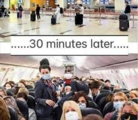
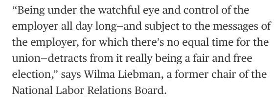

# Week 15

Having worked on control code for inverted pendulum, can say this is awesome

<iframe width="340"  src="https://www.youtube.com/embed/cyN-CRNrb3E?start=4" title="YouTube video player" frameborder="0" allow="accelerometer; autoplay; clipboard-write; encrypted-media; gyroscope; picture-in-picture" allowfullscreen></iframe>

---

CJR: "As discussions on how to help save local news continue, new
bills and ideas have come to the fore. Independent newspapers are
coalescing around the Local Journalism Sustainability Act which
proposes direct subsidies (in the form of tax credits) for news
subscribers, local journalists and small business advertisers. Sweden
has a similar news subsidy system.

Large media outlets are backing the Journalism Competition and
Preservation Act which will allow outlets to band together to
negotiate with Google and Facebook. In some ways this is like
Australia’s recent News Media and Digital Platforms Mandatory
Bargaining Code"

[Link](https://www.cjr.org/business_of_news/how-to-fund-local-news.php)

---

Another former Airbus CTO, pursuing my favorite first element

"@graziavittadini

The ultimate vision is zero emission.

One main key is \#hydrogen"

---

Yea thats f...d up. They destroyed that guy jus bcz he was successful
against them in the court of law.

Jacobin: "When human rights lawyer Steven Donziger won a
multibillion-dollar lawsuit against the oil giant Chevron, the company
retaliated by setting out to destroy Donziger’s life. Now in his
twentieth month of house arrest on the orders of a Chevron-linked
judge, his Kafkaesque story is a window into the corrupt and
corporate-captured US legal system"

---

"EU-UK talks over Brexit fail to reach breakthrough.. Top European
Union and British officials failed to get a breakthrough at talks on
Northern Ireland trade rules"

---

<blockquote class="twitter-tweet"><p lang="en" dir="ltr">AHC member H2U will be joining forces with RWE to develop hydrogen trading between Australia and Germany. The new MoU will involve the production and export of <a href="https://twitter.com/hashtag/hydrogen?src=hash&amp;ref_src=twsrc%5Etfw">#hydrogen</a> at the Eyre Peninsula Gateway in South Australia. Well done to all involved. <a href="https://t.co/buuh5yAhKz">https://t.co/buuh5yAhKz</a></p>&mdash; Australian Hydrogen Council (@H2MobilityAus) <a href="https://twitter.com/H2MobilityAus/status/1382929898457636866?ref_src=twsrc%5Etfw">April 16, 2021</a></blockquote> <script async src="https://platform.twitter.com/widgets.js" charset="utf-8"></script>

---

39,700 kilometers! That is enough pipeline to circle to globe! 

"@H2Europe

The EU \#Hydrogen Backbone initiative updated its vision for a
dedicated #H2 transport infrastructure across Europe. The group
proposes a hydrogen network of 39,700km by 2040"

---

"@ExpressDrives

Hydrogen-fuel cell cars likely to fall under FAME II rules: Huge
benefits possible [India]"

[Link](https://twitter.com/ExpressDrives/status/1382656082040950787)

---

🤣 

<blockquote width="200" class="twitter-tweet"><p lang="en" dir="ltr">&quot;I think that was vodka that&#39;s now in my eye.&quot;<br><br>Our correspondent <a href="https://twitter.com/olivermiocic?ref_src=twsrc%5Etfw">@olivermiocic</a> has been covering today&#39;s protests from Lyon. Things got messy a few times. <a href="https://twitter.com/hashtag/greve5decembre?src=hash&amp;ref_src=twsrc%5Etfw">#greve5decembre</a> (pension reforms strikes) <a href="https://t.co/BwqJUhkrAr">pic.twitter.com/BwqJUhkrAr</a></p>&mdash; euronews (@euronews) <a href="https://twitter.com/euronews/status/1202592072806612994?ref_src=twsrc%5Etfw">December 5, 2019</a></blockquote> <script async src="https://platform.twitter.com/widgets.js" charset="utf-8"></script>

---

<blockquote class="twitter-tweet"><p lang="en" dir="ltr">The EU <a href="https://twitter.com/hashtag/Hydrogen?src=hash&amp;ref_src=twsrc%5Etfw">#Hydrogen</a> Backbone initiative updated its vision for a dedicated <a href="https://twitter.com/hashtag/H2?src=hash&amp;ref_src=twsrc%5Etfw">#H2</a> transport infrastructure across Europe. The group proposes a hydrogen network of 39,700km by 2040, with further growth expected after 2040. This grid connects 21 ?? countries.<a href="https://t.co/WbLo5y9nms">https://t.co/WbLo5y9nms</a> <a href="https://t.co/43DRmGv0Pb">pic.twitter.com/43DRmGv0Pb</a></p>&mdash; Hydrogen Europe (@H2Europe) <a href="https://twitter.com/H2Europe/status/1382636089475747847?ref_src=twsrc%5Etfw">April 15, 2021</a></blockquote> <script async src="https://platform.twitter.com/widgets.js" charset="utf-8"></script>

---

"@H2Standard

Loop Energy and BayoTech have entered into a #hydrogen vehicle
deployment agreement focusing on #fuelcell vehicles and #h2
infrastructure. Purpose is to build 360-degree ecosystem incl service
providers, fueling solutions and component suppliers"

[Link](https://bit.ly/3wRoboZ)

---

Didnt QE say about the 2008 crisis 'it's awful - Why did nobody see it
coming?' That sounds like this is not someone who likes to remain
up-to-date on matters, but *has* to

---

What is more surprising to me is *how come this wasn't known before*?

"Now we know that the mysterious ‘Queen’s consent’ is more than just a
procedural formality, it must be scrapped.. The anti-democratic
potential of the consent process is obvious: it gives the Queen a
possible veto, to be exercised in secret, over proposed laws"

[Link](https://www.theguardian.com/commentisfree/2021/feb/08/queen-power-british-law-queens-consent)

---

<blockquote class="twitter-tweet"><p lang="en" dir="ltr">Hyped on <a href="https://twitter.com/hashtag/hydrogen?src=hash&amp;ref_src=twsrc%5Etfw">#hydrogen</a>? Read our latest in-focus article and find out how hydrogen ⚡️ will <a href="https://twitter.com/hashtag/decarbonise?src=hash&amp;ref_src=twsrc%5Etfw">#decarbonise</a> the EU 🇪🇺 economy and drive the green 💚 <a href="https://twitter.com/hashtag/energytransition?src=hash&amp;ref_src=twsrc%5Etfw">#energytransition</a>! <a href="https://t.co/EALJRmWUAI">https://t.co/EALJRmWUAI</a> <a href="https://twitter.com/hashtag/EUGreenDeal?src=hash&amp;ref_src=twsrc%5Etfw">#EUGreenDeal</a> <a href="https://twitter.com/hashtag/ClimateNeutralEU?src=hash&amp;ref_src=twsrc%5Etfw">#ClimateNeutralEU</a> <a href="https://t.co/r2cWHHmyCQ">pic.twitter.com/r2cWHHmyCQ</a></p>&mdash; Energy4Europe 🇪🇺 (@Energy4Europe) <a href="https://twitter.com/Energy4Europe/status/1382326600616841224?ref_src=twsrc%5Etfw">April 14, 2021</a></blockquote> <script async src="https://platform.twitter.com/widgets.js" charset="utf-8"></script>

---

"@JosephEStiglitz

Intellectual property rights for Covid-19 vaccines must be suspended
to boost inoculation rates around the world. It's that simple"

---

"Former world leaders urge Biden to waive COVID vaccine patents More
than 170 former world leaders and Nobel laureates say waiver is key to
ramp up global vaccine production. At the current rate, the world’s
poorest nations will have to wait until at least 2024 to reach 'mass
immunisation', the signatories, which included former UK Prime
Minister Gordon Brown, ex-French President François Hollande and
Muhammad Yunus, winner of the Nobel Peace Prize"

[Link](https://www.aljazeera.com/news/2021/4/14/world-leaders-call-on-biden-authorise-covid-vaccine-patent-waiver)

---

Little TR [translation](https://muratk3n.github.io/thirdwave/tr/2020/07/gocebele-anadolu.html)

---

<blockquote class="twitter-tweet"><p lang="en" dir="ltr">North QLD will soon be home to the production and export of renewable <a href="https://twitter.com/hashtag/hydrogen?src=hash&amp;ref_src=twsrc%5Etfw">#hydrogen</a> thanks to an MoU between <a href="https://twitter.com/townsvilleport?ref_src=twsrc%5Etfw">@townsvilleport</a> and <a href="https://twitter.com/originenergy?ref_src=twsrc%5Etfw">@originenergy</a>. The partnership will play a key role in the development of QLD’s <a href="https://twitter.com/hashtag/H2?src=hash&amp;ref_src=twsrc%5Etfw">#H2</a> industry as a whole. <a href="https://t.co/CmmZ5jCGz6">https://t.co/CmmZ5jCGz6</a></p>&mdash; Australian Hydrogen Council (@H2MobilityAus) <a href="https://twitter.com/H2MobilityAus/status/1382155646330494976?ref_src=twsrc%5Etfw">April 14, 2021</a></blockquote> <script async src="https://platform.twitter.com/widgets.js" charset="utf-8"></script>

---

"Breaking Tech Open: Why Social Platforms Should Work More Like Email
Email is a stable, decentralized technology that spurs
interoperability and competition, presenting a model for other
internet technologies"

[Link](https://thereboot.com/breaking-tech-open-why-social-platforms-should-work-more-like-email/)

---



---

I was rooting for the other guy but apparently it is right's turn

"Voters in Ecuador appeared to turn to a conservative businessman in
Sunday’s presidential runoff election, rebuffing a leftist movement
that held the presidency for over a decade marked by an economic boom
and then a years-long recession"

---

That's a load of bullshit

---

???

"Brooklyn Center Police says police shooting of Daunte Wright was ‘an
accidental discharge’ as officer intended to discharge a taser"

---

"@JosephEStiglitz

Saving Journalism: Should Other Countries Copy Australia’s News Media
Code? Thursday in NYC on April 15th"

[Link](https://mobile.twitter.com/JosephEStiglitz/status/1381583090276044802)

---

I am *not* iron man


---

Not into ironing.. 

"What is the one housekeeping work u never do?"

---

It's like Israelis. The Jews didnt "leave" the region, they converted and
[they stayed](../../2020/06/10-myths-israel.html). Leaving is hard, ppl usually dont.

---

Galatians 1st century are my people, as are everyone before and after
there. The current make up of Anatolia is composed of their
descendants and little of later arrivals, like some punks from
Punkbuttfuck from Central FuckFuck.

---

See, you dont start out just preachin with my people. You talk about
some food, some creole, some chicken wings.. Bring some grass for the
goat..  Then you seque into afterlife, right and wrong, etc..

---

Dam, Paul had it pretty bad in Galatia, today's Anatolia..

<iframe width="340" src="https://www.youtube.com/embed/NVB4jJaksJU?start=26&end=56" title="YouTube video player" frameborder="0" allow="accelerometer; autoplay; clipboard-write; encrypted-media; gyroscope; picture-in-picture" allowfullscreen></iframe>

---

Bloomberg: "Michelin Reinforces Bet on Hydrogen to Move Beyond Tires"

---

Hybrid btw fuel-cell and turbine? Cool.

This is what H2 brings to the table; flexibility, options.

<blockquote class="twitter-tweet"><p lang="en" dir="ltr">Airbus are getting serious about Hydrogen Hybrid aircraft - burning H2 in gas turbines AND having electric motor inputs. Could be a clever use of Green H2 in the drive for <a href="https://twitter.com/hashtag/NetZero?src=hash&amp;ref_src=twsrc%5Etfw">#NetZero</a>. <a href="https://t.co/sWrbFJVUfb">https://t.co/sWrbFJVUfb</a></p>&mdash; Graham Hodgson (@GraHod) <a href="https://twitter.com/GraHod/status/1381578306525523973?ref_src=twsrc%5Etfw">April 12, 2021</a></blockquote> <script async src="https://platform.twitter.com/widgets.js" charset="utf-8"></script>

---

"France to ban some domestic flights where train available.. MPs vote
to suspend internal flights if the trip can be completed by train
within two and a half hours instead"

---

Talked abt that before; see the [South Korean](../../0119/2018/06/guiding-regulation-south-korea.html)
example. It's the invisible hand approach, with a caveat, the invisible hand is
government's 😶

"How can government push for faster Internet speeds?"

---

I am not saying make war, but if there was war, it wld not be good for Iran.

---

US power is hundreds of times more than Iran's. Israel is way ahead of
them too (see [method](../../2021/03/power-of-nations-beckley-code.html))

```python
import pandas as pd
df = pd.read_csv('../../2020/07/gdpw.csv')
df = df[df['country'].isin(['United States','Iran','Israel']) ]
df['gdp'] = df.gdpcap * df.population
df['mb'] = (df.gdpcap * df.gdp)/1e14
print (df[['country','mb']])
```

```text
           country            mb
13   United States  12898.099255
31          Israel    145.850215
114           Iran     25.909706
```

---

Not true

"A war with Iran would be much, much harder than against Iraq"

---

"Churchill implored FDR to join the war", yes he did, and he [failed](https://youtu.be/kRzmpCE96kU).
FDR didnt listen to him. 

---

FDR did not want to fight in WWII. How do I know? Bcz he'd rather have
these monstrous "Liberty ships" built than send a single man to the
war.

[Link](https://youtu.be/8qDxqBvK3NA)

---

Aha

(Same 3/3 ukrweekly link) "The previous day, Crimean Tatars held their
biggest rally at the peninsula’s parliamentary building in Simferopol
in support of a unitary Ukraine"

---

Just bcz GDELT is "AI" u cant dive blindfolded.. The algos are nowhere
near close to being AI.

---

[Link](https://www.dropbox.com/scl/fi/58c5ail9mvbe0am8r8prf/spaz2.gif?rlkey=n68ilxxdrq8frd08hqcifoitm&raw=1)

---

This is fun.. research by GDELT.. The dataset surely contains more
interesting info than a random tuber throwing a fit or even some MSM.

---

Interesting.. for March 3rd, GDELT found [this](https://web.archive.org/web/20210307004657/http://www.ukrweekly.com/uwwp/ukraine-receives-additional-u-s-security-aid-while-biden-and-eu-prolong-russia-sanctions/)
and wrongly classified it as military escalation..
It is more like "cage rattling" I'd say.

---

GDELT uses news web pages as raw source, applies natural lang
processing algos on them to extract Actor1-Action-Actor2 type "events"
for ex "Thailand warned South Africa", where diplomatic "warn" is the
action.. There are mistakes sometimes. I had to go through every
result one by one to filter out such false positives.

---

@PaulEremenko of @Universal_H2 was the former CTO of @Airbus?

---

<blockquote class="twitter-tweet"><p lang="en" dir="ltr">European energy ministers have highlighted the need to create a stable regulatory framework for <a href="https://twitter.com/hashtag/hydrogen?src=hash&amp;ref_src=twsrc%5Etfw">#hydrogen</a> in the <a href="https://twitter.com/hashtag/EuropeanUnion?src=hash&amp;ref_src=twsrc%5Etfw">#EuropeanUnion</a>, capable of attracting private investors into a competitive and predictable market. 💧🇪🇺<a href="https://twitter.com/hashtag/HydrogenNow?src=hash&amp;ref_src=twsrc%5Etfw">#HydrogenNow</a> <a href="https://t.co/pvJciLaYDd">https://t.co/pvJciLaYDd</a></p>&mdash; Hydrogen Europe (@H2Europe) <a href="https://twitter.com/H2Europe/status/1381290716891127812?ref_src=twsrc%5Etfw">April 11, 2021</a></blockquote> <script async src="https://platform.twitter.com/widgets.js" charset="utf-8"></script>

---

"@fuelcellsworks

Solar-to-#Hydrogen Tech Increase Shows 100-fold Improvement in #Solar
Energy Conversion [using] a BaTaO2N photocatalyst"

---

"Billions of dollars of Iranian money continues to be frozen in South
Korean banks as its prime minister heads for talks"

---

Guy had a stroke in 2016, so it could just be health related

"Deputy Prime Minister Heng Swee Keat shocked the nation on Thursday,
announcing he will step aside as the designated successor to Prime
Minister Lee Hsien Loong"

---

Added new page for conflict stats

[Link](../../2019/05/confstats.html)

---

WTF happened to dry parsley flakes? The prod disappeared all markets
all of a sudden. God dam..

---

Via Bloomberg



---

Business Insider: "'Unions lose in 90% of the cases when management
opposes the organizing effort,' which Amazon's management did, Tom
Kochan, a professor of management at MIT, told Insider"

[Link](https://www.businessinsider.com/amazon-union-vote-bessemer-alabama-labor-law-experts-takeaways-2021-4)

---

Too bad the Amazon unionization effort failed.. But 'ppl have spoken'
is the wrong conclusion to draw here.. The system was favoring the
employer. Change of labor laws needed? AMZN clearly was the better
closer.

---

"Efficacy of a coronavirus vaccine from Sinovac has been found to be as
low as 50.4 percent by researchers"

---

It's possible GDELT missed something of course, it is an automated algo

---

Code

Flip the actors u can see the build-up (code 154) both ways.

Code 154 is "mobilization or increase of armed forces"

```python
import pandas as pd, zipfile
pd.set_option('display.max_columns', None)
pd.set_option('display.max_colwidth',-1)

dates = ['0331','0401'] # add more dates here w files

for dt in dates:
    with zipfile.ZipFile('gdelt/2021%s.export.CSV.zip' % dt, 'r') as z:
         df = pd.read_csv(z.open('2021%s.export.CSV' % dt),sep='\t',header=None)
    print (len(df.columns))
    urls = df[57]
    cols = ['GlobalEventID', 'Day', 'MonthYear', 'Year', 'FractionDate',\
           'Actor1Code', 'Actor1Name', 'Actor1CountryCode', 'Actor1KnownGroupCode',\
           'Actor1EthnicCode', 'Actor1Religion1Code', 'Actor1Religion2Code',\
           'Actor1Type1Code', 'Actor1Type2Code', 'Actor1Type3Code', \
           'Actor2Code', 'Actor2Name', 'Actor2CountryCode', 'Actor2KnownGroupCode',
           'Actor2EthnicCode', 'Actor2Religion1Code', 'Actor2Religion2Code',
           'Actor2Type1Code', 'Actor2Type2Code', 'Actor2Type3Code', \
           'IsRootEvent','EventCode', 'EventBaseCode']
    df2 = df[range(len(cols))]
    df2.columns = cols

    flt = (df2.EventCode==154) & (df2.Actor1Code=='RUS') & (df2.Actor2Code=='UKR')
    print (dt)
    df3 = df2[flt]
    if not df3.empty:
        print (df3[['Actor1Code','Actor2Code','EventCode','EventBaseCode']])
        url3 = urls[flt]
        print (url3)
```

---

I looked at GDELT [event files](http://data.gdeltproject.org/events/),
going back go March 1st; did not find any initial Ukraine
movement. The first time any build-up is reported in the region, in
the 1/3-1/4 timeframe, was April 1, by RUS. One of the news links
parsed by GDELT is [here](https://www.euractiv.com/section/global-europe/news/top-us-general-calls-russia-ukraine-amid-reported-moscow-troop-buildup/).

"In terms of the latest escalation, who is responsible? Who deployed
its military first?  Russia or Ukraine?"

---

Maybe the mechanical vs wild animal theme in scifi movies is a
throwback to that feeling, way of coping with insane recent
advances. It was mysterious to be scared of the beast? Now smaller
ones are causing more damage.


---

Largest whale in length, 30 meters. Aircraft carrier, over 300 meters
in length.  The masses dont even compare. Whale has no chance. Its
funny from a time where humans were afraid of monsters at sea, now we
have monsters of our own.

"Could a whale damage a ship? Like an aircraft carrier?"

---

Replacing lead pipes is a good thing sure.. Wasnt that the problem in
Flint Michigan?

---

"US senators on Thursday unveiled broad legislation on China that would
step up pressure over Beijing's alleged theft of intellectual property
and solidify US ties with Taiwan.

In a rare bipartisan initiative in the polarized Congress, the top
Democrat and Republican on the Senate Foreign Relations Committee
together presented the Strategic Competition Act which aims to govern
the fraught US relationship with Beijing.

'The United States government must be clear-eyed and sober about
Beijing's intentions and actions, and calibrate our policy and
strategy accordingly,' said Senator Bob Menendez, the Democrat who
leads the committee"

[Link](https://www.barrons.com/news/us-bill-to-pressure-china-on-trade-and-rights-back-taiwan-01617915009?tesla=y)

---

<blockquote class="twitter-tweet"><p lang="en" dir="ltr">A record-breaking commercial-scale <a href="https://twitter.com/hashtag/hydrogen?src=hash&amp;ref_src=twsrc%5Etfw">#hydrogen</a> plane has taken off in the UK, with more set to join it soon. <a href="https://twitter.com/hashtag/HydrogenNow?src=hash&amp;ref_src=twsrc%5Etfw">#HydrogenNow</a> <a href="https://twitter.com/hashtag/Aviation?src=hash&amp;ref_src=twsrc%5Etfw">#Aviation</a> <a href="https://twitter.com/BBC_Future?ref_src=twsrc%5Etfw">@BBC_Future</a> <a href="https://t.co/idfW3qWXod">https://t.co/idfW3qWXod</a></p>&mdash; Hydrogen Europe (@H2Europe) <a href="https://twitter.com/H2Europe/status/1380784367354658816?ref_src=twsrc%5Etfw">April 10, 2021</a></blockquote> <script async src="https://platform.twitter.com/widgets.js" charset="utf-8"></script>

---

"Greece, Israel Seal $1.6 Billion Defense Deal"

[Link](https://www.voanews.com/europe/greece-israel-seal-16-billion-defense-deal)

---

Gobble gobble, though not a great power, displays some of the same
behaviours lately.. Kabuki theather power, throwing its little kabuki
tantrum on the way down.

---

Beckley: "Historically, when fast-growing great powers slow down, they
do not mellow out. Instead, they become more repressive at home and
aggressive abroad. They crack down on domestic dissent and expand
overseas to find new sources of wealth, rally citizens around the
ruling regime, and deter foreign rivals from exploiting their economic
problems. China is already on this path—as its growth slows, it is
repressing freedom in the mainland and in Hong Kong, ramping up
pressure on Taiwan, colonizing the South China Sea, building the
largest navy in the world, and buying assets and building ports all
over the world"

---

ABC Oz Planet America is pretty good. They catch some interesting angles.

---

Reps started culling out some unwanted leaders for 2024 already? Gaetz
is hit pretty bad, nobody is coming to his defense. Clearing the path
for Ted? Pompeo?

---

Nincompoop? 😶

---

The Spirit of '75 (feat. Mustafa Akbar) \#music

[Link](https://youtu.be/doFad9LdZ_k)

---

C its possible to advocate for opportunities for everyone wout
resorting to cuck

---

sounds like discrimination, likely an oversight, but not cool

DW: "Study unveils Facebook gender bias in job ads A new study examined
Facebook's ad-delivery algorithms and found that some ads were
directed to a particular gender "beyond what can be legally justified"
by differences in job qualifications"

---


