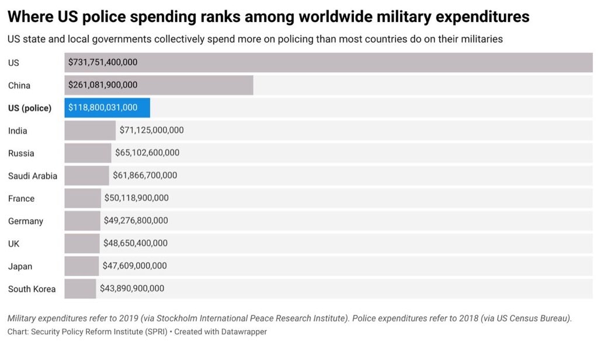

# Week 16

Wanna be outdoors, be outdoors. Hike, camp whatever. Be outdoors like
like a forager, the way we've lived for half a million years.

"But I want to be outdoors, work the land"

---

Since the approach is well contained and controlled, I bet it can be
fully automated one day.. Load up seeds from one end, come back in two
months to get your fully grown beans from the other end..

---

VF approach uses artificial light, artificial soil, utilizes less
water, it is a completely contained environment can be easier to
protect against chaotic weather, harmful instects (less need for
pesticides, another bonus).

---

---

"Vertical or indoor farming is increasingly heralded as the future of
modern agriculture... These companies have been able to raise millions
of dollars to expand their current facilities and establish new
ones...

Fundamental to the creation of a perfect indoor farming environment
for both small and large operations is the availability of affordable,
sophisticated lighting technologies. In fact, there are many different
types of grow lights... 

In its simplest definition, a grow light is an artificial source of
light, commonly an electric light, which is designed to stimulate the
growth of plants by emitting an electromagnetic spectrum perfect for
photosynthesis"

[Link](https://www.thebalancesmb.com/grow-light-options-for-indoor-and-vertical-farming-4147429)

---

---

---

Our focus is fundamental tech, not trinkets. 

---

Toiling away on a piece of land, throwing bunch of shit on the soil,
(pesticides etc seeping into the soil). Isnt this incredibly outdated?
Technology should transform this field..

---

<blockquote class="twitter-tweet">
It&#39;s pretty clean.
&mdash; Philip Bump (@pbump) <a href="https://twitter.com/pbump/status/1385253752685408260?ref_src=twsrc%5Etfw">April 22, 2021</a></blockquote> 

---

As the Oz Prime Minister says: "technology first"

---

"@PaulEremenko

Thoughtful piece from @timhepher at @Reuters captures key issue..
@Universal_H2 can decarbonize regional aviation in the 2020s--no
problem. The big challenge is to de-risk hydrogen for @Boeing &
@Airbus to make 737 & A320 successor in 2030s zero-emissions!"
Otherwise there's no way for aviation to meet Paris Agreement
targets. Synfuels and biofuels are a partial carbon offset scheme that
doesn't get us to the 1.5°C emissions trajectory. There just isn't
another way!

---

Reuters: "Universal Hydrogen, a U.S.-based firm planning to provide
hydrogen propulsion for regional aircraft, said on Thursday it would
accelerate development after raising $20.5 million in funds amid a
debate over carbon-free aviation"

---

On Wirecard fin troubles and Germany.. some of the self-flagellation is
probably unnecessary but interesting story 

[Link](https://newrepublic.com/article/162084/weird-extremely-german-origins-wirecard-scandal)

---

Cld insert all recent GDELT data files into a lite SQL DB, then
anytime something happens to a country can go back in time and find
all actions that was done to that country until that event, diplo
warnings, attacks, etc. look at the source groups and try to see
patterns.. \#ifIHadTheTime

---

<blockquote class="twitter-tweet">
I bought a desk light. then I opened the box and discovered I had to install an app to control my desk light
&mdash; Adrienne Porter Felt (@__apf__) <a href="https://twitter.com/__apf__/status/1385370756016611333?ref_src=twsrc%5Etfw">April 22, 2021</a></blockquote> 

---

<blockquote class="twitter-tweet">
Today is <a href="https://twitter.com/hashtag/EarthDay2021?src=hash&amp;ref_src=twsrc%5Etfw">#EarthDay2021</a>, and we&#39;re excited to announce our investment in <a href="https://twitter.com/Universal_H2?ref_src=twsrc%5Etfw">@Universal_H2</a>, which is working to make carbon-free commercial flight a near-term reality. Learn more about why we invested in <a href="https://twitter.com/jim_adler?ref_src=twsrc%5Etfw">@Jim_Adler</a>&#39;s blog post: <a href="https://t.co/o3njSNSuTP">https://t.co/o3njSNSuTP</a> <a href="https://t.co/UR17YlsaGo">pic.twitter.com/UR17YlsaGo</a>
&mdash; Toyota AI Ventures (@Toyota_AI_VC) <a href="https://twitter.com/Toyota_AI_VC/status/1385264096849715200?ref_src=twsrc%5Etfw">April 22, 2021</a></blockquote> 

---

"@JetBlueVentures

This #EarthDay we're excited to announce our investment in
@Universal_H2 as part of our growing portfolio to support @JetBlue's
ambitious sustainability strategy!"

---

NYT: "Seven House Republicans pledge to take no donations from major tech companies."

---

<blockquote class="twitter-tweet">
At Sunfire, everyday is <a href="https://twitter.com/hashtag/EarthDay?src=hash&amp;ref_src=twsrc%5Etfw">#EarthDay</a> With our electrolysis solutions we help CO2-intensive industries to become carbon-neutral. A world without fossil fuels - this is our vision, continuously motivating and uniting us at Sunfire. Will you join the <a href="https://twitter.com/hashtag/GreenHydrogen?src=hash&amp;ref_src=twsrc%5Etfw">#GreenHydrogen</a> revolution? <a href="https://t.co/hO7uCMkF8I">pic.twitter.com/hO7uCMkF8I</a>
&mdash; Sunfire_global (@GlobalSunfire) <a href="https://twitter.com/GlobalSunfire/status/1385169715195224066?ref_src=twsrc%5Etfw">April 22, 2021</a></blockquote> 

---

CNBC: "The U.S., Canada and U.K. are among some of the high-income countries
actively blocking a patent-waiver proposal designed to boost the
global production of Covid-19 vaccines... It comes as coronavirus
cases worldwide surge to their highest level so far and the World
Health Organization has repeatedly admonished a “shocking imbalance”
in the distribution of vaccines amid the pandemic"

---

The Independent: "EU prepares to sue AstraZeneca over failure to deliver enough Covid-19 vaccines"

---

<blockquote class="twitter-tweet">
This is the thing they are telling you is impossible because we are “at capacity” and can’t possibly make more vaccines. A Canadian company wants to pay J&amp;J for its vaccine recipe, and is being refused. <a href="https://t.co/fwAoUB06Ll">https://t.co/fwAoUB06Ll</a>
&mdash; Stephen Buranyi (@stephenburanyi) <a href="https://twitter.com/stephenburanyi/status/1385228389360017416?ref_src=twsrc%5Etfw">April 22, 2021</a></blockquote> 

---

Syria is getting hit constantly by Israel, for months now.. it is
'fragility' when they hit back?

"A region on edge: Syrian missile blast near Israel nuclear site
underscores military fragility of region"

---

DW: "Spanish study shows coffee *still* good for your
health.. Drinking up to 6 cups of caffeinated coffee a day is good for
your heart and may even protect against cancer"

---

DW: "Germany wants to buy 30 million Sputnik V vaccine doses.. Saxony
state Premier Michael Kretschmer said the purchases were pending EMA
approval. He was in Moscow on Thursday for talks with the health
minister and Vladimir Putin"

---

That. Is. Hilarious

<iframe width="340" src="https://www.youtube.com/embed/WVCOYUXkeKg?start=35&end=170" title="YouTube video player" frameborder="0" allow="accelerometer; autoplay; clipboard-write; encrypted-media; gyroscope; picture-in-picture" allowfullscreen></iframe>

---

Fantastic news.. makes a lot of sense for Oz.. South Korea, Japan are
already reorienting their econ around renewable fuels, Oz has natural
resources and needs a green way to ship its energy. The buyers will be
ready, waiting to buy the product.. And once H2 is produced at such
scales, why not reorient domestic econ for its use as well?  Slam dunk
on all counts.

---

Morrison: "In Australia our ambition is to produce the cheapest green
hydrogen in the world, at $2/kg. Mr. President, in US you have the
Silicon Valley, here in Australia we are creating our own Hydrogen
Valleys"

\#ClimateSummit

<iframe width="340" src="https://www.youtube.com/embed/nzg2VK5iBHc?start=7256&end=7396" title="YouTube video player" frameborder="0" allow="accelerometer; autoplay; clipboard-write; encrypted-media; gyroscope; picture-in-picture" allowfullscreen></iframe>

---

"At Earth Day Climate Summit, Biden Pushes for Sharp Cut to
Greenhouse-Gas Emissions"

\#ClimateSummit

---

"Bolsonaro Seeks International Funding for Amazon Protection"

\#ClimateSummit

---

Bolsonaro said supports net zero for 2050?

\#ClimateSummit

---

"South Africa could tap into export potential of $100bn with new
hydrogen valley..  South Africa is set to exploit the vast hydrogen
market with a new collaboration signed today (31st March) which aims
to explore the feasibility in developing a hydrogen valley near
Johannesburg, Mogalakwena and Kwazulu Natal.

The primary angle is to decarbonise transport sectors as well as
exploiting surrounding industry, in particular its platinum resources,
which could create a domestic hydrogen economy of up to 10bn per year
and tap into an export potential of 100bn annually"

[Link](https://www.h2-view.com/story/south-africa-could-tap-into-export-potential-of-100bn-with-new-hydrogen-valley)

---

<blockquote class="twitter-tweet">
“I want Australia and hydrogen technology to be synonymous around the world” – Scott Morrison at Star Scientific’s Berkeley Vale facility today. The time for our HERO® technology is now. <a href="https://t.co/KJAosZUZcw">pic.twitter.com/KJAosZUZcw</a>
&mdash; Star_Scientific_Ltd (@StarScientific_) <a href="https://twitter.com/StarScientific_/status/1384758481203318784?ref_src=twsrc%5Etfw">April 21, 2021</a></blockquote> 

---

"@SkyNewsAust

Australia has the potential to be a 'world leader' in clean hydrogen
as the government invests $276 million in clean hydrogen projects"

---

"@H2MobilityAus

Investing a further $275.5m to develop 4 clean hydrogen hubs in
regional Australia and implementing a clean H2 certification scheme is
exactly the kind of action we need to build Australia’s \#H2
industry. We welcome today's announcement from the Aus Gov"

---

"@nytimes

A proposed European soccer superleague collapsed as the project’s six
Premier League clubs moved to withdraw from the plan"

---

"Australia nixes two Belt and Road deals with China"

---

Sounds like a useless team.. therein lies the problem. First of all
the tech is nowhere near being "AI", second, its mishaps and mistakes,
when it does them, can be addressed at a managerial level like any
other software mistake.

"@josheidelson

Google's Ethical AI team has been running aground for years, mired in
conflict over the handling of alleged harassment, racism and sexism,
according to over a dozen current and former employees and AI
researchers"

---

"Morrison government flags $540m for hydrogen and carbon capture ahead of Biden summit"

---

"@AlpertReyes

Garcetti is seeking to budget 24 million for a 'guaranteed basic
income' pilot program providing $1,000/month to 2,000 households for a
year, 'no questions asked, wherever poverty lives in our city.'"

---

H2 from thin air.. Also (perhaps more important), a better way for
electrolysis (boil water, get the vapor, this process will electrolyze
it better)

"Mihalis Tsampas['s group] worked on a method to split water in its
vapor phase, which occurs much more frequently than its liquid
phase. Working with gas instead of liquid has several advantages
explains Tsampas. There are a few technical problems with liquids,
such as undesired bubbles, also there is no need for expensive
installations to purify the water by using water in the gaseous phase
instead of the liquid phase. And finally by using the water that is
present in the surrounding air, their technology can also be used in
remote places where no water is available"

[Link](https://www.universal-sci.com/headlines/2019/2/20/creating-hydrogen-fuel-from-thin-air)

---

<blockquote class="twitter-tweet">
HTEC to Add a 5MW <a href="https://twitter.com/hashtag/Hydrogen?src=hash&amp;ref_src=twsrc%5Etfw">#Hydrogen</a> Plant in British Columbia to support hydrogen stations--For the project, <a href="https://twitter.com/htecCAD?ref_src=twsrc%5Etfw">@htecCAD</a> announced a collaboration with Mitsui’s Canadian subsidiary-<a href="https://t.co/xwsUvzOXEJ">https://t.co/xwsUvzOXEJ</a> <a href="https://twitter.com/hashtag/HydrogenNow?src=hash&amp;ref_src=twsrc%5Etfw">#HydrogenNow</a> <a href="https://twitter.com/hashtag/fuelcells?src=hash&amp;ref_src=twsrc%5Etfw">#fuelcells</a> <a href="https://twitter.com/hashtag/decarbonise?src=hash&amp;ref_src=twsrc%5Etfw">#decarbonise</a> <a href="https://twitter.com/hashtag/cleanhydrogen?src=hash&amp;ref_src=twsrc%5Etfw">#cleanhydrogen</a> <a href="https://twitter.com/hashtag/hydrogeneconomy?src=hash&amp;ref_src=twsrc%5Etfw">#hydrogeneconomy</a><a href="https://twitter.com/fuelcellsworks?ref_src=twsrc%5Etfw">@fuelcellsworks</a>
&mdash; FuelCellsWorks (@fuelcellsworks) <a href="https://twitter.com/fuelcellsworks/status/1384490794221019138?ref_src=twsrc%5Etfw">April 20, 2021</a></blockquote> 

---

"@hazergroupltd

Melbourne-based bus producer Volgren Australia is planning to
construct what could also be Australia’s first domestically-designed
hydrogen fuel-cell bus inside the subsequent two years"

---

They can still go ahead and break away, EU will welcome that.. Catalan
situation went awry bcz of the power-setup rather than legalese.. The
EU did not back Catalonia's independence.. They would however
*wholeheartedly* back a Scottish independence.

"UK PM has to grant permission for a [Scottish] referendum but [PM]
has made it clear he has no intention of doing this. Whether the
Scottish parliament has the legal right to organise a referendum
without Westminster's permission is a question that has never been
tested in court. One option may be to just go ahead anyway to try to
hold a referendum, and so then what? Then you may be into a situation
that Catalonia found itself in where it pushed ahead with a referendum
that was not seen to be within the legal order of the Spanish
Constitution"

[Link](https://youtu.be/kBHZiXUDV6A?t=678)

---

People in US dont eat ketchup anymore? 

---

Kraft-Heinz bonds are considered junk? Dam

---

<blockquote class="twitter-tweet">
World Bank Research Identifies “Green Fuels,” Such as Ammonia and <a href="https://twitter.com/hashtag/Hydrogen?src=hash&amp;ref_src=twsrc%5Etfw">#Hydrogen</a>, as Most Promising for <a href="https://twitter.com/hashtag/Decarbonizing?src=hash&amp;ref_src=twsrc%5Etfw">#Decarbonizing</a> <a href="https://twitter.com/hashtag/Shipping?src=hash&amp;ref_src=twsrc%5Etfw">#Shipping</a>--<a href="https://t.co/ouRK6XMFFI">https://t.co/ouRK6XMFFI</a> <a href="https://twitter.com/hashtag/HydrogenNow?src=hash&amp;ref_src=twsrc%5Etfw">#HydrogenNow</a> <a href="https://twitter.com/hashtag/decarbonise?src=hash&amp;ref_src=twsrc%5Etfw">#decarbonise</a> <a href="https://twitter.com/hashtag/greenhydrogen?src=hash&amp;ref_src=twsrc%5Etfw">#greenhydrogen</a> <a href="https://twitter.com/hashtag/cleanhydrogen?src=hash&amp;ref_src=twsrc%5Etfw">#cleanhydrogen</a> <a href="https://twitter.com/hashtag/hydrogeneconomy?src=hash&amp;ref_src=twsrc%5Etfw">#hydrogeneconomy</a> <a href="https://twitter.com/hashtag/fuelcells?src=hash&amp;ref_src=twsrc%5Etfw">#fuelcells</a><a href="https://twitter.com/fuelcellsworks?ref_src=twsrc%5Etfw">@fuelcellsworks</a>
&mdash; FuelCellsWorks (@fuelcellsworks) <a href="https://twitter.com/fuelcellsworks/status/1384120481423396869?ref_src=twsrc%5Etfw">April 19, 2021</a></blockquote> 

---

@guardiannews

‘It’s not sport if you can’t lose’: Guardiola criticises Man City’s
Super League plan

---

"@ds_wats0n

Not gonna pretend I know or care much about football (AKA soccer, dear
American friends) but this #SuperLeague nonsense is straight
bonkers. Late capitalism at its catastrophic"

---

The best part of the plan was "3 additional teams will be allowed to
play in it *based on their domestic performance*". It's like yeaaa
will give you some crums too, dont you worry.. WTF?

---

A dozen or so famous football (the game where u kick the ball around
with your foot) teams headed by billionaires want to break away and
form their own close circuit league. The move smacks of
"royalty".. these 'founding' teams wont be competing in champion's
league anymore, for which they have to win every year in their
domestic leagues, but they would auto-qualify for this "super" league
and always compete against eachother/. Summary from It's a bad
idea. Not surprisingly almost everyone with a stake in the game seems
to be against it.

These billionaires.. so removed from things around them 
 
"How about the European Super League plans?"

---

Not true. Good tech, but adv not that big

"Mars helicopter flight was a Wright Brothers moment"

---

"@TonyRomm

Manchin says at event with the National Press Club he is co-sponsoring
PRO Act, saying it will 'level the playing field' for union workers,
adding he wants to work with both parties to move it through the
'legislative process.'"

---

"@josheidelson

Union asks Labor Board to nullify Amazon election result, citing
alleged misconduct including threat to shutter the warehouse; firing
an employee for circulating union cards; defying mail-ballot order via
on-site mailbox; surveillance; interrogation"

---

"How cancer put me off joining Amazon union"

[Link](https://www.bbc.com/news/technology-56742772)

---

Word is Biden will recognize the "alleged" Armenian genocide claims
this time around (April 24th)? No more Mr. Nice Guy \#WhiteHouse

---

<blockquote width="200" class="twitter-tweet">
✈️ Join us at the Electric and Hybrid Aerospace Technology Virtual Live!   📍 Register here: <a href="https://t.co/2sxFxoRD4S">https://t.co/2sxFxoRD4S</a>  📅 When? Wednesday 21st, April (6:55pm SGT; 12:55pm French Time) 💻 Where? Online<a href="https://twitter.com/EHAerospaceTech?ref_src=twsrc%5Etfw">@EHAerospaceTech</a> <a href="https://twitter.com/hashtag/beyond1000solutions?src=hash&amp;ref_src=twsrc%5Etfw">#beyond1000solutions</a> <a href="https://twitter.com/hashtag/sustainability?src=hash&amp;ref_src=twsrc%5Etfw">#sustainability</a> <a href="https://twitter.com/hashtag/Hydrogen?src=hash&amp;ref_src=twsrc%5Etfw">#Hydrogen</a> <a href="https://twitter.com/hashtag/fuelcells?src=hash&amp;ref_src=twsrc%5Etfw">#fuelcells</a> <a href="https://t.co/45mVqrlH41">pic.twitter.com/45mVqrlH41</a>
&mdash; H3 Dynamics Group (@H3_Dynamics) <a href="https://twitter.com/H3_Dynamics/status/1384091908142628873?ref_src=twsrc%5Etfw">April 19, 2021</a></blockquote> 

---

"One country that has already seen significant growth in fuel cell
usage is South Korea. *Power* [magazine] reported on three new
electricity generating facilities based on fuel cell technology that
were deployed in South Korea last summer: a 50-MW power plant placed
in ...  Seosan, a 19.8-MW installation in Hwasung, and an 8.1-MW
facility in Paju. 'Part of the magic that we’re seeing in Korea as it
relates to stationary power using fuel cells is incentives,' said Joe
Cargnelli, director of engineering for Cummins’ Fuel Cell and Hydrogen
Technologies division. “What Korea has done is they’ve created
essentially the feed-in tariff for fuel cells—for stationary fuel
cells. So, if you think back to how solar energy and wind energy got
started back in the mid-90s, it was through a solar feed-in tariff and
a wind tariff, and it started in Germany and kind of caught on, and
that’s what sort of gave solar and wind their start. Korea has done
that for fuel cells and stationary power. So, they have incentives
that promote the deployment of stationary fuel cells and [they’ve
been] highly successful, and I think it’s a great strategy.'"

[Link](https://www.powermag.com/whats-been-holding-hydrogen-fuel-cells-back-and-how-to-change-that/)

---

What defines whether a country becomes democratic or authoratic? Geo
plays a role? Russia's rivers flow in the [wrong direction](../../0119/2017/07/the-next-decade-friedman.html#rurivers).
Geo forms a big obstacle, then the state has to help more, then
later becomes a burden itself?

Still no excuse to get stuck where u r, utilize tech, strenghten infra, and
democratize.. 

---

Navalny has a feel for working the media, public opinion.. He rode the
momentum after his recovery, w that Putin's Palace stuff, then his
travel back to Russia, clearly with an eye towards US since the new
admin talked about not accommodating autocrats.. Whatever the tactics
though, one cannot deny he is fighting for democracy, and willing to
put his life on the line for it.

---

"Heating and cooling in buildings is responsible for 40% of energy consumption
36% of emissions"

---

As tech challenges these are good; but still, human colonization of
the planet is a fool's errand.

---

Yes - coaxial choppa; blogged abt it before. Mars has weak atmo so
they had to go for most optimal propeller design.

"Ingenuity helicopter lifted off successfully"

---

Heat water through geothermal, rotate turbine, create H2, ship it over
pipelines.

---

<iframe width="340" src="https://www.youtube.com/embed/vZLo0-lwK1k?start=75&end=648" title="YouTube video player" frameborder="0" allow="accelerometer; autoplay; clipboard-write; encrypted-media; gyroscope; picture-in-picture" allowfullscreen></iframe>

---

<iframe width="340" src="https://www.youtube.com/embed/c7dy0hUZ9xI" title="YouTube video player" frameborder="0" allow="accelerometer; autoplay; clipboard-write; encrypted-media; gyroscope; picture-in-picture" allowfullscreen></iframe>

---

No wonder, under the crust there is magma, at 1000° C degrees, only
the Sun itself is hotter (5000° C). Hell the inner Earth core is as
hot as the Sun! So theoretically it is unlimited energy. Challanges
are drilling, finding pockets close enough.

---

"Geothermal power has considerable potential for growth. The amount of
heat within 10 000 metres of the earth's surface is estimated to
contain 50 000 times more energy than all oil and gas resources
worldwide (Shere, 2013). Moreover, there is a strong economic case for
the deployment of geothermal energy"

[Link](https://www.google.com/url?sa=t&source=web&rct=j&url=https://www.irena.org/-/media/Files/IRENA/Agency/Publication/2017/Aug/IRENA_Geothermal_Power_2017.pdf&ved=2ahUKEwj1jqKW4ofwAhUn_rsIHSqZCjYQFjAOegQIEBAG&usg=AOvVaw34lrv1Ic-eGcupThfJ4TuD)

---

Some World War 4 level shit going on down there..

"Myanmar’s Protesters Face Down the Military With Slingshots and Rocks"

---

"Indianapolis gunman ...  Brandon Hole legally bought two rifles
despite having had a gun confiscated by police months before"

---

Force feeding?

The wonders of running a country with weak democracy -- u get to
decide whether to force feed a guy or not.

"Putin critic Navalny 'will not be allowed to die in
prison'... Russia's ambassador to the UK says opposition leader Alexei
Navalny's medical treatment will be "taken care of""

---

Im going to guess the latter shot locations resulted in less
interesting games

---

Both Coinbase and DFinity are backed by a16z oddly enough

---

Market did right on this one, Coinbase offers services for many
different cryptos, it's not tied down to any single shitcoin.

"Coinbase's IPO Lived Up to the Hype"

---

Ethereum DApps arguably offers distributed apps but their platform
emerged out of another (badly designed) crypto. Its founder is not an
system architecture guy.. I remember hearing performance issues a
while back. Better to start clean slate for distributed apps, then
plop on there whatever apps 1 might like or need.

---

Crypto mining is there to encourage people to share their computing
resources with the network right? First of all, Nano proved you can
have a crypto without mining, but, let's say u need computing
resources for additional services. Then, wouldnt a computing
environment that promises constant availability of such resources, and
offers them peer-to-peer, be a better fit for a crypto? I am thinking
of DFinity Internet Computer right now.. A crypto would be just
another app on such a platform. There will be chat app, social net
app, and crypto app.

---

Man geo mapping with some tools is a pain in the ass.. Leaflet.js is a
lightweight, relatively new approach tho, I like it. For Py access,
Folium.

---

Incredible Bongo Band - (I Can't Get No) Satisfaction \#music

[Link](https://youtu.be/xTT6g6y6ex4)

---

WSJ: "With Militants Gaining New Footholds, Afghanistan No Longer
Central to Counterterrorism Fight"

---

"Angela Merkel gets her AstraZeneca COVID vaccine shot"

---

U-oh.. they are coming for Pompeo?

Reuters: "Pompeo violated ethics rules by asking State Dept employees
to do personal tasks -watchdog"

---

CH doesnt have to lie on its GDP numbers; the number could be
"juiced", based on dumb expenditure, not innovation. Wanna double GDP,
build another ghost city. Dig up holes, fill them back up again. Done.

---

Approximating like a boss

---

Reminder:

1) Long-range over land H2 pipelines can transport 10 times more
energy than long-distance electricity transmission lines at one eight
the cost.

2) There are already 1,600 miles of H2 pipelines in US.

Proven tech.

[Boom](twimg/EvdKNhvXAAE9Rr2.png)

---

---

@PplsCityCouncil

... we give LAPD $3 billion every year! They have already shot 14
people this year.

---

If more work was offloaded to other kinds of social workers, than
there'd be less need for police, than less funds for them; ergo it'd
be *defunding the police*. Notice this is not the same as saying "f..k
the police", merely reducing the need for the police.

---

Reshare

"@theappeal

A new study suggests large chunks of police work can be safely
transitioned to non-police public safety workers: Across five cities,
between 23 and 45 percent of 911 calls were for issues like noise
complaints, disorderly conduct, and wellness checks"

---

DC requires mining too.. incredibly stupid. Crypto should not require
mining, and it should allow its money base to expand, ad infinitum

"Dogecoin spikes 400% in a week, stoking fears of a cryptocurrency
bubble.. Defying all odds, dogecoin is now worth $40 billion, and its
price has risen by a whopping 300% in the last seven days"

---

Interesting company

"We supply 100% green hydrogen

Green hydrogen as a service

GET IN TOUCH

End-to-end solution supplying hydrogen as a service

100% green hydrogen

Green hydrogen delivered to you with options for on-site
renewables. No CapEx required and pay per kilo

Flexible storage

Continue your normal operating model (e.g. depot based refuelling)
with our innovative portable solution

Fuel on-demand

We take care of storage, compression, cooling, and dispatch. Scaling
supply when you need it"

[Link](https://www.octohydrogen.com/)

---
