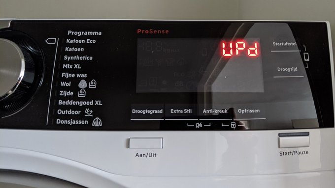

# Week 17

"Biden’s Wall Street cop feels progressives' heat after hiring blunder"

[Link](https://www.politico.com/amp/news/2021/04/30/progressives-sec-wall-street-485146)

---

"@daphnehk

Pay attention to this talk of criminalizing encryption in the
UK. Expect a similar playbook where you live: A fundamental threat to
a functioning digital infrastructure getting buried in rhetoric and
hustled along the lawmaking path without the enormous public debate it
warrants"

[Link](https://mobile.twitter.com/daphnehk/status/1388119545278210050)

---

"42,000 ...  people in the Brazilian town of Marica receiving mumbucas
– a virtual currency created by the oil-wealthy seaside town prior to
the pandemic as a form of universal basic income (UBI). Mumbacas and
other measures designed to bolster Marica’s social safety net have
made the socialist town a standout success story during the pandemic,
as Al Jazeera’s Monica Yanakiew reports, while most of Brazil battles
the virus, which has cost at least 400,000 lives and thrown more than
25 million into poverty"

[Link](https://www.aljazeera.com/economy/2021/4/30/tax-hikes-brazils-exception-mbss-plan-b-and-heavenly-harmony)

---

"Record inflows into sustainability-focused funds during the first
quarter pushed total assets to nearly $2 trillion."

---

"@gabriel_zucman

Switzerland still a prime shifting destination, second only to Ireland
and Singapore in 2018"

---

"@stephenburanyi

Spoke to @LukewSavage at Jacobin about vaccines and worldwide
response. Blindly protecting pharma giants is a relatively new thing!
People in the past would be stunned by the way we defer to these CEOs"

[Link](https://mobile.twitter.com/stephenburanyi/status/1388061095311683584)

---

"@business

Global heavy-truck rivals Daimler and Volvo Group kick off a joint
venture for hydrogen-powered fuel cell stacks"

---

"Senators Markey, Wyden, and Merkley reintroduce legislation to defend
fundamental human rights in Turkey"

---

🤣 Just found out during that scandal of yesteryear w Milli Vanilli,
their marketing claimed the band's name meant "positive energy" in
TR-speak. Completely false.. but the lie fits in their overall scam,
so its still hilarious

[Link](https://djrobblog.com/archives/7297)

---

Billy May - Window Washer \#music

[Link](https://youtu.be/13xUU9GbMFc)

---

Strange casting choice but I'd watch that movie

"@mkerrhardy

I demand a sequel to The Death of Stalin called The Death of the USSR,
with Jason Alexander as Gorbachev and Dolph Lundgren as Yeltsin"

---

@ABC

Pres. Biden: “The IRS is going to crack down on millionaires and
billionaires who cheat on their taxes. It's estimated to be billions
of dollars.”

---

.. says the only black Republican in the US Senate. Yeah you are
believable

"@MSNBC

"I get called Uncle Tom and the N word by progressives" Sen. Tim Scott
says in GOP rebuttal of President Biden's address to Congress"

---

<blockquote class="twitter-tweet">
Shout out to the Green Energy Association of Israel for sharing! <a href="https://twitter.com/gencellenergy?ref_src=twsrc%5Etfw">@gencellenergy</a> pioneers bringing H2 &amp; fuel cells to the Israeli power sector &amp; takes action to accelerate Israel&#39;s transition to <a href="https://twitter.com/hashtag/renewableenergy?src=hash&amp;ref_src=twsrc%5Etfw">#renewableenergy</a>! <a href="https://t.co/2y8TBI4PDe">https://t.co/2y8TBI4PDe</a><a href="https://twitter.com/hashtag/FuelCells?src=hash&amp;ref_src=twsrc%5Etfw">#FuelCells</a> <a href="https://twitter.com/hashtag/BackupPower?src=hash&amp;ref_src=twsrc%5Etfw">#BackupPower</a> <a href="https://twitter.com/hashtag/SayNoToDiesel?src=hash&amp;ref_src=twsrc%5Etfw">#SayNoToDiesel</a>
&mdash; GenCell Energy (@gencellenergy) <a href="https://twitter.com/gencellenergy/status/1387750763800182788?ref_src=twsrc%5Etfw">April 29, 2021</a></blockquote> 

---

"Led by an unlikely partnership between top venture capitalist Keith
Rabois and Miami mayor Francis Suarez, Miami has become the latest
city to grab headlines as the next big tech hub. From December 2020 to
January 2021, Miami saw a net migration of 145%, while the Silicon
Valley-Bay Area region saw -47.2% net migration"

[Link](https://www.movebuddha.com/blog/silicon-valley-miami-migration/)

---

<blockquote class="twitter-tweet">
We&#39;re on track with the BMW i Hydrogen NEXT. Prototypes will now enter the next phase and start road tests throughout Europe. We welcome the <a href="https://twitter.com/BMVI?ref_src=twsrc%5Etfw">@BMVI</a> initiative to support the use of <a href="https://twitter.com/hashtag/hydrogen?src=hash&amp;ref_src=twsrc%5Etfw">#hydrogen</a> in passenger cars.<a href="https://twitter.com/hashtag/BMWGroup?src=hash&amp;ref_src=twsrc%5Etfw">#BMWGroup</a> <a href="https://t.co/CK3in2bwVr">pic.twitter.com/CK3in2bwVr</a>
&mdash; BMW Group (@BMWGroup) <a href="https://twitter.com/BMWGroup/status/1387360955567382528?ref_src=twsrc%5Etfw">April 28, 2021</a></blockquote> 

---

"@H2Europe

@BMWGroup, @HMGnewsroom, @Stellantis & @toyota_europe sent a joint
letter to VP @TimmermansEU to confirm their dedication to further
develop the \#fuelcell passenger car + LCV market and call for an
expansion of the established (and proven) 700bar refuelling
network"

---

"@KimZetter

Signal doesn’t have access to messages/chat
list/groups/contacts/stickers/profile name/avatar. As result the only
info it can give in response to subpoena is: Unix timestamps for when
each account was created and date each account last connected to
Signal"

---

Jacobin: "Demanding an End to Uyghur Oppression... We can oppose the
saber-rattling and militarism of the US’s China hawks without
downplaying the oppression of the Uyghur people"

---

"Giuliani: US investigators raid former Trump lawyer's home. The
former New York mayor and lawyer to Donald Trump is being investigated
for dealings with Ukraine"

---

"In some European countries – the UK, the Netherlands and some parts of
Germany for example – the plan is to switch from the current supply of
natural gas to pure hydrogen for residential markets. In this case our
pure hydrogen fuel cell will offer both heat and electric power"

[Link](https://www.h2-view.com/story/a-hydrogen-society-an-interview-with-panasonic-part-1/)

---

U-oh

BBC: "[AAPL, FB] are locked in a stand-off after Apple announced the
latest version of its iOS operating system this week. A new feature
will prompt device users to decide whether they are happy for their
data to be collected by apps. Many are likely to say no. But user data
is a large reason why Facebook's ad-based business model is so
profitable"

---

No bitch dont smoke it, eat it 🤨

---

Dam there is nicotine in eggplant.. give up smoking have some eggplant

---

"@stephenburanyi

Same reason the US Chamber of Commerce briefed against
it. International IP rules benefit almost all US big business. This is
an existential issue for them that goes well beyond Covid. Any
precedent for suspending those rules will be fought tooth and nail.

'@lhfang

Hollywood lobbyists and the recording industry are intervening against
the emergency proposal to share vaccine technology. Why? There's a
fear that suspending trade rules will weaken copyright enforcement,
the waiver at the WTO will be too broad'"

[Link](https://interc.pt/3aHSVzg)

---

I bet such diy deals cld even be used for money laundering

Reuters: "A growing number of private equity firms are establishing new
funds to buy portfolio companies from funds they already control. With
the buyer and seller each an entity controlled by the same private
equity firm, scrutiny is growing over how they price such deals"

---

Great. While u r on it kill the BEV initiatives, a lot of your
carmakers got swept up by hype stirred by bunch of lost souls in US,
ignorant celebrities

"Federal Minister of Transport Andreas Scheuer.. Germany will become a
hydrogen country. In our search for suitable locations for hydrogen
technology, we received 15 exciting applications from all over
Germany"

[Link](https://www.bmvi.de/SharedDocs/DE/Pressemitteilungen/2021/042-scheuer-deutschland-wird-wasserstoffland.html)

---

@AFP

\#BREAKING Germany, France back 21% global minimum corporate tax proposal: ministers

---

Vacc diplomacy? What vacc diplomacy? Your vacc is a piece of shit 

---

Sinovac is some subpar prod isnt it? WHO still hasnt approved it

---

All [lines](https://www.youtube.com/watch?v=b4zVu0sN8cw) from *Deuce Bigalow*

---

Wut! Wut! Wut!

---

Mfker is a man-ho. He have mangina

---

<blockquote class="twitter-tweet">
<a href="https://t.co/jcXWuJv329">https://t.co/jcXWuJv329</a>
&mdash; Asia-Pacific Hydrogen Association (@APAC_Hydrogen) <a href="https://twitter.com/APAC_Hydrogen/status/1387150949915971589?ref_src=twsrc%5Etfw">April 27, 2021</a></blockquote> 

---

Ridge lift eh.. nice...

---

Solid carbon. Interesting.

"Ekona's pulsed-methane pyrolysis (PMP) solution converts natural gas
feedstock into hydrogen and *solid carbon*, virtually eliminating CO2
emissions"

[Link](https://www.newswire.ca/news-releases/ekona-power-raises-3-0-million-from-bdc-capital-to-accelerate-the-development-of-its-novel-technology-for-low-cost-clean-hydrogen-828153584.html)

---

The Guardian: "Israel is committing the crime of apartheid, rights
watchdog says.. Human Rights Watch calls on international criminal
court to investigate ‘systematic discrimination’ against
Palestinians.. has accused Israeli officials of committing the crimes
of apartheid and persecution, claiming the government enforces an
overarching policy to “maintain the domination by Jewish Israelis over
Palestinians”. In a report released on Tuesday, the New York-based
advocacy group became the first major international rights body to
level such allegations"

---

Everything else aside Astra Zeneca is a cool name.

---

"EU sues AstraZeneca over vaccine delivery delays.. The pharmaceutical
giant .. vows to defend itself"

---

That custom can be found [anywhere](https://en.wikipedia.org/wiki/Tradition_of_removing_shoes_in_the_home_and_houses_of_worship)
from Italy, to Greece, to other Eastern European countries, as well
as some Arabic countries. Again, another custom that is regional and
every1 assimilated into... not brought by some punks 

"I went to Japan and they take their shoes off before entering
someone's house just like in TR, proof that we are Asiatic"

---

Dam

"West Virginia paying young people to get vaccinated"

---

And of course there should not be any billionaires

---

Got money, fund some unseen, unorthodox idea, fine. But seriously
during serious events, fuck off

---

Remember Gates on some news show talking abt pandemic.. This guy was
like 'I droped a billion here and a billion there" and I am thinking
dude talks like government. Acting like one. Now I worry if he is
getting in the way.. There are only so many vacc researchers,
resources to make stuff happen.. But who does he answer to? Noone
elected him.

---

<blockquote class="twitter-tweet">
Bizarre! Same here! It&#39;s like the other c-viruses got pissed b/c the upstart newbie was getting all the attention, decided to reassert themselves.
&mdash; Leslie K. Paige (@lesliekpaige) <a href="https://twitter.com/lesliekpaige/status/1387169779753046019?ref_src=twsrc%5Etfw">April 27, 2021</a></blockquote> 

---

"@hazergroupltd

A new blueprint plotting the course to transition New Zealand’s gas
pipeline network, from natural gas to 100% hydrogen by 2050, was
unveiled last month by Firstgas Group"

---

<iframe width="340" src="https://www.youtube.com/embed/1OO5YpCevfY?start=128&end=227" title="YouTube video player" frameborder="0" allow="accelerometer; autoplay; clipboard-write; encrypted-media; gyroscope; picture-in-picture" allowfullscreen></iframe>

---

Under the crust lava is liquid 1000 deg.

Earth core 5000 deg, as hot as the Sun itself, also liquid / solid.

But the mfker is like 'Sun is gaseous'? Bitch u dumb

---

"US utilities are moving ahead with hydrogen pilot programs as part of
their push toward net-zero emissions, with San Diego Gas & Electric
and Dominion Energy April 19 providing details about projects to
blend hydrogen into natural gas distribution systems, along with
other applications"

[Link](https://www.spglobal.com/platts/en/market-insights/latest-news/electric-power/041921-sdgampe-dominion-starting-hydrogen-pilot-programs-to-help-reach-net-zero-emissions)

---

"JetBlue Invests in Hydrogen-Fueled Aviation Technology Company"

[Link](https://www.businesstravelnews.com/Transportation/Air/JetBlue-Invests-in-Hydrogen-Fueled-Aviation-Technology-Company)

---

Let's truly modernise ed by replacing the teacher, so the crux, the
delivery, has a guaranteed quality. Grading (only pass/fail) which
takes the least amount of time, can remain in-person, craftsman-like,
but through certifiers. The process will also be async, paving the way
for the system's eventual transition to 3W.

---

Modernity, as in industrial production, gives you products that are
copies of a template; I buy a 27'' LCD monitor, it is exactly like the
next 27'' LCD monitor produced by the same brand.

But education still varies from teacher to teacher because we chose to
deliver lectures through individuals.. Ed therefore is still not a
product. It is treated as some sort of pre-modern craft. Just like
there was the shoemaker, ironsmith, bakery, there is.. the
teacher. Shoemaker works on his shoes, his product is as good as he
can make it, teacher same way. We modernized shoemaking, all kinds of
food prep but we only modernized [some parts](../../2011/02/grading.md) of
ed, of the "craft", ending up with a bastardized, bizarre mixture of
modern and pre-modern. Grading is an industrial approach.

---

What modern education..? It's not even modern!

"What is wrong with modern education?"

---

The shoddiest version of everything can be found in gobble gobble.. couldn't
you at least _try_ to be a good conspiracy theorist? 

---

🤣 🤣 🤣

[Link](https://twitter.com/MiddleEastTakes/status/1386589167967158273)

---

<blockquote class="twitter-tweet">
. <a href="https://twitter.com/BoschPress?ref_src=twsrc%5Etfw">@BoschPress</a>: <a href="https://twitter.com/hashtag/Hydrogen?src=hash&amp;ref_src=twsrc%5Etfw">#Hydrogen</a> megatrend: <a href="https://twitter.com/hashtag/fuelcell?src=hash&amp;ref_src=twsrc%5Etfw">#fuelcell</a> Market Worth Billions-Market for <a href="https://twitter.com/hashtag/greenhydrogen?src=hash&amp;ref_src=twsrc%5Etfw">#greenhydrogen</a> in the <a href="https://twitter.com/hashtag/EU?src=hash&amp;ref_src=twsrc%5Etfw">#EU</a> will be worth almost 40 billion euros by 2030. From 2021-2024, Bosch plans to invest one billion euros in fuel-cell technology-<a href="https://t.co/A2eCdP797S">https://t.co/A2eCdP797S</a> <a href="https://twitter.com/hashtag/fuelcell?src=hash&amp;ref_src=twsrc%5Etfw">#fuelcell</a> <a href="https://twitter.com/hashtag/HydrogenNow?src=hash&amp;ref_src=twsrc%5Etfw">#HydrogenNow</a> <a href="https://t.co/TfTvYHq6hR">pic.twitter.com/TfTvYHq6hR</a>
&mdash; FuelCellsWorks (@fuelcellsworks) <a href="https://twitter.com/fuelcellsworks/status/1386344257980706816?ref_src=twsrc%5Etfw">April 25, 2021</a></blockquote> 

---

NYT: "Last year, India and South Africa requested a waiver from World
Trade Organization rules governing intellectual property for
technology dealing with the pandemic. Dozens of mostly developing
countries have since joined them. A handful of rich nations, including
the United States, oppose the waiver, but there’s a widespread belief
that if America changes its position, other countries will follow"

[Link](https://www.nytimes.com/2021/04/23/opinion/global-vaccine-patents.html)

---

"@doctorow

2.5b people in Earth's 130 poorest countries have not been
vaccinated... The humanitarian cost is unforgivable - and
self-defeating, as each infected person is a potential source of new
strains...

It was Gates who sabotaged the WHO Covid-19 Technology Access Pool
(C-TAP), replacing it with his failed ACT-Accelerator, a system of
patents and secrecy and vast profits for the pharma industry"

---

"Biolyse is a small pharmaceutical manufacturer in Canada with a simple
proposition: provide a recipe for a coronavirus vaccine, and it will
produce 20m doses for nations in the global south. It has approached
AstraZeneca and Johnson & Johnson, and even asked the Canadian
government to help it with compulsory licensing – which would give it
the authorisation to produce another company’s patented product for
emergency use – but so far no one has taken up its offer.

When I reached him by phone this week, John Fulton, the vice-president
of Biolyse, told me: 'We’ve been passed over. We’ve got this
production capacity and it’s not being put to use'"

[Link](https://amp.theguardian.com/commentisfree/2021/apr/24/covid-vaccines-patents-pharmaceutical-companies-secrecy)

---

"@shailjapatel

During WW2, the US government forced pharmaceutical companies to share
recipes for antibiotics. In the worldwide campaign against smallpox,
the WHO maintained a register of manufacturing techniques and
recipes...to share the technology globally." via The Guardian

---

Jacobin: "For the Left, it’s easy to hate the media, with its
entrenched centrist biases and loyalty to the status quo. But a world
without high-quality news is a world where meaningful democracy is
impossible. That’s the message of media scholar Victor Pickard, who
argues for a transformation of our media system away from the model of
commercial news and toward a 'public option'"

[Link](https://jacobinmag.com/2021/04/media-public-journalism-funding-news/)

---

Since if let loose, covid [can kill](../../2020/02/corona.md) 1% of a
broader population (human pop grows by that exact amount each year)
65% reduction is a major deal.

"Single dose of Pfizer-BioNTech or Oxford-AstraZenca vaccine reduces
infection rate by 65%, study finds"

---

Gotta void it bitch.. Otherwise some' fierce is coming your
way.. There were plans to bar players who wld play in SL from World
Cup even, which wld be a problem for many players.

"The 12 clubs that agreed to join a new European Super League have
'binding contracts' and "cannot leave", says Real Madrid president
Florentino Perez"

---

<blockquote class="twitter-tweet">
I really miss coffee shops so I asked my husband to change our Wi-Fi password and not tell me what it is unless I give him $7
&mdash; Adrienne Porter Felt (@__apf__) <a href="https://twitter.com/__apf__/status/1264230977158524933?ref_src=twsrc%5Etfw">May 23, 2020</a></blockquote> 

---

Countries, US states with fossil resources would be interested in this
tech.. US Dem Senator Manchin is from a coal heavy state right, and a
key vote in the Senate..? A bill with coal CCS, green fuel prodcution
cld get his support 

---

Reuters: "A Japanese-Australian venture has begun producing hydrogen
from brown coal in a $387 million test project that aims to show
liquefied hydrogen can be produced and exported safely to Japan...

Japan’s Kawasaki Heavy Industries is running the pilot project with
government financial support from both Japan and Australia in the
state of Victoria, home to a quarter of the world’s known brown coal
reserves.a

The project is producing hydrogen by reacting coal with oxygen and
steam under high heat and pressure in a process that also yields
carbon dioxide and other gases.

If the project goes commercial, the plan would be to bury the carbon
dioxide off the coast of Victoria, KHI has previously said"

[Link](https://www.reuters.com/article/australia-hydrogen-kawasaki-heavy-idUSL4N2L81IF)

---

"@axios

President Biden in the next few days will unveil eye-popping new tax
rates for the wealthiest Americans —a top marginal income tax rate of
39.6% and a capital gains rate of 43.4%"

---

"Solid Continua" 😶

---

Smooth Genestar - Blu Country \#music

[Link](https://youtu.be/Rn-kVWnHPmY?t=5674)

---

NYT (Dec 2020): "To help Pfizer, the deal calls for the government to
invoke the Defense Production Act to give the company better access to
roughly nine specialized products it needs to make the vaccine. One
person familiar with the list said it included lipids, the oily
molecules in which the genetic material that is used in both the
Moderna and Pfizer vaccines is encased"

[Link](https://www.nytimes.com/2020/12/22/us/politics/pfizer-vaccine-doses.html)

---

What are the raw materials? SciAm [says](https://www.scientificamerican.com/article/new-covid-vaccines-need-absurd-amounts-of-material-and-labor1/)
polymerases, caccinia capping enzyme (VCE)

---

Cant say I blame them

@sidhant

"United States first and foremost is engaged in an ambitious and
effective and, so far, successful effort to vaccinate the American
people", US State Dept when asked about #COVID vaccine raw materials
export to India"

---

Sci achieved much but there are still holes in the grand knowledge,
on some fundamental questions.

---

Was just thinking about this today.. and bingo found this

<blockquote class="twitter-tweet">
tl;dr - it&#39;s not just bernoulli&#39;s principle - it&#39;s in large part just air deflection downward - the equal transit time for the top and bottom of the wing is bullshit - the blowing air over paper example is bullshit - asking hard questions is tough and i&#39;m glad some ppl do it
&mdash; thinkagainer of the thought palace (~129 yrs old) (@thinkagainer) <a href="https://twitter.com/thinkagainer/status/1307849362295394305?ref_src=twsrc%5Etfw">September 21, 2020</a></blockquote> 

---

The 90s-2010s period was spent on "barbarians at the gates"
narrative..  this narrative was excessive. Old Guard is still there,
carries some influence.. Notice "the Internet Guy" Bezos bought WaPo
joining the guard, rather than start his own thing doing "dhat
disrupting binness".

---

SSt cld provide a springboard to new outlets, those outlets need to
grow institutional muscle tho to compete

Slate: "Substack today has somewhere north of 500,000 paid
subscribers, which represents a meteoric growth rate but is still just
a fraction of, say, the New York Times’ 7.5 million... A key to
understanding Substack’s impact on the news is to recognize that the
kind of journalism that tends to thrive there—so far, at least for the
most part—is not actually news. It’s commentary and analysis, aimed at
the chattering classes"

[Link](https://slate.com/business/2021/04/substack-media-new-york-times-subscriptions-poaching.amp?__twitter_impression=true)

---

Mostly, yes. Making diverse set of products is what contributes to
innovation, as Hidalgo [found](../../2017/08/economic-complexity-hidalgo.md).
Whether from that angle, or from my greater-sum angle, the conclusion is the same.

"But then should everyone be able to produce everything?"

---

But.. but.. we are globalized and shit, travel freedom earth is flat
blah blah

"Vietnam defied the experts and sealed its border to keep Covid-19
out. It worked... How the country has kept coronavirus deaths to just
35, and grew its economy in 2020"

[Link](https://www.vox.com/platform/amp/22346085/covid-19-vietnam-response-travel-restrictions)

---

"@qrs

The clothes dryer is installing an over the air firmware update"

---

Oil Price: "The Hydrogen Boom Will Provide A $200B Boost To Wind And Solar Energy"

---

@h2_view

The #UK is set for what could be its first ever conversion of a diesel locomotive to run on #hydrogen power which will then be put into operation by the #SevenValleyRailway.

---

\#trek \#voyager Of course they could just beam a baby right out of
mother's vomb. Cesarean is so yesterday.

---

Denialism is not that surprising as the nat identity of the country is
made-up... Denialism is just another set of fairy tales

---

"Grundlagen und Anwendungen" 😶

---
