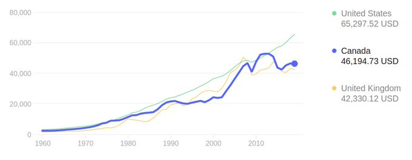

# Week 19

"Australian Govt Announces Oakajee Renewable Hydrogen Expression of
Interest. Government intends to transform this greenfields site into a
globally competitive, multi-product renewable hydrogen industrial
precinct"

[Link](https://bit.ly/3ogjlxw)

---

Why did Sharon pull out of Gaza unilaterally in 2005? The narrative at
the time was "yielding Gaza would help promote goodwill and peace".
But when did anyone leave territory without anything substantial in
return?

We also know Hamas is an [Israeli creation](../../2020/06/10-myths-israel.html#hamas).

Put the two together.. maybe Israel wanted that persistent flashpoint
to fight against, to keep the right mobilized, and militarized, and
always show the international crowd they are "under attack", so they
could continuously play the victim. It is unbelievable such a tiny ass
area can give Israel so much grief, to the extent ppl tremble behind
some "Iron Dome", hide in shelters everytime there are attacks.

---

Need all hands on deck working towards green fuels, bunch of asswipe
bulls..t keeps interjecting.. Freaking tragedy

---

Sad good things like this happen in tandem with haneous other things

"Tel Aviv University Researchers Develop Method of Clean Production of
Hydrogen as Fuel for Vehicles-An easy-to-manufacture, multifunctional
biological nanomaterial to protect the enzyme that enables the
production of hydrogen"

[Link](https://bit.ly/3fkhfZw )

---

DW: "Germany stands by Israel - despite the Holocaust, and because of
the Holocaust"

---

Fin media laments population stalling in country X! Country Y! Pop
increase is related to GDP increase, so they fear loss of returns? On
stawks, bonds? But pop inc can just mean dumb increase.. Countries
need gdp per capita increase, increase efficiency, quality.

---

"Leading CEO's Ask California Governor To Dedicate $500 Million In
Hydrogen Infrastructure Funds..

CEO's of 25 companies included Toyota, Hyundai"

[Link](https://bit.ly/3y2ZBCh )

---

Whenever I see B Johnson on TV giving interviews nowadays he is always
in those yellow colored workman's clothes.. Let's guess on what kind
of image he is trying to project.. Courting low-income Labour votes
maybe..?  Centrists.. where are you?  Fell asleep at the wheel..?
Opposite BJ there is the lawyer looking guy not too comfortable with
retail politics.. Leave aside pol this is bad optics.

---

"Paris seeks to ban through traffic in city centre by 2022"

---

When Macron sounded a little "too respectful" toward Pute in his
handoff during the climate summit, all of a sudden there were
"communication issues"? 

---

EU-RU alliance would be great.. if some countries grumble about it,
kick'em out. Like Poland.. EU-RU entente possibility scares the shit
out of UK/US.

---

Jesse wasnt an outsider really.. even when he ran for Governor. He had
been a mayor before that, and military service previous to that (also
considered public service right, its government?).

---

"Harry thought about quitting royal life in his 20s.. compares his
royal experience to being on 'The Truman Show' and 'living in a zoo.'"

---

"Amid the Shooting, Netanyahu’s Foes See an Opening, and
Risks... Israeli politicians often close ranks in a crisis, but this
time the prime minister’s enemies, trying to form a government and
oust him, are blaming the violence on him"

---

The country needs insiders, not outsiders.. dividers, not uniters.

---

With Trump exiting the "outsiders" wave took a hit.. That whole sales
shtick starting with people copying Jesse Ventura until 2020 showed
the outsider has no silver bullet.. I asked bunch of Californians the
other day abt Ahnuld, they said 'he didnt fix the budget issue' (the
issue that led to Gray's recall and his election), due to his ideology
apparently.. Well then how is that different from any other small-gov
anti-tax politician? Trump had some good but made bunch of
mistakes.. All in all, more experience is better.

---

We need less direct democracy, not more. As long as modern
institutions exist, no need to hobble them with too many "people
intrusions".

---

I support recalling the recall law. 

"The recall election coming later this year for California Governor
Gavin Newsom doesn’t appear likely to end with his removal from
office. Although Newsom’s opponents have gathered enough signatures to
require a vote—and conditions in the state could still change—polls
show that public support for the effort is far below what Newsom’s
critics will need to force his removal.Nevertheless, the drive may
trigger another form of recall: It may finally prompt California to
examine whether the 110-year-old state law that governs recalls still
makes sense in our modern era of unrelenting partisan conflict. The
law was instituted during the Progressive era as a tool to tame
special interests, but the effort against Newsom suggests that it’s
become a weapon of harassment and manipulation by Republicans"

[Link](https://www.theatlantic.com/politics/archive/2021/05/newsom-recall-california/618872/)

---

Sing a lulaby it will all be ok

"Gal Gadot, who previously served in the Israeli army, said Israel was
'at war', adding it 'deserves to live as a free and safe nation'

Her comments drew a barrage of criticism.

'She can’t even say the word Palestinian,' one Twitter user commented
in reference to Gadot’s post"

---

"Study: Companies Are Developing Over 200 GW of Hydrogen Electrolyser
Projects Globally, 85% of Which Are in Europe-Germany the clear
front-runner with 23% of planned electrolyser capacity
globally"

[Link](https://bit.ly/3ho5hAU)

---

"Australian Hyundai [H2 Fuel Cell] NEXO Breaks World Distance
Record-The 887.5km..  trip from Melbourne to Broken Hill"

[Link](https://bit.ly/3hAJm9R )

---

"Riots continue across Israel: A Jewish man in his 30s was lynched by
Arab rioters in a demonstration in Acre tonight, while another Jewish
man was lynched by right wing Jewish extremists who mistook him for an
Arab"

---

Wuhan Lab Kung-Flu

---

"COVID cases across India being traced to weeks-long Kumbh
Mela.. Dozens of cases across India being traced to mega Hindu
festival held at the banks of Ganges in Haridwar last month"

---

🤣 This is an example of a bad divorce

"EU citizens arriving in UK being locked up and expelled"

---

"Chemical giants DuPont and Daikin knew the dangers of a PFAS compound
widely used in food packaging since 2010, but hid them from the public
and the Food and Drug Administration (FDA), company studies obtained
by the Guardian reveal.The chemicals ... are now linked to a range of
serious health issues, and Americans are still being exposed to them
in greaseproof pizza boxes, carryout containers, fast-food wrappers,
and paperboard packaging"

[Link](https://www.theguardian.com/environment/2021/may/12/chemical-giants-hid-dangers-pfas-forever-chemicals-food-packaging-dupont)

---

"World could have prevented COVID catastrophe, independent panel finds

The scale of the coronavirus pandemic could have been prevented, an
independent global panel has said. Governments and the WHO have been
accused of not reacting quickly enough to early warning signs"

[Link](https://www.dw.com/en/world-could-have-prevented-covid-catastrophe-independent-panel-finds/a-57506437?maca=en-rss-en-all-1573-rdf)

---

"@HypersonixAU Successfully Demonstrates Spartan Scramjet Performance
From Mach 5 to Mach 10.

SPARTAN is a composite, self-igniting re-usable scramjet engine
powered by #Greenhydrogen"

[Link](https://bit.ly/3eG4Sbl)

---

"UK: Ministers Told to Commit to a New H2 Target"

[Link](https://bit.ly/3hm6jxi)

---

"Over 100 anti-Trump republicans threaten to form breakaway party as
GOP expected to oust Cheney"

---

"We Can't Wait" Aerospace Entrepreneur

@MIT_alumni

[Link](https://t.co/z4JV2ZtLY1?amp=1)

---

"@Istanbultelaviv

An organized pogrom took place tonight against Arabs in Bat Yam
despite the fact they they all learned about Kristallnacht"

---

Jacobin: "[T]he reality is not all that complicated. Hamas's rockets
and Palestinians protesting, throwing rocks, or even rioting: these
are all desperate responses to sustained, systematic, and brutal
repression and land theft by Israel that has been going on for
decades, and has sharply escalated over the last decade in
particular. It is the 'language of the unheard', as Martin Luther King
called the African-American riots of the 1960s, which, like their
counterparts last year and in the decades between, are a similar howl
of frustration from those who have been relentlessly dispossessed and
brutalized with seemingly no recourse.

There are ways of putting an end to such things, whether rocket
attacks or property destruction from rioters. But to do that requires
first accurately describing the injustices that drive them"

---

Another use of that cool metal hydride solution.. Oz Lavo uses this
tech too..  GKN can store H2 at 40 bars (usually 700 bars is used).

"GKN HY2 Energy System requires 15 times less space compared to
gaseous hydrogen storage systems when holding the same amount of
energy at the same pressure"

[Link](https://fuelcellsworks.com/news/pioneering-hydrogen-at-the-gkn-hydrogen-launch-event-on-may-11/)

---

The [Old Deal](../../2021/05/farmers-foragers-fossils.html#olddeal).

- The "benevolent king / rulers" who is "kind and just" to its
subjects narrative of the agro age cements the status of both.

- Religions, philosophies rose up to challange the status quo, and
they were swiftly coopted.

---

Lose-Lose

"The escalation of violence in Israel and the Palestinian territories
is straining Israel's relations with the Arab world. Countries that
have agreed to a normalization of bilateral relations are now under
pressure"

---

The Arab minority does not usuallly cause no trouble.. They must be up
in arms about the latest situation. 

SWI: "Israel's Arab minority - Palestinian by heritage, Israeli by
citizenship - is mostly descended from the Palestinians..  Most are
bilingual in Arabic and Hebrew, and feel a sense of kinship with their
fellow Palestinians in the occupied West Bank and Gaza. And they often
complain of systemic discrimination, as well as unfair access to
housing, healthcare, and education services"

---

SWI: "We have lost control of the city and the streets" -- [Israeli city] Lod Mayor 

---

SWI: "Violence in mixed Jewish-Arab towns in Israel flared early on
Wednesday"

---

F24: "Indian Covid-19 variant found in 44 countries around world, says WHO"

---


"Families of Black Americans killed by police push for UN to
intervene.. The families have been pushing the international community
to take action since last summer’s protests"

---

"@Suncor And @ATCO Partner On A Potential World-Scale CleanHydrogen
Project In Alberta-Project would produce more than 300,000 tonnes per
year of clean hydrogen"

[Link](https://bit.ly/3y19LDp)

---

"New York State Adds Another $30 Million for Drive Clean Rebate
Program-Includes FuelCell Hydrogen Vehicles"

[Link](https://bit.ly/3bffGuN)

---

What is being "commemorated" is always related to what the nation
wants to do in the future.. In that war Oz offered manpower due to its
[quid-pro-quo](../../0119/2017/07/the-next-decade-friedman.html#australia) for
naval protection with the UK. That's how Oz soldiers ended up on the
other side of the planet. The same need exists today, albeit with a
different naval power, US, so the nation commemorates to keep that
memory fresh in case similar sacrifice might be needed in the future.

"Australia commemorates the Anzak Day for their WWI losses in
Gallipoli. Why?"

---

Because that would be a disincentive for EU members to stay / be in
the EU.  If they felt their pieces would just be taken in seperately
after membership, countries would have less of an incentive to be a
member. But, if you are __not__ in the EU like the UK is not anymore,
especially after a bad divorce like the one UK had, then EU could be
like "fine, come on in, in pieces, whatever".

"Why would EU care about pieces of countries joining to it, or not, like Catalonia?"

---

Wasnt until agro era to get spices in cooking..?  Foragers cld have
figured that out.. They knew fire, they cooked meat (cooking softened
it, allowing more of it to be eaten in one sitting, more energy), they
also foraged for plants obviouly, and a few wld have figured to throw
in some bay leaves in there in the pot along with water. Sounds
plausible to me.

---

"ZeroAvia Selected As Finalist In Transportation Category Of Fast
Company’s 2021 World Changing Ideas Awards-In Sept. 2020, company
achieved world’s first hydrogen fuelcell ..  flight of a
commercial-grade aircraft"

[Link](https://bit.ly/3f9ur3u)

---

"@PowerHouseEG Plastic Waste to H2 Technology to be Rolled out Across
Hungary & Greece"

[Link](https://bit.ly/3xTVQ1X )

---

CNBC: "Cathie Wood's ARK Innovation ETF falls to new low for the year,
off nearly 35% from recent high"

---

CH vax is no good

"[Seychelles] is experiencing its largest coronavirus outbreak after
vaccinating some 60% of its population, mostly with China’s Sinopharm
shot"

---

<blockquote class="twitter-tweet"><p lang="en" dir="ltr">.<a href="https://twitter.com/PKN_ORLEN?ref_src=twsrc%5Etfw">@PKN_ORLEN</a> to deploy its first <a href="https://twitter.com/hashtag/hydrogen?src=hash&amp;ref_src=twsrc%5Etfw">#hydrogen</a> stations in <a href="https://twitter.com/hashtag/Poland?src=hash&amp;ref_src=twsrc%5Etfw">#Poland</a> - To be located at an existing ORLEN service stations in <a href="https://twitter.com/hashtag/Pozna%C5%84?src=hash&amp;ref_src=twsrc%5Etfw">#Poznań</a> and <a href="https://twitter.com/hashtag/Katowice?src=hash&amp;ref_src=twsrc%5Etfw">#Katowice</a>, the first two refuelling points will serve buses and passenger cars. ⛽️💧🚍🚗🇵🇱<a href="https://twitter.com/hashtag/FuelCellsNow?src=hash&amp;ref_src=twsrc%5Etfw">#FuelCellsNow</a> <a href="https://twitter.com/hashtag/HydrogenNow?src=hash&amp;ref_src=twsrc%5Etfw">#HydrogenNow</a><a href="https://t.co/Y9dxj9YeXS">https://t.co/Y9dxj9YeXS</a> <a href="https://t.co/Hs0nhqjUNF">pic.twitter.com/Hs0nhqjUNF</a></p>&mdash; Fuel cell bus (@Fuelcellbus) <a href="https://twitter.com/Fuelcellbus/status/1391658110729826304?ref_src=twsrc%5Etfw">May 10, 2021</a></blockquote> <script async src="https://platform.twitter.com/widgets.js" charset="utf-8"></script>

---

They are all younger than your sitting President! (except Carter I
guess). Yea.. No more elderly respect for the ex-Prez.. It's open
season now.. Run for cover

"Ex-Presidents are retired, elderly now, should we criticize them
less?"

---

That's nother one of those pull yourself up .. bootstraps thingies
again isn't it?  This guy was a smooth mo..f..ker... See how he
slipped that in there..? Masterfully done.

---

".. be Americans again". What the f-k does that even mean?

---

???

[Clinton, 1992 campaign] "I desperately want to be your President, but
you have to be Americans again"

---

Long thread.. the rest calls cryptos 'Ponzi schemes'. In a certain
light they could be seen that way.

"@smdiehl

Bitcoin's narrative is crystallized around alt-right populism, a
strange variant of Austrian economics, goldbuggery, distrust of
institutions and resentment about the 2008 financial crisis.  While
Dogecoin is basically built around pure nihilism"

[Link](https://twitter.com/smdiehl/status/1391309574762795009)

---

Mistakes here, mistake over there.. There is difference in scale
here. Their founder did not say 'we are all Amish' and change his name
to George GrandAncestorAmish. You are not comparing apples and oranges
at this point, but apples with hoola hoops... Doorknobs.. That is the
sad truth.

---

<blockquote class="twitter-tweet"><p lang="en" dir="ltr">Using surplus solar &amp; wind power, green ammonia is the ultimate <a href="https://twitter.com/hashtag/hydrogen?src=hash&amp;ref_src=twsrc%5Etfw">#hydrogen</a> carrier, generating clean power and accelerating decarbonization across regions &amp; industries. Check out this video from <a href="https://twitter.com/ScienceMagazine?ref_src=twsrc%5Etfw">@ScienceMagazine</a>: <a href="https://t.co/c8Qos0evJ0">https://t.co/c8Qos0evJ0</a><a href="https://twitter.com/hashtag/FuelCells?src=hash&amp;ref_src=twsrc%5Etfw">#FuelCells</a> <a href="https://twitter.com/hashtag/SayNoToDiesel?src=hash&amp;ref_src=twsrc%5Etfw">#SayNoToDiesel</a></p>&mdash; GenCell Energy (@gencellenergy) <a href="https://twitter.com/gencellenergy/status/1391656719969890305?ref_src=twsrc%5Etfw">May 10, 2021</a></blockquote> <script async src="https://platform.twitter.com/widgets.js" charset="utf-8"></script>

---

Given all these potential weak spots I dont understand why more do not
support opportunities to boost any point in the pipeline.

"Supply shortages and vaccine inequality leaves Covax facing uncertain future"

---

I love it all those Brexit arguments can be turned around verbatim
against the English now. "Will of the people!". "Freedom!"

---

Hah.. I bet the same thing EU told Britain before their referandum

"With a pro-independence majority in the Scottish parliament, Prime
Minister Boris Johnson said the UK was 'best served when we work
together.'"

---

"@EuropeElects

UK (Scotland) election: Final result (seats)

Pro-independence: 72 (+3)

Anti-independence: 57 (-3)

+/- vs 2016"

---

"Scotland's Independence Parties Gain Upper Hand as Pressure Builds on
U.K... SNP’s Nicola Sturgeon is pushing a referendum plan with Green
Party allies as Boris Johnson gains ground in England"

---

Many things are possible.. but viable? Efficient?  If u r fine cutting
100 mile from your range, wait a day while the f-ing truck charges
during long trips, 8 tons added to your curb weight, fine. Like
aspirin is "fine" for cancer. Or cutting fat from diet but drinking
Coca-Cola. It's all "fine".

"But battery trucks are possible"

---

"@AMP_AU Will Develop a $2 Billion \#RenewableEnergy Hub Incorporating
\#Hydrogen Energy in South #Australia

Hub includes Spencer Gulf Hydrogen Energy Ecoplex, part of South
Australian Government’s Hydrogen Plan"

[Link](https://bit.ly/3uuSSyQ)

---

We hear the occasional lefty mutterings from even G. Brown, the other
one-time "New Labor" leader -- he supported covid patent
waiver.. Where is TB? Drop this Third Way, TINA, Clinton bullshit

---

Now that Labor centrists took a beating, it's time for a left
turn. The sacking of Rebecca Long-Bailey was a mistake. She needs to
be the next leader of Labor. And forget this anti-semitism non-sense

---

Oh yea Keir was his guy

---

Tony Blair lost on Thursday.

---

<blockquote class="twitter-tweet"><p lang="en" dir="ltr">“A battery-electric 40 ton truck with 500km range needs 8 tons of battery. That’s ridiculous,” says Toyota’s FCV-boss Katsuhiko Hirose <a href="https://twitter.com/hashtag/nocompromise?src=hash&amp;ref_src=twsrc%5Etfw">#nocompromise</a> <a href="https://twitter.com/hashtag/fuelcells?src=hash&amp;ref_src=twsrc%5Etfw">#fuelcells</a> # <a href="https://twitter.com/hashtag/energystorage?src=hash&amp;ref_src=twsrc%5Etfw">#energystorage</a> <a href="https://twitter.com/hashtag/cleanfuel?src=hash&amp;ref_src=twsrc%5Etfw">#cleanfuel</a> <a href="https://twitter.com/hashtag/smartcities?src=hash&amp;ref_src=twsrc%5Etfw">#smartcities</a> <a href="https://twitter.com/hashtag/economicdevelopment?src=hash&amp;ref_src=twsrc%5Etfw">#economicdevelopment</a> <a href="https://twitter.com/hashtag/climatechangemitigation?src=hash&amp;ref_src=twsrc%5Etfw">#climatechangemitigation</a> <a href="https://t.co/HhF8QNC9Ve">https://t.co/HhF8QNC9Ve</a></p>&mdash; Charles Purkess (@CharlesPurkess) <a href="https://twitter.com/CharlesPurkess/status/1134741066068795392?ref_src=twsrc%5Etfw">June 1, 2019</a></blockquote> <script async src="https://platform.twitter.com/widgets.js" charset="utf-8"></script>

---

Politico: "Biden's bombshell proposal to waive intellectual property
rights on coronavirus vaccines [led to] the EU .. now floundering in
the PR war.. advocating the rights of Big Pharma against poor nations"

[Link](https://www.politico.eu/article/biden-makes-the-eu-look-like-the-bad-guys/)

---

Because it'd make them feel butt-hurt, giving out hundreds of millions
rather than mere millions, so they would not be incentivized to *help*
us, "disrupt" industries and shit, fight our crime when government
fails, like Batman

"@M_SullivanTax

Ways and Means will have a hearing Wednesday on taxation of wealthy.
Doesn't it all boil down to:

Fact: the super rich are taxed at lower effective rate than a
2-earner-middle class couple.

Then ask: Is there any reason to tax the rich at a lower rate than the
middle class?"

---

"@Istanbultelaviv

Watching videos of Israeli police raiding the grounds of the Haram
al-Sharif during the Ramadan prayer tonight I can only come to one
conclusion. The police under direction of Likud's staunchly
pro-Netanyahu Minister of Security, Amir Ohana, is doing everything to
cause chaos.

This is of course aimed undermining any progress on opposition
Netanyahu front to reach a coalition between the right-center-and left
parties. If it is not this its total lack of good governance, a very
bad police force, and and many far-right factors trying to make it
worse"

---

"Sunfire Successfully Tests World's Largest High-Temparature
Electrolysis Module"

[Link](https://bit.ly/2SuisG3)

---

Fort Knox Five - Papa Was Stoned \#music

[Link](https://youtu.be/ltC0XIflyKc)

---

The Mark Duval Big Band - The Race Machine \#music

[Link](https://youtu.be/0taq78DElkY)

---

"@Snowden

The worst part of cryptocurrency transforming into dragon-level wealth
is witnessing good people emotionally devolve into dragons themselves:
so intellectually paralyzed by the fear that everyone they see
threatens their hoard that they lose sight of the world beyond their
cave"

---

"The world's first shipment of blue ammonia was dispatched from Saudi
Arabia to Japan on Sep. 27, 2020 for use in a power station for the
production of zero-carbon power generation, paving the way for the
further use of hydrogen in the energy system"

[Link](https://www.hellenicshippingnews.com/blue-ammonias-role-in-the-energy-transition-of-saudi-arabia-and-japan)

---

Ammonia can be a natural by-product of a hydrogen economy. A major
input to ammonia generation is H2.

---

"Ammonia is perhaps most well recognized as a household
cleaner. However, ammonia makes another important contribution to
daily life as an industrial refrigerant.  It is responsible for the
year-round availability, volume and variety of food and beverages
served daily on breakfast, lunch and dinner tables around the world...
Ammonia does not destroy atmospheric ozone and does not contribute to
the greenhouse effect linked to global warming. In fact, ammonia, one
of the most common compounds found in nature, is essential to earth’s
nitrogen cycle and its release in the atmosphere is immediately
recycled"

[PDF](https://www.ammonia21.com/files/iaar-green-paper-ammonia.pdf)

---

"Ammonia is more efficient than an HFC-based system. Ammonia is 3-10
percent more efficient than HFC, which reduces electricity use and
operating costs"

[Link](https://www.keepitcooltompkins.org/alternatives-to-hfc.html)

---

Guess what Im going to recommend for climate-friendly refigration?

---

"EPA announced rules that would dramatically cut down on
hydrofluorocarbons, or HFCs, commercial refrigerants that are
significant contributors to climate change. This will completely
reshape the supermarket industry"

---

<blockquote class="twitter-tweet"><p lang="en" dir="ltr">Definitely a healthy sign that the basic economic mechanism on which we&#39;ve premised modern civilization reacts this way to an announcement that we&#39;re going to let fewer people die from a deadly disease <a href="https://t.co/QRzSbJmX5i">https://t.co/QRzSbJmX5i</a></p>&mdash; Luke Savage (@LukewSavage) <a href="https://twitter.com/LukewSavage/status/1390039136845828096?ref_src=twsrc%5Etfw">May 5, 2021</a></blockquote> <script async src="https://platform.twitter.com/widgets.js" charset="utf-8"></script>

---

"A joke cryptocurrency has risen more than 26,000% in the last six
months, outpacing nearly every other investment"

---

"Unemployment" "went up"?

Well.. real unemployment went down. Same for U6 (official unemployment
is U2)

```text
            UNRATE  U6RATE  REAL_UNRATE  
DATE                                                     
2021-03-01     6.0    10.7    12.128327  
2021-04-01     6.1    10.4    11.852126  
```

[Link](../../2021/01/stats.html#unempl)

---

Covid works brilliantly for the right; it kills the old -they are
usually not employed (not awesome)-, and the poor. It's like
unfettered capitalism, but faster. Kill rate up the roof!

---

Econ status relation makes sense, poor dieting wld adversely effect
immune resistence.

"We found large social gradients in COVID-19 mortality. Adults from
households earning less than the median income made up two-thirds of
COVID-19 deaths, while those with less than a high school education
accounted for approximately 1 in 4 deaths. Veterans also accounted for
nearly 1 in 5 deaths, despite representing less than one-tenth of the
population...

The associations between social determinants of health and COVID-19
mortality are similar in scale to those between hypertension and
diabetes and COVID-19 mortality"

[Link](https://journals.plos.org/plosmedicine/article?id=10.1371/journal.pmed.1003490)

---

Bloomberg: "An Amazon.com Inc. warehouse worker died Thursday after
collapsing at a company facility in Bessemer, Alabama, that was the
site of an effort earlier this year to unionize the workforce"

---


Look at GDP Per Capita of US and Canada. Canada gets a lot of
immigration but since 2010 US did better.



---

You can grow your econ through efficiency increases instead of
immigration. Efficiency is captured in GDP Per Capita.

"@bopinion

America’s population advantage has disappeared"

---
