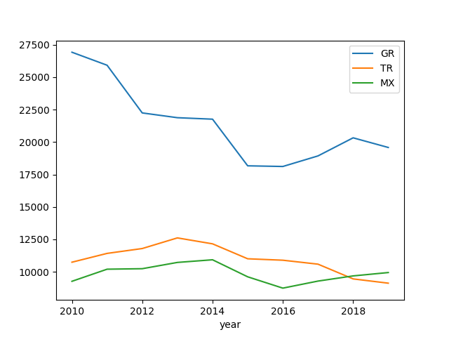

# Week 21

<blockquote class="twitter-tweet"><p lang="en" dir="ltr">This <a href="https://twitter.com/Monash_Science?ref_src=twsrc%5Etfw">@Monash_Science</a>-developed fuel cell effectively “bottles” sunshine and wind, turning them into into energy-rich ammonia that can be liquified and shipped worldwide. ☀️<a href="https://t.co/z1GINdOge9">https://t.co/z1GINdOge9</a><a href="https://twitter.com/DRMacFarlane?ref_src=twsrc%5Etfw">@DRMacFarlane</a> <a href="https://twitter.com/hashtag/ChangeIt?src=hash&amp;ref_src=twsrc%5Etfw">#ChangeIt</a> <a href="https://t.co/PqIclQ2LtW">pic.twitter.com/PqIclQ2LtW</a></p>&mdash; Monash University (@MonashUni) <a href="https://twitter.com/MonashUni/status/1392087136300675075?ref_src=twsrc%5Etfw">May 11, 2021</a></blockquote> <script async src="https://platform.twitter.com/widgets.js" charset="utf-8"></script>

---

"German Government is launching 62 Large-Scale #Hydrogen Projects. 'We
want to become number 1 in the world in hydrogen technologies'"

[Link](https://bit.ly/3wHzkYO)

---

"San Jose gunman stockpiled weapons and 22,000 rounds of ammunition"

---

"Approximately 2.6 billion kilograms of carbon monoxide and 5.2
billion kilograms of methane are released into the air annually
from cigarettes alone"

---

Smoking wld produce a lot of carbon too wouldn't it?

"Number of smokers has reached all-time high of 1.1 billion, study finds"

---

Jacobin: "The Sackler family behind Purdue Pharma became incredibly
rich off of America’s opioid crisis. Now, they are trying to shield
themselves from the punishment for creating that crisis"

---

"Once online, the [Oman] plant will use renewable energy to split water
in an electrolyser to produce green hydrogen, which is able to replace
fossil fuels without producing carbon emissions. Most will be exported
to Europe and Asia, said Alicia Eastman, the co-founder and president
of InterContinental Energy, either as hydrogen or converted into green
ammonia, which is easier to ship and store. The facility aims to
produce 1.8m tonnes of green hydrogen and up to 10m tonnes of green
ammonia a year"

[Link](https://amp.theguardian.com/world/2021/may/27/oman-plans-to-build-worlds-largest-green-hydrogen-plant)

---

<blockquote class="twitter-tweet"><p lang="en" dir="ltr">“We are making Germany a <a href="https://twitter.com/hashtag/hydrogen?src=hash&amp;ref_src=twsrc%5Etfw">#hydrogen</a> country,” Transport Minister Andreas Scheuer. <a href="https://twitter.com/hashtag/renewableenergy?src=hash&amp;ref_src=twsrc%5Etfw">#renewableenergy</a> <a href="https://twitter.com/hashtag/transport?src=hash&amp;ref_src=twsrc%5Etfw">#transport</a> <a href="https://twitter.com/hashtag/sustainability?src=hash&amp;ref_src=twsrc%5Etfw">#sustainability</a> <a href="https://t.co/lRPw2Gzm3n">https://t.co/lRPw2Gzm3n</a></p>&mdash; Graham Cooley (@GrahamCooley4) <a href="https://twitter.com/GrahamCooley4/status/1398373438864166913?ref_src=twsrc%5Etfw">May 28, 2021</a></blockquote> <script async src="https://platform.twitter.com/widgets.js" charset="utf-8"></script>

---

"Oman plans to build world's largest green hydrogen plant"

[Link](https://t.co/1t6DKmb9Xz?amp=1)

---

"Iran bans bitcoin mining as its cities suffer blackouts and power
shortages"

---

"Canada wants to force YouTube, TikTok and other video- and
audio-sharing sites to prominently feature the country’s artists, a
move that digital-law experts and former government officials call one
of the most aggressive internet regulations yet from a Western
country"

---

No war is surely better. I am saying If there is an option to help
defend an ally wout much downside, the exec better freaking know about
it..

---

Not necessarily one expert.. get many, see the mix.. If the right ppl
are in the room, like [this guy](2021/03/unrivaled-beckley.html#taiwan),
the mix will be good.

---

That comment is the half-assed analysis you'd expect from an
outsider.. Need to talk to EXPERTS to get the base facts of the
situation.. Cant be like 'ew that looks round, that's like far'.. 🤷‍♂️

---

Well *that's* completely wrong

"'Taiwan is like two feet from China,' Trump told the senator. 'We are
eight thousand miles away. If they invade, there isn't a f... thing
we can do about it'"

\#rogin 

---

"[F]or a time, Kushner and his conciliatory views toward China seemed
to have won out. After Trump's inauguration .., Kushner was the
official who had the direct line to Beijing, so he had the most
influence. He was listening to Henry Kissinger, Mnuchin, Cohn, and the
billionaires, all of whom steered him toward a friendly relationship
managed at the very top of both governments"

\#rogin 

---

China lovin Kusshhhhh 

"It soon became clear to the [China] hawks that Kushner’s instincts
led him to agree more with the finance executives and billionaires he
had known his whole life"

\#rogin 

---

"Mnuchin, the former investment banker and movie producer, became the
head of the Treasury Department and the lead official for dealing with
Beijing on trade negotiations, along with Lighthizer. He also played a
complex and covert game pushing back against the China hawks inside
the system for years, defending the interests of his Wall Street
associates and, some would say, the pro-China lobby in Washington"

\#rogin 

---

"During the campaign, dozens of GOP foreign policy establishment
figures signed public letters condemning Trump's candidacy. Those who
didn't sign such letters were privately pressured not to join Trump's
movement. That's why Trump had to rely on amateurs and unknown
outsiders like George Papadopoulos, Carter Page, and J. D. Gordon to
staff him on foreign policy during the campaign. They weren't Russian
assets. They were fringe players in the GOP foreign policy scene who
loved the idea of a huge payoff from a longshot bet on a kooky
candidate"

\#rogin 

---

Excerpts from *Chaos Under Heaven* book

\#rogin

---

Saw a shopping dist, some cafes got crushed, supermarkets took over in
their place

---

"U.S. Senators Heinrich, Luján, Fernández Push Biden Administration To
Prioritize #HydrogenEconomy"

---

Total! Excellent news.. fossil mfkers can transition easy to the new
thing.. it will benefit them and the env

"France: @Total Acquires 20% Stake in #Hydrogen Taxi Provider Hysetco"

---

"Almatech is set to develop a #zeroemission electric passenger ship
powered by the hydrogen fuelcells system"

[Link](https://bit.ly/3yIJ2eW )

---

"@H2MobilityAus

.. Updates on the HySupply partnership and why Germany is eager to
explore Australian hydrogen from BDI and UNSW"

[Link](https://mobile.twitter.com/H2MobilityAus/status/1397729193375322114)

---

"@Cummins

@Cummins is locating one of the world’s largest electrolyzer plants in
Spain to produce green hydrogen"

[Link](https://twitter.com/Cummins/status/1396765441020899331)

---

"[MMEX Resources Corp] .. signed agreement to purchase additional 324
acres in Pecos County Texas"

[Link](https://bit.ly/3hSqPWv)

---

"Biden Calls for Intelligence Report on Origins of Covid-19"

---

"The Eiffel Tower will be illuminated with certified #renewablehydrogen
electricity on Tuesday evening"

[Link](https://bit.ly/3wwn5Ol)

---

"Momentum Grows in Queensland’s Hydrogen Sector With Addition of Two
More Technology Clusters.. The two new clusters join the #H2TCA, the
national network of 13 clusters unveiled in February"

[Link](https://bit.ly/2ThzRCd)

---

"@H2MobilityAus

Significant announcement at the #AusHydrogenConf with @DrLarryMarshall
unveiling @CSIRO's new Hydrogen Industry Mission. The $68m research
mission will support the world’s transition to decarbonisation, create
new jobs and help position Australia as a #renewable energy leader"

[Link](https://twitter.com/H2MobilityAus/status/1397424107260571648)

---

TR is beaten by MEXICO. Mexico, with all its problems with drug
cartels 🤨 is better off.. 

---

The solution isnt "more people", or importing bunch of idiots from
abroad, with their chicken coops and shit, in crooked trucks...  The
truck hits a bump and the chicken jump "bwak bwak bwak bwak! bwak bwak
bwak bwak!". No.

---

GDP Per Capita fell for TR dramatically since 2013. Probably coincides
with degradation of its democracy (dem goes, innovative people
leave). WB API doesnt have numbers for 2020, but most state it did not
get better. Some estimates even place the current number to be around
$7000. Sad.


```python
from pandas_datareader import data, wb
import pandas as pd

dat = wb.download(indicator='NY.GDP.PCAP.CD', country=['TR','GR','MX'], start=2010, end=2020)
df = dat.reset_index()
df = df.sort_values('year')
df = df.set_index('year')
pd.set_option('display.max_columns', None)
df2 = pd.concat((df[df['country']=='Greece'],\
                 df[df['country']=='Turkey'],\
                 df[df['country']=='Mexico']),axis=1)
df2.columns = ['c1','GR','c2','TR','c3','MX']
print (df2[['GR','MX','TR']].dropna().tail(3))
df2[['GR','TR','MX']].plot()
plt.savefig('out.png')
```

```text
                GR           MX            TR
year                                         
2017  18930.218628  9287.849736  10591.474371
2018  20324.304992  9686.513783   9455.593654
2019  19580.988331  9946.033829   9126.561346
```



---

That's a good idea.

"The European Parliament’s annual report on Turkey suggests placing
Turkey’s far-right Grey Wolves on the EU terrorist list."

---

The upcoming movie is ruined for me now.. I thought was going to watch
a bad hombre, but he mopes and cries like a little girl.

---

🤣 Big tough guy.. money talked bro squirmed

"John Cena: Fast and Furious star ... posts a video apology in Chinese
after describing Taiwan as a "country""

---

Politico: "Democrats back growing calls for Congress to probe lab leak
theory... The ongoing discussions on Capitol Hill represent a
remarkable bipartisan agreement that Congress should investigate the
origins of a virus that has killed 3.5 million people worldwide"

---

"@mattsheffield

Texas has so many additional taxes that its burden is actually higher
than California's for middle-class people. California's taxes on rich
people are significantly higher than Texas. That's actually why GOP
commentators whine about CA taxes"

---

Everytime I hear a TX news these days it gets nuttier

"Texas to allow unlicensed carrying of handguns"

---

"@SayeeljW

95% of Gaza now has no power. Israel hit and cut most primary lines
and all we got only 3 hours a day"

---

Newton didn't have any deeper insight into why the laws are the way
they are. He tried bunch of stuff, certain formulas worked better (on
data) than others. That's it. With what we know now, with more
experimental data, and other areas of sci, you could surely modify
Newton.

"How is it possible to modify Newton's theories?"

---

Go for it. Dont worry if it has mismatches with early universe
theories.  Scientists have no idea what the f--k is going on there

"Modified Newtonian dynamics (MOND) is a hypothesis that proposes a
modification of Newton's laws to account for observed properties of
galaxies. It is an alternative to the hypothesis of dark matter in
terms of explaining why galaxies do not appear to obey the currently
understood laws of physics"

---

That number is global estimation of all reserves, currently used or
not. So this Nevada place did not expand the total, it is within the
total. The lithium is still insufficient. 

"You said lithium reserves are at ~17 million tonnes and are not enough
for green energy consumption. There, they found some new in Nevada"

---

<iframe width="200" src="https://www.youtube.com/embed/VzrNgJg-25s?start=54&end=121" title="YouTube video player" frameborder="0" allow="accelerometer; autoplay; clipboard-write; encrypted-media; gyroscope; picture-in-picture" allowfullscreen></iframe>

---


"@gabriel_zucman

Refusing international coordination is not a sustainable position: If
the UK (or any other country) refuses to apply a minimum tax, then
other countries could simply collect the taxes the UK chooses not to
collect

'@RachelReevesMP

BREAKING: The Tories just voted against our amendment on the global
minimum corporate tax on big multinationals'"

---

"@vonderleyen

We have a 3 billion euro economic and investment package ready to go
for Belarus, when it becomes democratic"

---

Dude. Using $\alpha$ based index notation instead of $i$? Like
$r_\alpha \times p_\alpha$ instead of $r_i \times p_i$ 🤦‍♂️ Insanely
annoying

---

👍 👍 👍 

"@kurtopsahl

The European Court of Human Rights ruled the GCHQ’s methods for bulk
interception of online communications violated the right to privacy
and the regime for collection of data was unlawful"

---


It's funny Belarus still calls their secret service KGB.

---

"@nahaltoosi

Oh come on...

'@AFP \#BREAKING Belarus received threat claiming to be from Hamas
against Ryanair plane: senior transport official'"

---

Sometimes all it takes to shift a conclusion is modifying one
underlying assumption.. It's true modern world is based on many little
pieces coming together and there usually isnt enough time to question
every piece otherwise u cant move forward.. But for a certain kind of
analysis, u have to be able to - else, no progress.

---

Something isn't untrue just because Fox News says it is (true). To
turn a universal motherly chiding on its head, "if all your enemies do
not jump off a bridge, would you?"

---

Shitlibs come across like cult members dont they? Dont question X, Y! 

---

Man some ppl were adamantly against this theory.. 

---

<blockquote class="twitter-tweet"><p lang="en" dir="ltr">Some of the stealth edits that Vox made to its article debunking &quot;conspiracy theories&quot; that Covid-19 originated in a lab leak between its original publication in March 2020 and now. <a href="https://t.co/RYxZ2B81mc">pic.twitter.com/RYxZ2B81mc</a></p>&mdash; Paul Graham (@paulg) <a href="https://twitter.com/paulg/status/1396769717805780994?ref_src=twsrc%5Etfw">May 24, 2021</a></blockquote> <script async src="https://platform.twitter.com/widgets.js" charset="utf-8"></script>

---

"@stevenchase

Alberta orders universities to suspend pursuit of new partnerships
with China /via @globeandmail"

---

This is what an efficient base gives you: options. H2 can power both
an FC or a traditional engine.

"@FCIndia_

Will the #FuelCell see competition from this Tiny single-piston
internal combustion #hydrogen engine ?"

[Link](https://twitter.com/FCIndia_/status/1396790580772958216)

---

"What this means, in non-technical language, is that Shi [Zheng-li at
the Wuhan Institute of Virology] set out to create novel coronaviruses
with the highest possible infectivity for human cells... 'It is also
clear .. that, depending on the constant genomic contexts chosen for
analysis, this work could have produced SARS-CoV-2 or a proximal
progenitor of SARS-CoV-2.' [said researcher from Rutgers] ..

The lab escape scenario for the origin of the SARS2 virus, as should
by now be evident, is not mere hand-waving in the direction of the
Wuhan Institute of Virology. It is a detailed proposal, based on the
specific project being funded there by the NIAID"

[Link](https://thebulletin.org/2021/05/the-origin-of-covid-did-people-or-nature-open-pandoras-box-at-wuhan/amp/?__twitter_impression=true)

---

Paolo Zavallone & His Orchestra - Big John \#music

[Link](https://youtu.be/i_hVxM2wpao)

---

"The North County Transit District announced today the California
Energy Commission has awarded it a $4 million grant to construct a
hydrogen fueling station at the agency’s West Division Breeze Facility
in Oceanside"

[Link](https://thecoastnews.com/nctd-receives-4-million-grant-to-build-hydrogen-fueling-station-in-oceanside/)

---

"California coalition aims to make hydrogen power cost-competitive by 2030.. 

HyDeal Los Angeles, a green hydrogen initiative launched in Los
Angeles on Monday, aims to bring the cost of hydrogen fuel to $1.50/kg
by 2030. At that price, to achieve 100% renewable energy, blended
electricity from a hydrogen-fueled turbine and long term low cost wind
and solar PPAs could run about 35 dollars/MWh"

[Link](https://www.utilitydive.com/news/california-coalition-aims-to-make-hydrogen-power-cost-competitive-by-2030/600239/)

---

That much-awaited [decoupling](../../2021/03/less-is-more-hickel.html#decouple)
did not take place. In the umpteenth step of a fully fledged knowledge econ (3W),
maybe, it cld happen. But we are far off from that.

"But there are ways of growing without material extraction"

---

"In discussions of climate emergency, degrowth has always been the
elephant in the room; acknowledged from time to time, but rarely
spoken about. But it may be the only solution..

To address this omission, researchers .. recently published an array
of degrowth pathways.. These show that an intentional reduction in
economic output is actually less risky than a combination of continued
GDP growth and geo-engineering. In advanced economies, degrowth would
involve a slowdown in manufacturing, accompanied by a significant
switch to green technologies and far greater focus on environmental
and ecological protection and repair.

If managed effectively, there would be no need for productivity to
fall, nor for people to become worse off. Embracing both a universal
basic income and a four-day working week would make the transition
relatively painless. Of course, a new smartphone model every year
would be out of the question, but would we really miss it?"

[Link](https://www.prospectmagazine.co.uk/science-and-technology/climate-change-degrowth-global-warming-bill-gates-geoengineering)

---

Bcz due to loss of GDP, "growth"? Two ways to increase GDP, either
through more ppl, eg immigration, 2% more ppl 2% more growth which is
"dumb growth". Or you produce more per person, GDP Per Capita
increases, even w same amount of people (or a few skilled immigrants),
GDP increases, through knowhow = good growth.

No growth is also an option.

"How the Coming Population Bust Will Transform the World"

---

via @internetofshit \#facebook 


---

MSM is plugged into all sorts of places. Of course they heard the alternative theory

"[I]nside the Times, we were sharply divided. My colleagues who cover
national security were being assured by their Trump administration
sources — albeit anonymously and with no hard evidence — that it was a
lab leak and the Chinese were covering it up. We science reporters
were hearing from virologists [the opposite]"

[Link](https://donaldgmcneiljr1954.medium.com/how-i-learned-to-stop-worrying-and-love-the-lab-leak-theory-f4f88446b04d)

---

"@RayhanAsat

It deeply saddens me that we're still at the stage of #FreeUyghurs
rather than 'Justice for Uyghurs'"

---

Icewind Turbine

<iframe width="200" src="https://www.youtube.com/embed/PWbrDe2otVc?start=185" title="YouTube video player" frameborder="0" allow="accelerometer; autoplay; clipboard-write; encrypted-media; gyroscope; picture-in-picture" allowfullscreen></iframe>

---

"Sen. Cory Booker said on Sunday that 'meaningful progress' has been
made in the negotiations on police reform that have taken place in the
House and the Senate"

---

"Dr. Martin Brudermüller (BASF) and Dr. Markus Krebber (RWE) ..
presented a project idea that envisions a new 2 GW offshore wind farm
in the German North Sea"

[Link](https://www.greencarcongress.com/2021/05/20210523-basf.html)

---

People Power ✊

"@gurgavin

IF YOU ARE HAVING A BAD DAY REMEMBER THERE ARE PEOPLE WHO: 

BOUGHT GME AT $483"

---

This VW is of the VW emission scandal fame BTW. Comp is stuffed w
crooks *and* morons. Quite an achivement..

---

🤣 🤣 🤣 

"In a recent post on Twitter VW CEO criticized hydrogen #fuelcell cars
and Glickenhaus challenged him to a race in the upcoming Baja 1000"

---

Not making a public spat with ISR probably made sense. Publicly
shitting on them cld push the muckers to more attacks.. The 2014
"conflict" lasted for 50 days after all, Biden surely remembered that.

---

Noticed that myself.. cld be significant

The Atlantic: "In a conflict where words matter (so much so that even
using the word conflict invites disagreement), it’s notable when the
words used begin to change.. a subtle, and perhaps more revealing,
shift has come from the White House.. In an address announcing
yesterday’s cease-fire between Israel and Hamas, President Joe Biden
said, 'Palestinians and Israelis equally deserve to live safely and
securely and to enjoy equal measures of freedom, prosperity, and
democracy'"

---

<iframe width="200" src="https://www.youtube.com/embed/rLJ1JpnkVc8?start=40&end=56" title="YouTube video player" frameborder="0" allow="accelerometer; autoplay; clipboard-write; encrypted-media; gyroscope; picture-in-picture" allowfullscreen></iframe>

---

"Robert Redfield, director of the [CDC, himself a virologist] under
Trump, recently said he believes that a lab leak is the most likely
explanation of how the pandemic started"

---

"You cannot make sense of the firmness with which the lab leak
hypothesis was dismissed without appreciating how Trump changed
American media. After the 2016 election, the top tier of American
media traded objectivity for opposition. As the New York Times has
more or less admitted, normal standards no longer applied. Success was
now defined by the extent to which you made Donald Trump’s life
difficult"

[Link](https://thecritic.co.uk/letter-from-washington-the-great-lab-leak-u-turn/)

---

"@TheEconomist

Each year companies shift almost $700bn in multinational profits to
tax havens. On 'Money Talks', @SoumayaKeynes asks economist
@Gabriel_Zucman how governments will change the way they tax the
world's most profitable companies"

[Link](https://twitter.com/TheEconomist/status/1396163740446380035)

---

"@Opel Unveils its Opel Vivaro-e: Plug-In FuelCell Electric Vehicle
Offers ZeroEmissions and Quick Refuelling. Fuelcells system in the
engine bay, hydrogen tanks replace the battery"

[Link](https://bit.ly/2SM6Ii7)

---

U can do that see bcz fuel is energy-dense as f--k

"@DaimlerTruckBus as it Began Rigorous Testing of Its FuelCell
Truck. The Aim is to achieve ranges of up to 1,000 kilometres and more
without any ... refuelling"

[Link](https://bit.ly/33XedFo )

---

Jacobin: "Palestine Is No Longer the Third Rail for Democrats.. For
decades, the US media and political class have parroted Israel’s
claims of victimhood, despite Israel being an occupying state power
acting against an occupied people. The details change, but the story
remains the same: Israeli forces attack civilians.. In the wake of
these latest strikes, however, this consensus may finally be
crumbling"

---

Politico: "After months of letting their power to obstruct go unused,
the Senate GOP is ready to filibuster legislation creating a Jan. 6
commission. If Republicans follow through, they'll spark a
long-building fight over the filibuster’s very existence"

---

"@istanbultelaviv

[ISR talk show] Berko and Ofira usually nails it. Berko: 'I heard all
analysts blabbering; at school they taught us 1+1=2... once the
mandate went to Lapid, a war started....I'm not hinting, I am saying,
Netanyahu did all of this...he needed a war to save himself'"

---

Orgone - Hambone \#music

[Link](https://youtu.be/TZvOoOUXgBc)

---

The evidence is destroyed, got nothing to worry about. Might as well
act like it for optics.. Preemptive ask now is better than being asked
later.. This guy cld be good in marketing.. 

"@joshrogin

Fauci is now saying he’s not confident the coronavirus emerged naturally"

---

"Africa Could Become Germany’s Hydrogen Supplier. First results of the
BMBF project “GreenHydrogen Potential Atlas” show immense potential
for a hydrogen partnership between Germany and West Africa"

[Link](https://bit.ly/3u8RrF2)

---

US negotiating limits on the nuke arsenal?

---

NK strat called for NK [not giving up on nukes](../../2021/03/unrivaled-beckley.html#noko).
What changed?

---

Not much going on.. that's f-ing great. Less news. 

---

