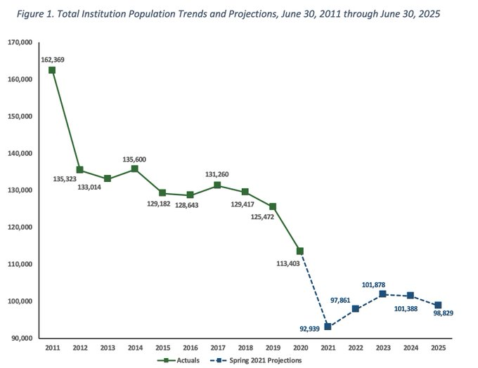
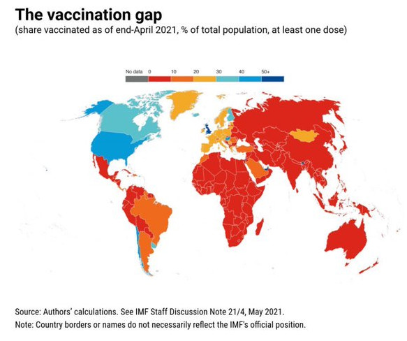

# Week 22

AFP: "The European Union and Britain launched parallel competition
probes on Friday into whether Facebook uses data from advertisers to
unfairly dominate the online classifieds market"

[Link](http://u.afp.com/U7Ce )

---

Politico: "Biden is formally directing federal departments and
agencies to make fighting global corruption a priority... [said]
corruption 'makes government less effective,' 'exacerbates
inequalities' and 'attacks the foundations of democratic
institutions.' 'Fighting corruption is not just good governance. It is
self-defense'"

---

Conflict Stats code update: 

New [script](../../2023/01/confstats.html#gdelt) takes GDELT conflict data set
for past 7 days (for Iraq and Syria) and plots attacks on a map,
markers showing the "from" actor. GDELT event codes used for filtering
were 190, 194 and 195 (the "AI" producing GDELT data isn't too
accurate, so it shows some non-attacks too. But the map can give a
rough idea).

The output is a snazzy Leaflet.js map, just click on the "Output" link
to see it.

---

"Severstal and Gazprom Neft Join Forces on Decarbonization Using
Hydrogen. Jointly pursue and develop opportunities and techs for
capturing &amp; utilizing carbon dioxide, as well as using hydrogen in
metallurgical production"

[Link](https://bit.ly/3g2X036)

---

"Grupo Antolin Is Researching on Carbon Nanofibers to Drive #Hydrogen
FuelCell Development. Aim is to improve the efficiency, durability,
cost reduction of critical components in next-generation hydrogen
\#fuelcells"

[Link](https://bit.ly/3wTG4mq)

---

"@Renault and @PlugPowerInc’s Joint Venture Leads the Way to a Complete
Ecosystem of #FuelCell Powered LCVS, Green Hydrogen and Refueling
Stations Across Europe"

[Link](http://bit.ly/2T9Vb7b)

---

California prisoners 2011-21 via @CraigOGilmore



---

WaPo: "Looking specifically at California, where full marijuana
decriminalization went into effect on Jan. 1, 2011, the report finds
that "marijuana decriminalization in California has not resulted in
harmful consequences for teenagers, such as increased
crime, drug overdose, driving under the influence, or school dropout"

---

"@zackwhittaker

New: TikTok has changed its privacy policy allowing it to collect
biometric data on U.S. users, including 'faceprints and voiceprints'"

---

Probably en route to pick up some shady shit

Politico: "Two Iranian Navy ships rounded the Cape of Good Hope for
the first time and appear to be headed across the Atlantic, continuing
a journey U.S. officials believe could ultimately end in Venezuela"

---

I mean look at [this](twimg/EcQ5MTgWAAEMbqZ.png).
"95% of stuff in the universe, we basically don't understand". This is
f-ing embarrassing. 

---

Why bother with modified Newton dynamics? Bcz it is one thing we can
cross out in our list of undone items. The list is already huge.

---

AFP: "Putin says wants to find ways with Biden to improve ties"

----

"@sambrodey

Schumer has lined up June votes on high-priority Dem bills that won't
get 60 votes, maybe not even 50. It'll be a reality check, but some
are reading the tea leaves and hoping this is some strategic L-taking
in service of ending the filibuster"

---

"As spare vaccines are set to expire at the end of this month, the
Biden administration is considering donating unused doses to countries
in need"

---

How about an H2 Lada?

"Russia: Aurus Unveils a Hydrogen FuelCell-Powered Luxury Limousine"

---

"An International Coalition Is Being Set Up to Support the Use of
Clean [H2]. Australia, Austria, Canada, Chile, China, Germany, India,
Italy, Morocco, Norway, SaudiArabia, South Korea and UK to
collaborate"

[Link](https://bit.ly/34DYhID)

---

I like how UK and Oz parliament's have speakers who regulate question
time, and whoever talks talks to him/her do not address any opponent
directly, unless its a direct question to someone in gov. Its a useful
custom that can reduce friction, add little etiquette, help raise
discourse above trash talk.

---

"Clean Power Announces Transition To Single Purpose #Hydrogen Tech
Company--Will now focus on the design, build, installation, and
operation of hydrogen dispensing units for hydrogen-fueled vehicles"

[Link](https://bit.ly/3fKOEOF)

---

Previous Nasa admin

<blockquote class="twitter-tweet"><p lang="en" dir="ltr">Life on Venus? The discovery of phosphine, a byproduct of anaerobic biology, is the most significant development yet in building the case for life off Earth. About 10 years ago NASA discovered microbial life at 120,000ft in Earth’s upper atmosphere. It’s time to prioritize Venus. <a href="https://t.co/hm8TOEQ9es">https://t.co/hm8TOEQ9es</a></p>&mdash; Jim Bridenstine (@JimBridenstine) <a href="https://twitter.com/JimBridenstine/status/1305598182571810822?ref_src=twsrc%5Etfw">September 14, 2020</a></blockquote> <script async src="https://platform.twitter.com/widgets.js" charset="utf-8"></script>

---

<blockquote class="twitter-tweet"><p lang="en" dir="ltr">Australia’s first “hydrogen valley” is being created in New South Wales, led by renewables business <a href="https://twitter.com/EnergyEstate?ref_src=twsrc%5Etfw">@EnergyEstate</a>. The valley will run entirely on renewable energy under a $2bn proposal supported by local &amp; global energy companies.<br><br>Read more here: <a href="https://t.co/vlIAwD6B4P">https://t.co/vlIAwD6B4P</a> <a href="https://t.co/qJBJnagDvS">pic.twitter.com/qJBJnagDvS</a></p>&mdash; Hazer Group Ltd (@hazergroupltd) <a href="https://twitter.com/hazergroupltd/status/1400225950042935299?ref_src=twsrc%5Etfw">June 2, 2021</a></blockquote> <script async src="https://platform.twitter.com/widgets.js" charset="utf-8"></script>

---

*Wrath of Man* 👍

Scott Eastwood can play good guy, bad guy.. not too shabby. He shed
daddy's image pretty early on, made some interesting mov choices..
Smart actor.

---

Other [H2 storage methods](../../2022/02/h2-storage.html)

---

Blogged about [LOHC](../../2020/11/h2-lohc.html) before.

---

CNBC: "Siemens Mobility to work on hydrogen tech for trains after
signing agreement.. Siemens Mobility has signed a memorandum of
understanding with a Germany-based organization to undertake joint
research into the use of liquid organic hydrogen carrier technology in
the railway sector...

According to Siemens Mobility, LOHC technology involves an organic
carrier liquid absorbing hydrogen, releasing it only when
required. Among other things, the company says this stops hydrogen
escaping as a gas and negates the need for it to be stored at low
temperatures or high pressure. Transportation, it adds, is
inexpensive"

---

NYT: "Iranian Navy’s Largest Ship Catches Fire and Sinks"

---

BBC: "Chemical-laden ship sinking off Sri Lanka.. Hundreds of tonnes of
fuel oil could leak into the sea with devastating impact on marine
life"

---

Fareed [on China](https://youtu.be/1zj-HFUSagA?t=30)

---

"EU agrees to new tax transparency rules for multinationals.. The new
rules would require multinational companies to list their profits
made, taxes paid and the number of people they employed in individual
EU countries"

---

And the mission after that: [LANDO](../../2020/09/space-exploration-goals-colonization.html#lando).

---

Great

BBC: "Nasa has announced that it is sending two new missions to Venus
in order to examine the planet's atmosphere and geological
features.. '[C]ombined results of these missions will tell us about
the planet from the clouds in the sky through the volcanoes on its
surface all the way down to its very core,' said Tom Wagner from
Nasa's Planetary Science Division"

---

"Developed Countries Lock Up Covid-19 Vaccines Through 2023"

---

New stuff.. new stuff.. bring the new stuff

---

Ditto for *The Tomorrow War*.

---

*Infinite* trailer looked good

---

"£10B Floating #Wind and Hydrogen Development Project to Decarbonize
UK. CeruleanWinds reveals plan to accelerate decarbonisation of oil
and gas assets through an integrated 200-turbine floating wind and
hydrogen development"

[Link](https://bit.ly/2TtbEJ3)

---

<blockquote width="200" class="twitter-tweet"><p lang="en" dir="ltr">THIS IS NOT THE FUTURE I WANTED <a href="https://t.co/FjrR0uZKUE">pic.twitter.com/FjrR0uZKUE</a></p>&mdash; following the dopamine (@randileeharper) <a href="https://twitter.com/randileeharper/status/1399918327657484295?ref_src=twsrc%5Etfw">June 2, 2021</a></blockquote> <script async src="https://platform.twitter.com/widgets.js" charset="utf-8"></script>
 
---

The Guardian: "Biden corporate tax plan could earn EU and UK billions, study shows"

---

Go for it

Bloomberg: "Instacart Wants to Replace Army of Gig Shoppers With
Robots"

---

"@Greene_DM

It is difficult to overstate the degree to which the Gates Foundation
turned education into a field for venture capital: long-shot
investments reorganizing whole states and schools, that mostly fail,
in the search for high-scoring unicorns"

[Link](https://mobile.twitter.com/Greene_DM/status/1399344835727966210)

---

"@RachelBarkow

Doesn't anyone fact check opinion columnists @nytimes? Because police
budgets have largely increased around the country, not decreased, and
homicides are up in cities with increased police budgets as well as
those that have stayed the same"

>@nytimes
>In Opinion "They got what they wanted," former NYPD and LAPD
>commissioner Bill Bratton tells @MaureenDowd. "They defunded the
>police. What do they get? Rising crime

[Link](https://mobile.twitter.com/RachelBarkow/status/1398980129188089864)

---

Demilitarize US To Palestine

"We condemn the continuation of these militarized practices used to
repress marginalized communities. We know that freedom from state
violence in the U.S. is deeply intertwined with freedom from state
violence in Palestine — recognizing this is the first step towards our
collective liberation"

[Link](https://demilitarizeu2p.org/)

---

My GSI Outdoors boiling [pot](twimg/E2xhG5YXoAM-M4V.jpg) has a
snug-fit cover, lid never gets too hot, cooks perfectly, is light. There is some
freak science going on in there.. 

---

[Pandering to the crowd](twimg/Ev3M9t0WgAAdkKv.png)
is profitable for companies as well, and now, for big tech. Users
think they are "changing the world" by dancing on TikTok, engagement increases,
more money for the platform.

---

"@internetofshit

Hey it's Amazon here, we're opting you into the largest surveillance
dragnet in history, you're down right? xoxo, Bezos"

---

"@cullend

Also you have to download the app to opt-out, can’t do it on web,
which makes your device a Sidealk beacon unless you go through a
different opt-out"

---

The Guardian: "Amazon US customers have one week to opt out of mass
wireless sharing. Critics raise transparency fears over plan to turn
all smart home devices into ‘mesh network’"

---

Tap that

"The EU is finally ready to tap [debt] markets in a $900 billion stimulus push"

---



---

"Bee’ah And Chinook Sciences Announces Region’s First Waste-To-Hydrogen
Project"

[Link](https://bit.ly/3i7uVdA)

---

The devoutness signal can also be used a means to stratify, create
hierarchy in society. If someone buys in, into something this out of
whack, which by the very nature of its whackiness *surely* leaves out
certain people, then you automatically are creating yourself an
"in-crowd". It's like a college fraternity, who is allowed in? The
pledge who puts panties on his head runs around half-naked screaming
"I am from outerspace" while riding a broom. That's the guy you want,
right? He is signaling he *really* wants to be in the club.

---

Tigger national narrative being so broken creates many unwanted
side-effects. Because the narrative is bizarre, only the most devout
can buy into it wholesale. Then higher-ups can use that buy-in as a
signal, to weed out normals, allowing in fanatics. Those fanatics you
can direct anywhere, to your mafiatic organizations, extrajudicial
killings, whatever.

---

Surah Al-Hajj - 46

---

John 9:25

---

Kemal himself was born and raised in Thessaloniki BTW, in today's Greece.

He sure as shit didn't look Asiatic.

---

It's true.. for someone who wanted science based, pro-Western reforms,
Kemal was pretty [unscientific](../../2021/05/anatolia.html#unscientific) in
his approach to history.

---

[Anatolia](../../2021/05/anatolia.html)

---

"@NektariaAna

Istanbul Greek Idiom #25: Α mansion on the shores of the Bosporus is
called γιαλί/yalí. The word descends from the Ancient Greek
αιγιαλός/eyialós (seashore) and has passed into Turkish as *yalı*"

---

I didnt have to use braces after `\dot`? Why didnt you say so foo!

`\dot{X}` -> $\dot{X}$

`\dot X` -> $\dot X$. 

Still $\LaTeX$ is awesome

---

"[There] is an effort led by Secretary of Energy Ken Wagner to drive
commitments of $1 billion of investment to develop a hydrogen fuel
industry in Oklahoma. Such an industry could yield investments in new
power and processing plants, retrofitting existing gas power plants,
pipeline expansion, fuel storage, trucking company opportunities and
carbon sequestration.

'As of right now, it’s my No. 1 priority,' Wagner said. 'This is the
one technology that is complementary to all of our best resources. (…)
I think the long-term impact is tremendous.'"

[Link](https://nondoc.com/2021/05/24/oklahoma-could-be-epicenter-of-hydrogen-fuel-industry/)

---

Much interaction between peoples.

Grillo, *Pluralism and Politics of Difference*: "From the seventeenth
centuiy, [the Ottoman] *millet* [a system whereby peoples usually
grouped under religion, eg. Armenian millet] was 'probably current' in
the offices of the central government... In sum, then, *millets* were
institutions which were quite heavily organized at the top and at the
centre (in Istanbul) and thus 'existed' in some sense from the point
of view of the bureaucracy and their own leaders. In the towns and
villages of the provinces, however, the form of the institution, and
the degree of institutionalization varied greatly; in some places they
must scarcely have existed at all"

---

Governance culture can be different from people culture. As Tolay [said](../../2020/07/migrations-anatolia.html)

>The Persian dominance in Anatolia until Alexander the Great’s
>conquests in 380 BCE had a great impact on the political structure of
>the area (satrap system), but did not fundamentally alter the
>overwhelmingly Hellenic culture of Anatolia

TR governance is (sadly) Roman, people's culture today is of many
things; Hellenic, little Celtic, Christianity and Islam (both
variants), including, marginally, some migrants (not just "Turks").

---

Politico: "[Bitcoin] lobbyists face an uphill battle that has gotten
even tougher after dramatic price swings in recent days, with Bitcoin
plunging nearly 40 percent since early May... [Warren] 'The wild
swings of crypto prices sound an alarm that every regulator hears'"

[Link](https://www.politico.com/news/2021/05/30/bitcoin-investment-wall-street-lobbying-491399)

---

"Dual-Use Hydrogen Energy Storage Could Put Food Cold Chain On Road To Net Zero"

[Link](https://bit.ly/3i352eE )

---

And there is that.. but change is good. Fingers crossed.. hopefully
Pals will die less this time. Even that would be an improvement, right?

Haaretz: "The Palestinians believe a Bennett-Lapid government would be
'extreme rightist' and 'no different' from Benjamin Netanyahu, a PLO
official said"

---

.. after he tried so hard to hang on.. 😢 

WaPo: "Israeli opposition parties reach agreement to oust Prime
Minister Benjamin Netanyahu"

---

As long as gov is central, concentrated, maximized, we need similar
institutions in scale that can take them on..

---

Assange story shows, MSM wasnt insterested, and bcz they weren't, ppl
werent either. 

There is still a filtering mechanism, and they are at the center of
it. At least in the developed world where media isn't completely sold
out.. We want them to be better of course.

---

G. Greenwald: "I remember [Assange] telling me the story that he
learned very early on which is when Wikileaks would get documents they
would put them on the Internet they wanted the entire public to be
made aware of them, and they would then contact journalists at the New
York Times the Washington Post, The Guardian, BBC and they would say
we have this incredibly explosive document sitting here, on the
Internet .. and no one was interested in it because they didn't think
it was exclusive..

That was why Wikileaks began partnering with the media in the Snowden
case when Edward Snowden came to us .. precisely because we weren't
part of the establishment press, but we realized .. that if we didn't
partner with long large media outlets it would be very easy for the US
government to demonize and stigmatize us as something other than
journalists. They would say we were hackers we were activists they and
so .. we partnered, and did the story with The Guardian, Laura did
hers mostly with the Washington Post some with Der Spiegel, and even
the New York Times and it gave a measure of protection.

So when I got this material in Brazil, and remember this is four
months after Bolsonaro got inaugurated, this huge right-wing movement
took over the entire country, he was at the peak of his power, we
didn't know what he was capable of doing in terms of press freedom. He
had sworn over and over that he would usher in dictatorship era
repression and I knew we needed the buy-in of the large Brazilian
media or we would easily be depicted not as journalists but as
criminals, especially since I'm not a Brazilian citizen despite living
in this country for 15 years.. we were able to partner with Folio of
Sao Paulo which is essentially the New York Times of Brazil the
largest newspaper in in the country"

[Link](https://youtu.be/GkptwyIYsxw?t=1028)

---

An established media channel isn't just about a building, offices, HR
department.. they are a collection of skills, capabilities,
institutional memory, and mentorship around such. That Goldman Sachs
whistleblower for ex.. G. Smith, I read the book.. says he went to MSM
for his tell-all. They have resources to follow up, checking if this
guy is real. who can do that? John, Jane, Greg, mentored by Dave,
whatever. Greg is out, will send Jane. If not John.  How is the random
TikTok jagoff going to handle that? No institution, no nothing. It's
just one guy dancing

---

Run the microcosmic orbit.. small heavenly cycle. Do the inner smile 

"@MicrobiomDigest

Just got another legal threat, now for my criticism of the "External
Qi" papers. In those papers, a Qigong Master claims to treat cancer
cells with his force. The lawyer representing the authors demands me
to take down my Pubpeer postings"

---

NYT: "Gangs Erode Maduro’s Grip on Caracas.. As Venezuela collapses,
armed gangs are taking over parts of the capital, exposing President
Maduro’s vulnerability even in his seat of power..."

[Link](https://www.nytimes.com/2021/05/30/world/americas/venezuela-gang-maduro.html)

---

Sounds like she was canceled.. Cotton joined in that pile on? Dont
some of these mfkers complain about cancel culture? Congrats bozo, now
u are the instigator.

<iframe width="200" src="https://www.youtube.com/embed/1gBmlQXXrfQ?start=174" title="YouTube video player" frameborder="0" allow="accelerometer; autoplay; clipboard-write; encrypted-media; gyroscope; picture-in-picture" allowfullscreen></iframe>

---

If politically gov chooses fossil -> H2 rather than green -> H2 w CCS,
fine..  Just saying there is immense potential, for many other
countries as well, Africa, South America..

---

One country / continent with 219,000 TWh of annual potential. That is
just insane.

It's great!

---

According to IEA world energy consumption for 2013 was estimated to be
157,481 Terrawatt hours. In one year Oz can produce

```python
print ((25000 * 24 * 365) / 1000, 'TWh')
```

```text
219000.0 TWh
```

.. meaning single-handedly Oz could produce *more* energy required for
the entire world, using completely renewable resources 😶

---

Is this serious? That number is crazy.. 

"Australia receives more sunlight per square meter than just about any
other country. Its south and west coasts are also buffeted by powerful
winds. Overall, the country boasts a renewable energy potential of
25,000 gigawatts"

---

It can be stored at room temparature, major advantage

"Research also indicates that the energy density by volume of ammonia
is nearly double that of liquid hydrogen, its primary competitor as a
green alternative fuel. Ammonia is also much easier to ship and
distribute"

---

"In 2018, Douglas MacFarlane, a professor of chemistry at Monash
University in Australia, developed fuel cells that can transform
renewable electricity into ammonia... MacFarlane’s fuel cells operate
in reverse, making carbon-free fuel from electricity

'This is breathing nitrogen in and breathing ammonia out,' said
MacFarlane, showing his fuel cell. It is almost the size of a hockey
puck and clad in stainless steel. Two plastic tubes on the cell’s
backside feed it nitrogen gas and water. It has a power cord for
electricity and a third tube on the front that silently exhales
ammonia"

[Link](http://www.power.news/2021-05-06-chemist-develops-ammonia-fuel-cells.html)

---

Van Wilder knows how to party! 

---

Yeah [that's you](../2020/vanwilder1.jpeg)

---

I would expect nothing less from a company founded by ADOLF HITLER

---

Guy is talking out of his ass..

"VW CEO says fuel cell cars 'not the answer'"

---

Class is weird in UK. Actor Dominic West (Jimmy "Fuckin" McNulty, *The
Wire*), tells a story when he first met one director he just looked at
him and said "posh". As in he labeled him as a posh type.. Funny thing
is West mostly played working class roles in his career.

Posh not posh.. who decides these things.. Just by the look, and it's
done? Who wld fall in that bucket?

Damian Lewis would be.. posh?

Jason Statham.. Not posh.

---

