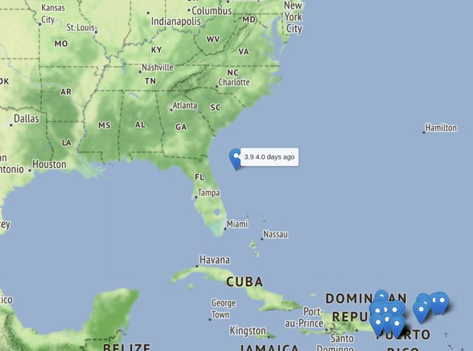
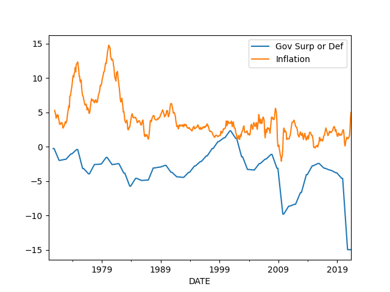

# Week 25

"Study Shows Shipping Green Hydrogen From Iceland to Rotterdam to be
Realistic Before 2030. @PortOfRotterdam aims to become the major
import hub for hydrogen to supply Europe"

[Link](https://bit.ly/3d9QBCo)

---

So Occam was not the fist one to come up with his "razor"?

Aristotle: "We may assume superiority, other things being equal, of
the demonstration which derives from fewer postulates or hypothesis"

---

"The House Judiciary Committee advanced a bill that would make it
easier to break up tech companies like Facebook and Google"

---

"Biden will nominate housing nonprofit executive Julia Gordon to be
the commissioner of the Federal Housing Administration"

---

The Dutch was also adamantly against any RU overtures. "One word:
MH17"? Damn.

"EU leaders have rejected a push by Germany and France to relaunch
meetings with Russian President Vladimir Putin after fierce resistance
from member states worried about Moscow's aggression"

[Link](http://u.afp.com/U2C9)

---

Tarantino on films being too PC: “There has become a thing that’s gone
on, especially in this last year, where ideology is more important
than art"

---

No it isn't. The issue is one of categorization.

After transitioning, eg male to female, an athlete does not become a
female, s/he becomes a "female who used to be male". This is a new
category, and they should compete under it.

"Trans athletes being allowed to compete in their chosen gender is an
issue of human rights"

---

'Cloud-enabled' external (local) hard-drive gets deleted via
Internet 🤣

Increasing bizarre dependencies is so awesome..

"[Western Digital] My Book Live users wake up to find their data
deleted" via @internetofshit

[Link](https://arstechnica.com/gadgets/2021/06/mass-data-wipe-in-my-book-devices-prompts-warning-from-western-digital/)

---

Oz is following a zero-tolerence covid strategy. Regional and federal
gov are both conservative.

"Central Sydney's streets are deserted as Australia's largest city
begins a week-long lockdown to contain the highly contagious Delta
coronavirus variant, with authorities warning broader restrictions
could follow"

[Link](http://u.afp.com/U6iq)

---

Im just kidding

---

It was this



"Mystery of what caused South Florida condo collapse deepens"

---

This thing is constantly being dangled in front of people to "change
the subject", Trump used it for the same reason. Cant u find another
way to "change the subject"?

My take [here](../../0119/2015/08/ufo.html) is unchanged.

"No firm conclusion on UFOs, says US intelligence report"

---

Dude u got the shit kicked out of you.. it was terrible terrible
showing..  Endemic of the garbage state the country is in..

"Euro 2020: Turkey eliminated after Switzerland's 3-1 victory"

---

AFP: "The British government said Thursday it will bring in an evening
watershed for junk food adverts in a move to tackle the nation's
obesity problem"

[Link](http://u.afp.com/U2VU)

---

"Ionomr Innovations Inc. Breakthrough Aemion+ Membrane Now Available
For Industrial Scale Green Hydrogen Electrolysis.. Highly stable,
efficient membrane for the [H2 economy]"

[Link](https://bit.ly/3xNZcT9)

---

WSJ: "Covid-19's Silver Lining in Latin America: Millions of New Bank
Accounts.. Government aid turbocharged growth in digital banking"

---

Music to my ears..

The Atlantic: "How Disney Mismanaged the Star Wars Universe And how
The Mandalorian can restore the true power of George Lucas’s galaxy"

[Link](https://www.theatlantic.com/magazine/archive/2021/07/gross-altman-star-wars-mandalorian/619016/)

---

"@ACatInParis

France, Germany propose Putin overture to a divided EU" via @FRANCE24"

[Link](https://f24.my/7ma4.T )

---

"@PlugPowerInc

U.S. Senator Martin Heinrich (D-N.M.) has introduced the Advancing the
Clean Hydrogen Future Act of 2021 establishing RDD&D to reduce cost
and improve efficiency of producing hydrogen using electrolyzers"

[Link](https://t.co/XPJMbqnPUZ?amp=1)

---

[ME attacks](../../2023/01/confstats.html#gdelt) GDELT update. Now plotting
US bases alongside attacks.

Heavy US presence in Northeast Syria, an area that doesnt seem to get
many attacks. Iraq is seeing some action..

---

Yes there is an increase

---

US gun violence increased? [Check](../../2023/01/confstats.html#usgun)

---

"US sanctions Chinese solar firms for Uighur human rights abuses"

---

♪♬ I shot the sheriff.. ♪♬ but I didn't shoot the deputy

---

They dropped bombs *near*, but did not shoot *at*?

---

Haha

Who to believe...?

WSJ: "U.K. Denies Russia Fired Warning Shots at Warship"

---

NYT: "Russia Says It Fired Warning Shots at a U.K. Warship Near Crimea"

---

They force Britney Spears take lithium? There isn't enough lithium! There
wont be any left for those f-ing batteries! Stop taking lithium as a
drug!

---

"John McAfee: Anti-virus creator found dead in prison cell"

---

Al Jazeera: "‘My Zionism’: Israel’s latest unsuccessful PR stunt Using
token Black Israelis in Israeli PR will not help make Israeli
apartheid more acceptable to the world"

[Link](https://www.aljazeera.com/opinions/2021/6/23/my-zionism-israels-latest-unsuccessful-pr-stunt)

---

"Wind turbines: How UK wants to become 'Saudi Arabia of wind'"

[Link](https://www.bbc.co.uk/news/science-environment-57519392)

---

"US Sec. of State Blinken warns countries not to benefit from forced
labour in Xinjiang"

---

"@Wright_bus

We're so proud to announce @MayorofLondon , @SadiqKhan , will today
launch England’s first ever hydrogen double decker buses, manufactured
by our team here at @Wright_bus , to help make the bus fleet
zero-emission, and clean up London’s toxic air"

---

The bases are not without local contraversy. Especially in Okinawa.

---

There is a base on the Ascension Island! 

Some mystery surrounding the Diego Garcia base.

A docu claims Ramstein base (in Germany) is huge; and attacks into
Iraq were supported logistically from there.

---

There isnt much of a presence in Greece, but I have a feeling that is
about to change

---

'Mericans everywhere!

---

US bases [around the world](../../2023/01/usmil.html#bases) 

---

EA was against stop-and-frisk? Interesting.. 

---

I dont think training better teachers, in US context, is an option..
US is no Finland.

---

"@ZachandMattShow

NYC Mayoral Frontrunner Eric Adams: 'With new technology you don’t
need school children to be in a school building with a number of
teachers. It’s just the opposite. You could have one teacher teach
300-400 students.'"

[Link](https://twitter.com/zachandmattshow/status/1403437549025173508)

---

<blockquote class="twitter-tweet"><p lang="en" dir="ltr">More and more people are saying this <a href="https://t.co/tL9qSdxu0J">https://t.co/tL9qSdxu0J</a></p>&mdash; Gabriel Zucman (@gabriel_zucman) <a href="https://twitter.com/gabriel_zucman/status/1407399987600896004?ref_src=twsrc%5Etfw">June 22, 2021</a></blockquote> <script async src="https://platform.twitter.com/widgets.js" charset="utf-8"></script>

---

"@GraceALewis

Received a message on Sunday morning and did not reply because it is
my day off to spend with my family. Woke up Monday morning to a harsh
message because I had not replied. We cannot accept this as normal and
acceptable behavior"

---

AFP: "EU launches antitrust probe against Google over online advertising"

---

Members can run the earthquake report for any region, anytime

---

"Japanese Tech Companies ENEOS and Chiyoda Corporation to Slash Green
Hydrogen Costs by Two thirds.. To build a facility that will use a
proprietary electrolysis tech to significantly lower costs"

[Link](https://bit.ly/3zPv63k)

---

"@BtSIsrael

Guest speaker @OmarSShakir

'There are over 600 checkpoints in the West Bank that can turn a
routine day into a horrifying ordeal.'"

---

"@PlugPowerInc

Plug Power Announces 2021 First Quarter Results - Reports 72.0M
dollars in Revenues and 73.7M dollars in Gross Billings for Q1 2021 -
up 76% and 71% year over year"

---

"GenCell Energy Successfully Deploys its Revolutionary A5 Off-Grid
FuelCell Solution in Iceland. @gencellenergy A5 combines the
advantages of low temperature #fuelcell with the ability to operate on
liquid ammonia fuel"

[Link](https://bit.ly/3xAkSlG)

---

"@Airbus, @airliquidegroup and Groupe ADP Partner to Prepare Paris
Airports for the Hydrogen Era.. Agreement to prepare for arrival of
hydrogen in airports by 2035 part of the development of
hydrogen-powered commercial aircraft"

[Link](https://bit.ly/3xCNb30)

---

"The First Green Hydrogen Production Project Is Launched in Lithuania"

[Link](https://bit.ly/3h5VT3d)

---

"With the notion of systemic rivalry, the European Union hoped to
separate political differences and economic links. In strategic
rivalry, conflict leads. In systemic rivalry, conflict is limited to
the political sphere. It is part of the EU’s political tradition to
believe that politics and the economy can be insulated from each
other...

Over the past two years, [the EU] approved a barrage of new
regulations limiting the Chinese state’s ability to interfere with the
framework of economic links between the two blocs. These include
investment screening, trade defense instruments, a package against
state subsidies and a public procurement tool...

The deal included significant concessions from Beijing, including a
greater level of market access and disciplines on state-owned
enterprises, transparency of subsidies and rules prohibiting forced
technology transfer. 'By giving us a big gift, they hoped to prevent a
united front with the Biden administration,' the official said.

What surprised China is that the EU never regarded the CAI as a
political agreement. Having forced Beijing to concede on key points,
the bloc did not hesitate to walk over China’s most salient red
lines. On March 22, the EU joined the U.K. and the U.S. in imposing
sanctions aimed at Chinese officials believed to be involved in human
rights violations in Xinjiang province"

[Link](https://www.politico.eu/article/eu-china-strategy-geopolitics/)

---

🤣 🤣 🤣 

[Meme](twimg/E4dN9xbVgA46Bz5.jpg)

---

"@esdnews

@H2MobilityAus has welcomed the federal government’s Discussion Paper
on the Guarantee of Origin scheme for clean hydrogen, saying
certification is 'crucial' to building a credible industry"

---

Mars is dead as fuck. No techtonic activity for millions of
years.. It's a turd of a planet.

---

Some claim techtonic activity is a necessary ingredient for
life. Earth is the only planet in the solar sys to have it (and maybe
now Venus), and Earth is also the only planet with life.

---

"@VICE

[Venus] Scientists discovered tectonic motion on our sister planet [based on
existing data, they used a new model]"

---

"Ilhan Omar started out in Congress as a somewhat lonely critic of
decades of U.S. policy in the Middle East. Now, six months into her
second term, the Minnesota Democrat has new and diverse allies.

The latest flareup of intra-party frustration with Omar’s progressive
brand of foreign policy appears to have calmed.. While Omar’s recent
comments weren’t as directly disparaging as she’s been in the past,
Democrats are showing they’re increasingly comfortable backing her up,
particularly as she hammers the Israeli government in ways that buck
long-held bipartisan traditions in Washington...

'Some may call Congresswoman Omar’s comments harmful or piercing. But
I think they’re only piercing because we’ve avoided the conversation
for so long. And she’s not avoiding it,' Rep. Jamaal Bowman (D-N.Y.)
... said in an interview"

[Link](https://www.politico.com/news/2021/06/22/israel-politics-omar-democrats-495415)

---

<blockquote class="twitter-tweet"><p lang="en" dir="ltr">&quot; <a href="https://twitter.com/BMW?ref_src=twsrc%5Etfw">@BMW</a> Latest Maker to Accelerate <a href="https://twitter.com/hashtag/Hydrogen?src=hash&amp;ref_src=twsrc%5Etfw">#Hydrogen</a> Fuel Cell Development.&quot; 🙌🙌<a href="https://t.co/YmrCc1Bum0">https://t.co/YmrCc1Bum0</a> <a href="https://t.co/toOkvh95Sr">pic.twitter.com/toOkvh95Sr</a></p>&mdash; Energy Independence Now (@DriveH2) <a href="https://twitter.com/DriveH2/status/1407378138825428995?ref_src=twsrc%5Etfw">June 22, 2021</a></blockquote> <script async src="https://platform.twitter.com/widgets.js" charset="utf-8"></script>

---

"@josheidelson

Speaking of 'cancelation,' U.S. workers can legally be fired for
almost any reason, or no reason. A groundbreaking NYC law changes that
for 70,000 in fast food"

---

UCDP/PRIO May file [is out](../../2023/01/confstats.html). Afganistan, Yemen,
Nigeria deaths increased. 

---

I looked in this general region bcz the Navy deploy map said that carrier
was in the Atlantic coast.

---

I bet it was here.

Gotcha


---

Output at the bottom

[Earthquake Stats](../../2023/01/natdisaster.html)

---

Ok.. ok.. you'll get an earthquake map

---

F24: "The United States Geological Survey recorded the explosion as a
3.9 magnitude earthquake on Friday."

---

18 tons of TNT equivalent. No joke. 1 kg can destroy a car. 

BBC: "US Navy uses 40,000lb explosive to test warship .. against its
aircraft carrier, the USS Gerald R. Ford"

---

Number 1 motor vehicle parts supplier in the world.

"Fuel-cell stack: mass production starting 2022: Bosch"

---

"Hydrogen fuel cells to compete with diesel truck engines by 2030: Cummins"

---

CNBC: "Jaguar Land Rover is developing a hydrogen-powered vehicle and
plans to test it out this year"

---

I see .. The overall quality of teachers, especially in US, [is low](../../2021/03/unrivaled-beckley.html#ed).
Therefore they come across as unskilled workers, "wage earners" which
makes progs want to protect them.

But this is a bad decision point to be stuck with. Do we care for the
switchboard operators, want them to be "happy", "well-paid"?. No.
This particular job is gone, outdated.

---

Yes it is an either-or; either give kids prerecorded lectures, or teachers

---

I see some progs support teachers but not poor kids. Why is dat

---

<blockquote class="twitter-tweet"><p lang="en" dir="ltr"><a href="https://twitter.com/hashtag/Hydrogen?src=hash&amp;ref_src=twsrc%5Etfw">#Hydrogen</a> was recently featured in a speech by Trinidad &amp; Tobago&#39;s Prime Minister, Keith Rowley. With the Caribbean joint island nation said to be exploring feasibility and regulatory aspects of a hydrogen economy.<br><br>Read more here: <a href="https://t.co/7RZUIg4wZq">https://t.co/7RZUIg4wZq</a><a href="https://twitter.com/hashtag/hazergroupltd?src=hash&amp;ref_src=twsrc%5Etfw">#hazergroupltd</a> <a href="https://t.co/MuDaYRzDJI">pic.twitter.com/MuDaYRzDJI</a></p>&mdash; Hazer Group Ltd (@hazergroupltd) <a href="https://twitter.com/hazergroupltd/status/1406748843195179009?ref_src=twsrc%5Etfw">June 20, 2021</a></blockquote> <script async src="https://platform.twitter.com/widgets.js" charset="utf-8"></script>

---

There!

"Artificial Photosynthesis Promises A Clean, Sustainable Source Of
Energy--Biophysicist is building own artificial leaf analog that
collects light and splits water molecules to generate hydrogen"

[Link](https://bit.ly/3wKIljY)

---

Brain uploading to machines.. these are Silicon Valley shitlib pipe
dreams..

---

My movie recommender came up with *Irrational Man*.. Was ok.. I liked
the backdrop.. Joachim digs these weirdo psychodramas eh?

---

A company..?

USA Today: "This company's permissive policies are behind high-profile
police shootings of Black men in the US... The Texas-based company,
Lexipol LLC, markets its policies as a way to protect local
governments from frivolous lawsuits. That message has attracted
clients all over the country, making Lexipol an influential player in
the world of law enforcement"

[Link](https://www.msn.com/en-us/news/us/this-company-has-provided-permissive-policies-behind-high-profile-police-shootings-of-black-men-in-the-us/ar-AAL5JmQ)

---

Like I said data file isnt completely accurate, but there can be some
interesting, even tangential hits sometimes. See above

---

More GDELT parsing.. new script goes back a month, scans for the
shooting of black people by the police..

[Output](2019/05/blm-out.html), [Script](2019/05/blm.py)

---

"@HYPOS_GreenH2 Germany Planning a Cross-Country Hydrogen Network"

---

"Chile Minister Jobet Welcomes Mega Agreement to Produce Hydrogen and
Green Ammonia in Magallanes.. 'Through #greenhydrogen we will begin to
clean up our agriculture and maritime transport'"

---

"@Lecocq_dom

Situated in the city of Kawasaki the [Tokyu Hotels] is 30% powered by
H2 derived from waste plastics"

---

Some Venezuella level shit is always possible of course but doesnt
seem to be the case for US. So its not accurate to say '*there we go
again*, printing begins and currency debased, inflation goes up, as
before!'.

---



---

It appears there is little correlation btw gov spending (deficit) and
inflation for US.


```python
import matplotlib.pyplot as plt
import pandas as pd, datetime
from pandas_datareader import data

today = datetime.datetime.now()
start=datetime.datetime(1970, 1, 1)
end=datetime.datetime(today.year, today.month, today.day)
# FYFSGDA188S surplus (+) or deficit (-) as percent of GDP
df = data.DataReader(['CPIAUCNS','FYFSGDA188S'], 'fred', start, end)
df['infyoy'] = (df.CPIAUCNS - df.CPIAUCNS.shift(12)) / df.CPIAUCNS.shift(12) * 100.0
df['FYFSGDA188S'] = df['FYFSGDA188S'].fillna(method='ffill').rolling(window=10).mean()
df1 = df[['FYFSGDA188S','infyoy']]
print (df1.corr())
df1.columns = ['Gov Surp or Def','Inflation']
df1.plot()
```

```text
             FYFSGDA188S    infyoy
FYFSGDA188S     1.000000  0.231844
infyoy          0.231844  1.000000
```

---

"U.S. Military Steps Up Its Withdrawal From Middle East.. The Pentagon
is pulling antimissile batteries, aircraft and hundreds of troops from
the Mideast as it focuses the armed services on challenges from China
and Russia, administration officials said"

---

There are bleeping *ditches* dug in Novhorodske, Ukraine, like WWII
style, saw it on Oz ABC

---

Navy map update now catches carrier USS R Reagan near Malaysia. System working.

---

Hah. So US made a foray into SCS, RU in the Pacific. 

"Ahead of Biden-Putin summit, Russia conducts what it calls its
largest naval exercise in the Pacific since Cold War"

---

`pandas.to_datetime` works like magic

---

Conflict stats [update](../../2023/01/confstats.html#gdelt)

---

Infl expectation for next year is at 4.0, down from 4.6. Can be
important, expecting higher prices ppl can start ask higher wages, or
raise prices in stores, etc.

But I still dont see a runaway process here.

---

Let's [take a look](../../2021/01/stats.html#infexp)

"How about consumer's inflation expectation?"

---

"@USISPForum

We are delighted to announce the launch of the #USIndia Hydrogen
Taskforce with @ENERGY @mnreindia under the US-India Strategic Clean
Energy Partnership. The hydrogen task force will help scale up
technologies to produce hydrogen from renewable energy & fossil fuel
sources"

---

"The Palestinian Authority said Friday it cancelled a swap deal that
would have seen Israel provide it with one million Covid-19 jabs, as
the doses were 'about to expire'"

[Link](http://u.afp.com/UBRR)

---

"Australia is lodging a formal complaint with the World Trade
Organization over China's imposition of anti-dumping duties on
Australian wine exports, the government announces"

[Link](http://u.afp.com/UBRH)

---

Japan started the Meiji transformation around the same time as TR's
*Tanzimat* reforms. Italy has a similar repulsive agro empire
past. Yet both are way ahead. Why?

---

Italy has 9 times the capability of Asia Minor, Japan is at 27. Obscene high
numbers.

```python
import pandas as pd
df = pd.read_csv('../../2020/07/gdpw.csv')
df = df[df['country'].isin(['Turkey','Italy','Japan']) ]
df['gdp'] = df.gdpcap * df.population
df['mbindex'] = (df.gdpcap * df.gdp)/1e14

tr = float(df[df.country=='Turkey'].mbindex)
df['trbeaten'] = (df['mbindex'] / tr).astype(int)
print (df[['country','trbeaten']])
```

```text
   country  trbeaten
33   Japan        27
35   Italy         9
87  Turkey         1
```

---


