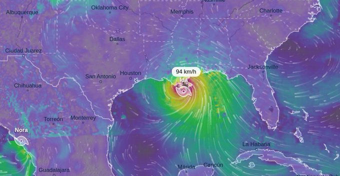

# Week 35

There are some great songs in the genre

"How country music is taking over the world.. Country music has
undergone a facelift and is now attracting people from all walks of
life"

---

"Japan's Next Leader Set to Intensify Hawkish China Stance"

---

Red Stick Ramblers - Bring It On Down to My House \#music

[Link](https://youtu.be/4VbqtCPnYuw)

---

[Link](https://youtu.be/OP6-DWXt8HM?t=88)

---

Fitty million dollars!!?

"Palantir bought $50 million in gold bars in August as cash"

---

Europeans were saved the adverse effects of empires by being hard to
conquer in totality. This allowed a pluraslistic env to flourish.

---

Most people do not realize but agricultural empires are highly
parasitic, the energy regime they construct are unstable because it is
unnatural. Their collapse is the natural event not the other way
around. See [Rifkin](../../2020/07/the-emphatic-civilization-rifkin.html#rome)

---

The further Rome is in your past, the better off you are.

"The areas controlled by the Ottomans for between three to four
centuries do have lower incomes, lower educational attainments, lower
levels of trust in institutions etc. than the areas that were part of
the Habsburg Empire"

[Link](https://branko2f7.substack.com/p/why-were-the-balkans-underdeveloped?r=16uxt&utm_campaign=post&utm_medium=web)

---

That song sounded like an ABBA version of *We Are The World*. Retire bitches.
Or stay retired.

---

"Mexico's President Revamps Welfare, Handing Out Cash to Millions"

---

The Independent: "Biden asks Justice Department to stop people from
acting as ‘vigilantes’ in Texas abortion law"

---

😶 😶 😶 

"South Korea proposes USD271 billion defence plan"

---

Al Jazeera: "S Korea developing missile as powerful as nuclear
weapon.. 3-tonne missile designed to destroy underground facilities by
penetrating tunnels to nullify nuclear launches"

---

"@ioangrillo

The ELN guerillas banned civilians with guns in a Venezuelan town they
control. [.. T]hey want a monopoly on firearms in their turf.

'@Reuters

Guns, drugs, jobs. In these Venezuelan towns, Colombian rebels call
the shots'"

[Link](http://reut.rs/3DK1Ptc)

---

Produce H2 any way you can. CCS works. Once the econ adaps to a new
fuel other parts can change around it.

"Oman, which is no longer an Opec member, is pursuing hydrogen as a
potential low-carbon fuel for the future. UAE is also working on
hydrogen, and boosting renewables, and recently inaugurated a new
nuclear plant"

[Link](https://www.theguardian.com/environment/2021/sep/01/opec-member-urges-oil-producers-to-focus-more-on-renewable-energy)

---

Integrated Kinetic Energy.. Exactly what I was thinking.. If I had time, I'd dig into this.. 

[Wired](https://www.wired.com/2012/11/what-is-the-true-measure-of-a-storm/)

[WaPo](https://www.washingtonpost.com/nation/2021/08/31/how-ida-katrina-compare-wind-fingerprints/)

---

ISIS inspired NZ knife attack at a supermarket.. They had the guy
under surveillance, press asked how come he did this shit? But when
the guy goes berserk, even under surveil, he can do bunch of damage
quickly until anyone can reach him. Response was under 60 sec but still..

---

BBC: "Japan's [PM] has said he will not run for re-election as party leader
this month, signalling the end of his tenure...  The shock
announcement comes as Mr Suga's approval ratings dropped to an
all-time low. Japan - which is still under a state of emergency - is
now grappling with its worst ever Covid wave. The country, which has
now seen more than 1.5 million virus cases, has also seen a slow
vaccination roll out"

---

Combining video files? Gotta use `moviepy` my brother.. The easiest method on
the command line.

---

"EU’s infectious disease agency: ‘No urgent need’ for coronavirus
vaccine booster shots"

---

CNBC: "Vaccinated and unvaccinated travelers are going to different
sets of Caribbean islands"

---

Good news

CNBC: "Google reportedly plans to put its own chips in Chromebook laptops from 2023"

---

CNBC: "Covid vaccines remain 'stunningly effective,' even as delta concerns grow"

---

"Trump promotes Covid vaccine at GOP donor event, report says.. It
comes after the former president was booed by supporters for
recommending vaccine"

---

Book is at its *seventh* edition, the last being in 2015. And no
working code.. Bonkers.

---

Aww author gives pseudocode for the interpolation method.. How **sweet**.

---

With war, econ taken outside politics, sorry, made "bipartisan",
people had to work with these crumbs to distinquish themselves in
political terms. Trinkets, non-issue issues.

---

Freedom

"@ElieNYC

To recap: right now in Texas people CAN sue you for seeking abortion
services, but the state CANNOT ask you if you have a gun"

---

Dems experience it, but the intra-party problem hit the Reps
too. Being more hierarchical, they had pols walk in a single-file on
ideology for a while, but now, they have a former President who said
stuff against forever wars, and a lot of muckers who still want to
invade countries, forever. How is there war and anti-war ideology in
the same right-wing party?

---

In UK, Oz, and many other places, libs, and other major ideologies
have their own party. Not so in US which IMO increase intra-party
friction. Most of my related posts are US centric. Beware.

---

"Consumer prices in [DE] have been increasing for months, fueled by
rising energy and food prices as well as the withdrawal of a temporary
reduction in value-added tax (VAT), which was aimed at mitigating the
economic effects of the COVID-19 pandemic last year by boosting
domestic consumption"

---

They need to include this 'energy' in hurricane reporting, as in how
much mass is moving when hurricane makes landfall. Kinetic energy is
$1/2 m v^2$, increase mass increase energy. Would one rather get hit
with baloon or a hammer at the same speed?

"Hurricane Katrina was a 'huge storm' with a 'very expansive' wind
field compared to an average storm.. Hurricane Ida strengthened
rapidly in the hours before it made landfall, whereas Katrina did the
opposite, strengthening to a Category 5 over the Gulf of
Mexico.. 'Hurricane Katrina.. was significantly larger, and had more
energy associated with it'"

[Link](https://news.yahoo.com/does-hurricane-ida-compare-hurricane-210255099.html)

---

Have some [vegan schnitzel](https://veggy.com.tr/en/products/vegan-schnitzel/)

"Berlin’s university canteens go almost meat-free"

---

:) Its good.. I like the title 

Danielle Bregoli, Bhad Bhabie 'Hi Bich / Whachu Know' 

---

"Japan's largest oil company has committed to a detailed study on the
establishment of a hydrogen supply chain between Japan &
Queensland"

[Link](https://bit.ly/2Ybf71q)

---

The Ike Dike in Texas.. The plan is to build a barrier "[s]eventy
miles long and seventeen feet high, stretching west from Bolivar
Peninsula along the entirety of Galveston Island". 

---

[geek] Handling non-differentiability looks to be key.. both in
simulation and for optimization. To this day I cannot find a better TV
denoiser that will beat a subgradient based one. Discontinuous
galerkin methods now rule all sorts of domains in simulation. Just
came upon the Igel seismology book, he is also diggin the DG [/geek]

---

Politico: "Macron gambled on coronavirus immunity passport — and
won.. The French president stuck his neck out, banking that the public
would support his plan. And so far, it’s been a success"

---

"Ireland's vaccine program nears completion thanks to high uptake"

---

DW: "Philippines: Nurses threaten mass resignation amid COVID surge"

---

US is out of Afghanistan. End of an era.

---

"@NYDailyNews

Marc Bernier, a conservative Florida radio host who dubbed himself
'Mr. Anti-Vax,' died after a three-week battle with COVID-19. He was 65.
His death was the third this month among conservative talk show
hosts outspoken against the coronavirus vaccine'

---

That was a shot in the dark but.. dam. I have the full-blown CAD
file for this thing.. F-ing score

---

Dave Patterson - Solid Funk \#music

[Link](https://youtu.be/E4bCp-oZMLA)

---

Woha, fire whirl \#ChaparralFire

[Link](https://twitter.com/CALFIRERRU/status/1432012185543139332)

---

This new compsci approach can do seismology, stress/strain comp,
waves, the whole 9!

---

"As long as the Islamic terrorists remain in Idlib, [ISIS] in the east
and Iranians near the Israeli border, the Syrian civil war will not be
over... Iran wants to repeat in Syria what it has been doing in Yemen
for several years. In Yemen Iran perfected an effective way to attack
Saudi Arabia by arming Shia rebels in Yemen with over a thousand
ballistic missiles and UAVs... Iran is seeking to carry out a similar
campaign against Israel using Iran backed militias in Syria"

[Link](https://www.strategypage.com/qnd/syria/articles/20210825.aspx)

---

Lectures can be viewed at school just as easily as they are viewed at
home. The key is content, and who delivers it.

---

If they want better education, they should ask for prerecorded lecture
videos of the experts to teach their children rather than a
parrot/doofus wildly gestulating (teacher)

---

"Children going to school" isn't preferred bcz it is better for their
education. Parents need it because in a modern setting, school
functions as a day-care center, somewhere they can drop their children
off and go to work, whereever.

---

I'd seen J. Alexander before in a little show called Kyle XY..  She was
great, with that statuesque look.. The only negative, a bit chubby in
places.. But she made an excellent transition to her next phase, w
demanding action, and looks quite fit. I'm impressed.

---

BTW the theory is not just lab-leak, it is *engineered* virus leaking from the lab.

---

"@fosgoodwood

BMW is pushing to introduce alternative fuels into their
lineup. Evidence is the new iX5, a hydrogen-powered SUV!"

---

"@Jason_K_Dempsey

'In practice' this means the Taliban have a lot of stuff they can’t
maintain and will be useless in 3-6 months. Best use would be a surge
of propaganda pics and then put everything but artillery, small arms,
NVDs, and pickups up for sale.

'@_Will_Brown A mind-blowing graphic in today's Times on what $85bn
worth of lost equipment means in practice for the Taliban''

---

Katrina had wind speed at around 280 km/h. Sandy 160 k/h. 

---

Ida

---

"As China-Taiwan Tensions Rise, Japan Begins Preparing for Possible Conflict"

---

"A study has provoked controversy in Germany because it shows that the
country’s healthcare system has two tiers... The study.. has shown
that patients who have statutory health insurance have to wait about
three times longer for an appointment with a specialist than members
of private health insurance schemes"

[Link](https://www.ncbi.nlm.nih.gov/pmc/articles/PMC2292303/)

---

New co-leader of Germany's left party Die Linke, talking about the
country's two-tier healthcare. It's good.. DE needs more left. There
are enough of those Washingon Consensus, centrist
types.. 

[Link](https://twitter.com/Janine_Wissler/status/1431960175494172677)

---

People might be spooked by it, then they can choose to leave condensed
spaces, perhaps start living a more rural life.

---

At certain point one has to move on.. Society cannot keep having lockdowns.

NYT: "Britain is reporting more than 30,000 new coronavirus cases a
day, but the public seems to have moved on. Experts say this could be
a glimpse into the future for other countries... [A] professor.. 'It
looks like we’re just accepting it now — that this is the price of
freedom.'... 'It’s really difficult to ask people not to mix for a
prolonged period, especially if there is no solution.'...  [A]
specialist... 'All our Covid cases are unvaccinated by choice'"

---

Handing over Iraq support to France? They do have a strategic interest
there.. wanting to stop refugees. Also indirectly protecting
Lebanon.. ? In reverse, they have a supply route open by sea, into
Lebanon then into Iraq.

---

JFK increased military spending. While he did not trust the military at
every level, he contributed to the growth of the complex.

"The military-industrial complex never liked JFK, they had him killed"

---

*Westworld* borrowed a lot from *Vice* clearly, the 2015 movie.

---

AFP: "Biden says China still withholding 'critical information' on Covid origin"

---

♪♬ Toss a coin to your witcher ♪♬

♪ O' Valley of Plenty ♬

♪♬ At the edge of the world ♪

---

I bet Soder didn't fight too hard for nomination, didn't want to
get it this time..

---

They chose the wrong pol.. Its ok, CDU/CSU can come back with [that Trekky guy](https://www.bbc.com/news/world-europe-56614052)

"A month before the general election, Germany's ruling conservatives
have been slipping in opinion polls. Their gaffe-prone candidate for
chancellor, Armin Laschet, is being blamed. And his supporters are
turning away"

---

Imperial aversion to instability \#zakaria

[Link](https://youtu.be/-9n4m7VhYXU?t=67)

---

"US-Based Ohmium Launches India's Green Hydrogen Electrolyzer
Gigafactory. India's first green hydrogen electrolyzer gigafactory
that will turn power from renewable sources into #carbonfree hydrogen"

[Link](https://bit.ly/3yn3DEA)

---

<blockquote class="twitter-tweet">
Alstom&#39;s Coradia iLint <a href="https://twitter.com/hashtag/hydrogen?src=hash&amp;ref_src=twsrc%5Etfw">#hydrogen</a> train runs for the first time in Sweden 🇸🇪 ▶️A huge opportunity for Sweden to reduce CO2 emissions &amp; help decarbonise <a href="https://twitter.com/hashtag/rail?src=hash&amp;ref_src=twsrc%5Etfw">#rail</a> <a href="https://twitter.com/hashtag/transport?src=hash&amp;ref_src=twsrc%5Etfw">#transport</a>  ▶️an innovative answer to <a href="https://twitter.com/hashtag/sustainable?src=hash&amp;ref_src=twsrc%5Etfw">#sustainable</a> <a href="https://twitter.com/hashtag/mobility?src=hash&amp;ref_src=twsrc%5Etfw">#mobility</a> without compromise Learn more: <a href="https://t.co/NGW8OeO50e">https://t.co/NGW8OeO50e</a> <a href="https://t.co/LLoP8qbkzG">pic.twitter.com/LLoP8qbkzG</a>
&mdash; Alstom (@Alstom) <a href="https://twitter.com/Alstom/status/1430410498877665280?ref_src=twsrc%5Etfw">August 25, 2021</a></blockquote> 

---

