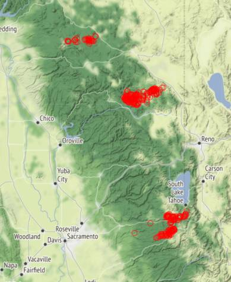

# Week 36


<blockquote class="twitter-tweet"><p lang="en" dir="ltr">wtf our fridge just emailed us to say we opened its door too many times in the past month <a href="https://t.co/MPa2cPHhCC">pic.twitter.com/MPa2cPHhCC</a></p>&mdash; Dan Hon (@hondanhon) <a href="https://twitter.com/hondanhon/status/1436027395115393024?ref_src=twsrc%5Etfw">September 9, 2021</a></blockquote> <script async src="https://platform.twitter.com/widgets.js" charset="utf-8"></script>

---

The Independent: "Newsom campaign theme: Don't let California become Texas"

---

Good good..

"Gov. Gavin Newsom is feeling pretty good after polls show the recall
attempt will go down by double digits"

[[-]](https://www.politico.com/states/california/story/2021/09/09/were-in-a-really-good-place-newsom-says-as-recall-looms-1390847)

---

"UK government terminates one of its data-sharing contracts with Palantir"

---

A big motorhome, RV basically, right?

---

Land yacht? Dam

[[-]](https://robbreport.com/motors/cars/dembell-lavish-land-yacht-onboard-garage-1234631799/)

---

Reuters: "Shell to join clean hydrogen project in Norway"

---

Storyline preference becomes clear around the issue of identity. They
usually portray AI as a unique, non-copyable thing... When it is
sent somewhere it ceases to exist at the source. Why? That's not how
software works!

---

The reason AI come alive story is used more in movies these days is
not bcz Holywood necessarily knows what the phuck is going on on the
tech side.. They are basically repurposing the Pinoccio story for a
new domain. The "inanimate object coming alive" angle.. that's
all. Pinoccio for the good side, Frankenstein for the bad. Old story
adapted to something new, wout any change in semantics.

---

"[A] growing body of evidence suggests that mRNA COVID-19 vaccines
also reduce asymptomatic infection and transmission"

[[-]](https://www.cdc.gov/coronavirus/2019-ncov/science/science-briefs/fully-vaccinated-people.html)

---

Coome to Butt-head..

---

"@josheidelson

House Dems' bill currently would:

- Ban workplace class action waivers
- Let NLRB impose new fines for violations
- Ban "captive audience" meetings
- Protect economic strikes
- Make misclassification a separate labor law violation
- Hike OSHA penalties"

[[-]](https://twitter.com/josheidelson/status/1436010192471138304)

---

NYT: "Other People’s Rotten Jobs Are Bad for Them. And for You.. When
truck drivers are underpaid and overworked, it’s bad for them and also
bad for us.Researchers have found interesting connections between poor
working conditions and seemingly unrelated social problems. For
example, most people don’t think of the opioids crisis as a
labor-related issue, but research has shown a connection between
occupations with high workplace injury rates, like construction, and
opioid overdose fatalities. (People get injured on the job; lacking
sick days, they take opioids so they can work through the pain.)"

[[-]](https://www.nytimes.com/2021/09/06/opinion/labor-workers-rights.html)

---

<iframe width="340"  src="https://www.youtube.com/embed/C56nnq-ykbE?start=33&end=79" title="YouTube video player" frameborder="0" allow="accelerometer; autoplay; clipboard-write; encrypted-media; gyroscope; picture-in-picture" allowfullscreen></iframe>

---

"Schumer rejects Manchin's 'strategic pause' on $3.5T megabill"

[[-]](http://ow.ly/KWi4102W4bN)

---

If no agreement is reached and US leaves the picture I guarantee it
Israel will attack unilaterally at the first sign of an IRN a-bomb.

"Blinken warns US getting 'closer' to giving up on Iran nuclear deal"

---

ECMWF is the European weather forecasters.

---

A nice back to work [account](https://twitter.com/reuterbal/status/1435507105663000576)

---

Riemann was a genius. Did so much stuff.. A deserving student to the
great Gauss

---

Holmes Brothers - Up Above My Head \#music

[[-]](https://youtu.be/qBu7IsyHsHI)

---

Dennis Coffey - Ubiquitous \#music

[[-]](https://youtu.be/hOb42sndWYQ)

---

"Australia vowed Thursday to keep mining #coal for export and said
global demand was rising, rejecting a study that warned nearly all its
reserves must stay in the ground to address the #climate
crisis"

[[-]](http://u.afp.com/UjbE)

---

CCS isn't only about pulling carbon from the atmosphere. It can be
applied to any fossil product during refinery, before anything leaves
the plant.

---

What is the underlying technological assumption though? If you burn
fossil like today, sure its bad. But convert to renewable fuel at the
source through ccs, not so bad. Tech assumptions cannot solely be
based on pedestrian views of office-dwelling, white-collar,
have-an-app-for-that limpdick-electric crowd.

"Climate change: Fossil fuels must stay underground, scientists say"

---

Lots known abt this region, probably bcz of the huge US base nearby.
Some martial arts were likely first taught to *gaijins* here.

---

The Okinawan [diet](https://www.healthline.com/nutrition/okinawa-diet).
These ppl live healthy long life.

---

National narrative needs to be compatible with the underlying
culture..  Otherwise there will be neurotic behaviour.. That's why
there is so much neuroticism in so-called Turkey, especially in its
politics.

---

WSJ: "Japan Prime Minister Contender Takes Harder Line on
Missile-Strike Ability.. Japan needs to consider building a
missile-strike capability against potential foes including China and
North Korea, former Foreign Minister Fumio Kishida said in an
interview'

---

"Even as air pollution shaves years off life expectancy, fossil fuel
projects get more funding than clean air initiatives, a global report
said Tuesday"

[[-]](http://u.afp.com/Ujwq)

---

George Schulz (Rep old timer) sat at Theranos board, his grandson was
hired as lab tech. Grandson told him stuff doesn't work as advertised
he wouldn't believe him 🤦‍♂️ Fail all around.

---

Carl Sagan complaining about Beavis and Butthead is pure gold

[[-]](twimg/E-s5BkdXsAc82NJ.jpg)

---

[Computing AI](../../2021/09/computing-ai.md)

---

"Huge Global Demand for .. Ute... [The] new Australian developed
hydrogen fuelcell electric vehicle with $50 million in order requests
in just the first 4 days"

[Link](https://bit.ly/3tgWUuR)

---

Texas is clamping down, right across the border, Mexico is easing
up. If women are denied service, they'll go right across the border to
get abortion. It's stupid to insist on this for TX, but the aim is not
politics, it is about secondary issues being made faux-primary issues
to fight faux-politics through culture war. So in a way it is smart,
in a 90s, Clinton-era kinda way.

"Mexico's Supreme Court Decriminalizes Abortion"

---

DW: "Nord Stream 2: Last piece of gas pipeline is in place.. Engineers
have welded together the final piece of piping of the controversial
conduit, operators say. Gas supply to Germany is expected to begin in
October"

---

Jane's Defense: "Japan, Pacific island countries agree to enhance
defence co-operation"

---

Turns out if there are no viewers left you cannot send them into a
tizzy with garbage takes to make money off them.


"Rupert Murdoch's News Corp Australia to Ease Climate Change
Denial.. The campaign, if sustained, could put pressure on Fox News,
though critics were skeptical that a sea change was in store."

---

I mean this speaks to the capability of said "AI" of which there is
not much.  You can lure these things into traps with rattle drums
probably.. How bleeping dumb are they? Libcucks swoon of course at the
first sight of a bright shiny object.. These are the innovators you
deserve

---

Yeah that shit works brilliantly lets be scared of it. 

"Facebook apology as AI labels black men 'primates'"

---

But the escape cld also have been helped by their deep state to make
the new guys look bad.. u never know

---

Its great

"A Palestinian militant leader and five other inmates staged an
elaborate escape from a high-security prison in Israel"

---

"'Population and Income Growth.. We do not see a simple
relationship. Many countries experienced both rapid population growth
and negative changes in real per capita GDP. But still others had
relatively rapid population growth, yet they had a rapid increase in
per capita GDP"

[Link](https://open.lib.umn.edu/principleseconomics/chapter/33-2-population-growth-and-economic-development/)

---

The beef with the oppo towards left parties, e.g. Die Linke isn't
based one issue or another. It is the general stance towards
them.. They say 'see these people over there, they are *beyond the
pale*', like, not even worth talking to. Pro-business FDP can argue
for cutting taxes in the middle of a crisis, but left cannot talk
about two-tier system in healthcare. That makes you some kind of
weirdo..

---

Wait until hospitals start denying covid patients.. Can happen right?
There are other emergencies, resources are limited, and there is now a
covid vaccine. Guy doesn't take it, gets his ass sick and shows up to
ER asking oxygen to be piped into him... Other patients need
care. Triage is a bitch.

---

[The Bermuda Triangle](../../2021/08/bermuda.md)

---

SPD looks to be in the lead in Germany.. Its leader Schulz made some
comments about a possible coalition with leftist party Die Linke. Of
course shitlib, libcuck, limpdicks piled on him, but I hope he follows
through.. If he does, they could be in a similar situation to US Dems,
w Biden and their left. Greens too

---

<iframe width="340"  src="https://www.youtube.com/embed/0Flsg_mzG-M?start=34" title="YouTube video player" frameborder="0" allow="accelerometer; autoplay; clipboard-write; encrypted-media; gyroscope; picture-in-picture" allowfullscreen></iframe>

---

Dems definitely wouldn't want that 10-past-10 square brother [either](https://youtu.be/IFqVNPwsLNo?t=1694).

---

Good.. Doesnt matter how GN did, recall needs to fail. The alternative
is mob rule. Less direct democracy.

"California Gov. Newsom and allies spent $36 million in August alone to
fight the recall"

---

New tech needs to be robust not just shiny.

"@PKovacs7

We have no internet, no power. The mail isn’t delivered. My Amazon
order was supposed to arrive 9/2 but I haven’t seen any of their
trucks. Yet an ancient device for conveying information, relying on
ink & paper, has been sitting on my driveway every morning since
Hurricane Ida"


---

Areas near Lake Tahoe and Honey Lake are on FIRE!



---

"Caldor Fire continues to push north of Highway 50.. The Caldor Fire
was 37% contained as of Saturday morning, and crews were hopeful that
improving wind and weather conditions might help as they continue to
fight what is now California’s 15th largest wildfire. Over 680 homes
have been destroyed and 214,107 acres burned as of Saturday"

---

Real unemployment fell by nearly .8. Not bad.

```
            UNRATE  U6RATE  REAL_UNRATE  REAL_UNEMP_LEVEL
2021-07-01     5.4     9.2    10.821707           17460.5
2021-08-01     5.2     8.8    10.090877           16300.5
```

---

Yeah! VW likes batteries now.

F--king Nazis (founded by Adolf)

---

"May offset" is not good enough. Plus only BE from sugar cane is
"carbon neutral". How can you make sure all production of this thing
is made that way? People will cheat. Remember how Volkswagen cheated.

EIA: "Producing and burning ethanol results in emissions of carbon
dioxide (CO2), a greenhouse gas. However, the combustion of ethanol
made from biomass (such as corn and sugarcane) is considered
atmospheric carbon neutral because as the biomass grows, it absorbs
CO2, which may offset the CO2 produced when the ethanol is burned"

---

The canisters have bioethanol in them

"Large blue boxes have been popping up across Nairobi in Kenya. They
look like cash machines, but ... dispense a clean cooking fuel [canister]"

---

"Biden's executive order comes just days before the 20th anniversary of
the 9/11 terrorist attack. It requires AG Merrick Garland to release
the declassified documents publicly over the next six months"

[Link](https://www.politico.com/news/2021/09/03/9-11-documents-declassification-509468)

---

"Japan, Russia to Cooperate in Hydrogen, Ammonia to Fight Climate Change"

[Link](https://bit.ly/3BziXzN)

---

"Domino's Pizza in South Korea Now Delivering Using Hydrogen Fuel Cell
Powered Drones"

[Link](https://bit.ly/3yy1uWn )

---

