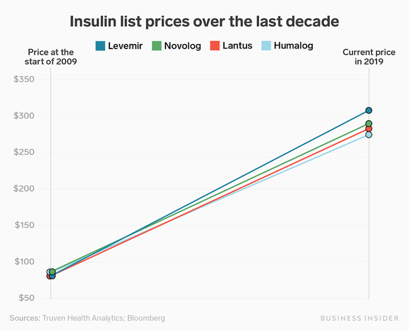

# Week 43

The Guardian: "Cop26: Humanity 5-1 down at half-time on climate crisis, says Johnson"

---

They likely went to Mexico

"Texas abortion numbers halved in month after ban took effect"

---

Hah. Goodbye FAANG, welcome MAANG, or MAMAA (MS, Alphabet, Meta, Apple
and Amazon)

\#madmoney

---

Saw a new hashtag \#DeleteMeta

---

\#Software \#Nerd Hey I like this new build system [meson](http://mesonbuild.com/)
and [ninja](https://ninja-build.org/). It was only a matter of time `make`
was replaced with a 🐍 based version, the snake excels at playing w files anyway.

---

NYT: "Hellishly Hot Tiny [AU] Town Offered ‘Free’ Land...  The town in
Australia’s outback, where the temperature can hit 113 degrees
Fahrenheit, drew hundreds of global inquiries when it put out the call
in a bid to expand its population"

---

Forget OPEC, one day there will be OGFEC, Organization of Green Fuel
Exporting Countries where Saudi Arabia and Australia will bicker on
fuel production quotas as to not collapse the price, bcz there'll be
so much of the stuff to go around... If we make it that far.

---

That patch of 250 km by 250 km can generate 25 Petawatt-hours in a
year. More than enough for the entire world.  From
[vid](https://youtu.be/gtmWGPaDkoI?t=417).


---

Politico: "Ron Wyden said he hoped Democrats could still find a way to
address rising prescription drug costs but acknowledged the power the
pharmaceutical industry has shown so far to prevent even modest
changes"

[[-]](https://www.politico.com/news/2021/10/28/democrats-drug-pricing-social-spending-517490)

---

France-UK fishing row.. I will laugh my ass off if militaries get
involved in this debacle

---

"Qatar and Korea will expand cooperation in the field of hydrogen with
@qatar_energy and #H2Korea signing a new framework agreement to
support development of the hydrogen value chain"

[[-]](https://www.h2-view.com/story/qatarenergy-h2korea-sign-agreement-to-expand-and-enhance-the-hydrogen-supply-chain/)

---

Al Dork got his ass kicked in Florida (2000) thanks to Nader because
he wasn't left enough.. Hillary lost due to adverse effects of
long-Clintonism (kinda like long-Covid, but worse). Dems should have
practiced more partisanship, less triangulation.

---

Dems cant propose new legislation for fear of SCOTUS reversal? Well,
got noone to blame but yourself.. In the past 40 years you were at
least one President short, so now SC is stuffed with right-leaning
judges.

---

The Intercept: "By 2013, the Obama administration had concluded that
it could not charge WikiLeaks or Julian Assange with crimes related to
publishing classified documents — documents that showed, among other
things, evidence of U.S. war crimes in Iraq and Afghanistan — without
criminalizing investigative journalism itself. [.. DOJ] called this
the “New York Times problem,” because if WikiLeaks and Assange were
criminals for publishing classified information, the New York Times
would be just as guilty.

Five years later, in 2018, the Trump administration indicted Assange
anyway. But, rather than charging him with espionage for publishing
classified information, they charged him with conspiracy to commit a
computer crime..

The alleged hacking not only didn’t happen, according to expert
testimony, but it also couldn’t have happened"

[[-]](https://theintercept.com/2020/09/30/assange-extradition-cfaa-hacking/)

---

"The UK hydrogen industry could see demands of 10TWh in 2030 and up to
37TWh by 2050"

[[-]](https://www.h2-view.com/story/report-uk-hydrogen-demand-predicted-to-be-37twh-by-2050)

---

"@HypersonixAU has placed an order with .. @Australia3d to manufacture
a new 3D printed, hydrogen-powered scramjet engine to support clean
emissions in the aerospace industry"

[[-]](https://www.h2-view.com/story/hypersonix-places-order-to-manufacture-a-3d-printed-hydrogen-powered-scramjet/)

---

AFP: "EU court fines Poland 1 million euros daily in judiciary row"

---

"Fox News’s Neil Cavuto reveals his own viewers abused him in hate mail
after he urged them to get vaccinated"

---

Many in the US right-wing like Hungary - and look at them.. 

Bloomberg: "Grappling with surging coronavirus cases and a stalled
vaccination program, Hungary allowed companies to force staff to get a
Covid-19 vaccine as a condition of employment"

---

Just the soccer fans?

Al Monitor: "Israelis fed up with racist, anti-Muslim behavior of soccer fans"

---

The map shared [before](../2022/twimg/FCtre5sWEAgFFp9.png)
says sunlight radiation at maximum is ~300 W/m2. The number we used
previously  ~1000 W/m2 is widely known, sun at its zenith, an ideal
situation. For daily calculations you factor in sun availability,
less direct sunlight, etc, you can probably arrive at the numbers
seen in that map. For more accurate, region specific calculations
that need a simple, daily number, I'd go with the numbers there.

---

"Pakistan will gain its first green #hydrogen production facility"

[[-]](https://www.h2-view.com/story/powerchina-international-oracle-power-sign-agreement-for-pakistans-first-hydrogen-production-facility/)

---

"[N]etwork of up to 25 refuelling sites is set to be developed across
the UK by 2030 as a result of a new agreement inked..  between @bp and
@DaimlerTruck" \#H2

[[-]](https://www.h2-view.com/story/daimler-truck-bp-unveil-hydrogen-network-plans-for-the-uk/)

---

Sea surface has lots of potential.. That "hotspot" area on the Pacific, is at
roughly latitude -10.0 longitude -120.0, [map](twimg/FCtt8adWEAEC8yi.png).
Floating panels? Ship green ammonia, H2 from there to South America, or to Japan.

---

If carbon pricing can be made to work, how about "material usage
pricing"?  According to the rarity of materials used, price goes up or
down... Does it make sense to "go green" if the country of Chile, or
Bolivia gets destroyed [[1](2021/03/less-is-more-hickel.html#decouple),
[2](2021/10/the-rare-metals-war.html)] in the process?

---

There are only few places where intense solar exposure (dark red)
happens to fall on land. Africa (Chad, Sudan), Southwest China, Saudi
Arabia, and Oz.

---

Average solar radiation map 1990 -2004, shows which regions get
the most sunlight. Took it from McFarlane [presentation](https://youtu.be/gtmWGPaDkoI?t=367)


---

Prototech AS, a Norwegian company has solid NH3 know-how. Also Israeli
GenCell. Notable researchers on the subject, Bill David at Oxford,
D. MacFarlane at Oz Monash.

---

Rudolf Diesel, before he made diesel engines, made ammonia engines. It
almost became the shit

---

Same vid talks about an ammonia fuel-cell prototype 

---

Commit to a simple, efficient base chemistry, options multiply.. We
transport green ammonia, on the other end "crack it", get H2. Or
combust it for turbines. Japan [has the technology](https://youtu.be/5ejL65tKsGM?t=107).

---

No I dont judge Baldwin for using guns in movies.. There is no
'gotcha' here. Reagan, a conservative, used guns on the big screen,
and he was for gun control. Films are escapism.

---

"[An] armorer with a decade’s experience in film.. said he has
anticipated an accident, such as the one on the set of 'Rust,' for six
months. The demand for content, stemming from a rise in streaming
platforms, has productions working under tight and rushed schedules"

[[-]](https://portcitydaily.com/local-news/2021/10/22/alec-baldwin-accidental-on-set-shooting-conjures-local-memories-of-wilmington-filmed-the-crow/)

---

TDB: "It has been a summer of scrutiny for the ultra-rich—and now the
billionaires are fighting amongst themselves. The culprit: a so-called
'Billionaire Income Tax', that Democrats in Congress are reportedly
mulling to help finance Biden’s agenda. The proposal would only target
several hundred of the wealthiest Americans by taxing the rising
values of certain assets, like stocks, even before they are sold...

'I know a lot of people that… have accumulated massive, massive
wealth, and then they take loans against that to live on. And that's
tax free. And I think it’s bullshit' [.. one] said"

[[-]](https://www.thedailybeast.com/billionaires-blast-wealth-tax-one-way-ticket-to-venezuela)

---

"Plans for the UK’s first hydrogen distribution pipeline have taken a
significant step forward"

[[-]](https://www.h2-view.com/story/uks-first-hydrogen-distribution-pipeline-one-step-closer-to-reality/)

---

"UK-based ATOME Energy is set to develop a brand new large-scale green
hydrogen and ammonia production project in Paraguay with a capacity of
50MW by the end of 2024"

[[-]](https://www.h2-view.com/story/atome-energy-to-develop-a-large-scale-green-hydrogen-and-ammonia-production-project-in-paraguay/)

---

Not just plant based stuff.. people will burn whatever, wood, cheap
coal.. They'll burn bleeping cow dung. And that shit (!) has lota
methane my friend

---

People in Northern Syria use olive oil extract to make a flammable
[product](https://www.thenationalnews.com/mena/syria/2021/10/18/syrian-workers-use-olive-oil-to-make-eco-friendly-pomace-wood-in-pictures/)
for heating (by "eco-friendly" they mean that carbon neutralness
again, but it is still harmful). I bet stuff like this contributes a
lot to the CO2 uptick during the winters. Lay in the pipe for these
places for renewable gas, or send canisters, make'm cheap, done.

---

Report shows 90% carbon capture rates both for coal and natgas. 

US DOE: "Steam reforming of natural gas for hydrogen production costs
vary from 1.43/kg to 2.27/kg [dollars] with CO2 capture and storage
(CCS).. Numerous studies report the cost of hydrogen from gasification
[from coal] to vary between 1.16/kg and 1.63/ kg for coal and between
1.31/kg and 2.06/kg for coal/biomass/waste plastic with CO2 capture
and storage"

[[PDF]](https://www.energy.gov/sites/prod/files/2020/07/f76/USDOE_FE_Hydrogen_Strategy_July2020.pdf)

---

In 2019, EU's gross electricity production was 2904 TWh. In output
capacity terms,

```python
"%d GW" % (2904000 / 365.0 / 24)
```

```text
Out[1]: '331 GW'
```

The planned H2 capacity compares well with the number above.. The plan
will likely encourage others to jump in, it wld be great to equal that
331 GW. 

Green Tech Media: "The EU wants 40 gigawatts of electrolyzers installed within its borders by 2030"

---

"@amazingmap

Amazingly comprehensive map of every country in the world that uses
the MMDDYYYY format"


---

Someone told the crew "get me some code!" they got it, but to make it
look dense, "hi-tech" they removed the indentation. It's all for the
looks right? Holywood...

\#upgrade

---

But the indentation is all wrong.. 🤣 Py wont work without the right
indentation.

\#upgrade

---

And that's [Python](twimg/FCYkRHfXsAguw2Y.jpg) 🐍

\#upgrade

---

Saw guy type `sudo shutdown -h now` on screen 

\#upgrade \#unix \#geek

---

Recommender chose *Upgrade* 2018. Fine mov.. Obviously, technically,
beyond the realm of possibility given the direction of curr tech but
hey -- good cinema

---

Oz Net Zero Plan. Heavy on clean fuel usage.

[Summary](https://www.industry.gov.au/sites/default/files/October%202021/document/the-plan-to-deliver-net-zero-the-australian-way.pdf),
[Doc](https://www.industry.gov.au/sites/default/files/October%202021/document/australias-long-term-emissions-reduction-plan.pdf)

---

"@LucasKunceMO

They call this a 'free market' — I call it a cartel"



---

Too many extra dickwads in NATO, EU is partly going its own way?

"Five European countries propose EU rapid reaction force"

---

🤣 🤣 🤣 

AP: "The phrase 'Let’s go Brandon' refers to a meme that emerged
earlier this month from a video of an interview with NASCAR driver
Brandon Brown after he won an Xfinity Series race at Alabama’s
Talladega Superspeedway.

A reporter said on air that fans behind him were chanting 'Let’s go
Brandon,' when video footage indicates the actual chant was 'F--- Joe
Biden.' Some people have suggested the reporter purposefully
misinterpreted the crowd’s chant and the quote has become a
catchphrase among critics of Biden"

---

"@GoodPoliticGuy

Capitalists will literally expand child labor before offering people living wages

'Wisconsin's Senate approves a bill allowing 14 year olds to work as
late as 11 pm., and supporters say it could help plug the labor shortage'"

---

"@JamesVGrimaldi

Who killed President Biden’s plan to provide two years of free
community college tuition? Lobbying against it were four-year
colleges"

---

Bust the Filibuster

NYT: "[A]fter a Republican filibuster on Wednesday blocked the
Democrats’ latest proposal to combat the voting-rights restrictions
proliferating in red states, [Dems] now squarely faces the choice that
many activists consider an even more existential decision: whether it
will reform the filibuster to pass that legislation"

---

AP: "Bulgaria, EU's least vaccinated nation, faces deadly surge"

---

Simple data analysis, again, logistic regression. They actually
focused on biology (imagine that) to gauge individual pieces that cld
be important.

---

"This New Nasal Swab Test Can Predict Whether COVID Patients Will Be Hospitalized"

---

Hah

"@iamlubos

Programming in Fortran today. God help me"

---

*Dune* wasn't cuck. In fact they even reversed some stuff from
elsewhere; Oscar Isaac was cucked on Disney Star Wars, he was
uncucked. Movie had freaking Thanos. Momoa, obviously. There was that
action chick a lot of men like, with T. Cruise stamp of approval. The
movie was pretty balanced actually, it felt like a pre-derangement
flick ..

---

Bull Moose Jackson - I Know Who Threw the Whiskey in the Well \#music

[[-]](https://youtu.be/yOKQ1lQH0_w?t=23)

---

Transportation of goods and people account for 25% of world energy
consumption. Only 5% of WEC can be handled by li-on batteries. 25% is
greater than 5% - simple math. This sorry excuse of a tech can't even
handle all of transportation.

---

[The End of China's Rise](../../2021/10/the-end-of-chinas-rise-beckley.html)

---

"[2019] The US military’s logistical train is slowly snaking toward
China... the center of military policy is increasingly gravitating
toward U.S. Indo-Pacific Command, according to U.S. government
officials. [T]he challenge is how to quicken the pace because the
logistical tail of warfare takes time to put in place and because the
Pacific theater is one of the most difficult environments for moving
supplies"

[[-]](https://www.defensenews.com/news/your-military/2019/05/08/the-us-militarys-logistical-train-is-slowly-snaking-toward-china/)

---

Janes Defense: "UK sets sights on interim strategic sealift capability"

---

"@INEOS as it plans to Invest $2.3 bln on Green Hydrogen
Production. First plants will be built in Norway, Germany and Belgium"

[[-]](https://bit.ly/3FXZwDP)

---

"Saudi Arabian Oil Keynote address .. Planning one of world’s biggest
green hydrogen plants with partners"

[[-]](https://bit.ly/3pvMZ4M)

---

"Shell and Partners are Promoting the Integrated Hydrogen Economy in
the Transport Sector. @Shell & partners presented 1st medium-duty
fuel cell truck at ITS World Congress in Hamburg"

[[-]](https://bit.ly/3E8LGNb)

---

NYT: "In 1984 [an actor] accidentally shot himself in the head and
died while playing Russian roulette on set; the force of a blank
round’s explosion fractured his skull.And there was an accident on a
movie set in 1993 in which the actor Brandon Lee, Bruce Lee’s son, was
shot and killed during a scene when a bullet that was lodged in the
barrel of a gun was discharged along with a blank cartridge"

---

Because battery charging is slow, they need to apply too much power,
to recharge faster. That will overburden the grid, also degrade the
battery. Finally ka-boom!

National Geographic: "At high charging speeds lithium batteries can
overheat, causing them to degrade over time.. [N]ot only can that
drastically reduce the battery’s capacity... dendrites can grow across
the electrolyte, touch the cathode and create a short circuit, causing
the battery to catch fire or explode"

[[-]](https://www.nationalgeographic.com/environment/article/will-charging-electric-cars-ever-be-as-fast-as-pumping-gas)

---

These things keep catching fire..

I bet it has something to do with fast charging. 

"After a major fire in Stuttgart: Munich pulls eight battery buses out
of service...  other transport companies are drawing conclusions. The
Münchner Verkehrsgesellschaft (MVG) is now taking eight electric buses
out of service as a precaution.. In Stuttgart, the electric charging
station was destroyed in the fire on September 30th. Therefore, no
electric buses are currently in use"

---

Yahoo News: "A top NIH official admitted in a Wednesday letter that
U.S. taxpayers funded gain-of-function research on bat coronaviruses
in Wuhan .. The revelation vindicates Republican senator Rand Paul,
who got into heated exchanges with National Institute of Allergy and
Infectious Disease director Anthony Fauci during his May and July
testimonials before Congress over the gain-of-function question"

---

Vanity Fair: "In Major Shift, NIH Admits Funding Risky Virus Research
in Wuhan"

---

TDB: "Margaret Atwood, the celebrated author of feminist dystopian
novel The Handmaid’s Tale, angered some of her fans this week when she
tweeted out an op-ed by another writer titled, 'Why can’t we say
‘woman’ anymore?'"

[[-]](https://trib.al/2rDn6Zp)

---

"French education minister’s anti-woke mission.. Emmanuel Macron's
government is making the fight against woke theories a cornerstone of
its push to rally supporters from the left and the right"

---


