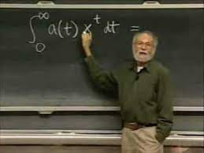

# Week 44

Sales and bullshit is also part of the job. See Jobs [talk at MIT](https://youtu.be/YXUhLbV8Nrg?t=738).
Look how he talks about great rivalries, his new machine / OS NextStep,
the big, bad rival Sun is trying to kill him, he is growing 2x, 4x..

Well; That machine only sold 50,000 units. The OS is a Unix variant
could not have existed without academia. They made changes to it added
stuff on top which weren't really good, the code would eventually
find its way into iPhones later, changed some more, arriving to its
current form which senior Linux devs still call a piece of shit. Linux
is of course open source, the largest software project ever undertaken
by mankind.

---

Tech CEO is mostly the "getting excited" guy. He'll "get excited" on a
tech be an internal evangelist for it, which can motivate employees to
work on it more, in a sense of "mission". Administrative duties are
important of course, but dont need deep sci mind for that.

---

Biz does not have the capacity for true research. They think too
short-term, the "need to show something" is too strong. 

"AlphaGo Zero shows that corporate R&D has starved basic research in
favor of safe bets and tinkering at the margins. Deepmind's AlphaGo
Zero — which taught itself to play a remarkable game of Go in just 72
hours — is an ironic poster child for this phenomenon. AlphaGo is part
of a long-term shift in AI research from generating machine
comprehension to "machine learning" that is just a fancy form of
statistical analysis, a brute-force approach that relies on ingesting
lots of human decisions and making statistical observations that can
be used as predictions about the future"

[[-]](https://boingboing.net/2017/11/24/brute-force-vs-comprehension.html)

---

Every student deserves to learn from the best, as I learned from Arthur
Mattuck. Here's my vid based [ed plan]((../../0119/2018/09/public-education.html))
again. The average, non-research teacher is a terrorist. We need to
quash this profession as we know it.

---

I learned DEs from his lecture.. fantastic teacher. I bet these videos
will continue to teach even after his passing. RIP



"@MITOCW

We were saddened by the news of MIT Prof. Arthur Mattuck's
passing. Check out his lecture from Differential Equations"

[[-]](https://twitter.com/MITOCW/status/1455910093485182979)

---

Miss Tess - Comes Love \#music

[[-]](https://youtu.be/1ODysvDUnoo)

---

Is growth a good thing? Not sure.. Coca-Cola shits out a **billion**
plastic bottles in a week. Where does all that plastic go? Do we want
a billion *and a half* bottles produced in a week? That would be
growth right?

---

I will be reprocessing the Berkeley data every month, do the YoY
checks, so we all can look at it and weep

---

Processing raw climate data now.. This is some next level shit right there

[[-]](../../0119/2015/08/temp-increase.html#berkeley)

---

Oil prices and OPEC output [graph](opec-price.png). [Code](opec.py).

---

New [graph](../../2021/01/stats.html#opec) for OPEC output (monthly), data from EIA. 

CNBC: "Biden has squarely blamed the reluctance of OPEC+ to pump more
oil for the sharp rise in energy prices in the U.S. and around the
world"

---

Jane's Defense: "Taiwanese and US marines conducting joint training on Guam"

---

The backlash didn't take place bcz of shitlib failure making movies
more cuck. Or failing to talk about SJW concepts at schools. The
reason was econ. But some doubled down made the fail more visible, the
arts, general discourse suffered. Remember Russiagate, that was some
insane asylum shit..

---

Through outsourcing, globalization after 70s, they killed wage growth
therefore inflation. The lowflation world was a policy choice. But
then people started dying of opioids. There was backlash. Trump.

---

Inflation, wages, 1970s \#blyth

[[-]](https://youtu.be/8rxrjhWTdv8?t=27)

---

Not kidding with the LGBTQIA2S+ part.. This is the latest alphabet soup
for the group.

---

How about creating a new competition category called LGBTQIA2S+Arr-Ee-Ess-Pee-Ee-Cee-Tee,
people there compete against eachother.

I wonder how a trans-man would feel about being in the same contest as
a gay guy. S/he would probably object.. Don't wanna get your ass kicked
right?

---

I dont disagree

"Texas governor signs bill banning transgender girls from female sports in schools"

---

A [blunder](https://youtu.be/H4GSp_gEojs?t=869) for sure. Dont feed the beast \#dem \#shitlib

---

Paid family leave is being added back to BBB? Grand.

---

Mcauliffe made a mistake by making those comments during the debate
triggering a culture war, but centrist shitlibs have no choice but to
go there.  He cant hit the other guy on Carlyle, what else is he going
to talk about?

---

"@LHSummers

I am certainly no left wing ideologue, but I think something wrong
when taxpayers like me, well into the top .1 percent of income
distribution, are getting a significant tax cut in a Democrats only
tax bill as now looks likely to happen"

---

Cringe is right.. \#openscience

[[-]](https://twitter.com/axccl/status/1455988190867693568)

---

JS seems to have moved on..

Tucker did talk more about econ later, but at its inception FN was
geared for hack.

---

[Good times](https://drive.google.com/uc?export=view&id=1r8wAGwhOmflPy0vCbbSEM0mSb16Ua7qF)..
But it's yesteryear stuff.. 

---

The game was easy to mobilize for..  Take Fox News. Get the
only anti-abortion Episcopalian [in the world](https://youtu.be/AXGoWtK1NnY?t=2123)
and make him anchor. Then get bunch of "Irish" in there, Calahan,
Shanahan, Cardigan or whatever... Done.  The line up defines the discourse.

---

This was a game concocted for specific goals.. Fans cheering for
either side vehemently were either idiots, or in it for the money.

".. [the plan would] allow Clinton to 'push [Reps] to the right' on .. issues
like gun control and a woman's right to choose"

---

Obviously both sides in US partook in this culture war, especially 90s
Dems. See [triangulation](../../2021/10/all-too-human.html#triangulation)
\#GSteph8s

---

The headline of his paper says "Abu's Been Sleeping In My Bed", guy is
laughing his ass off.. surprised? I don't think he is racist, u
see. Him and his orgs just like to stir shit up.. Whatever gets a rise out
of people, on 'either side', they'll do.

---

Murdoch is a native of the country anyway, he cut his teeth there,
before he exported the shit overseas, so UK could end up with
[this](murdoch_abu_sleeping.jpg).

---

Climate decisions do not come easy for Oz. The country is a major
resource exporter, but also Murdoch media, of Australia, is active
there, scratches that itch constantly, the way they do for culture war
in America. An earlier PM thinks he was done in by Murdoch for
climate.. The current coalition partner had an internal coup bcz of
Net Zero discussions.

---

Mucker is a Vanderbilt heir, worked at the CIA... It's clear where his
loyalties lie, with the one-party state.

"@kayrosef

Anderson Cooper just asked if Terry McAuliffe lost because the
Democratic Party is 'too far left'.

Terry McAuliffe is a centrist"

---

"Over 40 International world leaders have today backed the Glasgow
Breakthrough Agenda presented at @COP26"

[[-]](https://www.h2-view.com/story/cop26-over-40-world-leaders-commit-to-making-renewable-and-low-carbon-hydrogen-globally-available-by-2030/)

---

[Bernie Mac](https://youtu.be/wIbzfpjWPKk?t=187) 🤣 

---

That Yosemite plant output isn't bad.. H2 energy density is 33.6
kWh/kg, 12,200 kg generation per day, and with 30 kwh usage assumption
per day, per home

```python
"enough energy for %d homes" % (33.6*12200/30)
```

```text
Out[1]: 'enough energy for 13664 homes'
```

That is enough energy for a largish LA neighborhood.. Silver Lake,
Los Feliz, Koreatown. Or Encino, East Holywood..  A single
plant. Generating energy from waste.

---

"Yosemite Clean Energy wants to produce 12,200 kg of green hydrogen
daily...the plant will utilise proven gasification technology to
sustainably covert waste woody biomass into syngas, from which
hydrogen and RNG is produced.

Through the deployment of such technology, Yosemite will make good use
of California’s estimated 35-million-tonnes of annual waste woody
biomass which is left to burn, decay, and decompose, emitting
greenhouse gases and black carbon"

[[-]](https://www.h2-view.com/story/californian-plant-to-produce-12200kg-of-green-hydrogen-daily/)

---

"Kazakhstan’s hydrogen and ammonia markets are set to be boosted by a
new partnership between KazMunayGas and Linde... a feasibility study
will be carried out to evaluate both using natural gas as a feedstock,
to create blue hydrogen and blue ammonia, and water electrolysis
technologies to create green hydrogen and green ammonia"

[[-]](https://www.h2-view.com/story/green-hydrogen-and-ammonia-project-planned-for-kazakhstan/)

---

Al Monitor: "The US flew a nuclear-capable B-1B bomber over major
waterways of the Middle East [as a] show of force amid tensions.. with
Iran. Aircraft from US partners Saudi Arabia, Egypt, Bahrain and
Israel joined the bomber at various stages of the flight, which
included a pass over the Strait of Hormuz..  The B-1 also reportedly
flew over the Red Sea, Suez Canal and the Bab al-Mandeb.

The bomber took off from the US airbase on Diego Garcia, a remote
island in the Indian Ocean that is likely to become increasingly
important as Washington seeks to further shift the weight of its
military presence from the Middle East to Asia and the Pacific.

An undisclosed number of B-1Bs deployed to Diego Garcia last month to
bolster US bomber task force missions in the Pacific"

---

"Biden to announce tougher regulations on methane emissions from oil and gas production"

---

"@matthewstoller

I love that Terry McAuliffe couldn’t attack Youngkin’s Carlyle group
record because McAuliffe was an investor in a Carlyle fund"

---

"Terry McAuliffe: The Last Gasp of the Clinton Legacy"

[[-]](https://www.nationalreview.com/corner/terry-mcauliffe-the-last-gasp-of-the-clinton-legacy/)

---


That Mcauliffe race seems to be running on pure culture war
energy.. And guy is a Clintonite.. I am almost hoping he loses.

---

"@adamjohnsonNYC

Literally scores of cities increased PD funding and saw a rise in murders"

---

Confused about gobble gobble, Syria etc? I've been recording the major
events. Looking at it broadly, a picture can emerge

[Events](../../0119/2017/12/timeline-syria-tr.html)

---

Biz augmenting, embedding into gov policies; That's good.

"£400m partnership between Bill Gates’ Breakthrough Energy and the UK
Government to support clean energy technologies including hydrogen"

[[-]](https://www.h2-view.com/story/400m-partnership-between-bill-gates-breakthrough-energy-and-the-uk-government-to-support-clean-energy-technologies-including-hydrogen/)

---

B. Johnson: "we have the technology [for green energy transformation]", it's
true. Morrison, similar tech focus \#COP26

---

Rodney Crowell - Fate's Right Hand \#music

[[-]](https://youtu.be/A2CdF5U1ZY8)

---

It is odd China is experiencing power issues, electricity is getting
cut, diesel, coal price is rising, yet their Southwest region has
similar solar potential as Australia.

---

Coal, NG can still contribute through CCS.

Discourage its export, is transmission, the only thing that "moves"
should be green molecules. The rest is renewable generation, either
local, and more in countries who are rich of it like some are in oil
and they export that in molecules as well (H2 pipelines or ammonia).

---

Nuclear isn't a panacea either.. For countries who have experience
with it, fine, but nuke energy has an enormous waste storage problem.

---

It's interesting how open to violence this region is, even after all
these years; things get a little funky, troublemakers come out of the
woodwork, as if on cue.

"Fears of Brexit violence as armed men hijack and torch bus in Northern Ireland"

---

With the "emotional brain" concept I dont mean a person "getting
excited", and "in the heat of the moment" fail to make rational
decisions. No... even when a person is silently sitting with no
external stimuli or visible disturbances, they are mostly deciding
emotionally (culturally). Unless one is concious of it, it is
extremely hard to cancel out that stuff, the emotional will almost
always override the rational.

---

For the lazy or busy readers, here is the lithium calculation. Energy
stored per kilogram of lithium,

```python
kgkwh = 60/70 #kg/kWh
"%0.2f kg/kwh" % kgkwh
```

```text
Out[1]: '0.86 kg/kwh'
```

Divide the weight of all lithium in the world (dug up or otherwise),
17 million tons, by the number above,

```python
reserves = 17*1e6*1e3 # tonnes
batcap = reserves / kgkwh
"all battery capacity using all lithium: %0.2f kwh" % batcap
```

```text
Out[1]: 'all battery capacity using all lithium: 19833333333.33 kwh'
```

This is the maximum energy storage capacity we can have.

World consumption in one year (2013) was 157,481 Terrawatt
Hours. Divide by 365 per day, and compare,

```python
energy_daily = (157481. / (365)) * 1e9 # Kwh
"%0.2f percent" % (batcap / energy_daily * 100.0)
```

```text
Out[1]: '4.60 percent'
```

Only 5% of the energy need can be stored in batteries. That wont make
a dent in the fight against climate change.

---

India, UK conclude maiden joint tri-service exercise ‘Konkan Shakti'

---

The Mandarin: "[AU leaders] at the UN Climate Change Conference COP26
in Glasgow plan to promote the country as a ‘safe and reliable
investment destination’ for gas, hydrogen and new energy technologies"

---

"The Hurricane That Was So Powerful It Affected The American
Revolution.. In fact, the Great Hurricane of 1780 would go down in
history as the deadliest hurricane on record in the Atlantic and the
damage it caused was so extensive it severely weakened the British
regional efforts during the American Revolution"

[[-]](https://grantpiperwriting.medium.com/the-hurricane-that-was-so-powerful-it-affected-the-american-revolution-in-a-big-way-f77edac19e7a)

---

This is why leadership matters and direct democracy in a modern
setting cannot work. There isn't much wisdom in the "community".

---

One gent, a hack actually, hired by CATO, Jerry Taylor, was tasked
with arguing against climate change on various media (but later
changed his mind) offers great insight into public / voter decisions,
their perceptions.. "People dont take positions because they find
themselves reasoned into those positions, they take positions they
want to take for emotional or ideological reasons and they mobilize
their reasoning power to justify taking the positions they want to
take". Essentially [same analysis](2014/06/the-culture-code.html) given
in *The Culture Code*. Emotional brain (containing culture) overrides
the analytical. Politics 101.

\#theCampaignAgainstClimate

---

Thatcher, ditto

\#theCampaignAgainstClimate

---

Republican President HW talked abt the environment during his
time. This is pre-culture-war days. 

\#theCampaignAgainstClimate

---

HW Bush: "Those who think we are powerless to do anything about the
greenhouse effect, forget about the 'White House effect'" 

\#theCampaignAgainstClimate

---

Fine docu, *The Campaign Against the Climate*. Saw it on Al
Jazeera. Shows how climate change skeptics worked their magic.

---

Propane packs a punch. Clean molecules cld replace it.

EIA: "Propane [is used on] farms, for heating livestock housing and
greenhouses"

---

This is why winter heating is a bigger problem than expected.. There
is more livestock than people and they also need heating. Owners dont
just sacrifice all the chickens before winter and grow new ones during
summer, right?

---

WE Forum: "Humans are easily outnumbered by our farm animals. The
combined total of chickens (19 billion), cows (1.5 billion), sheep (1
billion) and pigs (1 billion) living at any one time is three times
higher than the number of people"

---

Green tech inclusion in either US bills is great, obviously I care
equally abt Medicare expansion, and drug price negotiation ability.

---

Good good

"[US] bipartisan package unveiled to support hydrogen technologies"

[[-]](https://www.h2-view.com/story/bipartisan-package-unveiled-to-support-hydrogen-technologies/)

---

"EU to push rich countries to increase climate funding for poorer nations at COP26"

---

AFP: "G20 leaders approve global tax reform deal"

---

Emission cheating f-ing Nazis

"Volkswagen's underlying profits tumbled in the third quarter"

---

Good question by Varoufuckis - "Star Trek vs. The Matrix - What's Our Future"

---

Politico: "Tish James took on Cuomo, Trump and the NRA. Now she's
running for governor of New York"

[[-]](https://www.politico.com/states/new-york/city-hall/story/2021/10/29/she-took-on-cuomo-trump-and-the-nra-now-tish-james-wants-to-be-governor-1392133)

---

Here's the deal. 0.86 kg lithium can store 1 kwh of energy. We need to
be able to store 431 Terrawatt hours per day. But there is only 17
million tonnes of reserves. Do the calculation...

---

