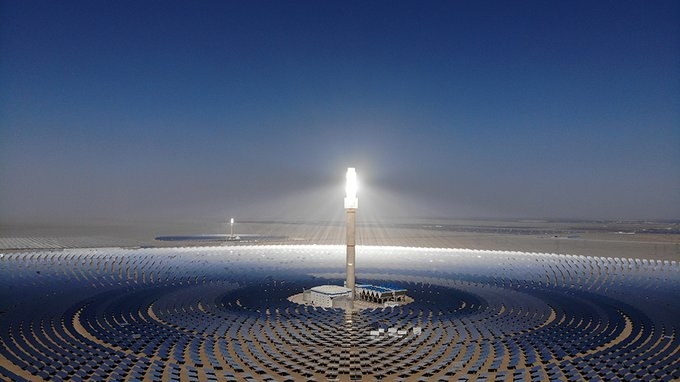
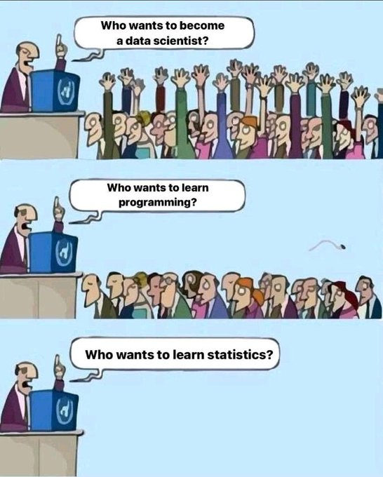

# Week 46


"@AlecStapp

Fix your labor shortage with this one [weird trick](twimg/FEIaeNNWUAI-dlM.jpg)"

---

"Rep. Jared Golden (D-Maine), one of the most vulnerable House
Democrats next year, blasted the SALT plan in a series of tweets
Wednesday night, saying it seemed like 'Republicans were in charge.'"

---

"The United States has thrown its support behind negotiations on a
treaty to curb plastic pollution, ending a key holdup in international
efforts to clean up the planet's oceans and save marine life"

[[-]](http://u.afp.com/wUNN)

---

Business Insider: "Some of them call it 'antiwork.' It's a trend
bolstered by younger workers, as Gen Zers make their mark on the labor
market. In America, it looks similar to similar youth-led movements
against work in other countries, especially China, where young people
are 'lying flat' by decentering a drive to constantly be more
productive and competitive at work, and instead find happiness in
their own lives and relaxation.

A rising disillusion with the state of work has spawned millions of
Larrys over the last year. People have been quitting their jobs at
record rates for six months in a row now — and many aren't going
back. That's because, for some, work doesn't seem to be worth it
anymore. Wages have been on the decline for decades while student debt
rises. The number of people with low-wage jobs has grown since the
Great Recession , as salaries that support a middle-class life have
cratered"

[[-]](https://www.businessinsider.com/what-is-antiwork-workers-quit-dont-work-strike-better-conditions-2021-11)

---

If supply probs persist, that could be a way to encourage folks to
consume less. On wages, when similar problems surfaced during the
[70s](https://youtu.be/8rxrjhWTdv8?t=27) developed world panicked,
"went to China", production skyrocketed through slave labor, at the
same time, wages stagnated and in US ppl started dying from
opioids... Let's not repeat that mistake.  If wages increase "more
than necessary" that is an internal politics fight, and let's have it,
with trade unions, politicians etc. In the meantime cannot find a Mr
Potatohead toy? Use a potato and make one

---

If Oz wanted to replace coal, the coal regions (in the East, and SW)
also get good sunshine. People can easily transition to a job at a
thermosolar plant.

[[-]](twimg/FENtnFlWUAIDbMK.jpg)

---

"The United Arab Emirates (#UAE) and #Russia will bolster industrial
collaboration in the field of #hydrogen fuel technology to boost
domestic decarbonisation with the signing of a memorandum of
understanding (MoU)"

[[-]](https://www.h2-view.com/story/uae-russia-to-bolster-hydrogen-prospects-with-new-agreement/)

---

Tech should allow new ways of working, not merely extend the existing
ways of working. Linux wasn't built bcz people could "chat" overseas
or "Zoom". The project, besides Linus Torvalds' leadership, was made
possible through async concepts such as the email, and shared code
repos, and the patch file.

---

Even the dog looks kinda sad

"@314159K

Yes ! The Worst of Both Worlds: Zooming From the Office"

[[-]](https://twitter.com/314159K/status/1460799696717467653)

---

Hah. Just heard guy on RT say "Germany destroyed its nuclear sector,
now have to rely on 90% natural gas for power generation". [Incorrect](twimg/FEYfMPoWYAEUpOs.jpg)

The rabble-rouser, thorn-on-the-side shtick is fine, but plz don't
pull bizarre non-truths out of your ass \#RT

---

Redtenbacher's Funkestra - Go Mo \#music

[[-]](https://youtu.be/OOIfTsrG0EU)

---

Expanding existing infra for the shiny product obviously makes the
overall approach even stupider. Gov had to lead, not follow bunch of
salesmen.

---

Even then, the BEV was considered as a ridiculous solution by many for
a long time, but as the drums of climate apocalypse became louder,
some started to think "maybe to avert that crazy end, I do need this
dumb-ass shit". A strange way to land at a conclusion, and of course,
faulty. Shoulda asked for better infra

---

The world became too used to solving problems throught those little,
shiny products, coming from the private sector, having been
brainwashed by neoliberalism.. Such products are stand-alone units of
goods that can be sold, expected to work on their own, assuming
certain infra backdrop.. nothing more.

Climate cannot be solved with such isolated trinkets. This is how an
inferior tech, the battery electric car, became en vogue, that
singular product trying to exist in a certain environment (the wall
plug). New and different infrastructure could have changed the
underlying Calculus completely, much earlier.

---

The word Istanbul comes from the Greek word Stanpoli, it means "in the
city". So trying to avoid Constantinople bcz it sounds Greek lands you
with Istanbul which also comes from Greek. Boom. This puts TR
nationalists in a bind doesn't it? Much in TR nat narrative is a
baseless, crooked fabrication.

---

Climate activists on air quality of Stanpoli, Asia Minor; they say the
smog seen there recently was pollution, not harmless mist... I've been
checking the pollution levels through OWM, half the time I see AQI at
a 5, the worst level.. Not good.

[[-]](https://mobile.twitter.com/euronews_tr/status/1458086790083096580)

---

SJW is a problem, sure, but Focker himself is a [shady fock](https://www.bloomberg.com/news/features/2021-09-15/peter-thiel-gamed-silicon-valley-tech-trump-taxes-and-politics). 

---

Doh! That's Focker's university isn't it?

TDB: "Two Top Advisers Resign From Anti-Cancel Culture University of Austin"

[[-]](https://www.thedailybeast.com/robert-zimmer-steven-pinker-resign-from-university-of-austins-advisory-board)

---

The testing area is relatively far to AU/NZ landmass, 6K kilometers,
but hey, it ain't on the other side of the world either, like the
Mojave Desert. Could irk some people.. They tested btw
60s-90s. Received protests from AU, NZ each time.

---

Found out about France's little unpopularity problem in Oz, due to
nuclear tests conducted in the South Pacific (in the so-called French
Polynesia). Maybe this is partly why they could be sacrificed easily
as a partner, the Oz general view would not care too much..

---

The gun issue is so radicalized it became an unsolvable mess. Dick
Morris is laughing his ass off right now \#triangulation. He had Dems
get stuck in the mud. Pat yourselves on the back corporate Dems.. you
let a Republican operative do that to you

---

Guilty or not guilty, self-defense or no.. This is arguing tangential minutea
of a [larger issue](https://www.theglobeandmail.com/opinion/editorials/article-a-trial-in-wisconsin-and-a-reminder-about-whats-right-with-canadian).

---

How did Powell "score one on the libs"? [Here](../../2021/10/all-too-human.html#gaysinmil).

---

"@AfricaFactsZone

Morocco has the world's largest Concentrated Solar Power (CSP) plant,
Ouarzazate Solar Power Station. It covers 3,000 hectares (the size of
3,500 football fields), and can be seen from space. It generates 580MW
of electricity, and will power 1 million homes and numerous cities"

---

"@sfpoulter

DYK: The cost of Concentrated #solar power (CSP) dropped 47% between
2010 and 2019 - according to @IRENA - 'making it a desirable option
for use in developing countries'"

---

"Peru, the country with the world's highest Covid mortality rate, will
begin next month to require vaccination proof from adults entering
indoor spaces, the government said"

[[-]](http://u.afp.com/w379)

---

Marmite is extremely potent. It's like condensed Guiness.

---

Fantastic history to all these things. Fine innovation.

Wiki: "The product that was to become Marmite was invented during the
late 19th century when German scientist Justus von Liebig discovered
that brewer's yeast could be concentrated, bottled and eaten...  By
1912, the discovery of vitamins was a boost for Marmite, as the spread
is a rich source of the vitamin B complex; with the vitamin B1
deficiency beriberi being common during World War I, the spread became
more popular. British troops during World War I were issued Marmite as
part of their rations"

---

100% veg

---

Marmite.. This guy puts it in the veg patties.. B-complex bomb.
This can work, approaching beef quality here.

---

*Shang Chi*, same, little more SJW.. Got the cold shoulder from CCP,
lost millions coulda had.. Not sure MCU can build this towards
something.. The character is too marginal afaik.

---

*No Time to Die* was Bond enough.. There was some SJW. Good action,
tech.

---

Centrism got its ass kicked in Virginia. Trump derangement, running
specifically against Trump didn't work. Not being able to hit the
opponent on Carlyle, like a leftist could, then getting mired in
culture war like a 90s centrist Clintonite destroyed the guy. I loved
it.

---

It was fitting that the first crisis in Clinton WH was a hot-button
social issue, not an economic issue. For econ they'd do NAFTA and
everyone was on board for that, except that one weird guy with the
squeky voice.. In a debate on the subject Perot (that weird guy with
the squeky voice) would argue against, Gore wld argue for, and one of
the "eminent characters" Gore would pull out of his bag to support his
case would be Powell. He was apparently for NAFTA -- and why wouldn't
he be? He was a Republican.

---

Let's not forget Colin Powell was beloved by Reps not because he
was a good general but because he fought in the culture war and
"scored one on the libs"

\#DontAskDontTell

---

Bipartisanship needs to get a demotion from being a remarkable event,
to something regular, and unremarkable. You agree on some stuff (key
is 'some', agreeing on all, especially econ, is harmful), you get them
done. What's the big deal..?

---

"@IEA_SolarPACES

Pacific Green shows how #CSP can cut green ammonia costs, [link](https://www.pacificgreen-solar.com/articles/pacific-green-shows-how-cut-green-ammonia-costs-ammonia-energy-conference-2021)"



[[-]](https://twitter.com/IEA_SolarPACES/status/1460152887716290563)

---

NO SHOW STOPPERS

"No show stoppers for Concentrating Solar Power... A recently published
study confirms that solar thermal power is largely unrestricted by
materials availability"

[[-]](https://www.chalmers.se/en/news/Pages/No-show-stoppers-for-Concentrating-Solar-Power.aspx)

---

Based on paper below, assuming a solar PV panel uses 0.2 g indium per
square meter (a low assumption, paper has it higher, 0.38 g/m2), 300 W
/ m2 solar energy, with 30% panel efficiency, and given world reserves
of indium is 5700 tons,

```python
m2 = 5700*1e6 / 0.2
km2 = m2 / 1e6
print (km2, 'km2')

world = 157481.
eff = 0.30
kw = m2*(300*eff) / 1000.0
twh_year = (kw*24*365) / 1e9
print ('%0.2f percent' % (twh_year / world * 100.0))
```

```text
28500.0 km2
14.27 percent
```

only 14% of world energy requirement can be generated through PV solar
tech, given the indium reserves and its usage. There are other
rare-earth metals too, cadmium, tellerium..

[[Paper]](https://www.researchgate.net/publication/281617586_Assessing_Rare_Metal_Availability_Challenges_for_Solar_Energy_Technologies)

---

AZO Cleantech: "[R]ecent research coming out of the Netherlands has
spotted a red flag to relying on solar panels as a panacea for global
emissions problems. Experts have found that the rare metals required
to build solar panels, such as indium and tellurium, are not in
sufficient supply to keep up with demand... Currently, China is
providing the world.. Yet [CH] is no longer abundant with precious
metals"

---

Electrons are fickle.. Must base the new energy system on things with
more of substance; gas, liquids, molecules, heat, pressure.

"The advantage of the thermal reflector systems is that because they
initially produce heat, this heat can be stored, and it’s an important
consideration if you need to produce electricity after
sunset. Photovoltaic panels, on the other hand, produce electricity
immediately, making storing electricity less efficient. The Negev
Energy project uses a molten salt storage system that enables it to
hold and provide additional 4.5 hours of clean energy each day, at
full capacity, even after sunset or during cloudy days"

[[-]](https://www.timesofisrael.com/israel-marks-start-of-work-at-thermal-solar-sea-of-mirrors-plant-in-negev/)

---

Increasing productivity decreases inflation..? The effect has too long
of a time horizon and it isn't that big, or direct. Don't bet your
econ diploma on it, if you have one 😶

---

Austria is not messing around..

Their vax rates were very low

"Austria lockdown for unvaccinated to start on Monday: chancellor"

---

AFG pullout, people apparently didn't like its execution.. It didn't
"look good".. WH could've done pre-spin perhaps but were caught
unawares themselves on Tali.

---

Downtrend on Biden's popularity did not start on Aug; it has been
going on since the beginning of 2021 (Delta?). Without the August
debacle, net pop wld have been at -5, with Aug debacle (AFG pullout)
it went to -10% territory.

---

US, instead of triggering a "Shale Revolution" in 2005, could have
gone solar, expanded its already substantial H2 pipeline capacity,
help commercialize fuel-cells NASA developed in the 60s.

---

Instead of building those ghost cities China could have built thermo
solar plants and at this point be energy sufficient, and carbon
neutral.

---

"Migrants Say Belarusians Took Them to E.U. Border and Supplied Wire Cutters"

---

Texas has more progressive taxation than the state of Washington?

[[-]](https://youtu.be/hNDgcjVGHIw?t=506)

---

NYT: "Urbanites in Canada Flock to Atlantic Region Amid Remote Work
Shift.. As housing prices soar in big cities, the country’s eastern
provinces are experiencing a surge in migration. Newcomers are being
welcomed, but some locals are wary"

---

"Despite the hopeful attitude during the 1950s and 1960s, it was soon
acknowledged that Artificial Intelligence was a much harder problem
than initially assumed. Today, AI capable of thinking like a human is
referred to as artificial general intelligence (AGI) and still firmly
the realm of science-fiction. Much of what we call ‘AI’ today is in
fact artificial narrow intelligence (ANI, or Narrow AI)"

[[-]](https://hackaday.com/2021/08/02/github-copilot-and-the-unfulfilled-promises-of-an-artificial-intelligence-future/)

---

Bloomberg: "It's become the conventional wisdom that the U.S. economy
is built on Americans' endless appetite to buy lots and lots of
stuff. Household consumption makes up about 67% of GDP. When the
economy falters, we're told spending is our patriotic duty. But
suddenly, Americans can’t spend like they used to. Store shelves are
emptying, and it can take months to find a car, refrigerator or
sofa. If this continues, we may need to learn to do without — and,
horrors, live more like the Europeans. That actually might not be a
bad thing, because the U.S. economy could be healthier if it were less
reliant on consumption"

[[-]](https://www.bloomberg.com/opinion/articles/2021-11-12/personal-finance-americans-need-to-live-more-like-europeans)

---

Subsidies? Both fossil and renewable get it at first.. to make sure
people dont revolt as in France yellow vests. Until both options are
on par -in terms of infra, support (repair, maintainence, second-hand
sales)-, then subsidies for the former can be cut off.

---

Need to work the incentives.. What do countries like? Cheap
energy. Countries with know-how develop thermosolar-H2 locally, then,
or at the same time, build a few of those for other countries,
transferring know-how..

---

I'm sure ppl at COP26 made the best deal they could with that
gathering.. And there is room to do more.

---

[Looks](twimg/FEF9quAWYBALdvn.jpg)
pretty bad...

Reuters: "New Delhi to shut schools, construction sites as pollution
worsens... Air quality in Delhi... has declined due to crop stubble
burning, emissions from transport, coal-fired plants outside the city
and other industry, as well as open garbage burning and dust."

---

"India to achieve 50% clean energy share...  before 2030.. India will
have around 450 GW from solar and wind, while 70-100 GW will be from
hydropower plants"

---

"Agriculture is responsible for X percent of emissions"... A better
analysis would drill down to each use-case. Agro emissons.. from what?
Are emissions coming from the tractors used on the fields, or the
heating needed for the greenhouses (as in greenhouse farming), or the
animals, or something else? If the biggest use-case is known, you can
priotrize the tech for that.

---

"@Mills4Humanity

It’s going to take money and lots of it to solve the climate crisis
and taxes for the wealthiest people is one obvious way to get it"

---

It is not inconceivable in order to open itself a new space of
influence in ME, Qatar used Syrian conflict; the ME region's balance
was too tied in the US/SA/Israel/Egypt quad, cemented, and upstarts
like Qatar felt like had to go around them. Another upstart, TR, was
pulled into the quagmire along w Qatar for the same reason (notice the
strong relations between the two).

---

Saw a few times on Al Jazeera (financed by Qatar) whenever Assad is
mentioned, his name is qualified with something like THAT \#$%@#
TYRANT, or something similar .. Makes u flinch.. the tone doesnt fit
with otherwise mostly neutral sounding voice of the news channel.

---

Al Jazeera: "Qatar has no plan to normalise ties with Syria: Foreign minister"

---

Reuters: "UAE reopens Syria embassy in boost for Assad"

---

There are "leaks" today claiming mid-Sep 2012 Qatar (with France!) was
plotting to topple Assad. Dunno if true, but QTR did act "outside the
mainstream ME power centers" in near past, and had a few scuffles with
SA.

Added those to the [timeline](../../0119/2017/12/timeline-syria-tr.html),
search for SA, QTR. 

---



---


"The rise of antiwork: Is there really a world without jobs?.. US
workers are quitting in droves amid the ‘Great Resignation’ – and a
growing movement is antiwork altogether"

[[-]](https://www.independent.co.uk/news/world/americas/quit-job-anti-work-pandemic-b1951136.html)

---

Later industrial production and society did the same to farmers, made
them obsolete, structures built around that earlier era were done away
with. Empires whose being depended on land/plunder/peasants collapsed,
like the Ottomans. Farming itself became industrialized, where a
fraction of population engaged in such work could produce enough for
millions.

---

Cheap contrarianism. It was clear-cut. Foragers were
[replaced](../../0119/2017/10/wtwrfn-foragers-farmers.html#replaced) en masse by
farmers.

"The progression of history was not clear-cut, from hunter-gathering to
farming"

---
