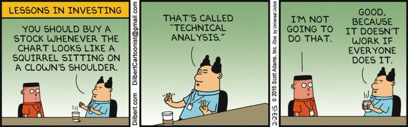
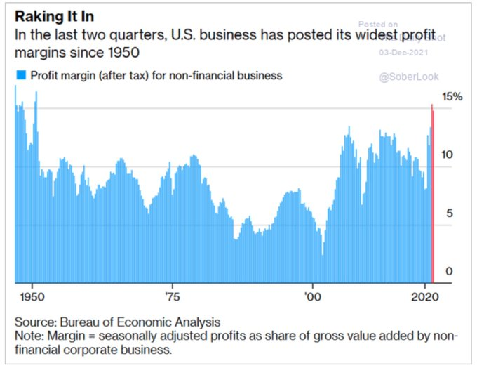
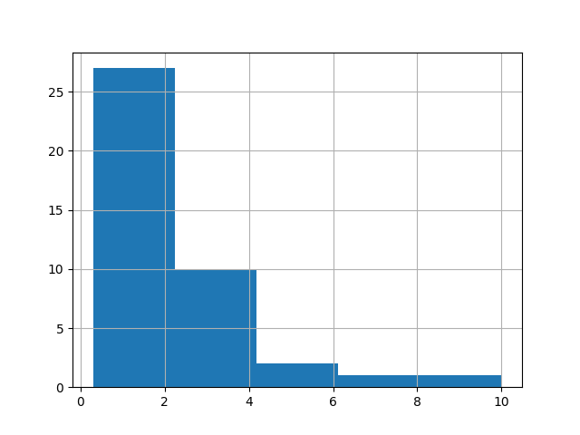

<iframe width="340" src="https://www.youtube.com/embed/xs4ypRAPc-c" title="YouTube video player" frameborder="0" allow="accelerometer; autoplay; clipboard-write; encrypted-media; gyroscope; picture-in-picture" allowfullscreen></iframe>

---

I'd replace AI with crude intelligence, automation, ML in the title, rest is fine

<iframe width="340" src="https://www.youtube.com/embed/lXuQKoQCtOc" title="YouTube video player" frameborder="0" allow="accelerometer; autoplay; clipboard-write; encrypted-media; gyroscope; picture-in-picture" allowfullscreen></iframe>

---

"@SDonziger

BREAKING: Danbury prison officials released me this morning to serve
the rest of my sentence (136 days) at home. Huge step forward"

---

"@greg_price11

I was just on my way to Subway and was confronted by two men holding
chocolate chocolate chip ice cream cones. They recognized me from
Twitter, punched me in the face, and said "this is Build Back Better
country."

I'm crying and vomiting everywhere"

---

"@eikeklapper

Transition of power. German style"

[[-]](https://twitter.com/eikeklapper/status/1469315734786527232)

---

H2 Fuel News: "Aramco and Gaussin partner up for hydrogen
vehicles... The companies are aiming to create a manufacturing
facility located in Saudi Arabia"

---

H2 Fuel News: "A consortium of energy firms and universities are
investigating the use of spent oil and gas wells in the United Kingdom
for carbon capture and storage sites from producing blue hydrogen"

---

H2 View: "RWE, Kawasaki to develop ‘one of the world’s first’ 100%
hydrogen-capable gas turbine plants for power generation in Germany"

---

H2 View: "€14m AmmoRef project to explore more efficient ammonia
cracking technology for industrial-scale hydrogen
transport.. Committed to this project is Clariant Catalysts with the
company now participating in the German TransHyDE"

---

Gabagool

"Italy slaps Amazon with €1.1 billion fine for abusing dominant market position"

---

IMO the increase of conflict in Yemen had something to do with this stall

"U.S. Moves to Tighten Iran Sanctions Enforcement as Nuclear Talks Stall"

---

WSJ: "Uber Workers Would Be Classed as Employees Under EU Proposal"

---

"@BillyM2k

i still say it’s fantastically simple to prove you’re satoshi just
move some of the bitcoin in your wallet in the public blockchain that
literally everyone can see

it’s ridiculous and pointless to claim you are satoshi otherwise"

---

The court case supposedly 'proves' Craig Wright is Satoshi? No.

---

Omicron thread. Data so far "suggests milder illness".

[[-]](https://mobile.twitter.com/jburnmurdoch/status/1468310562849308675)

---



---

Links, \#value

[One](http://kaushik316-blog.logdown.com/posts/1651749-stock-valuation-with-python),
[Two](https://corporatefinanceinstitute.com/resources/knowledge/valuation/intrinsic-value-guide/)

---

Good vid on intrinsic value calculation. 

[[-]](https://m.youtube.com/watch?v=l-T-Vyk2txc)

---

Cha-Chang!

---

"The hands are 90% of Spanish" \#thecommunity 

[[-]](https://youtu.be/vgYZMIU0IlM?t=55)

---

Why flip the class around centrally recorded / chosen lectures? Bcz
that way students wont have to contend with some average jagoff waving
his arms around (aka the teacher), failing to educate.

---


---

H2 View: "Modular micro hydrogen fuel cells developed by myFC are set
to take the market by storm.. [they have a] 75% higher per volume
effect than previous fuel cells"

---

H2 View: "Germany is set to gain hydrogen solutions for its railway
network with Lhyfe supplying Deutsche Bahn with an electrolyser to
fuel a hydrogen-powered train for the H2goesRail project"

---

H2 View: "The ‘first’ zero-emission hydrogen-powered airliner in the
US is set to be operational by 2025"

---

Go to vacation and come back, Germany has a new freaking Chancellor!
Congrats.

---

WSJ: "Germany's Scholz Takes Power After Merkel's 16-Year Rule"

---

🤣 Asshole had a foodgasm right there, eyeballs popping out of the
sockets.. This vid is what I based my version on.

[[-]](https://youtu.be/l75ixsh-wjI?t=436)

---

I need buns... lots of buns..

---

Yikes ran out the stuff.. need burger buns to test the new creation

---

Oh yeaaa...

"Newsmax Admits Employees Must Be Vaxxed to Attend New York Holiday Party"

---

"Israel’s Bennett talks up trilateral security alliance with Greece, Cyprus"

---

"Biden didn't accept Putin's 'red lines' on Ukraine"

---

"Macron criticises ‘woke’ EU language rules"

---

H2 Fuel News: "BP looks to massive green hydrogen plant for heavy duty
truck fueling.. The facility will be located at the HyGreen Teesside
project in the United Kingdom"

---

H2 Fuel News: "Port of Seattle green hydrogen fuel project underway with DOE funding"

---

H2 Fuel News: "Hydrogen fuel cell locomotive from Canadian Pacific to roll out before 2022"

---

H2-View: "Woodside to develop a 180 tonne per day liquid hydrogen
production facility in the US; signs new agreement with Hyzon
Motors.. Australian energy producer Woodside has today (Dec 7)
revealed plans to expand its hydrogen portfolio to the US as it
secures land for a future liquid hydrogen production project and signs
an agreement with Hyzon Motors"

---

H2-View: "Russia’s Novatek set to supply blue hydrogen to RWE"

---

TDB: "Democratic Exodus From Congress Could Supercharge the
Squad.. [M]ore than a dozen House Democrats are headed for the exits
this Congress, and the left flank couldn't be more thrilled. Their
hope is these races could add to the ranks of progressives in
Congress, who've seen increased influence over policy and leadership
in recent months"

---

All the more reason to switch to contained, sealed-off, automated
farming that uses no soil. We've been using this shit for thousands of
years. Time for that equation to be overturned.

The Guardian: "UN's Food and Agriculture Organization.says soils
contain more microplastic pollution than the oceans"

---

Russia has better Pacific access than China, not blocked by a string
of Japanese islands. 

Janes: "The Russian military has deployed... mobile coastal defence
missile system in the Kuril Islands, a chain in the northwest Pacific
Ocean, the ownership of which is disputed by Japan and Russia"

---

Dam.. that revenue is in dire need of diversification.. which SA is
working on, afaik

"Oil forms 85% of SA's revenue"

---

A child could deduce the Sun is liquidic. We know the Sun's
gravitational pull on the Earth, from that, and known Earth mass, we
get Sun's mass. Sun's volume is easy, even optically we can determine
a rough radius, from there get volume. Divide mass with volume you get
density. That density my friend will be close to water's density. Good
old H2O -- a liquid.

---

It looks fluidic to me, especially see ones with closer shots, there
are like waves and shit in there 


---

@MailOnline

Andrew McCarthy layered 150,000 individual pictures of the Sun to
convey the intricate stunning detail of the solar system's largest
star

[[-]](https://www.dailymail.co.uk/sciencetech/article-10279601/Astrophotographer-snaps-clearest-photo-SUN.html)

---

Excessive capitalism is killing people

<iframe width="340" src="https://www.youtube.com/embed/UjVYrdSNo-M" title="YouTube video player" frameborder="0" allow="accelerometer; autoplay; clipboard-write; encrypted-media; gyroscope; picture-in-picture" allowfullscreen></iframe>

---

How deadly is Omicron? See below. Not as bad as October peak of Delta
so far, but it doesn't look harmless either. 

[[-]](../../2020/02/corona.html#usdailydeath)

---

Either do Finland, or, at least, flip classes around centrally
recorded / chosen lectures.. For a slam dunk, follow my system.

"@IpseDixitCicero

In Finland private schools are illegal. The rich donate so their child
and ALL children have better schools.  Every child has equal
access. And, even better, Murdoch and his media are banned from
entering the country. It can be done and I wish we would"

---

The Atlantic: "So what work is actually valuable? It’s incredibly
unclear. Many knowledge workers, ourselves included, find themselves
insecure in some capacity about the work they’re doing: how much they
do, whom they do it for, its value, their value, how their work is
rewarded and by whom. We respond to this confusion in pretty confusing
ways. Some become deeply disillusioned or radicalized against the
extractive, capitalist system that makes all of this so muddled. And
others throw themselves into work, centering it as the defining
element of their self-worth. In response to the existential crisis of
personal value, they jump on the productivity treadmill, praying that
in the process of constant work they might eventually stumble across
purpose, dignity, and security... The treadmill rarely provides the
kind of value and meaning that we hope it will. People are growing
more certain in the notion that the status quo of American working
life is untenable. But the pandemic has created an opportunity to
reconsider and reimagine the structure of our lives and, perhaps,
remove the vestigial, extractive elements. We believe that flexible
work—not flexible work during a pandemic, not flexible work under
duress—can change your life"

[[-]](https://www.theatlantic.com/ideas/archive/2021/12/how-care-less-about-work/620902/)

---

"Never mind that in the three years that had passed since the
withdrawal [from the Iran nuclear deal], Trump’s strategy was, on its
own terms, clearly not succeeding: Renewed and increased sanctions on
Iran — dubbed “maximum pressure” — had not forced Tehran to capitulate
and negotiate a better deal, nor had the economic damage to the
Islamic Republic led to its overthrow by a restless public. To
Israel’s possible surprise, moreover, Trump never followed through on
threats to strike Iran directly despite growing nuclear violations and
multiple attacks against Washington’s regional allies.

Bucking the official line, some Israeli security officials, many of
whom were heading into retirement, admitted that the policy was a
failure"

[[-]](https://newlinesmag.com/reportage/why-israel-sort-of-misses-the-iran-deal/)

---

This is good

"8 Women and 8 Men: Germany Gets Its First Gender-Equal Cabinet"

---

Some good info here on Russia/India relationship

[[-]](https://youtu.be/exlRuebKgqA)

---

NYT: "India and Russia Expand Defense Ties, Despite Prospect of
U.S. Sanctions.. India’s purchase of a missile defense system signaled
that it was more worried about an emboldened China at its borders than
about angering the United States"

---

TDB: "The Deadly Cargo Inside MH370: How Exploding Batteries Could
Explain the Mystery.. There were two pallets of lithium-ion batteries
in [MH370] cargo"

[[-]](https://www.thedailybeast.com/the-deadly-cargo-inside-mh370-how-exploding-batteries-explain-the-mystery)

---



---

Hypersonics are not a panacea.. Every capability invites its defense,
for HS case, now the other side will consider attacking missile
launches at a mere hint of a launch, at its source. Then you're kind of
back to square one; trying to defend the homeland, makes attack on
the homeland more likely.

---

I describe such people as sophisticated tourists.. knowing more abt
a country than many others, but not *of* them.

---

Culturally Dr Oz is straight-up American (he grew up in US), wout an
iota of tigger in him. Immigrant parents cannot shape the cultural
make-up of a child, nor vacation visits to the "homeland". "It takes a
village" is correct in more ways than one. The village has your child,
not you

---

Toto did the score for *Dune* 1984? 

---

In my system there is extreme flipping (while flipping the bird to
teachers), and no grades, but at the very least schools should flip
the classroom as it's generally described.

"In fact, in one study, 200 teachers flipped their classrooms, and 85%
of them saw an overall increase in grades"

---

Heard of this DSP guy, he used 4th order poly approx for a signal proc
approach, and it worked *better* than using the periodic function
itself 😶

---

Working on a new time series structural break test approach..
Need to remove trend, and peridocity

---

Why fourth order? Has to do with the Taylor expansion probably..

TE is supposed to mirror derivatives of the approximated func, and,
for $\sin$,

$\sin^{\prime}(x)=\cos(x),\quad$
$\sin^{\prime\prime}(x)=-\sin(x),\quad$,
$\sin^{\prime\prime\prime}(x)=-\cos(x),\quad$,
$\sin^{(4)}(x)=\sin(x)$.

The fourth order derivative came back to the sine function itself.

---

Approximating periodic functions with 4th degree polynomial works well.

---

I was wondering about that; if electrolysis could be bypassed
altogether, with the method below elec generation is not needed, plant
goes from the Sun to H2 fuel, direct. Great news. Fantastic research.

---

"Synlight: Researchers expect that within 10 years, Concentrated Solar
Power (CSP) can be used to split water to hydrogen chemically using
the world’s desert sun... light is concentrated on a demonstration
system containing a cerium oxide lattice. If steam is led into the
reaction chamber, the oxygen it contains will combine with the metal
at around 800 °C and will be absorbed by it, so that hydrogen is the
only product left. Hoffschmidt said that the gas was 'an alchemist’s
dream,' as 'this high-energy fuel can be used to create virtually
anything.'"

[[-]](http://www.solarpaces.org/splitting-hydrogen-10000-suns-concentrated-solar-power/)

---

"Bloom energy used its electrolyzer powered by Heliogen’s CSP
technology for the green hydrogen fuel production. According to
Heliogen, its ..  CSP technology is capable of producing electricity
for longer spans of time than traditional solar photovoltaic (PV)
technology. By storing the solar energy, it can operate for just about
24 hours per day and seven days per week"

[[-]](https://www.hydrogenfuelnews.com/hydrogen-fuel-production-csp/8549517/)

---

CSP generated H2 from Africa, or Australia through pipelines cld
supply the entire world with cheap energy. 

---

Ukraine is short of coal supplies, Russia cut off its exports and
since invaded Donbass with coal mines, they are now controlled by
Russia. Plus there is an NG crunch pushing coal prices up.. Ukraine is
desperately trying to import from US, Latin America while winter is
approaching..

What a f-ing mess. 

---

Replication of its duration histogram. It is exponential distribution. 

```python
import pandas as pd
df = pd.read_csv('../../2021/12/empires.csv',sep=';')
df.Duration.hist(bins=5)
```



---

Empires and durability. Interesting paper. [Data](2021/12/empires.csv).

[[PDF]](https://pdodds.w3.uvm.edu/files/papers/others/2011/arbesman2011a.pdf)

---

<blockquote class="twitter-tweet"><p lang="en" dir="ltr">Our micro fuel cell technology creates a unique market position for industrial trucks and robots that requires relatively low power levels where we intend to target and address a major part of the market, says Michael Glantz CEO myFC. <a href="https://t.co/fnxDgxcKWv">https://t.co/fnxDgxcKWv</a></p>&mdash; myFC Power (@myfcpower) <a href="https://twitter.com/myfcpower/status/1442436886069452811?ref_src=twsrc%5Etfw">September 27, 2021</a></blockquote> <script async src="https://platform.twitter.com/widgets.js" charset="utf-8"></script>

---

H2 View: "Norwegian-based Kongsberg Gruppen has successfully tested
and verified a new hydrogen fuel cell powered drivetrain for ships and
ferries"

---

H2 View: "BayoTech officially unveils 1,000kg per day hydrogen hub for
New Mexico, US"

---

H2 View: "Australia to gain hydrogen production project with a 900
tonne per day capacity by 2031"

---

CNBC: "Wood's main exchange-traded fund, which trades under ticker
ARKK, is down more than 12% this week, on pace of its worst week since
February"

---

"Massive protests in Serbia against Rio Tinto’s lithium mining
ambition"

[[-]](https://balkangreenenergynews.com/massive-protests-in-serbia-against-rio-tintos-lithium-mining-ambition-pollution/)

---

Jane's Defense: "US Army donates [47] M1117 armoured security vehicles
to Greece"

---

Maybe some anti-vaxxers are just scared of needles. Should docs offer
anesthesia? Knock them out, apply the vax, done.

---

Someone was caught using one of those things, saw it on the news the
other day

---

🤣 🤣 🤣 

"Anti-vaxxer sells $1,500 prosthetic arm to escape getting vaccinated;
post goes viral"

[[-]](https://www.firstpost.com/world/anti-vaxxer-sells-1500-prosthetic-arm-to-escape-getting-vaccinated-post-goes-viral-10087731.html)

---

Kayrros claims they have satellite based methane monitoring? Checked
out the site; need to open up ur data. 

---

UAE was busted while allowing a CH base construction.. Mending fences
w TR - which is fine. And now buying a lot of mil hard from FR. Some
changes over there.

"UAE signs ‘historic’ deal to buy 80 French-made Rafale fighter jets"

---

Dennis Miller on RT America? 

---

Looking at the [sunshine map](../2022/twimg/FCtre5sWEAgFFp9.png)
for Africa again, the four countries with maximum sunshine are Libya,
Egypt, Chad, Sudan. All had lots of unrest recently.. In the South,
Angola, Namibia, Tanzania.

---

