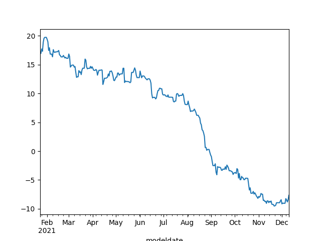

# Week 50

<blockquote class="twitter-tweet"><p lang="en" dir="ltr">🏁 We&#39;re starting our (hydrogen-electric) engines by 2028. 🏁<br><br>As the largest airline to invest <a href="https://twitter.com/ZeroAvia?ref_src=twsrc%5Etfw">@ZeroAvia</a>&#39;s new engines, we&#39;re one step closer to putting our customers in line for net-zero travel. To learn more ➡️ <a href="https://t.co/1QJ5vta4gG">https://t.co/1QJ5vta4gG</a> <a href="https://t.co/qBwvs4PdW0">pic.twitter.com/qBwvs4PdW0</a></p>&mdash; United Airlines (@united) <a href="https://twitter.com/united/status/1470468580626124805?ref_src=twsrc%5Etfw">December 13, 2021</a></blockquote> <script async src="https://platform.twitter.com/widgets.js" charset="utf-8"></script>

---

CNBC: "Investment from United to purchase hydrogen-electric
engines.. United Airlines plans to purchase up to 100 [of them]"

---

H2 Fuel News: "United Airlines invests in ZeroAvia hydrogen fuel cell planes "

---

H2 View: "Linde Africa, Hive Hydrogen to develop $4.6bn green ammonia
production project in South Africa"

---

H2 View: "Peugeot unveils its first hydrogen vehicle"

---

H2 Fuel News: "Full-size hydrogen fuel cell system for ships undergoes
testing by Kongsberg"

---

H2 Fuel News: "Aurizon, an Australian rail freight operator, is
working with the Anglo American global mining firm for the purpose of
using hydrogen powered trains using the miner’s H2 fuel cell
technology for bulk freight"

---

No, since M4A will cost *less*, it would be deflationary. You'd be
spending smaller amt for the same (better) service.

---

Pelosi is Number \#15. Small wonder poor gets shafted by Dems
constantly, they dont even have healthcare. Just look at the Dem SOH.

"Meet the 25 wealthiest members of Congress"

[[-]](https://www.businessinsider.com/wealthiest-members-congress-house-senate-finances-2021-12#15-rep-nancy-pelosi-a-democrat-from-california-46123051-11)

---

Hardball.. 

AP News: "Germany expels Russian diplomats over state-ordered killing"

---

"It's 'game over' for U.S.-listed Chinese companies, global asset
manager says"

---

"House Votes to Ban Imports From China's Xinjiang on Labor Concern"

---

<blockquote class="twitter-tweet"><p lang="en" dir="ltr">Did carbon dioxide write this <a href="https://t.co/62lt1shKNq">pic.twitter.com/62lt1shKNq</a></p>&mdash; Honey (@benegotherit) <a href="https://twitter.com/benegotherit/status/1470927490461827072?ref_src=twsrc%5Etfw">December 15, 2021</a></blockquote> <script async src="https://platform.twitter.com/widgets.js" charset="utf-8"></script>

---

Assange is an Oz citizen. This is their deputy PM talking.

"'Assange was not in breach of any Australian laws at the time of his
actions. Assange was not in the US when the event being deliberated in
a court now in London occurred,' Mr Joyce wrote... 'The question is
then: Why is he to be extradited to the US? If he insulted the Koran,
would he be extradited to Saudi Arabia?'"

[[-]](https://www.abc.net.au/news/2021-12-14/barnaby-joyce-opposes-extradition-of-julian-assange/100697630)

---

Corporations know that full well of course; they sponsor and help
spread the "liberty-centric" message to avoid regulation, increased
taxes (as they were hit with in Mexico) or outright bans.

---

Some cried foul when authorities (as in NYC muni) tried to clamp down
on sugar, in soda, in foods, etc, labeling it "government intrusion
into daily lives". Many forget preferring sugar over fat, than
creating an env for "exercise nuts" when it didnt work was part of a
misplaced wave that happened (created) outside them as well, outside
the control of regular people. They, their parents followed that dumb
ass shit and ended up here. Now they should not pull out the
"intrusion" argument in the 11th hour when some are trying to fix the
problem for them. Many seem to forget they live in a modern world,
where concentrated, centralized forces roam.

---

H2 Fuel News: "Cummins to build H2 fuel cell innovation center in West
Sacramento.. The engine manufacturer will be working with 18,000
square feet of space in California"

---

H2 Fuel News: "Green hydrogen can be made for under $1 per kilogram
[by 2030], says [energy consultancy W. Mackenzie]"

---

H2 View: "Hyzon Motors to supply hydrogen-powered trucks to Taiwan
under new agreement"

---

Ok.. but stopping plastic pollution is better than relying on some
bugs eating it

"Bugs across globe are evolving to eat plastic, study finds"

---

Major job losses wout AGI is possible. 

TDB: "This Is the Robotic Hand That Could Finally Take Over Your
Job.. [O]ne of the most difficult human parts to mechanically
replicate is the hand. The human hand can accomplish a nearly endless
amount of tasks—not just because of how versatile our hands and
fingers are, but also because we can intuitively determine how much
force to apply. It’s incredibly challenging, for instance, to teach a
robot how to hold an egg with two fingers firmly without crushing the
shell. A team of South Korean scientists may have just solved this
problem—and perhaps opened the door to robots finally taking over our
jobs"

[[-]](https://www.thedailybeast.com/this-is-the-robotic-hand-that-could-finally-take-over-your-job)

---

trick ho

27/10: "Rep. Marjorie Taylor Greene bought up to $50K in shares of Trump SPAC"

---

wut

19/10: "Trump's 2020 election lies are even worrying Marjorie
Taylor. Greene is urging Republicans to vote, suggesting Trump's 2020
obsession has gone too far for her"

---

Note the image of a rich person 200 yrs ago was someone fat (bcz sugar
was rare only the rich could afford it). Now the image of a rich
person is lanky, bcz the wealthy have access to better cooking,
ingredients (through chefs etc), read: less starch, more vegs. The
issue never was the amount eaten, or how much fat.

At the same time typical poor person now is likely to be fat; sugar
and starch has become so prevalent in the market that it is now
feeding (and killing) the poor.

---

But sugar, starch is bad

---

Interesting.

He did a little Northerner bashing there too, yieea French guy
could not help himself (see link)

---

Dietician Montignac: "[Potato] loses most of [its vitamins] when it is
cooked and, especially, when it is peeled"

[[-]](../../2021/12/eat-yourself-slim-montignac.html#potato)

---

H2 View: "Inverness, Scotland, to be transformed into a hydrogen hub"

---

H2 View: "H2 Clipper to accelerate commercialisation of its
hydrogen-powered airship... The innovative H2 Clipper airship.. has
been selected for inclusion in the Dassault Systèmes’ Exclusive
Accelerator Programme"

---

H2 View: "Plug Power, Certarus partner to serve the North American
hydrogen market"

---

The Mandarin: "The [AU] Queensland government has announced that a
feasibility study will be conducted into the use of hydrogen-powered
trains for bulk freight"

---


That thing has nearly the capacity of the Nordstream 2 pipeline which
is built to supply *a country*. Imagine 10, 20 of such plants.. How
can that not solve our energy problem? For far-flung shipments,
generate ammonia. Or H2, pipe it to whereever. CSP already can work at
night bcz it utilizes heat which can be stored in molten salt nearby
temporarily.  Winning tech.

---

Massive. Lots going on in UAE 

"Dubai Sees World’s Largest Single-Site 700 MW Concentrated Solar Project"

---

Losing top talent.. \#China \#HK

"Nearly 90,000 \#HongKongers have applied for resettlement in Britain
under a new visa scheme offering a pathway to citizenship"

---

This can be problematic for BJ

<blockquote class="twitter-tweet"><p lang="en" dir="ltr">Just remembering how strictly friends and family in England followed covid rules last year.<br>Two friends had to fight to spend time with their dying parents<br>Lots of elderly and isolated people spent Xmas alone. Had some horrid conversations with very sad but rule-abiding people. <a href="https://t.co/xhFXJT9jJw">https://t.co/xhFXJT9jJw</a></p>&mdash; Catherine Nicholson (@ACatInParis) <a href="https://twitter.com/ACatInParis/status/1470882636348461059?ref_src=twsrc%5Etfw">December 14, 2021</a></blockquote> <script async src="https://platform.twitter.com/widgets.js" charset="utf-8"></script>

---

Al Jazeera: "How left-wing forces are regaining ground in Latin
America.. As progressives win key elections from Honduras to Peru,
analysts point to changing regional dynamics"

---

The Mandarin: "The federal government will change its data website to
become a “one-stop shop” for all Australians interacting with
commonwealth data"

---

"Australia and South Korea strike 1 billion dollar defence deal.. The
deal will see a Korean company provide 30 self-propelled howitzer
artillery weapons, and 15 ammunition resupply vehicles and radars"

---

Sad. Prof is saying all her grad students these days are just tuning
parameters on some neural net like a monkey. We can take comfort in
the fact these ppl wont bring about AGI dystopia. One less item to
worry about.


[[-]](../../2020/07/ai-comments.html#mitchell)

---

*Finch* is supposed to take place in 2030 -- 9 years away.. And the
roboticist guy had strong AI tech? Sci wouldn't have advanced that
far.. not with the current neural, "deep" approaches. He'd have the
dog and some bizarre chatbot that spits out random facts from
Encyclopedia Brittanica. I'd rather have all published novels be read
aloud to me through Text-to-Speech, or have re-runs of MASH.

---

*I Am Mother*, *Finch*, highly dystopic stuff

---

"She put pineapples on my pizza" 🤨
 
---

*Apex*, *Fortress*.. so many cheesy WIllis movies in
succession.. Trying to stumble upon the next *Pulp Fiction*? Not
working

---

Nitin Sawhney - Bengali Song \#music

[[-]](https://youtu.be/PJkOQXIq_r8)

---

Sorta remember the funky weather.. I was in the hood

"12/3/1993 storm, named the Storm of the Century, hit an area so large
stretched from Honduras to Canada". 

---

100, 200 Terrajoules, these are insane numbers, translates into
roughly 25,55 Gigawatt hours..

---

Integrated Kinetic Energy calculation for hurricanes. The particular
NOAA archive I used does not have the most recent events, but Katrina,
Sandy dates are there.

[[-]](../../0119/2019/06/ike.md)

---

H2 View: "Airbus continues to explore hydrogen technologies in the
aviation industry and will accelerate its research with a new
Spanish-based innovation subsidiary"

---

Financial Review: "China, hydrogen to top agenda of South Korean
leader [Moon's AU] trip.. [to collaborate] on the production of
hydrogen in Australia to meet South Korea’s future energy needs"

---

'[UK] Project AETHER will acquire ‘Stratospheric Uncrewed Air Systems’
that can stay airborne for months and be rapidly manoeuvred anywhere
in the world to provide ‘Ultra-Persistent Wide Area Communications
with Intelligence, Surveillance and Reconnaissance’ capabilities"

---

<iframe width="340" src="https://www.youtube.com/embed/fQV6LtGcrXw" title="YouTube video player" frameborder="0" allow="accelerometer; autoplay; clipboard-write; encrypted-media; gyroscope; picture-in-picture" allowfullscreen></iframe>

---

"@davies_will

My timeline is currently a selection of the world’s most vaccinated
people telling each other to get vaccinated'

---

Biden Net Approval from 538, All Polls

There is some improvement.. 

```python
import pandas as pd
url = "https://projects.fivethirtyeight.com/biden-approval-data/approval_topline.csv"
df = pd.read_csv(url,parse_dates=True,index_col='modeldate')
df = df[df.subgroup=='All polls']
df = df.sort_index()
df = df[df.index > '2021-01-01']
df['net'] = df['approve_estimate'] - df['disapprove_estimate']
df.net.plot()
```

```text
modeldate
2021-12-06   -8.233155
2021-12-07   -8.451866
2021-12-08   -8.807036
2021-12-09   -8.420995
2021-12-10   -7.651807
Name: net, dtype: float64
```



---

But imo the ideology, its first inception, quickly [fell out of
favor](../../2020/04/turks-culture-national-narrative.html#estagfurullah),
stayed that way until well into the 20th century when Kemal and his
cohorts utilized, resurrected the same escapist fantasy to handle a
similar trauma. The empire was gone, and the new nation needed
something "different". The founders served up the nomadic Turk from
faraway lands, just like Nazis had dreamt up the Aryan from Atlantis.

---

The claim is the Otto itself started the Turkist ideology partially in
the 15th century, before the "Grand Ancestor" Kemal. Otto had its ass
kicked back then by Temarlane from Central Asia, so historians
(propagandists) were attempting to say "yeah we are kinda like that
guy, we are from that region too".

[Video](https://youtu.be/LLD1gm26nHg?t=108) (in TR)

---

Energy *can* become a non-issue. Absolutely. Yes we can.

H2 View: "Hydrogen has always been the answer to our energy
needs. However, the configuration of global politics post WW1, which
was won by oil and coal supremacy, was always going to be a tough nut
to crack...

With hydrogen, we can now take energy “off the table” as a source of
so many historic ills, and we can do it far more rapidly than has been
suggested"

---

H2 View: "Australia has started trials for a hydrogen *Guarantee of
Origin* scheme that aims to add value for all types of hydrogen with
specification on how the hydrogen was sourced to allow customers to
know how clean it is"

---

H2 View: "Australia has seen significant progress within its hydrogen
sector and has now been recognised as a ‘world leader’ in hydrogen
technologies in the State of Hydrogen report...

This expansion of the hydrogen sector will continue to expand with the
Government launching significant funding opportunities for the sector
[as seen in] the $464m Clean Hydrogen Industrial Hubs programme that
has already seen benefits with hubs being announced across the nation"

[[-]](https://www.h2-view.com/story/australia-recognised-as-world-leader-in-clean-and-affordable-hydrogen-production-says-report)

---

H2 View: "Sweden receives unique investment to develop a 24-station
strong hydrogen refuelling structure by 2025"

---

November atmo carbon levels - 0.45% YoY increase. Average increase for
every month since the 60s has been 0.44%. On track toward hell.

[[-]](../../0119/2015/08/temp-increase.html#carbonyoy)

---

"@tcql

Looking at benefits for potential next job and I still just cannot
fathom anybody who would fight to keep the US healthcare
system. Insurance is a fucking nightmare and is *designed* at every
turn to frustrate, confuse, and deny help"

---

"@latimes

Leaked hospital records reveal huge, automated markups for healthcare
A former nurse at Scripps Memorial Hospital showed columnist David
Lazarus screenshots of the facility’s electronic health record
system. The screenshots show price hikes ranging from 575% to 675%
being automatically generated by the hospital’s software"

[[-]](https://twitter.com/i/events/1469421433021419525)

---

November Inflation 6.8%.

---

Never Tango with an Eskimo. That was a song.

---

I see.. Iglos have good insulation, the rest is body heat. They are
not the problem.

---

How do the Eskimo get heating..?

---

Yep. Confirms an earlier obs, this fact jumps out at you looking at
the emission graph. Heating is the worst polluter, first bcz of its
energy requirements (which are not 100% green) and through unorthodox
methods of generating heat IMO in the developing world.. I cant blame
them, the alternative wld be freezing to death.

US EPA: "Recent data suggest that space heating accounts for about 42
percent of energy use in U.S. residences and about 36 percent of
energy use in U.S. commercial buildings"

[[-]](https://www.epa.gov/rhc/renewable-space-heating)

---

