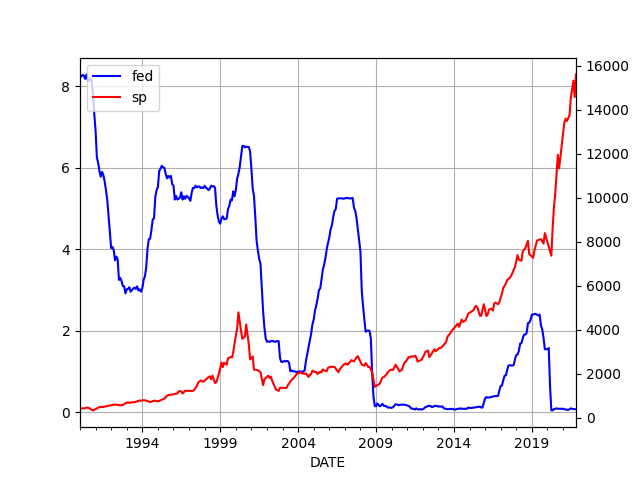

# Week 1 

Heliogen went public recently. They received $39 million grant from
DOE, steel maker ArcelorMittal invested. 

On the residential / industrial division: homes would still receive
CSP power through their tech operated by utilities, so people will
benefit, there is no need to install an entire solar farm in their
backyard. CSP's focus is massive scale, availability, and that's good,
much benefit to derive from that, eg at night they use power stored in
molten salt to run 24/7, something PV solar cannot do.

\#CSP \#Heliogen

[[-]](https://youtu.be/Hv1PO_aB5-c?t=123)

---

Gov did good here.. They looked at the tech, pondered what is needed
to advance it, and boom! A whole new consortium.

Energy.gov: "Heliostat Consortium..  is funded by the .. DOE.. A
heliostat is a device that continually tilts a mirror or multiple
mirror facets to track the sun’s movement in order to reflect sunlight
toward a predetermined target—such as a receiver sitting on top of a
solar tower. Heliostats are a critical component of CSP"

[[-]](https://www.energy.gov/eere/solar/heliocon)

---

\#parking

[[-]](twimg/FHe7PYiVcAEoNw-.jpg)

---

\#printer \#internetofshit

[[-]](twimg/FH5u-2TUYAoGnIP.jpg)

---

Sad part is, the share might actually be true

<blockquote class="twitter-tweet"><p lang="en" dir="ltr">This morning at 5:40am my desktop metamask was hacked and drained of all funds and NFTs.<br><br>The only thing I did differently was charge a brand new dildo on my computer and installed the app<br><br>Still trying to wrap my head around this but I think I was just hacked by a fucking dildo</p>&mdash; Crypto ฿itlord (@crypto_bitlord7) <a href="https://twitter.com/crypto_bitlord7/status/1473231965927063553?ref_src=twsrc%5Etfw">December 21, 2021</a></blockquote> <script async src="https://platform.twitter.com/widgets.js" charset="utf-8"></script>

---

Paper: "[Our] search excludes the axion-photon coupling predicted by
one of the benchmark models of 'invisible' axion dark matter"

---

Paper: "The axion has emerged in recent years as a leading particle
candidate to provide the mysterious dark matter in the cosmos"

---

I checked the data, Granger causality shows the two-year treas affects
FEDFUNDS little more than the other way around. Both sides would
follow eachother closely to gauge reaction to events, but since for
bonds inflation is a major risk, they can't not rise (in yields) in
response to rising inflation. In turn the overnight borrowing rates
between banks cannot be neutral to that (read: FEDFUNDS), they'd lose
money on a daily basis. So FED wld be forced to follow the bond
market.

"Although it is still debatable whether the Fed leads or follows the
market, movements in the policy rate are associated with similar
movements in short-term interest rates [as in treasury bonds]"

[[-]](https://www.stlouisfed.org/on-the-economy/2017/october/increases-fed-funds-rate-impact-other-interest-rates)

---

Insane amt of energy.. what a waste

"Iran orders crypto-mining ban to prevent winter blackouts... The ban,
which will be in place until March 6, will free up 209 megawatts of
power for household consumption"

---

Vox: "'Money feeling strange in 2021 is based on a decade of money
slowly feeling strange for lots and lots of different people
throughout the world,' said .. professor.. So much of the economy
feels like a scam — the gig economy, student loans, the hope of
retirement, a 9-to-5 job. Consumers are always being tricked and
squeezed by corporations. The promise of the middle class is fading
fast, so for a lot of people, it just feels like you might as well
lean into whatever financial chaos is available to try to hit it
big. If housing prices are so high you’re never going to be able to
own a home, why not try your hand at real estate in whatever the
metaverse is?"

---

"Breakfast is the most important meal of the day"? [Kellog](https://www.mashed.com/234731/the-reason-people-believe-breakfast-is-the-most-important-meal-of-the-day/).

Corporate marketing, again.

---

Not suprising, humans are not built to run that way; Nike marketing
advertised such style of running so they could [sell products for it](../../0119/2019/12/civilized-to-death.html#nike).

Again we see regular people, consumers are taken for fools. They have
no mechanism to protect against such interjections save gov
regulation.

OMG! He said regulation! 

"Approximately 74% of [endurance] runners experienced a moderate or
severe injury each year, but those who habitually rear-foot strike had
approximately twice the rate of repetitive stress injuries"

[[-]](https://www.kinetic-revolution.com/new-research-foot-strike-and-injury-rates-in-endurance-runners/)

---

haha.. crazy guy. 

"In New York City [1865], a man was attacked by an enraged crowd when
he shouted, "It served Old Abe right!" after hearing the news of
Lincoln's death"

---

Kick Bong - Duby Cure \#music

[[-]](https://youtu.be/hrOicdVsFLw)

---

Divasonic - Tick Tick Boom \#music

[[-]](https://youtu.be/7nPFpva8JSU)

---

Fila Brazillia - Pots & Pans \#music

[[-]](https://youtu.be/V0r7U6RrFhc)

---

Politico: "Biden already looks to be trying to make amends with the
left. Since Manchin axed Build Back Better, the president has acceded
to two major demands from progressive lawmakers and activists: He
extended the pandemic-related moratorium on student loan payments and
recently offered his clearest and most direct support for doing away
with the filibuster to push through voting rights legislation"

---

We dont use particles to calculate fluids.

This is *key* to understand how modern science is conducted.
[Food for thought](https://drive.google.com/uc?export=view&id=13fTfDxQdQ6oFKKkKbNcuAbHD-P7un6Q-).

"But if we use particles to simulate a fluid, why not using brain
particles (neurons) take us closer to human level intelligence?"

---

"It has happened again. Microsoft and Nvidia have built [NN] three
times the size of GPT-3, the former holder of the title. However, in
contrast with GPT-3, this new model hasn’t caused any commotion,
neither in the press nor in the AI community. And there’s a reason for
that...

Do we really need yet another biggest neural network?.. What are the
consequences of following the path of scaling models ad infinitum —
for the AI community in particular, and the world in general? Wouldn’t
it be better if we gave more space to other approaches to AI and
artificial general intelligence (AGI)?..

[NN based Large language model] LLMs have been recently entitled
'foundation models' by dozens of Stanford researchers. They argue that
these ever-larger neural networks comprise “an emerging paradigm for
building artificial intelligence systems.” But not all AI experts
agree with this fancy title.

Jitendra Malik, a professor of computer science at Berkeley says that
'the term ‘foundation’ is horribly wrong.' Adding, 'The language we
have in these models is not grounded, there is this fakeness, there is
no real understanding.' Mark Riedl, a professor at the Georgia Tech
School said on Twitter that “branding very large pre-trained neural
language models as 'foundation' models is a brilliant .. PR stunt.”..

But 'foundation models' isn’t the only title the AI community has
given to LLMs. In a paper dating March 2021 Emily M. Bender, Timnit
Gebru, and others called these models 'stochastic parrots.'"

[[-]](https://towardsdatascience.com/yet-another-largest-neural-network-but-why-f48d231972a9)

---

Aaand they apparently created an even bigger NN, "AI" recently and
noone cared. Story above.

---

86 billion neurons in the brain.. The so-called GPT3 neural net had
175 billion.. Yet still there isn't that spiffy NN that'll look at a
text and determine a simple triplet, A did X to B, which I can do
half-asleep with 100% accuracy. I need such code to filter news
stories. Where is it?

---

\#oceans \#plastic

[[-]](https://youtu.be/T-0d9l_ZZCo?t=976)

---

The new favorites seem to be Mexico and India, for US companies.

"A study by the UBS Evidence Lab found that a staggering 76% of US
companies with factories in China were in the process of or
considering moving operations to other countries in 2020"

[[-]](https://www.lovemoney.com/gallerylist/98705/big-multinational-companies-moving-out-of-china)

---

Woke went broke.. Ghostbusters 2016, Herminator: Woke Fate, bombed.
Recent Marvel TV shows are mostly terrible. MCU had the one-off ok
movie, but that doesn't cover up the implosion of *The Eternals*. 

---

The Matrix obviously is a placeholder for everything that is "the
system". The AI is mere symbolism. 

---

*Operation Fortune*, definitely seeing that. 

---

US was for the integration news says.. Coons went there? Was he
speaking for the gov?

2019: "Hemedti refus[ed] to integrate Rapid Support Forces into the
[Sudanese] army"

---

"From a Gulf perspective, the benefits of a coup [in Sudan] are
limited..  the coup now exposes the strong asymmetry between the
military and civilians. Moreover, Gulf states are aware that the
Sudanese military and the security forces are deeply divided. While
the coup gives the army a false appearance of unanimity, it only
postpones future confrontations with the paramilitary Rapid Support
Forces, headed by Hemedti"

---

The Sudanese PM resigned, probably not wanting to be cucked anymore by
the military already running everything.

I want to hear more abt that Hemedti guy though.. Sup with him

---

Netherlands overdid it \#lockdowns

---

John Madden died? 

[[-]](https://youtu.be/zAlrPVWBKGQ?t=61)

---

Blast from the past \#1991

US voters unelected the party at the helm during that event, one year later

[[-]](twimg/FHi2oApXEAMmyxQ.jpg)

---

<blockquote class="twitter-tweet"><p lang="en" dir="ltr">📢 <a href="https://twitter.com/heliogeninc?ref_src=twsrc%5Etfw">@heliogeninc</a> to start trading on NYSE on Dec 31<a href="https://t.co/AzAf6mLSFu">https://t.co/AzAf6mLSFu</a><a href="https://twitter.com/hashtag/CSP?src=hash&amp;ref_src=twsrc%5Etfw">#CSP</a> <a href="https://twitter.com/hashtag/solar?src=hash&amp;ref_src=twsrc%5Etfw">#solar</a> <a href="https://twitter.com/hashtag/thermal?src=hash&amp;ref_src=twsrc%5Etfw">#thermal</a> <a href="https://twitter.com/hashtag/concentrated?src=hash&amp;ref_src=twsrc%5Etfw">#concentrated</a></p>&mdash; SolarPACES (@IEA_SolarPACES) <a href="https://twitter.com/IEA_SolarPACES/status/1476811240110448645?ref_src=twsrc%5Etfw">December 31, 2021</a></blockquote> <script async src="https://platform.twitter.com/widgets.js" charset="utf-8"></script>

---

Renewables Now: "Spain to hold 500-MW renewables auction for CSP"

---

"Renewable hydrogen is now being produced at a facility in Lloseta,
Mallorca, that could produce at least 300 tonnes of the clean energy
carrier annually"

---

Al-Monitor: "Egypt announces deal for large petrochemical production
complex.. The new integrated complex for the production of methanol,
ammonia and its derivatives in the industrial zone of Ain Sukhna,
Egypt, aims to export its products with a production of one million
tons of methanol and 400 thousand tons of ammonia annually"

---

Floating panels can help FR in their territories. Around Madagascar
there is massive sunshine, floating panels can do the work. From there
can ship H2 or ammonia to Europe.

---

Floating solar panels, by French engineer Ludivine Pasquier

<iframe width="340" src="https://www.youtube.com/embed/Yr-WuZxFKxY?start=186" title="YouTube video player" frameborder="0" allow="accelerometer; autoplay; clipboard-write; encrypted-media; gyroscope; picture-in-picture" allowfullscreen></iframe>

---

Let's not forget [Oct 2021 oil spill](https://www.usatoday.com/story/news/nation/2021/10/05/what-caused-california-oil-spill/6001096001/)
near California.

A ship's anchor broke the pipeline, if H2 was being sent, worst case,
H2 mixing into H2O would be no big deal.

The CA crude oil leak lasted for 3 hours before it was detected. More
than 140,000 gallons of oil leaked into Southern California waters.

---

Reshare

"Sixteen wells off Louisiana have been leaking since September
2004, when a subsea mudslide caused by Hurricane Ivan knocked over a
Taylor production platform"

---

According to data in the link, oil pipelines have 4.9 E-4 per year-km
failure rate, natural gas 7.2 E-5. Canada has over 70,000 kilometers of
oil pipelines,

```python
print (int(70000 * 4.9*1e-5), 'accidents per year')
```

```text
3 accidents per year
```

This is the expected \# of accidents.

The best protection is not to have fossil pipelines.

[[-]](https://www.icheme.org/media/9672/xxi-paper-044.pdf)

---

Pipelines, coal, natgas, high prices, shortages.. This is where rubber
meets the road; switching from old to new was never going to be easy.

---

Any energy that moves needs to be clean molecules, prefarably H2 gas.
Much cleaner than fossil, more efficient than the electric grid. H2
pipeline can transmit 10 times the energy at 8th the cost.

---

Canada has over 70,000 km of large transmission oil pipelines. Any of
those cld go haywire and the environment disaster would be severe.

---

WSJ: "South Africa Says Its Omicron Wave Is in Retreat"

---

Makes sense.. Omicron will overwhelm the system otherwise; less deadly
but spreads faster, T&T is a bad match for that.

"The [AU] New South Wales government’s Covid contact-tracing system
has been all but abandoned, with efforts now focused only on those in
the highest risk categories"

---

US Omicron deaths still less than Delta, no uptrend

[[-]](../../2020/02/corona.html#usdailydeath)

---

See the SP500 graph; That kind of rise is exponential (right time to
use the word). Rises like that are seen with amoeba, bacteria
population growth when there are no limits in resources; so they eat
everything in their petri dish and multiply.

---

```python
plt.figure()
ax1 = df.FEDFUNDS.plot(color='blue', grid=True, label='fed')
ax2 = df.sp500.plot(color='red', grid=True, label='sp',secondary_y=True)
h1, l1 = ax1.get_legend_handles_labels()
h2, l2 = ax2.get_legend_handles_labels()
plt.legend(h1+h2, l1+l2, loc=2)
```



---

```python
from io import BytesIO
import urllib.request as urllib2, time as timelib
import pandas as pd, datetime
from pandas_datareader import data

today = datetime.datetime.now()
start=datetime.datetime(1990, 1, 1)
end=datetime.datetime(today.year, today.month, today.day)
cols = ['GDPC1','FEDFUNDS']
df = data.DataReader(cols, 'fred', start, end)

start1 = int(timelib.mktime(start.timetuple()))
end1 = int(timelib.mktime(end.timetuple()))

url = "https://query1.finance.yahoo.com/v7/finance/download/^IXIC?period1=" + str(start1) + "&period2=" + str(end1) + "&interval=1d&events=history&includeAdjustedClose=true"
r = urllib2.urlopen(url).read()
file = BytesIO(r)
df2 = pd.read_csv(file,index_col='Date',parse_dates=True)
df['sp500'] = df2['Close']
df = df.interpolate()
print (df.corr())
```

```text
             GDPC1  FEDFUNDS     sp500
GDPC1     1.000000 -0.728588  0.786939
FEDFUNDS -0.728588  1.000000 -0.470347
sp500     0.786939 -0.470347  1.000000
```

Negative correlation, -0.47, between the stock market and the FED rate.

The asset purchases do not show up in the base numbers, but they can
be considered as a form of negative interest rate policy. If their
effect was included somehow, the negative correlation would be even
more pronounced.

Ergo once the asset purchases stop, that act will be akin to a rate
rise.

---

The stock market is a socialist stock market right now. Government
(the FED) is propping it up with its asset purchases and low
rates. When that stops and rate rises begin let's see that nice "free
market" holds up..

We saw a hint of that in 2018, with a mere 2.40% FEDFUNDS the
"correction" that followed scared the shit out of FOMO monkeys.
"Thanks" to the pandemic FEDFUNDS went near zero now and voila, enter
the boom of all booms.

---

Not that it hasn't happened [before](../../2020/03/appelbaum.html#transistor).

---

We should congratulate businesses for being "opportunistic" for
"taking advantage of gov"? Hah :)

Well then maybe gov will opportunistically tax their ass and take
"their IP". That would be opportunism too, right? 🤨 

Yea... now he bitchin..

---

Make money, and aim to make money, fine. My only qualm is, if DARPA (gov) 
helped a company have the base tech, and federeal gov gave them subsidies,
they cant [charge](https://www.theguardian.com/uk-news/2021/dec/05/wall-of-secrecy-in-pfizer-contracts-as-company-accused-of-profiteering)
thirty dolars for one dollar vaccine and still keep their
IP. This is socialism for the corporations, capitalism for the rest.

---

Sony will haul most of those Benjamins home.. not Disney/Marvel.

---

Spiderman told a good story. It wasn't cuck. Nicely done (except
the pseudoscience).

---

Even *Wall E* showed some kind of satisfactory ending; couch potatos
got out of their e-couches, arrived at a planet, something new
began. 

\#thematrix

---

One way to look at the Matrix movies is as small, muted, centrist
shitlib protests..  The system is not changed bcz these people are
fine with it as it is, they merely want to be "recognized" in it, to
be its The One (which everyone can beee if you belieeeeve), so they
can fly over it, be "loud and proud" while they enjoy a simplistic
diversity around them, and "represent". Strangely similar ending to
*Jupiter Ascending* (same director), the cleaner girl discovers she is
space royalty, then "saves Earth" with her "diverse" new boyfriend /
soldier, but returns, stays as a cleaner, while once in a while flies
over the city to enjoy her specialness and uniqueness. People are not
being harvested but have no idea what happened, things stay the same

\#thematrix

---

The meta stuff was probably due to the original's imagery being an
overbearing presence.. Director must have felt the only way to get out
from under that is to reference it as another version, go a little
meta

\#thematrix

---

*The Matrix Resurrections*; good to see the lead actors again, movie
had some good ideas.. but if there are no "reboot sequels", the
situation is no different than at the end of the first movie. Then
it's like what's the point? After the first, most expected the
destruction of the "system". The absence of that ending sapped the
energy of the sequels, wout courage they ended up as neutered, cheap
war movies with a few memorable action scenes

\#thematrix

---

Voted for the invasion of Iraq... \#reid

---

I'd just watched the guy on a UFO docu too. he apparently worked on
that.. which is pretty useless for the most pressing needs of
today. These Dem centrists.. I bet they are into UFOs bcz they know
they are of no help and want to get their rocks off on something that
'sounds' substantial.

---

What deal did he show those skills on? Obamacare? That's not much of a
skill

"Harry Reid remembered as a fighter, skilled Senate dealmaker"

---

FR seems in love with its nukes and the concept of nuclear.. A
national pride thing I guess in the race to be in the same league
as the big powers.

---

Vid on FR nuke tests, Greenpeace and NZ.

FR operatives *bombed* a Greenpeace ship. 

[[-]](https://youtu.be/kXP8F4TIZ0U?t=543)

---

New schedule, biweekly public TW releases, save emergencies.. let's
see if it works out.

---

Prices can be different for different regions; the supplier is
different (Russia, vs US' local production), transport, demand is
different. Maybe RU also played a blackmail game, to have
Nordstream 2 activated..

---

For European natgas prices, the future contract Dutch TTF can be used.

EU natgas price has been at insane levels.. fell somewhat recently.

[[-]](../../2021/01/stats.html#eunatgas)

---
