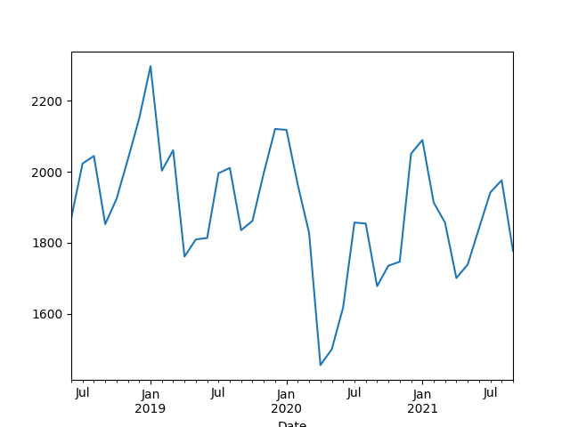
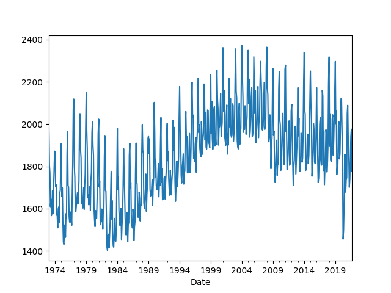
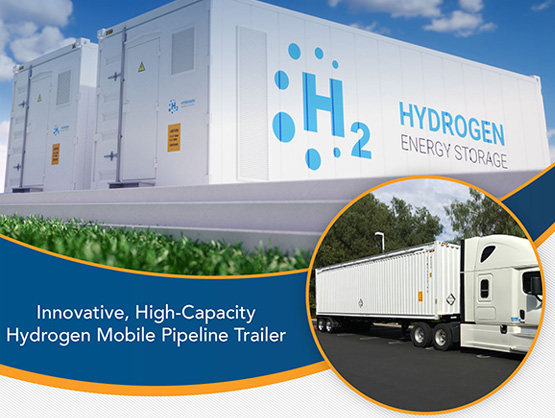
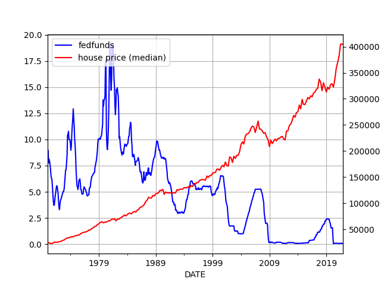

# Week 2 

---

H2 View: "UAE, UK to explore clean hydrogen opportunities through new
partnership"

---

H2 View: "Aberdeen Investee, AES-100 Inc., Reports Technical Viability
of Hydrogen Extraction From Natural Gas Pipelines"

---

H2 View: "myFC to develop hydrogen fuel cell systems for bicycle"

---

H2 View: "Carbon emissions reduction technologies company Haldor
Topsoe.. inked a €45m loan agreement to research hydrogen
technologies. An agreement signed with the European Investment Bank,
the loan will allow the company to focus on the production of green
chemicals and renewable fuels, such as green hydrogen, green ammonia
and biofuels"

---

H2 View: "Germany to significantly boost renewable energy technologies
with hydrogen set to be central to decarbonisation"

---

"Saudi-based Acwa Power.. has announced plans to begin the first phase
of Noor Energy 1 [CSP] project, located in Dubai with a total capacity
of 217 MW...

The 950 MW Phase Four is the largest investment project in the world
[in its class]"

---

"1.3GW CSP Projects Planned to Start in 2022 [in China]"

[[-]](http://www.cspfocus.cn/en/market/detail_5026.htm)

---

Chemical, as in the chemistry used by those disposable hand
warmers. DHWs contain iron powder, salt powder, enclosed in a plastic
wrap. When the contents are removed all comes into contact with air /
oxygen, iron oxide is formed which is an heat-emitting "exothermic"
reaction. User gets heat in the process, the perfect hand warmer. No
electricity, no flame, just basic chemistry.

---

If more ppl came up with chemically activated H2 or ammonia based
heater solutions, it would be helpful, potentially game-changer
even. Something like [this](https://www.design-industry.com.au/lavo-hydrogen-bbq)
tech from Lavo.

---

CO2 from fossil stays in the atmo for very long time.. When an uptick
in the graph falls, doesnt mean CO2 produced at the high disappears.

---

Let's zoom in,

```python
df['twh'].tail(40).plot()
```



Right there.. Peak on July, peak on January, peak on July, peak on
January..  On and on it goes..

Winter spikes are worse. This is US, in the other parts of the world,
fossil burning wld be more extreme. Wood, coal, cow dung..

---

US fossil fuel consumption, in terrawatt hours, 

```python
import pandas as pd, requests
from datetime import date

api_key = open('.eiakey').read()
url = 'http://api.eia.gov/series/?api_key=' + api_key + '&series_id=TOTAL.FFTCBUS.M' 
r = requests.get(url)
json_data = r.json()
df = pd.DataFrame(json_data.get('series')[0].get('data'))
df['Year'] = df[0].astype(str).str[:4]
df['Month'] = df[0].astype(str).str[4:]
df['Day'] = 1
df['Date'] = pd.to_datetime(df[['Year','Month','Day']])
df = df.set_index('Date')
df = df.sort_index()
df['twh'] = df[1] * 0.29307 # 1 trillion btu to twh
df['twh'].plot()
```



---

1KW of heat is required for every 14 cubic meters. 50 m2 for 4 people,
buildings of 4 meters high,

```python
per_person = 10000 # watts
watt_heat_per_m3 = 1/14*1000.
home_vol = 50*4 
heat_w = home_vol*watt_heat_per_m3 / 4
print ('%0.1f watts per person for heating' % heat_w)
print ('%0.1f perc for heating' % (heat_w / per_person * 100.0))
```

```text
3571.4 watts per person for heating
35.7 percent for heating
```

That is the percentage of energy needed for heating assuming a person
needs 10 kilowatts of energy.

---

EIA: "On average, more than half (51% in 2015) of a [US] household’s
annual energy consumption is for just two energy end uses: space
heating and air conditioning"

[[-]](https://www.eia.gov/energyexplained/use-of-energy/homes.php)

---

"A deep chasm in the ground that’s been burning since the 1970s is due
to finally be extinguished. Known as the ‘Gates of Hell’, the fiery
sinkhole stretches 230-feet wide and is located in the Karakum Desert
in Turkmenistan.. Noone really knows how it was created, but one of
the popular theories is it was created in ’71 when Soviet scientists
ignited it"

[[-]](https://metro.co.uk/2022/01/10/close-the-gates-of-hell-flaming-chasm-to-be-sealed-up-after-51-years-15894082/?ito=socialmetrouktwitter)

---

Nature: "[To scientists] Build a registry of results that students can
replicate.. To speed research, express conclusions as testable
statements, and incorporate testing into training"

[[-]](https://www.nature.com/articles/d41586-021-03707-9)

---

Sarkozy started that whole biz. He used to say he wld clean out
'trouble' neighborhoods "a la Kärcher". Added bonus, Kärcher (with
umlaut!) is a German name / brand which made the whole comment sound
even badder. Boo. Scary German word from Germany. The company must
have had it by now, can't blame them.

"One of the world's leading makers of pressure washers and steam
cleaners [Karcher] has formally asked French politicians not to use
its name to score political points"

---

Jane's Defence: "The United Kingdom has received its ninth and final
Boeing P-8A Poseidon MRA1 maritime multimission aircraft
(MMA)... Delivery of all nine Poseidon MRA1s is a major milestone in
the reconstitution of the UK's airborne maritime patrol capability"

---

Jane's Defence: "Australia will buy more than 100 tanks and armoured
vehicles from the US for $3.5 billion, [says] defence minister."

---

"Jeremy Corbyn considers launching new party to rival Keir Starmer if
he is not reinstated as a Labour MP"

---

Politico: "[A mother from US] I tweeted, 'Does anyone else feel
enraged at the idea that you’ll be homeschooling in the fall
full-time? Cuz my moms group text is in full-blown acceptance mode and
it bugs the shit out of me.' I didn’t know it yet, but this would be
my first foray into school reopening advocacy..

Members of the parent group I helped lead were consistently attacked
on Twitter and Facebook by two Oakland moms with ties to the teachers
union. They labelled advocates’ calls for schools reopening 'white
supremacy' called us 'Karens,' and even bizarrely claimed we had
allied ourselves with Marjorie Taylor Greene’s transphobic agenda"

---

"More than half of Europeans will be infected by Omicron in next two
months, WHO says"

---

Similar to involuntary manslaughter, on a wide scale.. People get
punished for involuntary manslaughter. 

---

Curious how much trouble an official acceptance of a covid lab-leak
conclusion can cause. US could be liable for some stuff.. It's like
you killed over 5 million people, akin to dropping a tactical nuke on
a city. Is it enough to throw Fauci under the bus as a modern day
Mengele, and be done with it?

---

"The New Fauci Emails Are Even More Damning Than You Think" \#rising \#grim

[[-]](https://youtu.be/sD0i_YxPATc?t=107)

---

"Quebec seeks to tax unvaccinated as health system struggles with Omicron"

---

"@Zachary

The IMF says crypto prices are moving more in lockstep with stocks,
raising the risk of contagion across financial markets"

---

Why is Bitcoin price falling when there is inflation? Aren't they
supposed to be a "safe heaven asset", a hedge against "money being
debased"?  Looks like BTC is merely another risky asset just like
those overvalued tech stocks, or, hell, the stock market itself. And
as risky assets go down so does Bitcoin right along with them.

---

*Run and Gun*, not bad.. not bad at all. Rich Kind was hilarious as ever. 

---

*Call of Duty* mission *Behind Enemy Lines* has a scenic
backdrop.. Saw someone else's play, not a big dumb non-stop action,
lots of moving around silently, gives gamer more time to explore the
environment. Decade old game but still good.

---

H2 View: "[The California Hydrogen Business Council] outlines 200
heavy-duty hydrogen refuelling stations target by 2035"

---

H2 View: "In a significant moment for the hydrogen economy, JERA and
Mitsubishi Heavy Industries (MHI) have been given the green light to
carry out a project that aims to develop an ammonia single-fuel burner
suitable for coal-fired boilers [for co-firing with at least 50%
ammonia]"

---

H2 View: "Australia's largest rail freight operator Aurizon is looking
at green hydrogen fuel cell technology to cut emissions and replace
diesel-powered engines"

---

GKN H2: "[We are] selected to be part of U.S. Department of Energy
H2@Scale cooperative projects to help reach Hydrogen Shot.. DOE just
announced nearly $8 million in funding for nine cooperative projects,
one of which will include participation by GKN Hydrogen"

---

Li battery tech is shockingly bad for the needs of a green
future. Lithium reserves are limited, can only handle 5% of world
storage needs. Fast charging on par with chemically refueling is a
pipe dream, the best they can do is half an hour, which, when applied
degrades the battery increasing the chance of a blowup (when these
f-ing things burn BTW, fire fighters cannot put out the fire with
regular methods). Batteries degrade even with regular charging (see
below) after 3500 cycles they go down to 70% capacity (imagine the
effects of that on a second-hand market for BEVs). Batteries are
heavy, impractical for transportation of energy.  Batteries rely on
rare-earth materials, for which we need to destroy Chile, Bolivia to
get. From a systemic, TCO viewpoint the tech is a complete junk.

---

GKN H2: "Our state-of-the-art metal hydride storage has been developed
and refined over the last 8+ years.. The standard metals we are using
are 100% recyclable.. The low-temperature metal hydride storage system
operates at the same pressure level as electrolysis and fuel cells..
The metal hydrides can last for decades without any losses. (99%
capacity after 3,500 cycles vs. 70% after 2000 cycles with Li
batteries)"

[[-]](https://www.gknhydrogen.com/)

---

The Mandarin: "Australia signs defence treaty with Japan, launches
hydrogen trade program"

---

QFS tech can carry 803 kg at 248 bars in one trailer. H2 is 20 kg/m3
at 300 bars, 33.6 kWh/kg and avg household consumption of elec being
893 kWh per month,

```python
eng = 10 * 33.6 * 803.0
print (eng, 'KWh')
print (int(eng / 894), 'homes')
```

```text
269808.0 KWh
301 homes
```

10 of those trailer containers can deliver enough energy for 300 homes for a month.

---



Quantum Fuel Systems: Quantum’s hydrogen .. trailers enable the
distribution of a clean energy solution.. We’ve combined our 20+ years
of experience with hydrogen and our industry-leading virtual pipeline
trailers to bring to market our new hydrogen virtual pipeline trailer"

[[-]](https://www.qtww.com/product/virtual-pipeline-trailers/)

---

"Duterte wants unvaccinated jailed as COVID rate hits record high"

---

Sweet. Major planning there with the food.. 

CNBC: "[An] American couple saw the pandemic as an opportunity to
embark on a 3,149-mile hike along the Continental Divide Trail, which
stretches across the United States between the borders of Mexico and
Canada... To ensure they had an adequate supply of food, Miller and
Beissinger dehydrated 100 homemade dinners and mailed them out to the
various towns they planned to pass on their hike"

---

Employees already forgo some of their freedoms when they join a
company.. A company can require its employees to be present at certain
locations for example as its execs see fit, but then, during a
pandemic if everyone at those locations are not vaccinated, the
company could be creating a health risk for them -- a risk which they
might not be willing to take. So it should be within their rights to
require all employees to be vaccinated.

They could create some bizarre convoluted scheme of course, one for
employees with vax, one without vax, but that's just too much of a
pain in the ass. Easier to say "just get the f-ing vax". 

---

It should be within their rights to do so

"Citigroup will terminate unvaccinated workers by Jan. 31, a first
among Wall Street banks"

---

CNBC: "Stocks fell on Friday to end a rough first trading week of the
year, as tech shares were battered by rising interest rates... The
10-year Treasury yield topped 1.8% on Friday, continuing its 2022 run
from a 2021 year-end level of just 1.51%"

---

So many ppl made money from the DT gravy train.. even CNN.

---

Thank the man.. he did a solid, indirectly

---

And Don is your uncle.

"Donald Trump's niece Mary buys $7m New York apartment after releasing
best-selling memoir"

---


If you do single-payer, have to do it at scale, the bigger the better,
so California scale would be a good place to start. If they pull it off,
hopefully it will spread to the rest of the country. 

LA Times: "California would enact a sweeping, first-in-the-nation
universal healthcare plan under a proposal unveiled Thursday by a
group of state Democratic lawmakers, providing health services to
every resident and financed by a broad array of new taxes on
individuals and businesses... The proposal, now laid out in separate
pieces of legislation, faces significant hurdles in the coming
months.. “There are countless studies that tell us a single-payer
healthcare system is the fiscally sound thing to do, the smarter
healthcare policy to follow, and a moral imperative if we care about
human life,” Assemblyman Ash Kalra (D-San Jose), the proposal’s
author, said Thursday"

---

S. Poitier, RIP

---

Yann is so full of shit. With his approach, deep neural networks what
came to be called "AI" today, that is *exactly* what they are
doing. If not in the tiniest detail, certainly in spirit, in the
overall approach to the problem. Implicitly they believe what's known
about the human brain so far is final, X number of neurons are there,
they somehow "connect" and do stuff together, so if we start from tiny
particles (software neurons) and build up in code, we will reach human
level intelligence. This is the belief -- yet no cigar. A decade ago
they could be forgiven bcz the hardware "wasn't there yet". Now it
is. Where is Artif. General Intelligence?

NN Expert Yann LeCun: "The cargo cult approach to aeronautics—for
actually building airplanes—would be to copy birds very, very closely;
feathers, flapping wings, and all the rest. And people did this back
in the 19th century, but with very limited success... The equivalent
in AI is to try to copy every detail that we know of about how neurons
and synapses work, and then turn on a gigantic simulation of a large
neural network inside a supercomputer, and hope that AI will
emerge. That’s cargo cult AI"

---

Euler is the name of the game. Riemann, compressible - key words.

---

Russian female journalists.. Ekaterina Kotrikadze, enthralling. She
has this hyptnotizing vibe.. Vertigo bro.

Oksana Boyko; I give a 10, stricly for the booty. [Boom!](twimg/FIG8am6XoAUu1bP.jpg)
If any wider u'd need license plates for that ass. Hoooot-daam!

---

JFK is claimed by the "Irish" as one of their own, but his kinship,
and comparisons to him should be on the grounds of "young and bad
Presidents" rather than an "Irish" President. And as a young and a bad
President he is more like a Bill Clinton, or George W. Bush.

---

Feynman apparently ignored most of the film, looked at two frames
only, before and right after the event. Eliminating noise, focusing on
the essential.. key.

---

There is footage (the so-called Zapruder film) w jfk moving in ways
suggesting someone shot from the front (Oswald shot from behind), but
that theory has been debunked. They showed the reel to Feynman he
concluded the shot came from Oswald's direction. He knew a thing or
two abt physics right, action-reaction etc.

"JFK assasination cld have been done by a second shooter"

---

"Anti-vax protesters in France tell Macron, ‘we’ll piss you off’" \#F24

[[-]](https://www.youtube.com/watch?v=KN4U8zAoHgM)

---

Yes some reports talk about a second wave of protests which were
likely "managed" by the sitting Prez trying to use the unrest against
another faction in the country (the previous President).

NYT: "The [Kazakh] crisis coincided with a power struggle within the
government, fueling talk that the people fighting in the streets were
proxies for feuding factions of the political elite."

---

After Rome invaded Gaul, today's France, did the natives change? Did
they become Italian-like? I dont think so.. no more than they already
are similar due to being around the same region. I remember one Julius
Ceasar observation of the Celts [parahr] "Celt men are given to
frequent displays of bravery".  Isn't that how natives are still like
are over there? That Spiderman guy climbing high-rise buildings, or
the rope walker P. Petit.

---

They mixed Catholicism and Vodoo, so it's like Vodoo
Christianity.. Shows many things can mix with many other things, and
the regional, culture (codes) can be extremely entrenched.

---

🤣 🤣 

The Guardian: "Far from B-movie cliches, vodou is spiritual system and
a way of life.. Haiti, the saying goes, is “70% Catholic, 30%
Protestant, and 100% Vodou”. Vodou is everywhere in the Caribbean
nation, a spiritual system infusing everything from medicine and
agriculture to cosmology and art"

[[-]](https://www.theguardian.com/world/2015/nov/07/vodou-haiti-endangered-faith-soul-of-haitian-people)

---

Clean engine as in H2 combustion engine. Nice.

<blockquote class="twitter-tweet"><p lang="en" dir="ltr">Clean engine developments in China have taken a major step forward, with China Yuchai International stating that its YCK05 <a href="https://twitter.com/hashtag/hydrogen?src=hash&amp;ref_src=twsrc%5Etfw">#hydrogen</a>-powered engine has achieved stable ignition and operation in a recent demonstration project.<a href="https://twitter.com/hashtag/HydrogenNow?src=hash&amp;ref_src=twsrc%5Etfw">#HydrogenNow</a> <a href="https://twitter.com/hashtag/H2View?src=hash&amp;ref_src=twsrc%5Etfw">#H2View</a><a href="https://t.co/2LpBgI9V6J">https://t.co/2LpBgI9V6J</a></p>&mdash; H2 View (@h2_view) <a href="https://twitter.com/h2_view/status/1478664669741076481?ref_src=twsrc%5Etfw">January 5, 2022</a></blockquote> <script async src="https://platform.twitter.com/widgets.js" charset="utf-8"></script>

---

H2 Fuel News: "McPhy selected as preferred supplier for 100MW green
hydrogen project.. The company will be equipping the GreenH2Atlantic
project that will take place in Sines, Portugal"

---

H2 Fuel News: "Chile energy goal aims to rival China in green
hydrogen.. China recently made headline s worldwide by placing a focus
on green hydrogen production, but it’s far from alone in this market,
and Chile has just stepped up to become a serious rival"

---

H2 View: "[T]he subsidiary of Singapore’s largest concrete and cement
provider] Pan-United to decarbonise over 1,000 trucks with hydrogen"

---

H2 View: "Aramco sponsors Dakar Rally’s first hydrogen racing truck"

---

[Map](twimg/FIGS9apWQAEkT5u.jpg)

They are in the maximum sunshine [zone](twimg/FCtre5sWEAgFFp9.png).

Build CSP on land, or floating panels. Ship ammonia.

---

UK has territories in the South Atlantic doesn't it? Ascension Island,
Saint Helena...

---

The Fukushima disaster when it happened knocked out 5 GW of power
output from daily use.. That is just massive. It must have been a
monster of a nuclear plant. 

---

Let me guess; they called her anti-semitic.

"Emma Watson faces backlash after she shows solidarity with Palestinians"

---

"In the early 2010s, Elizabeth Holmes pretended that she had invented
a new technology to do blood tests, and used this pretend technology
to raise several hundred million dollars from gullible
investors.. Back in the 2010s this was all viewed as pretty noteworthy
stuff..

Now of course it is 2022 and we are all a bit more jaded. There was
the SoftBank boom, we've had a couple of years of SPACs, there is so
much crypto. Raising hundreds of millions of dollars from gullible
investors who don't do much due diligence is not particularly
impressive anymore. If you want to do it by pretending to have a
technology, you can (try electric vehicles!), but these days even that
is optional. 'In the past year, there has been a notable rush of
funding into the high-risk category of early-stage startups, as
investors have clamored to get into companies even before they had a
staff or product,' the Wall Street Journal reported on Sunday. Or you
can raise lots of money from investors by letting them pretend to own
digital pictures of apes, or by just saying 'hey here's a Ponzi.?'
Theranos raised a lot of money from investors who did not do too much
due diligence, because the world was awash in money and investors got
careless; that is much, much, much, much more true now, and Theranos
looks a little quaint"

[[-]](https://www.bloomberg.com/opinion/articles/2022-01-04/slaying-the-blood-unicorn)

---

The closed-circuit nature of these influence networks probably worked
against them in this instance.. Bunch of honchos went in, seeing that,
soon all went in. Crowded trade. 

----

Holmes defrauded Murdoch.. So funny. And a relative of Ditsy Davos..
Impressive in a way

---

Obviously LPG needs to go (away). Use natgas -> H2 and produce "blue
H2". Use that in cars. If CCS at the source is done well (easy to
regulate) then the car can have no emissions. Use of renewable fuel at
the endpoint assures noone can cheat the way Volkswagen cheated with
diesel.

US EPA: "Nearly all of the fuel carbon (99.5 percent) in LPG is
converted to CO2 during the combustion process. This conversion is
relatively independent of firing configuration"

[PDF](https://www3.epa.gov/ttnchie1/ap42/ch01/final/c01s05.pdf)

---

LPG is part buthane, part propane, both are products of natural gas.
As natgas became more prevalent such use of LPG must have become
feasible back when. I vaguely remember that transition, first noone
had natgas, then some for heating, then it was everywhere. It probably
helped to be the next door neighbor to the natgas export behemoth,
Russia, for TR. Import graph below.

[[-]](twimg/FIWKeMlWQAcT64T.jpg)

---

Hah they use LPG in their cars too, same with many cars, esp cabbies
in Asia Minor. They used to put a freaking kitchen gas canister in
there, in the trunk during the 90s and jury-rig the engine to combust
LPG instead of petroleum (cheaper that way). To refuel, take old
canister, put another in. But the tech has developed now, cars can go
to a station and pump the gas in just like one does with petroleum.

"[Kazakhtan protests] began with something very concrete: the price of
liquified petroleum gas, or LPG, the fuel that many use to power their
cars. What caused the spike in LPG prices? It all began with the
phased transition to ..  allow the market to dictate prices instead
[of subsidies]... This policy has, predictably enough, led to a
particularly precipitous rise in costs where demand for this fuel is
high"

[[-]](https://eurasianet.org/kazakhstan-explainer-why-did-fuel-prices-spike-bringing-protesters-out-onto-the-streets)

---

The revolution wasn't entirely pointless, Napol came from outer edges
of France, and became its leader. Updated its ed system to make it
more equal.

---

That was a nice, fun history video \#napoleon

Joachim Murat. I like the name

[[-]](https://youtu.be/zqllxbPWKNI?t=64)

---

"Macron has provoked outcries ..  by using .. the French word
'emmerder,' rooted in the French word for 'crap' and meaning to rile
or to bug [the unvaccinated]"

---

Macron is trending with over 300K tweets, wow

---

Ranked choice voting vs two-round system: With TRS candidates in the
1st round would only be interested in getting more votes than the next
guy. If 10 people are running and 8 ppl get less than 10%, but one
person gets 12%, and the next best gets 11%, they are both in the next
round.

In such a setting candidates can choose appeal to very narrow
constituencies, and still win, then of course in the next round they'd
have to change their tune to appeal to more..  With RCV they'd have to
appeal to the broadest possible electorate from get-go, imo that is a
good thing. Plus rcv is a money saver.

---

Demerzel was different than I expected, and the genetic dynasty wasn't
there in the Asimov books, but it's ok..

\#foundation

---

The *Foundation* series.. It was excellent. The arc for the Cleons was
something to watch.. Brilliant! Seldon actor choice was perfect.

\#foundation

---

Median is used instead of arithmetic mean precisely to ward off the
effect of extremes. It is used for wealth averages for the same
reason; otherwise people like Bezos would throw everything off. Joe,
Bob are in a room, they have 100,102 dollars, Bezos walks in to the
room, everyone there is now a billionaire, on average. Median sorts
the list and literally picks the person in the middle, in this case
the median wealth is $102. For home prices, that median is almost half
a *f-ing* million dollars.

---

The median home price itself is nearly half a million dollars
BTW.. For four walls and a roof.. There are amenities in it sure,
but nearly *half a million dollars worth*?

---

I remember some "boomer comedy" a while back complaining their kid
still has not left the house, still lives with them. Why not? Well
maybe bcz housing prices are too high. Prev generation outsourced,
killed wage growth, killed rates, and stock and real-estate prices
became inflated.. Now their kids dont believe in capitalism, who can
blame them?

---

0% instead of 2% mortage can offset a 30% rise of cost of a home in 15
years. But the price rise we see for homes for that period is over
60%, due to speculation.

---

Low rates can help mortgage rates be lower, but low irates also create
a speculative environment whereby investors rush to real estate assets
inflating prices there, which wld erase any gains home buyers might
have enjoyed due to low rates. Wasn't this at the root of the 2007/8
crisis? They were giving mortages to dead people for effs sake.

---

Reverse correlation is visible. We see the brief 2018 rise in rates,
and housing prices falling.

---

Another reason why low interest rates are bad, it inflates house prices.
See graph,

```python
from io import BytesIO
import urllib.request as urllib2, time as timelib
import pandas as pd, datetime
from pandas_datareader import data

today = datetime.datetime.now()
start=datetime.datetime(1970, 1, 1)
end=datetime.datetime(today.year, today.month, today.day)
cols = ['MSPUS','FEDFUNDS']
df = data.DataReader(cols, 'fred', start, end)
df = df.interpolate()

plt.figure()
ax1 = df.FEDFUNDS.plot(color='blue', grid=True, label='fedfunds')
ax2 = df.MSPUS.plot(color='red', grid=True, label='house price (median)',secondary_y=True)
h1, l1 = ax1.get_legend_handles_labels()
h2, l2 = ax2.get_legend_handles_labels()
plt.legend(h1+h2, l1+l2, loc=2)
```



---

X-Outposts: For remote workers, occasionaly meet with coworkers in
vacation-type places, work and explore.

[[-]](https://x-team.com/blog/x-outpost/)

---

Yep, still overdoing it.. \#netherlands

[[-]](https://youtu.be/VICeJG_bayg?t=49)

---
