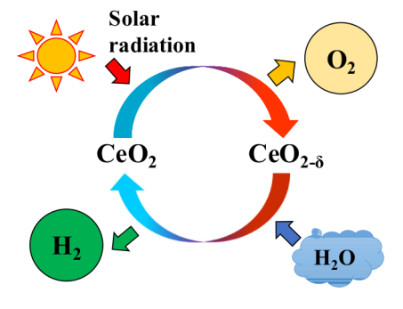
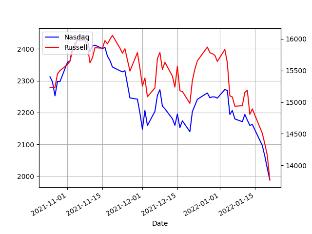
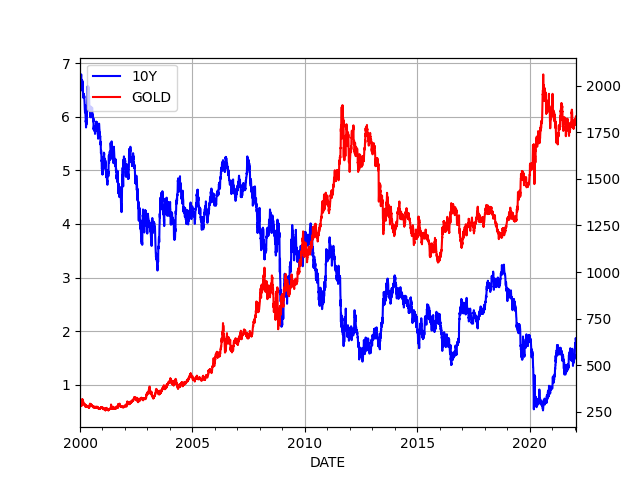

# Week 4 

---

H2 View: "Hydrogen Fuel Cell Bus Council established ahead of
widespread H2 rollout...  The new Hydrogen Fuel Cell Bus Council has
been launched at a time when investments into H2-powered public
transport are exploding"

---

H2 View: "ArcelorMittal invests $5m in H2Pro to support its disruptive
hydrogen production method from water. E-TAC water splitting offers
energy efficiency of over 95%, significantly higher than traditional
water electrolysis technologies"

---

H2 Fuel News: "Saudi Arabia sets sights on hydrogen fuel cells and
sustainable fuels.. The announcement regarding the contracts was made
by Saudi Arabia’s energy ministry. The contracts are for the
development of carbon-free projects such as hydrogen fuel cells for
transportation, and sustainable jet fuel production. They are meant to
help the largest crude exporter in the world to shift its leadership
into 'all areas of energy, as it has been in the oil industry for over
80 years,' explained energy minister..  in an official statement
following the signing ceremony which took place in Riyadh"

---

SolarPaces: "[T]he developer and builder of the 22.5 GW Three Gorges
Dam in China – will develop three of China’s planned new 100 MW
Concentrated Solar Power (CSP) tower projects, two in China’s sunny
Qinghai province"

---

TR [solar map](../../../tr/2022/01/solar-map.html). CSP info included. CSP ->
green H2. Surely the EU would be a willing customer.

---

OO was seen as a way to be more "scientific" about IT software. The
approach did not save projects which typically went over-time and
over-budget at a rate of 1/2. They still do. For bigger projects the
failure rate is even higher, a whopping 4/5.

---

For Valley, IT programmers the particle, and their interactions,
simulation viewpoint was comfortable.. Their bean counting is done
discretely, item-by-item basis, which makes sense you are automating
an office work, keeping lists, checking them off...  The so-called
object-orientation took hold in the industry possibly for this reason.
Interesting its widely used language C++ was based on an older
language called Simula, the first OO language, literally built for
simulations.

With OO the idea was coders would create "Customer objects" which
interacted with "Order objects", so the entire system would be seen as
a "simulation" btw these little particles..

---

NDTV: "Denmark is set to become the first European Union country to
lift domestic curbs despite the Omicron wave sweeping the continent..

Denmark will remove virtually all Covid restrictions from next Tuesday
despite record infections, counting on a high vaccination rate to cope
with the milder Omicron variant, the government said...

The successful vaccine programme proved a 'super-weapon', [PM]
said. 'It has given us a solid defence against infection that
continues.. That's why the government decided that coronavirus should
no longer be considered a threatening disease for society.'

Faced with a lower level of hospitalisations than in previous waves,
several European countries, including France, Ireland and the United
Kingdom, have announced the lifting or a considerable reduction of
their restrictions, despite record or very high cases"

---

"@stevenstrogatz

A little piece I wrote for @QuantaMagazine -- hope you enjoy it! It
starts with a famous puzzle posed to Johnny von Neumann about two
bicycles and a fly"

[[-]](https://twitter.com/stevenstrogatz/status/1485626030983458821)

---

God does not need math, He has an obscene amount of computation power
embedded in nature. Mathematics is our invention, a tool that was
created to address our shortcomings.

"Does the running of Nature, The Grand Simulation, or the current
order of things require mathematics, in the background?"

---

CIA likely stirred shit up leading to pro-Russian Yanukovich's ouster,
but left to its own devices democracy long-term would have balanced
things out.. A major voter base for Yanukovich was the RU speaking
parts of Ukraine, so the next guy would have to pander to them, and
indirectly to Russia for votes. Those regions are now gone. If UKR at
least tried to balance RU against the West before, they'll never do
that now.

---

Language is not a good indicator for cultural similarity; Asia Minor
speaks Turkish but it is not Turkic.  US and UK speak English but are
different. Ukranians are culturally similar to Russians.

"Can Russians understand Ukrainian?.. No, despite all the claims that
Russians and Ukrainians are Slavic brothers, Russians won't understand
Ukrainian"

---

*The Pilot*, RU WWII movie; fine trailer.

---

<iframe width="340" src="https://www.youtube.com/embed/z7B-RdSXxdc" title="YouTube video player" frameborder="0" allow="accelerometer; autoplay; clipboard-write; encrypted-media; gyroscope; picture-in-picture" allowfullscreen></iframe>

---

"Federal Reserve points to interest rate hike coming in March"

---

Sadly "AI" could not do that today. Data has to be curated, by real
people.

---

They cld make money from such a service; For every major event,
sharing up-to-date geolocated, structured data.. What happened, where,
to whom? People would curate it in the background, and more frequent,
special access could pay for the service costs..

---

Military activity data shared by API (simple URL, JSON output) through
journos would be great..  Liveuamap has paywall. Just types of attack,
hardware used, estimated damage, and numbers involved. I'll take fries
with that.

---

When did Kiev become Kyiv? So it's now Chicken Kyiv, not Chicken Kiev?

---

"Another batch of US defensive security assistance, including around
300 Javelins and ammunition, just arrived in Kyiv, Ukraine"

---

Tax and.. stop outsourcing, strengthen unions to get higher wages and
higher interest rates so speculators are discouraged do go after
bizarre stocks, the housing market inflating prices there. IOW: a
systemic fix.

---

Still good.. Pre-pandemic too

"Stop talking about philantrophy, start talking about taxes"

\#bergman \#davos2019

[[-]](https://youtu.be/r5LtFnmPruU)

---

H2 Fuel News: "GM announced that it would be expanding its fuel cell
strategy beyond vehicles"

---

H2 View: "212 hydrogen fuel cell buses to serve at the 2022 Winter
Olympics.. With the 2022 Winter Olympics heading to Beijing, China,
hydrogen will play a significant role in ensuring a smooth operation
of the event in addition to reducing its carbon emissions"

---

H2 View: "A new memorandum of understanding (MoU) revealed ..  Hexagon
Energy Materials [to] collaborate within FRV Services Australia to
develop a clean hydrogen hub at Middle Arm, Northern Territory in
Australia"

---

Afaik such blending requires no change in pipeline infra; There is
work to generate the green H2, other than that, blending is a freebie.

---

H2 View: "20% hydrogen gas grid blending could enable 70.86GW of production,
says new European Commission report"

---

SolarPaces: "China has announced plans to start – and complete – 11
CSP projects with thermal energy storage by 2024. The selected
projects, with backing by some of China’s biggest energy giants, must
now race to meet this very tight two-year deadline"

---

CNBC: "$130 billion wiped off crypto markets in 24 hours as bitcoin,
ether drop to multi-month lows"

---

Story about sniper fire in Niu-York, Ukraine.. If true, sad.

There are decisions and there are decision, u know.. UKR President has
to decide 'not to shoot back' possibly causing casualties on his
side.. You dont want that job.

[[-]](https://www.buzzfeednews.com/article/christopherm51/ukraine-russia-snipers-invasion-trenches-soldiers)

---

"EU to weigh €1 billion aid package for Ukraine"

---

"Canada sending Ukraine a $120-million loan"

---

"Investors have poured some $2 billion into cultured meat start-ups in
the last two years, according to Crunchbase data"

---

"Pakistan says only fully vaccinated people will be allowed in mosques."

---

Haha *Fringe* episode has one character call an evil woman's agenda as
'vagenda'. 

---

Iranian dish... looks good

[[-]](https://twitter.com/KostasPenn/status/1485318020843118593)

---

[Grenada](../../2021/10/all-too-human.html#grenada)

---

After the fall of the Berlin Wall this was the state the Dems were in;
lost in the woods, with a major chip on their shoulder, in a "copy
Reps or die" attitude.

---

"The .. Act was supposed to open the market to more and new radio
station ownership; instead, it created an opportunity for a media
monopoly"

---

Again, Bill Clinton's fault. See the [1996 Telecomm Act](https://en.wikipedia.org/wiki/Telecommunications_Act_of_1996).

"How about that Sinclair Broadcast, anchors repeating the same thing,
conservatives are such automatons"

[[-]](https://youtu.be/rknON89H35o?t=9)

---

From the book *The Meat Racket*: "GIPSA [is] the antitrust regulator
that was created before the Great Depression specifically to regulate
U.S. meat companies...  gained its authority over meat companies from
a law called the Packers and Stockyards Act, which was passed in 1921.
The act was passed with the goal of breaking up the 'meat trust,' a
collection of five companies that controlled about 85 percent of the
market (a lesser degree of concentration than existed in 2000).

By 2005, GIPSA seemed to have drawn into a shell of
nonenforcement. The reasons were partly due to the reorganization
overseen by James Baker, the Stetson-wearing GIPSA chief who ran the
agency during the Clinton era.  Baker’s prime initiative as the
antitrust regulator was to reshape the agency in the image of the
highly concentrated meat industry that it oversaw"

---

It's Bill Clinton's fault

"In the US, meat processing is in the hands of a few corporations. For
beef, it is JBS, Tyson, Cargill and Marfrig that together control 85
percent of the market"

---

"High Meat Prices Are Helping Fuel Inflation"

---

"Arizona Democratic Party censures Sinema over voting rights
stance.. Top donors have threatened to stop funding the senator if she
didn’t reevaluate her opposition to a filibuster carve-out"

---

It is deliberative because of the six year term. The system pays you,
Mr Senator, for six years so u feel less of a pressure the House deals
with, and ponder some stuff, not to make the entire system grind to a
halt.

"But the Senate is a 'deliberative body' the filibuster is a big part of that"

---

H2 Fuel News: "California pours $2 billion into renewable hydrogen and
offshore wind California Governor Gavin Newsom has announced that
there is 'no one more committed' to supporting clean energy
production use and storage as massive investments are aimed at
renewable hydrogen and offshore wind energy"

---

H2 Fuel News: "Oman and BP sign renewable hydrogen partnership on
mega-gigawatt scale"

---

H2 Fuel News: "Ship liquefied hydrogen fuel tank development moves
forward in South Korea"

---

H2 View: "Canada, UAE team-up on hydrogen to achieve carbon neutrality"

---

Fossil fuel transportation.. a no-no. 

F24: "[In Peru] beaches [are] tarred by 6,000 barrels of oil that
spilled from a tanker ship unloading at a refinery last Saturday. That
accident followed the stunningly powerful eruption of an undersea
volcano near the nation of Tonga, unleashing tsunami waves around the
Pacific"

---

Batteries dont work if it's too cold. PV panels dont work if it's too
hot.  Electricity grid for power transmission is 1/10th efficient,
with 8 times the cost compared to gas. What a joke

"Down here in Southern California, the worst of the heat wave is
behind us [22/6/2017]... With all that sun, you'd think all of those
solar panels out there would be lapping it up. But it turns out, they
don't work that well when it gets really hot"

[[-]](https://archive.kpcc.org/programs/take-two/2017/06/22/57530/with-all-this-heat-how-are-solar-panels-faring/)

---

Nathan Lewis from Caltech is working on artificial photosynthesis, similar to
prev solution, also going to H2 direct.

---

The research below is about H2 generation using basic chemistry - mere
sunlight, water and a catalyst. No electricity needed. More research
in this direction would be good. Shared [another post](https://helioscsp.com/synlight-concentrated-solar-power-to-produce-h2/)
in the same vicinity before.

---

"Due to the inexhaustible magnitude and usability of solar energy, the
solar-driven two-step water-splitting thermochemical cycle is
generally considered a solution for hydrogen production from
water.. Recently, CeO2 (cerium oxide) had received considerable
attention as a potential reactive metal oxide"

[[-]](https://www.researchgate.net/publication/355566991_Development_of_Synthesis_and_Fabrication_Process_for_Mn-CeO2_Foam_via_Two-Step_Water-Splitting_Cycle_Hydrogen_Production)

---

"[TR's] renewable energy potential, supported by policies..  may
enable 3.4 million tonnes of green hydrogen production nationwide by
2050.. [2020 reference energy supply is, in TWH] Solar 11.26, Wind
24.7, Hydro 78.1" (also see [translation](https://shura.org.tr/turkiyenin-yesil-hidrojen-uretim-ve-ihracat-potansiyelinin-teknik-ve-ekonomik-acidan-degerlendirilmesi/))

[[-]](https://shura.org.tr/en/techno-economic-study-of-turkeys-production-and-export-potential-for-green-hydrogen/)

---

♪♬ It's going down down down down ♪♬ 

---

Sean Shamrock.. working the backchannel.. but didn't work. You're fired.

"In the aftermath of the deadly attack on the US Capitol last year,
the rightwing Fox News host Sean Hannity pleaded with a top aide to
Donald Trump that there should be 'no more stolen election talk' and
'no more crazy people' should be admitted to the president’s orbit"

---

Pronounced like 'oiler' not yoooouuu-ler

---

Crazy smart guy. Funky hat too.

"@docmilanfar

Euler went blind in 1771 at age 64. He published roughly 1 paper per
week in 1775.

After he had died in 1783, Euler published 228 papers. 

~1/3 of all published research on mathematics, mathematical physics &
engineering mechanics in the latter part of the 18th century is his"

---

Uecker is pronounced you-kar, uygur is pronounced you-ger and
sometimes wee-ger. Weird

---

KJ was in some big productions, was in one Transformers movie, the ok
one, with Nimoy, Malkovich

---

*Operation Rainfall* w Ken Jeong, the Boba Fett guy and Jason Isaac
playing a random alien.. Strange movie.. Some great spaceship scenes
but meh character development.

---

There is still a narrative of helplessness around Russians.. After
they mobilized 100k troops on the border some say 'they painted
themselves into a corner'.. 'Those poor people'...

---

"Germany Bars NATO Ally From Transferring Weapons to Ukraine"

---

Computation split into two cultures since its inception; one is
scientific computation (discretizing formulas), the other business
coding, w databases, "UI". The two cultures gathered around their own
computer languages, Fortran for sci, Cobol for biz. These are two
different ways of thinking about computation.. Silicon Valley is full
of the latter type - the business brogrammers. They pretty much have
zero understanding of science and how it is conducted. So it behooves
all tech watchers to pay attention to that difference as the typical
tech CEO is sci ignorant, bereft of any understanding on what makes it
tick.

---

Can partly be blamed on the mindshare influenced by Silicon Valley
'coders' who are really digital bean counters.. They believe they can
fix all by 'knocking out some code', or now a "neural net".

---

This weirdness is still making rounds in the media \#science

[[-]](https://mobile.twitter.com/docmilanfar/status/1484701362420027394)

---

Chevron lawyer as a federal judge? Somebody clearly did their due diligence 🤨

---

RIP

---

He would do anything for love but nothing to stay alive.. 

"Meat Loaf reportedly 'an anti-vaxxer' before death"

---

That makes sense gold has no intrinsic value, brings no interest, pays
no dividends. In a potentially rising interest rate environment people
will sell it. Recently price went down, it will go lower as rates
rise.

RT/Russia is working the anti-dollar angle bcz they dont like the
dollar hegemony. There isn't enough gold to form the backbone of an
intl system. Let's not goad people into stupid investments.

---

RT anchor talks about gold being a hedge against rising
inflation. There is a reverse relation between the 10-year treasury
(rates) and gold price. Gold has gone lower from its 2020 highs, not
higher.

---

"Nearly all Covid restrictions to be lifted in Ireland from tomorrow [22/1]"

---

Unarmed non-white people shot by the police. Used WaPo
[data](https://github.com/washingtonpost/data-police-shootings). 2021
was the least of the 6 years. Still 20 too many..

[[-]](../../2023/01/us-crime.html#unarmed)

---

