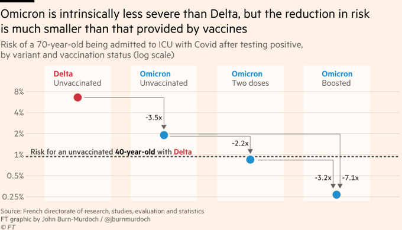
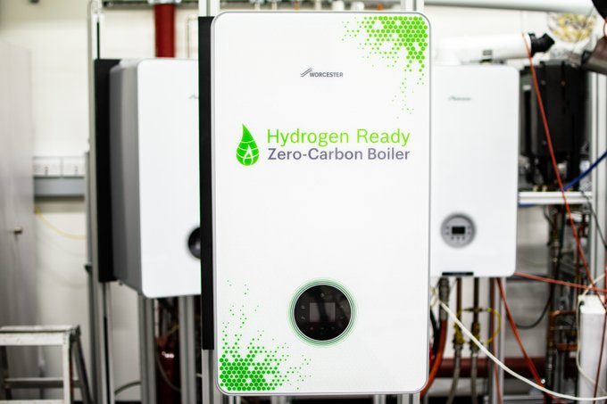

# Week 5 

---

<blockquote class="twitter-tweet">
The Port of Louisiana, <a href="https://twitter.com/hashtag/US?src=hash&amp;ref_src=twsrc%5Etfw">#US</a>, will gain a new <a href="https://twitter.com/hashtag/hydrogen?src=hash&amp;ref_src=twsrc%5Etfw">#hydrogen</a> and <a href="https://twitter.com/hashtag/ammonia?src=hash&amp;ref_src=twsrc%5Etfw">#ammonia</a> production facility, revealed today (Jan 31) as a means to provide zero-carbon fuel for the shipping industry and energy transfer.<a href="https://twitter.com/hashtag/HydrogenNow?src=hash&amp;ref_src=twsrc%5Etfw">#HydrogenNow</a> <a href="https://twitter.com/hashtag/H2View?src=hash&amp;ref_src=twsrc%5Etfw">#H2View</a><a href="https://t.co/GwYwa3mSpB">https://t.co/GwYwa3mSpB</a>
&mdash; H2 View (@h2_view) <a href="https://twitter.com/h2_view/status/1488171610137894913?ref_src=twsrc%5Etfw">January 31, 2022</a></blockquote> 

---

H2 View: "Scitem portable hydrogen-powered generator to hit Japanese
market.. The unit looks somewhat like a briefcase and allows users to
source power from replaceable H2 cannisters"

---

H2 View: "Aviation H2 opens to investors to support development of
hydrogen-fuelled aeroplanes and enter the market in the next 18 months"

---

Vessel has 1,250 m3 capacity carries gas cooled to -253°C and
liquefied to less than 800 times its gaseous volume.

For the H2 production dirty fuel (coal) was turned into clean fuel,
the transportation is 100% clean. A historic day indeed.

H2 View: "In what has been described as a historic day for Japan,
Australia and the global energy industry, the world’s first liquid
hydrogen carrier last week left the Port of Victoria and started its
journey to Kobe, Japan...

Designed by Kawasaki Heavy Industries, the carrier will safely
transport large quantities of liquid hydrogen produced in Australia
from Latrobe Valley coal and biomass via gasification"

---

H2 View: "Hydrogen refuelling network to be developed in the US by
Daimler Truck, NextEra, LLC, and BlackRock"

---

Oo-o-o-o-o-o - interest piqued

H2 View: "Hydrogen is being explored for sustainable carbon neutral
food production... Nel Hydrogen US.. said it has received orders for
multiple PEM electrolysers for such production.

The company looking to cut food production emissions with hydrogen has
not been disclosed, however, Nel said the order came from a leader in
the commercialisation of sustainable protein technology"

---

IEA: ""Globally, 142 bcm of natural gas was flared in 2020 – roughly
equivalent to the natural gas demand of Central and South
America. This resulted in around 265 Mt CO2, nearly 8 Mt of methane
(240 Mt CO2-eq) and black soot and other GHGs being directly emitted
into the atmosphere. Five countries (Russia, Iraq, Iran, the United
States and Algeria) accounted for more than half of all volumes flared
globally in 2020"

[[-]](https://www.iea.org/fuels-and-technologies/gas)

---

EU natgas also, three times the average

[[-]](../../2021/01/stats.html#eunatgas)

---

Coal price still high

[[-]](../../2021/01/stats.html#coal)

---

Around 2008 gasoline price was much higher, but inflation never went
above 6.0.

---

I see no reason for picking fights with fossil folk.  As long as there
is no fracking, (natgas) flaring to generate the stuff, and they are
not preferred over the green option, fossil-to-H2 is fine, great even,
it will generate plenty revenue for them as it does generate plenty of
energy for the consumers.

---

No country who is able to do CSP / solar, should go for nuclear. Especially
in the EU.

Nuke power is in the "tolerable" category for me, not "will support
with a glee".

---

"@AmbassadorTai

Eradicating forced labor is a moral and economic imperative. I am
proud to announce USTR will develop its first-ever focused trade
strategy to combat forced labor"

[[-]](https://twitter.com/AmbassadorTai/status/1486119110442377216)

---

It wouldn't make sense for Tories to drop Johnson before the next
election. BJ leaving would cap a period with two PMs gone previously
having been destroyed by Brexit, a third would say 'chaos'.

---

"Portugal’s ruling centre-left Socialists won an outright parliamentary
majority in Sunday’s snap general election"

---

So talks abt self-sufficiency, that line of reasoning probably doesnt
jive with the Krauts. They want the dependency, be enmeshed in
them. For energy they'd go to Russia, to Africa, whatever, they'll
find it, and trade it, create relations over it.

---

Some say post-WWII German intl relations *wants* to create
dependencies with other countries. Bcz of the experience of the war,
how its internal politics led to that, the country (its gov strata)
feels safer to be bound in a web of relationships, the EU being the
mother of them all. Germany loovees being in the EU. Interesting
angle.

---

At least one ATW per tank.. UK not fooling around..

"UK sends 2,000 anti-tank weapons to Ukraine"

---

Forbes: "Russia has staged around 1,200 tanks for a possible invasion
of Ukraine. That’s roughly 300 more tanks than the Ukrainian army"

---

"@M_B_Petersen

Today, Denmark lifted *all* restrictions, while cases are soaring.

The international reaction: Disbelief...

[V]irtually all infections in Denmark are now omicron. The combination
of omicron and high booster coverage decouples infection and
severity. While there are high case counts, the pressure on hospitals
is lower than in previous waves"

---

Trump did talk about low rates. He is a supply-sider basically. As a
businessman he likes cheap money, plus an obscene demand for
real-estate wouldn't hurt either, an indirect side-effect of ultra low
rates. But his company didn't see the 2008 subprime crisis coming
(they were about to go into the mortgate business right before it
happened), have to state that. At the very least we need the other
side of that trade, some ppl has to be for higher rates so the average
is saner.

---

[Link](https://www.dropbox.com/scl/fi/58c5ail9mvbe0am8r8prf/spaz2.gif?rlkey=n68ilxxdrq8frd08hqcifoitm&raw=1)

---

Taylor Rule as in the economist John Taylor who Trump briefly
considered as a FED chief.

JT apparently [scared the market](https://www.cnbc.com/2017/10/27/possible-trump-fed-chair-nominee-john-taylor-scares-the-market.html)
at the time, he would of course.. C'mon, following a formula, raise
when it says so? We can't have that! FOMO monkeys would lose their mind..
They like their parteh, dont want anyone to take the punch away..

JT wld have likely raised in 2018. Powell did too of course, and we
all saw what happened, FOMO had their worst nightmare come alive, they
had a collective epileptic seizure.

---

I ran the code again, it gives a fedfunds around 5.0 for today.

---

Reshare from 2016

There is the so-called Taylor Rule that calculates an optimal level
for the FED funds rate The
formula is,

$$
FF_t = r^\ast + \pi_t + 0.5(\pi_t - \pi^\ast ) + 0.5 Gap_t
$$

which is a simple relationship between inflation, an ideal rate, and
GDP. Ideal rate $r^\ast$ is assumed to be 2.0, $\pi_t$ is current
inflation, $\pi^\ast$ is target inflation, $Gap_t$ is the difference
between real and potential GDP.

[Result](../../2021/01/stats.html#taylor)

The graphs are somewhat close, but they diverge at certain points. For
example during the 80s (Volcker years) the FF rate was much higher
than necessary. In the early 2000s, Taylor Rule prescribes higher
rate, but FF was much lower. Lower-than-necessary rates was one of the
main causes of the subprime crisis, as everyone knows. 2009 is weird,
here Taylor Rule says "go negative" - and this is precisely the time
when "unconventional monetary programs" were started such as QE.

---

This is the huge mistake of goldcucks, Bitcoiners. Their system isn't
just utopic, its econ basis is crooked. It's basically spurred by
bunch of rich people who do not want to see their pile of money
"debased" wout thinking of the side effects.

---

Yes bank credit is printed money, brought into existence out of thin
air.. Just type bunch of numbers on a computer, boom. New money. There
is good reason for creating money and not simply lending out savings;
If only savings were lent out, growth + same money base = deflation.

---

Guy builds a shoddy house, and expects cheap energy to heat that
house, then votes reps out who don't provide him that 'way of
life'. That demand has repercussions down the line. Gov now needs to
secure that (excess) energy, deploy military to secure its transport,
deploy overseas shadowy intel apparatus to stir shit up to keep local
actors out of balance to make sure raw crude keeps flowing.. Or cld
the f-ing guy just insulate his house w gov nudging him in that
direction somewhat?

---

If a building is poorly insulated, should government be able to tax it
out of existence?

Personal property.. But a house is not just a house..

---

Insulation; there it is again.

Euronews: "The eat or heat dilemma... More than 35 million Europeans
are unable to afford to keep their homes warm this winter..  having to
decide between heating and putting food on the table.. The two root
causes of fuel or energy poverty are low incomes and living in
buildings with low energy efficiency..

The price of energy is a significant proportion of the cost of living
in Bulgaria, especially for the poorest households. In 2018, it
represented around 16 percent of expenditure, while in Sweden average
energy costs were around 4 percent.. Energy poverty is worst in the
south of Europe..  If Sweden is doing fine now, it's ..  because of 30
years of Swedish investment in renovating houses, in developing
renewable heating systems" via @ThPellerin

[[-]](https://www.euronews.com/next/2022/01/26/turning-up-the-heat-on-europe-s-energy-poverty-crisis)

---

CNN: "Serbia pulls plug on Rio Tinto's $2.4 billion lithium
project.. Shares in Rio Tinto tumbled on Friday after Serbia revoked
its lithium exploration licenses over environmental concerns"

---

Good 4 you Serbia

BBC: "Serbia revokes Rio Tinto lithium mine permits following protests"

---

But if there is too much credit out there, then the economy "stars to
heat up", can be inflationary.

---

Bank credit does not come from bank customers' savings, they are
printed money, so money base expands. The system works because even
though the money base grows (through credit), the economy *grows into
that* base (credit was used to invest, hire ppl etc); more products,
services are circulating, but more money does not chase after the same
amount of goods, it chases after more amt of goods - no inflation.

---

Because businesses work on credit, and credit is always newly printed
money, so when businesses hand out salaries they are handing out that
new money. That could result in inflation.

"If printing money and handing it to people creates inflation why do
wage increases cause inflation?"

---

World / Opec oil production is down for sure.

[[-]](../../2021/01/stats.html#opec)

---

Gas prices were high during W, even higher than now.. Interesting, the
uptrend seems to have started at around 2003 -- after the invasion of
Iraq? Major uptick again post Libya 2011.

[[-]](../../0119/2019/2021/01.html#gasoline)

---

2014 governor? Jerry Brown. [A centrist](https://www.kvcrnews.org/state-politics/2017-06-15/interview-centrist-jerry-brown-critiques-calif-democratic-partys-move-to-the-left)

---

A love for privatization, going ga-ga for biz cld have doomed
California's high-speed train project. States offload too much onto
the private sector, they are not retaining the key skills in their own
bureucracies who can plan, manage? 2014, CA outsources to a company
called Dragados, 'cost reduction' ended up costing *more*. How did
that slip by the officials?

---

[Link](https://youtu.be/242H7F8DKHA)

---

Just when he thought he was out, they pulled him back in 😂

"The Italian Parliament asked Sergio Mattarella on Saturday to carry on
as president for a second term after failing to find a compromise
candidate"

---

🤦‍♂️ And they use this water to serve a repulsive product, sugar water,
patently bad for health.

"Coca-Cola has been accused of dehydrating communities in its pursuit
of water resources to feed its own plants"

---

Politico: "In 2021, the SEC went after crypto. In 2022, crypto is
coming for the SEC... Cryptocurrency payments firm Ripple has started
to rack up procedural court victories as it fends off the SEC in a
case that could redefine how the agency polices digital assets"

---

Org has to make clear it will not "spread" democracy in underhanded
ways. No disruption of internal affairs of others. 

---

Sure Russia wld be in, but with a low score. 

---

What benefits are we talking about? Lots and lots of money..  And
transfer of know-how. The treasure chest needs to be so large as to be
mouth-watering... Once in, members are ranked on their democratic
status annually , money inflow gets adjusted to the cent depending on
the score (an average of independent agency results).. If org votes
collectively on stuff, even each country's vote is weighted based on
their dem score.

---

Ideafication time.. How about a new intl org that is not tasked with
spreading democracy proactively, but whose members happen to / has to
be democratic. Once countries join they get major benefits. NATO
served that purpose for Asia Minor, they were scared of USSR, a
requirement for joining to NATO was being a democracy, so country
started the change. Same for Greece too probably.. Both countries fell
in-and-out of dem at certain times, but insitutionally democracy in
some form remained.

---

One explanation could be US admin's emphasis on democracy scared
autocrats in partly democratic countries, worried US will come for
them at some point so they did their coups, "preemptive coups" if u
will, beforehand to cement their shit.. Talk of spreading democracy
caused less democracy? If admin did not talk about it, how could it
push for it?

---

NYT: "Five African Countries. Six Coups. Why Now? Burkina Faso this
week joined a list of countries that have recently experienced
military takeovers"

---

Found a dataset from Illinois Uni (below). Overall trend seems down
(does not contain recent data). 

[[-]](../../0119/2015/09/democracy-status.html#coups)

---

Coups seem to have increased in number 

---

Countries circling Mali, most part of an org called Ecowas, sanctioned
Mali bcz of coup (14/1), but then one of the Ecowas members had a coup
itself (23/1). That is hilarious.

---

This expert talking some sense; "Putin is .. not a gambler".

[[-]](https://twitter.com/Channel4News/status/1486450116454240259)

---

Life and death issue is still in culture war territory.. bizarre

The Independent: "Laura Ingraham interview with policeman fired for
opposing vaccine mandate resurfaces after he died of Covid"

---

H2 View: "Putin claims Russia can become one of the largest exporters
of hydrogen by 2035"

---

H2 View: "Hydrogen internal combustion engines to be integrated into
Werner trucks as part of new partnership with Cummins. A new
partnership between Werner Enterprises and Cummins will see the
integration of 15-litre hydrogen internal combustion engines into
vehicles, the companies revealed today"

---

H2 View: "The Winter Olympic Games 2022 in China will be powered using
green hydrogen as one of the 'world’s largest electrolysers' begins
generating green hydrogen in Zhangjiakou"

---

H2 View: "Norway to gain 24MW green hydrogen production project to
build ammonia value chain"

---

H2 Fuel News: "The Swedish power company [OKG] has signed its first
contract for H2 made with fossil fuel-free nuclear"

---

Lavo is a great company, their chief scientist is a true genius. Lavo
has close ties to academia.

H2 Fuel News: "Hydrogen storage systems company LAVO has received a [5
million AU dollars] ($3.4m) boost to start-up its prototyping, testing
and manufacturing facility as it aims to scale-up production.

The new capital was awarded by the New South Wales (NSW) Government,
through its Regional Job Creation Fund, with LAVO hoping to create 250
new jobs at the site

---

H2 View: "Green hydrogen companies are going public to the delight of
investors.. German conglomerate ThyssenKrupp is moving closer to
announcing an initial public offering (IPO) for Nucera"

---

H2 canisters: have a few canisters to power the house, others as
empties / backups, empty canisters could be refilled in the nearby H2
station. Just like driving to a grocery store, drive to gas station to
get your home some gas. This is massive energy let's not forget,
easily transportable, it's not like inferior tech Li-on
batteries. Once at home, take empty canister out, put the full one in.

Or a service will deliver full canisters, take old one.

Or nearby municipality will bring gas in form of pipeline. House cld
be built for both.

For appliances built-in fuel-cell generates electricity from H2.

---

Here I even picked the insulating material for ya

"VIPs or Vacuum Insulated Panels are specially designed panels that use
the insulation of a vacuum in a board shape"

---

Company idea: build H2-ready tiny houses. Ready for H2 pipeline, or
gas canisters (with an option to generate and store on site). Cld be a
profitable bidness.. TH can be shipped, exported right?

---

<iframe width="340" src="https://www.youtube.com/embed/-6gbXBLAdLM" title="YouTube video player" frameborder="0" allow="accelerometer; autoplay; clipboard-write; encrypted-media; gyroscope; picture-in-picture" allowfullscreen></iframe>

---

Hydrogen-ready boiler from [Worchester Bosch](https://www.worcester-bosch.co.uk/hydrogen).
Works on both natgas and green.

---

100% H2 transmission on existing natgas pipeline is possible, I
believe the main issue is the end-products; With 20% blending existing
boilers, ovens work as if they are still taking natgas. But if
end-products are ready for green gas, or for both nat and green, then
the switch to 100% could be e-z.

---

So many colors for H2 production. Green is from renewable, blue is
from fossil plus ccs, gray is from fossil without ccs, pink is from
nuclear. 

---

👍 🚗 🏍️ 🚙 🏎

"Jason Momoa may be joining Vin Diesel in the next Fast & Furious flick"

---

Ukraine is criticising the crisis talk of the West but criticising
Germany for not doing enough? 🤔

---

Klitschko the boxer is the mayor? Good experience... Next up, el
Presidente

---

Actually their hesitancy is understandable.. DE has lots of relations with RU.

Politico: "Berlin was ridiculed for sending 5,000 protective
helmets to Ukraine rather than weapons — prompting Kyiv Mayor Vitali
Klitschko to ask if the next delivery would be of pillows"

---

Politico: "[A previous DE Chancelor] Schröder — chairman of Nord
Stream, the Russian-owned, Swiss-based firm that owns pipelines
bringing Russian gas to Europe, and who is a long-time friend of
Vladimir Putin — went on to say he hoped “the saber-rattling from
Ukraine will stop"... Schröder was roundly mocked for his comments"

---

Unless of course there is a bus driver for a President as in fucking
Venezuella who is printing money and giving it to people creating
hyperinflation.

---

GDP growth YoY 5.5%. Still making up for pandemic related losses.

[[Data]](../../2021/01/stats.html#cycle)

Crazy wage growth (prev quarter) 4.6%

[[Data]](../../2021/01/stats.html#wages)

Wage growth could be contributing to inflation as well, which is, if
we go by the textbook, always the main source of inflation.

---

If China previously exported deflation to the rest of the world and
now they are supposedly being cut off from the world supply
chain.. what wld that do? Cause the reverse of deflation? There is
inflation in many countries right now..

---

\#dogs \#zoom

[[-]](https://twitter.com/docmilanfar/status/1486927687893487617)

---

Interesting.. One can feel full after a proper bulgur meal,
sure.. Must be due to those 9 aminos

"Bulgur is considered a complete protein providing all nine essential amino acids"

---

