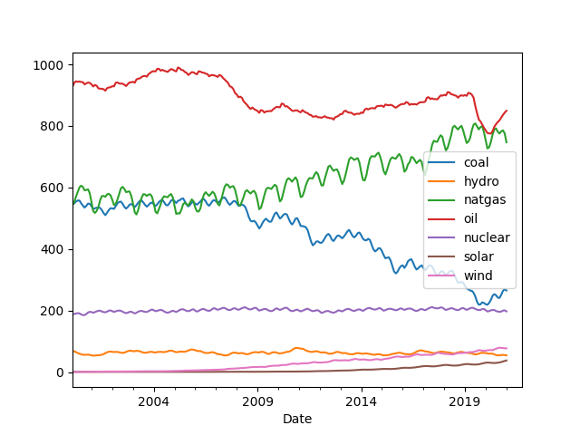
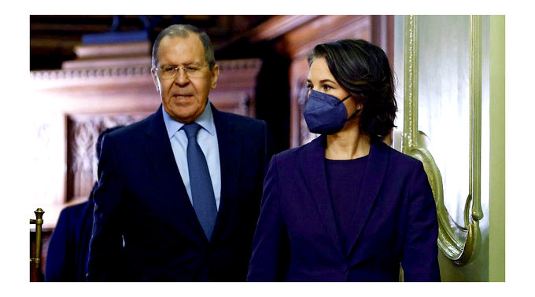

# Week 6 

---

H2 View "Mandan, Hidatsa and Arikara Nation [in US] to provide natural
gas for the Great Plains Hydrogen Hub in the US.. Based in North
Dakota, US, Bakken Energy and Mitsubishi Power Americas have joined
forces on a $2bn hub which will focus on blue hydrogen production
which is derived from natural gas with the carbon emissions being
capture and sequestered.. The duo said they hope to connect the
facility by pipeline to other hydrogen hubs currently being developed
throughout North America"

---

"@IEA_SolarPACES

Botswana aims to build a 200 MW Concentrated Solar Power Plant"

---

300000 x 1000 x33.6 / (365x24x1e6) gives 1.15 Gigawatts. Lot of energy,
equivalent to one nuclear plant.

"Suez Canal green hydrogen production... With news that Egypt will
gain a new 300,000 tonnes waste-to-hydrogen production plant, it is
clear hydrogen will become a major aspect of the nation’s renewable
future whilst also leveraging its export potential"

---

Energy imports *from* Japan? Desparate times 

"Japan to divert LNG to Europe amid Russia-Ukraine tensions"

---

Fusion, clean fuel pipeliens.. all about the hydrogen atom.

---

After, especially after, fusion becomes viable, H2 infrastructure be
essential to transport the power in efficient ways. 10 times faster
then the grid at 8th the cost.

---

Good progress. But beware, fusion energy did not 'arrive' yet

BBC: "The UK-based JET laboratory has smashed its own world record for
the amount of energy it can extract by squeezing together two forms of
hydrogen...  Fusion reactions in the lab famously consume more energy
to initiate than they can output... But there is solid evidence that
this deficit can be overcome.. It's hoped the French lab will get to
breakeven."

[[-]](https://www.bbc.co.uk/news/science-environment-60312633)

---

This is reserves not annual production. 

---

IRN, Number Two. RU, Number One. 

---

"Qatar.. ranking 3rd in the world, holds.. about 12% of the world's total natural gas reserves "

---

Few things jump out from the graph; coal consumption went down, natgas
took its place (just as polluting, if not more). Natgas is now on par
with oil but I'd say NG is now the king.

The oscillations for natgas indicates to me its consumption is much
more sensitive / responsive to demand, is depended on more, looks
seasonal so NG is probably the primary method for heating. NG is the
king to unseat. Or utilize, with blue H2, it's fine.

Nuclear use has been flat; if nuke plants were doubled it still
would not reach natgas levels.

Renewables are at an abysmal level. 

---

World Energy Consumption by Source, Monthly (twh)

[[-]](../../2021/01/stats.html#engconsumption)

---

"@garrygolden...

BEVs lithium supplies are clear disaster. Fuel cells cheaper per
kW, need fraction of it b/c Hydrogen gives range"

[[-]](https://twitter.com/garrygolden/status/1491766941106724865)

---

Star Wars inspired Netflix film in the works, *Rebel Moon* by Zack
Snyder.. Grand.

[[-]](https://twitter.com/Variety/status/1491520292673388552)

---

"CENTCOM commander confirms UAE successfully used THAAD"

---

Japanese real-estate bubble (1986-1990)? Look at the central bank
rates during that same period, they were at their lowest level they
had been since WWII. Ergo, bubble. Bubble burst but a stagnation
remained.. Abenomics gave more money to the rich, salaries did not
budge. No inflation. Low rates.

---

Big Swing Face - There Ain't Nobody Here But Us Chickens \#music

[[-]](https://youtu.be/6QIiNhfnB4c)

---

Autralia, Phillipines, NZ opening up

"More countries reopen to travelers, signaling a big shift in pandemic
thinking"

---

There are many [tricks](../../0119/2017/10/tax-avoidence-tricks.html)

"How does tax avoidance work?"

---

That could be ok depending on the social norms.. Excessive wealth
would be visible to see.

"But then anyone can see who owns what"

---

NFT is simply a record of ownership, it's intangible; but there is a
lot of intangible even in the most tangible asset there is -
[property](../../0119/2008/03/revolutionary-wealth-toffler.html#intangible).

Without the record of who owns what real-estate would have no meaning.
In some distant future such record-keeping could completely move to
peer-to-peer based service. If gov, or a future form of gov
decides to enforce that instead of the ones it keeps itself, then
peer-to-peer digital assets would become the final arbiter of
ownership.

---

Globalization (now re-globalization) happened [before](../../0119/2008/03/revolutionary-wealth-toffler.html#globalization)
(didn't end well).

---

Diversity of products a country can produce raises its econ, not how much it is globalized.

---

The theory of [economic complexity](../../0119/2017/08/economic-complexity-hidalgo.html#global)
says otherwise.

"Globalization will always work, division of labor idea of Adam Smith says so"

---

They likely stockpiled it for fear of getting cut off the financial
markets, not to replace the money system.

"China and Russia have been stockpiling gold for years - this might be
a sign gold can become the new currency"

---

<blockquote class="twitter-tweet">
We&#39;ve just announced that Heliogen has been awarded the exclusive right to lease land in the Brenda Solar Energy Zone (SEZ) where we intend to develop a green hydrogen facility capable of producing approximately 20,000 metric tonnes of hydrogen per year.<a href="https://t.co/HbhbNKomv9">https://t.co/HbhbNKomv9</a> <a href="https://t.co/nZAXwO3gmB">pic.twitter.com/nZAXwO3gmB</a>
&mdash; Heliogen (@heliogeninc) <a href="https://twitter.com/heliogeninc/status/1491098387004809218?ref_src=twsrc%5Etfw">February 8, 2022</a></blockquote> 

---

H2 Fuel News: "Hyperion to build $297 million fuel cell manufacturing hub in Ohio"

---

H2 View: "300MW electrolyser set to be coupled for hydrogen production
in Denmark as HySynergy project begins phase II"

---

That is nearly maximum DNI given the Earth average.

SolarPaces: "Talk of a Namibian Concentrated Solar Power (CSP) project
[..is] moving forward... [The] region [has] some of highest Direct
Normal Irradiation (DNI) in the world... NamPower is creating a fully
permitted de-risked site that’s in an area they have been assessing
for its outstanding solar resource west of Windhoek.. has DNI over
3,000 kWh/m2 annually"

---

H2 View: "Lotte Chemical is reportedly set to invest 4.4 trillion won
($3.7bn) in the hydrogen ecosystem to bolster not only Korean
decarbonisation but also around the world"

---

H2 View: "Fukuoka City, Japan has unveiled major hydrogen society
plans as part of a new deal inked.. with Toyota Motor Corporation"

---

H2 View: "Cummins to purchase rights in Westport Fuel Systems joint
venture and bolster hydrogen capabilities"

---

What is the current RU natgas export (to EU) shortfall? 20%? Lower?

From UK we know blending 20% H2 into existing natural gas pipeline
works. If the tech were ready that would fix gas shortfall. Blending
wld automatically increase supply. For gaps <20% blend 20%, done. No
change in infra needed.

Additional H2 needs to be generated for blending yes, not available
yet -- the crisis arrived too early.

---

"Russia continues to supply around 40% of EU gas consumption"

[[-]](https://www.bruegel.org/2022/01/can-europe-survive-painlessly-without-russian-gas/)

---

\#Repeat countries can receive huge ship traffic. 837 crude oil
tankers arrived at Japanese ports in year 2010
[[pdf](https://iea.blob.core.windows.net/assets/00cf6755-2976-4cd8-be5d-1c27b13d7df3/2013_OSS_Japan.pdf)],
translating into 2-3 ships arriving every day.

---

Not that China is a superpower or anything.. But it is at a level of
France, which is in G7.

---

Post WWII setup is weird.. Germany is not included in the UNSC. China
is not included in G7.

---

Would any authoritarian gov change the ending of M4? Why bother..? The
ending is for weak-ass Holywood shitlibs, they are just flying around
enjoying their airheaded 'inclusion'. Harmless.

---

The Matrix 4 ending was weak, scared, abysmal. *Fight Club* got it
right.. That was one courageous, fantastic movie, from start to
finish.

NYT: ‘Fight Club’ Ending Is Restored in China After Censorship
Outcry.. Last month, viewers noticed that the ending of the 1999 film
had been replaced with a pro-government message. Now the ending is
back, and the message is gone.

---

AFP: "Plastic has infiltrated all parts of the ocean and is now found
'in the smallest plankton up to the largest whale', wildlife group WWF
says"

---

I hope they do. Such simpleton, trinket products... Simple IT.

"Meta says it may shut down Facebook and Instagram in Europe over data-sharing dispute"

---

"US approves $100m deal for Taiwan to upgrade Patriot missile system"

---

"Senegal is one of Africa's most stable electoral democracies"

---

CNN: "Senegal beats Egypt to win Africa Cup of Nations trophy"

---

[Link](https://drive.google.com/uc?export=view&id=169fSsDA6hLxPGGG3-8XbyeR9eRFrZvUO)

---

Stronger unions provide better institutional muscle to the left. Can't
have bunch of random people running around jumping up and down
'protesting', dancing on TikTok and hope there'll be a
change. Organization, leadership is needed.

[[-]](../../0119/2019/08/focus-group-democracy.html)

---

Catchy title.. competition, good.

---

😂 😂 😂 

Politico: "Biden wants more U.S. students to become butchers"

---

Warning against the military-industrial complex: Eisenhower - GOP.

---

Anti-trust isn't just for better capitalism. Need to adjust the power
dynamic between gov and biz. Reagan was a conservative, but he had to
be cognizant of the fact that in order to govern, need to keep
monopoly power at bay.

---

Would expect Dems to be more hawkish on anti-trust, but no..  After RR
not only did they let existing monopolies fester, they gave rise to
new ones. So called libertarians either watched the whole thing like a
gaping fish, or generated some junk culture war material for Reps to
use while weaseling their way in, to give billionaire cover.

---

Anti-trust could be a Republican thing.. cons are pro-business,
especially for **small** business they cld go there.. Ronald Reagan
broke up AT&T.

---

H2 Fuel News: "Hyosung to pour $835 million into green hydrogen
production in Korea"

---

H2 Fuel News: "The UK’s Ineos chemical company has signed hydrogen fuel
cell deal with Hyundai. The goal is to use the system to eventually
power the British firm’s new Grenadier off-road vehicles"

---

Belgium has easy shipping access. Tasmania has sunshine, other natural
resources (hydro). Generate H2 and ship.

H2 View: "The Tasmanian Government [an island state of Australia] has
today inked its first state-to-state agreement on green hydrogen with
the region of Flanders, in Northern Belgium."

---

H2 View: "Orlen Group [a Polish state oil refiner, retailer] makes
$1.8bn hydrogen commitment. By the end of the decade, PKN Orlen want
to..  build a total of ten hydrogen hubs and launch 100 public
hydrogen stations"

---

The Atlantic: "Vaccination rates are high on mainland China, about 88
percent, but mRNA vaccines are not available. The German firm BioNTech
has been waiting months for approval to enter the Chinese
market.. China has not developed its own mRNA jab [.. uses]
Chinese-developed Sinopharm and Sinovac shots. These 'inactivated
virus' vaccines have proved to be less effective at stopping COVID
deaths"

---

The Atlantic: "Hong Kong.. pursues a zero-COVID strategy. Flight bans
have caused air traffic to plummet. On January 31, just 100 passengers
arrived at Hong Kong International Airport, previously one of the
world’s busiest travel hub..

Authorities culled thousands of hamsters after an infection was traced
to a local pet shop. Carrie Lam, the city’s chief executive, lashed
out at a hamster owner who didn’t turn over his pet, saying it had
caused an outbreak. The maligned rodent, however, tested negative for
the virus, clearing its name"

---

TDB: "When writer and filmmaker Rupert Russell sat down to write his
book *Price Wars*, which covers how price volatility is the root of
global chaos, he didn't expect Alan Greenspan, the longtime former
Federal Reserve chairman, to be a 'villain' in the story. But in this
bonus episode of The New Abnormal, Russell explains how a move by
Greenspan to deregulate the commodity markets in 1998 has caused
decades of market trouble"

---

Libertarianism is corrupted in US.. A coopted version is used to
provide cover for billionaires while they push for pro-freedom-sounding
ideas, at the same time they generate culture war material to make
themselves useful among the equally corrupt, retarded right-wing
Republicans. All those merry band of cocksuckers around Peter Thiel do
nothing but that.. The German version of a libertarian will fight
an abortion rule created by *actual Nazis*, US faux-libertarians will
stand silent on the issue to weasel their way in to Rep circles then once
inside push for [anti-green agenda](../../2022/01/faux-contrarians-faux-liberterians.html).
These are truly some wretched cocksuckers.

---

Politico: "California's single-payer bill.. gained little traction as
moderates balked and powerful opponents closed ranks"

[[-]](https://www.politico.com/news/2022/02/05/the-left-strikes-out-on-single-payer-even-in-liberal-california-00004992)

---

NYT: "Facing Tough Election, Orban Turns to Putin for Support. The
Hungarian leader made his name by defying Moscow. But he has
increasingly turned toward Russia in an effort to secure the natural
gas he needs to keep energy prices low and voters happy"

---

I broke it

---

I entered two words one was completely left ouf of the "story" 🤣
This is some kind of crazy science! 

---

[Stochastic parrot](../../2020/07/ai-comments.html#parrot)

---

Its good to try things.. Now ask it to summarize the text it generates
and let me know. I'm waiting by the phone.

"@_RodolfoOcampo

Dear English-speaking friends, As part of my PhD, I'm researching
human-AI creative interaction. I created a little tool [enter two
words it generates a short story]"

[[-]](https://mobile.twitter.com/_RodolfoOcampo/status/1488379758551388168)

---

Jets have incredibly high energy behind them, they can't be pushed
from bunch of random stuff swirling around a black hole. Cant have a
bullet firing out of a water swirl while it's going down the
drain.. Physically impossible.

---

How do jets escape black holes from which supposedly nothing can
escape, including light?

---

????

"[2013, Measurement] Helps Confirm Evidence of Jet in Milky Way's Black Hole"

[[-]](https://www.nasa.gov/mission_pages/chandra/news/high-energy-particles-in-milky-way.html)

---

NBC2 .. What a dumpster fire.. all about crime, money, some
warm-and-fuzzy feel-good section usually via a pet, then back to
crime, consumerism and money, all in a over-the-top chipper tone. Hell
on TV... Catch us on streaming! I don't think so bitch!

---

2000 Project - Parallax \#music

[[-]](https://youtu.be/wP1DM1KhYvU)

---

It's about picking the right pieces, which means the right-sized
pieces. Tiny particles are too numerous, plus never clearly defined /
definable.  They are not the right components to put together for
*greater sum*. But looking at macro measurable attributes, placing
those together in nonlinear ways (or transform them in ways so they
can be added linearly) is the right granularity and an approach that
work for us (humans).

"You said science is not about tiny particles, instead mathematical
relations, but in greater sum approach you say nonlinear combos can
have large effects"

---

[Link](twimg/FK-476_WYAAT2pk.jpg)

---

Dark chocolate is the secret ingredient in beef bourguignon. I see.. \#F24

Plat du Dimanche... Yes..

---

<blockquote class="twitter-tweet">
Australia is set to become world’s first exporter of liquefied hydrogen after this purpose-built ship docked at Victoria Port to carry 1,250 cubic metres of super-cooled (-253°C) liquid hydrogen to Kobe, Japan. <a href="https://twitter.com/hashtag/hydrogen?src=hash&amp;ref_src=twsrc%5Etfw">#hydrogen</a> <a href="https://twitter.com/hashtag/hydrogennews?src=hash&amp;ref_src=twsrc%5Etfw">#hydrogennews</a> <a href="https://twitter.com/hashtag/RyzeHydrogen?src=hash&amp;ref_src=twsrc%5Etfw">#RyzeHydrogen</a><a href="https://t.co/lzldYk63I4">https://t.co/lzldYk63I4</a>
&mdash; Ryze Hydrogen: Zero-emission fuel technologies (@ryzehydrogen) <a href="https://twitter.com/ryzehydrogen/status/1485502618575282178?ref_src=twsrc%5Etfw">January 24, 2022</a></blockquote> 

---

H2 View: "A revolutionary new technology could be one of the “most
efficient methods” of transporting clean hydrogen within a 1,000-mile
radius..  The newly patented *Pipe-within-a-Pipe* technology.. can
efficiently transport hydrogen up to 1,000 miles inside virtually any
existing oil and gas pipeline, water pipe, sewer line, storm
drain.. [A] pipe is located inside a slightly larger diameter one,
referred to as a “safety pipe” that runs an inert gas in between the
two pipes to constantly sweep for hydrogen molecules"

---

"@fuelcellsworks

With Germany setting up hydrogen offices from Moscow to Riyadh, one
would think the government is banking on the gas being the new
\#petroleum"

[[-]](https://bit.ly/3AV1kvm)

---

H2 View: "Hydrogen refuelling network to be developed in the US by
Daimler Truck, NextEra, LLC, and BlackRock"

---

H2 View: "India has started blending hydrogen into a City Gas
Distribution (CGD) network as the nation begins to ramp up hydrogen
adoption and accelerate its decarbonisation efforts"

---

H2 View: "France to gain hydrogen-powered regional aircraft as part of
new agreement"

---

German Greens are fine with all colors. Skeptics shld take notice.

DW: "Green is the color denoting the most environmentally friendly
hydrogen because it's made with renewable energies through
electrolysis and entirely free of CO2 emissions. Furthermore, there is
"blue hydrogen," which is derived from fossil gas but considered low
carbon because it uses carbon capture and storage (CCS) technology to
bury the related CO2 emissions underground. And finally, there's
"turquoise hydrogen," which is manufactured using natural gas
pyrolysis, a process that creates solid carbon as a byproduct instead
of CO2.

Like Germany's liberals, the European Commission has acknowledged all
four types of hydrogen are important for achieving carbon neutrality,
saying fossil-based H2 with carbon storage is a crucial stepping stone
in growing the hydrogen market in its early stages"

---

Another color.

H2 View: "[Ekona's 'turquise H2' tech] uses heat recovery and
combustion to generate the heat energy and high temperatures that are
required to drive the methane splitting reaction. In addition to this,
the platform is low-cost, scalable, and can be flexibly sited wherever
natural gas infrastructure exists."

---

Green fuels can handle both long and short distances. For TCO and econ
reasons it will be adopted at the exclusion of the rest. Why bother
with two seperate tech when u can do with one? This is Betamax over
VHS territory. Tech adoption does not do participation trophies.

"Batteries can do the short distances, green hydrogen can do the long distances"

---

But of course it's good to fix shipping as well as everything else. 

"Shipping..  [is responsible for 1.7% of] emissions.. This includes
both passenger and freight maritime trips."

[[-]](https://ourworldindata.org/emissions-by-sector)

---

H2 View: "A major breakthrough in the hydrogen fuel cell industry has
been achieved with Chart Industries and Ballard Power Systems
successfully testing a fuel cell powered by liquid hydrogen... With
this, using liquid hydrogen could allow for up to double the range
without space claim and payload impacts, and simplified fuelling
infrastructure for heavy-duty mobility applications such as class-8
trucks, buses, rail, and marine"

---

Likes H2 doesn't like crypto. 👍

"Forrest, ... chairman of Fortescue Metals Group, said he was taking
the action to stop people losing money to clickbait advertising scams,
such as ones using his image to promote cryptocurrency schemes [and is
suing Meta]"

---

"World’s largest green hydrogen project, with 150MW electrolyser,
brought on line in China"

---

Offshore production is dangerous. The ship/offshore setup is weird,
processing is on the ship? Then the ship sinks. Let's not have any
fossil on any ships. No fossil on any transport. No offshore. No
fracking. No flaring. Green fuels only.

Yahoo! News: "Two-million-barrel oil tanker 'explodes' off Nigeria's
coast.. The Trinity Spirit is a type of ship used by the offshore oil
and gas industry for the production and processing and storage of
oil. These models have a similar function to larger oil rigs"

---

Apparently a pipeline broke.. This is what happens when u transport
fossil! 

Al Jazeera: "Some 6,300 barrels of oil leaked into a natural reserve
in Ecuador in a protected area of the Amazon"

---

Maybe a [parallel to econ](../../2022/01/particles-and-ai.html#econ) will help

"I still dont get the comment on the particle / formula distinction"

---

Trick for pickled vegs; sometimes mfkers overdo the vinegar, or lemon
in the preserving liquid, so drain, poke some holes on vegs with fork,
then put fresh water in its place. The liq inside veg will seep out
back to the water, overall same flavor but lighter.

---

New scifi show in the works? *The Ark*? Some Stargate names are attached to the
project apparently. Could be good..

---

I hear the latest install has gone overboard on overcuck

"@sargentali

As much as I love that Paris is Big’s final resting place, I feel
obligated to point out that scattering ashes into the Seine is
illegal. Sorry Carrie '\#andjustlikethat I got a €15,000 fine…'"

---

*Firefly* reboot on Disney Plus? Great.

And.. don't f--k it up

---

Hamilton Bohannon - The Pimp Walk \#music

[[-]](https://youtu.be/IA__y-YEBhE)

---

Is the great theme music era over? Magnum PI, Hawaii 5-O. That was
some great theme music..

Doo Doo Doo Doo Doo DOOOO... Doo Doo Do-dee dooooooo ♪♬

---

😂 😂 

\#internetOfShit

[[-]](https://twitter.com/isislovecruft/status/1487947074901463040)

---

He was fired from CNN yes, for being anti-semitic or something.. which
can mean anything these days

---

Marc Lamont Hill is good on Al Jazeera. He asked tough q to an
official on vax patents and gov funding - that guy was sweatin'

---

Didn't Renzi try a constitution change once, was it around this issue?
If yes, someone should pick that up again. Actually just do the
change, ask ppl later if they liked it.

---

Let people chose reps, fine.. I am against asking them on policies.

---

Italian parliament cld switch to a ranked-choice voting, that way
someone is chosen for Prez for sure.

Or let people elect the President direct, like Renzi said...

---

People say many things; I am sure things are changing, but culture
codes change very slowly..

"But Brits say class is not an issue anymore"

---

UK's culture code for itself is CLASS (whereas in US it is DREAM)..A
lot of issues are probably perceived through the prism of
class... Parties made PM look high-society, posh, although BJ himself
doesn't come across that way. 

"Partygate paradox: Why are Brits so obsessed with Boris Johnson's parties?"

---

Gina Raimondo is on the globalizer camp according to reports. Wiki
says her father lost his job to outsourcing (China) back in the day.

---

Alfred Nobel never wanted an econ prize, his relatives say [kill it](../../2018/05/faux-nobel.html)
today. Rabid speculators like Sholes won it before, 1997, a year before his
hedge fund would crash using his "Nobel level" techniques, causing bunch
of collateral damage around it. 

---

Much remains to do in econ. Until some natural sciences level stuff is
achieved, the Nobel Prize for econ needs to be canceled. 

---

Real potential GDP, in FRED `GDPPOT` is being tracked. Cool.. For
ppl who like to play with such variables there is a wealth of data out
there.

---

According to Fed's Fred covid recession only lasted for two months,
Feb 2020 - Apr 2020. Seems short.

---

