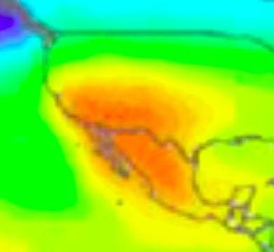
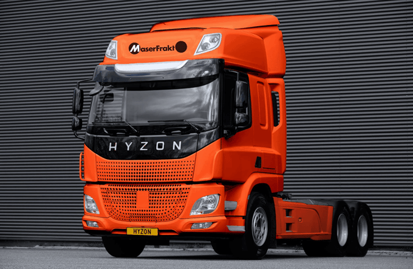
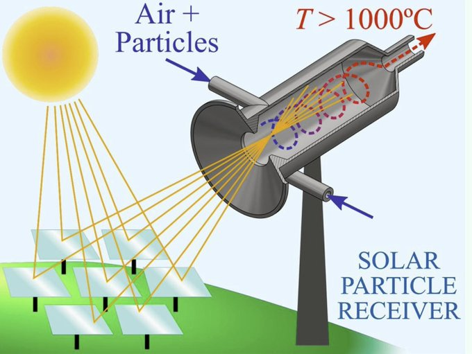
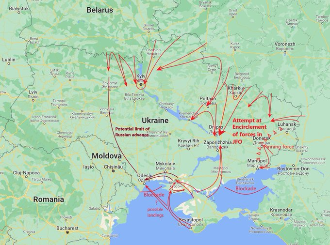
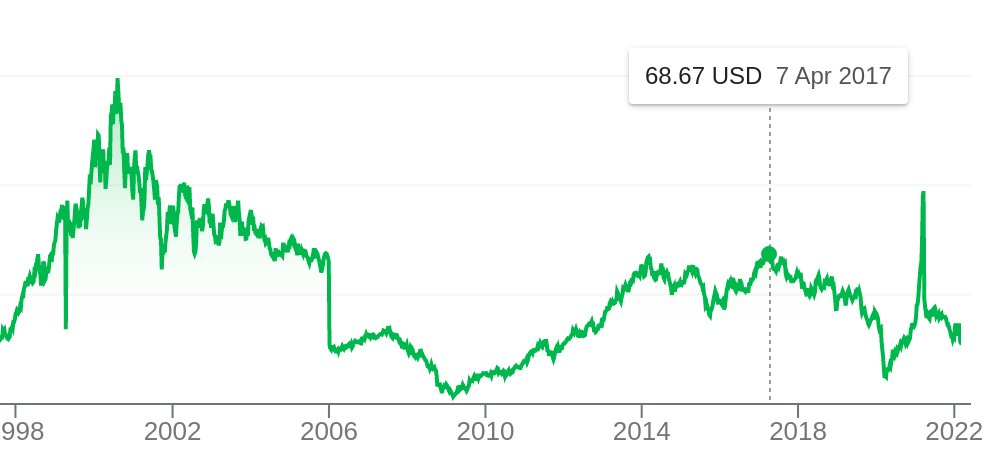
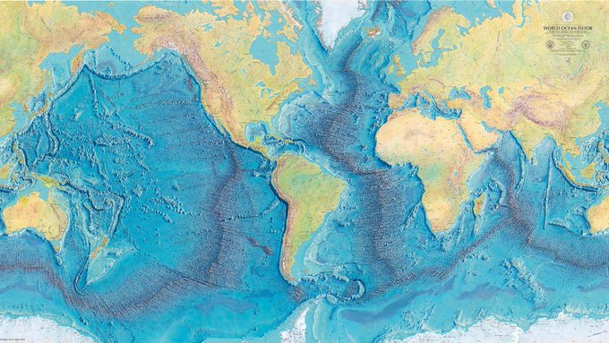

# Week 8 

---

"Chevron, Iwatani to develop 30 hydrogen stations in California by 2026"

---

To repeat, US sunshine states are CA, NV, UT, AZ, NM, CO, ID, WY. They
clearly have other resources too.. And perhaps expertise around
handling chemicals, storage, transport.

Once US catches momentum it will be like nothing anyone has ever
seen.. US is good at scale. 

---

Fantastic. 

"Colorado, Utah and Wyoming will all compete for a portion of the $8bn
allocated by the US Department of Energy for the development of
regional clean hydrogen hubs as they look to play pivotal roles in the
US hydrogen economy. Governors of the above states unveiled their
intentions to develop a New Mexico hydrogen hub to utilise heavily
available natural resources in the region, such as high-quality wind,
solar, biomass, natural gas and other energy resources"

---

"Hyundai, Shell to support the hydrogen mobility market under new
deal.. Low carbon emissions products and services, including hydrogen
offerings for the mobility market, are the key focus of a new
agreement between Hyundai Motor Company and Shell"

---

:) This guy is good.. I am stashing these

"If you are fluent you are congruent"

---

Hah. From a self-help type person

"Your action steps build up - piggy banks become biggy banks"

---

Jane's Defense: "Philippines signs contract for 32 S-70i Black Hawks"

---

World system is fukked - needs a change from top to bottom.

---

And the Russian guy is like "but I can veto this resolution bitch"

US side at UN: "You cannot veto our voices; You cannot veto the truth;
You cannot veto our principles; You cannot veto the Ukrainian people".

---

No shit

"Russia vetoes UN Security Council resolution that denounces its invasion of Ukraine"

---

If SE, FI has Russian minorities kick them out now

---

😂 😂 Part of me wants to see it happen just to see what they would do
for the f--k of it

"Finland, Sweden brush off Moscow's warning on joining NATO"

---

On cue..

"Russia's Ministry of Foreign Affairs says there would be 'serious
military and political repercussions' if Finland were to be granted
NATO membership"

---

\#Finlandization

[[-]](https://youtu.be/N6aOk0SiHgI)

---

Oh no.. what word will we use then instead of Finlandization?

"Finnish Prime Minister Sanna Marin said that Russia's invasion in
Ukraine 'will change' debate surrounding Finland's accession to NATO"

---

Now Chechnia is ruled by a Kremlin stooge who says 'he loves Putin like
a father'.

---

Yea well.. Hopefully the end doesn't resemble the Chechen
war. Remember satellite images of the capital Grozny, afterwards.. The
only thing flatter than that city would be a parking lot.

"@RALee85

Two US officials confirmed that Ukraine shot down a second Il-76
transport aircraft tonight. If true, this would be a really
significant mistake for the Russian military, and possibly the worst
loss of life for the Russian Airborne Forces since the 2nd Chechen
War"

---

Tony Burgos & His Swing Shift Orchestra - Little Girl \#music

[[-]](https://youtu.be/ga8XdpAkDnk)

---

Unfair; but funny

[[-]](twimg/FMZvpzzXsAETcJH.jpg)

---

ML is also AI, and AI is Frankenstein / Pinoccio. Take your pick. Ergo
by optimizing you could be bringing about Skynet. So say bunch of IT
dipshits who pose like science geniuses.

"@MadVictorZ

So, according to ML jargon, solving this problem:

min f(x) s.t. g(x)=0

means that I am 'learning' its solution.  Therefore, optimization is
just ML. Gotcha"

---

H2 View: "Sweden’s ‘first’ hydrogen truck to soon hit roads.. Swedish
transport group MaserFrakt will bring what it says will be Sweden’s
first hydrogen-powered heavy-duty truck into commercial operation
across the country – and today it placed the all-important order with
Hyzon Motors. Marking a milestone moment for Sweden’s transportation
industry, the company will deploy two Hyzon HyMax-250 fuel cell
electric trucks, built on a 6×4 vehicle chassis, each with a range of
up to 680 kilometres"

---

H2 View: "The HyDeal European green [H2 project]..  will bring a total
installed capacity to 9.5 GW of solar power and 7.4 GW of
electrolyzers..  by 2030.

The European strategy’s announcement arrived as India and Brazil made
their own announcements"

---

H2 View: [A] joint venture last month said it will develop what it
believes to be the UK’s largest hydrogen hub as part of the HyNet
cluster across the Northwest of England and North Wales... 'Best in
class' technology supplied from Johnson Matthey will allow for high
purity low carbon hydrogen production from natural gas at the site,
delivering over 85% thermal efficiency and ~97% carbon capture, the
report states.

---

SolarPACES: "Particles like sand or specially manufactured ceramic
particles have been shown to hold heat at 1000°C and above, and so
particle-based solar tower CST technologies are now much
investigated..

[Researchers are] investigating twirling the particles around inside
the solar receiver. Two examples of the circulating approach are DLR’s
Centrec receiver in Germany, operating like a cement mixer, has
recently advanced into its first commercial pilots via the spin-off
HelioHeat... The Swiss laboratory ETH developed another design, now
further developed by the DLR spin-off Synhelion..

Very high temperature solar research is even more relevant in sunny
Australia where large mining industries have world class potential to
decarbonize using this solar technology for generating heat directly
for their industrial processes, like alumina processing. One such
receiver is under development, a project funded by Australian
Renewable Energy Agency (ARENA), by an innovative team of researchers
at the University of Adelaide"

[[-]](https://www.solarpaces.org/new-solar-receiver-for-thermochemistry-at-1000-c/)

---

Texas has a bright future, H2 production will be a boon for the state
just as oil had been. They have the sunshine and expertise in handling
various chemicals, transporting, storing, processing them.. If there
was a stock for the state I'd buy it

---

You know once setup the Japanese will have a string of those ships
lined up, working around the clock, sailing back-to-back forming
almost a semi-pipeline through the sea, to get the H2 from
Australia. Massive energy transportation is possible, perhaps in
bigger amounts than oil.

---

Automation (not AI) works well... 

The Mandarin: "Japan wants to make half Its cargo ships autonomous by
2040.. The first was a 313-foot container ship called the Mikage,
which sailed 161 nautical miles from Tsuruga Port, north of Kyoto, to
Sakai Port near Osaka. Upon reaching its destination port the ship was
even able to steer itself into its designated bay, with drones
dropping its mooring line.

The Mikage wasn’t purpose-built to be autonomous; the seven-year-old
ship was retrofitted with a system of sensors, cameras, and satellite
navigation. It followed a carefully-planned route while a control
centre on land monitored relevant wind, current, and weather data, as
well as details on nearby ships and potential obstacles.

Similar to how it’s easier for self-driving cars to operate
autonomously on highways than in unpredictable urban settings, the
Mikage didn’t have too hard of a time navigating itself through open
waters"

---

Cats And The Fiddle - Public Jitterbug No. 1 \#music

[[-]](https://youtu.be/xSAaXov-QxA)

---

But still upcoming sanctions can damage EU-RU bilateral relations for
a long time to come. Mission accomplished (for UK/US, per scenario).

---

In this scenario a surgical strike against the UKR government is the
play, and the attack plan cld be like this guy says. 

"@KofmanMichael

I made a basic map... This is just one very incomplete estimate of
what the Russian op plan might look like"

---

It is claimed Macron suggested "Finlandization" to VZ in a recent
meeting. Not followed. EM had a non-antagonistic stance toward RU, one
of the few leaders to receive one-on-one meeting with Pute, at that
long table.

---

And Zelensky did not reach agreement when he could..

The plot thickens..

Al Jazeera: "We will also soon find out whether Ukrainian President
Volodymyr Zelenskyy did the right thing when he chose to put up a
fight rather than avoid collusion by accepting his country’s neutral
status or agreeing to implement the Minsk agreements, as Russia
demanded prior to the invasion"

[[-]](https://www.aljazeera.com/opinions/2022/2/24/is-putins-gamble-on-ukraine-rational)

---

But let's continue: Putin was provoked through NATO. Brits had their
bitch, Asia Minor, to help UKR stage drone attacks toward the
seperatists in UKR East.

---

After one Biden-Zelensky meeting (June 2021) talk of "NATO membership"
made the news, later denied, but VZ cld have received a tentative
agreement on NATO in that meeting. Then denial.. Puten either saw that
as weakness, or was scared.

---

If one accepts the great fear of US-UK was a EU-RU entente, the latest
invasion has been a "gift". 

[[-]](../../2017/07/the-next-decade-friedman.html#eurasia)

---

OK.. let's get diabolical

---

UKR conf happened right on time for WH; now Russia can be blamed for
all gas price rises.

---

US is probably fine with the system as is.. They are the only ones
with all fingers in all pies, can pick and choose any combo of
responses depending on the crisis, that benefits them.

---

The world system is a joke.. What use is it to pass resolution at UNSC
when RU (a permanent member) can veto it right away?

---

Al Jazeera: "Hedge in times of trouble? Bitcoin drops to one-month
low"

---

Al Monitor: "US sanctions smuggling network backing Yemen's Houthis"

---

Really? NATO is sitting ducks?

Jane's Defense: "NATO loses ISR capability over Ukraine as Putin closes
airspace.. NATO has lost its ability to conduct airborne intelligence,
surveillance, and reconnaissance (ISR) overflights of Ukraine"

---

<blockquote class="twitter-tweet">
Japan will next month begin trialling its first-ever <a href="https://twitter.com/hashtag/hydrogen?src=hash&amp;ref_src=twsrc%5Etfw">#hydrogen</a>-powered train as the country looks to cut emissions from its high emitting transportation sector. <a href="https://t.co/xoNUQzdDz0">https://t.co/xoNUQzdDz0</a>
&mdash; Joanna Sampson (@JoSamps92) <a href="https://twitter.com/JoSamps92/status/1496106767138402306?ref_src=twsrc%5Etfw">February 22, 2022</a></blockquote> 

---

CNBC: "Hydrogen generation could become a $1 trillion per year market,
Goldman Sachs says"

---

H2 View: "Chesapeake Utilities successfully trials hydrogen blends at
combined heat and power plant"

---

H2 View: "Everfuel founder and CEO: green hydrogen has been cost
competitive since 2019"

---

Where is Boeing?

Where are they going ? 😆 😆 😆

H2 View: "Hydrogen-powered Airbus A380 to take flight this decade"

---

H2 View: "Finnish city bets big on hydrogen with multiple production
plans.. [P]reliminary studies are already taking place for the
construction of a hydrogen gas pipeline in the northern Baltic Sea,
running from Raahe to Leleå, Sweden, and then to Skellefteå"

---

"[Oz state] NSW won’t support further offshore mining and exploration
permits"

---

Reuters: "The German government has announced that it intends to
transfer hydrogen production technology to countries in Africa. This
strategy is meant to work with Germany’s strategy to eliminate its
reliance on coal and nuclear energy. To replace nuclear and coal,
Germany will have to import about 40 to 60 percent of the H2 it will
need... The announcement was made by an official from the German
government who explained the country’s intentions just ahead of a
meeting between the European Union and the African Union that took
place in Brussels"

---

"FKAB Marine Design is set to transform the maritime sector with its
hydrogen-powered MR Tanker"

---

"Salzgitter secures hydrogen supply for green steelmaking ambitions"

---

IN VOLUMES NOT YET SEEN

"In the latest move to develop the state of Texas into a leading
player in the world of hydrogen, plans have been unveiled for a
gigawatt-scale green fuels hub – and it could produce green hydrogen
in volumes not yet seen in the US... Apex Clean Energy is behind the
ambitious plans, having inked a Memorandum of Understanding (MoU) with
the Port of Corpus Christi Authority and EPIC Midstream"

---

Trump's talk on NATO's irrelevance might have helped to quell RU fears
on issues related to Ukraine.. But WH did sell anti-tank weapons to
UKR in 2019.

The Independent: "Russia conflict separates GOP traditionalists from
newcomers.. Divisions in a rapidly changing Republican Party are
evident in the divergent responses to the tensions in Ukraine"

---

Jane's Defense: "US deploying ground and air-attack assets to Baltic region"

---

Yeea why not.. invade Ukraine. He doesn't even see them as a f-ing
country. So by implication they cannot govern themselves, so you step
in.

The Independent: "Putin declares war on Ukraine and warns foreign
powers of ‘consequences’ if they interfere.. US president Joe Biden
says US and allies will respond in ‘decisive way’"

---

UKR gov is no more Nazi then the Kremlin is Eskimo.

---

Nazis? 🤨 That's stupid. Only makes sense as propaganda.. it aims to
mobilize RU by conjuring up memories of their last great victory --
against Nazis.

The Guardian: "Russian forces have unleashed an attack of Ukraine
.. [RU claims] it was for the “demilitarisation and denazification” of
Ukraine, echoing a theme of Kremlin propaganda, the false claim that
the Kyiv government is controlled by the far right"

---

CNBC: "The case for bitcoin as ‘digital gold’ is falling
apart. Bitcoin fell to a two-week low Tuesday after Russia ordered
troops into two separatist regions in eastern Ukraine. Geopolitical
tensions and climbing inflation are among the key factors weighing
down on bitcoin’s price"

---

Viacom CBS stock. Major fail started in 2017. Which event could be the
trigger?

Ah, I have it. Star Trek Discovery -- playfully called by many Trek
fans as "STD". Created by franchise destroyers Jar Jar and the bitches
around him.

---

U-oh.. be careful lets not become too relevant now

"UN slams 'aggressive' formula milk marketing"

---

H2 View: "$127.9m boost for zero emissions vehicles in
Australia.. Unveiled.. by the Australian Renewable Energy Agency
(ARENA) on the behalf of the Australian Government, the Future Fuels
Programme will see funding dedicated to the roll-out of hydrogen fuel
cell vehicles and the supporting infrastructure"

---

H2 View: "Deutsche Telekom is trialling hydrogen technologies for the
carbon-neutral powering of its mobile sites in a mission to slash its
emissions"

---

Freaking massive

H2 View: "The Southern California Gas Company (SoCalGas) has announced
that it is submitting a green hydrogen infrastructure application
to construct an electrolyzer with a capacity between 10GW and 20GW"

---

"As alternative to molten salts-based systems [used by most CSPs],
other energy storage systems are being proposed in the last years
... Limestone, which is the second most abundant material on Earth
after water, can be employed for this purpose. In the so-called
Calcium Looping (CaL) process, direct solar radiation is used to carry
out the endothermic calcination reaction releasing CO2 and CaO as
products that are stored separately. Storage conditions and time
depends on the energy demand. When energy is needed, the stored
products are brought together to carry out the exothermic carbonation
reaction which releases the stored energy"

[[PDF]](https://idus.us.es/bitstream/handle/11441/87668/preprint_CSP-CaL.pdf)

---

Li-on batteries are limited by world lithium reserves. At its max this
tech can only handle 5% of global storage need. They are doomed to
remain marginal, and eventually irrelevant.

---

Switch to a green econ cannot be accomplished on the backs on bunch of
people "putting up solar panels on their rooftops". That's good, but
not everyone lives in a setting they can do that easily. Green energy
needs to be a product, which can be transmitted easily, and stored as
needed in huge amounts.

---

With all that solar potential there is no reason China should not one
day become energy independent.

---

That sucks for Russia

"@JeremyCliffe

Wow. Scholz has just announced that NordStream 2 will not be certified"

---

"If it aint Boeing I aint going". That used to be a saying? Maybe the
saying changed a little bit recently, no?

---

"Germany will offer its population a new protein-based Covid-19
vaccine comparable to conventional flu jabs this week, in the hope of
swaying a sizeable minority that remains sceptical of the novel mRNA
technology used in the most commonly used vaccines"

---

Mango is potent.. Planning to add it to the veg patty mix. Replaced
marmite with avacado (high on the B vitamins, w fats), added spinach
for lutein (for eyesight longevity). Testing.

---

"@kachayev

Most likely you're reading my tweets because I'm an engineer, and I
talk a lot about it. But, first and foremost, I'm Ukrainian. And I
just spent an hour of my life listening to the president of another
country ranting about how my country shouldn't exist"

---

Oz had really locked it all down hadn't it.. This is good

The Guardian: "Emotional scenes at Sydney airport as families, friends
and lovers reunite after 704 days of Covid restrictions"

---

It matters bcz countries will attempt to pull discussion to bodies
they are part of, and by doing that they might be pushing some
countries out of the discussion. China might steer things to UNSC bcz
it is a permanent member there, away from G7, while Germany might do
the reverse. US, being in both, can pick and choose, select either
format just to freeze out countries that are not in one or the
other. That does not lead to a democratic environment.

UNSC permanent members are basically the victors of WWII; from
long-time ago. A more inclusive org with major teeth is needed. The
new org should also decide on a majority vote basis. If you piss
off more than half the countries, it should mean something.

"Why does membership in UNSC and G7 matter in world matters?'

---

H2 View: "Renault has.. teased its concept-car of the future, equipped
with a hydrogen engine"

---

H2 View: "Yamaha to develop a five-litre V8 high-performance hydrogen
internal combustion engine for Toyota"

---

H2 View: "A brand-new heavy-duty hydrogen station is set to fuel at
least 22 fuel cell buses daily in the city of Frankfurt, Germany"

---

H2 View: "[DOE] revealed.. its innovative H2 Matchmaker Map.. to
support the growing hydrogen sector.. [H2M] is a resource helping
clean hydrogen producers, end-users, and others find opportunities to
develop networks of production, storage, and transportation
infrastructure"

---

H2 View: "Barbados will become home to [a] hydrogen power project in
the Caribbean with capacity for 128MWh of green hydrogen storage"

---

5 x 1e9 x 33.6 / (365 x 24 x 1e6) computes over 19 Gigawatts of
capacity. Huge.  Equivalent to 19 nuclear plants.

Arab News: "India plans to produce 5 million tonnes of green hydrogen
a year by 2030 as it seeks to exploit low renewable energy costs to
become a global exporter of the sustainable fuel... The target was
announced by India’s power ministry on Thursday as it revealed the
first part of its national hydrogen policy"

---

No wonder Blackrock is world's largest asset manager; LF has a good
nose for promising opportunities. Unlike some 'genius' investors who
merely rode the wave of FOMO, faux-unicorns made possible thanks to
low rates, this guy pinpointed a fundamental, game changing tech
early. That is skill.

---

H2 View: "Hydrogen refuelling network to be developed in the
US by Daimler Truck, NextEra and BlackRock"

---

CNBC: "[Oct 2021] Larry Fink, the CEO and Chairman of Blackrock, sees
addressing climate change as a massive potential for new
businesses. 'It is my belief that the next 1,000 unicorns — companies
that have a market valuation over a billion dollars — won't be a
search engine, won't be a media company, they'll be businesses
developing green hydrogen, green agriculture, green steel and green
cement,' Fink said Monday at the Middle East Green Initiative Summit
in Riyadh, Saudi Arabia"

---

Look at that [bad boy](twimg/FMA3m-DWUAMDe-D.jpg). Arrrr.. The wind cannot knock this down!

---

Electric cables are an inefficient way of transporting energy. Strong
winds can damage wires easily. A clean gas pipeline is very close or
under the ground, and a robust construction, would not be harmed by
adverse weather easily. Also transmits power 10 times faster at 8th
the cost.

"Storm Eunice batters Europe..  More than 100,000 people were hit by
power cuts as lines were torn down and ancient trees keeled over"

[[-]](https://www.aljazeera.com/news/2022/2/18/storm-eunice-batters-europe-eight)

---

Lota mucking flame 

[[-]](twimg/FL-TzH_XEAEg09O.jpg)

---

JFK "Eternal Flame"? They have this bloody gas powered thing burning
since the 60s, non-stop. Need to put that shit out. The mucker was
undeserving for that gesture for one, and it is emitting GHG.

---

Pollution (air, sea -oil spills-) is enough to entice a switch to
green fuels. Green fuel pipeline instead of oil pipeline would have
saved California's beaches just the previous year.

---

<blockquote class="twitter-tweet">
Compared to BEVs, whose batteries can drain faster in cold weather, hydrogen-powered vehicles are better suited for wintry climates like Zhangjiakou, where temperatures during competition have plummeted to -17° C. <a href="https://t.co/EF6LlYZFj7">https://t.co/EF6LlYZFj7</a> via <a href="https://twitter.com/business?ref_src=twsrc%5Etfw">@business</a> <a href="https://twitter.com/hashtag/copolitics?src=hash&amp;ref_src=twsrc%5Etfw">#copolitics</a> <a href="https://twitter.com/hashtag/coleg?src=hash&amp;ref_src=twsrc%5Etfw">#coleg</a> <a href="https://twitter.com/GovofCO?ref_src=twsrc%5Etfw">@GovofCO</a>
&mdash; Reuben Espinosa (@reubenesp) <a href="https://twitter.com/reubenesp/status/1494615837512142848?ref_src=twsrc%5Etfw">February 18, 2022</a></blockquote> 

---

"@HTAutotweets

Hydrogen-powered vehicles are better suited for wintry climates and
refilling them takes only minutes, much faster than charging electric
vehicles"

---

"@fromYanK

Energy transition reached a new level as environmentally friendly
hydrogen was used to power the torch that lit the cauldron at the
Beijing Winter Olympics opening ceremony. It was the first time in
Olympic history that a zero-emissions torch had been used for such an
occasion"

---

"@official_cnpc

\#CNPC Transportation Company sends 14 kg of hydrogen to the Bird's
Nest (aka National Stadium) every two or three days to supply the fuel
for the torch"

---

"@SinopecNews

Environmental-friendly hydrogen produced by Sinopec was used to power
the torch that lit the snowflake-shaped cauldron at the
\#OpeningCeremony of the Beijing 2022 Winter Olympics"

---

"[Dec 8] PetroChina's Huabei Petrochemical ships first hydrogen fuel cargo"

---

Need to transition to discussing climate solutions rather than
expanding 'awareness' on climate change. Some solutions can garner
broad support, and have good economics behind them. The new bidness
possibilities can overcome (!) a lot of doubts.

---

CNBC: "61% of people working from home are doing so because they want
to, even though their office is open.. Teleworkers say they’re
choosing to stay home for better work-life balance, productivity or
because they’ve relocated away from the office"

---

CNBC: "Fed approves rules banning its officials from trading stocks,
bonds and also cryptocurrencies"

---

Another map - deepest part of Medi is right under Italy's boot

[[-]](https://cdn.britannica.com/04/6004-050-EBC240F4/depth-contours-Atlantic-Ocean-submarine-features.jpg)

---

I guess there was a time you could walk from Paris France to Paris Texas.

---

Looks like someone pulled two sides of a single block and it broke,
two big pieces and a third middle part remained. That's what that
mountain looks like.

---

There is a legit underwater mountain in the middle of the Atlatic

---

Sea Depth Map (from the [Economist](https://www.economist.com/1843/2014/12/27/the-first-map-of-the-depths))

---

6000 meters pretty much covers the Mediterrenian (max depth < 6km),
most of the world's oceans too except a few places. Africa energy
pipelines will fall under that monitoring I bet.

---

Seabed Warfare? Dam

"France Unveils New Seabed Warfare Strategy.. The strategy aims at
broadening the capabilities of anticipation and action of the French
Navy (Marine Nationale) up to 6,000 m depth...

[S]trategic interests in this space [are]: Guarantee the freedom of
action of the French Armed Forces in the face of submarine
surveillance and interdiction strategies potentially deployed from the
seabed.. Protect France’s underwater infrastructures such as
communication and energy transport cables (electricity, gas, oil)"

[[-]](https://www.navalnews.com/naval-news/2022/02/france-unveils-new-seabed-warfare-strategy/)

---

Pacemaker.. not bad.

---

Suicided?

TDB: "Jean-Luc Brunel, a French modeling agent accused of procuring
underage women for Jeffrey Epstein, was found hanged in his Paris jail
cell—in a shocking replay of how Epstein himself died"

---

😂

"@Econ_Marshall

where to begin

'@Noahpinion Historians are far more powerful than economists, and
their theories gain wide acceptance with far less solid evidence to
back them up.'"

---

*Severence* is some kooky shit.. Saw the first ep, 'tis ok.

---

Southerners are 'mericans, aren't they?

---

Sheeee-iiiit is Southern drawl, not African

---
