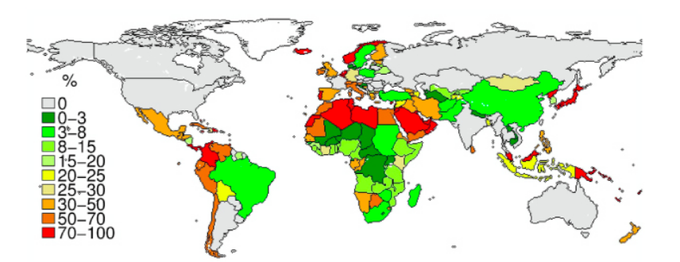

# Week 9 

---

<blockquote class="twitter-tweet"><p lang="en" dir="ltr">Swiss-based Destinus SA has closed a seed round of $29m as the company looks to utilise the funds to develop and test the “first” supersonic flights powered by <a href="https://twitter.com/hashtag/hydrogen?src=hash&amp;ref_src=twsrc%5Etfw">#hydrogen</a> engines in the next 18 months. <a href="https://t.co/NcYJloKEey">https://t.co/NcYJloKEey</a></p>&mdash; Joanna Sampson (@JoSamps92) <a href="https://twitter.com/JoSamps92/status/1491444278169681922?ref_src=twsrc%5Etfw">February 9, 2022</a></blockquote> <script async src="https://platform.twitter.com/widgets.js" charset="utf-8"></script>

---

H2 View: "McLaren Applied to manufacture and supply components for
BAK’s innovative hydrogen hybrid hyper-car"

---

H2 View: "GenH2’s global headquarters to be located in Florida.. GenH2
will build its new 10.5-acre global headquarters in Florida as it
looks to grow its presence in the liquid hydrogen infrastructure
industry – and it has now received a financial boost"

---

H2 View: "German port of Wilhelmshaven to be converted into a
world-scale hydrogen hub.. Tree Energy Solutions (TES) is accelerating
the development of a world-scale hydrogen hub in the German port of
Wilhelmshaven which will support the growth of the hydrogen sector in
Europe"

---

H2 Fuel News: "UK government funds non-toxic and safe hydrogen storage
test.. The program is broken into two phases, the first of which will
be a feasibility study.. H2, a zero-carbon emission fuel that can be
stored more efficiently for longer periods of time than batteries and
can meet the performance needs of heavier-duty vehicles such as HGVs
and buses. H2 refueling is simple and takes about the same amount of
time as refueling gasoline or diesel"

---

H2 View: "National Fuel joins the US Clean Hydrogen Partnership
consortium.. US-based National Fuel Gas Distribution has joined a new
consortium that is aiming to build the clean hydrogen economy in the
US and scale the technology in order to decarbonise hard-to-abate
sectors"

---

H2 View: "Hydrogen homes now being assembled in California.. Southern
California Gas (SoCalGas) will showcase hydrogen’s potential in the
domestic heating sector in Downey, California, with its landmark H2
Hydrogen Home project that is now under assembly"

---

H2 View: "Fortescue begins construction of a 2GW electrolyser facility in Australia"

---


"[2021] Saudi Arabia to use $110 billion natural gas field for blue
hydrogen.. A large portion of gas from the.. Jafurah development will
be used for blue hydrogen, according to Energy Minister Abdulaziz bin
Salman"

---

H2 under ambient conditions has 3 kWh / m3

```python
prod = 1e9 * 0.028 # m3
dens = 0.003 # MWh / m3
print (prod * dens / (24*1000), 'GW')
```

```text
3.5 GW
```

---

The output of that Texas plant will be equivalent to 3.5 Gigawatts.
⚡ 💧 ⚛️ &#9981; 🚙 👍 👍 👍 

Yahoo Finance: "ExxonMobil said today it is planning a hydrogen
production plant and one of the world’s largest carbon capture and
storage projects at its integrated refining and petrochemical site at
Baytown, Texas..  The proposed hydrogen facility would produce up to 1
billion cubic feet per day of "blue" hydrogen, which is an industry
term for hydrogen produced from natural gas and supported by carbon
capture and storage. The carbon capture infrastructure for this
project would have the capacity to transport and store up to 10
million metric tons of CO2 per year, more than doubling ExxonMobil’s
current capacity"

---

They produce the neutral fuels by mixing in carbon into a clean fuel,
turning it into synthetic fossil fuel, since it is fossil existing
engines are already prepared for it. If the carbon is captured "from
the air" then putting it back through combustion would not change the
overall budget, voila.

Cant say I'm crazy about the approach, creates a path too easy to
cheat. Remember Volkswagen, a world famous company, w production at
huge scale, headquartered smack in the middle of Europe still cheated
on their emissions mechanism.. With synthetic fuels one day companies
might just burn some coal on the side, get its carbon, then we will be
back to square one.

"@FlySWISS and its parent company, the @lufthansa Group, have partnered
with synthetic fuel group Synhelion to use its solar fuel"

---

I culled this guy's script to fourth its size. The spaghetti in the
older code was mind-boggling.

---

IT has a long history now around adopting, popularizing, marketing
packages; lots depend on them. Each has its own way of use / access,
and professionals want to learn a few, stick to that, and sell it,
"evangalize" it to others. They mostly have no bleeping idea about
what goes on inside.

---

This is another reason why this "AI" talk is prevalent, bcz IT types
picked up on it, they see it as a nice "package". And current
incarnation of this said AI is exactly that, a black box essentially,
you shove data into from one end, "predictions" come out from the
other (which of course is the problem as far as AGI is concerned).

---

These are such common operations they are known as C.R.U.D. - 
create, read, update, delete.

---

Yes there are funcs for delete dumb ass [eyes rolling]

---

IT profession today is mostly about packages, Gone are the days of a
"hacker" coding up everything from scratch (Linus Torvalds is probably
the last famous one who did). Now it's all about a package, picking
one, learning one.. IT professionals do not write a database from
scratch to insert a new record. There is a database *package* and they
just call a function named `insert` in that package, passing data as
parameter, and voila. A new record.

---

Misa Blam - Gorila \#music

[[-]](https://youtu.be/jg07YiU4TJU)

---

I hope the Klitschkos make it. Everyone too of course, but if those
guys get killed it will be a huge bummer.

---

Leaders don't stand alone either. Democratic ones rely on a larger
winning coalition, but even the most autocratic leader has a WC. When
Putin annexed Crimea Gorbachev was cheering that shit.

---

WSJ: "As Russian Invasion Widens, the West's Options Shrink"

---

These wars are fought at another level.. Just like regular individual
is insufficient for modern governance but people's romantic notions of
'community governance' remains, so is 'civic bravity' in modern war.
WWI, WWII should have beaten that out of societies but people forget.

---

Modern war is not unlike a natural disaster, sudden, faceless,
overwhelming, and destructive. There is no mano-o-mano, bravity
against it. If you are in its path, you get destroyed.

---

Ukranian guy I was following was like 'we will fight!' but then he got
the f-k outa there, over a week ago.

---

I dont think Ukranians are any more Nazi then Russians themselves are.

---

<blockquote class="twitter-tweet"><p lang="en" dir="ltr"><a href="https://twitter.com/gencellenergy?ref_src=twsrc%5Etfw">@gencellenergy</a> announces significant breakthrough in our <a href="https://twitter.com/hashtag/GreenAmmonia?src=hash&amp;ref_src=twsrc%5Etfw">#GreenAmmonia</a> synthesis project, after which <a href="https://twitter.com/TDK_Corporation?ref_src=twsrc%5Etfw">@TDK_Corporation</a> within cooperation agreement exercises right to continue investment in project. Read more: <a href="https://t.co/YxDX3Gp08E">https://t.co/YxDX3Gp08E</a><a href="https://twitter.com/hashtag/FuelCells?src=hash&amp;ref_src=twsrc%5Etfw">#FuelCells</a> <a href="https://twitter.com/hashtag/BackupPower?src=hash&amp;ref_src=twsrc%5Etfw">#BackupPower</a> <a href="https://twitter.com/hashtag/SayNoToDiesel?src=hash&amp;ref_src=twsrc%5Etfw">#SayNoToDiesel</a></p>&mdash; GenCell Energy (@gencellenergy) <a href="https://twitter.com/gencellenergy/status/1498226492026888192?ref_src=twsrc%5Etfw">February 28, 2022</a></blockquote> <script async src="https://platform.twitter.com/widgets.js" charset="utf-8"></script>

---

H2 View: "ExxonMobil unveils ambitious blue hydrogen targets for
integrated refining and petrochemical site. ExxonMobil wants to
produce one billion cubic feet of blue hydrogen daily at its
integrated refining and petrochemical site in Baytown, Texas, US"

---

H2 Fuel News: "Raahe [Finland] to become H2 producer for Baltic Sea
hydrogen pipeline"

---

H2 View: "Clean Hydrogen Partnership: €300m fund to be made available
for hydrogen and fuel cells in Europe"

---

H2 View: "Australian project to convert recycled water into renewable
hydrogen with $43.3m backing"

---

Pakistan has good solar / CSP potential. 10 Terrawatts.

"In this study..  [we investigated] Direct Normal Irradiance, air
temperature,.. at different timescales and locations over Pakistan
[for CSP]... In the second part, spatial feasibility and Analytical
Hierarchy Process based site suitability is assessed.. Moreover,
multi-parametric evaluation of techno-economic potential is performed
using bias-corrected datasets... Additionally, cost of water usage is
introduced in estimation of Levelized Cost of Electricity besides
other parameters. Cumulative power capacity potential of 10,035 GW is
identified for country, with net cost estimated below 0.096
USD/kWh. Nine sites are found to have generation potential greater
than 1200 TWh/year, the individual capacity to fulfil total predicted
energy demand of the country for year 2030"

[[-]](https://www.sciencedirect.com/science/article/abs/pii/S0196890422001625)

---


```python
bats = 28 # GWh
need = (157481*1000) / (365*8)
print ("%d GWh" % need)
print ('%0.2f percent' % (bats / need * 100))
```

```text
53931 GWh
0.05 percent
```

Current installed bat capacity is enough for only 0.05 percent of the
global demand. Double it, triple it, still won't make a dent. Mine all
the lithium, cannot handle more than 5%. This tech is a complete piece
of shit.

---

12 GW/28 GWh? That means for 2-3 hour period.. Well within that time
period the world consumption requires **53,931** GWh of storage.

"Wood Mackenzie: Global [battery] energy storage to reach 12 GW/28 GWh in 2021"

---

Opec crude production still down..

[[-]](../../2021/01/stats.html#opec)

---

This culture war (battle) is getting old.. Need a new one. They'll
probably soon create it.

TDB: "Much-Hyped D.C. Trucker Rally Turns Out to Be a Complete Joke"

---


---

So much clapping all over the place.. you'd think there was some kind
of victory. 

---

A-oh.. Triangulation time? 

TDB: "But rather than front-load proposals on increased social
spending on programs.. Biden largely focused on GOP-friendly issues"

---

TDB: "Biden Finds Unity on Ukraine, But Little Else in First State of
the Union..

Less than 10 months ago, President Joe Biden came before Congress and
laid out an ambitious domestic agenda..

With much of that agenda dead, his approval rating near record lows,
and a Russian invasion of Ukraine suddenly seizing the attention of
both the administration and an anxious world, Biden pivoted to a
foreign policy-heavy address Tuesday night"

---

F24: "Iran's leader says Ukraine is 'victim' of US policy.. said US
policies are to blame for Russia's invasion of Ukraine, calling for an
end to the war that broke out last week. 'The root cause of the
Ukraine crisis is the US and the West's policies.. The United States
regime is a crisis-creating and crisis-living one. It feeds on
crisis'"

---

I would be. But that ain't happening.

"If Ukraine beat back RU would you be happy?

---

No fly zone!

Oh no... Its for US. Darn.

"Biden Announces Russian Planes Will Be Banned From U.S. Airspace"

---

Part white-collar office dwelling dickwads, part straight-up Republicans.

---

So *The West Wing*.. bunch of day-trader quant-like correlation-speak
(mostly spurious) while the real world rolls on. This is what a
section of Dems have become; white collar office dwelling dickwads
passing papers to eachother in the hallway trying to look cool. Let's
hope the 'evil Putin' mantra is enough to lull everyone into
forgetting the leadership fail.

---

And that 'frozen ground', 'waiting for thaw' shit was truly the low
point of this whole ordeal. Where did that come from? NYT?

---

"Predicting" UKR invasion a few weeks ahead with boat loads of SIGINT,
GEOINT and God knows what else is not some magic skill. The real skill
wld be to proactively act, months, years ago in ways so invasion is
made unnecessary through some diplom and horse trading (where US/UKR
gave some and obtained peace in return). Unless of course what is
taking place now was also ok for US.

---

Biden's net popularity took another dive 02/24 - 03-01. 

```
2022-02-23   -10.278493
2022-02-24   -10.636767
2022-02-25   -12.375218
2022-02-26   -12.375218
2022-02-27   -12.888120
2022-02-28   -12.638364
2022-03-01   -12.372100
```

---

H2 View: "Breakthrough H2 technology could fly to any destination on
the planet in less than a couple of hours... Switzerland-based
Destinus SA has announced that it intends to develop and build a
near-space hydrogen plane and related infrastructure that would make
it possible to transport people and goods faster than has ever been
possible"

---

H2 View: "Enapter launches one-size-fits-all electrolyser.. In an
effort to boost the green hydrogen market, Enapter has launched its
first standardised electrolyser suitable for mass production"

---


H2 Fuel News: "Airbus demonstrator hydrogen airplane to be ready in
handful of years The Airline’s zero-emission tech demonstrator will be
ready by mid-decade"

---

H2 View: "A 55MW electrolyser is set to deliver a safe, reliable and
commercial scale green hydrogen supply chain in the city of Newcastle,
Australia"

---

H2 View: "Australia will accelerate development of a hydrogen-powered
boat with Poseidon Marine H2 revealing ambitions for a vessel to be
fully built in the next 18 months"

---

H2 View: "Significant breakthrough for hydrogen transportation
achieved with GenCell’s green ammonia synthesis project.. Unveiled
today the breakthrough in ammonia technology will enable
cost-competitive transportation of hydrogen in the form of ammonia
directly from water at a very low temperature and pressure"

[[-]](https://www.h2-view.com/story/significant-breakthrough-for-hydrogen-transportation-achieved-with-gencells-green-ammonia-synthesis-project/)

---

H2 View: "Norway to build new facility that uses electrolysers to
create e-fuels for aircraft"

----

H2 View: "Cummins to supply a 25MW electrolyser system for hydrogen
production hub in Florida, US"

---

CCS Dat Biatch

---

It's tough to argue against coal, where it is available it is abundant as fuck

---

I checked a few, here is [Harrison](https://www.gem.wiki/Harrison_Power_Station#Emissions_Data)

---

In all these plants? Fort Martin Power Station, Grant Town Power
Plant, Harrison Power Station, John E. Amos Power Plant, Longview
Power Plant, Longview Power Plant, Morgantown Energy Facility,
Mountaineer Power Plant, Mount Storm Power Station, Pleasants Power
Station?

---

West Virginia produces clean energy? Really?

"@business

'We produce energy cleaner than anybody in the world,' Senator Joe
Manchin"

---

LCOE (total cost of electricity) will increase with CCS, over 70% in
all cases. Levelised cost of hydrogen is about 50% higher than the
average again for coal + CCS (my prefered scenario).

Gov, policy needs to whip ppl into shape. Unless the cost of those
non-ccs investments increase, the direction of money flow will never
change.

High power prices in the middle of a winter cannot be pleasant, with ppl
freezing their asses off, but maybe reg can offset that price
somehow.

The good news is the tech exists, has a specific price tag, which will
only come down in the future. 

---

[H2 From Coal](../../2022/02/h2-coal.html)

---

Do these financed plants have CCS? Likely not.

CNBC: "Banks haven’t quit coal. Study says commercial lenders have channeled
$1.5 trillion to the industry since 2019"

---

Gobble gobble restricts warship passage thru the straits? After all
needed RU ships already went to the Black Sea.. Great timing.

---

Business Insider: "[A]fter more than a decade of keeping interest
rates near zero, the Federal Reserve is all but assured to raise them
multiple times in the coming year to fight inflation. In the world of
finance, these hikes are akin to messing with the Earth's
gravity. Assets that were once attractive — companies that used cheap
capital to grow rapidly without making a profit — will be
shunned. Some of the investors who ate up those growth stories will go
out of business.

Before the pandemic, the most pressing problem for central banks
around the world was the meandering recovery from the financial
crisis. Growth was sluggish, and inflation was well short of their
target, prompting the Fed and others to keep interest rates
historically low to encourage banks to give out loans and juice the
economy. A side effect of making money easy to borrow was that all
kinds of garbage ideas could get funding and all kinds of garbage
companies could stay in business. Combine that with lax corporate law
enforcement and you have Wall Street without consequences. Investors
were champing at the bit to pile into companies that used fantastical
metrics, like WeWork, and lapped up every utterance from billionaire
CEOs who promised flashy technology but consistently underdelivered,
like, say, Elon Musk.

And that was before millions of bored, homebound Americans jumped into
the market via Robinhood and other trading apps. Armed with their
pandemic-era stimulus checks, they bought crypto, piled into
blank-check companies called SPACs, and joined message boards claiming
that stocks like AMC and GameStop were going "to the moon." Awash with
capital, companies — especially in tech — saw their valuations leave
Earth's atmosphere and make a home somewhere on Saturn. Short sellers
were culled. Value investors went into hiding.

'We really did hit peak stupid, but peak stupid extended beyond truly,
truly stupid and then we went to
bottom-of-the-ocean-rare-earth-metal-companies stupid,' the value
investor told me.

This is the kind of bubble a financial professional should see forming
— one where investors lose sight of fundamentals like profitability
and cash flow and embrace a kind of Beanie Baby zeitgeist. In
fairness, on Wall Street you can make a lot of money dancing to the
music at a bubble party. Or you can stand by the snacks and
watch. What you cannot do is pretend that the music will never stop...

Investors Like Cathie Wood — perhaps the most starry-eyed of all the
investors betting on moonshot (at best) technology who've caught fire
during this bubble — will soon come to find that precious few are
interested in a stock that might quadruple in five years if it can't
show how it will generate the cash to fund its business until
then. Wood's Ark Innovation ETF made a truckload of money for
investors in 2020 until its peak in early February 2021 (yes, during
all the meme-stock insanity). But since then Woods' ETF has cratered,
losing about half its value from its peak to its current trough...

Hiking rates from their decade-plus doldrums is nothing short of
economic regime change. The stock market we had before isn't coming
back. It will take a year or two of the highs getting lower and the
lows never bottoming before it's all over. After that, we'll be living
in another world. In the meantime, get your bathing suits on and
prepare for the washout"

[[-]](https://www.businessinsider.com/wall-street-wash-out-federal-reserve-inflation-stock-market-crash-2022-2?r=US&IR=T)

---

Events might develop for the worse, making the war even more damaging
by then.

"Would it be beneficial for the US admin for a possible Ukrainian deal
(tantamount to admitting defeat) to happen after midterms?"

---

The Independent: "Russia used vacuum bomb during invasion, Ukrainian ambassador claims"

---

You dont have to like the other side's stance, but if they are
consistent, stance fits into a power structure, you can work with
that. After 9/11 US gov types were like 'these jihadi mfkers are such
f-ing weirdos.. I miss the Cold War at least *the other side was
rational*'. Well here are the Russkies, you missed them, they are
back.

---

Take the deal

Yahoo News: "The Ukrainian side emerged from the talks with little
optimism, and Russian President Vladimir Putin has shown no
flexibility thus far... Putin told French President Emmanuel Macron
that Ukraine must disarm, proclaim its neutrality, and recognize
Crimea as Russian, per state media"

---

H2 Fuel News: "[Agency] develops new submarine hydrogen fuel cell
technology.. The South Korean.. agency has created a new form of
methanol reforming plant. The hydrogen used by the submarine fuel cell
technology would be produced using methanol reforming within the
vessel itself. Fuel cells in submarines use high-purity H2 to boost
the amount of time they can spend underwater"

---

H2 production from waste.. surprisingly cost-effective.

[[-]](../../2022/02/h2-waste.html)

---

Painting RU as irrational might help to justify a certain military
posture, with US at its center. 

---

"Washington deploying 7,000 troops to Germany as Russia invades
Ukraine"

---

The DE Ramstein US base is so huge it has its own *shopping mall*. The
entire 2003 Iraq War was supported from Ramstein while DE parties left
and right were protesting against the war.

---

CDU Twitter (DE conservatives) is full of 'getting tough' talk. Tough
on who? Last I checked your country was under military occupation by
US of A.

---

TDB: "John Oliver Says George W. Bush Should ‘Shut the Fuck Up’ About
Russia’s Ukraine Invasion"

---

"@AlanRMacLeod

Fox News talks to Iraq and Afghan War architect Condoleezza
Rice. 'When you invade a sovereign nation, that is a war crime.'

Satire is dead"

---

Hopefully with pilots?.. Watch for those S-400s.. one of the most
capable air-defense systems currently in production.. Can UKR achieve
air superiority with these fighter-jets? NATO itself could not fly
over UKR right now. Drones had some success though

"'Fighter jets' are to be provided to Ukraine"

---

Al Monitor: "Arabs fear for wheat supplies after Russia invades
Ukraine.. Russia's invasion of Ukraine could mean less bread on the
table in Egypt, Lebanon, Yemen and elsewhere in the Arab world where
millions already struggle to survive. The region is heavily dependent
on wheat supplies from the two countries which are now at war, and any
shortages of the staple food have potential to bring unrest. If those
supplies are disrupted, 'the Ukraine crisis could trigger renewed
protests and instability'"

---

This is my H2 emoji group now ⚡ 💧 ⚛️ &#9981; 🚙  - electrolysis, on water,
molecule splits, fuel, goes into car. 

---

However North Africa has great sunshine.. proximity to Europe.. "A
pipeline away"  ⚡ 💧 ⚛️ &#9981; 🚙 .

---

India, US, RU look good.. North Africa is in a bad shape.. Must be
climate related (I dont mean climate 'change' - these countries lately
were always in a bad shape most likely).



[[-]](https://iopscience.iop.org/article/10.1088/1748-9326/8/1/014046#erl452631s3)

---

[C]ountries in the exclusive club of [food] self sufficiency [are]:
Canada, Australia, Russia, India, Argentina, Burma, Thailand, [US and
France].

[[-]](https://www.nationalgeographic.com/culture/article/is-your-country-food-independent)

---

RU is self-sufficient, have meat, grain production, and hell, lots and
lots of hydrocarbons.

---

TPDCAMAU, again

"RU will be isolated"

---

They probably don't care as much as assumed

"RU will become a pariah"

---

Biden is not talking to MBS? Why not? Bcz he is bad? Had a journo
killed (which is bad)... but Putin flattened Grozny and everyone was still
talking to him afterwards.

---

Apparently they will get together to give US price gaugers a stern
talking to 😂 

Barron's: "Members of the OPEC+ oil producers' group will meet
Wednesday to discuss loosening the taps -- just days after Russia's
invasion of Ukraine sent crude soaring past $100 a barrel"

---

Politico: "After just one day of the invasion, Russia effectively
controlled nearly a third of the world’s wheat exports.. Importantly,
while hydrocarbon production can be immediately surged in different
places to meet shifts in requirements, grain production cannot be
surged in the same way, and even a major expansion cannot make up for
the sheer volume of agricultural output that Russia now controls
either directly or indirectly.

Most of the focus has rightly been on the invasion’s impact on people
in Ukraine’s most populous cities — but in the background, Russia is
completing a hostile takeover of the country’s grain-rich regions and
their associated transportation infrastructure...

[T]here are only two points of maritime access that Russia needs to
dominate in order to be in control of Ukrainian grain shipments: the
Kerch Strait that connects the Black Sea with the Sea of Azov, and the
17 ports in and around Odessa.

As of Thursday, Russia had closed access to the Sea of Azov, and, ...
Ukraine has closed all its commercial ports. Ukrainian grain is now
offline"

[[-]](https://www.politico.com/news/magazine/2022/02/27/russia-weaponizing-food-supply-chains-00012130)

---

Near history:

Aug 2010: Once in a century draught in Russia devastated wheat crops
forcing Russia announce a ban on wheat export. 80% of Middle East's
wheat came from Russia.

Dec 2010: The Arab Spring is sparked by the first protests that
occurred in Tunisia, following a street vendor's self-immolation

---

WSJ: "Russia Sanctions Over Ukraine Largely Spare Energy Sector, Vital
to Europe"

---

Selected

"EU, US, UK to exclude some Russian banks from SWIFT.. Germany and its
Western allies agreed Saturday to cut 'selected' Russian banks out of
the SWIFT global payment system"

---

WSJ: "Germany to Raise Defense Spending Above 2% of GDP.. The nation
will boost defense spending and create a strategic natural-gas
reserve, Chancellor Olaf Scholz said, marking a significant shift in
reaction to Russia’s war in Ukraine"

---

If it is not important why are some trying to expand it? It clearly
*means* something to be in it, as well as outside, and it is
potentially against someone, even in defensive form.

"But NATO is not that important, RU is making a big deal of it"

---

It was the former IMO

---

Mustache is now saying 'Trump was too buddy-buddy with Putin but we
sent ATWs to Ukraine behind his back, that's why there was no
invasion during his time' 😆

---

The fail is so pure, it is now in solid form, it is shit. It's
everywhere.

---

Retired lieutenant colonel on UKR \#foxnews

[[-]](https://youtu.be/aow8jbT4Vu8?t=34)

---

What more could they occupy? Beyond Belarus and Ukraine there is
NATO. Putin wont attack a NATO country - he is not stupid. On the
other side, NATO already expanded as far it could, reaching its
limit. Right? Otherwise UKR's NATO membership would be
discussed.. That clearly did not happen, not after 6/2021 by this
President, not even after 2014 after Ukraine lost pieces of itself to
Russia. On the downside the current limbo status is not enough to
deter, creates further chaos. It is probably a good idea to finalize
it now.

"But will giving in on UKR neutrality entice RU to attack more?"

---

Yeah - there are still no Nazis in Ukraine... Barking up the wrong tree son

---

Luigi Mengele vs Dr. Oz in a debate? I'd watch that.

---

Well done little guy

"@SheaSerrano

the baby walked up behind me and said 'daddy check this out' then when
i turned around he was holding the ipad at face level and he tapped
the little buy button on roblox and bought something using my face
scan as the verification lol not even 9am and i’ve already been
scammed"

---

Best part of the speech (see link).

"German Chancellor Olaf Scholz on Ukraine"

[[-]](https://youtu.be/9_DMcayCtnA?t=1832)

---

Go for neutrality. Finlandization. Or maybe in the future we will call
it "Ukranianization".

"Ukraine agrees to hold talks with Russia at the Belarusian border"

---

Additional manpower, weapons did not help in Syria. Sanctions did not
help for post-Ukraine invasion 2014.

Trying to "shame" RU on moral grounds is useless. Even if they are an
evil force, there is a rational way to deal with them. Their actions
do not reflect on full democracy, as RU cannot claim to be one. But
democratically elected leaders, being responsible for the safety of
their citizens, are on the hook to provide safety. They need to have
the capability to handle this "evil force". You might be
democratically elected, but then have democratically get bit in the
ass by a wild bear, and democratically have your ass handed to you.

---

Its clearly about tanks, as we see now.

Not just tanks, I dont want to nag on the "weapon help" countries are
providing to UKR, even manpower, but it's more than that, you need to
have an integrated warfare capability just like RU (and US).

---

The grand chess master..

"@Kasparov63

[2014] You don't need tanks, you need banks [against Putin]"

---

Vid on RU landmass

[[-]](https://youtu.be/HBlZlmXyR5M?t=8)

---

Canada is large. But you know who is larger? Russia. Twice the size of
Canada. Any analysis of this country needs to take that into account.

---

Dude in the back just dropped his magazine on the ground, WTF

[[-]](https://youtu.be/6SOVTHjHjbw?t=19)

---

Thats the guy - "Putin's son"

Reuters: "Ramzan Kadyrov, the leader of Russia's Chechnya region and
an ally of Russian President Vladimir Putin, said on Saturday that
Chechen fighters had been deployed to Ukraine and urged Ukrainians to
overthrow their government"

---

"India Avoids Condemning Russia's Invasion of Ukraine, Despite
U.S. Pressure"

---

"China refuses to call Russian attack on Ukraine an ‘invasion,’
deflects blame to U.S."

---

