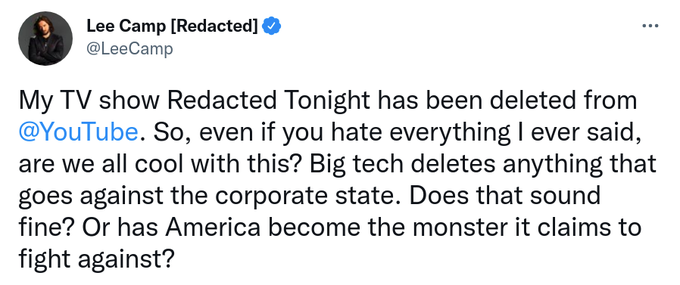
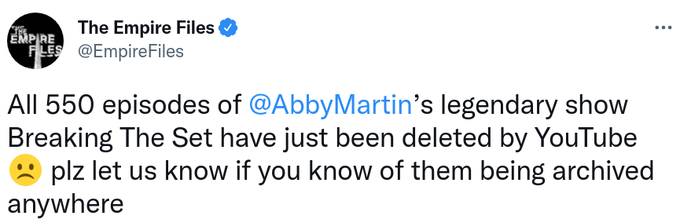
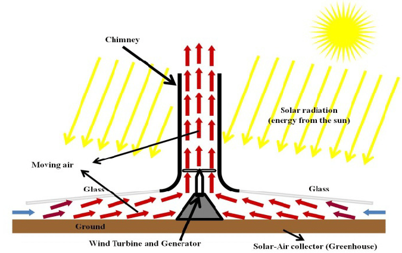

# Week 11 

H2 View: "FlyZero report reveals liquid hydrogen could fuel
medium-sized aircraft from London to San Francisco directly.. A new
report concludes that liquid hydrogen could power a midsize aircraft
with 280 passengers from London to San Francisco directly, or from
London to Auckland with just one stop...This will broaden the UK’s
aviation market with new zero-emission technologies providing a basis
to scale the technology and prompt innovation in the sector"

---

H2 Fuel News: "Fukushima, Japan shifts its focus to hydrogen fuel and
robotics.. The prefecture is taking on a new strategy as it moves away
from nuclear and its tainted reputation"

---

H2 View: "The global hydrogen market is forecast to grow one
thousand-fold by 2040, with demand for clean hydrogen projected to
reach 500 million tonnes a year between now and 2050"

---

H2 View: "Europe continues to explore opportunities to transition away
from Russian fossil fuel and gas reliance with Germany and Norway to
study the feasibility of transporting hydrogen via a pipeline between
the two countries."

---

H2 View: "Hydrogen fuel cells to power Swiss residential and
commercial buildings.. Loop Energy intends to supply a 30kW eFlow
hydrogen fuel cell system to Innotest who will then integrate it into
a home power energy system"

---

H2 View: "Nitin Gadkari, [Indian] Union Minister for Road Transport
and Highways India, said, 'Green Hydrogen can be generated from
renewable energy and abundantly available biomass. Introduction and
adoption of technology to tap into the green hydrogen’s potential will
play a key role in securing a clean and affordable energy future for
India. FCEV powered by Hydrogen is one of the best zero-emission
solutions. It is completely environment friendly with no tailpipe
emissions other than water.'"

---

H2 View: "20GW green hydrogen plant planned for Kazakhstan.. Svevind
Energy wants to develop a 20GW green hydrogen facility in the
Mangystau region of Western Kazakhstan"

---

H2 Fuel News: "The Washington Green Hydrogen Alliance has praised the
passage of [a new bill] SB 5910.. that will help to establish the
green hydrogen economy in the state. The advocacy group applauded the
legislation that will provide an affordable zero-carbon fuel
source. The legislation was approved in a 49-0 vote held in the
Washington Senate last month. It then passed the House on March 7 in a
96-2 vote, followed by a March 9 unanimous concurrence vote in the
Senate"

---

H2 Fuel News: Spain gets its first industrial renewable hydrogen plant in Mallorca

---

H2 View: "Universal Hydrogen and H3 Dynamics [unveiled] a new
partnership to explore hydrogen powertrains for unmanned aircraft"

---

H2 View: "[A] joint venture between Renault and Plug Power, has
unveiled a new plant in Flins, France aiming to support the growing
hydrogen mobility sector"

---

H2 View: "Tenaris has successfully qualified its line pipeline of
medium and large diameters, to allow hydrogen contents of 100% at 200
bar. Tenaris is addressing the need for reliable and high-performance
materials in hydrogen environments with the development of
THera™. This is a new technology that offers long-lasting and
completely recyclable material with a verified product lifecycle,
thanks to material testing in pressurised hydrogen environments"

---

Project Syndicate: "Although more countries and businesses have made
commitments to achieve carbon neutrality in the decades ahead, a
net-zero economy will not be possible without additional substitutes
for fossil fuels. Fortunately, the tiny hydrogen molecule holds the
key"

[[-]](https://www.project-syndicate.org/onpoint/green-hydrogen-the-key-to-net-zero-by-thomas-koch-blank-2021-09)

---

"Koch Industries stays in Russia, backs groups opposing U.S. sanctions"

---

Punta la Tegra consumed 1,602 Terrawatt-hours in 2020. Oil and natural
gas at the top, hydro is very little 63,838 GWh. Other renewables
(wind, solar) generate more actually.

[[-]](../../../tr/2022/02/base-energy-numbers.html)

---

Hardball?

"UAE cargo ship carrying 30 crew members sinks off Iran coast"

---

"Fed raises rates for the first time since 2018"

---

Not cool.. not cool at all



---



---

Vox: The Middle East's cold war, explained

[[-]](https://youtu.be/veMFCFyOwFI)

---

Dracula Poontang :)

---

Fresh Prez of D.C. Russia Edition

[[-]](https://youtu.be/pTRoFkw1Vlw?t=225)

---

It's likely he is precisely in jail bcz he could be an alternative,
i.e. the RU state actually could work with him. Either way in power he
cld be somewhat 'better' but I wouldn't expect a rosy character. Maybe
there would not be a Ukranian War Part II, but there wld be.. a Georgia?
A little Chechnia on the side?

---

Mind you, this is the opposition figure *in jail*.

The Atlantic: "[Navalny] supported Russia in its war against Georgia
in August 2008, using a derogatory term for Georgians in some of his
blog posts and calling for all Georgians to be expelled from
Russia. He has since apologized for using the racist epithet, but says
he stands by the other positions he took at that time"

---

Really? 

"Ew but things would be so much better with Aleksei Navalny"..

---

Remember the US firebombing of Tokyo, that was executed through air
raids, planes, dropping 2000 tons of bombs in 48 hours, killing over
100K people, mostly civilians (war crime?).

---

If total war starts and one of those gigantic Tupalevs start carpet
bombing cities you'll understand why. 

"Why does this No-Fly Zone matter anyway?"

---

Blinken reminds me of that gov official in *Under Siege*; in the
situation room one general leans over and tells him, if things go
wrong 'we'll just blame the cook' and he says 'absolutely'. That guy.

---

"People say 'well are you justifying [the Ukraine invasion]'... I say,
look if I see a child annoying a wasp, and the the wasps stings the
child, and I say to the child 'that was your stupid fault' am I
defending the wasp?"

[[-]](https://youtu.be/XvmddazUW3I?t=121)

---

H2 View: "[Secretary General of Hydrogen Europe] Jorgo Chatzimarkakis
unveils proposal for hydrogen to be included in European gas reserve
plans at H2 View’s Virtual Hydrogen Summit Europe 2022"

---

H2 at $1.50/kg means 10.48 dollars/Gigajoules, in the range of the
table [here](../../2022/02/costs-lcoe.html) that beats natgas. NG is still
good, but Hysata's number is better.    

---

Great development

H2 View: "Breakthrough technology to enable hydrogen production of
below $1.50/kg in Australia.. Based in Australia, Hysata’s
capillary-fed electrolysis cell is capable of producing green hydrogen
from water at 98% cell energy efficiency..

The technology was invented by scientists at the University of
Wollongong and is now being commercialised by Hysata, with backing
from IP Group and the Clean Energy Finance Corporation (CEFC)"

---

H2 View: "Bavaria’s first hydrogen train to hit tracks next year.. The
German state of Bavaria will soon boast its first-ever
hydrogen-powered train – and it will be presented to the public this
spring"

---

Only had 17 cloudy days btw Aug-Feb..? Some fine-ass DNI!

---

Cosin is in Qinghai. Yep.. Tibet, Qinghai, Sichuan, Shaanxi. All have
great potential. China can become energy independent, using
solar alone.

---

SolarPaces: "Cosin Solar.. seemed to burst on the global [CSP] scene
as a fully fledged Chinese CSP firm. Among China’s pilot projects, the
Supcon Delingha 50 MW tower CSP with 7 hours of storage in Qinghai
Province was among the few to succeed in China’s pilot program.

The project reached full load much faster than the first CSP projects
in the US.., and entering regular operation recorded by the government
by late 2019. I spoke with Cosin Solar Chairman Jin Jianxiang..

JJ: 'Many people who don’t know our background think we succeeded in
the first shot. In fact, we have been researching CSP technology for
over 12 years from lab tests to demonstration pilots..

From 2013 to 2015, through 3 years of experimental research, we
successfully solved the problems of mirror field control, heat
absorber tube burst, molten salt valve leak, electrical heat tracing
failure etc...

For the last 187 days, from 26th August 2021 to 28th February 2022, we
had 17 cloudy days and actually operated for 170 days. We’ve averaged
over 100% of expected generation for 103 of those days, and the
remaining 67 days were a little under 100%. During this period since
August last year, aggregate DNI was 1197 kWh/m², for a theoretical
production of 91 GWh. Yet our actual production was 92 GWh, and our
average power generation achievement rate was 101%"

---

H2 View: "[Michelin is] betting big on [H2, as] the energy carrier, as
[VP] Sabet made clear in his presentation. Through a vast array of
projects and collaborations, the company is expanding its footprint in
the hydrogen mobility space. Detailing one of many projects the
Michelin is currently working on, Sabet said, 'We are working on a
hydrogen corridor project. It was the first of its kind back in 2017
and it has a vision to create a hydrogen [station] corridor of 20
sites to refuel 1,200 vehicles.'

Hympulsion, a joint venture between Michelin and Engie, is making the
corridor come to life, having invested 8m [Eur] in deploying
refuelling stations and catalysts for distributing and producing
decarbonised hydrogen"

---

WION: "India's first Hydrogen-powered car to be unveiled.. India's
Minister for Road Transport and Highways Mr Nitin Gadkari made a big
announcement at WION Climate Summit on March 15"

---

The change described below would mean adding a few Ukraine-level food
shortage issues on top of ones we already have.

NBC News: "The report from the Intergovernmental Panel on Climate
Change examined how agriculture will be affected by global warming, as
well as how food production and other changes in land use are expected
to contribute to climate change in the future. The panel concluded
that if average global temperatures rise 2 degrees Celsius over the
pre-industrial average — something that previous reports by the panel
have suggested could happen by the end of the century — the risk of
food supply instabilities 'are projected to be very high,' according
to the report, which was written by more than 100 scientists from
around the world.

One of the key ways food production could be affected is by extreme
weather events. Studies have shown that climate change is increasing
both the frequency and severity of extreme weather, causing more
intense downpours during storms or lengthening extreme heat waves, for
example, which can disrupt crops or alter growing seasons.. 'In the
past, bad weather in one area has been compensated by perhaps better
weather in another, but some of our research has shown that as we move
toward 2 degrees Celsius of warming, the probability of major cereal
producers facing synchronous shocks in the same season goes way up,'
said Rosamond Naylor, director of the Center on Food Security and the
Environment at Stanford University"

---

1/3 of ppl received Sinovac 2/3 BioNTech afaik.. High number of deaths
cld be due to that..

"@business

Hong Kong’s crematoriums are straining under the pressure of the
world’s highest Covid-19 death rate"

---

Bloomberg: "Petro-Yuan Still Far-Fetched Even Amid Saudi Mulling Oil Deals"

---

The dollar system created an extremely lopsided world. If you think
about it, after RU invasion due to sanctions there was now the danger
for countries who want Russian gas would not be able to pay for the
Russian gas. Under the current system that payment can surely get cut,
but then the system itself comes into question.. "Who the muck are
they to dictate how two neighbors trade from the other side of the
world?"  will be the thought. Right? Wasn't "the inability to govern
from afar" the reason for US's own independence from Britain? 

---

:)

"@theRealKiyosaki

End of US [dollar] ?  Saudi Arabia [is considering] to sell China oil
and trade in Chinese Yuan, not US $. US hegemony ending. US less of a
world power. Thank you Brandon. Just what happens next is in
question. I will do my best to keep you posted before things
happen. Take care. Not good"

---

Mint: "Russia, India explore opening alternative payment channels amid sanctions"

---

Economic Times: "(Nov 2019) India-Russia-China explore alternative to SWIFT payment"

---

ISW: "Russian forces in southeastern Ukraine continue to demonstrate
the greatest capabilities to date and are steadily advancing in three
directions: northeast from Kherson, taking territory in Donetsk and
Luhansk Oblasts, and reducing the Ukrainian pocket in Mariupol"

---

Peter Hitchens: "We've used Ukraine as a battering ram against Russia"

[[-]](https://youtu.be/XvmddazUW3I?t=62)

---

H2 Fuel News: "EU plunges into green hydrogen and renewables plans as
it sidesteps Russian gas Commission says the RePowerEU plan will
achieve independence from Russian energy before 2030.  The European
Commission claims that its plan for using renewables and green
hydrogen will ensure that the EU will achieve independence from
Russian fossil fuels 'well before 2030.''

---

H2 Fuel News: "Green hydrogen fuel to become competitive due to war in
Ukraine, says BNEF report"

---

Coal IGCC tech + CCS overnight capital cost is $3819/KW, almost on par
with coal plant wout CCS. LCOE is high but LCOH is low. Letz have blue
H2 coming out of all those plants.

[[-]](../../2022/02/costs-lcoe.html)

---

"To spur CSP industry advancement and achieve an energy cost goal of 5
cents per kWh [currently it is at 9 cents/kWh], the U.S. Department of
Energy’s (DOE’s) Gen3 CSP program funds research to explore the
potential of several heat transfer mediums... Investigating three heat
transfer materials: [the] liquid pathway (exploring use of molten salt
as a heat transfer material, led by NREL), a particle pathway (using
sand-like particles as a heat transfer material, led by Sandia
National Laboratories), and a third pathway exploring the use of gas
as heat transfer material (led by Brayton Energy).

In March of 2021, DOE down-selected among the three pathways to fund
further research into particle-based storage, but also created an
opportunity for NREL to further develop the liquid pathway over the
next two years"

[[-]](https://energypost.eu/getting-concentrating-solar-power-csp-down-to-0-05-per-kwh/)

---

Funky. What would be the LCOE, ONC I wonder..



---

Wiki: "The solar updraft tower.. is a design concept for a
renewable-energy power plant for generating electricity from low
temperature solar heat. Sunshine heats the air beneath a very wide
greenhouse-like roofed collector structure surrounding the central
base of a very tall chimney tower. The resulting convection causes a
hot air updraft in the tower by the chimney effect. This airflow
drives wind turbines, placed in the chimney updraft or around the
chimney base, to produce electricity"

---

Solar Chimney Power Plant? Seriously.

---

Tadadadaaaa

WSJ: "Saudi Arabia Considers Accepting Yuan Instead of Dollars for Chinese Oil Sales"

---

The era, region was shown with some style, and now movie almost has a
documentary feel to it bcz, well, that's how things were back
then. Now many years later we can refer to it and say 'mujaheddin were
friends, remember Rambo 3?'. A marker in history. Can't ask for
anything more.

"Was Rambo 3 US mil propaganda, showing the 'friends' at the time as good guys?"

---

American Indians could survive on Pemmican, for a long time, which is
basically dried red meat (from grass-fed animals), mixed with fat and
berries.

---

I think firing based on fatness should be legit. But then people
should be able to sue soft drink companies, even the government who
advocated low-fat high-sugar diets all these years leading to bizarre
unbalanced eating habits.

Bloomberg: "Yes, You Can Still Be Fired for Being Fat..Weight-based
discrimination costs some Americans their jobs. Bills in New York and
Massachusetts could expand protections to tens of millions of people"

---

"@Channel4News

The head of the World Food Programme (@WFPChief) tells @krishgm that
$600 million is needed to tackle the food crisis in Ukraine for three
months"

---

"@WFPChief

In 13 days, #Ukraine has gone from breadbasket to bread handouts"

---

Putin's gonna Putin. Whachu gonna do 'bout it? That has been the
issue. Now an entire country is being bombed, and there are millions
of refugees.

---

They didn't foresee a problem. They *are* the problem.

"But can't we say 'Russia Russia Russia' crowd foresaw a problem?"

---

Better that than the loose cannons who invade countries left and right
in order to spread liberalism, and the in-between do-nothings who
somehow think muddling through the swamp left for them by liberal
preachers is manageable.

---

Kissinger is what Mearsheimer would call a realist. It's a thing.

---

I hate to say it, and some people really dislike him, but Kissenger
always warned against NATO expansion. William Burns too BTW, the
sitting director of CIA.

---

Had nothing against JS, first thing I heard before NatSec was part of
the Dems trying to push for more left-leaning policies? A negative,
part of that Russia Russia Russia crowd pre 2020, now it looks like he
was more shitlib then left, and on RU front probably gave some bad
advice.

---

Jake Sullivan keeps slinging around threats to countries..  

---

Yea go ahead, keep on reinforcing that flank.. Look busy. I'll clap
for you.

"US and allies considering steps ‘to reinforce NATO’s eastern flank’"

---

H2 Fuel News: "Unilever begins hydrogen fuel trial in its factory
boilers.. Unilever will be testing hydrogen fuel in the boilers of its
Port Sunlight factory located near Liverpool in the United
Kingdom. The decarbonization pioneering demonstration project involves
using low carbon H2. This hydrogen fuel test is a component of a
broader HyNet Industrial Fuel Switching program, which is focused on
the decarbonization of heavy industry in the northwest of
England. [The demo] is believed to be the first 100 percent H2 firing
demonstration of its nature in a consumer goods production
environment"

---

H2 View: "A brand-new hydrogen station is now fully operational in the
Netherlands – and it is refuelling 20 fuel cell buses in the town of
Heinenoord."

---

In my [costs](../../2022/02/costs-lcoe.html) doc I have the so-called nuclear
HTGR tech with a low LCOH (levelized cost of H2).  $17.55/Gigajoules
is pretty good. Initial (overnight) costs can be high, and there is
the waste issue, but hey, overall not too shabby.

H2 View: "Large-scale nuclear hydrogen generation to be explored in Ontario, Canada"

---

Power supply is tight..

The one pic I saw of Fin PM she had this Mmm-kay expression, now I
associate a lot of Fin news with that image; nuclear reactor on, had
to do it, m-kay?

WION: "Finland starts much-delayed nuclear plant, brings respite to power market"

---

Al Jazeera: "Oil concerns give Iran the upper hand in nuclear talks"

---

Gov is more at fault to be sure but most of the folks in Congress went
along with Russia Russia Russia when they didn't have to, and likely
contributed to a future crisis that could be averted.

---

Like 'we f--d shit up and hope now ppl forget we f--d shit up' kind of
clapping? I really wanna see that

---

Will there be clapping?

"Ukraine’s Zelenskyy to deliver virtual address to US Congress"

---

"Trumpublican"

---

Gravitas: US officials knew about China's Wuhan cover-up?

[[-]](https://youtu.be/j7X87oAKBuQ?t=10)

---

Most cryptos have predefined number of coins, no new money will be
created past certain time. Is this the answer?

I would not want a system that disallows new money creation by
design.. Money creation through private channels may not the way to
go, but through digital UBI maybe, which can be lent to businesses, as
"public credit"?

Such UBI could be somewhat inflationary but that's good, existing
wealth would be inflated away. 

---

'Private money creation has negative consequences' he says.. Because
it potentially allows limitless growth, with material usage
[implications](../../2021/03/less-is-more-hickel.html), and environmental
impact? He could be right.. 

---

He admitted bank credit is newly created money BTW. Most econs are not
even aware this is the case; their monkey theories always talk about
money being 'the veil of barter' - a completely false claim.

---

"In August the outgoing governor of the Bank of England, Mark Carney,
gave an interesting speech on ‘The growing challenges for monetary
policy in the current international monetary and financial system’, in
which he set out how the dollar based global monetary order is
untenable and will need replacing by a new system...

Carney has proposed a ‘synthetic hegemonic currency’ as a possible
basis for a new global monetary system. This would be comprised of a
number of central bank digital currencies (CBDCs), as put forward by
Positive Money. A CBDC would provide a trusted public alternative to
private banks’ monopoly on electronic money, and would move us towards
a system where commercial banks are not freely able to create new
money as debt, as they currently do to massive negative economic,
social and environmental consequences.

Carney said the introduction of such CBDCs would 'be to the benefit of
citizens and businesses', and is a reform to the monetary system which
'could happen.' In fact the Bank of England is currently exploring the
idea"

[[-]](https://positivemoney.org/2019/09/mark-carney-there-will-be-change-in-unsustainable-monetary-system)

---

The Times of India: "Kremlin doesn't rule out taking 'full control' of
major Ukraine cities"

---

The Independent: "What weapons does Russia have? The deadly arms Putin
could use in Ukraine war from cluster to vacuum bombs.. Thermobaric
rocket launchers have been seen moving towards Kyiv"

---

LA Times: "Russia strikes Ukraine army base near Poland as it widens
attacks"

---

Americans can ask their CIA, BDM used to do some work for them, they
should still have the code.

---

For full-blown game dynamic result talk to Dr Bruce M. He has a
consulting company now I hear.. But the final outcome will probably be
close to the one below.

---

68 suggests a final outcome closer to Russia's position. No Nato,
neutral, but maybe with some military presence, and some sanctions
remain in place?

---

```python
import pandas as pd, io
df = pd.read_csv(io.StringIO(data))

def weighted_mode(df):
    df['w'] = df.Clout*df.Salience 
    df['w'] = df['w'] / df['w'].sum()
    df['w'] = df['w'].cumsum()
    return float(df[df['w']>=0.5].head(1).Position)    
def mean(df):
    return (df.Clout*df.Position*df.Salience).sum() / \
           (df.Clout*df.Salience).sum()

print ('mean voter %0.2f' % mean(df))
```

```text
mean voter 68.83
```

---

I assigned salience 70 to US, bcz strategically I dont think they give
a shit; stuff goes bad, Russia is outcast, EU-RU relation is screwed,
they still win.

---

Here is my raw data. Agree?

```python
data = """
Stakeholder,Clout,Position,Salience
Russia,70,100,100
Ukraine,40,40,100
USA,80,40,70
Europe,50,60,100
China,60,80,100
India,40,80,80
"""
```

---

Encode decision range as 0: Sanctions, Ukraine gov remains, no promise
on Nato, pre-war status continues, 100: All sanctions lifted, Ukraine
is neutral, demilitarized, no Nato.

---

[Link](https://drive.google.com/uc?export=view&id=1XHVZ3G6muR29BGSAsV2zBOqtn9TIvJHA)

---

[Link](https://drive.google.com/uc?export=view&id=1GFoFGDg3N0PcnkrbW0lwUGjHwmmD0G-Y)

---

Curious abt the "mean voter position" of the UKR-RU dynamic, talks,
per [here](../../0119/2015/07/mesquita-game-theory-greece.html). Cranking some
numbers...

---

Not referring to anything current

---

*qui Deo placeat et utilis sit regno*.. Nice

---

Arab News: "Cashless and flightless, Russian tourists stuck in Thailand"

---

CNBC: "Federal Reserve expected to raise interest rates in week ahead, as
Ukraine crisis adds volatility"

---

CNBC: "Russia restricts Instagram after its parent Meta allows violent
threats against military for Ukraine invasion"

---

Reuters: "Facebook allows war posts urging violence against Russian invaders"

---

CNBC: "Russian-backed cable news network RT America shuts down"

---

"Andrew Bacevich: Ukraine is Paying the Price for the U.S. 'Recklessly'
Pushing NATO Expansion"

[[-]](https://youtu.be/kCntlkpdr0k?t=89)

---

F24: "Russia forces encircle Kyiv and continue Mariupol siege"

---

RFERL: "Russia Says It Could Target Western Arms Supplies To Ukraine"

---

\#hedges \#justwar

[[-]](https://youtu.be/FVWIDi4mceg?t=972)

---

\#refugees 

[[-]](twimg/FNocmtIWQAEyI5O.jpg)

---

Ironically the mapping software itself, Leaflet, is written by a Ukranian.

---

WION: "As the situation intensifies in Ukraine, with Russia dropping
bombs every day, one of the world's best snipers, 'Wali', has arrived
in the embattled nation to help them fight the Russian forces. He is a
veteran of the royal Canadian 22nd regiment"

---

