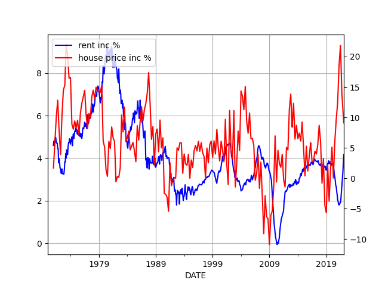
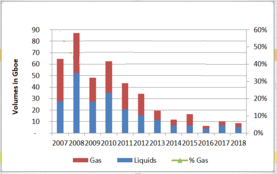
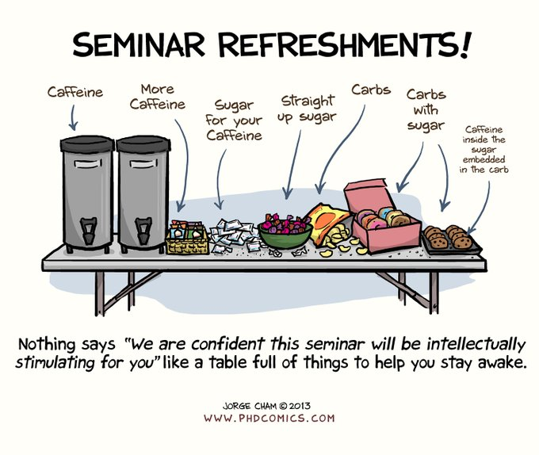

# Week 13 

---

H2 View: "Siemens Energy to begin industrial-scale electrolyser
manufacturing in Berlin, Germany"

---

H2 View: "Teco 2030, Narvik Hydrogen sign agreement to develop the
Norwegian hydrogen value chain"

---

H2 View: "Baker Hughes has revealed plans to provide hydrogen-ready
turbo-compression technology for a pipeline in Greece... This could be
a vital development not only for the Greek hydrogen value chain but
also the wider European market with a hydrogen pipeline backbone vital
in accelerating the adoption of hydrogen"

---

Strategic Petroleum Reserve has 714 million barrels capacity.. US
consumes 19.78 mil barrels per day on avg, SDR is month and a half
worth of storage.

---

H2 Fuel News: "[USG] has announced that the infrastructure necessary
to support natural gas shipments to Europe, and eventually hydrogen
fuel instead, is already being built"

---

Water shortage worries? Clean water will be all about
energy. Desalination is getting cheaper.. Energy consumption of
seawater desalination reached as low as 4 kWh/m3. If we can increase
energy output, especially green energy output, we can heat, cool,
desalinate to our heart's content.

[[-]](https://en.wikipedia.org/wiki/Desalination#Energy_consumption)

---

TDB: "Putin to Europe: Pay for Your Gas in Rubles or We’ll Cut You Off"

---

Al Jazeera: "India-Russia explore a rupee-rouble payment scheme to bypass war"

---

Low rates themselves, in a sane environment, are a result of stagnant
wages, no growth, no inflation. Tis all connected.

---

Time shift housing (2 yrs back) and check against rent, to see if
house price changes in the past caused rent increases,

```python
df.incrent.corr(df.inchouse.shift(24))
```

```text
Out[1]: 0.612
```

Not a small effect there.. since we time shifted, hint at causation

That means it takes ~2 years for house price changes to effect rents.

If there is mega rent increase now there was mega house price increase
starting 2 years ago.

That makes sense bcz 2 yrs ago was start of covid, FED rates went to
zero. In low rate environments too much speculative money chases
housing, raising the price..

If two years ago rates were higher, US would not be in this situation
today.

---

YoY rent and house price % increases below,

```python
import pandas as pd, datetime
from pandas_datareader import data

today = datetime.datetime.now()
start=datetime.datetime(1970, 1, 1)
end=datetime.datetime(today.year, today.month, today.day)
cols = ['CUUR0000SEHA','MSPUS']
df = data.DataReader(cols, 'fred', start, end)
df = df.interpolate()

df['incrent'] = (df.CUUR0000SEHA-df.CUUR0000SEHA.shift(12))/df.CUUR0000SEHA.shift(12)*100
df['inchouse'] = (df.MSPUS-df.MSPUS.shift(12))/df.MSPUS.shift(12)*100

plt.figure()
ax1 = df.incrent.plot(color='blue', grid=True, label='rent inc %')
ax2 = df.inchouse.plot(color='red', grid=True, label='house price inc %',secondary_y=True)
h1, l1 = ax1.get_legend_handles_labels()
h2, l2 = ax2.get_legend_handles_labels()
plt.legend(h1+h2, l1+l2, loc=2)
plt.savefig('out.png')
```



---

Paper on long-run relation between housing prices and rent. Says there
is causality with a delay. Let's check.

[PDF](https://www.federalreserve.gov/pubs/feds/2004/200450/200450pap.pdf)

---

"@FatherlyHQ

Rent, one of the most basic payments that many millions of Americans
have to pay monthly, is just one of the things that has exploded in
cost lately"

---

Oz deputy PM too said some mild things about Assange, that he is an
Australian citizen -which is true- and should not be tried abroad, and
some odd stuff (!) happened afterwards.. His SMS talking shit on the
sitting PM some time ago were leaked. Weird.

---

Pak PM Imran Khan is in trouble? IK isn't exactly pro-establishment,
world-order kind a guy.. I heard him defend Julian Assange once.

---

GCHQ says so.. really? It must be true then 

FT: "China’s interests ‘not well served’ by aligning with Russia, GCHQ says"

---

H2 View: "A “first-of-its-kind” facility in Israel capable of
producing 600MW of green hydrogen per year has started
development.. The.. systems will be based on a new patented technology
called Electrochemical – Thermally Activated Chemical (E-TAC).. The
technology is a breakthrough for the hydrogen industry having a 95%
efficiency rate whilst also costing less than an electrolyser to
create.. Once operational, these systems will enable the production of
hydrogen at scale for a rate around $1/kg"

---

H2 View: "Green hydrogen capacity in Germany could reach 28GW in 8
years.. The DWV said that it is possible that the country will have
reached a maximum green hydrogen supply capacity of 16.25 GW per year
by 2025. Then, by 2030, that number will have exploded to 27.8GW. This
represents a considerably higher achievement than the goal the country
has set for itself"

---

H2 View: "Hypersonix Launch Systems has received a boost in the
development of its hydrogen-fuelled platform with the [Oz] Federal
Government providing $2.95m to support its development.

The project, titled ‘DART CMP Airframe – a reusable hypersonic
platform’, is an unmanned aerial vehicle (UAV) that can travel at
hypersonic speeds up to Mach 12 (12 times the speed of sound) and is
powered by a SPARTAN hydrogen fuelled scramjet engine"

---

H2 View: "Landmark agreement to make E.ON and Fortescue Future
Industries Europe’s ‘largest’ supplier and distributor of renewable
hydrogen"

---

H2 View: "Raven SR to develop 1,600 metric tonne per year
waste-to-hydrogen project in Aragón, Spain"

---

There's a relative flattening of the curve.. Oil is becoming harder
and harder to find? More offhore, and especially "deep offshore"
exploration might be proof that it is. That fits Hubbard's thesis, he
made some good calls on US oil exploration levels before the 70s.

---

40 years give and take, taking population increase into
account. Things can work backwards of course, population can decrease
due to lower "carrying capacity". 

---

World oil reserves from [Our World in Data](https://ourworldindata.org/grapher/oil-proved-reserves?country=~OWID_WRL).
Looks like they are subtracting the extracted amount from an initial reserve estimate,
so the numbers are always the current level for each date , currently it stands at
1732 billion barrels of oil.

The world consumes 35 gboe per year. If no new oil was found current
reserves would last about 50 years.

[[-]](../../2022/01/energstats.html#oilreserves)

---

*Pastırma* is Byzantian. It was called *paston* (παστόν) during that time.

---

Experimenting with air-dried cured beef in camp food mix.. Asia Minor
has *pastırma*, others have their own .

---

NDTV: "UN General Assembly Demands Russia Withdraw From
Ukraine.. China was among the 35 countries which abstained"

---

FT: "[Russia] is prepared to let Kyiv join the EU if it remains
militarily non-aligned as part of ceasefire negotiations"

---

I guess these "Nazis" weren't such a big deal then, eh? 😉

FT: "Russia no longer requesting Ukraine be ‘denazified’ as part of ceasefire talks'

---

That's weak. A deep rabbit hole there.. Anything can be justified through this
reasoning.

"By using overwhelming force US helped both sides avoid casualties,
including Japanese. So in essence US ended up saving lives by targeting
civilians".

---

Harry Truman was a war criminal. Targeted and killed civilians right?

"They started it"? (With Pearl Harbor). US had sanctioned Japan
earlier - a form of attack. Then during Pearl Harbor Japan hit
military targets, not civilian. But later in the war US targeted
civilians through its nuke and firebombing campaigns.

---

H2 Fuel News: "Air Products has announced that it will be building and
operating its own 10 metric ton [per day] green liquid hydrogen fuel
production facility in Casa Grande, Arizona... The green liquid
hydrogen plant is slated to begin production next year. It will be
used for serving the Californian mobility market, in addition to those
in other locations that require renewable H2 to meet their net zero
carbon emission goals"

---

H2 View: "GE commences assessment to introduce.. hydrogen blends into
Uniper’s Kent power station.. [the] plant assessment..  will seek to
develop detailed solutions to enable the 1,365MW combined-cycle gas
turbine (CCGT) plant to use blends of hydrogen up to 40% by volume"

---
 
H2 View: "Alliander, GroenLeven partner for 100,000 kg per year green
hydrogen production project in the Netherlands"

---

H2 View: "Hybari hydrogen fuel cell train to begin its first Japanese
trial.. JR East passenger rail operator will start safety testing the
first hydrogen train in Japan"

---

H2 View: "New South Wales’, Australia’s hydrogen future has received a
boost with the Hunter and Illawarra Hydrogen Hubs attracting $4bn in
potential investment opportunities"

---

H2 View: "Canada Renewable Hydrogen Alliance reveals new consortium to
support domestic fuel cell and green hydrogen supply chains"

---

H2 Fuel News: "General Motors is stepping beyond passenger vehicles
when it comes to using H2 as a diesel alternative.... The automaker
views its Hydrotec fuel cell applications as appropriate for consumers
in a spectrum of industries such as shipping, construction worksites,
locomotives, aerospace, trucking, and the military"

---

What to do with the CO2?

"Turning CO2 to stone.. Basalt, which is created as lava cools,
contains calcium, iron, and magnesium, which react naturally with CO2
to form solid carbonate minerals. Within two years, 95 percent of the
injected CO2 had turned to mineral.. Basalt, which made Iceland the
ideal location, is also abundant beneath the oceans, including just
off shore from coastal power plants"

[[-]](https://phys.org/news/2016-10-co2-stone.html)

---

H2 production is possible with chemical looping

"[2012] As one of the potential [CCS] solutions, chemical looping
technologies are projected to be economically advantageous in a
carbon-constrained scenario... [The tech] utilizes a metal oxide
material as an oxygen carrier medium to indirectly oxidize the fuel
and generate high-quality heat and/or H2. Cyclic reduction–oxidation
reactions are performed in discrete reactor vessels allowing for
inherent air–fuel separation, which provides intrinsic CO2 separation
thus mitigating the cost for CO2 capture...

Chemical looping processes can be described by two key applications:
chemical looping combustion (CLC) and chemical looping gasification
(CLG). CLC processes use carbonaceous fuel sources, such as coal,
biomass, and natural gas, to reduce the oxygen carrier and are
followed by their direct oxidation with air to produce high-quality
heat, which can then be used for electricity
generation. Alternatively, the CLG system utilizes a third
intermediate step between the air and fuel reactor to produce a clean
energy carrier. Here, steam and/or CO2 is used to partially oxidize
the reduced oxygen carrier to produce H2"

[[-]](https://www.sciencedirect.com/science/article/abs/pii/S0016236112005170?via%3Dihub)

---

Video on [CLC](https://youtu.be/YD3LtbZohSc?t=30)

---

Promising carbon capture tech. 

"[A] Sino-European consortium of leading researchers and
manufacturers, has announced the construction of the world's largest
demonstration unit for Chemical Looping Combustion (CLC) [which] is an
oxy-combustion technology used to convert biomass and fossil fuels in
order to obtain a flow of pure CO2 suitable for low-cost capture"

---

I hate to say it, Le Pen mentioned some good things on energy

---

Politician mass media access is monitored by watchdog. They have
people watching, logging everything.. Wow \#France

[[-]](https://youtu.be/VEG6g3xOhyY?t=423)

---

Royal Blood - Trouble's Coming \#music

[[-]](https://youtu.be/nuYSarZXzrE)

---

The IFP link shows 2018 finds on a map, it looks pretty busy there
with seemingly big numbers but overall, the total is low. Ain't gonna
find another Ghawar 'nam sayin'? 

---

Units boe are barrels of oil, mb, or mboe is million barrels, for gas
they use boe too - in terms of energy they calculated the equivalent
amount from gas volume into barrels, so oil and gas can be measured in
same units. Gboe is billions of barrels.

---

New oil and gas discoveries per year (billion barrels of oil equivalent).
Discoveries have been falling in a big way since 2008. 



[[-]](https://www.ifpenergiesnouvelles.com/article/new-oil-and-gas-discoveries-2018)

---

Has 50 mil barrels worth, if they extracted it in a year that would be
abt 140K barrels a day, 9 Gigawatts of energy. However in a year it
wld all be GONE. Tapped out.

"New oil discovery in Gulf of Suez is one of area’s largest in 20
years.. As reported by Reuters, Egypt’s Petroleum Minister, Tarek El
Molla, said that there are about 45 to 50 million barrels that can be
extracted, which could be done in less than a year"

[[-]](https://www.offshore-energy.biz/new-oil-discovery-in-gulf-of-suez-is-one-of-areas-largest-in-20-years)

---

Most new fossil action is offshore. ExxonMobil upped its estimate for
the "Stabroek Block" find offshore Guyana, which is approx 10 billion
barrels. Largest in the world, Ghawar Saudi Arabia, had 96
billion. West Qurna Field in Iraq, 14 billion, and it is in Top 20.

Guyana is the neighbor of Venezuela, in northern SA.

[[-]](https://www.reuters.com/business/energy/exxon-raises-guyana-resource-estimate-after-new-discovery-2021-10-07/)

---

I estimate gasoline's LCOE to be at about $34/MWh. It is better than
wind, nuclear, even coal. No wonder they still seek the shit.

[[-]](../../2022/02/costs-lcoe.html)

---

"India is snapping up cheap Russian oil, and China could be next"

---

CNBC: "Russia will 'always' be a part of OPEC+, UAE energy minister says"

---

Al Monitor: "OPEC remains committed to oil production agreement with
Russia.. The Biden administration has been unable to get Gulf states
to increase oil production"

---

CH picked a relatively unattended part of the map though, Indonesia,
PNG seem to be 'neutral'?

---

China wants a base at Solomon Islands (lower right corner). Blue marks
are known US bases. 

[[-]](twimg/FO9GAupXEAk1yVO.jpg)

---

WION: "Solomon Islands' PM calls China security deal backlash 'insulting'"

---

PBS Space Time had a [video](https://youtu.be/gJ5KV3rzuag) on that
very same idea.

---

"[T]he potential terraforming of Venus has received some
consideration, beginning with Carl Sagan.. Venus also provides some
advantages over Mars for colonization with its near-Earth-like surface
gravity, an atmosphere thick enough to provide robust protection from
cosmic rays..

An alternative to terraforming the surface of Venus would be to
colonize the upper atmosphere.. Taking advantage of the twin facts
that the upper atmosphere of Venus at an altitude of 50-55 km has a
similar temperature and pressure to Earth’s surface, and that nitrogen
and oxygen are lifting gases in Venus’s CO2 atmosphere, it would be
possible to construct 'cloud cities' using aerostats filled with
breathable air that could be inhabited by humans. This method
sidesteps most of the problems of colonizing the surface; it would be
achievable with current technology, and it has reached the level of a
mission concept"

[PDF](https://arxiv.org/pdf/2203.06722.pdf)

---

Alex Howe, an astrophysicist at NASA has a new paper out on cloud
cities on Venus. Very cool. Excerpts above.

---

The Independent: "Germany says Albania and North Macedonia should be
allowed to swiftly join EU.. Olaf Scholz warns that delay will leave
Western Balkans open to ‘outside influence’ like Russia"

---

WION called Middle East as "West Asia". I like it. Middle East is too
'Western' centric, bcz the region is *to their* East. 

---

LCOH for salt caverns and LRC are very good (same doc)

---

H2 underground storage using salt cav., LRC, and pipes have capital
cost 35, 51, 386 dollars/KW respectively. That's just crazy
(cheap). 

[[-]](../../2022/02/costs-lcoe.html)

---

Same paper

"One spherical or cylindrical receiver is used to heat HTF to the
levels needed for the [thermochemical water splitting cycle]... The
optical efficiency of the ASC is high and reaches 91% in practice,
while it is 100% theoretically like the parabolic dish. Since the wind
flows through its conical rings, the wind load of the ASC is about 10%
that of the parabolic dish of the same dimensions"

---

Beam-down is interesting bcz can reach high temperatures easily, and
at that temperature, water can be split just by sheer heat energy, no
need for electricity.

---

"[2021] Recently, Al-Maaitah.. has developed a high flux solar
concentrator with a lower focal point fixed to the ground composed of
nested conical reflective rings resulting in high solar concentrations
and temperatures well above 1,000 C. Since the focal point is fixed on
the ground, then the high-temperature and high-pressure [high
temparature fluid] can easily be conveyed through solid inexpensive
pipes to the storage tank sitting at the ground underneath the
receiver or next to it. A 10 m in diameter concentrator was built and
tested in Masdar Institute Solar Platform in Abu Dhabi (UAE) where
temperatures exceeding 1,000 C have been reached at the fixed focal
point even at low DNI"

[[-]](https://www.researchgate.net/publication/351585416_Hydrogen_Production_by_Solar_Thermochemical_Water-Splitting_Cycle_via_a_Beam_Down_Concentrator)

---

What is the latest on this tech..? Can it be scaled?

---

Solar beam-down hardware in UAE - looks scifi

[[-]](twimg/FOzPnrcWUAEdFTz.jpg)

---

Focusing solar through lenses seem to be somewhat unexplored.

---

For CSP, thermal storage is unnecessary in a H2, NH3 generation
scenario, bcz renewable fuel itself is a form of backup.

---

That's like saying filling up, and emptying the gas tank degrades the
tank, and after a while you can't use half of it.

That ain't  technology - it's a joke.

---

Cycling through bats degrade it? And eventually it's dead. Sad

[[-]](https://youtu.be/Qgv6Lgvy8Lc?t=495)

---

OMG, cold survival camping! Watched a vid on someone's 'survival'
experience.. It's not exactly roughing it.. I ask; what was the
heating mechanism?  2 KW heater, **and** 3.5 inches (~9 cm) of
styrafoam insulation on the walls, floor and ceiling. That's how u
survive -29C.

---

1 barrel of oil has 1700 kWh of energy, 7000 x 1700 / (24 x 1e3) is
500 MW. Half a nuclear plant, and something solar can match, easily.
If H2 is generated on-site from that crude and clean fuel is shipped
as export, fine.

Oil Review Africa: "Eni, Sonatrach announce oil and gas discovery in
Berkine North Basin in the Algerian desert. Early estimates place the
size of the find at around 140 million barrels of oil... During the
production test, the well delivered 7000 barrels of oil per day"

---

[Link](https://drive.google.com/uc?export=view&id=1I3idJhWDMpFe-g8Sgx1BojfUUTUMqPMT)

---

C. Rock bslapped. Daam!

---

Indonesia is huge. Covers a lot of land and sea area. They have a half
of New Guinea.

---

The Douche and Douchess, failing at PR. Not their fault, the
institution becoming defunct IMO.. esp in a Brexit Britain, with less
shine, glitter it's harder to sell this lemon.

The Guardian: "It was supposed to be a visit to mark the Queen's
diamond jubilee - a chance to present the modern face of the British
monarchy to a region where republican sentiment is on the rise. But it
really didn't turn out that way.. the tour may have accelerated moves
to ditch the Queen as the head of state"

---

A liberterian working against individual liberty.. Politics is [fun](https://www.bloomberg.com/news/features/2021-09-15/peter-thiel-gamed-silicon-valley-tech-trump-taxes-and-politics)
in US, thanks to the ultra-rich.

---

It's like, we will soon find out about that, won't we, Focker?

Remember the circle of trust 👌

NYT: "[Peter Thiel interview, 2017] It’s like, even if you appointed a
whole series of conservative Supreme Court justices, I’m not sure that
Roe v. Wade would get overturned.. I don’t know if people even care
about the Supreme Court"

[[-]](https://www.nytimes.com/2017/01/11/fashion/peter-thiel-donald-trump-silicon-valley-technology-gawker.html)

---

Pakistan has great access; and the country is always in a state of
chaos. They want them in constant trouble, turned inward? One
wonders..

---

Apparently the waters until those islands are shallow so any sub
sailing there would have its ass sticking out, waiting to get hit

---

At first u think 'ah China is doing fine, [look at](twimg/FO3P7q7XsAkh0Wz.png)
all that access".

Then you zoom in and [boom](twimg/FO3P-S2XoAUWn6o.png)!
Notice that island chain is lined up like a f-ing firing squad, with
Okinawa smack in the middle housing one of the largest US bases. No wonder
China wants Taiwan (at the end of that island chain) to break
through the encirclement.

---

Iraq, Bahrain, Qatar, UAE are in abysmal state (same map), for high
seas. Iraq's access to even *Persian Gulf* is terrible... No wonder
Saddam invaded Kuwait.

---

Iran is ok.. but still can be blocked

[[-]](twimg/FO2mD50XEAEypm8.jpg)

---

Saudi Arabia is an 'inner' country. They got'em locked in good, behind
Yemen, Oman, and UAE with a few tiny access points to the high seas,
which can be blocked with ease.

[[-]](twimg/FO2l_dLX0AYGKeg.png)

---

F24: "Western powers want Saudi Arabia to pump more oil to ease
surging prices driven by the Ukraine war, but the kingdom has its own
demand: support for its war in Yemen"

---

Hungarian FM talking about US/EU natgas deal (on ships, as LNG):
Supposedly shipments wld make up for a future RU shortfall but the
amount planned is only enough for 10% of EU's need. Mere appetizer
not the main course.

---

The attack was probably a message to JB while visiting Rzeszów,
Poland, right across the border, close to Lviv.

"As focus shifted to Eastern Ukraine, there was a Russian attack on
a Western town, Lviv"

---

F24: "Macron warns against 'escalation' after Biden calls Putin a 'butcher'"

---

My native country is an outer's outpost (in NATO). Been fine with this
alliance personally i.e. it is in homie interest to have a defense
against Russia. We fought these people for centuries; once RU army was
15 km near Stanpoli nearly took the city. It was through major diplom,
'alligianery' that all was saved. Keeping 'future naval powers' at bay
cld be in US citizens' interest too...

But, the system is fraying on the edges.. The alliance arrives with
crass ideology creating unrest leading to ultra-nationalist
movements. The pack leader US doesn't seem to be willing to fight all
the time, so in order to keep the inners contained, chaos is created,
'allowed' on the edges e.g. Iraq, Libya, Syria, Ukraine... The
spillover effect is toxic for all, especially the outposts, one could
argue, even for the seat of the empire itself.

---

John Mearsheimer on rights, realism

[[-]](https://youtu.be/2_WrqOMbpLU?t=404)

---

China/India can have a fine partnership.. Chindia? 

CNBC: "In a visit shrouded in secrecy, Chinese Foreign Minister Wang
Yi flew to India and met his Indian counterpart Subrahmanyam
Jaishankar for three-hour-long talks on Friday"

---

Politico: "Macron says France will spearhead operation to evacuate
Mariupol.. ‘Exceptional humanitarian operation’ will be discussed with
Putin within days, French president says"

---

H2 Fuel News: "[Senators] Coons,.. Cornyn... introduced the new
Hydrogen for Trucks Act, S 3806. It was introduced to support the
widespread adoption of hydrogen fuel cell trucks, heavy duty vehicles
and fueling stations. Moreover, companion legislation has been
introduced in the House, HR 7064 by Representatives Katie Porter
(D-California) and Gus Bilirakis (R-Florida)"

---

H2 View: "New York Governor Kathy Hochul has confirmed that New York
wants to become a hydrogen hub"

---

H2 View: "€3.5bn project to create 1,500km hydrogen backbone pipeline
for Germany.. Hydrogen infrastructure in Germany has been handed a
significant boost with RWE and OGE unveiling a hydrogen infrastructure
concept including 1GW of new electrolyser capacity and 1,500km of
pipeline...

Dubbed *H2ercules* the plans aim to install an additional 1GW of
electrolyser capacity whilst also linking it via pipeline
infrastructure to storage and import facilities in Northern Germany"

---

H2 View: "Celtic Sea to host gigawatt-scale green hydrogen production project"

---

H2 View: "UAE, the Netherlands sign agreement to collaborate on clean hydrogen"

---

Fortesque is creating a major team around clean fuels. They snagged
the guy from Mitsubishi Power US, Browning, then the next-in-line at
Oz Central Bank leadership.. Impressive. They are gearing up for major
energy world domination.

---

H2 View: "Hydrogen ‘superhighway’ to be developed across Australia’s
eastern seaboard"

---

Same argument applies for ammonia (clean H2 carrier) or LH2, CH2.
Base molecules as fuel, as energy carrier / storage are efficient.

---

Molecules vs lion bat

[[-]](https://youtu.be/Hatav_Rdnno?t=117)

---

H2 View: "Sunfire to provide electrolyser for 20MW hydrogen production
project in Finland"

---

For concentrating sunlight through a lens, even water will do.

[[-]](https://youtu.be/eeSyHgO5fmQ?t=28)

---

---

I fast-forwarded a lot of stuff - Picard looks only half-dead w/ ff,
fans shld try (if there are any).

The show is plastic, derivative, soulless. I would expect nothing less
from the muckers around Jar Jar Ibrahim.

---

They go back to 2024; maybe they'll talk to teenagers posting on
Instagram "I'll show that pic to fam, so phat, no cap!!"

---

[Link](twimg/FOtz1wGWYAEXD-l.jpg)

---

There is time travel! That's original.. Now we are in ST IV *The
Voyage Home* territory. Like when Spock became a hippie, there was
that whale?

Dude. I'm so bored already.

---

[Link](twimg/FOtwzPcXIAM0ZV6.jpg)

---

*Picard* is turning into STE *In a Mirror Darkly*.. The engineer gets
a scar, the female first officer an open belly uniform? (Rrrr that was
good). There's crazy behaviour, captain is weird (he bad), and of
course, someone gets a goatee

---

"Singapore to ease Covid measures, reopen borders and drop outdoor
mask mandate"

---

Chris Joss - Re-volt \#music

[[-]](https://youtu.be/mrJVQWvOuCE)

---

WION: "China, Solomon Islands finalising pact to establish military
presence at ‘Australia’s backyard’"

---

<blockquote class="twitter-tweet"><p lang="en" dir="ltr">smart ovens on the block chain are gonna rule. will take 10 hours just to verify you&#39;re allowed to start it up. <a href="https://t.co/V7tyo9cRqb">https://t.co/V7tyo9cRqb</a></p>&mdash; Internet of Shit (@internetofshit) <a href="https://twitter.com/internetofshit/status/1506733827581915137?ref_src=twsrc%5Etfw">March 23, 2022</a></blockquote> <script async src="https://platform.twitter.com/widgets.js" charset="utf-8"></script>

---

The AI mentioned is weak AI, some dumb neural network with lots of data
stuffed in at best. Or it's misuse of terminology, a statistical model
plus some optimization.

---

US Navy drone sensor network in the Gulf 

'Total surveilance' eh? .. 

[[-]](https://youtu.be/4RwU1tc_E7Y)

---

"We asked [researcher] Leigh what sparked his interest in severe
weather 'It was an actual spark that sparked my interest! When I was
five years old, shortly after my family moved into a new house in
western Massachusetts, our house was struck by lightning'"

[PDF](https://futurumcareers.com/Leigh-Orf-Using-supercomputers-to-simulate-super-tornadoes.pdf)

---



---

After Midnight - Bei Mir Bist Du Schon \#music

[[-]](https://youtu.be/cwXRsXTPzfs)

---

F24: "Egypt will apply for a new loan from the IMF, the
Washington-based crisis lender announced Wednesday, after Russia's
invasion of Ukraine caused inflation to spike in the Middle Eastern
nation"

---

Politico: "[The war] in Ukraine has brutally exposed the flaws in
Western security architecture.. 'The United Nations Security Council
has proven once again to be useless,' one political scientist said"

---

Back during WWI artillery at least had some adventure, 'battlefield
bravery' associated with it, one tactic had infantry advance under
artillery protection / shelling ahead of troops, so when soldiers
reached their target the place would be enemy-free. Troops had to move
very carefully tho, otherwise u get hit too..? The danger!.. I believe
Canada used this technique succesfully a few times (yes, Canada!).

Nowadays after the advent of radio communication, it's all different.
Infantry will explore, pick a target, report back to artillery group,
who will bomb the place from 20 kilometers away. The poor sod getting
blown up won't know what hit him, being shelled by someone who has no
idea who he is, identified by infantry who is completely seperate from
the bombing itself. Tis the modern war.

---

It's true.. 

Al Jazeera: "'This fighting is not how you imagine it from the
movies,' said [Ukrainian filmmaker] Sentsov.. 'Close contact, shooting
from small arms, there is not so much of it. Most of the time this is
artillery and your task is to hold the front line in the trenches, and
not to die from the shelling'

---

I see; if captured they could be used as a propaganda tool.. makes
sense

---

Then the "sniper king" Wali shouldn't have gone?

"Canada bars its soldiers from joining Ukraine’s foreign legion"

---

