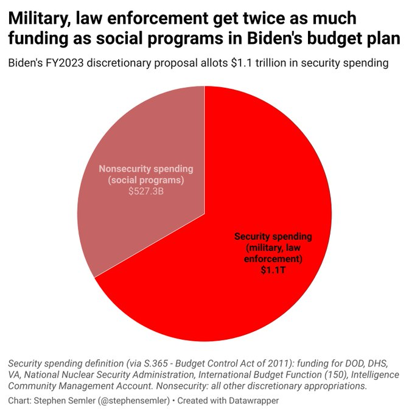

# Week 14 

---

<blockquote class="twitter-tweet"><p lang="en" dir="ltr">More than 100 million tonnes of <a href="https://twitter.com/hashtag/GreenHydrogen?src=hash&amp;ref_src=twsrc%5Etfw">#GreenHydrogen</a> will be traded internationally each year by 2050 says <a href="https://twitter.com/IRENA?ref_src=twsrc%5Etfw">@IRENA</a> with Chile, North Africa and Spain would together represent almost 75% of the global pipeline hydrogen trade | via <a href="https://twitter.com/rechargenews?ref_src=twsrc%5Etfw">@rechargenews</a> <a href="https://t.co/5ixjfOXZ2K">https://t.co/5ixjfOXZ2K</a> <a href="https://twitter.com/hashtag/cleanenergy?src=hash&amp;ref_src=twsrc%5Etfw">#cleanenergy</a> <a href="https://t.co/gpsx322j8L">pic.twitter.com/gpsx322j8L</a></p>&mdash; Scott Poulter (@sfpoulter) <a href="https://twitter.com/sfpoulter/status/1511614045488652291?ref_src=twsrc%5Etfw">April 6, 2022</a></blockquote> <script async src="https://platform.twitter.com/widgets.js" charset="utf-8"></script>

---

H2 View: "[Woodplc] unveils next generation SMR technology to reduce
hydrogen production’s carbon intensity The company has said that the
new SMR technology, applicable for both greenfield and brownfield
projects, will reduce CAPEX and OPEX for operators while improving the
environmental footprint and efficiency of new or existing hydrogen
production assets through integrated pre-combustion carbon capture"

[[-]](https://www.h2-view.com/story/wood-unveils-next-generation-smr-technology-to-reduce-hydrogen-productions-carbon-intensity/)

---

"@ArgusMedia

The European Hydrogen Backbone (EHB) initiative has stepped up its
ambitions for a pan-European hydrogen pipeline network in response to
EU proposals to boost green hydrogen production and imports"

---

"@hazergroupltd

Utilities companies @RWE_AG & @OpenGridEurope have announced a €3.5
billion investment into Germany’s hydrogen infrastructure, with plans
to increase its electrolyser capacity to and build a pipeline network"

---

H2 View: "McDermott’s to build green hydrogen production plant spheres
for Plug Power.. CB&I will be constructing two 500,000-gallon
double-wall liquid H2 spheres in New York state"

---

H2 View: "IPCC sixth assessment report on climate change highlights
the vital role hydrogen will have in tackling global warming"

---

H2 View: "US Defense Innovation Unit awards Skydweller $14m to
continue development of hydrogen-powered aircraft"

---

<blockquote class="twitter-tweet"><p lang="en" dir="ltr">In Forkliftaction News – German engine maker Deutz has launched their first hydrogen engine, the TCG 7.8 H2. Read the report: <a href="https://t.co/HL2eTIMv6G">https://t.co/HL2eTIMv6G</a><a href="https://twitter.com/hashtag/Hydrogen?src=hash&amp;ref_src=twsrc%5Etfw">#Hydrogen</a> <a href="https://twitter.com/hashtag/Engines?src=hash&amp;ref_src=twsrc%5Etfw">#Engines</a> <a href="https://twitter.com/hashtag/ForkliftactionNews?src=hash&amp;ref_src=twsrc%5Etfw">#ForkliftactionNews</a></p>&mdash; Forkliftaction - FLA (@Forkliftaction) <a href="https://twitter.com/Forkliftaction/status/1434838289371078661?ref_src=twsrc%5Etfw">September 6, 2021</a></blockquote> <script async src="https://platform.twitter.com/widgets.js" charset="utf-8"></script>

---

"@ArgusMedia

Australian energy regulators have proposed drafting a change of rules
governing the gas sector to allow the blending of \#hydrogen.. in gas
pipeline networks"

[[-]](https://twitter.com/ArgusMedia/status/1509479174867722242)

---

H2 View: "CEO of Raven SR, on their waste-to-hydrogen technology: [W]e
can take the Chinese take away, process the rice that’s inside of it,
the cardboard container, the plastic fork or the plastic chopsticks
that are with it and the little metal container. The whole thing can
go into our system. I don’t have to separate all that and we take it
wet, which is really unique. Many processes have to dry it. Many
processes have to be very selective on their waste, so it gives us
that ability to work very closely where waste is, whatever that waste
might be.. [This is] why Raven SR’s technology is making such waves in
the industry. Several waste products can be taken, including negative
wastes such as plastics, and be converted into hydrogen"

---

Mongolian gov should encourage converting those coal plants into IGCC,
or oxy-combustion coal plants which have CCS. Generate clean fuel,
pipe fuel to homes. Install [H2 ready boilers](twimg/FPxKxr1X0Ag0WD7.jpg).
Done. 

---

Mind-boggling.. 

The Mirror: "The sky could be the brightest blue, but in the winter
months no one in Mongolia’s capital city would be able to tell because
of the lingering smog.. In winter, temperatures in the world’s coldest
capital can plummet to minus 20 and the only way for many people to
stay warm is to burn raw coal"

---

H2 Fuel News: "Leading Indian oil refiners invest in renewable
hydrogen projects.. The largest oil refiner in India, the Indian Oil
Corp. Ltd., and a large H2 user have entered into a partnership for
producing renewable hydrogen with clean energy company ReNew Power and
Larsen & Toubro Ltd"

---

H2 Fuel News: "Hyundai subsidiary Supernal plans for hydrogen
aviation.. The firm has intentions for both H2 aircraft and eVTOL
craft for use for regional flights"

---

H2 View: "Mitsubishi, Shell to collaborate on generating green
hydrogen from 4GW of offshore wind farms in the Netherlands"

---

Cannot have people living on sidewalks.. If they have rights, as city
inhabitants, so do we. And the larger injustices need to be addressed
I agree. Homes have been too expensive, effecting all prices down the
line.

---

Good move.. do they also provide housing? 

"Mayor Adams invokes cleared NYC homeless encampments"

---

Japan wanted to buy F-22 but were denied. So they built their own,
the so-called F-X.

---

F-35 always sounded like a produce-by-commitee, bastardized version of
a combat airplane. F-22 though more expensive was top notch (but
discontinued). An updated F-22 would be a boon but US spending is too
much on def already. And still no M4A.

---

Business Insider: "The era of unlimited options at the grocery store
is likely a thing of the past. Have you been to the grocery store
recently and noticed that one of your regular buys was missing? You're
not going crazy. The pandemic has caused workforce issues that mean
it’s more expensive to produce the same amount of goods, and a key
strategy to deal with that is to reduce the varieties of products
manufactured"

---

Governors, local politicians should have a say on who is allowed into
their states.

CNN: "Texas to send busloads of undocumented immigrants to the US
Capitol, Gov. Greg Abbott says"

---

It has to be tough being a Brit; a lot of the current hotspots are
there because of your country's past (and current) deeds. Dam.

---

They can't assert shit unless somebody is blowing that wind beneath
their wings.. That's how you "fly high". Papa Aliyev had come to power
thanks to a "BP Coup" back in the day, BP as in British Petroleum, and
recent war gains are possibly due to a nudge from UK again and the
other "poodle's poodle".

"Aliyev is flying high, sounds like a strong leader with assertive
policies"

---

[Link](https://drive.google.com/uc?export=view&id=1CwjA1jcslEULRm7FS4EAFqex7WOv9sCW)

---

Rules are needed to 'rule' over a distance right; They are good
internally, but they are *especially* needed to rule over subjects
externally, at a distance. Rules. If ppl dont follow them, send a
"double O agent" with a license to kill.

"AUKUS makes ‘unwavering’ pledge to peaceful, rules-based order"

---

Is NoKo animosity partly manfactured to justify the presence of US
bases in the South, the real aim is good ol' containment 🤔 ?

---

There are so many US bases in SoKo that, at a certain zoom level, it
blocks the entire country from view on a map.

[[-]](twimg/FPuKPElXwAQ53sQ.png)

---

This guy is a win for the 'inner alliance'. Also possibly a reaction
to over-capitalism; *Squid Game* is not a one-off aberation? There
could be trouble in paradise. Still in general South Korea did well.
Has famous brands, good inno, a leg-up on clean fuels.

"South Korea's president-elect wants US nuclear bombers, submarines to return"

---

War crime

Politico: "After a period of testing, on this day in 1962, President
John F. Kennedy gave final approval to.. a massive effort to defoliate
the forests of Vietnam, Cambodia and Laos with an herbicide known as
Agent Orange...During the decade of spraying, more than 5 million
acres of forest and 500,000 acres of crops were heavily damaged or
destroyed...

Dean Rusk.. had told Kennedy.. that '[t]he use of defoliant does not
violate any rule of international law concerning the conduct of
chemical warfare and is an accepted tactic of war. Precedent has been
established by the British during the emergency in Malaya in their use
of aircraft for destroying crops by chemical spraying.'

In 1967, 17 Nobel laureates and 5,000 other scientists signed a
petition asking for the immediate end to the use of herbicides in
Vietnam. The administration ignored it...

The spraying program led some 3 million Vietnamese to suffer health
problems caused by exposure to Agent Orange, including a million birth
defects"

---

US, RU trade \#WION

[[-]](https://youtu.be/joleQTFv0T8?t=458)

---

WSJ: "Zelensky rejected peace offer days before Russian offensive"

[[-]](https://www.rt.com/news/553213-zelensky-scholz-ukraine-peace/)

---

WION: "Hungary: Ready to pay for gas in rubles"

---

I see; 'material' not 'financial'. 

WION: "US threatens Beijing with sanctions if it provides ‘material
support’ to Moscow"

---

Nat King Cole - Lush-Life (Remix by Cee-Lo) \#music

[[-]](https://youtu.be/rBuIySLwIwE)

---

<blockquote class="twitter-tweet"><p lang="en" dir="ltr">EHB targets 28,000km of hydrogen pipelines by 2030 <a href="https://twitter.com/hashtag/hydrogen?src=hash&amp;ref_src=twsrc%5Etfw">#hydrogen</a> <a href="https://twitter.com/hashtag/energy?src=hash&amp;ref_src=twsrc%5Etfw">#energy</a> <a href="https://twitter.com/hashtag/renewablenergy?src=hash&amp;ref_src=twsrc%5Etfw">#renewablenergy</a><a href="https://t.co/HsAI9evVvQ">https://t.co/HsAI9evVvQ</a></p>&mdash; EnergyNews.biz (@EnergyNews_Biz) <a href="https://twitter.com/EnergyNews_Biz/status/1511617823545729024?ref_src=twsrc%5Etfw">April 6, 2022</a></blockquote> <script async src="https://platform.twitter.com/widgets.js" charset="utf-8"></script>

---

H2 View: "25GW hydrogen megaproject in Oman gains traction with a
potential output of 1.8 million tonnes of green hydrogen per year"

---

H2 View: "Scotland will gain a new green hydrogen production project
with SSE Renewables and Siemens Gamesa Renewable Energy partnering to
convert 100MW of onshore wind energy into the clean energy carrier"

---

H2 View: "Revolutionary floating offshore hydrogen production plant
awarded... [to be] developed by J-DeEP in Scotland"

---

"@CSIRO

Dr Patrick Hartley, head of our Hydrogen Industry Mission, with Dr
Alan Finkel @AusGov_OSALET and our @toyota_aus Mirai hydrogen vehicle
at last week’s arrival in \#Melbourne of the world’s first liquefied
\#hydrogen carrier, the Suiso Frontier"

[[-]](https://twitter.com/CSIRO/status/1486896827022594052)

---

"@AusGov_OSALET [Feb 2022, Alan Finkel]

Good news from the fourth India-Australia Energy Dialogue!
@AngusTaylorMP and @OfficeOfRKSingh have signed the Letter of Intent
on New and Renewable Energy Technology. The focus is on ultra low-cost
\#solar and clean \#hydrogen"

[[-]](https://twitter.com/AusGov_OSALET/status/1493820327750553600)

---

"Suncor getting out of wind and solar; will shift focus to hydrogen and
renewable fuel..  the Calgary-based company says it still intends to
be net-zero emissions by 2050, but will accelerate progress towards
that target by focusing on hydrogen and renewable fuels instead..

[They will replace] coke-fired boilers at its Base Plant oilsands
project near Fort McMurray, Alta., with lower emission cogeneration
units, as well as accelerating commercial-scale deployment of carbon
capture technology...

It also notes it’s partnering with ATCO on a project to build a
world-scale hydrogen project in Alberta and deploying next-generation
renewable fuel technologies like LanzaJet’s sustainable aviation fuel
technology and Enerkem’s waste-to-fuels technology"

[[-]](https://pipelineonline.ca/suncor-getting-out-of-wind-and-solar-will-shift-focus-to-hydrogen-and-renewable-fuel/#/?playlistId=0&videoId=0)

---

Defund the grid. [Pipes over wires](twimg/EvdKNhvXAAE9Rr2.png).

The Independent: "Storms batter aging power grid as climate disasters
spread.. Power outages from severe weather have roughly doubled over
the past two decades"

---

Dude forget that cos, sin, arccos spherical distance shit,
`pygeodesy.sphericalNvector` is your friend

---

Some claim the dimming event triggered seismic changes in history;
famine displaced people who displaced others, discredited some
existing religions increased interest for new ones (eg Islam, Mohammed
was born in 570).

History Channel: "[I]n 536 A.D., much of the world went dark for a
full 18 months, as a mysterious fog rolled over Europe, the Middle
East and parts of Asia. The fog blocked the sun during the day,
causing temperatures to drop, crops to fail and people to die... 

Now, researchers have discovered one of the main sources of that
fog. The team reported in Antiquity that a volcanic eruption in
Iceland in early 536 helped spread ash across the Northern Hemisphere,
creating the fog. Like the 1815 Mount Tambora eruption—the deadliest
volcanic eruption on record—this eruption was big enough to alter
global climate patterns, causing years of famine.

What exactly did the first 18 months of darkness look like? The
Byzantine historian Procopius wrote that 'the sun gave forth its light
without brightness, like the moon, during this whole year.' He also
wrote that it seemed like the sun was constantly in eclipse"

[[-]](https://www.history.com/news/536-volcanic-eruption-fog-eclipse-worst-year)

---

New Scientist: "In the year 536 the sun dimmed and the world shivered,
leading to famine, plague and the fall of empires"

---

Hey I like this "neomodernism"

Wiki: "Neomodernists maintain that truth still exists in a universal
form and directly refute existentialist and postmodern viewpoints that
the essence of an existent is formed in the observer's
bias. [N]eomodernism rejects postmodernism as:

Unscientific: the ability of science to generate useful knowledge
cannot be waved away as "scientism".

Journalism: as not giving any explanation as to how or why things
happen.

Local: as being unable to recognize patterns that occur across time or
location.

Unverified: as lacking any validation process, and therefore
proceeding by fad and hierarchy"

---

Video on the First Light technology

<blockquote class="twitter-tweet" data-conversation="none"><p lang="en" dir="ltr">⚛️ It says the method is simpler and more energy efficient than rival approaches, and it has reached this point at record rates of progress… <a href="https://t.co/6ZP23dfSO2">pic.twitter.com/6ZP23dfSO2</a></p>&mdash; Telegraph Business (@telebusiness) <a href="https://twitter.com/telebusiness/status/1511292001530036224?ref_src=twsrc%5Etfw">April 5, 2022</a></blockquote> <script async src="https://platform.twitter.com/widgets.js" charset="utf-8"></script>

---

Simple fuel, projectile, molecule based approach is much better than
bitch-electric, bitch-magnet, bitch-laser approaches. Heat, pressure,
mass, molecules, protons, neutrons - these form the crux of what's out
there, ie reality.

"First Light is taking a unique projectile fusion approach to solve
[the] challenge, which it believes offers the fastest, simplest and
cheapest route to commercial fusion power. This means that instead of
using complex and expensive lasers or magnets to generate or maintain
the conditions for fusion, First Light’s approach compresses the fuel
inside a target using a projectile travelling at tremendous speed"

[[-]](https://firstlightfusion.com/media/fusion)

---

This Dr. Tatsuya Kodama does good work; does research on solar
beam-down and H2 generation through high heat, wout electrolysis, has
Oz CSIRO ties.

[[-]](twimg/FPpiN4eXEAQTllx.jpg)

---

H2 View: "[European Investment Bank] and ICO invest €88m to develop
one of the largest green hydrogen production plants for industrial use
in Europe"

---

Their punch bowl is being taken away no more parteh

CNBC: "Key people from the Fed just spooked the markets - here's what
they said.. Fed Governor Lael Brainard and San Francisco Fed President
Mary Daly both issued comments that showed they both envision higher
rates and, in the former's case, an aggressive drawdown of the assets
the central bank is holding on its balance sheet..

Investors didn't particularly like what they heard, sending major
averages considerably lower on the day"

---

Unforscene - Dirty and Dark \#music

[[-]](https://youtu.be/FXw3r6r9R28)

---

T. Frank: "Frederick Dutton, Democratic Party power
broker.. identified workers, the core of the New Deal coalition, as
'the principal group arrayed against the forces of change'... The
culture in those years was saturated with depictions of blue-collar
bigots doing scary things like shooting the main characters in Easy
Rider and rioting in support of the Vietnam War...

Still, a man like Dutton should have known better. A glance at the
union placards carried by marchers at Martin Luther King’s 1963 March
on Washington —or at the way the United Auto Workers lobbied for the
Civil Rights Act of 1964 —or at the 1968 strike of black sanitation
workers in Memphis—should have been enough to suggest that the Archie
Bunker stereotype was not the whole story. Besides, what kind of
Democrat gives up on basic economic issues in order to focus on
matters of 'the psyche' and 'the soul'? This was not politics; it was
psychotherapy. Worse: it was aristocratic hauteur disguised as
enlightenment"

---

Why not? The job may not involve high skill but there is clearly a
demand for it.

"Truck drivers should not make the same amt of money as software
developer"

---

Are they unionized? They could push for workplace rules.

Rollling Stone (via Jon Oliver): "There are about 3.5 million truck
drivers in America, yet trucking companies have long claimed there’s a
shortage of drivers that threatens to derail — OK, further derail —
the supply chain. Except, the actual problem isn’t too few truckers,
it’s too few truckers willing to put up with all the terrible bullshit
truckers are forced to put up with"

---

Subtract imports from GDP (to see locally produced goods with locally
worked hours), divided total hours worked with it - gives numbers of
hours worked per unit GDP. Ratio has been decreasing for the past 70
years.

The reason for that decrease IMO is either technology, or too much
efficiency is being squeezed out of employees at the expense
of.. something. Wages? Maybe at Amazon you won't be allowed to take a
bathroom break?


```python
import pandas as pd, datetime
from pandas_datareader import data
today = datetime.datetime.now()
start=datetime.datetime(1945, 1, 1)
end=datetime.datetime(today.year, today.month, today.day)
df = data.DataReader(['GDPC1','B4701C0A222NBEA','IMPGS'], 'fred', start, end)
df = df.interpolate()
df['hrs_per_dollar'] = df.B4701C0A222NBEA/(df.GDPC1-df.IMPGS)
print (df['hrs_per_dollar'].tail(4))
df['hrs_per_dollar'].plot()
```

```text
DATE
2021-01-01    15.413216
2021-04-01    15.265204
2021-07-01    15.244684
2021-10-01    15.118662
Freq: QS-OCT, Name: hrs_per_dollar, dtype: float64
```

[Graph](twimg/FPfMHYJWUAAsACj.png)

---

Data disagrees - see above

"Productivity is stagnant"

---

Left Voice: "In a Historic Victory, Staten Island Workers Form the
First U.S. Amazon Union"

---

AMZN, Blue Origin can do some good in space industry.. When are
they building O'Neill Cylinders?

[[-]](2020/09/space-exploration-goals-colonization.html#oneill)

---

AFP: "Amazon has secured deals to launch up to 83 rockets carrying its
internet satellites into low earth orbit, in what is believed to be
the largest such procurement in the history of the space industry"

---

AFP: "Amazon has announced deals with Arianespace, Blue Origin and
United Launch Alliance to take thousands of satellites into orbit for
a space internet network called Project Kuiper"

---

😂 

"1984: Chlolesterol, and now the bad news..

2014: Eat Butter"

[[-]](twimg/FPk32mnWQAYJ8oA.jpg)

---

Leaving a sinking ship?

"Jen Psaki to leave White House for MSNBC gig"

---

Left Voice: "Greek Railroad Workers Block Delivery of U.S. Tanks to
Ukraine"

---

Can cause a contagion

CNBC: "Russia debt default prospect resurfaces as U.S. blocks bond
payment"

---

<blockquote class="twitter-tweet"><p lang="en" dir="ltr">👀 🛩 GTL ultralight aircraft tank just 67kg holds ~150kg of liquid <a href="https://twitter.com/hashtag/hydrogen?src=hash&amp;ref_src=twsrc%5Etfw">#hydrogen</a> 💪enough for 8hr 4,500km flight with <a href="https://twitter.com/hypointinc?ref_src=twsrc%5Etfw">@hypointinc</a> system. The future of <a href="https://twitter.com/hashtag/zeroemission?src=hash&amp;ref_src=twsrc%5Etfw">#zeroemission</a> ☘️flight. H2 tech just keeps on accelerating <a href="https://t.co/0BSPCaf0UB">https://t.co/0BSPCaf0UB</a></p>&mdash; Jon Hunt (@JontheHunt) <a href="https://twitter.com/JontheHunt/status/1510898984365301763?ref_src=twsrc%5Etfw">April 4, 2022</a></blockquote> <script async src="https://platform.twitter.com/widgets.js" charset="utf-8"></script>

---

H2 Fuel News: "HyPoint predicts fuel cell aircraft with 4 times range
of conventional planes.. The company expects that this will occur
because of the ultra-light cryotank developed by GTL"

---

H2 View: "One solution [for H2 storage] that has been overlooked is
liquid organic hydrogen carriers.. LOHC are organic compounds that can
absorb and release hydrogen through chemical reactions... In
principle, every unsaturated compound (organic molecules with C-C
double or triple bonds) can take up hydrogen during hydrogenation..
One m³ LOHC enables the safe storage of 57 kg H2"

---

H2 View: "France has recently announced a €7bn package to build a
carbon-free hydrogen industry. Germany issued a similar program of
€9bn and that has intensified as their reliance on Russian gas is
threatened. In July, the European Commission said it is looking to
increase its production capacity of electrolysers from 250MW today to
40GW in 2030. Similar strategies have been released by the UK,
Australia, and Asian countries. These are just some of the most recent
announcements, but they show a clear trend towards massive public
investments in the sector"

---

Businesswire: "Locosoco pleased to announce discussions are underway
with Proton Technologies, a leader in the field of Clean Hydrogen
Production that utilises existing fossil fuel infrastructure.. Proton
Technologies [tech creates] carbon-free, low-cost opportunity for
extracting hydrogen using previously expensed infrastructure and known
energy deposits.. [which allows] extraction of clean hydrogen whilst
sequestering carbon within existing oil wells"

---

We could complement the transition with CCS. Many green advocates are
fine with blue H2 generated from natgas with carbon capture (of course
solar is preferable). People who lobby, produce lit on this stuff need
to laser focus on proper engineering, and costs.

Report: "Greenhouse gas emissions need to be reduced by 43% and methane
by about a third by 2030 that can only happen if countries reduce
their dependence on fossil fuels and replace it with renewable energy"

---

WION: "United Nations warns that it's 'now or never' to avoid climate catastrophe"

---

Condemnation rituals.. Will that help? 

Maybe Japan should have just condemned Harry Truman for his war crimes
in Japan in 1945, instead of making a deal.

---

The play could be an inner-outer battle too.. Abdullah's mother is
British - some say the only reason he got the job

---

Jordan is land-locked too except a tiny sea access. 

---

What was the aim for toppling Abdullah again? He wasn't for the accords?

I know Abdul is a Trekkie (had a cameo on Voyager) nothing particularly against him

---

Trump gone, he gone.

"[King's brother] Jordan's Hamzah renounces title of prince"

---

The backdrop changed of course throughout the Craig era; there was the
2008 crisis, failures in Iraq, Syria, refugees, more crisis.. Surely
these effected the mood later.

---

*Bourne Identity*, the first movie in the series, isn't exactly a post
9/11 movie. It was written, filmed 1999/2000, due to delays it hit the
theathers 2002. That is clear to see in the content; plus the director
Liman's father was Senate chief counsel on the Iran-Contra affair, so
he was making a movie around that stuff, shady biz, underhanded
spycraft etc. Later two Bourne movies are different.

---

*Casino Royale* was a good action movie, no arguments there.

---

After many globetrotting adventures (an "outer belt" hero, Master of
all Faraway Lands) 9/11 Bond died near European landmass, after
fighting a foe played by an ethnically Egyptian actor.

---

The 9/11 Bond, "James Blonde", has died. It's interesting the first
major action scene has Bond killing, beating on colored people in a
Caribbean setting. Post 9/11 Jason Bourne would soon follow suit.

Arabs aren't black but hey, close enough, they just found the nearest
non-white folk and beat up on them. Fureigners, A-rabs and the like,
you've been warned.

---

:) James Bond's grave at Faroe Islands

Spoiler: the last movie has Bond die there. The island now uses it as
touristic attraction apparently.

[[-]](twimg/FOrhf5CXMAg-Z3g.jpg)

---

The migration that resulted due to the partition was especially bad
with deaths reaching up to a million. That too is on the Brits.

Al Jazeera: Before leaving India [1947], the British made sure a
united India would not be possible... East and West Pakistan were
hacked off the stooped shoulders of India by the departing
British.. Within months, India and Pakistan were embroiled in a war
over Kashmir, the consequences of which still affect us today. The
creation and perpetuation of Hindu-Muslim antagonism was the most
significant accomplishment of British imperial policy: the colonial
project of 'divide et impera' (divide and rule) fomented religious
antagonisms to facilitate continued imperial rule"

---

Kashmir? Britain's fault

---

It makes sense for Pak to get buddy-buddy w China, Russia; since India
rels are always on the rocks. Cant blame a guy for wanting friends,
energy deals, ports and roads for his country.

---

Additional info [here](2021/03/unrivaled-beckley.html#taiwan).

---

Al Jazeera: How hard would it be for China to invade Taiwan?

[[-]](https://youtu.be/qaYQNyJlNFk)

---

<blockquote class="twitter-tweet"><p lang="en" dir="ltr">In a top <a href="https://twitter.com/hashtag/H2View?src=hash&amp;ref_src=twsrc%5Etfw">#H2View</a> <a href="https://twitter.com/hashtag/hydrogennews?src=hash&amp;ref_src=twsrc%5Etfw">#hydrogennews</a> story this week we saw that Germany’s <a href="https://twitter.com/hashtag/hydrogen?src=hash&amp;ref_src=twsrc%5Etfw">#hydrogen</a> refuelling infrastructure will receive a substantial boost.<a href="https://twitter.com/Hy24partners?ref_src=twsrc%5Etfw">@Hy24partners</a> is set to provide €70m ($77m) in funding to support <a href="https://twitter.com/H2_MOBILITY_DE?ref_src=twsrc%5Etfw">@H2_MOBILITY_DE</a>.<a href="https://twitter.com/hashtag/HydrogenNow?src=hash&amp;ref_src=twsrc%5Etfw">#HydrogenNow</a><a href="https://t.co/rPitiEnVi1">https://t.co/rPitiEnVi1</a></p>&mdash; H2 View (@h2_view) <a href="https://twitter.com/h2_view/status/1510343781991817224?ref_src=twsrc%5Etfw">April 2, 2022</a></blockquote> <script async src="https://platform.twitter.com/widgets.js" charset="utf-8"></script>

---

Fermilab physics video below. Summary: Mass is an illusion. Proton,
neutrons are the shit. Higgs Boson is not a big deal.

[[-]](https://youtu.be/x8grN3zP8cg?t=81)

---

TDB: "IBM’s Watson, who trounced the greatest Jeopardy! players on the
classic game show—but needed to be hard-wired to the show’s
question-posing system. He was incapable of doing an autonomous task
that any three-year-old could do: listening for the host to finish a
question before buzzing in"

---


Sounds like bunch of unnecessary pain.. Test based restrictions are
excessive.. Left over policy from beginning of pandemic.

TDB: "On the day my wife and I were to fly home from London after a
brief visit, we took a COVID-19 test.. My wife’s test was negative. My
test was positive. She flew out.... So I was looking at 10 days of
hotels, which are not cheap in London. It’s not as if I can call a
friend here and say, “Hey, I got covid. Can I crash on your living
room sofa?”

[Gets covid] My symptoms quickly went away, and after four days I felt
fine again... But, now, how do I get back? Here’s the problem. There
is a chance that some little piece of the virus remains in my body. So
if I take another test and it’s positive, I’m stuck here again—with no
symptoms except a bleeding wallet"

---

Besides the need to provide bed-time stories for their shoddy
nation-building, Asia Minor Turkist propaganda was useful for British
interests; they could use it as a cudgel for the continuation of the
Great Game in Asia, eg if you can create an illusion of unity between
TR and "the Stans", some of which are "ethnically similar", u could
then be provoke those countries against their immediate neighbor.

But the act is getting old.. Plus TR's problems compound whose very
foundation was crooked (that's what you get with second rate
founders). People live in a bastardized world of their true culture
which is incompatible with national narrative that constantly leads
them astray, or at best, keeps them stagnant which is the case today
(middle-income trap). 

---

Because US was caught doing undemocratic shit, its protests on the
Egyptian coup registered less. The revelations might have even given
Sisi the PR cover he needed for the coup.

---

Timeline reminder

June 2013: An NSA contractor Edward Snowden starts sharing gov secrets
with the media. Americans learn that their government was spying
broadly on its own people.

July 2013: A military coup in Egypt removes President Morsi from
power.

---

Looking at the map, Philippines would be key for the outers to contain
China.. But what happens after Duterte?

"U.S., Philippines Hold One of Their Largest-Ever Military Exercises"

---

Orban wins again. He is lambasted on immigration, but on process we
have to accept forcing countries to accept new people if their
democratically elected government does not agree would be
undemocratic.

---

FT: "China has reaffirmed its partnership with Russia in the wake of
the Ukraine invasion and says it wants to push bilateral relations 'to
a higher level'"

---

NYT: "Syrian mercenaries deploy to Russia en route to Ukrainian
battlefields Hundreds of Syrian fighters are en route to join Russian
forces in Ukraine, effectively returning the favour to Moscow for
helping President Bashar Assad crush rebels in an 11-year civil war,
according to two people monitoring the flow of mercenaries"

---

Moldova is NATO-friendly? If they were opportunistic they would give
Russia access for Western Ukraine in return for Odessa Oblast.

---

TBH Ukraine had ownership of some prime land that was beyond its
capacity to hold onto. They needed massive deterrence, or major
forsight on diplomacy to make self less threathening to others
(RU). Ukraine had neither.

---

Moldova was screwed, historically speaking; had zero sea access until
2005, now have a *tiny* port, and had to trade land with Ukraine to
get it. Reminds me the bitch borders of Iraq drawn up by Western
powers..  Sad.

In a natural evolution of borders Moldova would have the land reaching
all the way to the Black Sea, areas currently belong to Ukraine.

[[-]](twimg/FPZe1sNXoAcqpvu.jpg)

---

Immediate UKR south is in danger being closed off to sea access for
Ukraine. No wonder Odessa is being attacked.

---

The map suggests a possible region for attack would be that pocket
shown with arrow, and yes, Severodonetsk, Rubizhne, Lysychansk,
Kreminna, Hirske, Popasna Berezove, Toshkivka - all being shelled. If
RU takes the region the red block will get bigger.

[[-]](twimg/FPZVQEpWYAE1r0R.png)

---

MSM is not even providing Liveuamap level reporting here. See the red
regions in the map. Those are RU areas; not newsworthy? 

[[-]](twimg/FPZWhNmX0AQ7ALF.png)

---

Watching the corporate media you'd think Ukraine is winning big, if
there was just some extra hardware, they'd finish the war today

---

*The Contractor*, not bad

---

H2 View: "Yara to boost the hydrogen industry with the creation of [a]
carbon-free ammonia fuel bunker network"

---

H2 View: "Lidl puts 98 green hydrogen-powered warehouse trucks into
operation in France"

---

H2 View: "Nel continues to back hydrogen refuelling infrastructure
with orders in Poland and Canada"

---

H2 Fuel News: "The research team [at Cornell] developed a nitrogen-doped,
carbon-coated nickel anode for use as a catalyst."

---

Sri Lanka has massive solar potential with mad DNI. They could be
generating renewable fuel instead they are in queues waiting for
fossil. 

---

They had a seperatist group Tamil Tigers.. A coworker of mine was from
Sri Lanka and Tamil Tiger symphatizer. The group was defeated later, I
looked it up now, in 2009, with 40,000 ethnic Tamils dead throughout
the conflict. Is Sri Lanka getting some karma blowback here?

---


"How Sri Lanka Has Fallen Into Darkness..

April is the hottest month in Sri Lanka. Just unbelievably hot, like a
fever that doesn’t break until the rains. Heat makes everybody cranky,
irritable, and I suppose violent. April is the cruelest month, as they
say.  This is the worst April in Sri Lanka’s history. I don’t mean
that worse things haven’t happened—we’ve had pogroms, a tsunami,
various insurrections, a good thirty years of war—I just mean this
catastrophe is happening to all of Sri Lanka, all at once. No one is
safe from this disaster. It affects every single home.  At a very
fundamental level, the island has just fallen into the sea...

Why did this happen? Many reasons, and one family (the Rajapaksas).
Sri Lanka was an ancient irrigation civilization and in modern times
50% of our electricity comes from water (hydro). However, after
‘liberalizing’ in the 1980s we stopped building anything
useful. Instead we built giant generators that burn fucking oil for
the rest of our needs. This has been a farce forever. Now it’s a
tragedy.  Now we’re run out of oil for this generator, foreign capital
flows have dried up, and the whole thing has been managed
abysmally. The ruling family’s elder brother ran up the credit card a
decade ago and now the younger brother is paying off those commercial
bank loans instead of providing for our families.  And so the entire
country has blackouts, every day, for hours at a time. The entire
country waits in petrol and diesel queues"

[[-]](https://indica.medium.com/how-sri-lanka-has-fallen-into-darkness-9e2d76f071bd)

---



---

A good summary on how the world soured on the dollar, bit by bit, even
the Europeans (after DJT Iran deal cancellation).

[[-]](https://inews.co.uk/news/long-reads/russia-china-us-dollar-undermine-change-world-cryptocurrency-1548200)

---

There is a sequel too.. In this one Bruce Wayne decides to lobby the
government for his tax dollars to be spent more on social help, less
on stop-and-frisk bust-head-and-crack-skull approach mostly used in
Gotham. The sequel is titled "*Batman: Defunding the Police*". It
works, Joker, Two-Face get bored after a while, they declare they wont
show up for the whole trilogy, or even the prequels. 

---

Batman movies could be much shorter.. Bruce Wayne sees lots of crime,
then he thinks about what to do.. he think.. thinks.. while the camera
moves closer; the last scene is a near shot on BW when he says "I
guess I should pay my taxes". Done. The movie ends.

---

The saddest part in the Batman movies is when they lit up that 'bat
sign', essentially making city gov look like bufoons; the
establishment sales pitch here is "wouldn't an ultra-rich twat be
better to save your ass then the elected government?"

---

The gun is symbolism for a dick basically

---

It was [another time](twimg/FPPRIWWWUAcqYd7.jpg)

---

Damn Clint! (at the end). He probably feels different about that stuff
now

"@rafaelshimunov

1973: Native American actor Sacheen Littlefeather boo'd (and cheered)
by Hollywood at the Oscars.. asking that Indigenous people not to be
dehumanized in film"

[Video](https://twitter.com/rafaelshimunov/status/1447570025494327300)

---
