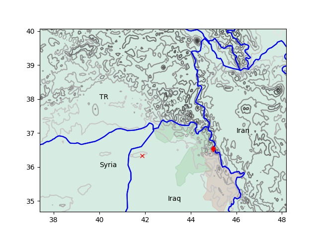

# Week 17 

---

<blockquote class="twitter-tweet"><p lang="en" dir="ltr">Aviation H2, a company aiming to develop a <a href="https://twitter.com/hashtag/hydrogen?src=hash&amp;ref_src=twsrc%5Etfw">#hydrogen</a>-fuelled aircraft by 2023, has launched a capital raise today (April 28). <a href="https://twitter.com/hashtag/HydrogenNow?src=hash&amp;ref_src=twsrc%5Etfw">#HydrogenNow</a> <a href="https://twitter.com/hashtag/H2View?src=hash&amp;ref_src=twsrc%5Etfw">#H2View</a> <a href="https://t.co/XpBc2pGyNF">https://t.co/XpBc2pGyNF</a></p>&mdash; H2 View (@h2_view) <a href="https://twitter.com/h2_view/status/1519646343320461313?ref_src=twsrc%5Etfw">April 28, 2022</a></blockquote> <script async src="https://platform.twitter.com/widgets.js" charset="utf-8"></script>

---

H2 View: "Aviation H2 selects liquid ammonia to fuel its
hydrogen-powered aircraft slated for 2023"

---

H2 Fuel News: "Advanced Ionics Secures $4.2 Million to Enable a New
Era for Decarbonization of Industrial Hydrogen Production..  Led by
Clean Energy Ventures, the investment will pave the way for Advanced
Ionics to enable initial pilot projects to be deployed with industrial
partners"

---

H2 View: "Two additional hydrogen hubs are set to be developed in the
Hunter Region of Australia with the federal government committing $82m
to the development. One of the projects set to receive a part of this
fund it’s the Port of Newcastle which is aiming to convert the area
into a hub for hydrogen"

---

H2 View: "Vietnam project to support the hydrogen value chain with
green ammonia export opportunity"

---

H2 View: "A new gigawatt-scale electrolyser manufacturing plant will be
developed in Texas, US, to support the creation of a 60GW hydrogen
hub"

---

Reuters: "India is getting too hot too early, raising the risk of
fires, Prime Minister Narendra Modi warned on Wednesday, as a heatwave
gripped much of the country and a landfill site burned on the
capital's outskirts"

---

Block 5 caused probs too, but Greek Cyprus, ExxonMobil and Qatar
Energy reportedly going ahead with drilling

[[-]](https://www.france24.com/en/live-news/20211210-exxonmobil-qatar-sign-cyprus-gas-deal-despite-turkey-opposition)

---

Blocks - apparently exploration of Blocks 6 and 3 caused tensions

[[-]](twimg/FRdLQEPXMAAiTsm.jpg)

---

That would be 1.3 gboe (giga barrels of oil equivalent). They seem to
find the biggest fields away from the Northern part of the island
where homie lives. Cyprus per history, is divided into two, Greek vs
homie

"[2019] The well, located in Block 10 [near Cyprus], encountered a
gas-bearing reservoir..  Based on preliminary interpretation of the
well data, the discovery could represent an in-place natural gas
resource of approximately 5 trillion to 8 trillion cubic feet"

[[-]](https://corporate.exxonmobil.com/News/Newsroom/News-releases/2019/0228_ExxonMobil-makes-natural-gas-discovery-offshore-Cyprus)

---

"@jackcalifano

I don’t want 8K TVs and self driving cars. I want a 4 day work week
and rent control"

---

That beach in Thailand, the filming location of *The Beach* became so
famous, tourists flocked to the place and destroyed it. Gov closed it
to visits now it is coming back to life. 

---

Otto was done-in by inter-wave conflict; second-wave industrial vs
first-wave agrarian. The newer wave always wins.

---

'Cob' as in 'corn on the cock'

---

Pre-modern agro implies certain lifestyle; staticity, unorthodox
relationships with the goat (let's define "what 'is' is" kind of
relationship) worshipping ancestors, and of course they were driven to
sacrifice the odd human here and there. These were feudal
cobsuckers. Then they would be run over by an empire like the Romans,
Otto (there is always a bigger cobsucker) and this pattern would
continue for centuries.

---

All agro societies had sacrifices, it comes with the territory,
or.. the material "superstructure" - see [Morris](../../2017/10/wtwrfn-foragers-farmers.html#eastwest).

WION: "A crime scene? 150 skulls found in Mexican cave turn out to be
remains of sacrificial victims from AD 900"

---

WION: "Big respite? Finally, Google begins to take requests for
removal of search results with personal info"

---

CNBC: "Denmark becomes the first country to halt its Covid vaccination
program.. Spring has arrived, vaccine coverage in the Danish
population is high, and the epidemic has reversed," the Danish Health
Authority said"

---

BEVs are also an ineffective, retarded midway creations right? They
exist at the intersection of the wall plug and the auto
vehicle. Mostly cheered by white-collar office dwelling Dem limpdicks
whose view of the "outside" never goes beyond that wall plug, a
bastardized product was popularized which is the battery-electric
car. Electricity transmission is not efficient, refueling, sorry
'recharging', certainly isn't - but a certain crowd likes these
half-way, co-existing solution-looking non-solutions, and the world,
econ can pay a huge price for it.

---

[Link](twimg/FRfX_8CWYAYV15J.png)

---

Canceling the student debt this once is fine; before changing the system.
It will play well with the electorate. People are pretty stupid on
politics but they understand the difference between 'have money in pocket'
vs 'have no money in pocket'

---

Don't butt in the market mechanism, in a mishmash way; no more gov
backed loans for anything. Private schools can be mandated to accept a
certain percentage tuition-free (not through a grant, or scholarship),
those seats would essentially be completely outside the market
structure.  Clear-cut division. Bizarre interaction with the market
will backfire, or will sadly fall short (see Obamacare,
Fannie-Freddie, tuition crisis).

---

Bingo - Sallie Mae, founded in the 70s

Forbes: "Congress also created a new entity, Sallie Mae, with the
right to borrow at rock-bottom interest rates. Such a creature was
unprecedented: until then, only the United States government could
borrow so cheaply. In an eerie foreshadowing of the subprime mortgage
crisis, Sallie Mae flooded banks with cheap cash, purchasing student
loans directly or lending to banks using student loans as
collateral. The system gave banks the incentive—and the ability—to
make as many student loans as possible...

Everyone involved—from politicians to banks to universities—convinced
themselves they were heroes. It’s true that the convoluted system
enabled many young people of limited means to attend college. But at
the same time, student loan defaults soared. So did college tuition"

[[-]](https://www.forbes.com/sites/prestoncooper2/2021/08/02/from-sputnik-to-sallie-mae-a-new-history-of-federal-student-loans/)

---

Tuition graph for private colleges - the first critical rise happens
during the 70s

[[-]](twimg/FRfUD4KXMAAjSjj.png)

---

Er no, I dont think RR is the primary culprit here

CNBC: "Reagan cut higher education funding and student aid, and
college costs boomed as a result. "

---

If making it easier to 'afford' something blows up its price, where
else can we find such effects? College tuition prices are through the
roof; and voila - look at outstanding student debt (also at
stratospheric levels)

---

"@AngryxGoat

Amber Heard has single-handedly set the feminist movement back by 50
years. I'm just going to say it - anyone who has been abused and heard
the clips has known this from the start"

---

Reshoots of *Aquaman 2* in the works? Holy turd!

---

Ouch - \#AmberTurd was trending

---

The grand US strategy, foundation of its empire is based on meddling
in Eurasian landmass. Even places like Kosova got military love
(whereas Rwanda didn't), bcz of US need to be 'involved' there.

---

No need - tell the f-ing Brits and the Yankees to stop pushing UKR
further into this bullshit war.

WION: "Europe needs to find consensus on banning Russian oil and gas, says
Lithuanian Foreign Minister"

---

NYT: "Can Japan Keep the Lights On? The Ukraine War Upends a Big Energy
Bet... The world’s third-largest economy has counted on imported
liquefied natural gas as it shuts coal-fired plants and keeps nuclear
sites closed. But Russia’s invasion has pushed prices sharply higher"

---

The Independent: "Ukraine war contributing to largest commodity shock
in 50 years, says World Bank"

---

Big claim. Wonder if it's true - the one on F-35s

Eurasian Times: "Not Only Stealth F-35s, Russian S-500 Missile Can
Also Shoot-Down Low-Orbit Satellites"

---

Jane's Defense: "Russia begins series production of S-500 air-defence
system"

---

Al Jazeera: "Germany’s Uniper to pay for Russian gas via Russia bank
account"

---

H2 View: "Sea Change hydrogen ferry to launch in San Francisco Bay next month"

---

H2 Fuel News: "Major maritime hydrogen hub to be developed in Kristiansand, Norway"

---

H2 View: "Nel announced the official opening of its fully automated
electrolyser production facility in Herøya, Norway"

---

H2 View: "Infinity Fuel Cell and Hydrogen will continue with its NASA
testing which aims to integrate a lunar regenerative hydrogen fuel
cell system to power moon bases"

---

H2 Fuel News: "Cornell joins hydrogen fuel hub consortium in New York"

---

H2 View: "Riversimple signs agreement with the California Mobility
Center to support mass production of hydrogen vehicles"

---

H2 View: "Canada to gain a new 150 tonne per day low-carbon hydrogen
production hub.. [T]his project will be developed in partnership with
Nikola and present an opportunity to produce low-carbon hydrogen and
decarbonise the sector"

---

H2 View: "[Heliogen CEO]: Hydrogen use is forecast to grow from 115
million metric tonnes currently to 500-800 million metric tonnes a
year by 2050.. Hydrogen projects already announced represent over
300bn dollars in spending across the value chain, and McKinsey &
Company analysts expect at least $150bn of that spend to be related to
hydrogen production"

[[-]](https://www.h2-view.com/open-access/the-new-way-to-power-the-planet/)


---

H2 Fuel News: "Green Ammonia and Hydrogen Now Cheaper than Fossil
Fuels..  Utilizing [Georgia Tech] MAPS technology with renewable
energy to produce cost effective green ammonia.. along with Kontak‘s
technology, which Hydrofuel has previously acquired.. [will] allow
Hydrofuel to produce Green NH3.. for as low as $220 a tonne, whereas
fossil-fuel derived NH3 is currently selling at 1,500 to 2,000 dollars
a tonne.

---

Making the case for nuclear with "we'll build smaller reactors" is not
a strong argument. What's the difference btw four small reactors
costing 250 mil each instead of one that costs 1 billion (w power
output equaling four plants)?  But a new type of reactor using
different fission material can fly. That would be a new argument.

---

High torium concentration in US, in states NV, UT, AZ, CO, KS, WY

[[-]](twimg/FRS6EeRXoAAJjvb.jpg)

---

Lookit; Asia Minor is 4th in the list of Th estimated abundance;
344,000 tons. 

---

"Thorium is three to five times more abundant than uranium in the
earth's crust..  produces less radiotoxicity than the U02 because it
produces fewer amounts of actinides, reducing the radiotoxicity of
long life nuclear waste. Th02 has higher corrosion resistance than
U02, besides being chemically stable due to their low water
solubility. The burning of Pu in a reactor based in thorium also
decreases the inventories of Pu from the current fuel cycles,
resulting in lower risks of material diversion for use in nuclear
weapons"

[PDF](https://inis.iaea.org/collection/NCLCollectionStore/_Public/45/068/45068136.pdf)

---

Wiki: "The discharged wastes are mostly fission products (nuclear
ashes) with shorter half-lives. This reduces the needed geologic
containment to 300 years rather than the tens of thousands of years
needed by a light-water reactor's spent nuclear fuel"

---

Wiki: "A molten salt reactor (MSR) is a class of nuclear fission
reactor in which the primary nuclear reactor coolant and/or the fuel
is a molten salt mixture... 1960's Molten-Salt Reactor Experiment
aimed to prove the concept of a nuclear power plant which implements a
thorium fuel cycle in a breeder reactor. Increased research into
Generation IV reactor designs began to renew interest in the
technology, with multiple nations having projects and, as of September
2021, China is on the verge of starting its TMSR-LF1 thorium MSR..

A further key characteristic of MSRs is operating temperatures of
around 700 °C (1,292 °F), significantly higher than traditional LWRs
at around 300 °C (572 °F).. economical hydrogen production."

---

Terrestrial Energy is a nuke energy play. But these guys do a
different kind of fission, "Generation IV molten salt fission
technology". Can use thorium instead of uranium. Th more abundant, has
better waste management features.

---

<blockquote class="twitter-tweet"><p lang="en" dir="ltr">Terrestrial Energy has joined the Fuel Cell and Hydrogen Energy Association, the national industry association for the fast growing fuel cell and <a href="https://twitter.com/hashtag/hydrogen?src=hash&amp;ref_src=twsrc%5Etfw">#hydrogen</a> sectors.<a href="https://twitter.com/hashtag/NuclearEnergy?src=hash&amp;ref_src=twsrc%5Etfw">#NuclearEnergy</a> <a href="https://twitter.com/hashtag/GreenHydrogen?src=hash&amp;ref_src=twsrc%5Etfw">#GreenHydrogen</a><a href="https://twitter.com/FCHEA_News?ref_src=twsrc%5Etfw">@FCHEA_News</a> <a href="https://t.co/aZ3X7JD3xM">https://t.co/aZ3X7JD3xM</a> <a href="https://t.co/7ItgHNSdpL">pic.twitter.com/7ItgHNSdpL</a></p>&mdash; Terrestrial Energy (@TerrestrialMSR) <a href="https://twitter.com/TerrestrialMSR/status/1518951699771277315?ref_src=twsrc%5Etfw">April 26, 2022</a></blockquote> <script async src="https://platform.twitter.com/widgets.js" charset="utf-8"></script>

---

H2 View: "As the renewable energy revolution continues to gain
traction across the globe, McKinsey has revealed that hydrogen demand
is expected to grow by four or six times by 2050"

---

If we were to adjust for the water loss, pineapple is 87% water, 47.8 * (100/13.) = 367 mg.
Of that 300 mg was preserved, ~82% Vit C remained after dehyd. Not bad..

The optimal temp was 50 deg Celcius. 

---

Pineapple has 47.8 mg VitC, looks like drying "increased" vitamin
C. But they dried, collected 100 g sample of dried pineapple, in that,
vitamin C was 300 mg.

---

Paper finds 300 mg / 100g of Vit C preserved in pineapple fruit after
drying..

[[-]](https://www.researchgate.net/publication/346469985_Effect_of_Drying_Temperatures_on_the_Vitamin_C_Content_of_Pineapple_Fruit_Ananas_comosus)

---

Pickled in red beets? Daaemn


---

Of course.. there is pickling of nearly everything else; why not eggs?

"@fyfluiddynamics

Many cultures around the world marinate hard-boiled eggs -- like
pickled eggs in Europe or tea- and soy-infused eggs from Asia. These
delicacies offer a fun (and tasty) way to demonstrate the concept of
diffusion"

---

AFP: "China's low Covid-19 death toll prompts questions. China has
recorded fewer than 5,000 deaths from Covid since the start of the
pandemic. Now a resurgent outbreak has revived questions about how the
country counts deaths from the virus"

---

CNBC: "Here’s what the world’s first floating city in Busan, South
Korea, could look like...  The United Nations, a floating city
architecture firm called Oceanix, and the South Korean city of Busan
on Tuesday unveiled the prototype for a floating, sustainable version
of the key shipping hub"


---

That is correct.. And a great way to teach / prove the former is with
the latter.

\#Rolle \#MVT 

[[-]](twimg/FRVjzP4XIAE9IXf.jpg)

---

Nuke Tech \#friedman

[[-]](../../0119/2017/07/the-next-decade-friedman.html#nuketech)

---

FT: "Will Boris Johnson's government face an immigration backlash?
Brexit votes were promised 'control' during the referendum, but many
wanted numbers significantly reduced. That's not what is happening
under the new system"

---

The Guardian: "Why are UK supermarkets rationing cooking oil?.. Tesco,
Morrisons and Waitrose have limited sales after concerns over
shortages caused by Ukraine war"

---

Politico: "Russia targeting Western weapons shipments in Ukraine as
Donbas assault begins"

---

FT: "By targeting Ukraine’s entire agricultural economy, destroying
fields, farm equipment, warehouses, roads, bridges, and ports, Russia
intends to cut off a major source of Ukraine’s income and the food
crisis could last well into 2023 if ports remain closed"

---

FT: "The war in Ukraine is impacting exports, causing a worldwide
problem — and poorer countries will feel it the most"

---

CNBC: "The euro tumbled against the U.S. dollar Wednesday morning as
investors grew increasingly concerned with energy supply and a
potential recession in the region."

---

Rumble over rouble (still no rubble)

Reuters: "Russia's Gazprom halted gas supplies to Poland and Bulgaria
on Wednesday over their refusal to pay in roubles"

---

H2 Fuel News: "Canadian-based Hydrofuel has completed an exclusive
licence agreement with Georgia Institute of Technology for the patent
pending MAPS system that could unlock green hydrogen and ammonia that
is cheaper than fossil fuels.

According to the company, the MAPS system enables high-yield,
sustainable ammonia synthesis from air and water with high efficiency
using a gas-phase electrochemical process"

---

H2 View: "Large-scale hydrogen production to be incorporated into a
green industrial hub in Northern Norway"

---

[nordichydrogenroute.com](https://nordichydrogenroute.com)

---

"@maximsagot

In 🇸🇪 and 🇫🇮 gas network operators present the Nordic Hydrogen Route project:

- 1,000 km of new hydrogen pipelines
- commissioning around 2030
- a local demand of 65 TWh of H2 (2 Mt) at 2050
- a reduction of 20 Mt of CO2"

[[-]](twimg/FRLhBPPXIAEQRM0.jpg)

---

"@DanFrov

The Swedish and Finnish system operators for gas transmission, Nordion
Energi and Gasgrid, are now presenting concrete plans for a 1000 km
long hydrogen pipeline that will run from Örnsköldsvik to Vaasa,
Finland"

---

H2 View:"Permacand to develop a large-scale green hydrogen production facility
in Sweden"

---

Reuters: "Egypt to work with UAE's Masdar to make green
hydrogen.. Egypt said on Sunday it would cooperate with the United
Arab Emirate's Abu Dhabi Future Energy Company (Masdar) on the
production of green hydrogen. Masdar and Hassan Allam (HA) Utilities,
a subsidiary of Hassan Allam Holding, will form a strategic alliance
to develop green hydrogen production plants in the Suez Canal Economic
Zone and on the Mediterranean coast, to produce up to 480,000 tons of
green hydrogen annually, the Egyptian cabinet said in a statement.

---

H2 View: "Kawaski and Airbus to create the Japanese hydrogen fuel infrastructure"

---

H2 View: "Hyzon Motors to establish hydrogen truck depot in
Australia.. The American company is working with an Australian
heavy-duty commercial fleet operator"

---

The Guardian: "After the relentless rain, South Africa sounds the
alarm on the climate crisis"

---

"@hertzsprrrung

What reader would ever complain about overly detailed derivations? Not
me, for sure; I've Iost countless hours figuring out those missing
steps!"

---

"@HiroNishikawa

Now a reviewer says there are too many details in the
derivations. Sometimes, too much information is better than lack of
information; it helps avoid confusions and ambiguities. But for this I
can cut a lot of intermediate steps; and I can leave them all in a
preprint"

---

True liberterians could actually affect some change here; they would
be for the abolition of F-F. If democracy worked they'd do their
thing, the left would do the outside-the-market help thing, overall
things would approach to some kind of working setup. Instead there is
a weird mush of market/non-market solutions, and the 'heated debates'
are on stupid culture war.

---

On the previously shared Eslake comment "Schemes that allow people to
pay more for housing than they otherwise would, will result in more
expensive housing". Then how can we help people to have housing?

Increasingly it looks like butting into market mechanism can
backfire. So best help in any area should aim to take entire swaths of
said area out of the market-based system. For health insurance,
single-payer is much better right (which takes nearly the totality of
health insurance out of private scheme) than trying to co-exist with
the market which fails to insure everyone (Obamacare).

For housing, gov can pay, employ, manage projects seperately, outside
the market structure to build, deliver housing. Slightly nudging one
rate here, fiddling with the market there can create unwanted
side-effects. In US we saw it happen; those orgs Eddie, Freddie,
Fannie, whatever, they've been there for decades, yet in US median
house price now reached nearly half a million dollars. Fannie, Freddie
being the bizarre in/out market creations they are, fueled the Great
Financial Crisis too and nearly caused the collapse of the system.

---

Madagascar in food trouble.. A lot of regions there with food security
problems, i.e. hunger. How hard is it to ship bunch of dried meat,
fruit to this place?

[[-]](twimg/FRIE2qWXsAASg2o.png)

---

Food Security Map

[[-]](https://hungermap.wfp.org/)

---

Some use the term as in journalism done with raw data; That's nice
too, but I mean publishing of raw data as journalism.

---

Data journalism would be fly; imagine there is http://data.nytimes.com,
or data.washingtonpost.com, and every major event, like war, gets its
relative URL, for Ukraine-Russia war situation the regions assesed,
claimed could be published in daily JSON files on /conflict/ukr/20220424/map.json;
people interested can fetch, process, plot.

---

TF was named after Mike Tyson but he fights more like Mohammad Ali. 

---

Tyson Fury wins again

---

Hah. Movie titled *Bear Witness* about a dude following around wild
bears and filming them.

---

But it is very likely MI6 had her killed. That part is a tragedy.

---

That's a stretch. I remember after her death they were throwing out
those words, 'she was like Mother Teresa'.. fem acquiantences at the
time took a major issue with that.. Mother Teresa lived with the poor,
spent her life among them. What did Diana do? Make a diva entrance to
some event, and disappear afterwards? C'mon.

"Lady Di was such a big humanitarian, a saint"

---

Most Kurds live without an official country. They certainly cannot
join NATO, have no diplomatic basis to even consider it. The Kurds who
were a threat to TR became that way because of latter's failed
policies, its faulty nation creation project.

"Isn't the situation of Kurds same as Ukraine's?

---

CH-SI deal was signed but the language is reportedly vague on the
military aspects.. The base can happen. And now tough talk coming from
OZ.

SCMP: "Australian PM Scott Morrison said a Chinese military base in the
Solomon Islands would be a 'red line' for his government"

---

[Link](tonyblairkeiser.png)

---

Dug it up - here it is. Thank you Wayback Machine (at 12:27)

[[-]](https://web.archive.org/web/20220125181227/https://www.youtube.com/watch?v=MwCsCDGOEyM)

---

Bummer - RT on YouTube gone, Keiser Report archives are gone; where is
the Tony Blair impression?

---

No *entente cordiale* saz the article..

Politico: "Don’t expect Macron’s win to reset UK-France ties.. Yet
British officials — who have previously blamed the French electoral
campaign for rows with Macron’s government on everything from
post-Brexit fishing rights to a nuclear submarine deal with Australia
and the treatment of undocumented Channel migrants — don’t expect a
huge diplomatic reset to follow the result.

Instead, they’re eyeing more modest wins, and hoping for more dialogue
between the two leaders in the coming months. And, despite Johnson’s
hopeful remarks, the mood music coming out of the French government
Monday wasn’t drastically different either"

[[-]](https://www.politico.eu/article/france-2022-presidential-election-emmanuel-macron-uk-relationship-boris-johnson-entente-cordiale)

---

CSP, Heliogen

<iframe width="340" src="https://www.youtube.com/embed/ZvdENQ5KMjo?start=192" title="YouTube video player" frameborder="0" allow="accelerometer; autoplay; clipboard-write; encrypted-media; gyroscope; picture-in-picture" allowfullscreen></iframe>

---

H2 View: "[South Korean scientists created a] new non-metallic
photocatalyst for green hydrogen production.. Inha University
researchers had developed a high-performance non-metallic carbon
nitride photocatalyst with a newly designed structural shape. It can
be employed to use sunlight for breaking down the molecules of water
into oxygen and H2"

---

H2 Fuel News: "H2-Industries to develop US $1.4 billion
waste-to-hydrogen plant in Oman"

---

H2 View: "€1bn investment in Sines, Portugal, will see the
construction of a 500MW green hydrogen project"

---

H2 Fuel News: "Plug Power to supply Walmart with up to 20 daily tons
of green liquid hydrogen"

---

H2 View: "Large-scale hydrogen salt cavern storage to be explored by
Atura Power and Plains All American"

---

Oil and Gas: "The remarkable fall in the cost of renewable power has
surely enabled commercial green hydrogen ventures such as NEOM... A
pipeline connecting the eastern Mediterranean with Europe [is being
considered]. While natural gas pipelines in the western Mediterranean
currently link Algeria, Tunisia, and Morocco to Spain, Portugal and
Italy, there is no pipeline in the east. But a hydrogen-capable
pipeline there could be a breakthrough for NEOM and others.. [W]ithin
a 300-kilometre radius of Sharm el-Sheikh (where the COP 27 conference
will occur this fall) are places with potential 100+ GW production
potential in Saudi Arabia, Egypt, and Jordan"

---

Pipeline Journal: "Osaka Gas and Pipeline Company Delves Into Green Hydogen"

---

"Dr. Terry Galloway [led] the team of astronomers at Chabot Observatory
who calculated the position of, and therefore helped save, the Apollo
13 spacecraft and crew"

---

"At Raven [SR Inc], we are revolutionizing the way the world uses
waste. We take any organic waste and convert it to clean hydrogen and
synthetic Fischer-Tropsch fuels through our patented Steam/CO2
Reforming process. We use steam and a chemical process, not
combustion, to process mixed feedstock (biogenics, plastics and/or
methane) into saleable products in an environmentally friendly,
efficient and profitable way. Our story begins in 1885 with Daniel
Best – great-grandfather of Dr. Terry Galloway (technology creator)
and great-great grandfather of Matt Murdock (Raven founder)"

[[-]](https://ravensr.com/about/#about-history)

---

Chris Joss - Surrounded \#music

[[-]](https://youtu.be/nxm2qD7_Bjc)

---

WION: "New Zealanders are ordering grocery from Australia, even saving money"

---

Latest Israeli violence.. I'm watching Raam; they are the Arab-Israeli
party in the coalition. They claim suspension of their membership,
what's next?

---

"US urges Iraqi government formation as stalemate drags on"

---

And of course - the usual troublemaker country [appears](https://english.alaraby.co.uk/news/krg-pm-barzani-hit-eggs-during-visit-london).

---

Current news: there are TR attacks toward all PKK areas, in Syria and
Iraq, even the Iraqi gov joined in for attack on Sinjar. Trouble
around Idlib too.. Somebody is eager for a 'Tamil Tiger moment'.

Asia Minor incursion required KDP (Barzani family) help, and they are
helping, with cries of backstabbing, "Kurd against Kurd violence"
blame thrown at them.

---

From TR standpoint, the more PKK was attacked the more it spread.
So war-war policy has been a fail so far.

---

The fascist coup of 1980 fueled PKKs rise

[[-]](../../0119/2009/09/modern-history-of-kurds-mcdowall.html#pkk80s)

---

Fields connected by pipeline, did not help patch things up between all
stakeholders?

[[-]](twimg/FQ28zalWQAA0C7w.png)

---

Post Arab Spring PKK spread to Sinjar, near Syria (red cross in map),
helping anti-ISIS fight there, after the fight they stayed. Then they
linked with Syrian NE. Then the sister org there declared autonomy, 2017.
Territory where PKK / sister YPG is active is in [yellow](twimg/FQ28SJdXoAEcSjR.jpg).
Lots of oil/gas.

[[-]](https://www.crisisgroup.org/europe-central-asia/western-europemediterranean/turkey/turkeys-pkk-conflict-regional-battleground-flux)

---

Various paths from that Qandil mountain to TR; one from Iraq but they
cld easily enter through Iran, immediately cross the Iranian border,
go north and enter from there.. I'm sure they received a lot of help
from Iran over the years.

---

[Data](kurd1.json)

---

```python
u.sm_kurds()
```



The darker green areas are Kurdish regions of Iraq, recognized by
central gov, with three governates, associated with two seperate
Kurdish Regional Gov families (north vs south), KDP and PUK. PKK
nestled itself at the intersection of three of these actors, KDP, PUK,
Iran, and on top of the hightest mountain of Iraq (the red dot).
KDP/PUK fought before, while in alliance now, doesn't hurt to
stay right between them for max leverage.

---

Why has the Kurdish terrorist group PKK active in TR been so difficult
to beat? Map above,

---

Emancipator - Land & Sea (Feat. Molly Parti) \#music

[[-]](https://youtu.be/zEOH_BAQWhg)

---

Secret RU oil shipments to the West? Destination Unknown.. The Latvian
Blend.. \#WION

Whoever needs oil, should get the oil. UKR-RU conflict is an
unnecessary proxy war, regular people should not pay the price for it.

[[-]](https://youtu.be/9tbgMKk0bEM?t=220)

---

Al Jazeera: "Russian media report alleges that the SAS has deployed to
the Lviv region in western Ukraine"

---

Arab News: "Unlikely change in Delhi-Moscow ties as UK PM visits India"

---

\#UKR \#FoxNews \#Carlson

[[-]](https://youtu.be/4IEuCJI6coA?t=152)

---

WSJ: "World Governments Confront Grim Ukraine Toll"

---

Jane's Defense: "Russia begins Donbas offensive"

---

AFP: "The Russian army will aim to take full control over eastern and
southern Ukraine, Russian news agencies quotes a top general as
saying, a day after Moscow announced the 'liberation' of Mariupol"

---
