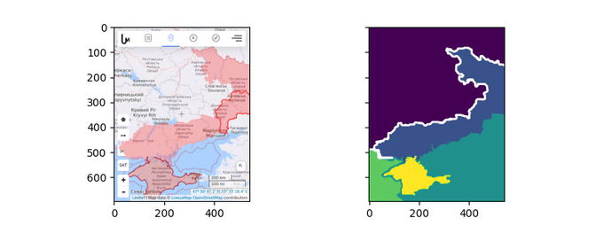

# Week 19 

---

<blockquote class="twitter-tweet"><p lang="en" dir="ltr">Cummins unveiled its 15-litre <a href="https://twitter.com/hashtag/hydrogen?src=hash&amp;ref_src=twsrc%5Etfw">#hydrogen</a> engine at the Alternative Clean Transport (ACT) Expo in Long Beach, California, on Monday (May 9). <a href="https://twitter.com/hashtag/HydrogenNow?src=hash&amp;ref_src=twsrc%5Etfw">#HydrogenNow</a> <a href="https://twitter.com/hashtag/H2View?src=hash&amp;ref_src=twsrc%5Etfw">#H2View</a> <a href="https://t.co/zveCatHxHd">https://t.co/zveCatHxHd</a></p>&mdash; H2 View (@h2_view) <a href="https://twitter.com/h2_view/status/1524351434271215619?ref_src=twsrc%5Etfw">May 11, 2022</a></blockquote> <script async src="https://platform.twitter.com/widgets.js" charset="utf-8"></script>

---

"[Governor of Connecticut] @GovNedLamont

I took two new @Toyota hydrogen-powered fuel cell vehicles for a spin
today. They sure have some juice!"

[[-]](https://twitter.com/GovNedLamont/status/1524469546735734784)

---

H2 View: "The technology produced by US-based Versogen is a new class
of electrolyser, built with patented anion exchange membrane (AEM)
technology, is engineered to reduce the costs of producing green
hydrogen at every stage with the most advanced membranes that offer
durability, performance and scalability"

---

H2 View: "French hydrogen-powered vehicles manufacturer Hopium, has
partnered with Bridgestone tyres, to develop bespoke tyres for its
luxury Machina road car"

---

H2 View: "LONGi to provide alkaline electrolysers to world’s largest
green hydrogen project... One year after its inception, LONGi Hydrogen
has won the Sinopec Green Hydrogen Demonstration Project, to supply
‘world leading large scale’ alkaline water electrolyser equipment"

---

H2 Fuel News: "Ballard and Wisdom.. .are working to accelerate the use
of the [H2 fuel-cell] vehicles in Hong Kong"

---

H2EG: "The landmark agreement [btw Shell and ZeroAvia] is expected to
be Europe’s first with eyes on creating a 100-metre-long hydrogen
pipeline that will run alongside the ZeroAvia hangar... With this
development, a suitable hydrogen refuelling infrastructure will be in
place in order to establish hydrogen technologies at the airport
leading to further innovation within the aviation industry.

Oliver Bishop, General Manager of Hydrogen at Shell, said, 'Shell
recognises the aviation sector has unique challenges in
decarbonization and needs practical and scalable net-zero
solutions.. We believe ZeroAvia’s technology is a viable option, and
this agreement will allow us to demonstrate successful provision of
low-carbon hydrogen supply while supporting development of codes,
standards, and refuelling protocols for hydrogen-powered aviation.'"

---

<blockquote class="twitter-tweet"><p lang="en" dir="ltr">What’s heavy-duty, runs on hydrogen, and is driving us towards zero-emissions transportation? 🌎 The newest truck collaboration between <a href="https://twitter.com/Cummins?ref_src=twsrc%5Etfw">@Cummins</a> and <a href="https://twitter.com/DaimlerTruckNA?ref_src=twsrc%5Etfw">@DaimlerTruckNA</a>! <a href="https://twitter.com/hashtag/Cummins?src=hash&amp;ref_src=twsrc%5Etfw">#Cummins</a> <a href="https://twitter.com/hashtag/fuelcells?src=hash&amp;ref_src=twsrc%5Etfw">#fuelcells</a> <a href="https://twitter.com/hashtag/heavydutytrucking?src=hash&amp;ref_src=twsrc%5Etfw">#heavydutytrucking</a> <a href="https://t.co/QQR0x7JYFD">https://t.co/QQR0x7JYFD</a></p>&mdash; Cummins Inc. (@Cummins) <a href="https://twitter.com/Cummins/status/1524432662026412035?ref_src=twsrc%5Etfw">May 11, 2022</a></blockquote> <script async src="https://platform.twitter.com/widgets.js" charset="utf-8"></script>

---

Aaand here is another port - great. 

H2 View: "Port of Duisburg and Port of Rotterdam to jointly develop
hydrogen hubs.. A letter of intent (LOI) has been agreed between the
Port of Rotterdam and the Port of Duisburg with plans to establish
hydrogen hubs in the surrounding areas of Germany and the Netherlands"

---

Rotterdam is a huge port sure, but still, there could be more, energy
cld be generated in Spain, Portugal, or imported into them from
anywhere in the Atlantic or NW Africa..

---

OK.. If Rotterdam will import 20 million tonnes of hydrogen (per year
I assume),


```python
print ('%d Gigawatts' % (33.6*20*1e6*1000/(1e6*365*24)))
```

```text
76 Gigawatts
```

That's pretty good... And that's just one port.

---

Europe imported 380 million cubic meters per day of gas by pipeline
from Russia in 2021. Natural gas has 10.55 kWh per cubic meters,

```python
print ('%d Gigawatts' % (10.55*380*1e6/(24*1000*1000)))
```

```text
167 Gigawatts
```

That is f--ing massive amt of energy; 167 nuclear plant worth right
there. Dam

---

H2 View: "The Queensland Government has signed a Memorandum of
Understanding.. with the Port of Rotterdam to jointly develop green
hydrogen export supply chains... [Minister for Energy] said, 'This
landmark agreement is another ringing endorsement of Queensland’s
quest to be a green hydrogen superpower'. The Port of Rotterdam has a
target to import up to 20 million tonnes of hydrogen by 2050, starting
with imports of ammonia in 2025"

---

<blockquote class="twitter-tweet"><p lang="en" dir="ltr">data is glorified 0 1 which is glorified +/- (5?)v <a href="https://t.co/N3J48UMpoK">https://t.co/N3J48UMpoK</a></p>&mdash; cosameer^ (@Lavoisierbug) <a href="https://twitter.com/Lavoisierbug/status/1518590072433803264?ref_src=twsrc%5Etfw">April 25, 2022</a></blockquote> <script async src="https://platform.twitter.com/widgets.js" charset="utf-8"></script>

---

"@LaurelCoons

🧂Zombify a dead fish by adding #salt"

[[-]](https://twitter.com/LaurelCoons/status/1102434296667824128)

---

\#mirror @internetofshit

[[-]](twimg/FSgM48PXoAsSXZA.jpg)

---

TDB: "Gotta Have More Spice, Baby! Christopher Walken Joins the Cast of ‘Dune: Part Two’"

---

Royal Crown Revue - Viva Las Vegas \#music

[[-]](https://youtu.be/l1odLicPEhc)

---

Al Jazeera: "Google to pay over 300 European news publishers for content"

---

CNBC: "More than $200 billion erased from entire crypto market in a
day as sell-off intensifies"

---

"@schwarz

If you bought $1000 of a bitcoin ETF when Matt Damon's 'Fortune Favors
the Brave!' crypto ad premiered on October 28 last year, you would now
have 554"

---

CNBC: "Controversial stablecoin UST which is meant to be pegged to the dollar
plummets below 30 cents"

---

Crypto was supposed to be a hedge against inflation bcz fiat is not
'sound money'?.. Now it is crypto that doesn't look too sound.

"Coinbase plunges to new lows as cryptocurrency skepticism spreads"

---

'No free-lunch' is a figure of speech (also a theorem in optimization).

In real-world it holds true. Most do not eat for free, but someone
else can pay for it ;) Left can say that other person can be gov. The
government already pays for many things that pro-business folk take
for granted (and exist because of it). SValley makes use of the
presence of great professors whose research is paid by the government,
roads paved, energy infra created by the government, the security
provided by the government and the open-source software provided by
mostly nameless contributers around the world. Well it is easy to be
'wild and innovative' a budding entrepreneur in this
scenario... providing the topping of the cake while making use of
free. We need free.

---

Al Monitor: "Egypt considers issuing bonds in China’s yuan"

---

\#firstIslandChain

The map was so good, I had to share it again

[[-]](twimg/FSiNe_oXMAAGPve.jpg)

---

The Independent: "China accuses US of ‘political manipulation’ for
changing wording about Taiwan on website"

---

It's sad the killing of that Al Jazeera Palestenian/American
journalist. It sounds like they specifically targeted her. 

---

"@DanielLDavis1

The comprehensive picture of the \#BattleofDonbas is troubling, as RU
troops continue to squeeze UAF troops in northern shoulder of Donbas
near Severdonetsk"

---

Voltaire Net: "Pentagon confirms having sent weapons to Ukraine as
soon as Biden instated"

---

WION: "Despite sanctions, Russian ruble is the world's top performing
currency in 2022"

---

<blockquote class="twitter-tweet"><p lang="en" dir="ltr">ZeroAvia makes major strides in Hydrogen refueling with Shell collaboration and airport pipeline launch.<a href="https://twitter.com/ZeroAvia?ref_src=twsrc%5Etfw">@ZeroAvia</a> <a href="https://twitter.com/hashtag/Hydrogen?src=hash&amp;ref_src=twsrc%5Etfw">#Hydrogen</a> <a href="https://twitter.com/hashtag/HydrogenNow?src=hash&amp;ref_src=twsrc%5Etfw">#HydrogenNow</a> <a href="https://twitter.com/hashtag/H2?src=hash&amp;ref_src=twsrc%5Etfw">#H2</a><a href="https://t.co/NADYvdCAH1">https://t.co/NADYvdCAH1</a></p>&mdash; Hive PR Middle East (@hiveprme) <a href="https://twitter.com/hiveprme/status/1524006850349441025?ref_src=twsrc%5Etfw">May 10, 2022</a></blockquote> <script async src="https://platform.twitter.com/widgets.js" charset="utf-8"></script>

---

H2 Fuel News: "Green hydrogen-fuel plant starts production in
Spain.. The H2 facility was developed to produce power in cumulative
phases of 20 MW, 30 MW and 50 MW, until they reach a total of 100 MW
once the entire plant’s development is completed. It will have an
annual production capacity as large as 14,400 tons of H2, which will
be distributed by hydrogen tank truck and by injection into a hydro
pipeline. When it reaches full production, it is expected to prevent
over 12,000 tons of carbon dioxide emissions every month"

---

H2 View: "The project [in South Africa] will build a massive 210
metric ton hydrogen truck to be used by the mining industry"

---

H2 View: "[T]he recently announced electrolyser target raise in the EU
to 17.5GW by 2025, the market for green hydrogen is set to grow
significantly in the near future"

---

H2 View: "Wystrach GmbH (Wystrach), a subsidiary of Hexagon Purus, has
received a €20m ($21.1m) order for hydrogen storage systems from HPS
Home Power Solutions (HPS)... [T]he German based HPS will use
Wystrach’s storage systems in its green hydrogen-based electricity
storage for homes, apartments, and commercial properties.

HPS’s products produce green hydrogen for properties using surplus
solar power during the summer using an electrolyser and converts it
back into electricity over the winter months"

---

H2 View: "Hyundai unveils plans to expand hydrogen fuel cell tractors to the US"

---

H2 View: "As a clear sign of a strong customer demand for green steel,
Swedish-based H2 Green Steel announced it has signed contracts for
over 1.5 million tonnes per year."

---

H2 View: "A collaboration between Strohm and Lhyfe is aiming to launch the
‘first floating wind turbine with an integrated hydrogen production
system’ worth approximately €60m"

---

H2 View: "Enertrag to develop 15,000 tonnes green hydrogen production hub in Uruguay"

---

"@CHEManager_EU

@Shell is the first company to sign an agreement to use the
\#HyTransPort \#hydrogen pipeline in the Netherlands that will run
from \#Maasvlakte in the @PortOfRotterdam to Pernis"

---

"@ZulfiqarAhmed69

[New Zealand] has a plan to get rid of natural gas and replace it with
hydrogen.  Hydrogen to Replace Gas Pipelines Across New Zealand by
2050"

---

H2 Fuel News: "Bosch to develop water electrolyzer components.. The
company has announced that it will investing €500 million into the
technology by 2030"

---

H2 View: "Hyundai unveils plans to expand hydrogen fuel cell tractors to the US"

---

H2 View: "Hydrogen trucks are the most eco-friendly zero-emission
vehicle, says ATRI [American Transportation Research Institute]"

---

"@TimRuhr

.. At Kemira's Joutseno plant hydrogen is a byproduct of chlorate
production and they want to sell it to the Ovako steel mill in Imatra.
@GasgridFinland is onboard to help with the pipelines"

---

H2 would need no cleanup.. comes from water goes into water - if
rarely leaked.

"UN says 'imminent' Yemen oil spill would cost $20 bn to clean up"

---

CNBC: "Top OPEC ministers have hit back at new U.S. legislation
[called 'NOPEC' bill by some] intended to regulate its output"

---

Cert as in 'digital certification' from the vendor? That's hilarious.

@internetofshit \#iot 

<blockquote class="twitter-tweet"><p lang="en" dir="ltr">Never thought I’d say this: My window blinds won’t open because of an expired cert. 🤦‍♂️</p>&mdash; Joey Piccola (@joeypiccola) <a href="https://twitter.com/joeypiccola/status/1524134464992931840?ref_src=twsrc%5Etfw">May 10, 2022</a></blockquote> <script async src="https://platform.twitter.com/widgets.js" charset="utf-8"></script>

---

Janko Nilovic - Soul Impression \#music

[[-]](https://youtu.be/DgD5AZKMxYk)

---

\#socmedia \#bullshitjobs

[[-]](https://youtu.be/mOFBrCqx2r4?t=1594)

---

Salaries 

"If socializing entire services is good what else can be socialized?"

---

What I am saying is without the open and *free* software, Big Tech
would not exist at the scale it does now.

---

The motivation for the shift to OSS 

[[-]](../../0119/2013/09/why-open-source.html)

---

Start-ups or many estab players mostly dont pay for databases either;
Bigger players build their own DB software eventually but there is
Postgresql, and various other choices for all.

---

Before Linux, before open-source, commoditization, it would cost a
fortune to build a server farm.. I used to work in software consulting
partially during pre-OSS days, the price tag we gave to clients for a
few commercial machines with commercial OS, and databases would make
anyone's eyes pop today.

---

It makes sense, they spend a pittance to make that money. Big tech's
top item costs are probably mostly talent and server farms. The
machines in those farms are nowadays commodity hardware and run a
variation of open-source software Linux. Cheap and cheap.

---

GPM for Facebook is pretty high

```python
import yf; yf.get_income('FB')['grossProfitMargin']
```

```text
Out[1]: 
endDate
2021-06-30    81.4321
2021-09-30    80.1069
2021-12-31     81.147
2022-03-31    78.4829
Name: grossProfitMargin, dtype: object
```

---

Wages have been growing around 5% YoY

```
2021-10-01    4.901961
2022-01-01    4.982699
```

---

Latest US inflation

```
2022-04-01  8.258629
```

---

That's the other Rajapaksa isn't it. These guys were everywhere.

Al Jazeera: "After PM, Sri Lanka protesters now want president to quit"

----

Al Jazeera: "Sri Lanka gives emergency powers to army, police after
violence"

---

WSJ: "Sri Lankan Prime Minister Mahinda Rajapaksa Resigns Amid
Economic Crisis"

---

Davis: "At present, most indicators, fundamentals of war, and current
battlefield trendlines support the prospect of a Ukrainian defeat...

In mid-April, Russia captured the critical transportation hub of Izyum
near the northern shoulder of the Donbas lines. Just days ago, after
nearly a two-month battle, Putin’s troops captured another key city in
northern Donbas that controls several essential road junctions in
Popasnaya. Kremlin forces have now pushed deeper into Severdonetsk,
putting Ukrainian troops at risk at Lysychansk, just to the southwest
of Severdonetsk...

Whether Putin has enough troops, ammunition, and time to complete the
destruction of the UAF positions in the Donbas without mobilizing some
portion of its reserve forces is an open question. What is clear,
however, is that Russia’s current operations are slowly strangling
Ukrainian troops in the Donbas and that despite optimistic rhetoric
out of Kyiv and Western capitals, the battle is trending towards a
Russian tactical success, possibly within two months...

Militarily speaking, there is very little hope that even all the
promised support of heavy weapons and ammunition from the West can be
delivered to the front, the Ukrainian troops adequately trained, and
firepower brought to bear in time to change the course...

By continuing to seek a military victory in Ukraine, Ukraine’s troops
will continue fighting, no negotiated settlement will be realistically
sought, and most likely Russian troops continue making progress. As a
result, more Ukrainian civilians and troops will continue to be killed
and wounded, more cities destroyed, and the economic and food crises –
for both Ukraine and the world – will worsen. The most likely outcome
will not change (a negotiated settlement, not a Ukrainian military
victory), but the cost to Kyiv will be much, much worse"

[[-]](https://www.19fortyfive.com/2022/05/russias-slow-and-steady-war-in-the-donbas-means-ukraine-wont-win/)

---

Lt. Col Daniel Davis

\#rising \#ukraine

[[-]](https://youtu.be/fnqpUq2EZmU?t=52)

---

Says who? Brits? I'm sure Putin will carefully consider it and file it
under "I don't give a shit" right next to "I don't give a flying
fuck".

"The sanctions on Putin circle are permanent whatever the outcome in
Ukraine"

---

Arab News: "Marcos has been short on specifics about foreign policy,
but in interviews he said he wanted to pursue closer ties with China,
including possibly setting aside a 2016 ruling by a tribunal in The
Hague that invalidated almost all of China’s historical claims to the
South China Sea"

---

Al Jazeera: "The [US Department of State] website previously..
acknowledged there is 'one China' made up of both China and Taiwan. In
its place, it simply refers to Taiwan as a close ally in Asia"

---

H2 View: "A cooperation agreement to develop hydrogen refuelling
infrastructure capable of refuelling 100,000 hydrogen-powered vehicles
in the Nordic region has been signed.. Norwegian Hydrogen AS,
FirstElement Fuel Inc. and Mitsui & Co, announced the companies would
be working together to accelerate the expansion of the hydrogen
network across the entire Nordic region"

---

H2 View: "Aviation H2 signs major deal with FalconAir to aid in
developing hydrogen aircraft by 2023. As development of Australia’s
first hydrogen-powered plane ramps up, the company behind the
aircraft, Aviation H2, has unveiled a new major partnership with
FalconAir"

---

H2 Bulletin: "ZeroAvia Kicks Off US 19-seat Aircraft Testing and
Demonstration Program on Path to Worldwide Application of its
Powertrain Technology"

---

H2 View: "Texas, US, continues to ramp up its hydrogen capabilities
with Enbridge and Humble Midstream revealing plans to develop
low-carbon hydrogen and ammonia facilities"

---

H2 Fuel News: "Hydrogen trucks are the most eco-friendly zero-emission
vehicle, says ATRI [American Transportation Research Institute]"

---

H2 View: "Elcogen announced that it has received a €24m ($25.25m)
investment to aid the expansion of its capabilities to produce green
hydrogen, using its reversible solid oxide fuel cell (SOFC)
technology, from HydrogenOne Capital Growth Plc (HydrogenOne)... The
investment is set to allow Elcogen to drive forward its expansion of
facilities in Tallinn, Estonia, to create an automated production line
for SOFCs"

---

H2 View: "Lhyfe has officially launched its initial public offering (IPO) to
support the development of the company’s green hydrogen production
technology and ambitions... The capital increase has soared to over
€145m ($152m)"

---

Thorium on the other hand, can be found in Egypt, Australia, Canada,
US, Brazil, Asia Minor.. Molten-salt reactors show some hope; can
produce H2 easily, added bonus.

---

Wanna do more nuclear? A lot of the fuel for that also comes from
Russia Russia Russia.

---

[Link](https://drive.google.com/uc?export=view&id=1n0aVnSajhY5RR18uEk-tvTD0aRGzQc8D)

---

Saw another asshat claiming 'maybe the Sun just *reflects* GR from
everywhere else' 😂 

---

Of course, dark matter, near black hole, across a time dilation field
seeping into our universe from another. You got it all figured out
champ...

"Dark Matter could be involved here too"

---

Activity would disrupt the activity on that surface, so Gamma rays
would decrease. That's why there is strong anti-correlation. 

---

Nuclear reactions on the surface of the Sun is enough to explain
that. See 'lattice confinement fusion'. Have to accept the Sun does
have a surface, it aint bunch of 'hot gas'.

SciAm: "The Sun Is Spitting Out Strange Patterns of Gamma Rays—and No
One Knows Why.. To their surprise, the researchers found the most
intense gamma rays appear strangely synced with the quietest part of
the solar cycle"

[[-]](https://www.scientificamerican.com/article/the-sun-is-spitting-out-strange-patterns-of-gamma-rays-and-no-one-knows-why/)

---

Many-Worlds Interpretation of QM is made possible by ignoring the
measurement problem, not solving it. 'The collapse' of the
wavefunction is essentially swept under the carpet, but ignoring the
problem doesn't make it go away. 

---

Interesting, though this tool is overused these days as a literary
crutch. Ditto for 'alternate universes'.

"[Twain novel] *A Connecticut Yankee in King Arthur’s Court*.. is often
said to be the forerunner of all science fiction tales about time
travel"

---

MT depiction in Trek Next Gen was good.

---

It's weird how the image of Twain today is excessively sanitized.
Mark Twain was a vocal anti-war proponent in his day.. He even once
suggested that the stars in the flag be "replaced by skulls and
cross-bones".

"During the Spanish-American War, [Mark] Twain became a fervent
anti-imperialist, even joining the Anti-Imperialist League. His
sentiments about the war and the war in the Phillippines were
published nationwide"

---

Some accents at the UN pronounce piece as 'piss'. Have to work on that
bruh.

---

Social rentals (gov-built rent-controlled homes) as a % of total
housing; France 14%, Denmark 21%, Netherlands 37%. \#ABC \#Oz. That is
a huge number. Taking services completely outside the market structure
can work. This is the way

---

\#Documentary \#WSJ "Trucking used to be one of the very best blue
collar jobs in the US. The industry was almost fully unionized by the
teamsters union.  Unionized truck drivers were making up to 20% more
than even unionized steel workers or auto workers. It was one of the
best jobs you could get, and when you got one of those good jobs you
were likely to stay in it until you until you retired. [But] the
industry was deregulated 1980, the union was pushed out of the big
segments of the of the industry, and and wages and working conditions
followed [became worse]"

---

He had kicked out the foreigners and nationalized the oil
industry. Then boom - toppled by an 'Anglo' coup.

---

Pity. Iran's democratically elected leader Mossadeg was Time's Man of
the Year for 1952. A terrible fate befell him..

[[-]](twimg/FSWaDakXMAEnhI5.jpg)

---

Had to guide the processing towards the goal; remove small patches,
tell the segmentation algo to look at coarse objects, put a lower
limit on segment size.. lots of small nudges here and there. There is
no free lunch. There is no 'Alexa give me the interesting image blocks
and boundaries in this image'.

---

Little image processing action to reverse-eng UKR-RU frontline. Works ok

```python
from skimage.color import rgb2gray, rgb2lab, deltaE_cie76
from skimage.segmentation import felzenszwalb
from skimage.morphology import binary_closing
from skimage import io, measure

threshold = 15
img = io.imread("ukrdata/ua-ukr-20220504.png")
lab = rgb2lab(img[:,:,[0,1,2]])
d1 = deltaE_cie76(rgb2lab(np.uint8(np.asarray([243,178,182])) ), lab)
d2 = deltaE_cie76(rgb2lab(np.uint8(np.asarray([253,35,36])) ), lab)
flt = rgb2gray(img.copy())
flt[(d1 < threshold)] = 1; flt[(d1 >= threshold)] = 0
flt[(d2 < threshold)] = 1; 
flt = flt.astype(bool)
flt = binary_closing(flt)
seg = felzenszwalb(flt, scale=50, sigma=2, min_size=8000)
fig, axes = plt.subplots(1, 2, figsize=(8, 3), sharey=True)
axes[0].imshow(img)
axes[1].imshow(seg)
contours = measure.find_contours(seg, 0.8)
for c in contours:
    axes[1].plot(c[:, 1], c[:, 0], color='white',linewidth=2)
```



---

Al Monitor: "Yazidis displaced anew by north Iraq violence"

---

NI is seperated by the North Channel from UK just as UK is seperated
by the English Channel from EU mainland - yet the latter went through
Brexit, severing its connection to that mainland. Well here is another
Channel and maybe another "exit".

"Northern Island is so close to UK, it's logical they want to be
closely connected"

---

Aw man but UK is such a 'leader' in the RU/UKR fight (while also
quietly enjoying the mess it helped create inside European
landmass). Can't you cut them a little slack?

Politico: "Take a chill pill, EU tells UK over Northern Ireland
protocol.. London needs to 'dial down the rhetoric' and 'find
solutions' to trade issues within the framework of the deal, European
Commission Vice President Maros Sefcovic says"

---

<blockquote class="twitter-tweet"><p lang="en" dir="ltr">Gasgrid Finland participates in the update of <a href="https://twitter.com/ehb_europe?ref_src=twsrc%5Etfw">@ehb_europe</a> development vision – the hydrogen backbone to support the achievement of climate goals, REPowerEU plans, and developing the resilience of the European energy system. <a href="https://twitter.com/hashtag/hydrogen?src=hash&amp;ref_src=twsrc%5Etfw">#hydrogen</a> <a href="https://twitter.com/hashtag/EHB?src=hash&amp;ref_src=twsrc%5Etfw">#EHB</a> <a href="https://t.co/adljzgqa2X">https://t.co/adljzgqa2X</a> <a href="https://t.co/fdAbz5wzwC">pic.twitter.com/fdAbz5wzwC</a></p>&mdash; Gasgrid Finland Oy (@GasgridFinland) <a href="https://twitter.com/GasgridFinland/status/1511248215798161410?ref_src=twsrc%5Etfw">April 5, 2022</a></blockquote> <script async src="https://platform.twitter.com/widgets.js" charset="utf-8"></script>

---

H2 View: "[A new] study has found that using a [polymer based]
photocatalyst under simulated sunlight facilitates the decomposition
of water, when loaded with an iridium catalyst, which in turn
generates hydrogen. The photocatalysts.. are of huge interest as their
properties can be tuned.. The researchers have also said that another
potential advantage of this technique.. is that ‘polymers are
printable’, which would allow for cost-effective production techniques
for scaling up"

[[-]](https://www.h2-view.com/story/study-suggests-solar-energy-potential-solution-for-green-hydrogen-production/)

---

H2 View: "European electrolyser manufacturers and the European
Commission have committed to increase their annual hydrogen
manufacturing capacity to 15.5GW by 2025 in a joint declaration"

---

"@AirLiquideUSA

In today’s \#SenateENR hearing on the [DOE] budget, @SenCortezMasto
and @SecGranholm discuss their recent visit to our new hydrogen
facility in Nevada"

[[-]](https://mobile.twitter.com/AirLiquideUSA/status/1522318903204093954)

---

H2 View: "Preliminary approval brings hydrogen-powered ships closer to
Norway.. HAV Group ASA announced that it has received preliminary
approval for its hydrogen-based energy system, pushing forward hopes
of using hydrogen fuel in commercial ships"

---

H2 View: "A pre-feasibility study has been announced that will assess
the viability to produce and transport green hydrogen in Western
Australia, using existing pipelines"

---

H2 View: "ScottishPower and Storegga announced plans to build a series
of megawatt-scale green hydrogen projects in the Scottish Highlands"

---

H2 Fuel News: "Smartpipe Technologies recently announced that it has
received a $6.6 million investment from Enbridge for the development
of innovative pipelinew technology [for H2 and CO2]."

---

"@hyzonmotors

... Hyzon fuel cell trucks will be operating with a lower total cost
of ownership than diesel trucks in California before the end of 2022"

---

<blockquote class="twitter-tweet"><p lang="en" dir="ltr">The launch of Anglo American’s <a href="https://twitter.com/hashtag/nuGen?src=hash&amp;ref_src=twsrc%5Etfw">#nuGen</a>™️ Zero Emission Haulage Solution haulage solution, a hydrogen-powered, ultra-class mine haul truck, is currently underway at the Mogalakwena PGM mine in Mokopane, Limpopo. <a href="https://twitter.com/hashtag/HydrogenPower?src=hash&amp;ref_src=twsrc%5Etfw">#HydrogenPower</a> <a href="https://twitter.com/hashtag/GrowSouthAfrica?src=hash&amp;ref_src=twsrc%5Etfw">#GrowSouthAfrica</a> <a href="https://t.co/EGZWTSuQmn">pic.twitter.com/EGZWTSuQmn</a></p>&mdash; Presidency | South Africa 🇿🇦 (@PresidencyZA) <a href="https://twitter.com/PresidencyZA/status/1522526875209371650?ref_src=twsrc%5Etfw">May 6, 2022</a></blockquote> <script async src="https://platform.twitter.com/widgets.js" charset="utf-8"></script>

---

The energy ref is good. 

DMT: "For the uninitiated, “Halo” is a military science fiction media
[video game now adapted for the screen] .. Madrigal is home to a plant
that has the galaxy’s highest concentration of heavy hydrogen, which
can be used to power ships... Since resources are probably finite in
the 26th century as well, the UNSC is looking to put their stamp on
Madrigal"

---

They were talking about that 2012 Meet the Press appearance, Im just
kidding.. We kid here.

---

Mrs Biden is a guy? I didnt know!

Politico: "How Same-Sex Marriage Shaped Joe Biden"

---

Pompeo slammed Oz, who was previously endorsed by DJT. What's up

---

Poor guy's reply is full of spurious correlations now.

---

That's from a reply to the trending Douthat tweet; as an example for a
spurious correlation, like his 

---

😂 

"@donmoyn

Worth noting that unemployment rapidly dropped after Britney Spears
[released](twimg/FSFHKPDWQAEFlbU.jpg) 'Work Bitch'"

---

The market has been overvalued for a long time. 

CNBC: "Stock markets are set for more heavy selling this summer as
central banks around the world hike interest rates to fight spiraling
inflation, said one economist"

---

Lula can win, unseat Bolsonaro. 

The Jakarta Post: "Leftist icon Lula launches presidential campaign to 'rebuild Brazil'"

---

AP News: "[New] post-Brexit rules, which took effect after Britain
left the European Union, have imposed customs and border checks on
some goods entering Northern Ireland from the rest of the U.K. The
arrangement was designed to keep an open border between Northern
Ireland and EU member Ireland, a key pillar of the peace process.

But the rules angered many [DUP members], who maintain that the new
checks have created a barrier between Northern Ireland and the rest of
the U.K. that undermines their British identity. In February, the
DUP’s Paul Givan resigned as first minister in protest against the
arrangements, triggering a a fresh political crisis in Northern
Ireland"

---

The party that wants broken island calls themselves 'unionists' BTW;
effective word play. They actually want to 'unify' with England.

"Belfast results show [DUP] unionists can’t win vote on Brexit protocol"

---

UK limped on by playing an inner-outer game; it tried to balance both,
until it couldn't - enter Brexit. 

---

I hope Ireland is unified, leaves UK. Ditto for Scotland.
England-centric UK proved it doesn't deserve to remain as single
entity. Now solidly in the outer alliance, they flail around in
desperation f-ing shit up everywhere. 

---

Sinn Fein wants the eventual unification of Ireland, their rival DUP
is pro-England.

---

Brexit England is getting the shit kicked out of it; I like it

NYT: "Northern Ireland Turns to Sinn Fein.. Election results reflected the
demoralization of unionist voters, the disarray of their leaders and
an electorate with new priorities — much of which can be traced to
Brexit"

---

First Post: "How Narendra Modi deftly walked Ukraine tightrope to
bring India and Europe closer"

---

Al Jazeera: "Putin believes he cannot ‘afford to lose’ Ukraine war: CIA chief"

---

Politico: "The war in Ukraine has revived Washington’s once-deflated hawks"

---
