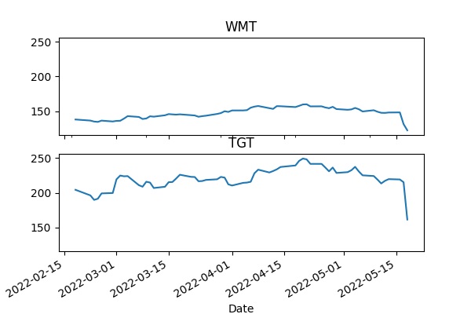
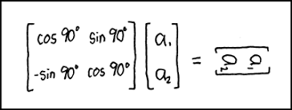

# Week 20 

---

Seperate vid talks about problems with long-distance electricity
transmission, and the ill-fated DESERTEC plan. All of the issues
raised there are moot for H2 pipelines which can transmit ten times
more energy at one eighth the cost compared to the grid.

[[-]](https://youtu.be/7OpM_zKGE4o?t=262)

---

Limitations of the grid \#h2book

[[-]](../../2022/06/the-h2-revolution-alvera.html#grid)

---

Hear hear \#lion \#h2book

[[-]](../../2022/06/the-h2-revolution-alvera.html#lion)

---

Forbes: "Perovskite is found in Earth's mantle has been mined in
Arkansas, the Urals, Switzerland, Sweden, and Germany"

---

Perovskite can do better solar \#h2book

[[-]](../../2022/06/the-h2-revolution-alvera.html#peros)

---
 
"[A]mbient air pollution kills more than 4 million people every year
twice as many as Covid-19 killed in 2020, and twice as many as are
killed every year by malaria and tuberculosis combined" \#h2book

---

Three **billion** animals died during Oz wildfires? \#h2book

[[-]](../../2022/06/the-h2-revolution-alvera.html#deaths)

---

Alvera is the CEO of Snam. Shared one vid of him previously talking
about their H2 pipeline work.

[[-]](https://youtu.be/sZlHFKaKJU0?t=273)

---

Alvera book talks about only parts of econ being electrified. Those
parts will likely be gasified too eventually.. The base tech that can
do all, will end up doing all \#h2book

[[-]](2022/06/the-h2-revolution-alvera.html#electrif)

---

NH3 is still useful as energy vector, it can be combusted in a turbine
(Japan Mitsubishi has the tech), used for carrier for other kinds of
fuel-cells.

---

That must be why ammonia company GenCell tout alkaline fuel-cells, the
tech works even with non high-purity H2, as opposed to PEM which needs
high-purity.

[[-]](https://www.ammoniaenergy.org/articles/gencell-launches-commercial-alkaline-fuel-cell-using-cracked-ammonia-fuel/)

---

Looking at the PE presentation again; they are especially focused on
compression, bcz apparently getting high-purity H2 is easiest that
way. Ammonia can carry huge amounts of H2, but getting high purity is
tough. From pg 10,

- Compression is integral to all three supply chains to increase the
volumetric energy density of H2

- Compression has minimal technical barriers..

- LH2 [liquid form] supply chain is significantly more complex with
additional energy intensive processes as well as onshore storage
requirements

- NH3 involves mature and well-developed technologies. However, if the
end user requires high purity hydrogen, then technical barriers and
energy penalty to crack and purify (reconversion)

[PDF](https://assets.website-files.com/626b0112d67346fa8eab974d/6280ef3d5ce3f07d709f43a7_Provaris%20-%20Corporate%20Deck%20-%2016%20May%202022%20ASX.pdf)

---

Video: Provaris CEO: 'it's very clear Europe has 10 million tons of
demand [for H2] by 2030'.

[[-]](https://youtu.be/JgyD2k1xWEI?t=86)

---

BTW the heating energy calc [here](../../2022/01/heating-calculation-fourier.html) actually
takes energy used for cooling into account, indirectly; It calculates
the energy needed to raise (the average world temperature) from 13
to (room temperature) 22. Well, there are many temp levels
during the year that contribute to  that average. Sometimes it is -20,
sometimes 10, or 30. So by calculating 13->22 switch, we are
also calculating 40 to 22, for some places. 

---

The Guardian: "But air conditioning and refrigeration are doubly
polluting: not only are they produced from climate-warming fossil
fuels, but the HFCs and other refrigerants cooling systems use produce
greenhouse gases that can be 4,000 times more potent than carbon
dioxide"

---

<blockquote class="twitter-tweet"><p lang="en" dir="ltr">Hydrogen Rising is a great podcast from <a href="https://twitter.com/KLGates?ref_src=twsrc%5Etfw">@KLGates</a> for <a href="https://twitter.com/hashtag/hydrogen?src=hash&amp;ref_src=twsrc%5Etfw">#hydrogen</a> and <a href="https://twitter.com/hashtag/fuelcell?src=hash&amp;ref_src=twsrc%5Etfw">#fuelcell</a> industry insiders and newcomers - check out the latest episode featuring FCHEA President Frank Wolak - <a href="https://t.co/ckGVo3dr9w">https://t.co/ckGVo3dr9w</a>!</p>&mdash; Fuel Cell and Hydrogen Energy Association (@FCHEA_News) <a href="https://twitter.com/FCHEA_News/status/1527316122181087233?ref_src=twsrc%5Etfw">May 19, 2022</a></blockquote> <script async src="https://platform.twitter.com/widgets.js" charset="utf-8"></script>

---

"@Zachary

@CFTCbehnam urged digital asset firms to disclose their energy
footprint. He said the industry’s economic output might not be worth
the wattage"

---

New Deal - Deep Sun \#music

[[-]](https://youtu.be/RIMwiJ-nuEA)

---

It isn't, bcz there is a clear beginning of the snowball. With the
chicken-and-egg "connondrum" as well there is a beginning; There was
something like a chicken which laid something that looked like an egg,
that started the process. Gov policy gives the push, starts the
snowball, more eggs.

"The demand-supply-more demand you described sounds like a
chicken-and-egg process / problem"

---

Charly Antolini's Power Dozen - Nofretete's Headache \#music

[[-]](https://youtu.be/ORh-qFb3wXE)

---

JP does good things on H2 though, kudos there

---

Overwork, Japan - all that overtime doesn't seem to help productivity?

[[-]](https://youtu.be/9Y-YJEtxHeo?t=17)

---

Mr. Scruff - Champion Nibble \#music

[[-]](https://youtu.be/MHgC7Nta0ks)

---

Walmart, Target stocks were hit especially bad maybe bcz if during
high inflation era value, 'substance' will matter more, and WMT, TGT 
would be safe-havens for that kind of buy, when they missed their
earnings, value seekers were shocked. Nosedive.

---

<blockquote class="twitter-tweet"><p lang="en" dir="ltr">It’s <a href="https://twitter.com/hashtag/WorldBookDay?src=hash&amp;ref_src=twsrc%5Etfw">#WorldBookDay</a>, so I’m going to take a moment to highlight my fav <a href="https://twitter.com/hashtag/hydrogen?src=hash&amp;ref_src=twsrc%5Etfw">#hydrogen</a> book 📖 If you haven’t already, you should check out <a href="https://twitter.com/malvera1?ref_src=twsrc%5Etfw">@malvera1</a>’s “The Hydrogen Revolution.” It’s a fav amongst the <a href="https://twitter.com/HystarH2?ref_src=twsrc%5Etfw">@HystarH2</a> team, too! <a href="https://t.co/zzBwkopctO">pic.twitter.com/zzBwkopctO</a></p>&mdash; Leila A. Danielsen (@lasdal) <a href="https://twitter.com/lasdal/status/1517920683443081218?ref_src=twsrc%5Etfw">April 23, 2022</a></blockquote> <script async src="https://platform.twitter.com/widgets.js" charset="utf-8"></script>

---

H2 View: "The much anticipated, REPowerEU Plan has been presented by
the European Commission, and has set a target of 10 million tonnes of
domestic renewable hydrogen by 2030"

---

H2 View: "Cummins partners with Freightliner on hydrogen fuel-cell
truck.. The Freightliner Cascadia chassis will be equipped with fourth
generation equipment from Cummins... [The companies] have announced
that they will be working together on a new hydrogen fuel-cell truck
that is intended for the North American market"

---

It is great Europe is creating the demand upfront, that can spur
companies to get their tech in order; Provaris CEO attended an H2 conf
and says the demand from EU is there, they want tons of this
stuff. Where there is demand, there will be supply.. so PE is building
tech for it. Enter the snowball effect; seeing supply, products will
arrive, which will create more supply. Only policy could start that
chain, bidness could not do it on its own.

---

Suiso ship used low temperature. The GH2 ship uses compression. The AU
company that built it is Provaris Energy. Presentation on the tech and
planned infra below. First ship is 26,000 m3 another planned 120,000
m3, compressed H2 at 250 bar can carry 700 kwh/m3 which means one trip
will carry 84.0 Gigawatt-hours, that is mid-size crude oil tanker
equivalent. Very good.

[PDF](https://assets.website-files.com/626b0112d67346fa8eab974d/6280ef3d5ce3f07d709f43a7_Provaris%20-%20Corporate%20Deck%20-%2016%20May%202022%20ASX.pdf)

---

H2 View: "Offshore green hydrogen production unit unveiled.. Technip
Energies and its affiliates, Kanfa and Inocean announced the launch of
its suite of offshore green hydrogen production solutions, GO.H2 TM by
T.EN"

---

H2 View: "A new ship that will collect ocean plastic and produce
hydrogen to be designed.. H2 Industries and naval architecture
company, TECHNOLOG Services have revealed a partnership to design a
ship that will collect plastic waste and convert it into hydrogen"

---

This means LH2 storage does not require extra energy..? That's smart.

"Suiso Frontier (hydrogen tanker) is a custom-built vessel with
double-shell vacuum insulation that enables liquid hydrogen to be
transported without any coolant"

[[-]](https://www.nature.com/articles/d42473-020-00544-8)

---

Can work backwards from capacity to output. LNG replacement? Get ship
capacity, number of trips, or simply an annual export amount giving a
Gwh, now work backwards from there, divide by 365, then 24 - once we
have calc down to Watt-hour within an hour, we can drop the hour, get
Wattage.

---

Converting energy numbers to a Wattage (kilo,giga) as in power input /
output helps to gauge how much of a power need can be met by existing
sources, and compare sources with eachother, no matter how long that
power would be needed (which takes us into Watt-hour, storage capacity
territory). A TV pulls in 60 Watts, an oven 1500 W. Russian NG export
to Europe is 167 Gigawatts (a lot of TVs can run on that
energy). Typical nuclear plant output is 1 GW, Fukushima (the one with
the meltdown) was 5 GW. Then it takes 33 Fukushimas to replace Russian
exports to Europe. Now in terms of environment policy that is probably
a non-starter.

---

"@christo92787346

I can't wait for Raytheon baby formula with laser targeted nutrition"

---

AP: "Biden invokes Defense Production Act to boost baby formula
production, authorizes flights to bring imports from overseas"

---

How to get the code referenced here? If there is an `import` for a
library, but it is not an official Python lib, its `.py` file will be
under that year's archive. Script `yf.py` is under `en/mbl/2022`
folder.

---

If people's buying patterns truly changed, and -per WSJ supply chain
docu- there is about a year's worth of journey behind every product
even though the last-mile delivery of the product looks instantenous,
then changes on demand could manifest itself as supply chain
problems. And covid also effected the production itself.

---

Saw Target CEO on CNBC, his main complaint was 'supply chain supply
chain supply chain'

---

Their stocks were hammered. 

```python
import yf
fig, axes = plt.subplots(2, 1, figsize=(6, 4), sharey=True)
df = yf.get_stock_price('WMT')
df.plot(ax=axes[0],legend=False,sharex = True,title='WMT')
df = yf.get_stock_price('TGT')
df.plot(ax=axes[1],legend=False,title='TGT')
```



---

Doh!

```python
import yf;yf.get_earnings("WMT").head(4)[['startdatetime','epsestimate','epsactual']]
```

```text
Out[1]: 
              startdatetime  epsestimate  epsactual
0  2023-02-21T07:00:00.000Z          NaN        NaN
1  2022-11-15T07:00:00.000Z          NaN        NaN
2  2022-08-16T07:00:00.000Z         1.88        NaN
3  2022-05-17T07:02:00.000Z         1.48        1.3
```

Real was 1.3 vs estimate 1.48 for Walmart.

---

Both Target and Walmart had a miss on earnings.

---

He admitted it \#Iraq \#W \#empire

[[-]](https://twitter.com/sahilkapur/status/1527092111195226114)

---

There will be more shrinkage I bet. Still meddly meddly, messing stuff
up all over the place. Leave Asia Minor alone

"The incredible shrinking Global Britain.. Funding cuts and staffing
turmoil at the Foreign Office are scaling back the UK’s international
ambition"

---

CNBC: "India is not alone. In addition to Russia and Ukraine, Egypt,
Kazakhstan, Kosovo and Serbia have also banned wheat exports"

---

<blockquote class="twitter-tweet"><p lang="en" dir="ltr">Global Energy Ventures has reached a key milestone the development of its GH2 <a href="https://twitter.com/hashtag/hydrogen?src=hash&amp;ref_src=twsrc%5Etfw">#hydrogen</a> carrier with the design package 70% complete and set for delivery in June 2022. <a href="https://twitter.com/hashtag/HydrogenNow?src=hash&amp;ref_src=twsrc%5Etfw">#HydrogenNow</a> <a href="https://twitter.com/hashtag/H2View?src=hash&amp;ref_src=twsrc%5Etfw">#H2View</a> <a href="https://t.co/re2lo5gKai">https://t.co/re2lo5gKai</a></p>&mdash; H2 View (@h2_view) <a href="https://twitter.com/h2_view/status/1526883830967181314?ref_src=twsrc%5Etfw">May 18, 2022</a></blockquote> <script async src="https://platform.twitter.com/widgets.js" charset="utf-8"></script>

---

H2 Fuel News: "LONGi Hydrogen, a startup that is only a year old, has
won the largest green hydrogen project in the world for the supply of
renewable H2 at scale... The Sinopec Green Hydrogen Demonstration
Project will require the company to supply ALK electrolysis equipment
at the largest scale in the world...

The total investment into this China energy deal will be as high as
$442,021,500 (RMB 3 billion) for the construction of a new 300 MW
photovoltaic power plant as well as an electrolytic water hydrogen
production plant for the generation of 618 million kWh of renewable
electricity and 20,000 tons of renewable H2 per year"

---

CNBC: "Toyota Motor Europe, CaetanoBus and Air Liquide have signed an
agreement related to the development of hydrogen-based transport
options, as the race to develop low and zero-emission vehicles heats
up"

---

H2 View: "Rystad Energy anticipate green hydrogen boom in
Egypt.. According to a Rystad Energy report, the Egyptian Government
is set to release a $40bn national hydrogen plan in the coming months,
to attract foreign investment"

---

H2 View: "Europe’s first cross-border hydrogen networks to be
developed across Belgium and the Netherlands"

---

H2 View: "Mobile hydrogen fuelling unit could see prices as low as
€1/kg.. Danish company, Everfuel launched its mobile hydrogen
refuelling unit, the ‘Everfiller’, today (May 18), which could see
hydrogen as cheap as €1 ($1.05) per kilogram"

---

H2 Fuel News: "Raven SR expands waste-to-hydrogen technology into
Australia with partnership"

---

H2 View: "Thyssenkrupp expands to Australia to supply its gigawatt-scale
hydrogen production technology"

---

H2 View: "Air Liquide, CaetonaBus and Toyota Motor Europe have joined forces
with the aim of developing ‘integrated hydrogen solutions’, to
accelerate the expansion of hydrogen mobility in Europe"

---

H2 View: "Plans ramp up to turn Saskatchewan, Canada, into a hydrogen hub"

---

H2 View: "DNV [has] plans to evaluate blending hydrogen in [Czech
Republic] natural gas pipeline. Working in conjunction with NET4GAS,
DNV will evaluate the hydrogen suitability of an existing DN 1400
pressure natural gas transmission pipeline and related stations"

---

H2 View: "Plastic Omnium revealed that it has established a
partnership with Hyliko, a mobility company that specialises in
integrating hydrogen storage systems into heavy-vehicle
fleets... [T]he partners are also planning to develop new hydrogen
storage systems together, which will increase truck ranges by nearly
60% to over 750km (403 miles)"

---

H2 Fuel News: "Automotive and energy company, First Hydrogen, have
announced that its first hydrogen-powered light commercial vehicles
(LCV) is set to begin operational testing next month"

---

Simply dehydrating blended fruit gives 'fruit leather'. 6-12 hrs at 60
degrees. Done. Portable fruit, it wont go bad for a long time.

[[-]](twimg/FS8hD1OXwAIDZTq.jpg)

---

CNBC: "Investors withdraw over $7 billion from tether, raising fresh
fears about stablecoin's backing"

---

"@BW

Tech’s high-flying startup scene gets a crushing reality check. Job
cuts and a sour investment climate are hitting big companies like
Stripe and Instacart, and may slam smaller ones as damage spreads"

---

Econ structure is a convoluted mess. Credit is given to companies who
use it to pay salaries to people. To increase salaries you have
increase credit. But there is no assurance that credit will go to
salaries, it can end up in the stock market. If money does go to
salaries, in excess, this can cause inflation which decreases the
benefit of that increase 🤦‍♂️ Also too much wage increase can hurt
company bottom line, then biz has to cut costs, fire people - now you
have no salary.

---

There is nothing special about creating a "bidness". No need to label
these ppl as linchpins of society. Too much pressure, plus, they r not
able to carry such heavy social function.

---

Money system: new money is given as credit to business, who in turn
give (some) of that money to people as employees. Money reaches
regular people through employment. That creates too much dependency on
biz, also gives them too much power.

The direction of money flow needs to turn upside down; people get the
money first, and *maybe*, businesses get credit down the line. Growth
should not be the primary goal, nor full employment. Right now both of
these issues command an overriding attention because, well, people's
livelihood depend on them.

---

Defense Priorities: "U.S. military bases and logistics hubs in and
near the Middle East.. make foolish wars too easy to
start. Maintaining the ability to use rapid military force in the
region has become an end unto itself, unmoored from any clear vital
strategic interest"

[[-]](https://www.defensepriorities.org/explainers/bases-logistics-and-the-problem-of-temptation-in-the-middle-east)

---

Recently US seems to prefer creating chaos to balance this or that
force in foreign lands; due to (some) political restrictions around
acting as global cop. It is the worst of both worlds, 'meddly US and
chaos'. Jihadi m-f-kers trained and sent to Syria that later blow shit
up in Africa. Help Saddam, so he attacks Iran, then he attacks Kuwait,
shit - now he is bad, kill Saddam.

The Spectator World: "‘America or chaos’ is a false choice.. There is
an age-old dogma in the US foreign policy establishment: when America
pulls back, chaos ensues. Like an anti-inflammatory that keeps
arthritis under control, Washington’s presence in this or that region
keeps enemies cowed, partners reassured, and the barbarians at the
gates"

---

"@VALERIEinNYT

After weeks of trying to hammer out a peace deal, negotiators for
Russia + Ukraine appear further apart than at any other point in
nearly 3 mos of war"

---

Politico: "We’re not all Ukrainians now.. Insisting that the United
States and its NATO allies should want exactly what Ukraine does is
understandable politics — but it’s also dangerous policy.. Such
insistence not only risks dragging us potentially into a nuclear war,
it also risks giving Ukraine false hope and delaying a settlement. And
our natural sympathy for Ukraine shouldn’t be confused for fully
aligned interests"

[[-]](https://www.politico.eu/article/ukraine-russia-war-nato-eu-us-alliance-solidarity/)

---

<blockquote class="twitter-tweet"><p lang="en" dir="ltr">Siemens Mobility presented the new Mireo Plus H <a href="https://t.co/jBbdPQePvi">https://t.co/jBbdPQePvi</a></p>&mdash; Railway-Business (@AfroRailBus) <a href="https://twitter.com/AfroRailBus/status/1525221232446160901?ref_src=twsrc%5Etfw">May 13, 2022</a></blockquote> <script async src="https://platform.twitter.com/widgets.js" charset="utf-8"></script>

---

H2 View: "HH2E raises funds to support hydrogen pipeline in Germany worth €500m"

---

H2 View: "GenCell partners with RedHawk Energy to deliver hydrogen
fuel cell backup power for US markets"

---

H2 View: "Pennsylvania Governor, Tom Wolf announced that he intends to
streamline the decarbonisation of the industrial sector in the state
[through H2]"

---

H2 can be turned into food! Can fuel machines, can fuel people!

NovoNutrients: "[Our] fermentation platform is powered by patent
pending microbes and proprietary bioreactors. The organisms transform
emissions, along with hydrogen and oxygen, into complete, safe,
natural single cell protein (SCP). This first harvest is then dried
and refined to the desired concentration of protein... The result? A
new pillar of the food system, decoupled from agriculture and,
ultimately, from fossil fuels"

[[-]](https://www.novonutrients.com/)

---

Energy content, capacity is reported in kilowatt-hour or
gigawatt-hour; this is the amount of energy. Gigawatt (wout the hour)
is a rate, a flow of sorts; I lift a tons of water up, it has
potential stored energy (kwh, gwh). Poke a hole, water will flow out,
which has power in kw or gw, flow can turn a wheel, do work. Water can
have 2 KWh of (potential) energy, if I poked a hole for 1 kilowatt
worth, water runs out in two hours.

If there is fuel amount produced in a certain time period, eg x
barrels per day as below, I calculate GWh from that, divide by 24, I
get the power. It's easier to compare when all output is brought down
to unit time level.

---

1 barrel of crude oil carries approximately 1700 kwh of energy. An
output of 13 million barrels of oil per day translates into,

```python
int(1700*13*1e6/(24*1000*1000))
```

```text
Out[1]: 920
```

920 GW, nearly 1 *terrawatt* of energy output. 

---

"Saudi expects 13 million bpd oil capacity by 2027"

---

Trying to remember the last movie I saw w Chris Walken.. has to be
*Last Man Standing* along Bruce Willis. BW enters the town, leaves the
town - everyone is dead.

---

They did have a crocodile.. But he was one of the 'good guys' this
time; Expectations subverted.

---

Actually maybe the writing wasn't fantasticaly great, it just wasn't
insanely stupid, had a natural flow, things made sense, which nowadays
comes across as pure genius.

---

*Eraser: Reborn* was a good movie. Good writing, well directed, well acted.

---

Return-free risk instead of risk-free return.. good one

@gnoble79

.. I remain very bearish. Yes there will be counter trend bear market
rallies but stocks will ultimately go MUCH lower. Equities continue to
represent RETURN FREE RISK

---

Bobby Hughes Experience - Sahara 72 \#music

[[-]](https://youtu.be/UAA9NC-Ie-E)

---

Train in Peru offers *oxygen* on board because it goes so high in
altitude and some might need it. That's a trip

---

WION: "‘No option’: Poor workers struggle amid India’s brutal heatwave"

---

CNBC: "Europe drops mask mandate for flights and airports, loosening
Covid rules further"

---

Al Jazeera: "EU gives companies green light to buy gas from
Russia.. European companies are starting to move ahead to comply with
Russian demands and keep the gas flowing"

---

Western MSM news cycle has tired of the RU-UKR war.. 'Ew not fun
anymore'.. Maybe that will push them to start telling 'both sides' to
negotitate.

---

Lookit - best buddies already

WION: "As India’s wheat export ban causes ripples in global markets,
Chinese media backs move"

---

Russian-Finnish border is 830 mile-long. That is a long-ass border.

---

WION: "Russia's warning on NATO Nordic expansion: 'They should have no
illusions that we will simply put up with it - and nor should
Brussels, Washington and other NATO capitals'"

---

Al Jazeera: "[After Finland] Sweden announces NATO bid, ending its
historic neutrality"

---

If you factor in the 'Latvian Blend' I bet the share is still at %35

"EU imports of Russian oil already dropped to 12% from pre-war 35%"

---

Top Belarus exports: refined petroleum, fertilizers, food items,
trucks, tractors

WION: "Belarusian PM Roman Golovchenko says Western sanctions are
blocking exports worth more than $16 billion"

---

<blockquote class="twitter-tweet"><p lang="en" dir="ltr">Paving the way for a seamless and carbon-free experience of mobility.<br>NAMX and <a href="https://twitter.com/hashtag/PININFARINA?src=hash&amp;ref_src=twsrc%5Etfw">#PININFARINA</a> unveil the HUV, a hydrogen-powered SUV partially fueled by removable capsules.<br>Know more: <a href="https://t.co/n0LlbwVVzP">https://t.co/n0LlbwVVzP</a> <a href="https://t.co/VPEe3KdNv2">pic.twitter.com/VPEe3KdNv2</a></p>&mdash; Pininfarina (@PininfarinaSpA) <a href="https://twitter.com/PininfarinaSpA/status/1524440172095578113?ref_src=twsrc%5Etfw">May 11, 2022</a></blockquote> <script async src="https://platform.twitter.com/widgets.js" charset="utf-8"></script>

---

The study confirms the optimal transport capability of H2; we can
project that scenario to onshore-onshore as well.. Producing green
fuel in North Africa pipelining it into Europe, or within the states
of US. See [Wires vs Pipes](../../2022/01/wirespipes.html).

Aquaventus: "In all three dimensions examined, offshore electrolysis
with pipeline connection emerges as the best approach: According to
the study, a pipeline for hydrogen generated offshore can be realized
up to five and a half years faster than submarine cable connections
for offshore electricity.. In addition, the investment would require
up to 6 billion euros less, reducing the production costs for green
hydrogen. From a permitting perspective and with a focus on
environmental protection, 610 kilometres of pipeline versus 3720
kilometres of high-voltage lines as well as the location of
electrolysis on the high seas also mean significant advantages in
terms of environmental impact"

[[-]](https://aquaventus.org/en/press-releases/study-illustrates-clear-advantages-of-hydrogen-production-at-sea/)

---

H2 Fuel News: "Siemens Mobility and Deutsche Bahn (DB) have unveiled
their latest hydrogen train, called the Mireo Plus H... This Siemens
news also included the unveiling of a new H2 storage tank trailer by
DB to accommodate mobile refueling. The components the companies have
unveiled are designed for the H2goesRail hydrogen train project"

---

H2 View: "Fortescue Future Industries (FFI) announced that it will
evaluate the feasibility of converting a former coal mine into a green
hydrogen production facility in Lewis County, Washington, US."

---

H2 View: "NEOM Green Hydrogen Company’s (NGHC) board announced the
appointment of David Edmondson as Chief Executive Officer of the
company... Nadhmi Al-Nasr, CEO at NEOM and Chairman of NEOM Green
Hydrogen Company, said, 'The appointment of David Edmondson as NGHC’s
CEO is a natural follow-up to our recent agreement to build the
world’s largest green hydrogen plant, which will produce 1.2 million
tonnes of hydrogen per year'"

---

The Economic Times: "[PIL] Ltd has signed a pact with state-owned GAIL
for jointly developing a hydrogen-based ecosystem in India... GAIL is
India's largest gas transporting and marketing company. It owns about
two-thirds of truck pipelines... PIL owns and operates a 48-inch
diameter, 1,480 km long Kakinada to Bharuch gas pipeline that connects
major domestic supply hubs on the east to key demand centers in the
west. It is a vital link in India's national gas grid"

---

H2 View: "GAIL (India) Limited has awarded a contract to set up one of
the largest Proton Exchange Membrane electrolyser in India, in line
with the country’s National Hydrogen Mission."

---

Recharge: "'Green hydrogen imports will be cheaper than locally
produced H2 in Europe from 2024': [non-profit RMI] study"

---

"@MoroccoWNews

CEO of Spanish energy company Cepsa Maarten Wetselaar has announced
plans to build a pipeline to export hydrogen to Morocco"

---

That's the H2 molecule with two atoms and the bond.. Nice

<blockquote class="twitter-tweet"><p lang="en" dir="ltr">The <a href="https://twitter.com/hashtag/port?src=hash&amp;ref_src=twsrc%5Etfw">#port</a> of <a href="https://twitter.com/hashtag/Rotterdam?src=hash&amp;ref_src=twsrc%5Etfw">#Rotterdam</a> and the cluster of companies operating here can supply north western Europe with 4.6 million tonnes of <a href="https://twitter.com/hashtag/hydrogen?src=hash&amp;ref_src=twsrc%5Etfw">#hydrogen</a> annually by 2030, it has been revealed. <a href="https://twitter.com/hashtag/fluidhandling?src=hash&amp;ref_src=twsrc%5Etfw">#fluidhandling</a> <a href="https://twitter.com/hashtag/pipelines?src=hash&amp;ref_src=twsrc%5Etfw">#pipelines</a> <a href="https://twitter.com/hashtag/pumps?src=hash&amp;ref_src=twsrc%5Etfw">#pumps</a> <a href="https://twitter.com/hashtag/Europe?src=hash&amp;ref_src=twsrc%5Etfw">#Europe</a> <a href="https://twitter.com/hashtag/green?src=hash&amp;ref_src=twsrc%5Etfw">#green</a> <a href="https://twitter.com/hashtag/blue?src=hash&amp;ref_src=twsrc%5Etfw">#blue</a><a href="https://t.co/wN4HBQkZEu">https://t.co/wN4HBQkZEu</a> <a href="https://t.co/V5Vf9N4Coz">pic.twitter.com/V5Vf9N4Coz</a></p>&mdash; Fluid Handling International (@FluidHandIntl) <a href="https://twitter.com/FluidHandIntl/status/1525034782010253313?ref_src=twsrc%5Etfw">May 13, 2022</a></blockquote> <script async src="https://platform.twitter.com/widgets.js" charset="utf-8"></script>

---

You're luggage

---

Nothing can compare to the Ahnuld version

---

Let's see if this *Eraser: Reborn* is any good.. 

---

Google: "[Our company will license] content from news publishers under
the EU Copyright Directive.. [W]e have been negotiating with news
publishers to license content under the European Copyright Directive,
which EU countries are in the process of implementing into national
law... The Directive allows search engines like Google to freely link
to, and use 'very short extracts' of press publishers' content. The
law also creates new rights for publishers when longer previews of
their content are used online"

---

Inequality measure Gini fall continued for 2021 Q4; could also be due
to ultra-rich becoming less ultra-rich, and that's a good thing too..

[[-]](../../2021/01/stats.html#gini)

---

Reshare



---

WION: "1995 UFO sighting in US was actually of celestial bodies, claim
astronomers"

---

People use crypto in retirement plans? 

"@Zachary

AARP says it is a 'horrible mistake' to use crypto in retirement
plans. 'The last week to 10 days or so proved that point for us.'"

---

\#crypto \#mcdonalds

[[-]](twimg/FSoZFGTWAAMjXF_.jpg)

---

Bloomberg: "Novogratz, who has championed TerraUSD, saw his fortune
nosedive to $2.5 billion, from 8.5 billion in early November."

---

"@iamtrask

It just occurred to me - if you zoom out enough - working from home is
the norm - not the exception.

For a bajillion years people worked in the local vicinity of where
they lived. Farming, hunting, and caring for their house and home.

Going to an office to work is weird"

---

"1/3 or 1/4 of workers are now permanently remote working. That
changes consumption patterns. People consume more stuff. Work pattern
change is underestimated". \#JimBianco

[[-]](https://www.pewresearch.org/social-trends/2022/02/16/covid-19-pandemic-continues-to-reshape-work-in-america/)

---

"40% of the American public has less than a thousand dollars of savings
and they rent. Those people are seeing a huge reverse wealth effect
because.. they don't own a home they don't have a stock
portfolio. Because of the inflationary spurt through 2021 their
paycheck bought less and less they had a huge reverse wealth effect. I
think now FED policy is now oriented towards those 40 percent they
need to get inflation down.. Now we've got the politicians demanding
that they raise rates and raise rates aggressively to deal with
inflation because that 40 percent is behind" \#JimBianco

---

"'Tightening financial conditions' is euphemism for lower stock
prices. FED thinks rate hikes will not cause unemployment but rain in
prices" \#JimBianco

---

Huge number. To decrease that, decrease house prices, for that, rates
need to rise - which they are now. By 2024 changes will take effect.

"Tenant and owners' equivalent rent comprise 40% of core CPI"

---

Noble says to look at historical chart of profit margins (income
divided by revenue). Checked, yes there was an uptrend, especially
after 2000.

[[-]](../../2021/01/stats.html#pm)

---

Investor George Noble (Peter Lynch protege):

"There are stocks that are 20/30 times their revenues..  What happens
when you buy stock 10 times its revenue? Data shows that stock has 55%
of probability of being **delisted**"

"This is the biggest everything bubble I've seen in my career"

"The only way to kill inflation is to have a recession.. [T]his idea
that somehow we're going to have a soft landing.. like a nice airplane
coming in.. Not going to happen. Look throughout history it never
works that way. We file that one away under the heading of
'stockbroker economics'"

"Cathie Wood blew away billions of people's money. We've seen this
movie before. There is nothing new under the Sun. 1999-2000 their
names were Wagoner, Kevin Landis, Ryan Jacob, .. same old same old"

"David Portnoy was schooling Warren Buffett [when everything was going
up]. Remember [what] he would do, he had a bunch of dice or whatever
in one of his cups and he shook it up and depending on the letters
that came out that would be the stock that he was buying, and it was
going up. I mean, I wanted to shoot myself... Did DP discover the
secret of investing? No"

---

"@TheRealHoarse

Infant formula is a near monopoly. It is an oligopoly. Two main
producers. They serve a captive market without real alternatives...

People have no idea how many industries have consolidated down to only
a few very large players. The results are anti-competitive. The infant
formula shortage isn’t the crisis. The crisis is the country’s willful
failure to regulate capitalism. A formula shortage because of one
hiccup at one producer is just a symptom.

---

Voltaire Net: "The appointment of Michael Ratney as new US ambassador
to Saudi Arabia has been read by Riyadh as proof of Washington's
disinterest in the Saudi monarchy"

---

Arab News: "India has banned wheat exports that the world was counting
on to alleviate supply disruptions sparked by the war in Ukraine,
saying that its own food security is threatened by a sudden spike in
global prices of the grain"

---

Davis: "In the modern era of warfare, there are a few key factors that
almost always result in victory for the side that best employs
them. In this war, Russia has advantages over the Ukraine armed in
important categories that will be hard for the UAF to overcome. First
is a clear Russian command of the skies. Yes, as many have pointed
out, Russia was unable to completely knock out the Ukrainian air
defenses, but they have badly degraded them such that Russia is
routinely able to fly between 200 to 300 sorties per day.

About a month ago, there was much notoriety that Ukraine had gained
the use of 20 fighter jets owing to supply parts provided by the
West. Yet there has been no apparent increase in the number of
Ukrainian jets attacking Russian positions beyond the five to 10 per
day reported earlier in the war. The reason is clear: Russian air
defense capabilities remain fully in tact and employ modern S-400
systems that makes any attempt to fly by Ukrainian pilots a likely
death sentence. Ukrainian air defenses still exist, but were badly
degraded at the start of the war, and continue to be knocked out by
Russian attacks. These realities underscore how hard it would be for
Ukraine to reverse the momentum in the Donbas"

[[-]](https://www.19fortyfive.com/2022/05/war-in-ukraine-reality-check-combat-fundamentals-still-favor-russia-in-donbas/)

---

Half-admitting I guess border redrawing will happen

Politico: "G7 ‘will never recognize’ redrawn borders in Ukraine"

---

Wiki: "European Russia is the western and most populated part of
Russia, which is geographically situated in Europe. European Russia
accounts for about 75% of Russia's total population"

[[-]](twimg/FSx4MANXEAEB3LK.jpg)

---
