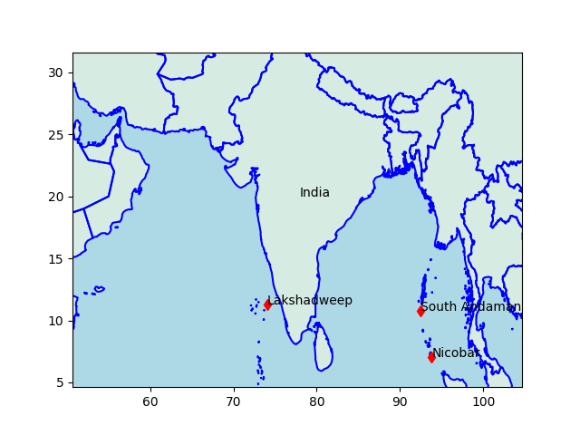

# Week 22 

---

<blockquote class="twitter-tweet"><p lang="en" dir="ltr">To deliver the accelerated 2030 <a href="https://twitter.com/hashtag/hydrogen?src=hash&amp;ref_src=twsrc%5Etfw">#hydrogen</a> 𝐝𝐞𝐦𝐚𝐧𝐝 &amp; 𝐬𝐮𝐩𝐩𝐥𝐲 𝐭𝐚𝐫𝐠𝐞𝐭𝐬 set by the <a href="https://twitter.com/hashtag/repowereu?src=hash&amp;ref_src=twsrc%5Etfw">#repowereu</a> plan, 5️⃣ large-scale <a href="https://twitter.com/hashtag/pipeline?src=hash&amp;ref_src=twsrc%5Etfw">#pipeline</a> corridors are envisaged. Read more: <a href="https://t.co/DS59rtNn5Q">https://t.co/DS59rtNn5Q</a> <a href="https://t.co/3d5s6LuPEm">pic.twitter.com/3d5s6LuPEm</a></p>&mdash; Fluxys (@FluxysGroup) <a href="https://twitter.com/FluxysGroup/status/1531965543477088263?ref_src=twsrc%5Etfw">June 1, 2022</a></blockquote> <script async src="https://platform.twitter.com/widgets.js" charset="utf-8"></script>

---

H2 Fuel News: "Gold Coast Transit District receives hydrogen fuel cell
bus for testing"

---

H2 View: "Hydrogen compression specialists, Calvera Industrial Group,
has signed a strategic alliance in a bid to consolidate its
international growth and presence in the US."

---

"@Lavjit_Singh

To meet the crazy 2030 hydrogen demand & supply targets, the 5 large
scale pipeline corridors planned for EU"

[[-]](https://twitter.com/Lavjit_Singh/status/1532263190951763968)

---

H2 View: "Airbus facility to develop cryogenic hydrogen tank system
for future planes"

---

"@WeAreEnergyNL

Nathan Ashcroft, Strategic Business Developer, Stantec Consulting Ltd.
spoke about hydrogen from a global perspective. Shared there are lots
of regional opportunities; hydrogen production moving by pipeline is
doable & we have the capabilities in NL"

---

Obama created this cunt. It might be his biggest mistake. He gave him
bunch of space contracts, which were used to create a geek image, and
that helped propel other ventures, shoddy "gizmo-biz" concoctions at
best.

---

That's why the e-jagoff keeps [badmouthing](https://www.cnbc.com/2021/12/06/elon-musk-has-strong-views-on-hydrogen-and-not-everyone-agrees.html)
the 'other option' bcz he remembers at one point in his sad
company's history, resources were taken from that other option, and
given to him. That, combined with low rates made that company
what it is today, not any solid foresight on tech or brains.

---

Bama admin did make that wrong emphasis on battery electric. They went
for the Obamacare of green tech, I guess that should not be
surprising.

[[-]](https://www.planetizen.com/node/72399)

---

I already had [some good material](2022/06/population-demographics-growth.html)
on the topic, then added some extra analysis (same post,
bottom part). No blatant correlation visible between working age population
(ratio) and gdp per capita. In fact I've never seen a less uncorrelated
graph in my life, on a viewpoint whose claims are so big..

They constantly use Japan as an example in this space, 'population
collapse', yet Japan is doing fine.

I repeat the argument I used last time - how many people does it take
to invent a f-ing Walkman?

"Working age population decreasing will mean the collapse of economies"

---

"Ew but demographics". That old chestnut.. is getting old 🤨. This is
the go-to analysis for people who want to throw around some
sophisticated-ish sound bytes wout much work.

---

Sample output below. Not bad..

I might switch to this lib.

```python
import trafilatura
downloaded = trafilatura.fetch_url('https://www.cnbc.com')
print (trafilatura.extract(downloaded))[2300:2500]
```

```python
```

```text
cks making the biggest moves midday: Salesforce, Delta, Albemarle and more
1 Hour Ago
SeatGeek terminates deal to go public with Billy Beane's SPAC due to volatility
1 Hour Ago
The Fed's Mary Daly say
```

---

Found out about a web scraping package `trafilatura`

---

How about Henny? Or Crissie?

---

Remy shows increase in earnings. 

---

"Veritas numquam perit". Hah

---

Politico: "Croatia on track to adopt the euro"

---

"@DanielLDavis1

Biden's rockets to Ukraine are modern, precision weapons, but won't
chg tactical outcome - and raise many questions. Wisest course remains
Ukraine seeking best deal possible"

[[-]](https://twitter.com/DanielLDavis1/status/1532033848019668992)

---

H2 View: "Green hydrogen projects in desert regions using
desalinization to provide the H2 production with water could also be
used to boost potable water levels for the people living there,
according to a new International Renewable Energy Agency
(IRENA) report"

---

H2 View: "A Nordic partnership has set its sights on building hydrogen
refuelling stations in Norway’s northern-most region, Finnmark"

---

H2 Fuel News: "Hydrogen-powered mobile retail hoped to stimulate
repopulation of Fukushima, Japan'

---

H2 View: "Construction machinery manufacturer Caterpillar Inc. has
announced a three-year project to demonstrate a hydrogen-fuelled
combined heat and power (CHP) system for building heating and cooling"

---

H2 View: "Agreement signed for 4bn waste-to-hydrogen facility planned
on the Suez Canal.. A memorandum of understanding announced between
the General Authority for Suez Canal Economic Zone (SCZONE) and
H2-Industries Inc. plans for a $4bn waste-to-hydrogen facility at the
Suez Canal’s East Port Said"

---

H2 View: "Hydrogen-powered mobile retail hoped to stimulate
repopulation of Fukushima, Japan.. Retail in Japan is getting a
hydrogen revamp, with Toyota deploying a hydrogen-powered fuel cell
vehicle to be used as a mobile retail business, to stimulate the
repopulation of the earthquake affected Fukushima"

---

H2 View: "Construction machinery manufacturer Caterpillar Inc. has
announced a three-year project to demonstrate a hydrogen-fuelled
combined heat and power (CHP) system for building heating and cooling"

---

H2 View: "South Australia Government set to develop a new hydrogen
Act.. The South Australia Government has announced it intends to
develop new hydrogen legislation to license and regulate the
production of hydrogen in South Australia"

---

Pipeline Journal: "European Hydrogen Backbone Initiative Adds 6 Pipeline Operators As Members"

[[-]](https://www.pipeline-journal.net/news/european-hydrogen-backbone-initiative-adds-6-pipeline-operators-members)

---

<blockquote class="twitter-tweet" data-conversation="none"><p lang="en" dir="ltr">3/ In 2⃣0⃣2⃣1⃣ our Portuguese member <a href="https://twitter.com/hashtag/GGND?src=hash&amp;ref_src=twsrc%5Etfw">#GGND</a> launched the Green Pipeline Project, the first project in Portugal 🇵🇹 to inject <a href="https://twitter.com/hashtag/Hydrogen?src=hash&amp;ref_src=twsrc%5Etfw">#Hydrogen</a> in the <a href="https://twitter.com/hashtag/NaturalGas?src=hash&amp;ref_src=twsrc%5Etfw">#NaturalGas</a> network, stepping up as a leader in the country&#39;s <a href="https://twitter.com/hashtag/EnergyTransition?src=hash&amp;ref_src=twsrc%5Etfw">#EnergyTransition</a>. <a href="https://t.co/VD2muFpoML">pic.twitter.com/VD2muFpoML</a></p>&mdash; GD4S (@gd4s_eu) <a href="https://twitter.com/gd4s_eu/status/1531651828269649922?ref_src=twsrc%5Etfw">May 31, 2022</a></blockquote> <script async src="https://platform.twitter.com/widgets.js" charset="utf-8"></script>

---

Wired: "[A]synchronous messaging is real-time chat now. We are always
on. That clear plastic corded phone that dialed up and signed me on
has morphed into the world’s most powerful pocket computer that also
happens to make phone calls. Provided we’re in range of cell service
or Wi-Fi, we can be reached at literally any time. The dreaded
ellipsis—the dot dot dot as someone types a response—has made us
captive audiences. We are all walking live chats"

[[-]](https://www.wired.com/story/bring-back-the-aim-away-message/)

---

Dirty Loops is what you get if you melded Michael Jackson with Rush.

---

Frank Grillo's last monologue in *The Grey* was excellent.. 

---

WION: "Australia step closer to replacing Queen.. There is now an
'assistant minister for the republic' in Australia, raising the
possibility that the Queen will no longer be the country's head of
state"

---

WaPo: "Israel, UAE sign free trade deal, first with an Arab country"

---

"Euro zone inflation hits yet another record high as food and energy
prices soar"

---

Who cares.. these are just trolls.. Nationalists sure but that's not
newsworthy..

"On the advice of the British Public Relations services, the Azov
regiment has just changed its badge. It discarded the wolfhook
(Wolfsangel) of the SS Das Reich Division in favor of three swords
placed in a trident"

---

WION: "United States has helped turn this tragic, local and ambiguous
conflict into a potential world conflagration. By misunderstanding the
war’s logic, Mr. Guaino argues [in *Le Figaro*], the West, led by the
Biden administration, is giving the conflict a momentum that may be
impossible to stop"

[[-]](https://www.wionews.com/opinions-blogs/the-war-in-ukraine-may-be-impossible-to-stop-and-the-us-deserves-much-of-the-blame-483965)

---

Russia has huge presence in Europe too (some of its effects we see
now); European Russia (the parts of RU in Europe), were it a seperate
country would be the largest one there.

---

It goes both ways.. Russia is a huge country in Asia every country
wants to, has to, be in good terms with it.. RU pays back in kind,
friendly with both India *and* China. Gave both nukes!

"How does Russia manage to have good relations with neighbors? Many
Asian countries seem to be in good terms with Russia"

---

Politico: "‘They are carpet-bombing us’: Ukrainian troops are getting
pounded as they await heavy weapons from the West"

---

H2 View: "New hydrogen refuelling station opened in Antwerp,
Belgium.. Belgium-based Colruyt Group’s energy and fuel suppler, DATS
24 opened its new hydrogen fuel station in Wilrijk, a district of
Antwerp, Belgium"

---

H2 View: "Michigan, US power plant to trial hydrogen fuel blend.. A
project to test hydrogen blended fuel to reduce carbon-emissions of
power plant operations in Michigan, US, has been announced"

---

H2 Fuel News: "Namibia proposes green hydrogen supply to EU to replace
Russian oil and gas"

---

Renault Scenic H2 Tech

<iframe width="340" src="https://www.youtube.com/embed/6mlMihcgEtY?start=1&end=114" title="YouTube video player" frameborder="0" allow="accelerometer; autoplay; clipboard-write; encrypted-media; gyroscope; picture-in-picture" allowfullscreen></iframe>

---

That is absolutely true.. An incremental change in a largely useless
direction. Perfect example of 'getting stuck at local maxima'. The
one-step change marketed to office-dwelling limpdicks who "like"
electricity (they can see the wall plug at home/work, it looks
sterile, 'clean', 'magical' unlike fuels which are mostly, like, ew).
The sale was done on the basis of "we'll make that magical thing
'green' for you by taking your cool laptop's battery and put it on the
car".  Despite appearances office dwelling limpdicks were too
uninformed or too fucking dumb to realize such approach could not
scale. That behind the magic there would be even [more
pollution](../../2021/10/the-rare-metals-war.html).

"Battery-electric tech is the Obamacare of green energy"

---

Obviously the implication below is people are half idiots, and that is
mostly true. But more than that, they are just busy. They have other
things to worry about, jobs, family, which take time. Politics,
statecraft is a profession. Just like we cant form an in-depth opinion
on a root canal and replace the dentist by 'media', cant do the same
for statecraft. People vote on their well-being, on the incumbent,
based on a few (three) general parameters which is enough for
democracy. The rest is rationalizations to sound cool around the
water-cooler for a decision that was already made on a much baser
level. This analysis is offputting for some, further away than a
Renaissance society they might have dreamt about but it's life. The
sights and people we saw on Jaywalking are not the exception, or even
an American phenomenon, they are the rule.

---

Issue polls don't matter much.. People voting for representatives who
dont care about gun control proves it. The issue's existence is dog
whistle for Rep elite survival, which matters. The gun issue can only
be fixed among representatives themselves (if changed they'll sell the
new position to the public who will follow, repeat the justifications
fed to them by the media), and that can only happen if the issue is
hot-button issue no more. Dems messed this up, they need to fix it.

"Why gun control laws don’t pass Congress, despite majority public
support and repeated outrage over mass shootings"

---

Thrilla with the Guerilla

"Colombia Presidential Election: Leftist Ex-Rebel Wins First
Round.. Gustavo Petro, a former guerrilla, took the most votes in
Sunday’s first round of voting by pledging to insert the state into
Colombia’s market economy, heavily tax the rich and move the country
away from its dependence on oil and coal"

---

CNBC: "The luna cryptocurrency has been resurrected after its $40
billion collapse. It's already crashing"

---

These girls are really good

What is hip ? (cover ) - TOKYO GROOVE JYOSHI \#music

[[-]](https://youtu.be/tA8PKx09ao8)

---

Israel and the Arab states were establishing relations, the killing of
the journalist complicates that, which could be the reason why it was
done. Thawing of relations could help the Palestine cause, maybe at
some point 'the new neighbors' would push for a Palestian state?  We
can't have that!

---

That's the other thing; people are locked up in a prison-like system
behind walls, *but* Israel needs workers, so people go through
checkpoints daily to work in Israel. Got walls, but we need workers,
and oh, also, we want to settle behind that wall, inside settlements
which themselves need their own walls. The situation is obnoxiously
stupid. I think deep down Israelis believe Palestenians will just
disappear somehow and they'll have the land all for themselves.

If Palestine had a stand-up comedy culture, its comedians would never
go without work. There is a wealth of material out there.

---

Jenin, the place where that poor female journalist was killed
recently, is in northern West Bank. Jenin is obviously behind the
wall, but still under military occupation. Extremely low income,
workers from there have to pass through checkpoints, with permits, to
enter Israel to work.

---

Gaza and the West Bank are both surrounded by walls, yet there is a
military occupation in the West Bank. One would think the walls would
create a de-facto Palestian state already. Egypt takes Gaza, West Bank
could declare statehood, w East Jerusalem as the capital. But the
settlements make that route impossible. Israel wants to have its cake
and eat it too. Isolate people behind walls, but then settle in their
land, that's where the need for 'extra protection' comes from.

---

Left-right combo. One hand giveth the other hand taketh away.

Al Jazeera: "Israel set to approve 4,000 settler units in occupied West Bank"

---

Al Monitor: "Israel should consider 'terror' tag for Jewish extremists: Benny Gantz"

---

CNBC: "China faces a nearly $1 trillion funding gap. It will need more
debt to fill it."

---

India has some good radar coverage there, monitoring a lot of key naval space

---

```python
u.sm_india()
```



---

Jane's Defense: "India to install Phase 2 of coastal radar network by
2023..  [R]emote static sensors [were installed] at 46 locations.. 36
of the stations are on the mainland and 10 on island territories,
including Lakshadweep, Minicoy, and Andaman and Nicobar
Islands.. Phase 2 will insert an additional 38 stations into the radar
network to strengthen coverage.

---

FT: "[B]ehind the confident rhetoric, there is much less clarity about
what Washington actually believes can and should happen in
Ukraine. There is little detail about what a strategic defeat for
Russia would actually look like or what sort of territorial settlement
the US might end up encouraging the Ukrainians to accept...

But at the same time, it is trying to hold together an international
coalition in support of Ukraine that includes some European allies who
worry loudly and openly about the impact of a long protracted war,
both on Ukraine and its society and on their own economies.

In recent weeks, the leaders of France, Germany and Italy have all
made statements encouraging some sort of ceasefire and negotiated
settlement"

---

AFP: "Dutch energy firm says Russia's Gazprom to cut gas supplies after
it refused to pay in rubles"

---

WSJ: "Russian Forces Push Into Key City in East Ukraine.. The fight
for Severodonetsk, one of the last Ukrainian strongholds in the
eastern Donbas region, underscores the central role of artillery in
the war"

---

Oman has sunshine, has great access to the high seas. Perfect industry
for them. Export clean molecules to India, Europe, even Japan.

<blockquote class="twitter-tweet"><p lang="en" dir="ltr">Our third ⭐ most-read ⭐ <a href="https://twitter.com/hashtag/H2View?src=hash&amp;ref_src=twsrc%5Etfw">#H2View</a> story this week saw a joint development agreement (JDA) toward a ‘multibillion-dollar investment’ in a world-scale <a href="https://twitter.com/hashtag/greenhydrogen?src=hash&amp;ref_src=twsrc%5Etfw">#greenhydrogen</a>-based <a href="https://twitter.com/hashtag/ammonia?src=hash&amp;ref_src=twsrc%5Etfw">#ammonia</a> production facility in <a href="https://twitter.com/hashtag/Oman?src=hash&amp;ref_src=twsrc%5Etfw">#Oman</a> was signed. <a href="https://twitter.com/hashtag/hydrogennow?src=hash&amp;ref_src=twsrc%5Etfw">#hydrogennow</a> <a href="https://twitter.com/hashtag/hydrogen?src=hash&amp;ref_src=twsrc%5Etfw">#hydrogen</a><a href="https://t.co/ZovuhoCxNN">https://t.co/ZovuhoCxNN</a></p>&mdash; H2 View (@h2_view) <a href="https://twitter.com/h2_view/status/1530700461145313282?ref_src=twsrc%5Etfw">May 29, 2022</a></blockquote> <script async src="https://platform.twitter.com/widgets.js" charset="utf-8"></script>

---

Party-pooper indeed..

[[-]](../../2021/10/the-rare-metals-war.html#ref2)

---

On average reserves increased by 2.4% annually. Latest increase was
0.46%. Besides that new action offshore around Surinam we don't hear
any big news anymore on oil finds. The next Ghawar eludes all. 

```python
import pandas as pd
df = pd.read_csv('../../0119/2019/05/oil-proved-reserves.csv')
df = df[df.Entity=='World'].set_index('Year')
print ('%',np.round(df['Oil - Proved reserves'].pct_change().mean()*100.0,2))
```

```text
% 2.4
```

---

For 2020 that number was 1,732 gboe, last number represent a modest
increase.

Oil and Gas Journal: "According to [our] annual assessment, the
world’s proved oil reserves total 1,724.5 billion bbl at yearend 2021"

---

What happens to the global price of crude they ask. Who cares? There
would b a US price, an EU price, so on..

---

And here we are discussing bleeping fossil again.. I ask for
CCS-enabled new refineries that can produce clean molecules.

---

Put the two and two together; US looking at refining capacity, has
crude.. Maybe US will simply stop exporting, refine its own oil and
release to the market, reintroducing the export ban? That'll get you
an additional 8 mb/d of oil pretty quick. US could essentially double
its supply of gasoline and halve the price.

---

"In 2021, the United States exported about 8.63 million barrels per day
(b/d) and imported about 8.47 million b/d of petroleum"

---

Bloomberg: "White House Eyes Restarting Idle Refineries to Tame Fuel Prices"

---

They didn't use their biggest bullet. You are thinking too globalist,
too free market.

Yahoo: "Gas prices have hit record highs but don't expect Biden to
lower them: 'They already used their biggest bullet' [meaning the use
of petroleum reserves]"

---

Not even June yet but already had a 'feels like 39 C' day.

---

This is not some Zen koan or ancient parable. It comes from
mathematical optimization. Optimizing algorithms look for global
minima (or maxima) all the time, and they always try not to get stuck
at "local solutions". 

---

In that case climb down, apply same technique in a different
direction, or try to see two steps ahead if possible; that means have a
two-step plan instead of just one.

---

The one-step vs two-step solution issue is related to small,
incremental wins. Imagine being outside, during a fog, night time, how
to reach the top of a highest near hill? Simple solution - always move
in the uphill direction. Works remarkably well. Even if we lose long
distance vision, improving the current situation builds up in the
long-run, leads to global solution.

But, one can still get stuck on a "local minima". Because we didn't
look ahead, could have climbed the nearest *shorter* hill. The fog clears
we see [this](twimg/FT3wrouWQAIZqaL.png).

---

All girl Japanese funk band. Funky.

Funk No.1 - TOKYO GROOVE JYOSHI \#music

[[-]](https://youtu.be/3K8dNctci1Y)

---

YTD market summary: FOMO turned to FUD. 

---

"3,000 employees in Britain taking part in world's biggest pilot for
four-day workweek"

---

WION: "A 390 million-year-old fish-like creature with four limbs that
was discovered in Scotland in the 1890s has been revealed to be the
first ancestor of all four-limbed animals, including humans"

---

Didn't PM May say "no UK prime minister could ever agree" to an Irish
Sea border? Well there is one now. There is a customs border in the
Irish Sea. That means Brexiters broke the UK to 'deliver Brexit'. They
cut themselves off from the EU which forced them to cut UK into pieces

---

They haven't delivered shit. They swept the hard issues under the
carpet, ending up with worst of both worlds. Those issues are coming
back to bite them in the ass now.

"Current UK government delivered Brexit"

---

WION: "Sri Lanka buys Russian oil amid economic meltdown"

---

Done well? Part of their country is *taken*. Over 6 million of the
country's citizens are now refugees. I dont think they are doing well.

"But Ukraine has done well so far"

---

Ukraine is not NATO. NATO-trained yes

---

Not true. NATO would be a formiddable foe against Russia, or anyone
who is dumb enough to take them on. Minus nukes, they'd wipe the floor
with any other power. With nukes involved obviously everyone loses.

"NATO would lose against Russia"

---

Massive electronic-warfare utilization, can have incoming missiles go
haywire. Increased target acquisition capab for later artillery
bombardment.. Can't fight this shit through proxy. Looks bad.

---

Russian New Generation Warfare Handbook

[PDF](https://info.publicintelligence.net/AWG-RussianNewWarfareHandbook.pdf)

---

Business Insider: "[2/2022] At the tactical level, Russia's
non-contact warfare doctrine seeks to leverage drone spotters and
electronic warfare to locate enemy forces for destruction at standoff
distances using artillery without exposing tanks and infantry to
direct fire until the opposition is shattered"

[[-]](https://www.businessinsider.com/russia-ukraine-war-would-be-artillery-and-missile-showdown-2022-2)

---

H2 View: "Leading European healthcare and tech-related company
independent investment bank Bryan Garnier was Lhyfe’s joint global
coordinator and joint bookrunner at the green hydrogen company’s €110
million IPO on Euronext Paris"

---

H2 Fuel News: "The Québec Government in Canada has released it Québec
Green Hydrogen and Bioenergy Strategy to accelerate the production,
distribution and use of green hydrogen and bioenergy"

---

H2 View: "Queensland puts 2 million AUD into local wastewater hydrogen
project.. Goondiwindi Wastewater Treatment Plant (WWTP) in Queensland,
Australia, is set to expand into hydrogen production, using solar
energy following A$2m (1.4m) of state funding"

---

H2 View: "Chemours explores hydrogen electrolysis and fuel cell
investments. Global chemistry company, Chemours Company has said it is
exploring hydrogen economy capacity investments which could support
the growth of electrolysis and fuel cell technology"

---

H2 Fuel News: "Feasibility study to clean up hydrogen production in
Kansas, US announced.. The study will evaluate the applications of
carbon capture and hydrogen purification in an effort to reduce the
company’s emissions....

Honeywell claims its technology can recover more than 99% of carbon
dioxide emissions in the existing hydrogen plant, while increasing
high-purity hydrogen recovery"

---

"Kidnappings. Outbreaks. Earthquakes. The president assassinated —
this time in his bedroom. How is it possible, many ask, that Haiti
shares an island with the Dominican Republic, with its underground
subway system, health care coverage, public schools, teeming resorts
and impressive stretches of economic growth? Corruption is the usual
explanation..

[I]f Haiti had not been forced to pay its former slave masters, one
team of international scholars recently estimated, the country’s per
capita income in 2018 could have been almost six times as large —
about the same as in its next-door neighbor, the Dominican
Republic.They called the burden imposed on Haiti “perhaps the single
most odious sovereign debt in history.'"

[[-]](https://www.nytimes.com/2022/05/20/world/americas/haiti-history-colonized-france.html)

---

The 'gun problem' cannot be fixed by simply harping about gun control.
'Guns are killing people, fix guns'. Nope. Centrist Dems starting
during the 90s created a culture war around this issue, so one-step
solution will meet intense objection. But if all parties are
ideologically distinct, seperate and secure in their seperation
(dividers not uniters) then 5G issues will find easier agreement. We
know this can happen because it happened before; Reagan was for gun
control. Nixon founded the EPA. Two steps; fix ideology first, gun
agreement later.

---

The world is sufficiently fucked that one-step solution are no more
enough to fix problems. We cant fix the 'green energy problem' by
simply producing 'green electricity'. What will come after? How do you
transmit the energy? 'Well we just extend existing transmission lines'
(suboptimal). So the one step taken to make electricity 'green'
fails. Two-steps was needed not just one. First step; the energy
transmission mechanism changes, becomes gas based. Second step; Green
energy is produced, converted into green gas, using the new
transmission.

---

♪♬ Gonna take it right ♪♬ into the ♪♬ Danger Zone ♪♪

Wa wa wawawa

---

A lot riding on Maverick

---

Bloomberg: "Theathers pin hopes on new *Top Gun*"

---

Paper: "The performance of high-yield bonds in the US domestic market
mirrors economic performance in the US overall. The yield spread of
high-yield debt over investment grade corporate bonds is more of a
function of the general outlook of the economy than of the health of
the issuing companies themselves, although the latter is obviously
important"

---

"@0xfoobar

Luna 2 investors"

[[-]](https://twitter.com/0xfoobar/status/1530409704387657729)

---

Luna 2.0? 

---

"Luna and UST had a combined market value of almost 60 billion
dollars. Both tokens are now essentially worthless"

---

Oh yes but they didn't have a Bill Clinton, or the centrist Democratic
Party.

"Norway and Finland have similar levels of gun ownership, but far less
gun crime"

---

Sure this whole thing will be solved in a jif by skillful Twitter
put-downs. \#Guns

---

That won't happen; at worst their military takes over, as they've done
many times before, and they run the country along with its nukes.
Obviously a coup would be bad.

"Pakistan could become a failed state and their nukes could fall in
the hands of extremists"

---

Politico: "In what sounds like bargaining rather than an unconditional
promise, Russian President Vladimir Putin toyed with the idea of
reopening the Odesa port for grain exports — while again calling for
the lifting of Western sanctions against Russia.

Putin made the remarks during a call Saturday with French President
Emmanuel Macron and German Chancellor Olaf Scholz, as concerns
worsened over a looming food crisis due to the inability to export
Ukraine’s grain amid the conflict"

---

Reuters: "China signs deal with Samoa as Australia vows Pacific Islands plan"

---

WION: "More western arms supplies to Ukraine risks ‘further
destabilisation’, Putin warns"

---

That was 'too slow'? A lot of military experts here

---

Wrote about that place 3 weeks ago. It's gone. Shit is no joke.

NDTV: "Russia Confirms Capture of Eastern Ukraine Town Lyman"

---
