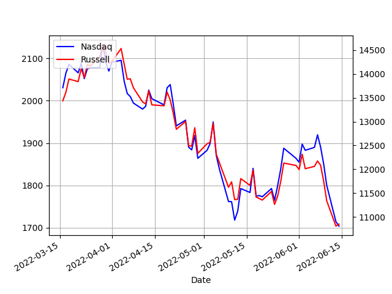

# Week 24 

---

H2 Central: "MAN Engines put its first two dual fuel hydrogen-powered
engines for work boats into serial operation. These comprise two
twelve-cylinder diesel engines of type MAN D2862 LE448, each with an
output of 749 kW (1019 hp) at 2100 rpm"

----

H2 View: "Torrens Island, Adelaide, Australia is set to become the
focus of a feasibility study to transform the island into a green
hydrogen energy hub"

---

H2 View: "Rock cavern hydrogen storage pilot inaugurated in
Sweden.. SSAD, LKAB and Vattenfall announced they were inaugurating
HYBRIT’s pilot rock cavern hydrogen storage facility at Svartöberget,
in Luleå, Sweden"

---

H2 Central: "Hexagon Purus, through its wholly owned subsidiary
Wystrach GmbH.. has received a follow-on order for hydrogen
distribution systems from.. a company owned by ZE PAK, Poland’s
largest privately owned [energy producer].. The follow-on order can be
viewed in conjunction with the announcement in Hexagon Purus’ Q4 2021
presentation for hydrogen distribution systems and mobile hydrogen
refueling stations. The value of the follow-on order is approximately
EUR 3.5 million.. [VP] Maciej Stec.. said 'As a Group, we want to
change the world, and the world is turning to green hydrogen'"

---

H2 Central: "Morocco has now added another ambitious objective through
its energy policy agenda: it hopes to become the world market leader
in the production of green hydrogen. Soaring demand for the new
zero-emissions fuel means that hydrogen production is a sure-fire
future sector"

---

H2 Central: "GE – New Gas Turbine to Help Smooth Florida Transition to
a Solar-Heavy Grid, to Burn a Fuel Mix Blending Natural Gas with up to
50% Hydrogen"

---

H2 View: "GE hopes to explore hydrogen in gas turbines further.. The
new GE gas turbine has the capability to burn up to 50% by volume of
hydrogen when blended with natural gas, the company has claimed"

---

H2 Central: "The European Commission unveiled its plans to kick off a
European Electrolyser Partnership. This Partnership aims to address
the challenges in establishing and maturing a strong industrial
manufacturing base in Europe and identify potential mitigating
policies and actions where necessary"

---

H2 Central: "South Korean plant builder Doosan Enerbility
Co. announced that it had signed an agreement with KEPCO Engineering &
Construction Co. and Samsung C&T Corp. to invigorate mixed combustion
technologies that generate electricity using green ammonia"

---

H2 Central: "Japanese thermal power producer Jera and refiner Idemitsu
have agreed to jointly consider developing a hydrogen supply chain in
central Japan’ Ise bay area, where various industries are concentrated
and demand for the clean fuel is expected to increase with a drive
towards decarbonisation. Jera and Idemitsu will mainly study setting
up bases to receive, stock, process and dispatch hydrogen using their
existing facilities in the region"

---

<blockquote class="twitter-tweet"><p lang="en" dir="ltr">The Great Wall Motor stable is set to expand to include a new, high-end brand specialising in hydrogen fuel-cell electric vehicles. <a href="https://twitter.com/hashtag/GreatWallMotors?src=hash&amp;ref_src=twsrc%5Etfw">#GreatWallMotors</a> <a href="https://twitter.com/hashtag/Hydrogen?src=hash&amp;ref_src=twsrc%5Etfw">#Hydrogen</a> <a href="https://twitter.com/hashtag/News?src=hash&amp;ref_src=twsrc%5Etfw">#News</a> <a href="https://twitter.com/hashtag/SWMFeed?src=hash&amp;ref_src=twsrc%5Etfw">#SWMFeed</a> <a href="https://twitter.com/hashtag/GreatWallMotor?src=hash&amp;ref_src=twsrc%5Etfw">#GreatWallMotor</a> <a href="https://twitter.com/hashtag/GWM?src=hash&amp;ref_src=twsrc%5Etfw">#GWM</a> <a href="https://twitter.com/hashtag/HydrogenFcevs?src=hash&amp;ref_src=twsrc%5Etfw">#HydrogenFcevs</a> <a href="https://twitter.com/hashtag/HydrogenFuelCellElectricVehicle?src=hash&amp;ref_src=twsrc%5Etfw">#HydrogenFuelCellElectricVehicle</a><a href="https://t.co/0m6lbdCpfb">https://t.co/0m6lbdCpfb</a></p>&mdash; CarExpert (@CarExpertAus) <a href="https://twitter.com/CarExpertAus/status/1531067458504761345?ref_src=twsrc%5Etfw">May 30, 2022</a></blockquote> <script async src="https://platform.twitter.com/widgets.js" charset="utf-8"></script>

---

H2 Fuel News: "Mitsubishi Power, Georgia Power and EPRI have completed
the largest H2 carbon reduction mix...  The hydrogen fuel blending
took place at the Plant McDonough-Atkinson owned by Georgia Power, in
Smyrna, Georgia. The combination took place as a part of a
demonstration project. It was the first to have validated a 20 percent
H2 blending on an advanced class gas turbine in North
America. Moreover, it also represents the largest of its kind to date,
with a 20 percent mix, which reduces the carbon emissions by 7 percent
when compared with natural gas alone"

---

H2 Central: "Fleets of hydrogen taxis are picking up across
Europe... Europe’s market for hydrogen-powered taxis is becoming
increasingly competitive, with French company Hype, which has
developed them in Paris since 2015, being among the
frontrunners. EURACTIV France reports"

---

I'm sure they can turn out the next product for 100% H2 usage if
circumstances require.

---

Looks like a fine product


---

GHG? 80% CO2, 20% methane. Methane is 60% human caused, 40% natural.

[[-]](../../2022/06/ghg-sources.html)

---

That is a funny story \#leemack 

[[-]](https://youtu.be/dmbpagijVkk?t=40)

---

"@anjilslaire

I get in my car this afternoon to go to a Dr appointment and the
dashboard screen says 'Update available. Park vehicle. Turn off
ignition. Car will be inoperable until completion. ETA 15min'
sigh. Paging @internetofshit"

---

@EvanHillHB

THIS TOASTER HAS A FUCKING HOME SCREEN

[[-]](twimg/FVbMaftUYAAs7fC.jpg)

---

"@jasongoepfert

More than 90% of stocks in the S&P 500 declined today.

It's the 5th time in the past 7 days.

Since 1928, there have been exactly 0 precedents. This is the most
overwhelming display of selling in history"

---

Hardball. RU is sending a message.

WION: "Russia-Ukraine war: Italy's Eni says Gazprom to reduce gas
supply Friday by 50%"

---

NS1 and NS2 together would deliver upwards of 120 GW power. Insane amt
of energy. 

---

NG has 10.55 kWh per cubic meters.  10.55 x 70 x 1e6 / (24 x 1000
x1000) equals 30 GW, nearly half of Norstream 1.

BBC: "The boss of Russian state-controlled gas giant Gazprom has said
it is a case of 'our product, our rules' after the firm halved its
supply to Germany.. to under 70m cubic metres per day - well under
half the current rate"

---

The pipeline envisioned (in my natgas map) through Cyprus is a
proposal, it doesn't yet exist, at least 7 yrs away according to
reports. 

Al Jazeera: "Is the EU deal with Israel and Egypt a way out from
Russian gas?.. Critics argue that the EU will face problems dealing
with Israel and Egypt despite Brussels's enthusiasm"

---

Apparently the voice-over is James-Earl Jones' earlier work resampled,
regenerated.. It was as though JEJ was speaking. Uncanny.

---

*Obi-Wan Kenobi* Episode 5 was good; Vader, OWK were in top form.
Little Leia's character definitely reminds one of the adult Leia. The
story complements the original trilogy, now we know how Leia knew
about OWK, she asked for his help later in trilogy bcz knew him from
before. Great to see McGregor, Christensen again.

---

If yes then the product can do well in rural areas, farms.

---

What are the features of this robot? Can it perform all the tasks a
goat can? 😶

FT: "Japanese goat robot helps ageing society. Engineers at Japan's
Kawasaki Heavy Industries show off their latest invention: a
four-legged rideable robot modelled after an Ibex"

---

Interesting, [this guy](https://youtu.be/MElMJsIP1Y0?t=404) puts in
melted liquid tallow on top of dried beef, the whole thing hardens
together. It's true, melted fat binds together extremely well once
cooled.

---

Draxe: "Tallow is rich in CLA, a fatty acid that studies suggest can
support a healthy metabolism and may lead to fat burning. There's some
evidence demonstrating that CLA also has anti-inflammatory and
immune-supporting properties, possibly even fighting growth of tumors,
as does the fatty acid oleic acid"

---

How to make beef tallow? Axe the butcher, 'need beef fat', they'll
have it on the side. Tallow has CLA, can't do without. No wonder
American Indians mixed fat into pemmican.

---

Is this permanent resettlement status numbers? How about all peoples
who left their country and entered this other one? This API
sucks. Also a simple CSV file per year, from-country, to-country
counts would be fine for a general outlook. Details, demographics etc
can be in a seperate file.

---

[Link](https://drive.google.com/uc?export=view&id=1KdW52Guba1DGZyioXMrc9BU8OMBfFcmh)

---

Says a total 270K people went from Syria into TR? There were more
people than that!

---

🤨 🤨 🤨 

```python
import pandas as pd, datetime, io
import urllib.request as urllib2

url = "http://api.unhcr.org/rsq/v1/export/csv?type=submissions&year="+\
      "2012,2013,2014,2015,2016,2017,2018,2019,2020"+\
      "&origin=SYR&resettlement=TRY"

r = urllib2.urlopen(url).read()
df = pd.read_csv(url,sep=',',skiprows=11)[['Year','Total submissions (persons)']]
df.columns = ['Year','Refugees']
df = df.set_index('Year').dropna()
print (df,'\n\n','Total',np.float(df.sum()))
```

```text
      Refugees
Year          
2012      90.0
2013    5277.0
2014   21154.0
2015   53305.0
2016   77254.0
2017   37332.0
2018   28189.0
2019   29660.0
2020   18220.0 

 Total 270481.0
```

---

UN has a data API `api.unhcr.org`, allows data access to refugee
numbers. Checking

---

FT: "Christopher Geidt resigned as ethics adviser to Boris Johnson
after a potential breach of World Trade Organization rules proved the
final straw following the partygate controversy"

---

CNBC: "Dow falls 700 points, tumbling below 30,000 to the lowest level in more than a year"

---

Oooww burn 🔥 

Al Monitor: "Saudi embassy in Washington now on 'Jamal Khashoggi Way'"

---

Am I for lifting sanctions on Cuba? Sure why not - but the party doing
it would get killed in Florida. They're crazy about that stuff over
there. Emotional subject; very hard to work around. 

---

It was Eisenhower's plan with lots of odd restrictions added on
top. JFK had mil experience but for some reason had bizarre ideas
about mil operations and did not utilize his own military efficiently.

---

Bay of Pigs failure resp lies with Kennedy, [bungled](../../2021/08/nuclear-folly-plokhy.html#bayofpigs)
the whole thing. The plan followed by the military was the one approved by WH.

"Bay of Pigs was US military's fault"

---

What would the military-industrial complex have to gain from JFK's
death? He was good to them. Increased their budget many times over the
years (whenever he was smacked around by the Soviets he'd go to
Congress and ask for more money, give it to mil).

---

If there was a conspiracy for the assasination of JFK it was a
conspiracy originating from Cuba; Castro might have wanted payback for
USA trying to assasinate him.

---

Captured near the gobble gobble controlled area apparently. That
should be no surprise; US itself helped most of those force to topple
Assad with TR help, those f-kers would roam around for sure in the
same area.

The op was conducted along with fighters from NE Syria, the
Kurdish-controlled territory, it appears US sent a message with the
op.


ABC News: "Senior IS leader captured in US-led military raid in Syria"

---

Al Jazeera: "As Russia advances, is Western support for Ukraine
faltering? Kyiv is appealing for more heavy weapons from its backers,
but Western leaders' rhetoric suggests support may be ebbing"

---

<blockquote class="twitter-tweet"><p lang="en" dir="ltr">Bosch North America announced it will be investing $1.3 billion in hydrogen fuel cell and electrolyzer technology by 2025. <a href="https://t.co/r2Sl5ePqSp">https://t.co/r2Sl5ePqSp</a> <a href="https://t.co/farrACJmR7">pic.twitter.com/farrACJmR7</a></p>&mdash; Jason Curtis (@ski_jason) <a href="https://twitter.com/ski_jason/status/1536758744297644036?ref_src=twsrc%5Etfw">June 14, 2022</a></blockquote> <script async src="https://platform.twitter.com/widgets.js" charset="utf-8"></script>

---

I like red - bypass electricity wherever possible

H2 Fuel News: "The following is how red, pink and purple nuclear
hydrogen are made.. Red hydrogen – This form is made by using the
high-temperature catalytic water electrolysis powered by a plant’s
thermal energy"

---

H2 View: "Oil major, bp is set to take a 40.5% stake in one of the
world’s largest renewables and green hydrogen energy hubs in Western
Australia, which could produce 1.6 million tonnes of green hydrogen
per year. bp has announced it has agreed to acquire a 40.5% equity
stake in and become the operator of the Asian Renewable Energy Hub
(AREH), in Pilbara, Western Australia from July 1, 2022"

---

H2 View: "Lhyfe and Chantiers de l’Atlantique have partnered to take
large-scale hydrogen production offshore, hoping to develop the
‘hydrogen fuel chain’ at sea and in ports"

---

H2 View: "Rotterdam ammonia terminal to be scaled to three million
tonnes per year"

---

H2 View: "Scottish towns and rural communities are the targets of a
new partnership which hopes to supply sustainable hydrogen gas for
domestic heating"

---

H2 View: "SoCalGas scores $750,000 grant for hydrogen from biogas
development project.. Grant from the California Energy Commission is
to help overcome cost and sustainability challenges"

---

Gas-fired plants with CCS generating electricity is relatively clean
but inefficient. Electricity as a transmission mechanism has problems;
it is slow, generation has to match demand, exactly, every time. That
causes power plants to unnecessarily ramp-up, ramp-down their
production, and/or complicated mechanisms to try to predict power
usage. Storing electricity is expensive, batteries are too heavy,
based on rare earth materials, and prone to catch fire.

---

An energy analyst (Bruce Robertson) says Western AU has no power
problems bcz they mandated cheap purchase of gas for power plants
\#ABC

---

"@MarkOgge

Understand that the 96% foreign-owned LNG gas export companies
currently making windfall profits from gouging Australian customers
for our own gas"

---

The problem likely is when your domestic resources become part of an
international supply/demand mechanism pricing problems can
ensue. You'd have the resources locally, but essentially be competing
against international customers to get at those resources. No wonder
some countries even nationalized the resource production capacity
outright.

---

Suspended? Daam

Renew Economy: "[Oz] Energy Market Operator has suspended the National
Electricity Market across all five participating states, saying the
market has become 'impossible' to operate because of the soaring cost
of fossil fuels and generators withholding their capacity from the
market... The extraordinary situation has been triggered by the
soaring cost of coal and gas. Generators who have to purchase coal on
the spot market"

---

Load shedding basically means there isn't enough supply so delivery is
cut (shed). Oz has vast natural resources though, they should be fine.

ABC AU: "In the electricity industry no two words instil a greater
sense of fear or failure as load shedding.. In order to avoid
circumstances where supply and demand become dangerously out of whack
the market operator can cut power to big numbers of customers to
restore balance — it sheds the load"

---

I wanna see a handshake. A big wide smile.. I wanna see f-ing Camelot
oozing outa that. Do it Biden

Al Monitor: "Biden gambles there's more to gain by courting
Saudis.. Making an about-face by visiting Saudi Arabia, US President
Joe Biden is betting he has more to gain than lose even as rights
activists accuse him of selling his soul to oil"

---

Artemis - B3 \#music

[[-]](https://youtu.be/sULRifeWz_k)

---

Al Jazeera: "The Gaza Strip had seven main border crossings giving it
access to the outside world. Only three remain open"

---

AMLO going after Lyin Ted for some reason - it's funny.

---

The spread of white collar work did not create smarter people who can
shoot the shit intelligently on any topic; it created parrots who
merely transmit talking points they hear on MSM; they only act
intelligently for show, to look cool by the watercooler, as if in an
episode of *The West Wing*. The Renaissance Man or Woman remains a
distant mirage, people are as stupid as ever. 

---

Need to reflect on the last great American thinker; Mark Twain and why
he was extremely negative on the virtues of the common man. US
founders built the Republic BTW not only against various branches of
power, balancing them against eachother, but also against the people
themselves for a reason.

---

Similar cultures modernize similarly; I look at the history of Greek
military coups I see a similar history to Asia Minor. Greece "the
birthplace of democracy" experienced numerous coups well into the end
of 20th century - the one in 1967 was the worst; it lasted until 1974,
their chief figure was a guy nicknamed "Greek Gaddafi". This guy
helped orchestrate the initial coup, did another coup while inside the
coup, and a seperate one all the way in Cyprus. Characters like that
were dime-a-dozen in homieland during the same era.

---

I wonder how many suckers lost money in that last bump thinking it was
time to buy the dip.



---

NYT: "Russia’s Oil Revenue Soars Despite Sanctions, Study Finds.. The
United States has made a dent in Russia’s earnings, banning all
Russian fossil fuel imports. Still, the United States is importing
refined oil products from countries like the Netherlands and India
that most likely contain Russian crude, a loophole for oil from Russia
to make its way to America"

---

The Independent: "Death sentences of British fighters in Ukraine a
warning to ‘soldiers of fortune’, Russia says"

---

NDTV: "Opening of first bridge between Russia and China.. The
kilometer-long Blagoveshchensk-Heihe highway bridge was inaugurated
over the Amur River, connecting Russia and China"

---

H2 View: "Bosch announces $1.3B hydrogen technology investment by
2025.. The largest automotive supplier in the world is turning its
attention to H2 tech and its industry potential"

---

H2 Fuel News: "A joint hydrogen refuelling station project between
TotalEnergies and H2 Mobility Deutschland in Freiburg, south Germany,
is now open to customers"

---

H2 View: "The first hydrogen refuelling station has been opened in
Mestre, Venice, Italy, marking a milestone in the steps towards a
hydrogen refuelling network in Italy"

---

H2 View: "A hydrogen-powered tanker ship concept has been launched by
TECO 2030 and its partners, Ektank AB, Shell Shipping and Maritime,
and DNV, furthering efforts to clean up the maritime sector. Dubbed
the Hy-Ekotank, it is set to facilitate a 100% reduction of greenhouse
gas (GHG) emissions during voyages by retrofitting fuel cells with
compressed or liquid hydrogen storage on existing Ektank ships.

---

H2 View: "Toyota places fresh focus on liquid hydrogen following Fuji
24 Hours [race].. Recent Toyota news headlines are placing the
spotlight on the automaker's new raised focus on liquid hydrogen for
its developmental Corolla racer following the car's finish in its
second Fuji 24 Hours earlier this month. Behind the wheel aboard the
hydrogen fuelled car were Toyota president Akio Toyota"

---

H2 View: "[South Korean] Chung-Ang University claims the new catalyst
[invented], composed of hydroxide-sulphide heterostructure, is cheaper
and more efficient than traditional methods, with hopes it could
improve the scalability of hydrogen production"

---

"@abc730

'Reducing methane going into the atmosphere is the most cost-effective
way to reduce climate change today. We don’t need major changes in
technology, we don’t need to find places where we can stick methane
deep into the earth.' – Professor Bryce Kelly, UNSW"

---

"@abc730

'The rate of methane is increasing at a record pace. Methane has a
global warming potential on a 20-year timeline that's about 84 to 86
times greater than carbon dioxide.' – Professor Bryce Kelly, UNSW"

---

Bryce Kelly from UNSW on methane emissions.

[[-]](https://www.abc.net.au/news/2021-09-28/methane-emissions-higher-than-estimates-in-coal-seam-gas-region/100497292)

---

CCS at the source is ideal bcz if natgas travels in the pipes, goes
into cities, heaters, storage, it will leak. See
[this picture](twimg/EiuaeZPVoAEckhC.jpg)
from Australia.

---

The amount of potential energy sitting in reserves in the form of
natural gas is huge, it would be foolish not to use it. Shared a post
on the Qatar North Field before. Saudi Ghawar oil field is big, this
thing is bigger. Ghawar has been producing crude oil for the entire
world since the 40s - NF tops that!

---

That is great actually.. With some additional cost for CCS, blue H2
production can have little or no emissions. Until green forms of
production, if it arrives, the natgas path will increase H2 adoption.

H2 Fuel News: "US hydrogen production gets support from $8 billion
H2Hubs program.. The Department of Energy launched the program this
month [which treats] all forms of H2 the same.. The idea is to use
methods more readily available to begin making H2 sooner and to
encourage earlier adoption."

---


---

"@gnoble79

Markets only really crash from oversold conditions. Equity markets are
confronted with the unholy trinity of rising interest rates, a rising
oil price and a rising dollar. Selling by retail has been
minimal. Last Thursday saw record one day inflows. $ARKK has seen
inflows in 10 of the last 13 weeks despite a 50% YTD decline in share
price.. These are things one does not see at a bottom. The complacency
is staggering.  I fear that the investing public will soon get the
memo and that there will be a rush for the exits. The Fed safety net
has Been removed. In fact, the Fed put has been replaced by a Fed
call. Whatever happened to don’t fight the Fed?"

---


---

You could replace the word Greece with Asia Minor and the story would
still make sense. Means of production defines (nearly)
everything. Cultures around near regions are similar (bcz they produce
similarly). Asia Minor has a lot of Hellenic culture in it. Obviously
as countries modernize they go through changes, but I argue similar
countries still modernize similarly.

---

Interesting story from anthropologist Ian Morris

[[-]](../../2021/05/farmers-foragers-fossils.md#donkey)

---

The Ip Man movies are catching up with Bruce Lee movie count.. The teacher
is surpassing the student.

---

\#geek

[[-]](twimg/FVHjKjXX0AAjojg.png)

---

The way Dr. Oz simply regurgitated culture war material and still won
the primary cheapens conservatism.. It is one thing Trump won with
that method, quite another the approach spreading and becoming "a
thing".  That could be the reason for the backlash against Oz.

---

Scientific American: "Universal Health Care Could Have Saved More Than
330,000 U.S. Lives during COVID.. The numbers of lives lost and
dollars spent would have been significantly lower if coverage had been
extended to everyone, a new study says"

---

<blockquote class="twitter-tweet"><p lang="en" dir="ltr">In <a href="https://twitter.com/TheLancet?ref_src=twsrc%5Etfw">@TheLancet</a>, my colleagues and I calculated that <a href="https://twitter.com/hashtag/MedicareForAll?src=hash&amp;ref_src=twsrc%5Etfw">#MedicareForAll</a> would save over $450 billion and 68,000 lives annually. Our calculations were prior to the <a href="https://twitter.com/hashtag/COVID19?src=hash&amp;ref_src=twsrc%5Etfw">#COVID19</a> pandemic. The economic and health savings would be even greater now. <a href="https://twitter.com/BernieSanders?ref_src=twsrc%5Etfw">@BernieSanders</a> <a href="https://t.co/BbjAIyZB50">https://t.co/BbjAIyZB50</a></p>&mdash; Dr. Alison Galvani (@Alison_Galvani) <a href="https://twitter.com/Alison_Galvani/status/1344387743586136064?ref_src=twsrc%5Etfw">December 30, 2020</a></blockquote> <script async src="https://platform.twitter.com/widgets.js" charset="utf-8"></script>

---

FT: "Australia has made its boldest move in decades to sever its
colonial links to the British crown: appointing a minister to remove
the Queen as head of state"

---

Forbes: "Biden Will Travel To Saudi Arabia—And Meet With MBS"

---

Davis: "Throughout the first three months of the war, there were
almost universal positive statements by U.S. and Ukrainian leaders,
suggesting Kyiv’s troops would 'drive Russia from' Ukrainian soil and
that Kyiv would not accept any negotiated settlement that ceded any
territory to Russia. Yet earlier this week London’s *The Independent*
revealed portions of a leaked classified intelligence report out of
Kyiv that exposed a much harsher battlefield reality than had been
admitted publicly..

According to the report, Russia’s relentless bombardment of Ukrainian
troops over the first 100+ days of the war had destroyed major
portions of their Soviet-era equipment and depleted their stocks of
artillery ammunition. The result is that frontline Ukrainian units are
outgunned 20-1 in artillery and an eye-popping 40-1 in artillery
rounds. Combined with the fact Russia continues to have significant
advantages in air power (up to 300 air sorties per day compared with
three to five for Ukraine) and manpower, it is not surprising Ukraine
is losing its grip on the Donbas...

While it is entirely understandable that no Ukrainian leader would
ever want to cede any of its country to an invading power, there are
other, harsher realities that must be taken into account.. Zelensky
and the Ukrainian people will soon come face-to-face with the ugly
prospect that continuing to fight will only bring more death and
destruction to its people, cities, and armed forces – but be
insufficient to stave off defeat. The truth is, military fundamentals
and simple capacity are in Moscow’s favor"

[[-]](https://www.19fortyfive.com/2022/06/there-is-no-military-path-for-ukraine-to-defeat-russia/)

---

Politico: "The indecision of [Ukraine's] allies could doom the country
to a long war of attrition that’s to Russia’s advantage"

---

H2 View: "Hydrogen blending success at Georgia, US, power
plant.. Hydrogen and natural gas blending in Georgia, US have been
successful at partial and full loads on an M501G natural gas turbine
at Georgia Power?s Plant McDonough-Atkinson in Smyrna"

---

Two-step forward looking change utilizing fundamental know-how around
base materials and infrastructure ☀️💧 ⚛️ &#9981; 🚙

H2 Central: "Parallel Construction of Natural Gas and Hydrogen
Pipeline: Business as Usual.. [An engineer] Johan is supervising the
construction of a natural gas and a hydrogen pipeline near
Emmen.. 'The construction of these parallel pipelines is a first for
[his company]: it is the first pipeline to be laid specifically for
the transmission of hydrogen. But ‘whether it’s a natural gas pipeline
or a hydrogen pipeline, the method of construction, the technology we
use, the material for the pipelines, it’s all exactly the same,' Johan
says matter-of-factly.

---

H2 based tech requires substantially less rare earth materials. There
are even some likely tech routes that wld require zero.

Pitron: "For example, there is 1,000 times less neodymium and 2,200
times less gallium than there is iron in the ground. The properties of
these metals make them essential resources for the [pure
electrification] energy transition. For instance, the engines of most
'zero-emission' cars and the rotors of offshore wind turbines are both
made of neodymium, a rare metal particularly prized for its magnetic
properties. Likewise, batteries of a large share of electric cars
could not be manufactured without resources such as cobalt, graphite,
or even lithium...

By seeking to break free from fossil fuels and create a new, greener
world, we are setting ourselves up for a new and more potent reliance
on China, which controls most of the production of rare and critical
metals"

[PDF](https://cpb-us-e1.wpmucdn.com/blogs.gwu.edu/dist/1/2181/files/2019/03/Pitron_TWQ_45-1.pdf)

---

The neighbors want to do [this](https://drive.google.com/uc?export=view&id=1cy61FHtjHKMNu_QI53cBZD3QhDUrNCkd)
to Qatar's reserves.

---

All that in dinky little Qatar.. The neighbors musta want a big bite
out of their NG reserves..

---

North Field.. Its reserves on discovery stood at 176 gboe, larger than
the largest oil field in the world, in terms of comparable raw energy (boe).

[[-]](twimg/FVE4GDzXwAEPUTX.png)

---

Al Monitor: "Qatar on Sunday named France's TotalEnergies as its first
foreign partner to expand the world's largest natural gas field and
eventually help ease Europe's energy fears... The French energy major
will spend an estimated $2 billion for a 6.25-percent share of the
giant North Field East project that will help Qatar increase its
liquefied natural gas (LNG) production by more than 60 percent by
2027, TotalEnergies chief executive Patrick Pouyanne told AFP.

---

F24: "Hundreds of people and several lawmakers protested Saturday in
southern Lebanon against Israel moving a gas production vessel into an
offshore field partly claimed by Beirut.The demonstration comes just
days before the US envoy mediating maritime border talks between the
two neighbours is expected in Lebanon, and after the ship operated by
London-listed Energean Plc arrived in the Karish gas field last week"

---

Stan pipelines go through Xinjiang, the Uygur region. \#ngmap

---

Two big pipeline projects from Russia into CH are under
construction. \#ngmap

---

China has an extensive internal pipeline network, where are they
connected to / take gas from?  Eyeballing possible sources..  I see
some from "the Stans", but not much. A big source could be the LNG
terminals in the East, via ship. CH worries around its sea access
makes sense \#ngmap

---

Major pipeline proposed for Iran-Pakistan-India, due to sanctions it
delayed, India eventually gave up.. Sanctions are a tax on developing
countries \#ngmap

---

Nordstream 2.. The infamous project..  Data used in earlier calc was
wrong. I see 55 bcm/y now, more than a few Fukushimas worth. Huge amt of
energy \#ngmap

---

There isn't much going on betwen Japan and Russkie; they clearly do
not get along. Even before the Ukraine war, likely due to disputed
islands and other issues (inner/outer divide) their energy relation
was small. Japan gets oil via supertankers from Saudi Arabia, but not
ng via pipeline from neighboring Russia \#ngmap

---

The pipeline map.. The route around West Africa is nuts; It is between
Nigeria and Spain, but all the countries in between likely wanted a
cut, so little pieces go into all of them during transit \#ngmap

[[-]](../../2022/01/oilgasmin.html#pipelines)

---

Er maybe like dont 'simulate' stuff?

Also let's not experiment on viruses so they "gain function"?

"Last year, current and former world leaders joined experts to conduct
a tabletop exercise simulating a deadly monkeypox outbreak"

[[-]](https://www.newsweek.com/report-simulating-monkeypox-outbreak-released-six-months-ago-1709520)

---

Mirror: "Queen to be removed as head of state in Jamaica following same move by Barbados"

---

Voltaire Net: "Israel now capable of striking Iran.. Israel is said to
have improved its F-35s, which have a range of 1,400 kilometers, so
that they can strike Iran"

---

At the very least AUKUS presentation was off. The group projected a
"running the world" vibe, an "Anglo" formation evoking the previous
(and current) imperial structures. Execution was off; Macron was
slighted, he took a dig in the AU PM later which became campaign
fodder and it hurt the libs at the polls. China too, made a move in
the Solomon islands, very publicly, and I believe speficially timed to
influence the Oz election because they felt attacked through the AUKUS
deal.

Might have even annoyed Russia; All of a sudden all your detractors
are up on a stage looking like the *pezzonovante* of the region,
seemingly gearing up to go after China, they'd think who is next?

---

Business Standard: "Ukraine's border guard service has said that
Poland's Warsaw and Krakow can no longer accept refugees from Ukraine"

---

<blockquote class="twitter-tweet"><p lang="en" dir="ltr">&quot;SoCalGas is preparing a new hydrogen pipeline. A first-of-its-kind project for California, Angeles Link would supply renewable hydrogen to a variety of industries...&quot;<a href="https://t.co/ZALxxTfOBK">https://t.co/ZALxxTfOBK</a></p>&mdash; Pipeline Safety Trust (@pstrust) <a href="https://twitter.com/pstrust/status/1534613995717419008?ref_src=twsrc%5Etfw">June 8, 2022</a></blockquote> <script async src="https://platform.twitter.com/widgets.js" charset="utf-8"></script>

---

H2 View: "The US Department of Energy (DOE) said it has closed a
$504.4m loan guarantee for what is said to be the world’s largest
clean hydrogen and energy storage project in Utah"

---

H2 Fuel News: "German Government supports waste-to-hydrogen to supply
the nation.. The German Government has agreed to facilitate the
purchase of green hydrogen produced from organic waste in the Middle
East and North Africa (MENA) region"

---

H2 View: "Technische Universität (TU) Braunschweig, Germany and the
University of Strathclyde, Glasgow, UK, have agreed to create a
‘digital toolbox’ to accelerate hydrogen production... The so-called
digital toolbox is set to be provide modelling framework, mapping
technological advances and how they will translate into performance
improvements at electrolyser and energy grid level"

---

H2 Fuel News: "Autonomous driving technology is the focus of a
brand-new hydrogen truck manufacturer that is targeting mass
production by 2024. Dubbed Hydron, the arguably futuristic firm was
launched by Mo Chen, co-founder of San Diego-based TuSimple... Now,
under the Hydron name, he is gearing up to transform hydrogen-powered
long-haul freight transportation with similar technologies. With his
new entity, the Canadian entrepreneur hopes to combine the
self-driving technology with hydrogen-powered Class 8 trucks to make
trucking safer, cleaner, and more efficient"

---

H2 View: "Report finds Germany, Netherlands, Australia, Korea, and
Japan as leaders in the hydrogen market"

---

H2 View: "Bosch [says] 'We are all in for the hydrogen economy’.. Tech
giant Bosch has announced it will invest $1.3bn in hydrogen technology
by 2025, as the company continues its focus on climate-neutral
technology"

---

H2 Fuel News: "Liquide opens Las Vegas facility to meet rising hydrogen
fuel cell vehicles demand"

---

H2 View: "UK to gain second plastic-to-hydrogen facility with £20m
project.. A £20m ($25m) project to build the UK’s second
plastic-to-hydrogen facility has been given the greenlight by West
Dunbartonshire Council"

---

H2 View: "Firm order of hydrogen conversion kits for US regional
airline.. Californian aviation company Universal Hydrogen and
Massachusetts-based Connect Airlines announced a firm order to convert
75 ATR 72-600 regional aircraft to be powered by green hydrogen"

---

UP Jobs News: "Gas Networks Ireland joins major European hydrogen
project.. The European Hydrogen Backbone initiative is focused on
planning for the future development of a European hydrogen market
through new pan-European hydrogen transport infrastructure.

Five large-scale pipeline corridors are envisaged. These new corridors
will initially connect domestic local hydrogen supply and demand in
Europe, before expanding and connecting European regions amongst each
other, and then connecting neighbouring regions with hydrogen export
potential... The planned backbone network will largely be based on
repurposing existing natural gas infrastructure.

Gas Networks Ireland’s director.. David Kelly [says] 'Mapping the five
corridors in the new pan-European backbone will create more certainty
about the deployment of this new hydrogen infrastructure.. [T]he need
for hydrogen pipeline transport in the future European energy system
is clear"

[[-]](https://upjobsnews.com/gas-networks-ireland-involved-in-major-european-hydrogen-project-more-news-here/)

---

CNBC: "Goodbye gasoline cars? EU lawmakers vote to ban new sales from
2035"

---

H2 View: "Latin America’s first hydrogen airport planned in Chile"

---

H2 Fuel News: "Canadian bio-methanol-to-hydrogen firm strikes deal
with Californian university"

---

TE uses thorium rather than uranium

Yahoo Finance: "KBR and Terrestrial Energy agree to collaborate on the
application of zero-emissions thermal energy for green hydrogen and
ammonia production.. KBR is a global leader in the supply of ammonia
production technology to operators of chemical facilities worldwide...

Terrestrial Energy’s IMSR plant is a cogeneration facility that
supplies zero-emissions thermal energy at high-temperature for direct
use in industrial process.. The plant uses the company’s IMSR
technology, a Generation IV fission technology, which drives the
plant’s 585o C thermal energy supply, a heat quality essential for
broad industrial use, including green hydrogen and ammonia production"

---

H2 View: "Walmart to expand hydrogen fuel cell delivery vehicle pilot"

---

H2 View: "Toyota subsidiary Woven Planet creates exchangeable hydrogen cartridge"

---

Cauliflower high on Vitamin C. Bland as muck but good stuff 

---

It seems to me the amt of engineering required to make Mars habitable
is better spent on other places, bcz even if cosmic rays are handled,
the [gravity problem](https://youtu.be/gJ5KV3rzuag?t=123) cannot.

---

A. Loeb says cosmic rays will fry your brain on Mars.

[[-]](https://youtu.be/plcc6E-E1uU?t=5791)

---

Lab-grown salmon; Ferming FTW

[[-]](../../2022/06/lab-grown-meat.html)

---

Hmm.. But salmon is nutritious food, low iron too..

"Rich and healthy people eat salmon, but they are not healthy bcz they
eat salmon, they can simply afford to eat salmon"

---

Neolib econ was more of a "trickle-up economy".. The gov funded
research, cheap credit, cheap global labor, commodity hardware, free
software created conditions for money flowing towards the top, from
the base. Not a mere trickle either, it was a flood.

---

Why is gross profit margin over 80% noteworthy? My friend, that is a
crazy number. Let's remember the Buffett criteria.. 20% is ok, 40%
great. This is over *eighty percent*. If you farted into a bottle and
sold it as a new fragrance you could not reach that number. The
bottling cost would kill you. But Big Tech just shifts some bits
around, builds on a monopoly position, uses open-source *free*
software, and commodity hardware in the backend - voila! Money pours
down like rain.

---

FT: "Brazilian left-wing former president Lula da Silva would scrap
the country's constitutionally mandated spending cap 'to put the poor
and the workers back into the budget' if he were to return to power,
according to a draft manifesto shared by his campaign"

---

"The United States has announced that #COVID19 tests will no longer be
demanded for international travelers arriving by air, a major step in
the country's gradual lifting of pandemic restrictions"

---

Signal for higher rates; The 2-year should actually *be* fedfunds.

"2-year Treasury rate surges to highest level since 2008 on
hotter-than-expected inflation report"

---

Janes Defense: "The Japan Ground Self-Defense Force (JGSDF) will
establish three new electronic warfare (EW) units as well as expand
two existing EW units in 2022"

---

India came to Qatar's aid, interesting. Natgas relationship, or Indian
workers in Qatar?

First Post: "In 2017, Qatar was blockaded by Bahrain, Egypt, Saudi
Arabia, and the United Arab Emirates over alleged support of Islamists
and Iran... The acute food crisis in Qatar was solved by India with
the institution of a new sea supply line called India Qatar Express
Service"

---

Janes Defense: "South Korea has stepped up its programme to replace
defence imports, allocating a sixfold increase in funding for
dedicated ‘parts localisation' projects in the past two years, new
data shows"

---

"@DanielLDavis1

With Ukraine suffering a 40-1 disadvantage in artillery ammo, there's
little Kyiv can do to stop the RU onslaught in Donbas"

[[-]](https://twitter.com/DanielLDavis1/status/1535261610599763968)

---

Some fields and pipeline start-end points could be off, either field
was not too large so not included in db, or parts of network isn't
reported.

---

World Natural Gas Pipelines 

[[-]](../../2022/01/oilgasmin.html#pipelines)

---
