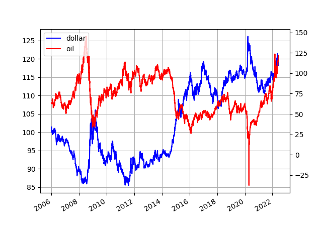

# Week 25 

H2 View: "The Goodwood Festival of Speed, UK saw the debut of a brand
new, Italian styled hydrogen-powered hypercar, offering a vision for a
zero-emissions performance future"

---

H2 View: "Hydrogen to take the lead in Ferrari’s race to carbon
neutrality.. In the race to carbon neutrality, the Italian automotive
superpower, Ferrari has teamed up with Bloom Energy to decarbonise its
manufacturing facility in Maranello, Italy, with fuel cells that can
run on hydrogen"

---

H2 Fuel News: "DKK 88.8m grant for Power-to-X and green hydrogen
development in Denmark"

---

.. and the tech that can do it all, will end up doing it all \#deelectrify

H2 View: "Hydrogen is a ‘slam dunk’ for taking possession of
heavy-duty long distance transportation, a Rethink Energy report has
said"

---

Bloomberg: "$100 million worth of crypto has been stolen in another major hack"

---

"@dougbeck

Joining a shared tmux session is so much fun"

---

FT: "Selling to yourself: the private equity groups that buy companies
they own.. Some of private equity’s own investors complain that the
deals can in some cases serve to enrich buyout billionaires and
multimillionaires at the expense of their pension fund clients by
enabling them to keep levying fees. The Securities and Exchange
Commission wants to reform the market, requiring more checks that
valuations are fair"

[[-]](https://www.ft.com/content/11549c33-b97d-468b-8990-e6fd64294f85)

---

"@gnoble79

Michael Howell is the #1 liquidity analyst in the world. He is one of
the elite few who correctly called this bear market... Michael remains
very negative on risk assets as liquidity continues to contract. The
S&P could easily fall another 20% based on his forecasts"

---

Exports and imports are the primary factors on a country's currency,
unless save for money flows - it's all about the demand for a
country's currency, vs demand on others.

Let's look at TR import/export ratio compare it to its currency [here](../tr/2019/05/stats.html#impexp).

The relationship is pretty close. Since 2019 it breaks, after BJ
became UK PM? TR started doing UK's bidding in return they give cash?

---

A drug route all the way from Dominican Republic into
Armenia.. Hmm.. But there aren't rich countries around Armenia.. What
gives? But I see transport into Canada; are they using Armenian
diaspora in rich countries to distribute the stuff?

[[-]](../../2023/01/drugs.html)

---

The new gun law is useless.. 

---

Arab News: "Ukrainian forces will retreat from Severodonetsk in the
face of a brutal Russian offensive that is reducing the battleground
city to rubble, a senior Ukrainian official said Friday"

---

@DanDePetris

With the war having moved on from its initial euphoric phase of a
Ukrainian military victory, Volodymyr Zelensky is confronted with a
list of difficult questions"

[[-]](https://twitter.com/DanDePetris/status/1540003276745314306)

---

H2 View: "Finland to establish national hydrogen network.. The Finnish
Government said a national hydrogen network will be established in the
country, in an effort to meet climate goals and phase out Russian
fossil fuels"

---

H2 View: "EIB and Mauritania to scale green hydrogen investments.. The
European Investment Bank (EIB) and Mauritania, Africa have agreed to
strengthen their cooperation to scale up green hydrogen, wind and
solar investment"

---

"@PipelineandGas

The U.S. DOE closed on a $504.4 million loan guarantee to help finance
the construction of the Advanced Clean Energy Storage I project in
Utah, the world’s largest industrial green hydrogen storage facility"

---

H2 Fuel News: "Volvo begins testing hydrogen fuel cell trucks.. The
vehicles are able to refuel in as little as under 15 minutes for zero
carbon emission operation"

---

H2 View: "Egypt, Saudi Arabia Sign 14 Investment Agreements Worth
$7.7B, Hydrogen Included"

---

H2 Central: "Gemini Motor announces plan for a fleet of autonomous
hydrogen fuel cell trucks, disrupting long-haul
logistics... Autonomously driven trucks powered by hydrogen fuel cells
significantly increase operational efficiency and accelerate
decarbonization in the transportation industry"

---

The police is being blamed for not immediately turning on the super
soldier skillset and rush in as if acting in the movie
*Commando*. That type of violence is probably foreign to many of them
in that force.  The point is not to put them, any police, in that
situation, or having those situation be extremely rare. Sadly such
shootings aren't rare these days, due to lax gun laws. You can thank
to Bill Clinton and centrist gamma cuck Dems for that, their
triangulation finally brought the country to its ultimate
conclusion. 5G issues were meant to be the side-show, creating the
illusion of disagreement between parties while agreeing on everything
else (bipartisanship, unity), allowing corporations buy out
America. But side issues got worse, and now the unnecessarily funded
police is unnecessarily being accused of why they did not rush in as
if on the movie set of *Commando*.

---

If we fire the Uvalde police chief we will feel much better!! Yey!

---

The new *Doctor Strange*..  It was pretty average, weak story (also
based on shoddy science -multiverse-). WTF with the zombie stuff I
thought apparently the director had previous zombie cred. Raimi's
earlier work *Spiderman 2* was widely considered as the best comic
book movie adaption until that point, but I cant see that presence
here. He was likely straightjacketed by Marvel. 

---

Hope to see Johnny Depp in future movies now that he cleared his
name.. Back in the day I used to watch *21st Jump Street*. I really
liked *Donny Brasco* BTW, read the book afterwards bcz of the
movie. Forget about it!

---

♬ And i just quit my job ♪ I’m gonna find new drive 
♪ Damn they work me so damn hard ♬ Work by nine. Then off past five
♪ And they work my nerves ♪ That’s why i cannot sleep at night

---

CNBC: "Beyonce’s ‘Break My Soul’ is a sign the Great Resignation ‘has seeped
into the zeitgeist,’ says labor economist"

---

20% fall is bear market. What is this?

Bloomberg: "Bitcoin down 70% from peak in November"

---

CNBC: "Another 'algorithmic' stablecoin has fallen below its 1 dollar
peg.. USDD, a so-called "algorithmic" stablecoin that's meant to
always be worth $1, plunged as low as 93 cents on Sunday"

---

"@nypost

The UFO story the media has been reporting for over 4 years is wrong.

Our recent video report exposes intentional deception to cover up a
much stranger story about how the Pentagon spent $22 million on
werewolves, ghosts and goblins"

[[-]](https://twitter.com/nypost/status/1539659954638016514)

---

The AFG area is over 2 kilometers high .. Shoddy houses built on
slopes got hit with landslies pulled everything down?

---

The elevation there

```python
import util; util.elev_at(33.0924,69.5135)
```

```text
Out[1]: 2573
```
---

Surpasses 1000? For effs sake..

Hindustan Times: "Afghanistan earthquake death toll surpasses 1000"

---

WION: "More than 700 people were locked inside a hotel and casino
resort in one of the world’s biggest gambling hubs Macau, China,
following a coronavirus"

---

WSJ: "Sri Lanka's Prime Minister Says Economy Faces 'Complete
Collapse'"

---

"@DanDePetris

NOT an article from the Onion"

[[-]](twimg/FV4vjTVXoAMoyNh.jpg)

---

Politico: "NATO chief wants Sweden, Finland in alliance ‘soon’ — but
can’t guarantee it"

---

"@defpriorities

'American and European policymakers evidently fooled themselves into
believing that cutting off Russian oil would be the beginning of the
end of Putin's war machine,' @DanDePetris writes in @TheSpectator 'But
the market has something else in mind.'"

---

It is a "border region" so RU could claim it isn't invading anyone,
but effectively create a supply line to Khaliningrad. A gray area,
with distant Russkies.. this is right up Putin's alley. He might just
go for it.

---

[The Suwalki Gap](twimg/FV6sTunXgAAIiZW.jpg)

---

"An organisation representing residents in the Suwałki Gap – an area
along the Polish-Lithuanian border lying between the Russian exclave
of Kaliningrad and Belarus – has appealed for the authorities to
create emergency shelters in case the Kremlin decides to launch
military action. The corridor has long been seen as a potential weak
point in a war with Russia. Tensions there have recently increased
after Lithuania blocked some goods from being transferred by rail to
Kaliningrad, leading Moscow to warn of 'serious consequences'"

[[-]](https://notesfrompoland.com/2022/06/21/residents-of-polands-suwalki-gap-appeal-for-emergency-shelters-in-case-of-russian-invasion/)

---

H2 View: "DIF Capital Partners, through DIF Infrastructure VI, and
Virya Energy have joined forces to acquire a stake in the Dutch green
hydrogen developer, VoltH2"

---

H2 View: "RWE and ArcelorMittal have announced a partnership to
develop, build, and operate offshore wind farms and hydrogen
production facilities to supply ArcelorMittal’s steel production sites
in Germany"

---

H2 View: "Gemini Motor has set out to revolutionise long-haul
logistics as it announces plans to launch a fleet of autonomous
hydrogen fuel cell trucks by 2025"

---

H2 View: "A hydrogen distribution network planned between Sydney and
Melbourne, Australia.. It was announced a A$600m (413.3m) green
hydrogen distribution network in Australia has been agreed to be
planned and built by Hydrogen Fuels Australia (H2FA) and CLARA
Energy."

---

H2 View: "A new screening tool could save £7bn (8.6bn) and  give oil
and gas infrastructure a new lease of life with hydrogen and carbon
capture and storage (CCS). The tool developed by the North Sea
Transition Authority (NSTA) is set to be handed out to operators with
oil and gas fields six years from cessation of production to identify
kit that could be repurposed for hydrogen or CCS. It is hoped the tool
could be instrumental in multibillion-pound savings across hydrogen
and CCS scale up, by cutting back the need to construct new equipment"

---

H2 Central: "After successful production and delivery in 2021 of the
hydrogen fuel cell system HyRail® from Proton Motor Fuel Cell GmbH to
the Austrian customer “Linsinger Maschinenbau Gesellschaft m.b.H.”
the new rail milling train type MG 11 Hydrogen is now being presented
to the public for the first time"

---

Your tax dollars at work.. Gov official 'exploring pathways', toiling
away in obscurity. This is how innovation moves forward. When you see
the next jackass tech CEO strut on stage during a "tech conference"
think about what allowed that to happen.

---

Perovskites.. Somebody is on it that's good.

[[-]](https://www.energy.gov/eere/solar/perovskite-solar-cells)

---

H2 View: "South West UK consortium launches with hydrogen pilot
projects for aviation and shipping.. A consortium based in the South
West of the UK has been launched with pilot projects to develop a
port-based hydrogen hub, and prepare the region for hydrogen-powered
aviation"

---

H2 Central: "RWE and SGN Join Forces for Domestic Heat Green Hydrogen
Partnership.. RWE and SGN join forces for domestic heat green hydrogen
partnership. Supplying Scottish towns and rural communities with
sustainable hydrogen gas will be the focus of a landmark partnership
announced"

---

Euractiv: "State company Bulgartransgaz is working on several projects
to connect hydrogen networks between Bulgaria and Greece.. There is
also a joint project to connect Sofia and Thessaloniki with a hydrogen
pipeline"

[[-]](https://www.euractiv.com/section/energy-environment/news/bulgaria-greece-to-build-hydrogen-pipeline/)

---

<blockquote class="twitter-tweet"><p lang="en" dir="ltr">Bulgaria, Greece to build hydrogen pipeline – <a href="https://twitter.com/EURACTIV?ref_src=twsrc%5Etfw">@EURACTIV</a> <a href="https://t.co/uEAJca0Nby">https://t.co/uEAJca0Nby</a></p>&mdash; Ron Loveland (@welshronald) <a href="https://twitter.com/welshronald/status/1539496062896979969?ref_src=twsrc%5Etfw">June 22, 2022</a></blockquote> <script async src="https://platform.twitter.com/widgets.js" charset="utf-8"></script>

---

Do green fine. But then dont be confused when your gov is still
talking about refineries, oil price, crude, natgas.

---

Saw it again on the news "a renewable project in [blah] hoping to
'replace Russian gas'". I look for the wattage it says 100 megawatts
🤦‍♂️ Fossil sources can produce **six hundred times** of your yet
non-existing project with a single pipeline. Guy has no clue.

---

I said "know how to sell" but get the policy right first. 

---

If exclusively emphasized green production was the right play, after
all this investment and thought-energy going into them, this would be
their moment to shine. Where are they? All the talk is about Russian,
Qatari gas, Saudi Arabia and now coal (it's back!)  which people were
thinking was being phased out.

Shitlib Dems need to own this fuck up. The West Wing act failed you.
You weren't smart, just like the writers of that show, you were just
dumb as fuck as they were, you only tried made it look good.

---

Coal is making a comeback. Oil/gas is all people talk about.. Somebody
surely effed up big time.

---

The grid is an abomination.  Especially for long-distance power
transmission it makes no sense to use it. 

---

Policy can encourage clean fuel transmisson and discourage fossil at
all stages in the energy chain. The further fossil moves the more
taxes it can get levied on.

Produce natgas fine, ship as LNG but that can cost little more. LNG
arrives at port, if it isn't converted to H2 for the rest of the
transmission, costs more still. Natgas reaches individual homes for
heating, same.. Those taxes over time can gradually be raised, since
changes will build up, biz will see where things are going, and line
up their investments accordingly (for H2 conversion, CCUS).

---

Obviously "alternative media" followed MSM too. Notice how the said
"alternative" toe the line veeeery carefully, won't veer away from
established talking points. Basically what you get is MSM narrative
with a few spaz out sessions sprinkled in to make it look "relatable",
"down to earth". Thought leaders could emerge there and some have
promise but mostly it is dumb repeats and culture war.

---

MSM simply followed the "electrification" mantra without thinking much
about it, that's what they do, repeat what was handed down from Dem
gamma cucks.

---

During jury duty people (even if non-gov, dont know policy) spend a
huge amount of time on one case, they turn into a mini expert on that
subject for a brief amount of time. In this case collective opinion
(of semi-experts) will work. We saw on Johnny Depp's case, they heard
the evidence, made a good call.

"If regular people are clueless, have no expertise on larger issues,
why should they be given jury duty?"

---

Court cases, hearings are great. Let's have more of them. So much
stuff comes out, it's informative.

---

Haha \#ChrispCrispie 

[[-]](https://twitter.com/HowardMortman/status/1538196153866625025)

---

They were hammered probably because most houses there are shoddy shaqs

---

Richter scale 5.9? Dude that's nothing

```python
import util,pandas as pd
pd.set_option('display.max_columns', None)
df = util.eq_at(33,64)
df = df[df.mag > 5]
df
```

```text
Out[1]: 
                         mag      lat      lon     rad  ago
date                                                       
2022-06-08 09:52:24.449  5.1  35.9160  77.8526  10.00   15 
2022-06-15 09:06:03.165  5.5  26.6859  54.1869  10.00   8  
2022-06-17 12:22:58.764  5.1  36.5281  71.1761  221.03  6  
2022-06-21 23:54:36.148  5.9  33.0924  69.5135  10.00   1  
2022-06-22 00:09:37.350  5.3  27.2482  53.2661  10.41   1  
```

---

Earthquake in Afghanistan?

---

Pre-modern agro always implied hierarchy. About India's Untouchables below.

[[-]](2022/06/the-end-of-the-world-is-just-the-beginning-zeihan.html#untouchables)

---

Former Raytheon board member SecDef is of course recommending the
purchase of more hardware "for Ukraine", but is that truly helping?

---

Davis: "Russia May Win The War In Ukraine.. It is time to strip off
the rose-colored glasses much of the West has worn when looking at
Russia’s war of aggression against Ukraine and acknowledge the cold,
hard truth: the Russians are on course to win. The longer we traffic
in the fiction that Ukraine still has a chance, the more Ukrainian
civilians will be killed, the more cities will be destroyed, and the
higher the probability that Russia seizes yet more territory before a
negotiated settlement can end the fighting – potentially including
Kyiv. You’d never know that, however, listening to high-ranking
current and former officials in the West"

[[-]](https://www.19fortyfive.com/2022/06/russia-may-win-the-war-in-ukraine/)

---

"@DanDePetris

If you’re arguing for Ukraine to fight, fight, fight until every inch
of Ukrainian territory is liberated from the Russians, then have the
decency to mention the extremely high cost in (Ukrainian) lives that
would be required to get there—assuming we even get there (unlikely)"

---

H2 View: "BP hydrogen team gets a shot in the arm as oil giant bets on
H2.. This announcement has also arrived as the company announced that
it would be purchasing a 40.5 percent stake in an Australian renewable
energy project, which it will also operate. That project is viewed as
one of the largest in the world for the production of green H2"

---

H2 Fuel News: "Charbone plan to establish a green hydrogen production
facility in Nova Scotia, Canada with its announcement of a signed
Memorandum of Understanding (MoU) with Port Hawkesbury Paper (PHP)"

---

H2 View: "Shell’s efforts to build extensive hydrogen refuelling
infrastructure in California, US, are set to received support from
South Korean Hanwha Solutions’ hydrogen tank manufacturing subsidiary
Hanwha Cimarron"

---

H2 View: "Viritech Partners with Pininfarina to Realise Apricale ®,
The Ultimate Road-Going Hydrogen Hypercar"

---

H2 Central: "Elixir Energy announce MOU with SoftBank Energy over a
green hydrogen project in Mongolia... Elixir’s Managing Director said:
'We are delighted that the potential of our Gobi H2 project has been
validated by the signing of a MOU with a company of the quality of
SoftBank Energy'..

Elixir owns the Nomgon IX Coal-bed Methane project, which is located
in the South Gobi region of Mongolia and considers that there are
potential synergies between its strategy of exploring for natural gas
and green hydrogen production related opportunities"

---

H2 Central: "UAE joins ‘International Partnership for Hydrogen and
Fuel Cells in the Economy’"

---

H2 Central: Oil India Ltd, the nation’s second-largest national oil
and gas explorer, said it has signed an initial agreement with
homiHydrogen to work together in the green hydrogen value
chain... homiHydrogen is a joint venture company established by
electrolyser experts from Germany, Switzerland, Italy and Norway to
manufacture all the four types of electrolysers under one roof.

---

H2 View: "A South-Korean chemicals manufacturer has said it will
establish a plant to produce 50,000 tonnes of hydrogen per year in
Daesan, South Korea, to clean up petrochemical production"

---

DOE: "Currently, most hydrogen in the United States is produced by
large-scale natural gas reforming without carbon capture and
storage. This established technology has been shown to be able to
reach the cost targets; however, the goal is to reach the cost target
via low-carbon pathways.. DOE supports the research and development of
a wide range of technologies [for the goal]"

---

A total transition to clean fuel based infra (generation through CCS,
or renewables where available) can reach Net Zero faster than waiting
for total renewable power generation to catch up hoping one day if all
power generation is clean, all will be clean. Earlier policy made a
huge mistake. First it bet on an inefficient transmision, storage,
end-use solution (electricity) and lived on hope for the generation
part to catch up and 'kill fossil'.

---

Fast is no joke. Standard electric tower can reliably transmit 2.2
GW. An H2 pipeline can transmit over 33 GW with near zero loss.

[[-]](2022/01/wirespipes.html#10calc)

---

Governments can easily mandate (after a transition period) that all
fossil fuel to be used only for H2 generation + CCUS. That guarantees
fast power transmission, plenty of options for storage. Infra becomes
emission-free by default. Put H2 in a car, it's an emission free
car. Use it in houses for heating, it's emission-free heating.

---

That's Ray Dalio - a total dumbass

"Bridgewater Associates, the world’s largest hedge fund.. lost $12
billion in 2020"

---

:) Adolf went to jail for that right? Then you mean to indicate if
Trump comes back like Hitler did, this time he will become the Orange
Fuhrer? 

"The Trump insurrection was America’s Beer Hall Putsch"

---

Elections are on the way, but Netanyahu voted against the bill, did a
non-right-wing act just to hurt the government. His opponents from the
right can hit him on the head with it now, possibly steal his votes
and come back stronger.

Al Jazeera: "Israeli coalition fails to pass bill on upholding settler
law.. [the bill] served as a key test of the government’s prospects
for survival, creating a paradoxical situation where some of the
illegal settlements’ biggest opponents in the government voted for the
bill, while hardline parties that support the settlements voted
against the bill in order to weaken the government..

The failure to renew the bill on Monday highlighted the separate legal
systems in the occupied West Bank, where nearly 500,000 Israeli
settlers enjoy the benefits of Israeli citizenship and law while some
3 million Palestinians live under military rule that is now well into
its sixth decade.

The settlements, which are fortified, Jewish-only housing complexes,
are continuing to expand in the occupied West Bank as well as occupied
East Jerusalem. They are seen as a major obstacle to any potential
deal with Israel"

---

Infoplease: "When the Soviet Union broke up in 1991, the Kaliningrad
Oblast lost its overland connections to Russia, as Lithuania gained
its independence and Poland broke free from the Soviet orbit"

---

Kaliningrad is RU territory but has no land connection to Russia.
It sits at a tough spot. And Lithuania and Poland are both NATO.

[Map](twimg/FVuV8SZXoAYL_vo.png)

---

NYT: "Russian authorities on Monday threatened Lithuania, a member of
NATO, with retaliation if the Baltic country does not swiftly reverse
its ban on the transportation of some goods to Russia’s exclave of
Kaliningrad by rail"

---

Newsweek: Not Even a Recession Will Change Putin's Course in Ukraine"

[[-]](https://www.newsweek.com/not-even-recession-will-change-putins-course-ukraine-opinion-1716986)

---

NYT: "Ukraine Live Updates: Demand for Russian Oil Surges in Asia,
Blunting Effect of Sanctions"

---

H2 Fuel News: "The Argentine province Tierra del Fuego, an island
region best recognized for its location at the very tip of South
America, is seeking to begin hydrogen production for economic
diversification as the world moves away from fossil fuels and toward
clean sources of energy.. For the local hydrogen production strategy,
the area is seeking $6 billion in investments"

---

H2 View: "Australian powerhouses in the running for [large] green
hydrogen project in New Zealand.. Southern Green Hydrogen, a joint
venture between Contact Energy and Meridian Energy, revealed Woodside
Energy and Fortescue Future Industries (FFI) are set to provide
detailed proposals to decide the selection of lead developer for the
Southern Green Hydrogen project"

---

"Chevron Eyes 2.5bn Investments in Low-Carbon Hydrogen.. Chevron plans
to spend about 2.5-billion building up its hydrogen business this
decade as the oil major accelerates investment in low-carbon
technologies. Chevron will develop both green and blue hydrogen, said
Austin Knight, vice president of […] The post Chevron Eyes $2.5bn
Investments in Low-Carbon Hydrogen appeared first on Hydrogen Central"

---

The Independent: "A man in Pennsylvania man died after he attempted to
light a cigarette while using an oxygen concentrator at his home in
North Coventry Township"

---

Good call

AFP: "Swimming to set up an 'open category' to allow transgender
athletes to compete. The new policy effectively bans them from taking
part in women's races"

---

Maybe we should just dig canals everywhere instead of building roads 🤨

---

Hah. Floating stuff vs land transport.. If you do the physics, that
would likely check out. Moving stuff horizontally on sea probably
takes less energy than on land, even with rail. There is that pesky
friction to worry about on land.. it messes up everything.

[[-]](2022/06/the-end-of-the-world-is-just-the-beginning-zeihan.html)

---

They also have a major drug trafficking problem - see the drug map
below.

"Bulgaria’s government faces collapse this week.. PM Kiril Petkov
sought to tackle rampant corruption and to take a strong position
against the Kremlin"

---

Overkill

NDTV: "China's mass testing mantra is building a waste mountain"

---

Hindustan Times: "Britain set for biggest rail strike in decades"

---

Segments about young people are getting old.. Funny. And sad.

---

News segment about "generation change"; the younger generation
supposedly wanting change and proposing stuff.. Even that is getting
old.

---

Hindustan Times: "UK pushed 100,000 people into poverty by lifting pension age"

---

ISR built a wall, created an unofficial border, then they go on the
other side of the wall and shoot bunch of people..

---

Near the border, meaning the man was shot on **his** side of the wall,
not on Israeli side.

[[-]](twimg/FVrGm3HWAAACFOx.jpg)

---

WION: "53-year-old Palestinian man was killed by the Israeli forces
near the border in Qalqilya city."

---

If govs wanted drug traffickers can be hurt in a big way at the major
hubs, UK, Spain, Italy (which made a big bust recently). At sources
too naturally such as Colombia.

---

I wonder what Petro will do about the Colombian drug trade

---

The left in ascendance. 

The Independent: "Colombia picks 1st leftist president [Petro] in
tight runoff contest"

---

French leftist coalition earned second place in parliamentary seats,
Le Pen made some gains too..

---

Spain, Italy, Bulgaria, UK, Belgium are major end points in Europe.
Spain especially, crazy connectivity.

Iran - damn. Colombia, makes sense. 

China-Paraguay? There was that one 2012 major bust apparently, so it
shows on the map.

India, Australia, Germany, Japan are relatively clean. 

---

Taliban are jihadi mofos too, in a different way

---

Maybe "somebody" was bothered about their drug money being cut on the
Pakistani side, ppl with connection in mil and a line into the jihadi
m--f--kers used one of them to send a message.

---

Coincidence? Hmmm

CBC News: "Islamic State says attack on Sikh temple is revenge for Prophet insults"

---

DW: "[2022/6/2] Taliban start to enforce ban on poppy
cultivation.. Afghanistan’s Taliban rulers have begun a campaign to
eradicate poppy cultivation, aiming to wipe out the country’s massive
production of opium and heroin"

---

Pakistan became a **major** source for the drug trade; they are
Afghanistan's neighbor, their meddling, coup-loving military would
have long-time relations there, I'm sure many deep state gov officials
look the other way when drug trade is being conducted, if not
officially partake in it themselves.

---

Data from a UN agency, at least some vaguely proper data is there this
time, but every year's data is in a seperate Excel sheet. ??. I had to
write extra "preprocessing" code to combine stuff. Keep it simple.
Put data on Github so it is version controlled. 

---

[Map of Drug Routes](../../2023/01/drugs.html)

---

"China's Xi says trade with Russia expected to hit new records in the
coming months"

---

Al Monitor: "Italy's Eni joins giant Qatar gas project after Russian cuts"

---

<iframe width="340" src="https://www.youtube.com/embed/B3knAZxXMzo?start=195" title="How Hydrogen Could Solve the Energy Crisis: Bloomberg Green" frameborder="0" allow="accelerometer; autoplay; clipboard-write; encrypted-media; gyroscope; picture-in-picture" allowfullscreen></iframe>

---

Fast Company: "Of course, the sun—and wind, for that matter—aren’t
always available, and certainly not everywhere. 'Heavy industry runs
24-7. You don’t find any factories that shut down and only run one
shift,' says Bill Gross, founder and CEO of Heliogen, a company that
stores as much thermal energy as possible to then convert to green
hydrogen, an alternative fuel..

'I feel it’s all about using science and technology to find a way to
beat that price of fossil fuel,' Gross says. Heliogen has built a
“sunlight refinery”: a setup whereby thousands of mirrors.. reflect
beams of sunlight.. onto a single spot at the top of a tower, the size
of a basketball hoop. That concentration allows the collected sunlight
to reach temperatures of more than 1,000 degrees Celsius.. 

It then stores that thermal energy in tanks of gravel. 'Imagine a
thousand pizza stones in an oven where you close the door after you’ve
heated them up,' Gross says. 'Those are going to stay hot for a very
long time.' The energy can then be easily transported to less sunny
climes, wherever it’s needed. 'It allows us to run on cloudy days. It
allows us to run through any other kind of interruption. That’s what’s
crucial for the world because we all want to have uninterruptible
power.

They then convert that energy into green hydrogen via electrolysis,
which essentially splits the hydrogen from water (and an important
distinction from dirty hydrogen, which is traditionally produced from
methane). “When you burn hydrogen, it releases nothing,' Gross
says. 'It releases just water vapor to the atmosphere. That’s the
beauty of hydrogen.'"

[[-]](https://www.fastcompany.com/90756680/how-much-could-renewable-sources-like-solar-and-thermal-shape-our-future-energy-needs)

---

H2 Central: "Engines equipped with H2-HPDI (High Pressure Direct
Injection) fuel systems run on hydrogen and offer a spectrum of
advantages over other technologies, making it possible to accelerate
H2 adoption as a component of sustainably operating heavy-duty
vehicles. Among the advantages of using H2-HPDI systems from Westport
Fuel Systems include its practicality for fleet managers that require
straightforward operations and maintenance in the transition toward
improved sustainability. Furthermore, engines equipped with these
systems can exceed the performance of current heavy-duty diesel
vehicles while simultaneously minimizing greenhouse gas emissions to
the point that they are nearly eliminated"

---

H2 Fuel News: "Pilot Company expands into compressed natural gas and
hydrogen: partners with VoltaGrid. Pilot Company, one of the leading
suppliers of fuel and the largest operator of travel centers in North
America, announced that the company is building upon its current
initiatives in the alternative fuels space with a new compressed
natural gas (CNG) and hydrogen delivery platform. This expansion
includes a partnership with VoltaGrid LLC (“VoltaGrid”) to develop a
low-carbon fuels network that contributes to reduced emissions and
decarbonization for third-party customers in industries like water
disposal, dual-fuel applications, water heating operations, and
natural disaster response"

---

H2 View: 'Nuvera Fuel Cells, LLC, a provider of heavy-duty hydrogen
fuel cell engines for on- and off-road mobility and other
applications, announces an order for an E-Series Fuel Cell Engine from
CMT, a propulsion technology research institute at the Universitat
Politècnica de València, Spain. Focusing on accelerating the
widespread adoption of zero-emission vehicle power sources, CMT is
building a 200 kW fuel cell test bench facility in collaboration with
AVL, a worldwide engineering leader"

---

H2 View: "GRTgaz and Fluxys are Willing to Develop The First
Open-Access, Cross-Border Hydrogen Transmission Network Between France
and Belgium"

---

Al Monitor: "Saudi Arabia's futuristic planned city NEOM plans to
build a water desalination plant powered by renewable energy"

---

The increase in renewables is great, but we are still inching forward
megawatt by megawatt and 1 GW plant is considered a big deal. Still
tough to keep up with oil / natgas resources of eg US, Iran, Qatar or
Russia. Guy digs one hole in the ground and boom: 60 Gigawatts. Need
more? Another hole, boom. Another 60. Saudi Arabia's total energy
output is about 1 Terrawatt.

---

CNBC: "Look for more selling pressure next week as investors learn the
hard way not to fight the Fed"

---

Al Jazeera: "Apple Inc workers in Maryland, US vote to join a union"

---

All previous reports, graphs, maps shared are accessible from the
[reports](../../2021/01/reports.html) page.

---

McDonalds switched to veg oil from tallow for cooking its fries?
Likely due to the "war against fat" wave.. 

---

Aaand here it is - [lab-grown fat](../../2022/06/lab-grown-meat.html#fat)

---

"@MoonmanND

The only vending machine has to connect to the internet apparently, so
today I just don't get to eat breakfast I guess"

[[-]](https://twitter.com/MoonmanND/status/1537366091441356800)

---

When dollar is strong, other countries have trouble securing the
dollars to buy the oil with, ergo oil demand (and global price)
decreases. Non-US demand would effect oil price more, there are more
people outside US.

The Balance: "When it comes to international trade for raw materials,
the dollar is the exchange mechanism... When the value of the dollar
drops, it costs more dollars to buy commodities. At the same time, it
costs a lesser amount of other currencies when the dollar is moving
lower"

---

Historically there was a reverse correlation between dollar and oil.
Strong dollar, weak oil, and vica versa. The relation broke recently
we'll see if it sticks. Is the petrodollar system broken already?

---

Dollar and Oil

```python
import util
df = pd.merge(util.get_yahoofin(1990,"CL=F"),
              util.get_fred(1990,['DTWEXBGS']),
              left_index=True,right_index=True)
df.columns = ['oil','dollar']
ax1 = df.dollar.plot(color='blue', grid=True, label='dollar')
ax2 = df.oil.plot(color='red', grid=True, label='oil',secondary_y=True)
h1, l1 = ax1.get_legend_handles_labels()
h2, l2 = ax2.get_legend_handles_labels()
plt.legend(h1+h2, l1+l2, loc=2)
```



---

Investopedia: "With the Federal Reserve raising rates and expected to
continue to do so, the U.S. Dollar has been growing stronger"

---

"The FED giveth, and the FED taketh away" Hah

---

"Flat is the new up". Heard on fin channel

---

Bloomberg: "'Not Buying This Dip,' Says BlackRock's Brazier"

---

Italy's Rome went gone long time ago - that helped Italy 

---

The coup culture is usually connected to a previous feudal culture;
Greece and Asia Minor suffered various coups because of their earlier
Roman / Byzantium / Ottoman past. Remember the Praetorian Guard? In
sum, if agrarian-taxer-plunderer parasitic-government culture becomes
entrenched, it creates the types of people in society who think anyone
with military power can and should take the reins by force. This is
the feudal way. Coups are, therefore, pre-modern creations experienced
in countries on the road towards modernity.

---

Quora: "Why there have been frequent military coups in Pakistan as
compared to it's neighbour India?..

The British always divided Hindus and Muslims by treating Muslims
preferentially by recruiting Muslims/Sikhs in army under the concept
of Martial races. Indian army had excessive percentage of Pujabi
Muslim Army units. The units were organised with people from single
regions or castes. They were led by British officers and this resulted
excessive allegiance by minority units like punjabi Muslims who
imitated British officers and this perceived superiority complex
exists even today in Pakistan society.  This was broken by India once
India became free and the rule of Martial races in recruitment was
buried. Chaudhries and sardars were thrown out of the window giving a
body blow to Feudals. Feudalism was weakened by land reforms.
Pakistan continued in the old ways.and new Feudals are the Army,
Sardars in NWFP, KPK, POK, Baluchstan, Bueraucrats, and now a small
bands of industrialists.

---

Janes Defense: "Reacting to pressure from NATO's former Warsaw Pact
members and Russia's brutal war tactics in Ukraine, the alliance is
ditching its thin, so-called tripwire line of defence along its
eastern flank for a military posture more redolent of decades past:
more troop deployments, more pre-positioned weapons and supplies
across the region, and a return to Cold War-like pre-designated areas
for particular allies to defend on short notice"

---

"A recent Bloomberg report called attention to the unwelcome but
predictable consequences of broad Russia sanctions: “But some Biden
administration officials are now privately expressing concern that
rather than dissuading the Kremlin as intended, the penalties are
instead exacerbating inflation, worsening food insecurity and
punishing ordinary Russians more than Putin or his allies.”.. These
harmful effects of broad sanctions should not come as a surprise to
anyone that has followed these issues closely, since this is what
almost always happens when a country’s entire economy is targeted for
punishment. The inability to change the behavior of a targeted
government is even less surprising, since it is extremely rare for
unfriendly authoritarian states to knuckle under in the face of
U.S.-led pressure campaigns"

[[-]](https://responsiblestatecraft.org/2022/06/17/we-shouldve-known-sanctions-on-russia-wouldnt-work-as-intended/)

---
