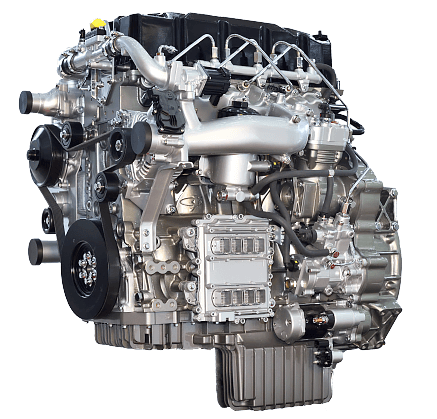
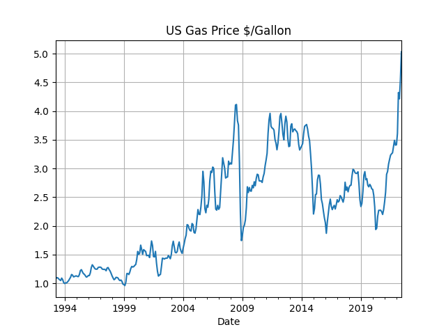
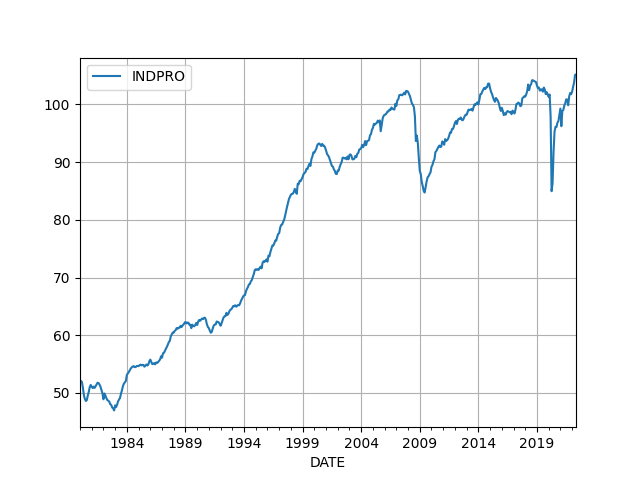

# Week 27 

"@Breakthrough 

Clean hydrogen – the 'Swiss Army knife' of decarbonization – could
eliminate emissions across sectors. We need to scale and deploy
various production technologies, like electrolysis and carbon capture,
in order for hydrogen to reach its potential" \#Gates

[[-]](https://twitter.com/Breakthrough/status/1542907462877069313)

---

"Rolls-Royce is set to enter the hydrogen production market with the
acquisition of a 54% stake in German electrolysis stack specialist,
Hoeller Electrolyzer"

---

"@H2Europe

@Shell ⁩announced it would start building a \#renewablehydrogen
plant.. The 200 MW \#electrolyser, in the ⁦ @PortOfRotterdam ⁩, would
produce up to 60,000kg of renewable #hydrogen per day"

---

NEL: "Receives purchase order for an alkaline electrolyser system from
Skovgaard Energy.. The electrolyser system will be used for production
of green ammonia"

---

"@gnievchenko

'BMW is hydrogen's biggest proponent among Germany's carmakers,
charting a path to a mass-market model around 2030.'"

---

The Guardian: "Dutch group targets hydrogen-fuelled commercial flight
in 2028.. Consortium plans to adapt turboprop aircraft with 40-80
seats to run on environmentally friendly fuel...

The world’s first hydrogen-fuelled commercial flight of a passenger
plane could take place between Rotterdam and London in six years’
time, under a plan to make short-haul air travel more environmentally
friendly.

---

NYT: "Deadly Glacier Collapse in Italy Shows Reach of Europe’s New
Heat"

---

<blockquote class="twitter-tweet"><p lang="en" dir="ltr">As stated in this article, <a href="https://twitter.com/hashtag/hydrogen?src=hash&amp;ref_src=twsrc%5Etfw">#hydrogen</a> buses can be fueled in 5-10 min. &amp; offer 500Km+ range. &quot;About 30% of our runs are really too long to run for a battery-electric &amp; that&#39;s where we see hydrogen being a viable option,&#39;- Winnipeg Transit Manager Erin Cooke<a href="https://t.co/wjsOFYJjA6">https://t.co/wjsOFYJjA6</a></p>&mdash; Illuming Power Inc. (@IllumingPower) <a href="https://twitter.com/IllumingPower/status/1530534476450766848?ref_src=twsrc%5Etfw">May 28, 2022</a></blockquote> <script async src="https://platform.twitter.com/widgets.js" charset="utf-8"></script>

---

Coconut oil apparently melts too fast while cooking; it also doesn't
have conj. linoleic acids (CLA), which means plant based meats are not
exactly replacing real meats in nutrition.

"Most plant-based burgers currently on the market include a hard fat
such as coconut oil"

---

More on fat foodtech 

[[-]](2022/06/lab-grown-meat.md#fat2)

---

'But he resigned due to this reason, that reason'.. The last scandal
wasn't any more 'scandalous' than the one before it; the truth the
matter is the opposition, inside and outside, wanted BJ gone and they
threw everything but the kitchen sink to finish the job.

---

He has a chance, was considered as one the more capable ministers in
BJ cab. His resignation was also the last domino to fall, possibly due
to being lobbied by Tory internal oppo, likely coupled with promise
that if he resigned, he'd have their support as next PM.

"UK’s ex-finance minister Rishi Sunak announces bid to succeed Boris Johnson"

---

They are really spinning that "SPR oil sale to China" story, and
spinning hard. Oil export ban can get ahead of the spin.

---

"China military holds combat exercises around Taiwan as US senator
visits island.. Senior United States senator, Republican Rick Scott,
arrived in Taiwan on Thursday for a visit and met with Taiwan
President Tsai Ing-wen on Friday"

---

"@vaibhavUP65

A Night Club in \#China celebrating assassination of #ShinzoAbe. There
are restaurants offering 'Free Food' & Bars offering 'Free Booze' all
across China to Celebrate his Death"

---

"Legacy of Abe". What is it really? He founded the Quad, but it was
useless against Russia, could not entice India to condemn. Abenomics
didn't work, the new PM is now against it. Abe was a right-wing guy
maybe he did some stuff on that front, better mil? He stayed in office
longer than most PMs so he could have provided some stability there.

---

😂 So long sucka

"Sri Lankan President Rajapaksa flees after protesters enter residence"

---

Caltech's David Baltimore, virologist who received the Nobel Prize for
viral genetics: "When I first saw the furin cleavage site in the viral
sequence, with its arginine codons, I said to my wife it was the
smoking gun for the origin of the virus. These features make a
powerful challenge to the idea of a natural origin for [Covid]."

---

Forbes: "This summer, when the first bulldozers rumble across central
Utah and begin excavating brine ponds, the Advanced Clean Energy
Storage hub will be breaking ground in multiple ways.

The construction will create massive underground salt caverns, giving
rise to the largest renewable energy storage facility anywhere in the
world. It also will kick off a new phase of the energy
transition. This unique project – part energy conversion, part
long-duration storage – promises to empower the technological and
infrastructure advances needed to realize hydrogen’s potential in a
net zero carbon future...

In June, the Department of Energy announced a $504 million loan
guarantee for the hub’s first phase, allowing construction to get
underway. As Energy Secretary Jennifer Granholm put it, “This is a big
deal for the clean hydrogen space.”

---

"@EsselLeroy

[A] company in Canada will change the world.. [of] energy. Check out
@Proton_Canada that will supply the world with 800 years of hydrogen
gaseous fuel. The cancelled Keystone pipeline because of polluting
tarsand oil will become zero pollution hydrogen instead"

---

Upstream: "Two tantalising tender processes have been launched for
contracts worth $1.3 billion linked to the 2000-kilometre East
Mediterranean (EastMed) pipeline that will carry gas from Israel,
Cyprus and Egypt to the European Union"

---

CNBC: "Shell to build Europe's 'largest' renewable hydrogen plant to
help power Dutch refinery"

---

"@JoSamps92

One quarter of the world’s green \#hydrogen will be traded
internationally in 2050, with three quarters produced and used
locally, according to a new report by @IRENA . Via @rechargenews"

---

Energynews.biz: "[A] massive pipeline project in eastern Germany that
aims to jumpstart the hydrogen market there by 2027. For the eastern
German hydrogen grid, the GASCADE-Fluxys project calls for
constructing a new 50-kilometer hydrogen pipeline from the Baltic Sea
region around Rostock all the way to the south. Hydrogen production,
storage, and demand will all be connected through this system, making
it a potent node in the hydrogen supply chain"

---

H2 Fuel News: "University of Oxford and University of Cardiff
academics are working with CarbonMeta Technologies on a plastic waste
to hydrogen fuel project. The researchers are using 'microwave
catalysis' technology"

---

H2 Central: "Hawaii Gov. David Ige has signed into law a package of
bills that includes SB2570 (Act 241) – Relating to Zero Emission
Vehicle Fueling Rebates, which aims to create a renewable hydrogen
refueling system rebate program for the state. According to the bill,
developers of new hydrogen refueling infrastructure are eligible for
rebates up to $200,000"

---

That's one big-ass "et al". Esp for a paper that was "unable to predict".

"@emollick

.. Using machine learning & tons of psychological variables, this
study was unable to predict which relationships will improve (or fall
apart) over time"

[[-]](https://twitter.com/emollick/status/1544796403469373443)

---

Noise-canceling tech is a fantastic invention

"Sony’s MX5 headphones use microphones to pick up low-frequency noise
[from outside] before it reaches the ear by playing ambient sound,
effectively canceling out the invasive sounds... the music you’re
listening to is outputted at a lower frequency... less damaging to
your ears than just turning up the volume on your earbuds to make
external noise quieter. These next-level headphones truly mute.. the
volume of the outside world, making a simple walk around the
neighborhood feel like a cinematic experience or focusing while
working from home with loud roommates well, possible"

---

"@EllieGeranmayeh

Reminder: \#Iran never left \#JCPOA - it's Washington that has to
return to agreement. Since US max pressure policy in 2019, Iran
reduced compliance with deal in stages. 3 yrs+ later: with no US
policy change & no tangible offers from E3/China/Russia- Iran hollowed
out deal..

With Biden weak & chances of Dems 2024 win dwindling - decision maker
in Tehran have cold feet if 2 year JCPOA worthwhile"

---

NDTV: "After ban on wheat grain, India tightens export rules for flour"

---

"@WillRuger

What does it even mean to 'deserve to be in NATO'?  He is right that
no country would 'bring more to the table,' including an ongoing
territorial dispute and war, corruption & extremism problems, the risk
of escalatory spiral w/ a nuclear adversary, & it is difficult to
defend.

'@apmassaro3

Scholz at it again. Effectively says Ukraine cannot be in NATO. Yet no
country deserves to be in NATO more than Ukraine. No country would
bring more to the table'"

---

The Atlantic: "Not too long ago, I heard one of the leading Brexiteers
describe his political philosophy in a room full of CEOs and senior
politicians. He started by talking to this elite group about the great
division between 'elites' and 'the people,' the victors and the
victims of globalization, the haves and the have-nots of
modernity. The longer he spoke, the more his words began to seem rote,
remote, and stale. The energizing slogans of the Brexit campaign of
2016 sounded hollow and clich​​éd in 2022. Partly, this is because the
slogans were not true.

Globalization was indeed bad for some people and good for others, but
those groups didn’t split neatly along a rural-urban or rich-poor
divide, or along any other easily defined demographic line. Some
farmers in the distant countryside turned out to be huge beneficiaries
of Britain’s European Union membership. Some of the least-well-off
Britons benefited from foreign investment.

Besides, many of the people loudly attacking the “elite” were not
actually among globalization’s losers themselves. Boris Johnson was
the standout example of this phenomenon: He attended Eton and
Oxford.. , and his campaign was paid for by hedge-fund managers and
billionaires. More important, Brexit, the solution to the problem
Johnson and his supporters described, was based on a series of
lies. The electorate was promised that departure from the EU would
lead not only to fewer immigrants but to greater prosperity, more
welfare spending, less crowded hospitals. Instead, six years after the
vote, Britain is less prosperous and more unequal. Brexit reduced the
U.K. GDP by at least 1.5 percent even before it took full effect; the
U.K. has the highest inflation rate in the G7; small businesses,
especially importers, have been crushed by Brexit-related red tape and
supply-chain problems. Though committees have been set up to look for
'benefits from Brexit,' few are available"

---

Assasination of Abe; the outer alliance is on the back foot.  Losing
in Ukraine, Mr. Brexit is on the way out, right-wing (ultra outer) Abe
is shot leading many in China to celebrate, calling the assasin a
hero.

---

"@ThePrittster

David Cameron lost the PM'ship because of Boris Johnson.

Theresa May lost the PM'ship because of Boris Johnson.

And now Boris Johnson has lost the PM'ship because of Boris Johnson.

The circle is fucking complete. 

Hat-trick Motherfucker!!!"

---

This gets better and better

The Guardian: "Margaret Thatcher’s infamous 'No, no, no' retort to
Jacques Delors, a historic moment in the UK’s relationship with
Europe, which also had the effect of precipitating her downfall, was
partly inspired by an article penned by a young journalist named Boris
Johnson, her newly released private papers show"

---

The restrictions on the gas-fired plants sound fine.

Politico: "EU lawmakers Wednesday voted in favor of a European
Commission proposal to allow nuclear and natural gas-fired power
plants to be marketed as sustainable investments on financial
markets... Under the new rules — known as the taxonomy — new gas-fired
plants built through 2030 will be recognized as a transitional energy
source as long as they replace a coal- or fuel oil-fired plant, switch
to a low-carbon gas like hydrogen by 2035 and stay under a maximum
emissions cap over 20 years"

---

"IEA wants surplus nuclear energy to power hydrogen production"

---

This was my worry... focus on pure green sources, while welcome, would
not be enough. All raw sources of energy need to be used, including
fossil. Targeting blue or green H2, we generate clean fuel any way
possible.

"Wind energy is still 25.5 GW short.. EU steel producers are interested
in clean H2 but point to a shortage of renewable energy"

---

H2 Central: "In times of widespread energy crisis, the urgency for
energy independence and need to green the energy system is felt across
Estonia. Anticipating the implementation of European Green Deal
legislation, many organisations and cities have committed to become
climate neutral to future proof their business... Therefore, the first
nationwide Hydrogen Valley ever is now being developed in close
cooperation between three regions, one university and five of the
largest companies in energy and industry in Estonia"

---

Most of UK gov's intl actions werent that good, but there were some
nice moves on domestic energy front.

---

"@HydrogenCouncil

The new UK Energy Security Bill, introduced to Parliament today, is
set to deliver the biggest proposed changes to energy laws in a
decade. The Bill includes measures to increase investment in
\#hydrogen"

---

The etimology of the word is com- meaning from Latin, with, together,
and bust as in *busting that ass*, together with the fuel, so you have
com- bust.. nam' sayin?

---

Combustion 👍 👍 👍 👍 

H2 View: "Hydrogen heated water set to be trialled in
Australia.. Rinnai Japan has said it has successfully developed a
continuous flow hot water system for the domestic market, using 100%
hydrogen combustion technology, offering zero carbon emissions"

---



H2 Central: "China Yuchai introduces China’s largest and highest
horsepower hydrogen engine... With a displacement of 15.93 liters and
a maximum horsepower of 560 horsepower, YCK16H is the largest and most
powerful hydrogen internal combustion heavy-duty engine being launched
in China"

---

2008-9 was bad, so was 2011-2015.. the new rises are something else.

---

```python
import util; df = util.get_eia("PET.EMM_EPM0_PTE_NUS_DPG.M")
df.plot(grid=True,title='US Gas Price $/Gallon')
```



---

The series was 'all about revenge'? That's like saying *Fight Club* was
all about fighting.

---

There are some detractors of *The Terminal List*..

---

Description says index shows "durable and nondurable manufacturing,
mining, and utilities", meaning `INDPRO` is the measure of actual
physical stuff being produced in US. It could be useful..

Production hit a ceiling 2008, and it only barely started to surpass
that ceiling recently.

---

Looking at Industrial Production Index from FRED, called `INDPRO`;
interesting.. 

```python
import util; df = util.get_fred(1980, 'INDPRO'); df.plot(grid=True)
```



---

Trump is all over the news again, getting free publicity.. What does
that sound like? Or when? Sounds like a 2015 to me..

---

"@behindyourback

Just passed a farm with a big 'no vaccines we trust god sign' next to
the sign advertising that they were selling seedless watermelons"

---

'People retire too early, we pay too much'; I find such talk
inhumane. A minimum amount should be given to all no matter if they
work, not work, retire, early or late. 

---

Al Jazeera: "US Fed: ‘More restrictive’ rates possible if inflation persists"

---

Politico: "Global hunger figures rose to 828M in 2021, UN says"

---

WION: "India and China spend $24 billion on cheap Russian energy imports"

---

Brits also need to reverse this f--king Brexit, it caused nothing but
headaches for you. Join the inner alliance, ditch the outer alliance.

---

Hahaha.. [just like Thatcher](https://www.bbc.com/news/av/uk-politics-27053536)

"[Earlier, in Jul 6] Asked if he would quit, UK PM Boris Johnson says 'no, no, no'"

---

Pick someone who is not 'strong on Russia' meaning someone who won't
unnecesarily stir shit up to create trouble for Europe

"Who can replace UK’s Prime Minister Boris Johnson?"

---

@JustinTLogan

Alexander Boris de Pfeffel Johnson, out.

---

H2 View: "Hydrogen heavy-duty trucks set to get their fill in
Québec.. Hydrolux has unveiled its plan which hopes to kick-start
refuelling for heavy-duty hydrogen-powered trucks in Quebec, Canada"

---

"Pyrolysis should be more scalable than electrolysis as resources of
affordable natural gas are readily available, enabling large
quantities of Hydrogen to be produced without relying on significant
amounts of dedicated renewables"

[PDF](https://www.adb.org/sites/default/files/project-documents/52041/52041-003-tacr-en_3.pdf)

---

[Methane Prolysis](twimg/FW6zGhaWAAcNDyO.jpg)

---

They can store the carbon by-product as solid synthetic graphite.. Good.

Gasworld: "FortisBC Energy, Suncor Energy and Hazer Group unveiled
plans for a pilot project.. that will use methane pyrolysis technology
to produce hydrogen while storing the carbon by-product as solid
synthetic graphite.. The technology set to be deployed at the Canadian
site will be provided Australia’s Hazer Group and will generate
approximately 300,000 gigajoules of clean-burning gas energy that can
replace the equivalent annual natural gas usage of approximately 3,300
B.C. households"

---

H2 View: "bp, BOC study results set to accelerate hydrogen uptake in
UK road freight.. the joint study found distributing hydrogen as a
compressed gas via road trailer is the best option to stimulate the UK
market to take up hydrogen fuel for heavy-duty transport over the
mid-term..

The companies say the nine-month study has provided important insights
into requirements and options for hydrogen distribution, station
design, and dispensing costs for heavy-duty applications.

In the long-term, the study anticipates that both gaseous and liquid
hydrogen will have a role to play in fuelling the sector"

---

H2 View: "$6.6bn plan for 1.5GW green hydrogen and ammonia project in
India.. ACME Group have announced further plans to scale up green
hydrogen production in India, as it reveals an agreement for a Rs
52,474 crore (6.6bn dollar) green hydrogen and ammonia project in the
state of Tamil Nadu"

---

"@H2Standard

French companies plans to develop the first H2-powered fuel-cell barge
to provide power for ships while at berth in port. The goal is to
develop a green or low carbon alternative to provide cold ironing
services for containerships, tankers & cruise ships"

[[-]](https://bit.ly/2X5Jje3)

---

The Mandarin: "Collaboration mission for CSIRO’s hydrogen knowledge
centre... CEO Dr Larry Marshall: 'We’re seeing the hydrogen industry
in Australia go from strength to strength — Australian hydrogen
production for export and domestic use could generate significant
economic growth while helping drive down emissions.. The Hydrogen
Knowledge Centre will help avoid duplication.. needed for Australia to
take a world-leading role in developing and exporting hydrogen'"

---

FirstPost: "As India bans single-use plastic, a look at biodegradable
mushroom packaging.. Magical Mushroom Company, a UK-based firm, mixes
agricultural waste with the ‘root structure of a mushroom’ in order to
make biodegradable material that is similar to other packaging options
in terms of cost. It is touted as an alternative to plastic
packaging"

---

Watched *The Terminal List*. Highly recommended.

---

Great.. Spain is a huge target of such smuggling..

"Spain seizes drug gang’s underwater smuggling drones.. On Monday, the
Spanish police seized three underwater drones that were helping drug
gangs transport vast quantities of drugs from Morocco to Spain"

---

The Boston Globe: "Two-plus years into the pandemic, many companies
are anxious to get back to in-person work, but find their workers like
hybrid life just fine. There’s a new turf war shaping up at work:
managers who want everyone back in the “real” office vs. employees who
prefer the one at home. And that standoff is leading to some
irreconcilable conflicts"

---

Reason: "Sensitivity Readers Are the New Literary Gatekeepers
Overzealous gatekeeping on race and gender is killing books before
they're published—or even written"

[[-]](https://reason.com/2022/07/05/rise-of-the-sensitivity-reader/)

---

I'm not making this up, how pol discussion was diverted is now a [historical fact](../../2021/10/all-too-human.html#triangulation).

---

Shitlibs gallantly fought [that war](https://drive.google.com/uc?export=view&id=1r8wAGwhOmflPy0vCbbSEM0mSb16Ua7qF)
for decades, then got egg on their face, and *still* no universal
healthcare to show for it.. I guess they were fighting the wrong war..
Or, to be exact, the war others manufactured for them to divert
attention from "unimportant" issues.

---

Fatback Band - Mister Bass Man \#music

[[-]](https://youtu.be/qL7t9ChdgrE)

---

But hey these days bushels of wheat are becoming more valueable, so
maybe soon 20 bushels will buy one iPhone.. Brighter days might be
ahead for the wheat country.

---

If country wants to fix the value of its currency, it needs to produce
goods, services foreigners are willing to buy, and stop printing
money, handing it to people that will be inflationary.. If the only
export item is bushels of wheat, $10 per bushel 50 of that will buy 1
iPhone, no way around that.

---

That is as useless as making Bitcoin the official currency.

"Zimbabwe to introduce gold coins as local currency tumbles"

---

Apparently all functioning nuke weapon products are ultimately tied to
the original US research, and since noone will give Iran that, are
govs not afraid of an Iranian nuke? Is that the reason for the lack of
urgency? 

---

Looks like US is stalling as much as Iran is. \#JCPOA 

[[-]](https://menaaffairs.com/what-would-the-us-and-iran-do-if-the-jcpoa-is-not-revived-policy-options/)

---

Oil-rich nation with 'power cuts'. 

"Libya protests planned over power cuts, political deadlock.. Libyans
angered by rising prices, chronic power cuts and political deadlock
planned further demonstrations"

---

Strangely these claims surface mostly when Russia's conflicts with the
"rules-based order" increase. 

---

Putin must be a very sick man.. He has been dying [for many years](../../2022/07/putin-health.html) now..

"Western intelligence officials believe Vladimir Putin could become
medically incapacitated 'within three-six months', a former spy has
claimed"

---

"TECO 2030 has revealed it is set to lead a Norwegian consortium to
develop the world’s first hydrogen-powered high-speed vessel"

---

PV Magazine: "Netherlands to build 10 GW national network for green
hydrogen.. [NL] is planning a €1.5 billion ($1.6 billion) green
hydrogen network that will consist of 85% recycled natural gas
pipes. It is expected to go online in 2027"

---

Energate: "The Bavarian Minister of Economic Affairs.. has now signed
a declaration of intent to this effect with his counterpart.. in
Glasgow. Together they now want to examine possible hydrogen
routes.. "Scotland is a politically stable European partner with a
potential of 25 percent of Europe's offshore wind energy production,"
Aiwanger explained. This means that large quantities of hydrogen can
be produced. Bavaria will have to rely on imports despite the
expansion of renewable energies, he said. The agreement reached also
provides for cooperation in technology development for storage and
transport'

---

Namibia is on the Atlantic, so if they ship or pipeline the product
it would be toward Portugal or Spain instead of going through
Eastern Africa / Suez I'm guessing.

H2 Central: "The European Union is planning to sign a deal with
Namibia to support the country’s ‘green’ hydrogen sector and boost
European imports of the fuel as the bloc works to reduce its
dependence on Russian energy...

In May, the EU’s energy strategy set a goal of importing at least 10
million tonnes of ‘green’ hydrogen by 2030, with another 10 million
tonnes to be produced within the bloc.

EU, Namibia tight-lipped on details of the deal. Under the plan, the
European Union will sign a memorandum of understanding with Namibia on
hydrogen and minerals at the UN Climate Conference due to take place
in Egypt in November"

---

DTT-NET: "The Trans-Adriatic-Pipeline (TAP), which brings
Azerbaijani’s natural gas to EU member countries in Balkan region and
Italy, will be upgraded for hydrogen transport, according to companies
representatives"

[[-]](twimg/FW2JUprXEAMyKQg.png)

---

<blockquote class="twitter-tweet"><p lang="en" dir="ltr">First Hydrogen powered Russian Limousine <a href="https://twitter.com/AurusRussiaEN?ref_src=twsrc%5Etfw">@AurusRussiaEN</a> The team from NAMI, the Russian National Automotive and Research Unit just unveiled the prototype of an hydrogen powered luxury limousine Aurus Senat! <a href="https://twitter.com/hashtag/meethydrogen?src=hash&amp;ref_src=twsrc%5Etfw">#meethydrogen</a> <a href="https://twitter.com/hashtag/hydrogen?src=hash&amp;ref_src=twsrc%5Etfw">#hydrogen</a> <a href="https://twitter.com/hashtag/limo?src=hash&amp;ref_src=twsrc%5Etfw">#limo</a> <a href="https://t.co/g68697OHpC">pic.twitter.com/g68697OHpC</a></p>&mdash; Meet Hydrogen (@meet_hydrogen) <a href="https://twitter.com/meet_hydrogen/status/1402354199585865729?ref_src=twsrc%5Etfw">June 8, 2021</a></blockquote> <script async src="https://platform.twitter.com/widgets.js" charset="utf-8"></script>

---

Just fold'em out they are ready to go

"Australian solar tech company 5B’s rapidly deployable Maverick platform"

[[-]](https://youtu.be/xBRBZ6j8im4?t=20)

---

SCOTUS limits EPA emission reg ability? Work-around idea; power
stations can be charged a high blanket tax for energy transmission
across state lines, if they want a rebate on that tax, station has to
prove their carbon emission is low. So gov is not 'regulating' but
simply 'checking' if company would be elligeble for a rebate.


---

NYT: "Japan Swelters Through a Punishing Heat Wave.. Temperatures in
Tokyo surpassed [35 C] for the eighth straight day on Saturday, a
streak seen only once before since 1875"

---

Retired too? Had a great run no doubt. Respect

---

I see B Willis went spaz, has some condition that's why he was in so
many bad movies lately.. I was thinking 'BW doesn't choose this
bad'.

---

There was a single super-continent before the last split; fascinating.

"@ErikSolheim

One billion years of tectonic plate movements"

[[-]](https://twitter.com/ErikSolheim/status/1543494751693029376)

---

"@dancow

.. I was thinking of Jack’s first tweet cratering in value b/c
it’s now July 2022, and brain geniuses are still horny posting on
LinkedIn about how we’ll get rich by selling our airline ticket
stubs. Please if you must do grifts I just want new believable ones"

---

"@dancow

This is the greatest headline of our times (via @guardian)

'Man who paid $2.9m for NFT of Jack Dorsey's first tweet set to lose
almost 2.9 million'"

---

Ljung-Box

```python
import statsmodels.tsa.stattools as tsa
acf,confint,qstat,pvalues = tsa.acf(results.resid, nlags=4, alpha=95,qstat=True, unbiased=True)
print (acf)
print (pvalues)
```

```text
[1.         0.99585547 0.99164499 0.98737151 0.98305291]
[1.02286496e-121 5.63735022e-239 0.00000000e+000 0.00000000e+000]
```

Low pval means autocorr

---

```python
from pandas_datareader.data import DataReader # get data from FRED
cpi = DataReader('CPIAUCNS', 'fred', start='1971-01', end='2016-12')

import statsmodels.formula.api as smf
from statsmodels.stats.stattools import durbin_watson
inf = np.log(cpi)
results = smf.ols('CPIAUCNS ~ 1', data=inf).fit()
print (durbin_watson(results.resid))
```

```text
9.222098132626528e-05
```

Hints at autocorrelation

---

Investopedia: "The Durbin-Watson statistic will always have a value
ranging between 0 and 4.. [v]alues from 0 to less than 2 point to
positive autocorrelation"

---

How to check autocorr statistically? The Durbin-Watson test.. Ljung-Box Q-statistic

---

Sure; high inflation can beget higher inflation so time series would
be correlated with itself, ie autocorrelation. That is partly why CB
raises to quash that self-reinforcing effect.

"Inflation is highly autocorrelated"

---

They are likely paid from taxes, which means existing money, do not
expand the money base. 

---

If new money isn't printed for payments, they won't be
inflationary.

---

"@sfchronicle

It’s official: Most Californians will get one-time 'inflation relief' payments"

---

TDB: "‘Active Shooter’ Attacks July 4 Parade in Chicago Suburb"

---

F-ing cops.. They shoot 90 times at the unarmed guy \#Akron, but won't
go in to fight against the actually armed guy killing people
\#Uwalde.. What use are they? \#defundThePolice

---

Politico: "How the Founders Intended to Check the Supreme Court’s
Power.. Acting in concert, the president and Congress may shape both
the size and purview of the court. They can declare individual
legislative measures or entire topics beyond their scope of
review. It’s happened before, notably in 1868, when Congress passed
legislation stripping the Supreme Court of its jurisdiction over cases
related to federal writs of habeas corpus"

---

"[5/2022] Suez Canal Expansion Accelerated as April Traffic Breaks
Historic Records.. Tanker transit statistics via the Suez Canal broke
historic records in April as Europe sought to import more crude oil
and LNG from the Arab Gulf"

[[-]](https://jpt.spe.org/suez-canal-expansion-accelerated-as-april-traffic-breaks-historic-records)

---

The Telegraph: "Suez Canal records highest ever annual revenue of $7
bn"

---

Sadat played for a post-conflict settlement to get Sinai back rather
than through military action itself.. New friends in US would be
necessary for that to work, so he sent the Soviets packing.. Smart
move. See, don't have to win militarily all the time to win something
valueable in military terms. 

History Channel: "Israel’s stunning victory in the Six-Day War of 1967
left the Jewish nation in control of territory four times its previous
size. Egypt lost the 23,500-square-mile Sinai Peninsula and the Gaza
Strip, Jordan lost the West Bank and East Jerusalem, and Syria lost
the strategic Golan Heights. When Anwar el-Sadat became president of
Egypt in 1970, he found himself leader of an economically troubled
nation that could ill afford to continue its endless crusade against
Israel. He wanted to make peace and thereby achieve stability and
recovery of the Sinai, but after Israel’s 1967 victory it was unlikely
that Israel’s peace terms would be favorable to Egypt. So Sadat
conceived of a daring plan to attack Israel again, which, even if
unsuccessful, might convince the Israelis that peace with Egypt was
necessary.

In 1972, Sadat expelled 20,000 Soviet advisers from Egypt and opened
new diplomatic channels with Washington, D.C., which, as Israel’s key
ally, would be an essential mediator in any future peace talks. He
formed a new alliance with Syria, and a concerted attack on Israel was
planned"

---

BTW much of Luxembourg is 'indefensible', Belgium, France, Germany can
reach anywhere in that country with artillery fire. But they don't.
They don't have that kind of animosity over there, can't Israel achive
the same?

---

Israel: The pre-1967 borders talk came up during 2010s, Netanya said
'those borders were indefensible'. Of course the argument was
[bullshit](https://www.972mag.com/netanyahus-lie-regrading-indefensible-1967-borders/).

---

"@williamnhutton

On Thursday the European Research Council terminated 115 grants
offered to UK based researchers as UK breaks international law over
NI"

---

"@MaxAbrahms

America has sponsored more terrorists than Russia from Afghanistan to
Syria.

'SpencerGuard It is past time for the U.S., U.K, and others to
designate Russia a state sponsor of terrorism. It is a fact'"

---

<blockquote class="twitter-tweet"><p lang="en" dir="ltr"><a href="https://twitter.com/hashtag/PowertrainMag?src=hash&amp;ref_src=twsrc%5Etfw">#PowertrainMag</a> 🗞️: China Yuchai, through its main operating subsidiary, Guangxi Yuchai Machinery Company, says that its YCK05 hydrogen-powered engine has achieved stable operation during a recent demo at the Beijing Institute of Technology. Details here: <a href="https://t.co/iJJYU2d4B0">https://t.co/iJJYU2d4B0</a> <a href="https://t.co/HbB9VBpJOr">pic.twitter.com/HbB9VBpJOr</a></p>&mdash; Sustainable Internal Combustion Engine Symposium (@SustainableICES) <a href="https://twitter.com/SustainableICES/status/1481553908480847877?ref_src=twsrc%5Etfw">January 13, 2022</a></blockquote> <script async src="https://platform.twitter.com/widgets.js" charset="utf-8"></script>

---

H2 Central: "Refueling milestone to bring fuel cell hydrogen trucks
closer to reality. Federal researchers hope in July to reach a key
milestone to refuel heavy-duty fuel-cell hydrogen trucks in 10
minutes, paving the way to prototype hardware and protocols for
fueling stations...

Shaun Onorato, project lead at.. [NREL] hydrogen infrastructure
program for heavy trucks, described.. steps being taken at the
U.S. Department of Energy to make this cutting-edge technology evolve
from the drawing board into a reality...

'I kind of equate it to when the automobile first came out, people
were trying to figure out how to fuel cars and with what rates and
components. It’s really neat to be on that side of things where this
is just completely brand-new territory.'

He has been working with NREL’s heavy-duty hydrogen fueling station —
the world’s first — that was created to be highly configurable to
enable a greater variety of research tests.

'Currently nothing exists in this realm for this type of fueling. NASA
does things like extremely high-mass transfer rates of liquid
hydrogen, but this is completely new territory for the [FC] truck
market,' he noted, adding that hydrogen-fueled trucks in operation are
for light duty and use that type of refueling hardware.

'Some manufacturers use one nozzle or two to fuel the
trucks. Everything is based now on light-duty. This work will enable
the creation of a whole new set of components and protocols,' Onorato
said"

---

H2 Central: "Researchers at The Hong Kong University of Science and
Technology (HKUST) have developed a new hydrogen fuel cell which is
not only the world’s most durable to date, but is also more
cost-effective..  [R]esearch team led by Prof.. Minhua.. found a new
formula which not only could cut down the proportion of platinum used
by 80 percent, but also set a record in terms of the cell’s durability
level"

---

Reuters: "Several dozen Romanian and Bulgarian firefighters took up
their posts in Greece on Saturday, the first members of a European
force being deployed to the country to provide backup in case of major
wildfires during the summer"

---

It only takes one to get through...

"The Israeli army said Saturday it had intercepted three drones
launched by Hezbollah that were headed towards an offshore gas
field... Karish"

---

Update of the graph Unarmed People Shot By the Poh-lice, now show both
whites and non-whites. Non-whites are being killed consistently more
than whites, but overall numbers seem to be decreasing.

Still, shot at 90 times? Dam \#akron

[[-]](../../2023/01/us-crime.html#unarmed)

---

It can also mean not using crpto mining; digital currency tech is not
wedded to this concept.

"[Such excessive energy consumption] means that it is essential to
improve the efficiency of crypto-mining"

---

BloombergNEF: "Crypto mining consumes more energy than all of Pakistan"

---

<blockquote class="twitter-tweet"><p lang="en" dir="ltr">Pro tip: Leave the scene as quickly as possible so they can’t pin the aftermath on you. <a href="https://t.co/zVCB6qgSzp">pic.twitter.com/zVCB6qgSzp</a></p>&mdash; Justin Logan (@JustinTLogan) <a href="https://twitter.com/JustinTLogan/status/1543226834397151232?ref_src=twsrc%5Etfw">July 2, 2022</a></blockquote> <script async src="https://platform.twitter.com/widgets.js" charset="utf-8"></script>

---

Not every country can do what Finland does. The world needs a scalable
method that can be copied to many environments at ease. Industrial
production scales one product design to many. Ed is still resisting
such "economies of scale" benefits by insisting in-person delivery of
content.

"But Finland finds good teachers, and in sufficient numbers"

---

Flipping the classroom is efficient, works better than
stand-up-and-deliver style teaching. It can also lessen the burden
on the number of teachers required. 

The Mandarin: "Could more online learning help fix Australia’s teacher
shortage? One option to free up teacher time and ensure students are
getting the education they need is some learning done online and some
face-to-face"

---

Nation Building Masterclass

[[-]](https://youtu.be/YKNFOq5nN0A?t=44)

---

Voltaire.net: "EU exempts Suwalki Corridor from Russia sanctions.. The
European Union is preparing to lift its anti-Russian sanctions in the
Polish corridor of Suwalki whereby to allow the supply of essential
goods to the Russian exclave of Kaliningrad"

---

Poland had made some noises some time ago on that too saying Western
Ukraine is 'historically Polish'; code-word for 'we can take it'.  If
RU successfully landlocks Ukraine the remaining parts will have a
tough time on their own.

---

Aha. Can Belarus use the opp to move South and take Western UKR?

WION: "Lukashenko accuses Kyiv of firing missiles at Belarus: 'Will
fight if our territory invaded'"

---

"@LukeShrago

Ukraine continues to endure missile attacks and bombardments
nationwide. In the south, Mykolaiv is the only thing standing between
Russia’s army and the strategic port city of Odesa"

---

NYT: "Now Russian forces and their separatist allies control about 80
to 90 percent of the Donbas, according to Ukrainian officials.To take
complete control of Luhansk, Russia first devoted its full force at
the city of Sievierodonetsk, just across the river from
Lysychansk. After battering that city and eventually seizing control
on June 24, Russian forces set their sights on neighboring
Lysychansk.The twin cities were the last major population centers in
Luhansk Province under Ukrainian control. Now with both in hand,
Russia effectively controls all of the resource-rich region and can
regroup with Donetsk in its cross hairs. Controlling Sievierodonetsk
and Lysychansk means Russia could position its forces to mount
offensives on cities to the southwest, notably Sloviansk, Kramatorsk
and Bakhmut. Kramatorsk is one of the last major cities still under
Ukrainian control in Donetsk. If Kramatorsk falls, Mr. Putin's forces
will in effect control the whole Donbas region"

---

WSJ: "Russia Claims Control of Luhansk as Ukrainian Forces Retreat
From Lysychansk"

---

H2 Central: "Ports of Stockholm and CMB.TECH are joining forces in a
unique hydrogen collaboration at Stockholm Norvik Port. The investment
in hydrogen will encompass port operations and will also expand
service offerings to shipping companies and haulage firms, as well as
other customers and collaboration partners.. The goal is for Stockholm
Norvik Port to be Sweden’s most climate-smart and sustainable port"

---

H2 Central: "The Commission aims to significantly boost the import and
production of renewable hydrogen. In Fit for 55 – a major legislative
overhaul as part of the EU’s Green Deal initiative – an initial 5,6
million tons/anno of renewable hydrogen by 2030 were agreed upon,
which are now raised by an additional 14,4 million tons/anno with the
REPowerEU approach"

---

H2 View: "H2SITE Raises 12,5M€ to Scale Membrane Reactor Breakthrough
Technology.. The funding will accelerate the scale up of H2SITE’s
integrated membrane reactor and membrane separation technologies to
obtain fuel cell purity hydrogen from ammonia or methanol cracking, or
enable hydrogen transportation in existing natural gas infrastructure"

---

H2 View: "Chinese 560 horsepower hydrogen-powered engine
ignited.. Chinese engine manufacturer, Yuchai, has taken yet another
step forward in its development of hydrogen-powered engines, as it
announces the ignition of what it says is China’s largest and most
powerful hydrogen-fuelled engine"

---

H2 Central: "Ambassador of Armenia in France, Children of Armenia Fund
(COAF) and HyGreenCo company.. have consented to sign a partnership
agreement aimed at the construction of the first industrial
demonstrator of.. the entire chain production of green hydrogen [in
Armenia]"

---

"India Hydrogen Alliance Seeks $360 Million from Government to Deploy
25 Green Hubs"

---

"@ANativeAngeleno

Germany and Chile on Tuesday signed a letter of intent for a bilateral
alliance on hydrogen production and trade to try to facilitate a
renewable energy hydrogen supply chain between the countries"

[[-]](http://ow.ly/8fy550JMXie )

---

The friend, Ben.. I was wondering where that actor had gone.. Saw the
guy on *Battleship* (good mov), one X-Men, *John Carter* (WTF?), then
nothing. Not a bad actor.

---

*The Terminal List* - going great so far.. Fine story, good action.

---

Centrist Democrats caused this whole mess by inflaming culture wars,
then not being able to fight it, were hammered, the current SCOTUS is
the result of that. But it cld be a sign of desperation too, pols
could not find a working political setup at the federal level, so they
resorted to these secondary issues, measures (and were pummeled by
them, making the system look like a joke -the country who fought for
abolishing slavery cannot guarantee basic freedoms to half of its
population-). Cant handle the federal level? Then well, maybe soon
won't have a federal level.

---

One could argue United States became united without proper discussion,
without proper debate, in a modern context. There was the civil war
around slavery, federal/local divide was always an issue, but division
settled.. too soon..? Post WWII the war-state bulldozed over
everything anyway and took over, without much discussion.

Europe is going through that discussion now, how states work together,
while still being distinctly seperate, we see some states join (and
some leave).  Stuff is being worked on... Maybe US needs to go back to
a clean slate, then start over. Be less united, then try again.

---

What to do about the "useless tinkering" approach commonly seen in US?
Maybe the latest SCOTUS stance against the "administrative state",
will have the side effect of US eventually disintegrating. Then there
won't be any experimentation of any kind at gov level, bcz nothing
will get done at that level.

---

I say this about El Salvador's Bukake; his country does not show up in
my drug trafficking map, so tough on drugs stance must be working. He
doesn't know much about economics, but not bad here.

---

Politico: "After decades of illegally crushing competition at the
expense of consumers and small businesses, .. 'Big Tech'.. are finally
facing their antitrust comeuppance in Washington.. American Innovation
and Choice Online Act (AICO).. would ban Big Tech companies from
unfairly giving their products a boost over competitors. The prospect
of this widely popular bill passing has led Big Tech to engage in one
of the most desperate lobbying sprees in recent history. Big Tech’s
“see-what-sticks” smear campaign against antitrust has encompassed
everything from false claims about content moderation to urging
consultants to pushing the message.. that AICO 'will harm communities
of color'"

---

The Atlantic: "In May, the Tribune was acquired by Alden Global
Capital, a secretive hedge fund that has quickly, and with remarkable
ease, become one of the largest newspaper operators in the
country. The new owners did not fly to Chicago to address the staff,
nor did they bother with paeans to the vital civic role of
journalism. Instead, they gutted the place...

The hollowing-out of the Chicago Tribune was noted in the national
press, of course. There were sober op-eds and lamentations on Twitter
and expressions of disappointment by professors of journalism. But
outside the industry, few seemed to notice. Meanwhile, the Tribune’s
remaining staff, which had been spread thin even before Alden came
along, struggled to perform the newspaper’s most basic
functions. After a powerful Illinois state legislator resigned amid
bribery allegations, the paper didn’t have a reporter in Springfield
to follow the resulting scandal. And when Chicago suffered a brutal
summer crime wave, the paper had no one on the night shift to listen
to the police scanner"

---

Yeah? One for all, all for one type of deal? A Mini Medi-NATO? That is
significant. FR has some strat interest in Eastern Med for sure.

"[9/2021] Under the conditions of the agreement signed by [Greece and
France], France has pledged to provide immediate military assistance
to Greece – and vice versa – in the event of an attack by a third
country, even if that country is in one of their alliances (such as
Turkey, which is a NATO member)"

[[-]](https://greekreporter.com/2021/09/28/the-entire-france-greece-defense-and-security-agreement/)

---

BBC: "Russia moves to take control of Sakhalin-2 oil and gas project..
The project, which supplies about 4% of the world's current liquefied
natural gas (LNG) market, is 50% owned and operated by Gazprom..  This
appears to be a deeply political move. The impact is likely to be felt
most keenly in Japan, which has been heavily involved in sanctions
against Russia... Japan.. is heavily reliant on imports of liquid
natural gas. Competition for shipments globally is currently intense -
and the Sakhalin project alone currently meets about 8% of its needs"

---

WION: "First bus service between Crimea and Russian-held Ukraine territory starts"

---
